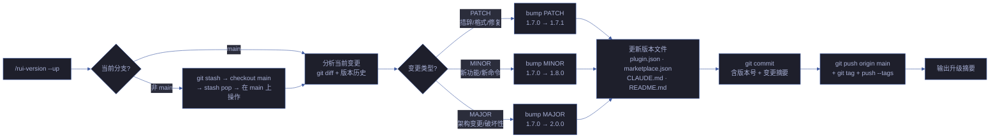
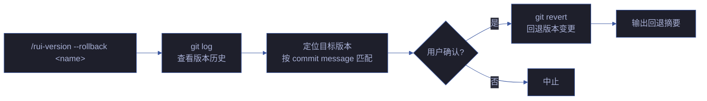

# rui-version

> 自主判定下一版本号，更新所有版本文件，git commit + auto-merge → main + push。
> **全自主操作，无需用户确认版本号。项目级和故事级统一入口。**
>
> `/rui version --up` 或 `/rui version --rollback <name>`（通过 rui 编排器调用）
> 或 `/rui-version --up` 或 `/rui-version --rollback <name>`

## version --up

### 版本判定规则

| 变更信号 | 版本升级 | 示例 |
|---------|---------|------|
| 仅文档措辞/格式调整 | PATCH | `1.30.0` → `1.30.1` |
| 新增 skill/agent/rule/命令 | MINOR | `1.30.0` → `1.31.0` |
| 删除/重命名命令或接口 | MINOR | `1.30.0` → `1.31.0` |
| 架构重构/破坏性变更 | MAJOR | `1.30.0` → `2.0.0` |

### 版本文件同步清单

| 文件 | 路径 | 字段 |
|------|------|------|
| plugin.json | `.claude-plugin/plugin.json` | `.version` |
| marketplace.json | `.claude-plugin/marketplace.json` | `.metadata.version` + `.plugins[0].version` |
| CLAUDE.md | `CLAUDE.md` | 项目画像表 `版本` 行 |
| README.md | `README.md` | 版本引用 |

## version --rollback

## 核心规则

| 约束 | 规则 |
|------|------|
| 不降级 | 新版本号必须 > 旧版本号 |
| 四文件同步 | plugin.json / marketplace.json / CLAUDE.md / README.md 版本号一致 |
| 不跳号 | 版本号严格递增 |
| git 强制 | 必须产生 git commit + tag |
| 仅 main | 在 main 分支上操作，推送目标为 origin/main |
| 工作区干净 | 执行前检查 `git status --porcelain`，有未提交变更时中止 |
| 回退需确认 | rollback 为破坏性操作，执行前必须用户确认 |

## 生效标志

| 标志 | 验证方式 |
|------|---------|
| 四文件版本号一致 | grep version 四文件 |
| git tag 已创建 | `git tag --list 'v*'` |
| 版本号严格递增 | 对比 version_history |

## 自循环

> 版本漂移检测。Agent 可按间隔检查全局版本一致性。

| 属性 | 值 |
|------|-----|
| 推荐间隔 | `0 9 * * 1`（每周一早 9 点） |
| 触发条件 | 有新的 git tag 或 commit 但 version_history 未更新 |
| 终止条件 | 四文件版本号一致且与 git tag 对齐 |
| 迭代动作 | 检查 plugin.json · CLAUDE.md · README.md · package.json → 对比版本号 → 不一致时提示 |
| 收敛判定 | 全局版本号一致且无漂移 |
