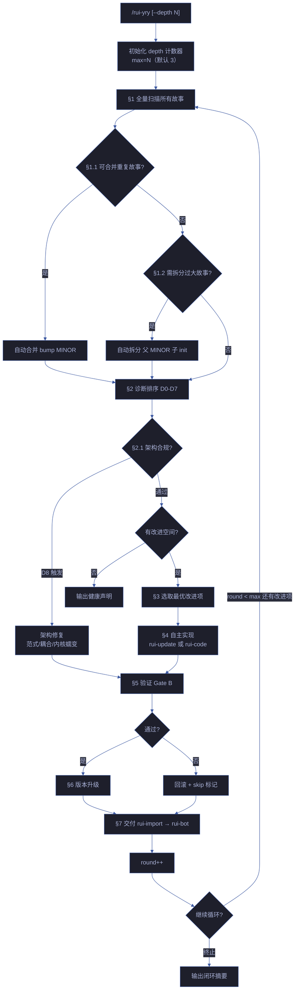

# rui-yry

> 自改进闭环：全自主扫描所有故事，诊断→实现→验证→版本升级，循环至无改进空间或达到 `--depth` 上限。
>
> **每个闭环自动为涉及的故事升级版本号**（语义化版本）。
>
> `/rui yry [--depth N]`（通过 rui 编排器调用）或 `/rui-yry [--depth N]`

## 子技能委托

rui-yry 是编排器，各阶段委托专门子技能，不自行实现任何子技能的逻辑：

| 阶段 | 委托技能 | 说明 |
|------|---------|------|
| §1 故事扫描与冲突检测 | rui-story | 远端 + 本地故事面板查询 |
| §1.1–§1.2 合并/拆分 | rui-story | 故事面板管理 |
| §2 文档更新 | rui-doc / rui-update | 增量文档修改 |
| §2.1 架构健康检测 | arch-check | D8 架构退化诊断 + 趋势持久化 |
| §3 代码实现 | rui-code | 源码变更管线（Gate A/B） |
| §4 趋势验证 | rui-trends | D5 诊断数据源 |
| §4 静态分析 | rui-analysis | D3/D5 代码健康度 |
| §5 报告生成 | rui-reporter | 过程报告与知识策展 |
| §6 版本升级 | rui-version | 故事级语义化版本号管理 |
| §7 交付同步 | rui-import + rui-bot | 文档同步 + 通知 |

## 自动合并与拆分

| 检测 | 条件 | 行为 |
|------|------|------|
| 自动合并 | 远端+本地存在内容重叠 ≥ 70% 的故事 | 保留信息量最大版本，bump MINOR |
| 自动拆分 | 故事含 ≥ 8 个 Story# 或 ≥ 15 个 FP# | 按 Story# 独立性拆分，父 bump MINOR，子 init 1.0.0 |

## 版本管理

每个故事维护语义化版本 `MAJOR.MINOR.PATCH`：

| 变更类型 | 版本升级 | 示例 |
|---------|---------|------|
| 措辞修正 / 格式调整 | PATCH (`1.0.0` → `1.0.1`) | T1 update |
| 增删功能 / 接口变更 | MINOR (`1.0.1` → `1.1.0`) | T2 update |
| 边界变化 / 架构重构 | MAJOR (`1.1.0` → `2.0.0`) | T3 update |

版本记录格式通过 json version_history 字段维护。

## 终止条件

优先顺序：

| 优先级 | 条件 | 说明 |
|--------|------|------|
| 1 | 达到深度上限 | `round >= --depth`（默认 3） |
| 2 | 无改进空间 | 所有 D0-D8 诊断通过，无待处理提案，架构 A 级 |
| 3 | 连续 3 轮无效 | 连续 3 轮无实质性变更 |
| 4 | 用户中断 | Ctrl+C |
| 5 | 阻断不可自愈 | `doc-p0` / `code-p0` / 架构 C 级以下需人工决策 |

## 核心规则

| 约束 | 规则 |
|------|------|
| 全自主 | 无用户交互，自动决策和实现 |
| 逐故事 | 每次闭环处理一个故事的一个改进项 |
| 分支隔离 | 每故事自动创建/切换到 `feat/<name>` |
| 版本强制 | 每次闭环完成必须 bump 版本号 |
| 防死循环 | 同一改进项失败 ≥ 2 次 → skip + 记录 |
| 架构合规 | 每轮闭环前运行 `node lib/arch-check.mjs --append-trend`，D8 触发时优先修复架构退化 |
| 内核守护 | 内核体积达 80% 阈值时，新增功能必须以扩展形式存在，禁止向内核添加代码 |
| 交付收口 | rui-import + rui-bot 手动触发 |

## 生效标志

| 标志 | 验证方式 |
|------|---------|
| D0–D8 诊断覆盖全部故事 | 诊断输出含每个故事的判定 |
| 架构合规 A/B 级 | `node lib/arch-check.mjs --short` 输出 A 级或 B 级 |
| 架构趋势已记录 | `.memory/arch-trend.jsonl` 含本轮条目 |
| 改进项有实现记录 | git log 含对应 commit |
| 版本号已升级 | version_history 有新条目 |
| 闭环摘要完整 | 含轮数、改进数、版本变更、耗时、架构等级 |
