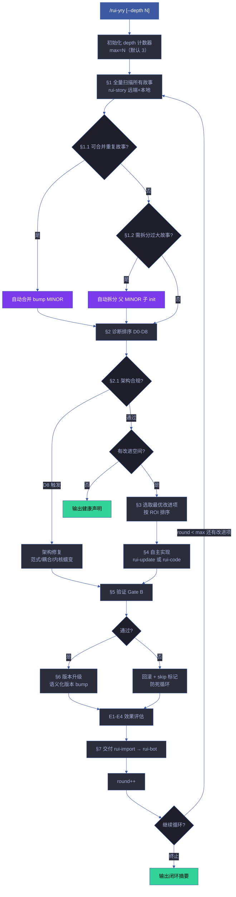
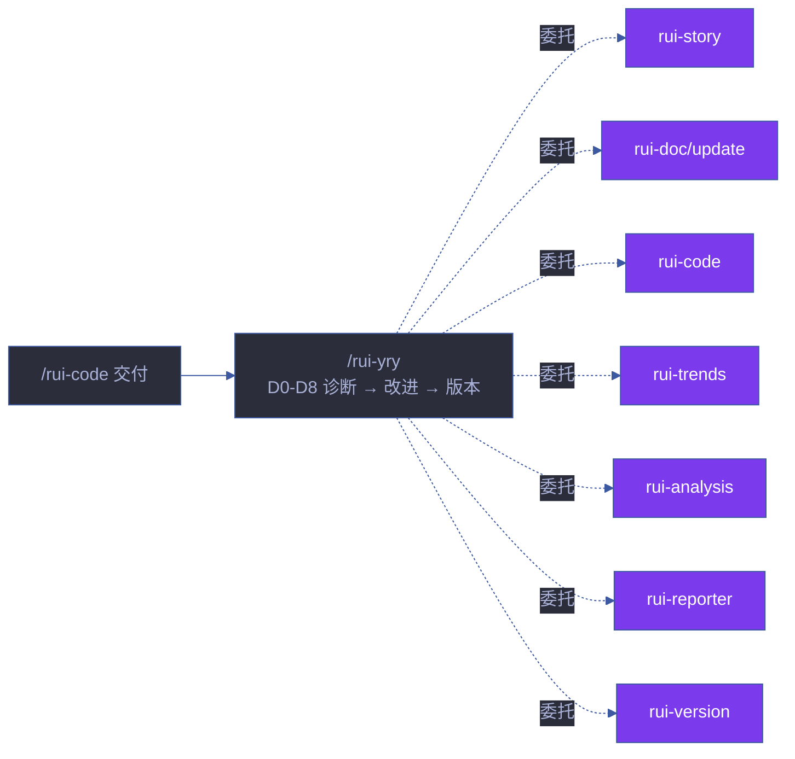

# rui-yry

> 自改进闭环：全自主扫描所有故事，诊断→实现→验证→版本升级，循环至无改进空间或达到 `--depth` 上限。
>
> **每个闭环自动为涉及的故事升级版本号**（语义化版本）。
>
> `/rui yry [--depth N]`（通过 rui 编排器调用）或 `/rui-yry [--depth N]`
>
> **单一职责**：自改进闭环编排。委托各子技能执行具体阶段。D0-D8 诊断定义引用 [rui-health](../rui-health/) 的权威诊断引擎，仅补充 D8（架构蠕变）这一编排器特有的诊断维度。

[子技能委托](#子技能委托) · [闭环全景](#闭环全景) · [D0-D8 诊断详解](#d0-d8-诊断详解) · [E1-E4 效果评估](#e1-e4-效果评估) · [自动合并与拆分](#自动合并与拆分) · [版本管理](#版本管理) · [终止条件](#终止条件) · [核心规则](#核心规则) · [生效标志](#生效标志)

## 子技能委托

rui-yry 是编排器，各阶段委托专门子技能，不自行实现任何子技能的逻辑：

| 阶段 | 委托技能 | 说明 |
|------|---------|------|
| §1 故事扫描与冲突检测 | rui-story | 远端 + 本地故事面板查询 |
| §1.1–§1.2 合并/拆分 | rui-story | 故事面板管理 |
| §2 文档更新 | rui-doc / rui-update | 增量文档修改 |
| §2.1 架构健康检测 | arch-check | D8 架构退化诊断 + 趋势持久化 |
| §3 代码实现 | rui-code | 源码变更管线（Gate A/B） |
| §4 趋势验证 | rui-trends | D5 诊断数据源 |
| §4 静态分析 | rui-analysis | D3/D5 代码健康度 |
| §5 报告生成 | rui-reporter | 过程报告与知识策展 |
| §6 版本升级 | rui-version | 故事级语义化版本号管理 |
| §7 交付同步 | rui-import + rui-bot | 文档同步 + 通知 |

## 闭环全景



## D0-D8 诊断详解

### 诊断层级

| 诊断 | 名称 | 检测内容 | 触发条件 | 严重度 | 修复策略 |
|------|------|---------|---------|--------|---------|
| **D0** | 配置漂移 | 配置文件与基线不一致 | config hash 变更 | Medium | 自动同步配置 |
| **D1** | 依赖退化 | 依赖版本过期或冲突 | 落后 ≥ 2 major | High | 自动升级依赖 |
| **D2** | 文件膨胀 | 项目体积超阈值增长 | 体积增长 > 20% | Medium | 拆分大文件 |
| **D3** | 复杂度退化 | 圈复杂度热点新增 | 新增 Extreme 文件 | High | 重构复杂模块 |
| **D4** | 测试覆盖退化 | 测试覆盖率下降 | 覆盖率下降 > 5% | High | 补充测试用例 |
| **D5** | 架构漂移 | 架构违规新增 | 新增边界违规 | Critical | 修复架构违规 |
| **D6** | 文档退化 | 文档过期或缺失 | 文档 mtime < 源码 commit | Medium | 更新文档 |
| **D7** | 流程退化 | 管线纪律违反 | 跳过 Gate A/B 或分支隔离 | Critical | 补全流程门禁 |
| **D8** | 架构蠕变 | 内核体积增长 + 范式违规 + 耦合恶化 | 内核行数 > 80% 阈值 | Critical | 架构重构 |

### 诊断优先级

```
优先级排序: D8 > D5 > D7 > D1 > D3 > D4 > D0 > D2 > D6
```

同一优先级内按触发次数降序排列。D8（架构蠕变）始终最高优先级 — 内核退化是不可逆的。

### D8 架构蠕变详解

**检测维度**：

| 维度 | 阈值 | 当前 vs 基线 | 触发条件 |
|------|------|------------|---------|
| 内核体积 | lib/ ≤ 20 文件 · 编排器 ≤ 500 行 | 对比 `.memory/arch-trend.jsonl` | 超阈值或增长 > 10% |
| 范式合规 | 无 class/extends · 无 export default · 无空 catch | `node lib/arch-check.mjs` | 新增违规 |
| 耦合恶化 | 技能间直接 import 数 | 依赖图对比 | 新增跨技能依赖 |
| 扩展隔离 | 新增 Skill 是否修改编排器 | 编排器 diff | 编排器行数增长 |

**修复策略**：

1. 内核体积超限 → 将非核心功能提取为独立技能
2. 范式违规 → 自动修复（class→函数、default→具名、空 catch→错误处理）
3. 耦合恶化 → 提取共享代码到 lib/，技能间通过编排器解耦
4. 扩展隔离破坏 → 回退编排器修改，改为扩展机制

## E1-E4 效果评估

每次闭环完成后评估改进效果：

| 评估 | 名称 | 评估内容 | 数据源 | 判定标准 |
|------|------|---------|--------|---------|
| **E1** | 即时效果 | 本次改进是否解决了目标问题 | 诊断状态变化 | 目标诊断从触发 → 未触发 |
| **E2** | 副作用 | 改进是否引入新问题 | 新增诊断触发 | 0 新增诊断 = 无副作用 |
| **E3** | 趋势影响 | 改进对长期趋势的影响 | health-trend.jsonl | 综合分趋势方向 |
| **E4** | 经验价值 | 改进是否可技能化 | 模式重复性 | ≥ 2 次同类改进 = 可技能化 |

### 评估流程

```
每次闭环:
  1. E1: 对比改进前后的诊断状态
  2. E2: 检查是否触发新的诊断
  3. E3: 每 3 次闭环评估一次趋势
  4. E4: 检测改进模式是否可泛化

E4 触发经验技能化:
  → 同一诊断触发 ≥ 2 次
  → 同一修复模式应用 ≥ 2 次
  → 生成技能化提案 → 物化为故事 → 进入管线
```

## 自动合并与拆分

| 检测 | 条件 | 行为 | 版本处理 |
|------|------|------|---------|
| 自动合并 | 远端+本地存在内容重叠 ≥ 70% 的故事 | 保留信息量最大版本，合并补充信息 | bump MINOR |
| 自动拆分 | 故事含 ≥ 8 个 Story# 或 ≥ 15 个 FP# | 按 Story# 独立性拆分，每子故事 ≤ 5 个 Story# | 父 bump MINOR，子 init 1.0.0 |

### 合并算法

```
1. 提取两个故事的所有 FP#
2. 计算 Jaccard 相似度 = |A ∩ B| / |A ∪ B|
3. Jaccard ≥ 0.7 → 合并
4. 保留信息量更大的版本（FP# 更多、文档更完整）
5. 将另一版本的特有信息合并入保留版本
6. 删除被合并的故事目录
```

### 拆分算法

```
1. 按 Story# 分组，计算组间 FP# 重叠
2. 组间重叠 < 30% → 可独立拆分
3. 每组 FP# ≤ 5 → 拆分为独立故事
4. 每组 FP# > 5 → 继续递归拆分
5. 子故事继承父故事的 AC 和场景
```

## 版本管理

每个故事维护语义化版本 `MAJOR.MINOR.PATCH`：

| 变更类型 | 版本升级 | 示例 | 触发场景 |
|---------|---------|------|---------|
| 措辞修正 / 格式调整 | PATCH (`1.0.0` → `1.0.1`) | T1 update | D0/D6 修复 |
| 增删功能 / 接口变更 | MINOR (`1.0.1` → `1.1.0`) | T2 update | D1/D2/D3/D4 修复 |
| 边界变化 / 架构重构 | MAJOR (`1.1.0` → `2.0.0`) | T3 update | D5/D7/D8 修复 |

版本记录通过 `version_history` JSON 字段维护：

```json
{
  "version_history": [
    { "version": "1.0.0", "date": "2026-06-01", "type": "init", "description": "初始版本" },
    { "version": "1.0.1", "date": "2026-06-10", "type": "patch", "description": "D0: 修复配置漂移" },
    { "version": "1.1.0", "date": "2026-06-15", "type": "minor", "description": "D3: 重构复杂模块" }
  ]
}
```

## 典型闭环示例

> 以下展示一个完整的自改进闭环周期，从诊断触发到版本升级。

```
第 1 轮闭环:
  §1 扫描: rui-story 查询远端 → 3 个活跃故事
  §2 诊断: D0-D8 全量诊断
    D3 触发: skills/rui-bot/lib/loop-report.mjs 圈复杂度 85 → 拆分建议
    D6 触发: docs/健康报告/index.html 落后源码 12 天
  §3 排序: D3 (High) > D6 (Medium) → 选取 D3
  §4 实现: rui-code → Gate A (测试设计) → 拆分 loop-report.mjs → Gate B (验证通过)
  §5 验证: Gate B 1 轮通过
  §6 版本: rui-version → 1.4.0 → 1.5.0 (MINOR: 模块拆分)
  E1-E4: E1✅ (D3 恢复) · E2✅ (无新增诊断) · E3→ (趋势稳定) · E4✅ (拆分模式可复用)

第 2 轮闭环:
  §1 扫描: 3 个活跃故事 (1 个已更新)
  §2 诊断: D6 仍触发 (文档过期)
  §3 排序: D6 → 选取
  §4 实现: rui-update T1 → 刷新文档 mtime
  §5 验证: 无需 Gate B (T1 无代码变更)
  §6 版本: 1.5.0 → 1.5.1 (PATCH: 文档刷新)
  E1-E4: E1✅ (D6 恢复) · E2✅ · E3→ · E4→ (单次文档刷新，无需技能化)

第 3 轮闭环:
  §2 诊断: 全部 D0-D8 通过 ✅
  → 输出健康声明，终止循环
```

## 终止条件

优先顺序：

| 优先级 | 条件 | 说明 | 恢复方式 |
|--------|------|------|---------|
| 1 | 达到深度上限 | `round >= --depth`（默认 3） | 增大 `--depth` 重新运行 |
| 2 | 无改进空间 | 所有 D0-D8 诊断通过，无待处理提案，架构 A 级 | 等待新的退化信号 |
| 3 | 连续 3 轮无效 | 连续 3 轮无实质性变更（无版本号升级） | 人工审查诊断准确性 |
| 4 | 用户中断 | Ctrl+C | 重新运行从中断点续 |
| 5 | 阻断不可自愈 | `doc-p0` / `code-p0` / 架构 C 级以下需人工决策 | 人工介入修复后继续 |

## 核心规则

| 约束 | 规则 | 设计理由 |
|------|------|---------|
| 全自主 | 无用户交互，自动决策和实现 | 减少人工干预，提高效率 |
| 逐故事 | 每次闭环处理一个故事的一个改进项 | 变更粒度可控 |
| 分支隔离 | 每故事自动创建/切换到 `feat/<name>` | 分支隔离不可绕过 |
| 版本强制 | 每次闭环完成必须 bump 版本号 | 变更可追溯 |
| 防死循环 | 同一改进项失败 ≥ 2 次 → skip + 记录 | 避免无限循环 |
| 架构合规 | 每轮闭环前运行 `node lib/arch-check.mjs --append-trend`，D8 触发时优先修复 | 架构退化不可逆 |
| 内核守护 | 内核体积达 80% 阈值时，新增功能必须以扩展形式存在 | 防止内核膨胀 |
| 交付收口 | rui-import + rui-bot 手动触发 | 交付可控制 |

## 降级策略

| 情况 | 降级行为 | 恢复方式 |
|------|---------|---------|
| 无改进空间 | 输出健康声明，终止循环 | 等待新的退化信号 |
| 达到 depth 上限 | 输出当前进度摘要，标注 `depth-limit` | 增大 `--depth` 重新运行 |
| 同一改进项失败 ≥ 2 次 | skip + 记录到 skip-list，防死循环 | 人工审查后手动修复 |
| 架构等级降至 C 以下 | 优先修复架构，暂停其他改进 | 架构修复后继续 |
| 子技能执行失败 | 记录阻断标识，跳过当前改进项 | 下一轮重试 |
| 数据采集失败 | 输出 `no-metrics` 降级，不阻断闭环 | 下次执行时补充数据 |
| 分支隔离失败 | 跳过当前故事，处理下一个 | 切到正确分支后重试 |

## 测试

> 自改进闭环的 D0-D8 诊断触发、E1-E4 效果评估、自动合并/拆分算法和版本管理的自动化验证。

### 运行测试

```bash
npx vitest run skills/rui-yry/tests/          # 全量运行
npx vitest skills/rui-yry/tests/              # 监听模式
npx vitest run --coverage skills/rui-yry/tests/  # 覆盖率报告
```

### 测试文件

| 文件 | 测试范围 | 类型 |
|------|---------|:---:|
| `tests/rui-yry.test.mjs` | 闭环流程、诊断触发、效果评估、合并/拆分算法 | 单元 |

### 测试策略

| 层级 | 范围 | 要求 |
|------|------|------|
| **诊断测试** | D0-D8 每个诊断的触发条件、优先级排序 | 触发/不触发双路径 |
| **评估测试** | E1-E4 效果评估判定逻辑 | 每级有正反例 |
| **算法测试** | 故事合并 Jaccard 相似度、拆分 FP# 分组 | 已知输入 → 预期输出 |
| **终止条件测试** | 深度上限、无改进空间、连续无效、阻断不可自愈 | 每种终止条件有测试 |

### 覆盖要求

| 维度 | 最低阈值 | 目标 |
|------|:---:|:---:|
| D0-D8 诊断 | 100% | 9 个诊断各有触发测试 |
| E1-E4 评估 | 100% | 4 级评估各有测试 |
| 合并/拆分算法 | 100% | 边界条件覆盖 |
| 终止条件 | 100% | 5 种终止条件各有测试 |

## 规则

- [self-improve.md](./rules/self-improve.md) —   - "docs/故事任务面板/**/.improvement/**"
## 生效标志

| 标志 | 验证方式 | 预期行为 |
|------|---------|---------|
| D0-D8 诊断覆盖全部故事 | 诊断输出含每个故事的判定 | 每故事至少 1 条诊断结果 |
| 架构合规 A/B 级 | `node lib/arch-check.mjs --short` 输出 A 级或 B 级 | 无 Critical 违规 |
| 架构趋势已记录 | `.memory/arch-trend.jsonl` 含本轮条目 | 趋势数据可回溯 |
| 改进项有实现记录 | git log 含对应 commit | commit message 含诊断编号 |
| 版本号已升级 | version_history 有新条目 | 版本号严格递增 |
| E1-E4 评估完成 | 闭环摘要含评估结果 | 四维评估全覆盖 |
| 闭环摘要完整 | 含轮数、改进数、版本变更、耗时、架构等级 | 摘要可独立阅读 |

## 与 rui 的关系

`/rui-yry` 是 rui 编排管线的自改进闭环阶段。由 `/rui yry` 路由触发，在 `/rui code` 交付后运行。rui-yry 是编排器——委托 rui-story、rui-doc、rui-code、rui-trends、rui-analysis、rui-health、rui-reporter、rui-version 等子技能执行具体阶段，不自行实现子技能逻辑。

