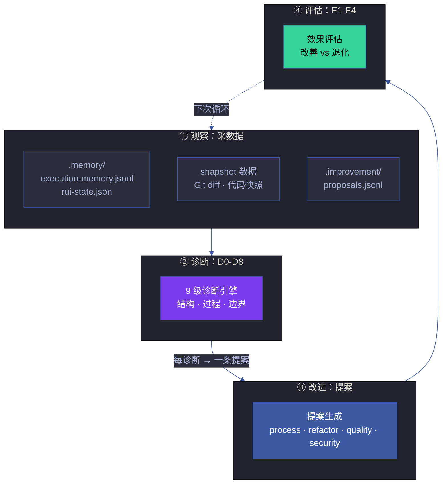
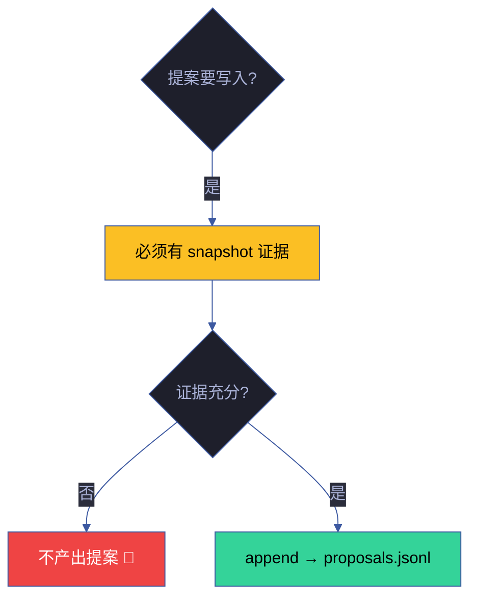
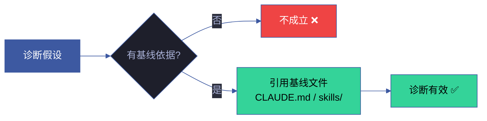
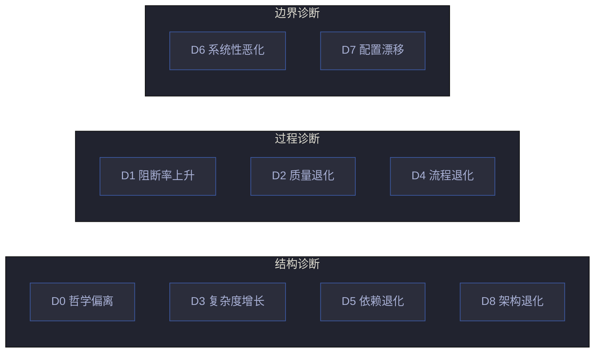
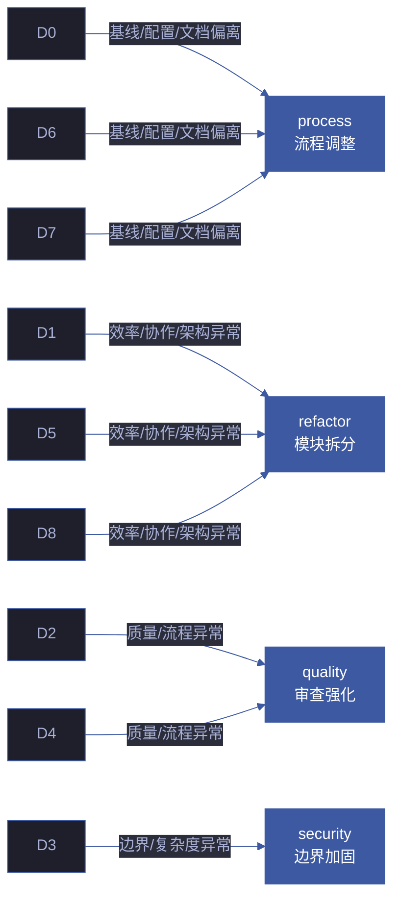
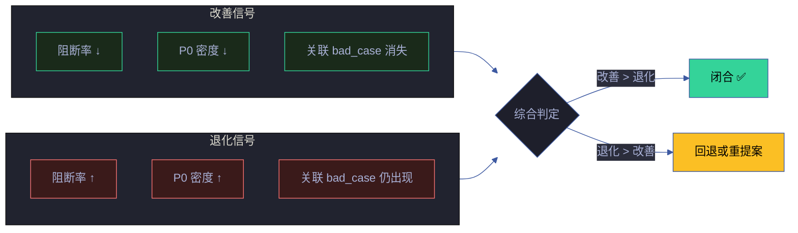
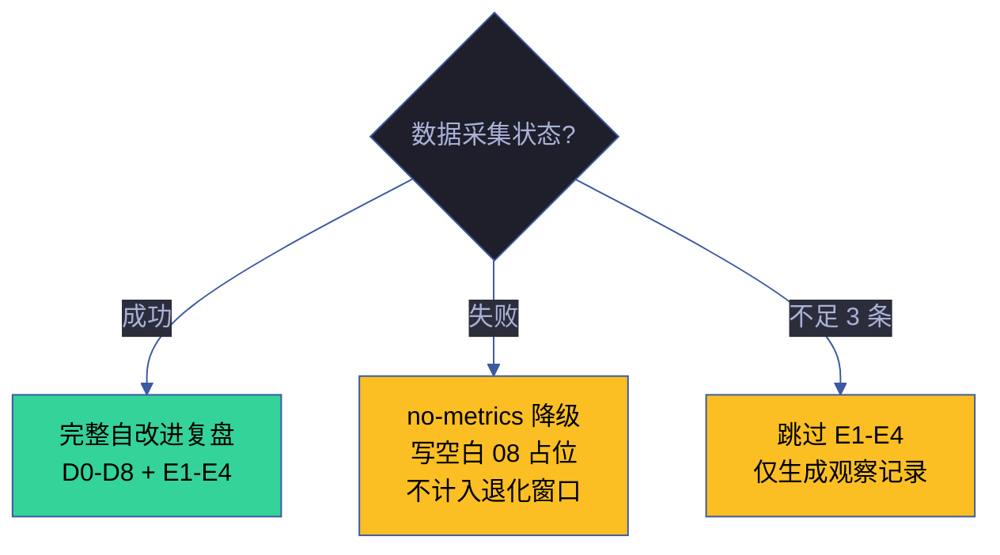
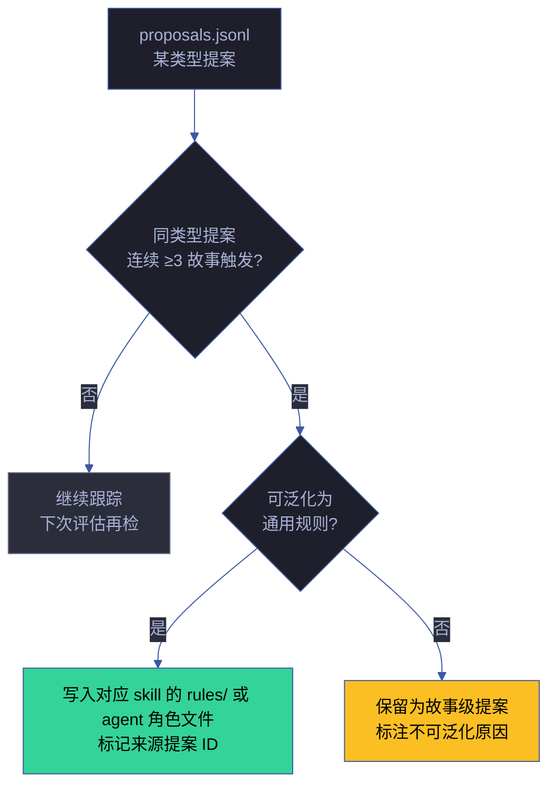

---
paths:
  - "docs/故事任务面板/**/.improvement/**"
  - "docs/故事任务面板/**/.memory/**"
---

# self-improve

> 无 snapshot 不出提案，诊断以基线为锚，单次执行不阻断主流程。

[闭环全景](#闭环全景) · [适用](#适用) · [数据要求](#数据要求) · [诊断基准](#诊断基准) · [诊断规则 D0-D8](#诊断规则-d0-d8) · [效果评估 E1-E4](#效果评估-e1-e4) · [降级处理](#降级处理) · [经验技能化](#经验技能化) · [记忆压缩与注入](#记忆压缩与注入) · [例外](#例外) · [生效标志](#生效标志)

## 闭环全景



| 阶段 | 输入 | 输出 | 阻断? | 关键约束 |
|------|------|------|:---:|------|
| ① 观察 | 基线 + 执行记忆 + Git diff + proposals | 偏差信号 | 否 | 数据不足 → 降级 |
| ② 诊断 | 偏差信号 × 基线文件 | D0-D8 判定表 | 否 | 无基线依据 → 不成立 |
| ③ 改进 | 诊断结论 | proposals.jsonl（append-only） | 否 | 无 snapshot → 不产出 |
| ④ 评估 | proposals.jsonl + 前后记忆 | E1-E4 闭合/退化 | 否 | 数据不足 3 条 → 跳过 |

**可执行工具**: `node lib/proposals.mjs` — D0-D8 诊断引擎 + 提案生成 + E1-E4 评估。`node skills/rui-story/collect.mjs` — 指标采集 + 异常检测。

## 适用

每个故事走完管线后产出自改进复盘文档，并向 `proposals.jsonl` 追加诊断结果。

## 数据要求



| # | 规则 | 反例 | 设计理由 |
|---|------|------|---------|
| 1 | 提案必须有 snapshot 证据支撑，无数据不产出 | "建议优化性能" — 无耗时数据 | 验现实：无证据不决策 |
| 2 | `proposals.jsonl` append-only，状态变更通过新增条目而非覆盖 | 修改已闭合提案的历史记录 | 审计可追溯 |
| 3 | 效果评估需前后各 ≥ 3 条记忆 | 仅 1 条记忆就声称"改进有效" | 统计显著性 |
| 4 | `no-metrics` 降级不阻断交付（写空白 08 占位） | 数据采集失败后跳过整个自改进阶段 | 不阻断主流程 |
| 5 | 单次执行，不阻断主流程 | 因诊断耗时过长卡住交付 | 自改进是辅助，不是门禁 |

### Snapshot 证据类型

| 证据类型 | 来源 | 示例 |
|---------|------|------|
| 耗时数据 | execution-memory.jsonl | `Gate A 耗时 45s（基线 15s）` |
| P0 统计 | rui-state.json | `P0 密度 2.3/故事（基线 0.8）` |
| 阻断事件 | execution-memory.jsonl | `连续 3 故事出现 chain-broken` |
| 架构合规 | arch-check 输出 | `D8 触发：内核行数增长 15%` |
| 测试数据 | 测试报告 | `覆盖率从 85% 降至 72%` |

## 诊断基准



| # | 规则 | 反例 | 正确做法 |
|---|------|------|---------|
| 6 | 诊断以基线文件为判定基准（CLAUDE.md / `skills/`） | 凭经验判断"复杂度太高" | 引用 `code-pipeline.md` 的复杂度阈值 |
| 7 | 每条假设必须引用基线文件作为依据 | "推测是测试覆盖不足" — 未引用基线 | 引用 `code-pipeline.md` Gate A 测试先行要求 |

## 诊断规则 D0-D8



### 诊断详情

| # | 信号 | 假设 | 置信度 | 基线依据 | 严重度 |
|---|------|------|:---:|---------|:---:|
| **D0** | 执行与基线冲突 | 哲学偏离 | ≥1 条记忆 | CLAUDE.md · AGENT.md | Critical |
| **D1** | 阻断率 > 20% | 预处理不充分 | ≥5 条记忆 | code-pipeline.md | High |
| **D2** | P0 密度 > 均值 2× | 设计遗漏 | ≥3 条记忆 | doc-generation.md | High |
| **D3** | T3 占比 > 30% | 需求边界模糊 | ≥3 条记忆 | pm.md（故事拆分） | Medium |
| **D4** | Gate B > 2 轮 | 测试先行不足 | Gate B 计数 | code-pipeline.md | High |
| **D5** | 阶段耗时 > 均值 3× | Agent 协作瓶颈 | ≥3 条记忆 | AGENT.md | Medium |
| **D6** | 连续 2 窗口退化 | 系统性恶化 | retro 分析 | CLAUDE.md | High |
| **D7** | 提案闭合率 < 50% | 改进项不可执行 | ≥5 个提案 | 本规则 | Medium |
| **D8** | 架构合规未通过 | 架构退化 | ≥1 条记忆 | architecture-principles.md | Critical |

### 诊断 → 提案路由



| 诊断组 | 触发信号 | 提案类型 | 示例 |
|--------|---------|---------|------|
| D0 / D6 / D7 | 基线偏离 / 文档过时 / 配置漂移 | `process` | "Gate A 阶段耗时 3x 基线，建议增加预检脚本" |
| D1 / D5 / D8 | 阻断率上升 / 阶段耗时异常 / 架构退化 | `refactor` | "架构合规 B 级，存在范式违规，重构为纯函数 + 具名导出" |
| D2 / D4 | P0 密度上升 / Gate B 多轮 | `quality` | "P0 密度连续 3 故事上升，建议 coder 自审查加 SQL 注入项" |
| D3 | T3 占比高 / 需求边界模糊 | `security` | "第三方脚本无 SRI，建议添加 integrity 校验" |

## 效果评估 E1-E4



### 评估矩阵

| # | 指标 | 改善 | 退化 | 数据源 | 判定窗口 |
|---|------|------|------|--------|:---:|
| **E1** | 阻断率 | 后 < 前 | 后 > 前 | execution-memory.jsonl | 前后各 3 故事 |
| **E2** | P0 密度 | 后 < 前 | 后 > 前 | rui-state.json | 前后各 3 故事 |
| **E3** | 关联 bad_case | 消失 | 仍出现 | execution-memory.jsonl | 同一类型阻断 |
| **E4** | 综合 | 改善 > 退化 | 退化 > 改善 | 加权综合 | 全维度 |

### 综合判定公式

```
E4 = (E1_score × 0.3 + E2_score × 0.3 + E3_score × 0.4)

E1_score = 后阻断率 < 前阻断率 ? 1 : -1
E2_score = 后P0密度 < 前P0密度 ? 1 : -1
E3_score = bad_case消失 ? 1 : -1

E4 > 0 → 闭合 ✅
E4 < 0 → 回退或重提案
E4 = 0 → 观察中，需更多数据
```

## 降级处理



## 经验技能化

> 从执行经验中创建 skill，使用中自我优化。当同一改进模式反复触发 → 从一次性提案升级为持久规则。



| 提案类型 | 升级条件 | 升级目标 | 示例 |
|---------|---------|---------|------|
| `process` | 连续 3 故事触发 | `skills/rui-code/rules/code-pipeline.md` | "Gate A 阻断原因 80% 是影响链断裂 → 升级为 P0 必检项" |
| `quality` | 连续 3 故事触发 | `skills/rui/tester.md` 或 `skills/rui/coder.md` | "P0 密度上升根因是 SQL 注入 → 升级为 coder 自审查清单" |
| `refactor` | 连续 3 故事触发 | `skills/rui-code/rules/code-pipeline.md` §深度模块 | "某文件 3 次膨胀 → 升级为模块行数上限规则" |
| `security` | 当前故事即修 | `skills/rui/security.md` | "新类型注入 → 升级为威胁建模新增检查项" |
| `skill` | 连续 2 故事触发 | `skills/` 新条目 | "Agent 反复犯同类错误 → 创建专项 Red Flag 或检查规则" |

## 记忆压缩与注入

> AI 压缩 + 相似检索模式，结合基准评估方法。


| 记忆类型 | 压缩方式 | 保留窗口 | 注入触发 | 注入内容 |
|---------|---------|:---:|---------|---------|
| 阻断事件 | 根因 + 解决方式摘要 | 12 故事 | 同类型阻断复现 | 历史修复方案 |
| P0 记录 | 完整模式 + 修复 diff | 6 故事（修复后） | 相似模块变更 | 历史 P0 模式 |
| 提案效果 | 效果评估 + 关联 bad_case | 3 故事（闭合后归档） | 新提案起草 | 历史效果评估 |
| 阶段耗时 | 均值/方差/趋势 | 滚动 12 窗口 | 自改进阶段 | 基线对比数据 |

## 例外

| 场景 | 处理 | 影响 |
|------|------|------|
| 数据采集失败 | `no-metrics` 标识，写降级版自改进复盘（标注无数据），不计入退化窗口 | 不阻断交付 |
| 单故事数据不足 3 条 | 跳过 E1-E4，仅生成观察记录 | 评估不完整 |
| 经验技能化触发但目标文件已含类似规则 | 更新现有规则（标注来源提案），不重复创建 | 规则合并 |
| 诊断假设无基线依据 | 不成立，记录观察但不产出提案 | 诊断降级 |

## 生效标志


| 标志 | 未达标的处置 |
|------|------------|
| 每条提案有 snapshot 证据支撑 | 补数据或删无证据提案 |
| D0-D8 诊断引用基线文件 | 补基线引用，空缺标 `> 待补充` |
| proposals.jsonl append-only | 恢复被覆盖条目，以 jsonl 为准 |
| E1-E4 闭合或标注退化/降级 | 补评估结论，不得留空 |