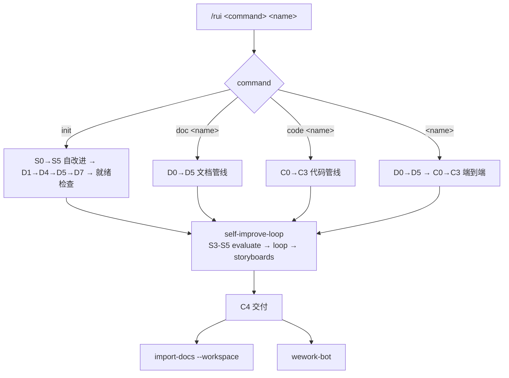
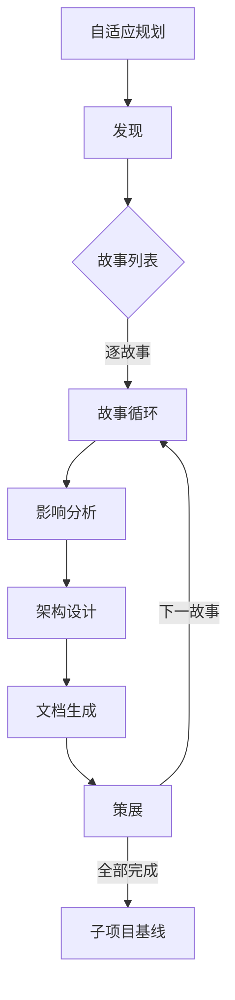
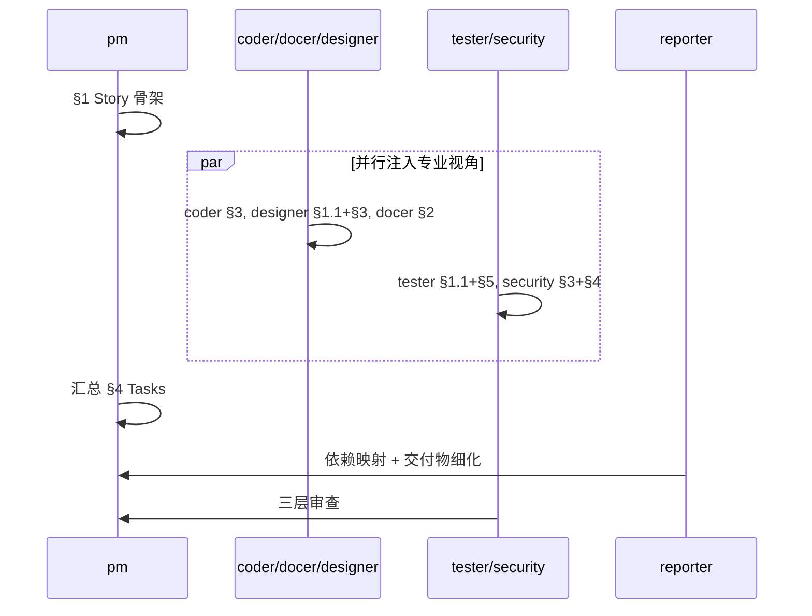
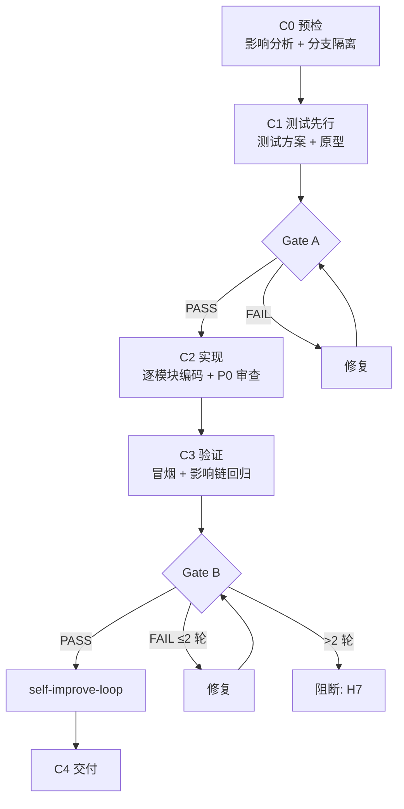
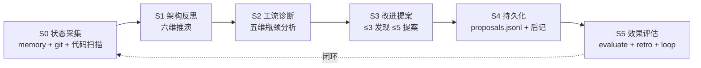
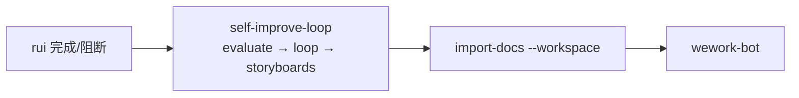

# rui

故事驱动 SDLC 编排器。每个需求提炼为故事，拆解为子项目任务调度执行。



---

## 命令

| 命令 | 意图 | 流程 |
|------|------|------|
| `/rui init` | 初始化项目 | S0→S5 → D1→D4→D5→D7 → 就绪检查 → self-improve-loop → C4 |
| `/rui doc <name>` | 写文档 | D0→D1→D2→D3→D4→D5 → self-improve-loop → C4 |
| `/rui code <name>` | 写代码 | C0→C1→C2→C3 → self-improve-loop → C4 |
| `/rui <name>` | 端到端（默认） | D0→D5 → C0→C3 → self-improve-loop → C4 |

### init

初始化项目：自改进全量 → 发现 → 基线文档 → 子项目基线 → 就绪检查 → self-improve-loop。已有文档时增量更新。

| 阶段 | 产出 | 验证 |
|------|------|------|
| S0→S5 自改进 | proposals.jsonl + health score | proposals.jsonl 存在 |
| D1 发现 | 项目全景 + 故事清单 | storyboards/ 非空 |
| D4 生成 | 基线故事板 | storyboards/ 非空 |
| D5 策展 | git commit | git log 有 commit |
| D7 基线 | CLAUDE.md + README.md + design-system.md | 三文件存在 |
| 就绪检查 | 全部 ✅ | 7 项通过 |
| self-improve-loop | 采集数据 → 生成改进清单 + 架构演进 → 追加到 storyboards | .loop-state.json 更新 |

### doc

写文档：规划 → 发现 → 影响分析 → 架构 → 生成 → 策展 → self-improve-loop。故事板已有时增量更新。

### code

写代码：预检 → 测试先行 → 实现 → 验证 → self-improve-loop。需有对应故事板（`docs/storyboards/<name>.md`），否则阻断。

### help

**`/rui help`** — 概览：

```
rui — 故事驱动 SDLC 编排器

用法: /rui <command> [name]

命令:
  init              初始化项目
  doc <name>        写文档（D0→D5 → self-improve-loop）
  code <name>       写代码（C0→C3 → self-improve-loop）
  <name>            端到端（D0→D5→C0→C3 → self-improve-loop）

示例:
  /rui init
  /rui doc user-login
  /rui code user-login
  /rui user-login
```

**`/rui help <command>`** — 详情：流程 / 适用 / 前置 / 阻断 / 示例。`/rui help help` 额外显示参数 `[command]`。

### 交互确认

- **需确认**: `init`、`/rui <name>`
- **直接执行**: `doc`、`code`

---

## 管线

### 文档管线 D0–D5

以故事为原子单位驱动，D1–D5 逐故事循环，7 agent 按故事内容注入。



| 阶段 | 做什么 | 关键产出 |
|------|--------|---------|
| D0 自适应规划 | 读取执行记忆，判定 T1/T2/T3 变更级别 | 执行计划 |
| D1 发现 | 检索规范与已有文档；技术选型时并行搜索；扫描 UI 设计资产；提炼故事列表 | 规范列表 + 故事列表 |
| D2 影响分析 | 逐故事全项目影响链分析，闭合所有依赖 | 闭合影响链 |
| D3 架构设计 | 逐故事模块划分、接口规范、数据流设计 | 架构设计 |
| D4 文档生成 | 逐故事 7 agent 协作编写 | 故事板文档 × N |
| D5 策展 | 逐故事 git commit + 执行记忆回写 + 后记（§6 §7）；完成后触发 self-improve-loop | 已保存文档 + loop 报告 |
| D7 子项目基线 | 仅 init：生成 CLAUDE.md + README.md + design-system.md | 三文件 × N |

#### D4 Agent 协作



| Agent | 负责章节 | 注入条件 |
|-------|---------|---------|
| pm | §1 Story + §4 Tasks | 始终 |
| docer | §2 Requirements + §3 概要 | 始终 |
| coder | §3 Design + §4 实现任务 | 始终 |
| tester | §1.1 用户操作 + §5 AC | 始终 |
| reporter | §4 依赖映射 + 交付物细化 | 始终 |
| designer | §1.1 UI交互流 + §3 UI设计规范 | 涉及 UI 改造 |
| security | §3 安全约束 + §4 安全任务 | 涉及用户输入/外部API/认证/持久化 |

#### 增量裁剪

| 级别 | 触发条件 | D2 | D3 | D4 |
|------|---------|----|----|-----|
| T1 微观 | 措辞、格式修正 | 跳过 | 跳过 | 仅变更章节 |
| T2 局部 | 增删故事/接口变更 | 裁剪 | 裁剪 | 重写目标+下游 |
| T3 范围 | 范围边界变化、跨故事重构 | 完整重跑 | 完整重跑 | 全级联刷新 |

### 代码管线 C0–C3



| 阶段 | 做什么 | 规则 |
|------|--------|------|
| C0 预检 | 双边影响分析 + 分支隔离（`feat/<name>` / `docs/<name>`） | H10: 必须在功能分支 |
| C1 测试先行 | Gate A：测试方案+原型，单行 CSS 可跳过 | H6: Gate A 未过不得编码 |
| C2 实现 | 逐模块编码，每模块后审查：P0 必须修 / P1 建议修 / P2 可选 | P0 未清零不进下一模块 |
| C3 验证 | Gate B：环境快照 → 静态预检 → 对齐 → 单次执行 | H7: >2 轮修复阻断 C4 |

### 自改进 S0–S5（内建，全自动）

静默运行，不阻断主流程。脚本位于 `skills/rui/scripts/`。



| rui 阶段 | 触发 | 脚本 |
|---------|------|------|
| init | S0→S5 全量 | `self-improve.js snapshot/health` → `execution-memory.js stats/trends` |
| D2 / C0 | S1 架构反思 | 基于影响链做六维推演，产出 s1_metrics |
| D5 / C3 | S2 工流诊断 | `execution-memory.js trends`，产出 s2_metrics |
| C4 | self-improve-loop | `self-improve.js evaluate/retro` → `loop.js run --all` |

**proposals.jsonl**: `docs/.improvement/proposals.jsonl`（append-only），含 id/date/priority/type/title/evidence/s1_metrics/s2_metrics/status/eval_result。

### C4 交付



| Step | Skill | 操作 | 失败处理 |
|------|-------|------|---------|
| 1 | self-improve-loop | `self-improve.js evaluate` → `loop.js run --all` | 失败不阻断 |
| 2 | import-docs | `import-docs.js --workspace` | H9: token 缺失时跳过 |
| 3 | wework-bot | `send-message.js` | 不可跳过 |

导入范围（workspace 自动检测）：根 `.claude/`（全部，排除 .git） + 根 `docs/`（.md） + 子项目 `.claude/` + `docs/` + `CLAUDE.md` + `README.md`。

---

## 文档规范

```
<workspace-root>/
└── docs/
    ├── .improvement/proposals.jsonl
    ├── .memory/
    │   ├── execution-memory.jsonl
    │   └── rui-state.json
    ├── shared/
    │   ├── architecture.md
    │   └── contracts.md
    └── storyboards/
        └── <name>.md    ← 唯一真相源
```

### 故事板章节

| 章节 | 负责人 | 内容 |
|------|--------|------|
| §1 Story | pm | 角色场景、价值、范围边界、依赖 |
| §1.1 User Operations | tester + designer | 用户操作 + UI交互流程 |
| §2 Requirements | docer | 功能点、输入输出、错误行为、业务规则 |
| §3 Design | coder + designer + security | 技术设计 + UI规范 + 安全约束 |
| §4 Tasks | pm + all | 任务拆解、依赖、交付物 |
| §5 Acceptance Criteria | tester | 验收标准、测试方法、预期结果 |
| §6 .claude 改进清单 | pm | skill/agent/rule/script/config 改进项（D4/D5 静态分析） |
| §7 系统架构演进任务 | pm | 近期/中期/远期演进路线（D3/D5 结构规划） |
| §L 自我改进循环 | self-improve-loop | 数据驱动的改进清单 + 架构演进（每次 rui 完成时自动追加） |

> §6 §7 由 pm 在文档生成阶段写入，提供结构性改进方向。§L 由 self-improve-loop 在每次 rui 完成时自动追加，提供运行时健康趋势和自动化建议——两者互补。

≤10 故事/板，依赖用 `[story-name](./story-name.md)` 声明，超出拆分 `<name>-2.md`。

### init 就绪检查

| # | 检查项 | 验证 |
|---|-------|------|
| 1 | proposals.jsonl 存在 | `test -f` |
| 2 | 子项目 storyboards/ 目录存在 | `test -d` |
| 3 | 子项目 CLAUDE.md 存在且非空 | `wc -l` |
| 4 | 子项目 README.md 存在且非空 | `wc -l` |
| 5 | 前端子项目 design-system.md 存在且非空 | `wc -l` |
| 6 | proposals.jsonl 无已解决但仍 open 的提案 | grep |
| 7 | UI 故事有 designer 注入内容 | grep |

---

## 故事驱动规则

故事是跨子项目任务调度的原子单位：用户可感知 → AC 可验证 → 跨项目可拆解。pm 从 AC 拆解任务 → 按子项目分配 → 标注依赖和 agent → 写入对应 storyboard。self-improve-loop 在每次 rui 完成后采集健康数据，生成改进清单和架构演进任务追加到所有故事板，闭合改进反馈环。

---

## 核心规则

1. **增量更新**: 已有文档按 T1/T2/T3 裁剪
2. **测试先行**: Gate A 阻断 C2；Gate B >2 轮修复阻断 C4
3. **逐模块审查**: C2 每模块后审查，P0 清零前进
4. **双边影响**: C0 同时分析代码和文档影响
5. **分支隔离**: C0 创建功能分支，C4 合并回主干
6. **知识沉淀**: D5 写执行记忆 + `rui-state.json`
7. **C4 必触发**: self-improve-loop → import-docs → wework-bot
8. **自改进内建**: D2/C0→S1, D5/C3→S2, C4→self-improve-loop
9. **故事看板持久化**: 故事和任务状态写入对应 storyboard
10. **交互确认**: init 和全流程需确认，doc/code 直接执行

## 阻断

| # | 场景 | 降级 | 阶段 |
|---|------|------|------|
| H1 | 功能名称无法解析 | 否 | D0 |
| H2 | P0 章节缺少上游来源 | 否 | D4, C0 |
| H3 | 影响链无法闭合 | 否 | D2, C0 |
| H4 | 文档 P0 不通过且无法自修复 | 否 | D4 |
| H5 | 代码审查 P0 无法修复 | 否 | C2 |
| H6 | Gate A 未完成但已编码 | 否 | C1→C2 |
| H7 | Gate B >2 轮修复未通过 | 否 | C3→C4 |
| H8 | 所有模块被阻断 | 否 | C2 |
| H9 | `API_X_TOKEN` 缺失 | 是 | C4 |
| H10 | main/master 上未创建功能分支 | 否 | C0 |
| H11 | self-improve-loop 数据采集失败 | 是（降级） | self-improve-loop |

阻断后: `rui-state.js save --blocked` → 持久化 → 同步（H9/H11 跳过）→ 通知。

---

## 集成点

- **自改进循环**: [`self-improve-loop`](../self-improve-loop/SKILL.md)
- **文档同步**: `node .claude/skills/import-docs/scripts/import-docs.js --workspace`
- **通知**: `wework-bot`
- **自改进**: `node .claude/skills/rui/scripts/self-improve.js <cmd>`
- **执行记忆**: `node .claude/skills/rui/scripts/execution-memory.js`
- **断点**: `node .claude/skills/rui/scripts/rui-state.js <save|load|clear>`
- **Agent**: [`.claude/agents/AGENT.md`](../../agents/AGENT.md)
- **模板**: [`templates/feature-document.md`](templates/feature-document.md)
