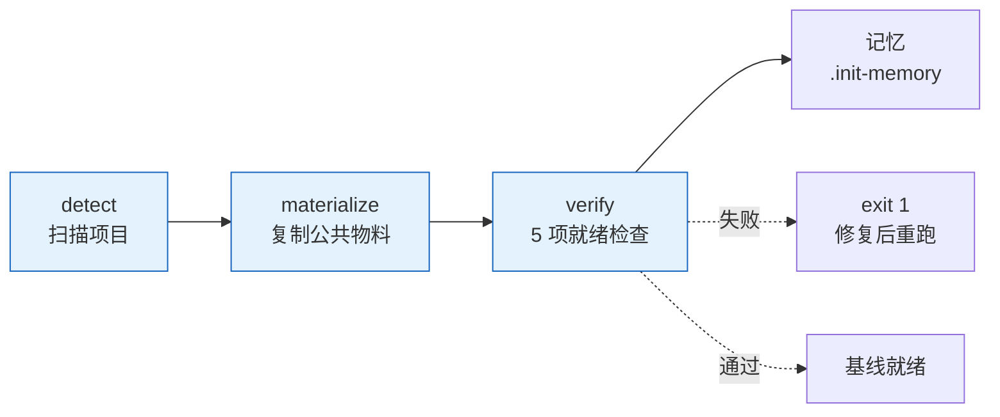

# rui

> 故事驱动 SDLC 编排器。每条命令最终落到「故事任务面板」目录，每个故事独立串行走完管线。

**口诀**：拆故事 → 文档基线 → 测试先行 → 实现 → 验证 → 复盘 → 交付。

哲学源自 [CLAUDE.md](../../CLAUDE.md)。本文件只定义命令面与编排骨架，细节分散在：[rules/](../../rules/) 跨场景约束 · [agents/](../../agents/) 角色契约 · [formulas.md](./formulas.md) 故事文档公式 · [coder.md](./coder.md) 目录与生命周期 + 参考文档公式 + 数据契约。

## 命令面

| 命令 | 用途 | 关键行为 |
|------|------|---------|
| `/rui init [--force\|--dry-run]` | 建立项目基线 | detect → materialize → verify；项目特有信息全部写入 `.claude/project-profile.json`；5/5 就绪检查 |
| `/rui doc <req>` | 拆需求为故事 + 生成文档基线（故事任务 → 评审三件） | 必须分支隔离；禁止改源码；多故事逐个串行 |
| `/rui code <name>` | 实现故事 + 生成验证报告（实施 / 测试 / 自改进复盘） | Gate A 测试先行；Gate B 验证闭合 |
| `/rui <req>` | 端到端 | doc + code 全自动串联 |
| `/rui update <name-or-path> [ctx] [--no-code]` | 增量更新 | T1/T2/T3 裁剪；`--no-code` 仅文档 |
| `/rui code --from-doc <name>` | 从文档反推 | 只读源码补全缺失文档；不覆盖已有 |
| `/rui doc --from-code [req]` | 从源码反推 | req 空时 pm 自主探索（前端/后端/全栈） |
| `/rui list` | 进度全景 | 按文件存在性判定状态 |
| `/rui` | 任务推荐 | 5 层链式管线评分排序 |

`<req>` 支持文本 / `@` 引用本地文件 / URL。CLI `--name` 用 `<Project>-<name>` 格式（如 `YiWeb-user-login`），脚本内分解为路径 `<Project>/<name>`。

## 管线一览

| 阶段细则 | 出处 |
|---------|------|
| 影响分析 / 证据等级 | [agents/AGENT.md](../../agents/AGENT.md) |
| 分支隔离 / Gate A/B / P0 审查 | [rules/code-pipeline.md](../../rules/code-pipeline.md) |
| 三步交付管线 / 文档同步 | [rules/delivery-gate.md](../../rules/delivery-gate.md) |
| 诊断 D0–D7 / 评估 E1–E4 | [rules/self-improve.md](../../rules/self-improve.md) |
| 文档生成强制约束 | [rules/doc-generation.md](../../rules/doc-generation.md) |
| Agent 交接契约 | [agents/](../../agents/) 各角色文件 |

## 阻断标识

| 标识 | 触发 | 阶段 | 降级 |
|------|------|------|------|
| `no-parse` | 需求无法解析 | 需求解析 | 否 |
| `no-source` | P0 章节缺上游来源 | 文档生成 / 预检 | 否 |
| `chain-broken` | 影响链未闭合 | 影响分析 / 预检 | 否 |
| `doc-p0` | 文档 P0 不通过且无法自修复 | 文档生成 | 否 |
| `code-p0` | 代码 P0 无法修复 | 实现 | 否 |
| `skip-gate-a` | Gate A 未通过即编码 | 测试先行→实现 | 否 |
| `gate-b-limit` | Gate B >2 轮 | 验证 | 否 |
| `bad-branch` | 分支未从 main 创建或混入非本故事代码 | 预检 | 否 |
| `no-checkout` | 未切换故事分支即改源码 | 预检→实现 | 否 |
| `auto-merge` | 功能分支被自动合并到 main | 预检→交付 | 否 |
| `no-token` | `API_X_TOKEN` 缺失 | 交付 | 是 |
| `no-metrics` | self-improve 数据采集失败 | 自改进 | 是 |

阻断后：`node ~/.claude/plugins/marketplaces/yry/skills/rui/scripts/rui-state.js save --blocked` → 持久化 → 通知（`no-token` / `no-metrics` 跳过）。重跑同命令从 `current_stage` 续。

## 核心约束

1. **逐故事串行** — 多故事按拆分顺序处理，互不交叉
2. **分支隔离** — `feat/<project>-<name>` 从 main/master 创建；不可派生、不可自动合并
3. **源码改动唯一入口** — 只能走 `/rui code` 管线（`no-checkout`）
4. **测试先行** — Gate A 阻断实现；Gate B >2 轮阻断交付
5. **逐模块审查** — 每模块后审查，P0 清零再前进
6. **只读反推** — `--from-code` / `--from-doc` 禁止改源码
7. **产出内聚** — 关键产出限定在故事目录或对应参考文档目录
8. **交付强制** — 三步管线按序标记（`delivery-gate.js mark`），Stop hook 检查未闭合即阻断
9. **公式驱动** — 文档由 [formulas.md](./formulas.md) 规约，不再依赖模板目录
10. **知识沉淀** — 写入 `.memory/execution-memory.jsonl` + `.memory/rui-state.json`；提案写入 `.improvement/proposals.jsonl`

## init 简述

> **口诀：探—物—验。** 三步：探（扫描出 profile）→ 物（复制公共物料）→ 验（5 项就绪检查）。项目特有信息一律写入 `project-profile.json`，agent 启动时自读，不再做"项目薄壳"或"rules 基线注入"。

### 1. detect — 扫描项目（事实层）

三类信号汇聚成 `project-profile.json`：

| 信号 | 来源 | 用途 |
|------|------|------|
| 项目名 | 仓库目录名 | `branch_prefix` / `doc_root` 锚点 |
| 项目类型 | `constants.detectProjectType` | `frontend` / `backend` / `fullstack` / `meta` / `unknown` 决定 Coder 公式与故事骨架 |
| 项目清单（manifest） | 按生态择一或并存 | 依赖列表 + 构建/测试命令 + 框架版本 |

第三类按生态文件存在性命中即抽取（多生态合并）：

| 生态 | 清单文件 | 提取 |
|------|---------|------|
| Node | `package.json` | deps + `scripts.build/test/lint/dev` → `npm run *` |
| Python | `pyproject.toml` / `requirements.txt` | deps + `pytest` / `python -m build` |
| Rust | `Cargo.toml` | deps + `cargo build/test` |
| Go | `go.mod` | requires + `go build/test ./...` |
| Java | `pom.xml` / `build.gradle(.kts)` | artifactId + `mvn` 或 `./gradlew` |
| Ruby / PHP | `Gemfile` / `composer.json` | gem / require |
| 元项目 | `.claude-plugin/plugin.json` | 标记 `meta` 生态 |

`CLAUDE.md` / `README.md` 不再做"提取注入"——它们是 agent 直接读的活文档。

### 2. materialize — 复制公共物料（基线层）

**整文件复制**（每次 init 同步最新）。`--force` 覆盖已有，否则跳过。

| 来源 | 目标 |
|------|------|
| `agents/*.md`（7 个） | `.claude/agents/` |
| `rules/*.md`（6 个） | `.claude/rules/` |
| `skills/rui/formulas.md` | `.claude/formulas.md` |
| `skills/rui/coder.md` | `.claude/coder.md` |
| `.mcp.json` / `settings.json` | `.claude/` |
| 自动生成 | `.claude/project-profile.json`（每次刷新）/ `settings.local.json`（首次空模板）/ `.gitignore` |

**关键设计**：项目特有信息（技术栈、构建命令、安全约束等）全部进 `project-profile.json`，不再切片注入到每个 agent。agent 在执行时按需读取 profile，避免"薄壳生成 / 注入合并 / 标记保护"三重复杂度。

### 3. verify — 5 项就绪检查（验证层）

任一失败 `exit 1`：

| # | 检查项 | 通过条件 |
|---|--------|--------|
| 1 | `CLAUDE.md` | 三公理 + 退化对策 关键节点全部命中 |
| 2 | `README.md` | 系统能力 + 项目结构 + 快速开始 + `/rui init` 存在 |
| 3 | `.claude/agents/` | 7 个 Agent 文件存在；`AGENT.md` 内容长度达标，6 角色 frontmatter 合法 |
| 4 | `.claude/rules/` | 6 个规则文件齐备 |
| 5 | `.claude/` 配置层 | `project-profile.json`（含 project/type/coder_formula）+ `formulas.md`（含 F.story.01/08/F.supp./F.meta）+ `coder.md` + `.mcp.json`（含 mcpServers）+ `settings.json`（含 permissions）+ `settings.local.json` |

### 4. 选项

| 选项 | 行为 |
|------|------|
| `--dry-run` | 仅扫描+报告，不写文件；动作以 `◇` 前缀标识 |
| `--force` | 整文件覆盖 `.claude/` 下已有物料；不影响 `settings.local.json`（用户本地） |
| `--json` | 机器可读输出（`{ profile, materialize, verify, dry_run }`） |

### 5. 产物

| 路径 | 用途 |
|------|------|
| `.claude/project-profile.json` | 项目画像（类型 / Coder 公式 / 故事骨架默认值 / 依赖与命令）。**手动编辑无效，下次 init 覆盖** |
| `.claude/.gitignore` | 排除 `settings.local.json` + `.history/` |
| `docs/故事任务面板/.init-memory.json` | 本次 init 的执行记录（时间戳 + 项目类型 + 检查结果） |

## 集成

| 类别 | 内容 |
|------|------|
| 脚本 | `~/.claude/plugins/marketplaces/yry/skills/rui/scripts/`：init · list · recommend · rui-state · execution-memory · self-improve · delivery-gate · loop · natural-week · constants |
| Skills | `import-docs --workspace`（同步） · `wework-bot --name <name>`（通知） |
| 规则 | [code-pipeline](../../rules/code-pipeline.md) · [delivery-gate](../../rules/delivery-gate.md) · [doc-generation](../../rules/doc-generation.md) · [self-improve](../../rules/self-improve.md) · [rui-claude](../../rules/rui-claude.md) · [no-magic-number](../../rules/no-magic-number.md) |
| 角色 | [pm](../../agents/pm.md) · [coder](../../agents/coder.md) · [tester](../../agents/tester.md) · [reporter](../../agents/reporter.md) · [security](../../agents/security.md) · [self-improve](../../agents/self-improve.md) |
| 文档 | [formulas.md](./formulas.md) — 故事文档公式（F.story.\* + F.supp.\*） · [coder.md](./coder.md) — 目录生命周期 + 参考文档公式（F.ref.\*） + 数据契约（`.memory/` + `.improvement/`） |
