# rui

故事驱动 SDLC 编排器。需求拆分产生多个故事时逐故事串行处理，每个故事独立走完管线，确保最小可用、可测试、可交付。

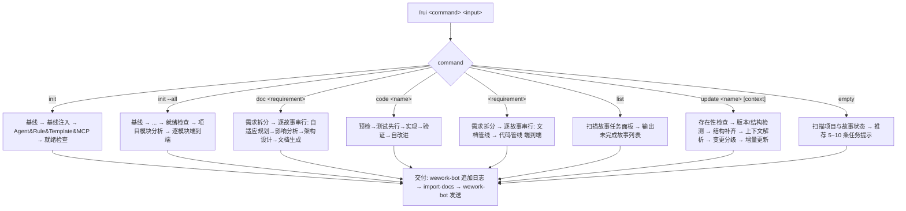

---

## 命令概览

| 命令 | 流程 |
|------|------|
| `/rui init` | 基线 → 基线注入 → Agent&Rule&Template&MCP → 就绪检查 → 交付（不生成故事，仅建立项目骨架） |
| `/rui init --all` | 基线 → ... → 就绪检查 → 项目模块分析 → 逐模块 `/rui <requirement>` 端到端 → 交付（全项目故事覆盖） |
| `/rui doc <requirement>` | 需求拆分 → 逐故事串行: 自适应规划→影响分析→架构设计→文档生成 → 交付 |
| `/rui update <name> [context]` | 存在性检查 → 版本/结构检测 → 结构补齐 → 上下文解析 → 变更分级 → 增量更新 → 交付（老故事流程升级 + 内容优化/补充/重写） |
| `/rui code <name>` | 预检（含文档补齐）→ 测试先行 → 实现 → 验证 → 自改进 → 交付（01-故事任务.md 必须存在，缺失的技术评审自动补齐，最终产出故事目录全 8 份文档） |
| `/rui <requirement>` | 需求拆分 → 逐故事串行: 文档管线 → 代码管线 端到端 → 交付 |
| `/rui list` | 扫描故事任务面板，列出所有未完成故事及其进度状态 |
| `/rui`（空输入） | 扫描项目与故事状态 → 推荐 5~10 条任务提示 |

> `.claude` 配置管理请使用 [`/rui-claude`](../rui-claude/SKILL.md) 技能（sync / diff）。

`<requirement>` 可以是：
- 需求描述文本（如 `用户登录功能，支持密码和OAuth`）
- `@` 引用的本地文件路径（如 `@docs/req/login.md`）
- 需求文档 URL（如 `https://example.com/req.md`）

rui 自动将需求拆分为多个故事，每个故事独立创建目录。故事目录名使用**方便建立 git 分支命名的英文简洁描述**（如 `user-login`、`oauth-bindding`、`sms-verify`）。

---

## 核心规则

0. **逐故事操作**: 需求拆分可创建多个故事目录，但每个故事独立走完文档管线后再处理下一个，确保每个故事独立、最小可用、可测试、可交付
1. **增量更新**: 已有文档按 T1/T2/T3 裁剪
2. **测试先行**: Gate A 阻断实现；Gate B >2 轮修复阻断交付
3. **逐模块审查**: 实现阶段每模块后审查，P0 清零前进
4. **双边影响**: 预检阶段同时分析代码和文档影响
5. **分支隔离**: 预检阶段从 main 拉取 feat/<name> 分支
6. **知识沉淀**: 策展阶段写执行记忆 + rui-state.json
7. **交付自动触发**: 管线末端自动调用 `Skill(import-docs, --workspace)` 同步全部文档到远端，随后 `Skill(wework-bot, --name <name>)` 发送通知。两技能均由 rui 直接调用 Skill 工具触发，不等待用户确认（H9 降级除外）
8. **产出内聚**: 关键产出只允许是对应故事目录（`docs/故事任务面板/<name>/`）下的文件内容，不得在故事目录外生成文档、报告或其他产出物
9. **禁止自动合并**: `/rui code` 和 `/rui <requirement>` 在任何阶段均不得将功能分支自动合并到 main 分支，合并操作一律由开发者手动执行（H12）

---

**项目基线：** 生成 `CLAUDE.md` + `README.md`（双文件 × N 子项目）。

---

## /rui init

建立项目基线，不逐故事生成。每个故事通过 `/rui <name>` 单独操作。

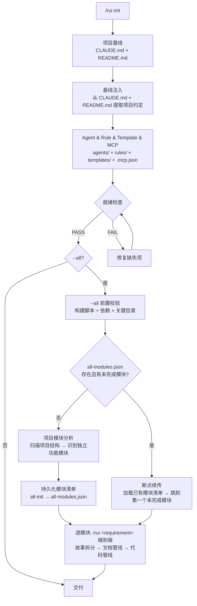

| 阶段 | 做什么 | 关键产出 |
|------|--------|---------|
| 项目基线 | 生成 CLAUDE.md + README.md<br>pm, coder | CLAUDE.md、README.md |
| 基线注入 | 从 CLAUDE.md + README.md 提取项目约定，注入下游生成<br>pm | 项目约定摘要（技术栈、编码规范、禁止事项、目录结构、关键文件） |
| Agent & Rule & Template & MCP | 基于项目约定生成/更新 agents/、rules/、templates/、.mcp.json<br>pm | AGENT.md、pm.md/coder.md/tester.md/security.md/reporter.md（含项目特定规则）、rules/（code-pipeline.md、doc-generation.md、gate-rules.md、self-improve.md）、templates/（故事任务模板.md、后端技术评审模板.md、前端技术评审模板.md、测试用例评审模板.md、后端实施报告模板.md、前端实施报告模板.md、测试用例报告模板.md、自改进复盘模板.md）、.mcp.json |
| 就绪检查 | 8 项检查，失败则修复重检<br>tester, reporter, security | 8 项检查全部通过 |
| --all 前置校验（仅 `--all`） | 检查构建脚本可用性、关键依赖安装状态、源码目录存在性<br>pm | 前置校验通过（阻断则不进入模块分析） |
| 断点续传检查（仅 `--all`） | 检查 `docs/.memory/all-modules.json` 是否存在且有未完成模块。存在则跳过模块分析，直接从第一个 pending/in_progress 模块继续<br>pm | 续传：输出已完成摘要 + 剩余模块列表 |
| 项目模块分析（仅 `--all`，首次运行） | 扫描项目结构、CLAUDE.md、README.md、源码目录，识别独立功能模块，每个模块生成需求描述。完成后调用 `all-init` 持久化<br>pm | 模块清单 + all-modules.json |
| 逐模块端到端（仅 `--all`） | 每个模块依次执行 `/rui <requirement>` 端到端：故事拆分 → 逐故事: 文档管线 → 代码管线 → 交付。每模块完成后调用 `all-module-done`，阻断时调用 `all-module-blocked`<br>pm, coder, tester, security, reporter, self-improve | 每个故事目录全 8 份文档 + .improvement/ + .memory/ |
| 交付 | import-docs → wework-bot | — |

### 基线注入

从项目基线 CLAUDE.md + README.md 提取以下项目约定，作为 Agent、Rule、Template、MCP 生成的输入：

| 提取项 | 来源 | 注入目标 |
|--------|------|---------|
| 技术栈与版本 | README.md 技术栈表 | coder.md（技术约束）、security.md（第三方审查范围） |
| 编码规范 | CLAUDE.md 编码规范 | coder.md（实现规则）、tester.md（测试规范） |
| 禁止事项 | CLAUDE.md 禁止事项 | rules/code-pipeline.md（硬性约束）、coder.md（审查标准） |
| 目录结构 | CLAUDE.md + README.md | rules/ 的 paths 声明、AGENT.md 影响分析范围 |
| 关键文件 | CLAUDE.md 关键文件 | coder.md（入口文件感知）、security.md（安全边界） |
| 构建与运行 | README.md 快速开始 | coder.md（开发流程）、tester.md（测试环境） |
| 核心架构 | README.md 核心架构 | coder.md（架构模式约束）、tester.md（测试隔离策略） |

**注入原则**：项目约定只在对应 agent/rule 中出现一次，不重复 CLAUDE.md 原文，而是转化为可执行规则。例如 CLAUDE.md 说"禁止在 content script 中使用 ES modules"，coder.md 写为"所有 content script 必须使用 IIFE + script 标签加载，禁止 import/export 语法"。

### 就绪检查

| # | 检查项 | 验证 |
|---|-------|------|
| 1 | docs/故事任务面板/ 目录存在 | `test -d` |
| 2 | 项目 CLAUDE.md 存在且非空 | `wc -l` |
| 3 | 项目 README.md 存在且非空 | `wc -l` |
| 4 | .claude/agents/AGENT.md 存在且非空 | `wc -l` |
| 5 | 基线 agent（pm/coder/tester/security/reporter）.md 全部存在 | `test -f` |
| 6 | .mcp.json 存在且为有效 JSON | `node -e` |
| 7 | .claude/rules/ 目录存在且含至少一条规则 | `ls` |
| 8 | .claude/skills/rui/templates/ 目录存在且含至少一个模板 | `ls` |

### --all 模式

`--all` 标志在就绪检查通过后，自动对全项目进行模块分析和端到端故事生成。适合项目初始化后一次性建立所有模块的故事目录和全文档。

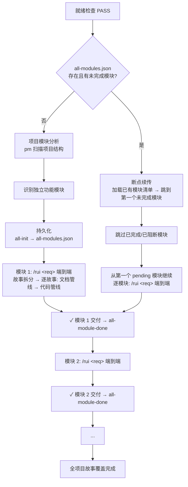

#### 项目模块分析

pm 扫描以下信息源，识别项目中的独立功能模块：

| 扫描源 | 提取内容 |
|--------|---------|
| 项目目录结构 | 源码子目录（如 `src/components/`、`src/utils/`、`src/pages/`），每个独立目录簇为一个候选模块 |
| CLAUDE.md | 项目架构描述、关键文件列表、核心模块说明 |
| README.md | 核心架构图、技术栈、功能特性列表 |
| 现有代码文件 | 入口文件、路由定义、模块导出，反向推导功能边界 |
| Git 历史 | 最近提交涉及的功能区域，辅助判断模块活跃度和边界 |

**模块识别规则**：

1. 每个模块必须是一个独立的功能单元，有清晰的边界和职责
2. 模块之间低耦合，可独立开发和测试
3. 模块名使用英文简洁描述（如 `auth-system`、`data-export`、`ui-components`）
4. 优先识别有用户可感知价值的模块（面向用户的功能），其次为基础设施模块
5. 每个模块生成一段需求描述（2-5 句话），作为该模块 `/rui <requirement>` 的输入

#### 状态持久化

`--all` 模式的模块分析结果持久化到 `docs/.memory/all-modules.json`，支持断点续传和进度追踪。

| 操作 | 脚本命令 | 说明 |
|------|---------|------|
| 初始化 | `node skills/rui/scripts/rui-state.js all-init [--file <path>] [--force]` | 写入模块清单 JSON（stdin 或 --file 输入），生成 session_id 和时间戳。若已存在未完成运行则警告退出，--force 覆盖 |
| 模块完成 | `node skills/rui/scripts/rui-state.js all-module-done --name <module> [--stories <csv>]` | 标记模块为 completed，记录关联故事名。全部模块终端态时自动设置 top-level status |
| 模块阻断 | `node skills/rui/scripts/rui-state.js all-module-blocked --name <module> --reason <text>` | 标记模块为 blocked，记录阻断原因，top-level status → blocked |
| 进度查看 | `node skills/rui/scripts/rui-state.js all-status [--json]` | 输出模块进度表（markdown table）或完整 JSON |

**执行约束**：
- pm 完成模块分析后，调用 `all-init` 持久化模块清单
- 每个模块端到端完成后，调用 `all-module-done` 记录（含故事名列表）
- 模块被阻断时，调用 `all-module-blocked` 记录原因，继续处理下一个模块
- 全部模块处理完毕后，汇总阻断清单供人工介入

#### 断点续传

`rui init --all` 支持中断后恢复：

1. 重新运行 `rui init --all` 时，就绪检查通过后首先检查 `docs/.memory/all-modules.json` 是否存在
2. 如果文件存在且 status 为 `in_progress` 或 `blocked` 且有未完成模块：
   - pm 输出已完成的模块摘要和剩余模块列表
   - 从第一个 `pending` 或 `in_progress` 状态的模块继续处理
   - 已完成（`completed`）和已阻断（`blocked`）的模块跳过
3. 如果所有模块已完成或已阻断，输出汇总并跳过逐模块处理，直接进入交付阶段
4. 如果文件不存在，执行完整模块分析流程（同首次运行）

#### 模块清单输出

模块清单同时持久化到 `docs/.memory/all-modules.json`。执行 `node skills/rui/scripts/rui-state.js all-status` 查看进度。

```
📦 项目模块分析（共 N 个模块）

1. auth-system: 用户认证系统，支持密码登录、OAuth、短信验证码
   源码: src/auth/, src/middleware/auth.ts
   
2. data-export: 数据导出功能，支持 CSV/PDF 格式导出
   源码: src/export/, src/utils/format.ts

3. notification: 消息通知系统，站内信 + 企微推送
   源码: src/notification/, src/bot/

...
```

#### 逐模块端到端

每个模块依次执行完整端到端管线，等同于 `/rui <requirement>`：


单个故事内部流程（与 `/rui <requirement>` 端到端一致）：

| 阶段 | 内容 |
|------|------|
| 需求解析 | 解析模块需求描述文本 |
| 故事拆分 | 拆分为独立故事，每个故事创建目录（英文简洁命名） |
| 文档管线 | 自适应规划 → 影响分析 → 架构设计 → 文档生成（产出 01~04 + §6 §7） |
| 代码管线 | 预检（含文档补齐）→ 测试先行 → 实现 → 验证 → 自改进（产出 05~08 + .improvement/ + .memory/） |
| 交付 | wework-bot 追加日志 → import-docs → wework-bot 发送 |

**执行约束**：
- 模块间串行：前一个模块的全部故事完成后再处理下一个模块
- 模块内逐故事串行：每个故事独立走完文档+代码管线后再处理下一个故事
- 每个故事最终产出 8 份文档 + `.improvement/proposals.jsonl` + `.memory/` 数据存储
- 阻断规则与 `/rui <requirement>` 端到端一致（H1~H12）

**阻断后行为**：当前故事/模块阻断时，记录阻断原因，继续处理下一个模块。全部模块处理完毕后，汇总阻断清单供人工介入。

完成 init 后，使用 `/rui doc <requirement>` 拆分需求为故事，再逐个故事执行 `/rui code <name>` 或 `/rui <name>`。

---

## /rui doc \<requirement\>

从需求描述/文档拆分故事，逐故事执行自适应规划→影响分析→架构设计→文档生成 → 交付。不执行策展和项目基线。

### 需求输入

`<requirement>` 支持三种格式：
- **文本描述**: 直接输入需求文字，rui 分析并拆分为故事
- **@文件引用**: 使用 `@path/to/file.md` 引用本地需求文档
- **URL**: 提供需求文档的在线地址，rui 抓取后分析

### 故事拆分规则

1. 分析需求，识别独立功能单元
2. 每个功能单元对应一个故事目录
3. 故事目录名使用**英文简洁描述**，便于 git 分支命名（如 `user-login`、`chat-export`、`screenshot-capture`）
4. 拆分后逐故事走完文档管线，不并行

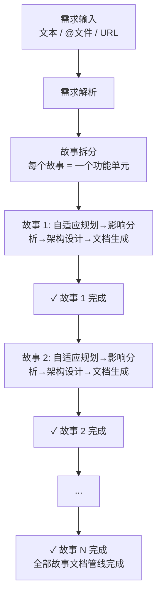

每个故事内部流程：

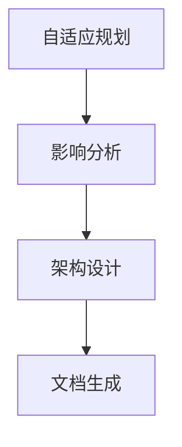

| 阶段 | 做什么 | 关键产出 |
|------|--------|---------|
| 需求解析 | 读取需求输入（文本/@文件/URL），提取功能需求<br>pm | 需求摘要 |
| 故事拆分 | 将需求拆分为独立功能单元，每个单元创建故事目录（英文简洁命名）<br>pm | 故事目录列表 `docs/故事任务面板/<story-name>/` |
| 自适应规划 | 读取执行记忆，判定 T1/T2/T3 变更级别<br>pm | rui-state.json |
| 影响分析 | 单个故事全项目影响链分析，闭合所有依赖<br>coder, reporter | 01-故事任务.md（§3 影响链） |
| 架构设计 | 单个故事模块划分、接口规范、数据流设计、测试用例规划<br>coder, security, tester | 02-后端技术评审.md、03-前端技术评审.md、04-测试用例评审.md |
| 文档生成 | agent 协作<br>pm (§1,§2,§4), coder (§3), tester (§1.1,§5), reporter (§4 依赖), security (§3 安全) | 01-故事任务.md（完整） |

### 增量裁剪

| 级别 | 触发条件 | 影响分析 | 架构设计 | 文档生成 |
|------|---------|---------|---------|---------|
| T1 微观 | 措辞、格式修正 | 跳过 | 跳过 | 仅变更章节 |
| T2 局部 | 增删故事/接口变更 | 裁剪 | 裁剪 | 重写目标+下游 |
| T3 范围 | 范围边界变化、跨故事重构 | 完整重跑 | 完整重跑 | 全级联刷新 |

---

## /rui update \<name\> [context]

对已有故事任务进行流程升级、结构补齐或内容更新。三种场景合一：
- **流程升级**：老故事目录缺少新版流程要求的目录/文档/章节 → 自动检测并补齐
- **内容更新**：补充/优化/重写故事内容（mock→真实接口、需求变更、方案优化）
- **混合**：先升级结构，再应用内容更新

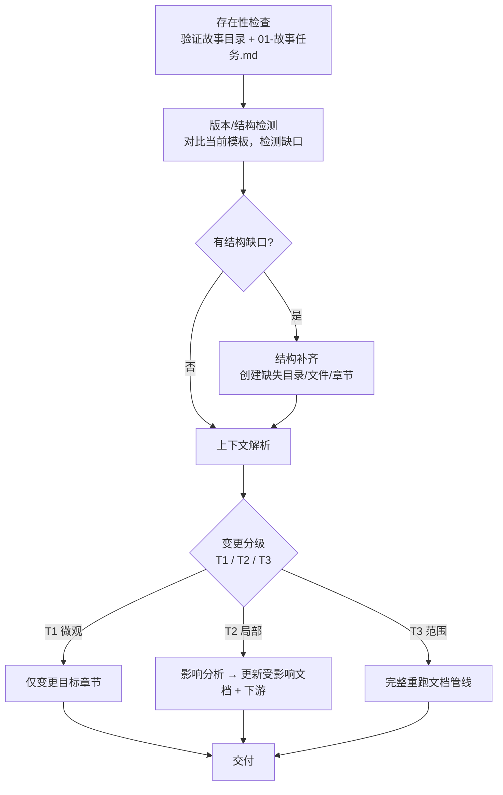

| 阶段 | 做什么 | 关键产出 |
|------|--------|---------|
| 存在性检查 | 验证 `docs/故事任务面板/<name>/` 目录和 `01-故事任务.md` 存在<br>不存在则阻断（同 H1） | — |
| 版本/结构检测 | 对照当前模板结构逐项检查故事目录：目录结构、文档完整性、01 章节完整性、版本头、交叉引用<br>pm | 结构缺口清单 |
| 结构补齐 | 按缺口清单执行：创建缺失目录/文件、按当前模板生成缺失文档、补充 01 缺失章节、添加版本头和交叉引用<br>pm | 补齐的故事目录（与当前流程一致） |
| 上下文解析 | 解析 `[context]` 补充信息，或扫描文档自检优化方向<br>pm, coder | 影响范围清单 / 优化建议 |
| 变更分级 | 按 T1/T2/T3 判定变更级别 | rui-state.json（更新） |
| 增量更新 | 按级别更新受影响文档，T3 完整重跑文档管线<br>pm, coder, tester, security | 更新的故事文档 |

### 版本/结构检测规则

逐项检查，任一项不满足则视为存在结构缺口：

| # | 检测项 | 方法 | 缺口判定 |
|---|--------|------|---------|
| 1 | 目录结构 | `test -d docs/故事任务面板/<name>/.improvement && test -d docs/故事任务面板/<name>/.memory` | 任一不存在 → 旧版目录结构 |
| 2 | 文档完整性 | 检查 `01-故事任务.md` ~ `08-自改进复盘.md` 是否齐全（01 已由存在性检查确认） | 任一份缺失 → 文档不完整 |
| 3 | 版本头 | 检查 01 首行（标题下方）是否有 `> \| v` 开头的版本标记行 | 无 → 旧版文档 |
| 4 | 证据标准 | 检查 01 顶部是否有 `> **证据标准**:` 行 | 无 → 旧版文档 |
| 5 | 技术评审链接 | 检查 01 顶部是否有 `> **技术评审**:` 行及三份评审链接 | 无 → 缺失交叉引用 |
| 6 | §1.1 节 | 检查 01 是否包含 `### §1.1 User Operations` | 无 → 旧版文档 |
| 7 | §6 §7 节 | 检查 01 是否包含 `### §6` 和 `### §7` | 无 → 旧版文档 |
| 8 | §L 节 | 检查 01 是否包含 `### §L` | 无 → 缺失自改进循环 |
| 9 | data 约束 | 检查 01 §2 是否包含 `#### 数据约束` 子节 | 无 → 旧版 §2 |
| 10 | 扩展影响 | 检查 01 §3 是否包含 `#### 扩展影响分析` 子节（含 manifest.json / SW / Content Script / 存储 / 跨上下文五行） | 无 → 旧版 §3 |
| 11 | rui-state | 检查 `.memory/rui-state.json` 是否存在且为有效 JSON | 无 → 管线状态缺失 |
| 12 | 交叉引用 | 检查 02/03/04 之间是否有互链（各文件顶部是否有指向其他评审的链接） | 无 → 缺失交叉引用 |

检测完成后输出结构缺口清单，列出每项的状态（✅/❌）和缺口描述。

### 结构补齐规则

按缺口清单逐项补齐。补齐操作不改变已有内容，仅在缺失处追加或创建：

| # | 缺口 | 补齐操作 |
|---|------|---------|
| 1 | .improvement/ 缺失 | `mkdir -p`，创建空 `proposals.jsonl`（`echo '' > proposals.jsonl`） |
| 2 | .memory/ 缺失 | `mkdir -p`，创建空 `execution-memory.jsonl`，生成 `rui-state.json`（command=update, current_stage=结构补齐, pipeline_progress 按现有文档反推） |
| 3 | 02~08 缺失 | 从当前模板生成，以 01-故事任务.md 已有信息填充可推导内容。在文档顶部引用行添加 `> ⚠️ 由 rui update 结构补齐生成，需人工审核补充` |
| 4 | 版本头缺失 | 在 01 标题下方插入 `> \| v2（结构补齐） \| {当前日期} \| — \| — \| — \| — \|` |
| 5 | 证据标准缺失 | 在版本头下方插入 `> **证据标准**: A=已验证(附路径) · B=可推导(附规则) · C=未验证(标注 \`> 待补充\`) · D=禁止(视为幻觉)` |
| 6 | 技术评审链接缺失 | 在证据标准下方插入 `> **技术评审**: 详见 [02-后端技术评审.md](./02-后端技术评审.md) 和 [03-前端技术评审.md](./03-前端技术评审.md) 和 [04-测试用例评审.md](./04-测试用例评审.md)` |
| 7 | §1.1 缺失 | 从 §5 AC 和 §2 功能点推导 User Operations 表格。涉及 UI 时补充 mermaid 交互流程图、视图状态矩阵、交互追踪表（标注 `> 由 rui update 结构补齐生成，待人工确认`）。非 UI 故事标注「非 UI 故事，§1.1 仅含 User Operations」 |
| 8 | §6 缺失 | 添加 `### §6 .claude 改进清单` 占位，标注 `> 待 rui code 完成后由 pm 静态分析填充` |
| 9 | §7 缺失 | 添加 `### §7 系统架构演进任务` 占位，标注 `> 待 rui code 完成后由 pm 结构规划填充` |
| 10 | §L 缺失 | 添加 `### §L 自我改进循环` 占位，标注 `> 待 rui code 完成后由 self-improve-loop 自动追加` |
| 11 | §2 数据约束缺失 | 从 §2 功能点的输入/输出字段反推数据约束表（类型/范围/格式），标注 `> 由 rui update 结构补齐推导，待人工确认` |
| 12 | §3 扩展影响缺失 | 从 §4 Tasks 和代码结构反推扩展影响分析表（manifest / SW / Content Script / 存储 / 跨上下文），标注 `> 由 rui update 结构补齐推导，待人工确认` |
| 13 | rui-state 缺失 | 生成 rui-state.json：command=update, story_name=<name>, current_stage=结构补齐, pipeline_progress 按文档存在性反推（有 01→自适应规划/影响分析/架构设计/文档生成 completed，有 02/03/04→同上，有 05/06/07→预检/测试先行/实现/验证 completed，有 08→自改进 completed） |
| 14 | 交叉引用缺失 | 在 01 顶部添加三份评审链接；在 02 顶部添加 01+03+04 链接；在 03 顶部添加 01+02+04 链接；在 04 顶部添加 01+02+03 链接 |

> **补齐原则**：只补不漏——已有内容一字不改，缺失项按模板生成并标注来源。标注 `> 由 rui update 结构补齐` 的内容后续可由人工或下次 `/rui code` 的预检阶段完善。

### 变更分级规则

| 级别 | 触发示例 | 更新范围 |
|------|---------|---------|
| T1 微观 | 措辞修正、错别字、格式调整 | 仅变更章节 |
| T2 局部 | mock→真实接口替换、组件新增/删除、API 字段变更、测试用例补充 | 影响分析 → 更新受影响文档 + 下游引用 |
| T3 范围 | 故事边界变化、数据模型重构、跨故事接口变更 | 完整重跑文档管线（自适应规划→影响分析→架构设计→文档生成） |

### 上下文解析规则

`[context]` 有内容时，pm 解析补充信息，对照现有文档判定影响范围后进入变更分级。

`[context]` 为空时（仅结构补齐后或单独 `/rui update <name>`），pm 扫描故事文档给出优化建议：
- 检查 01 §3 Design 与实际代码的偏差（如有代码）
- 检查技术评审之间的交叉引用一致性
- 扫描文档中的 `> 待补充` / `TODO` / `FIXME` / `> 由 rui update 结构补齐` 标注
- 扫描 `.improvement/proposals.jsonl` 中 open 状态的关联提案
- 有优化建议时按 T1/T2 执行增量更新，无建议时跳过增量更新直接交付

### 示例

```bash
# 老故事升级到最新流程（无上下文，自动检测+补齐+扫描优化）
/rui update old-feature

# 补充后端接口信息，替换前端 mock
/rui update user-login "后端接口已就绪：POST /api/auth/login → {token, user}，需替换 src/mocks/auth.ts"

# 需求微调，新增字段
/rui update user-login "登录表单增加「记住我」复选框，影响 LoginForm 组件和 auth store"

# 老故事升级 + 内容更新（先补齐结构，再应用上下文）
/rui update old-payment "支付流程从同步改为异步，需更新 §3 Design 数据流和 §2 业务规则"
```

---

## /rui code \<name\>

预检（含文档补齐）→ 测试先行 → 实现 → 验证 → 自改进 → 交付。01-故事任务.md 必须存在；缺失的后端/前端/测试用例技术评审在预检阶段自动补齐，确保最终产出故事目录全 8 份文档。

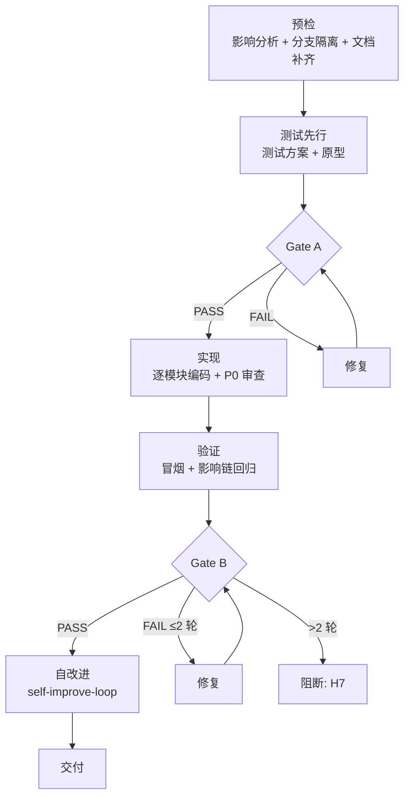

| 阶段 | 做什么 | 关键产出 |
|------|--------|---------|
| 预检 | 双边影响分析 + 分支隔离（从 main 拉取 `feat/<name>`）+ **文档补齐**（缺失的后端/前端/测试用例技术评审自动生成，保证故事目录全 8 份文档）<br>必须从 main 分支创建<br>coder, pm, reporter | 功能分支 + 双边影响链闭合 + 补齐的技术评审 |
| 测试先行 | Gate A：测试方案+原型，单行 CSS 可跳过<br>Gate A 未过不得编码<br>tester | 04-测试用例评审.md（若预检已补齐则跳过） |
| 实现 | 逐模块编码，每模块后审查：P0 必须修 / P1 建议修 / P2 可选<br>P0 未清零不进下一模块<br>coder, security, tester | 源代码（按 §4 任务列表）+ P0 清零 |
| 验证 | Gate B：环境快照 → 静态预检 → 对齐 → 单次执行 → 三报告产出<br>三报告相互引用闭合，各报告评审清单全部 ✅ 方可通过 Gate B<br>超过 2 轮修复阻断（H7）<br>coder（后端/前端实施报告）, tester（测试用例报告）, reporter（审阅） | 05-后端实施报告.md、06-前端实施报告.md、07-测试用例报告.md |
| 自改进 | self-improve-loop：效果评估 + 基线配置复盘 + 回顾 → `loop.js run --all`<br>产出08-自改进复盘.md<br>pm, reporter, self-improve | 08-自改进复盘.md |

**最终产出保证：** 故事目录下 8 份文档 + 数据存储齐全——01-故事任务.md（前置） + 02-后端技术评审.md + 03-前端技术评审.md + 04-测试用例评审.md + 05-后端实施报告.md + 06-前端实施报告.md + 07-测试用例报告.md + 08-自改进复盘.md + `.improvement/proposals.jsonl` + `.memory/`（execution-memory.jsonl + rui-state.json）。

### 验证与报告产出

验证阶段产出三份报告，作为 Gate B 通过证据。三报告共享故事上下文，相互引用、交叉验证。

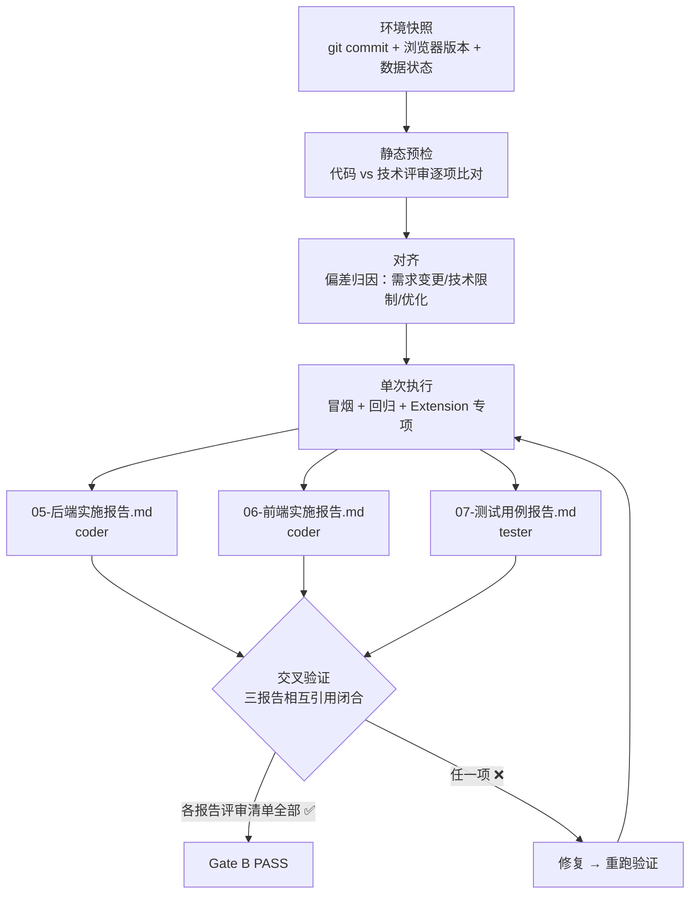

#### 05-后端实施报告.md

| 维度 | 要求 |
|------|------|
| 负责人 | coder |
| 输入 | 02-后端技术评审.md（接口清单、消息通道、数据模型、安全约束）、实际代码、P0 审查记录 |
| 核心章节 | §1 实施总结（交付文件 + 实际接口 + 消息通道比对）、§2 偏差记录（评审 vs 实际，P0 偏差须含风险评估）、§3 P0 审查结果（逐模块清零表 + 安全缓解对照）、§4 存储变更（迁移验证）、§5 性能观察、§6 评审清单（7 项全 ✅） |
| 完成标准 | 评审清单 7 项全部 ✅；所有交付文件与 §4 任务列表一一对应；P0 偏差均已说明原因和风险；无硬编码密钥或敏感信息 |

#### 06-前端实施报告.md

| 维度 | 要求 |
|------|------|
| 负责人 | coder |
| 输入 | 03-前端技术评审.md（组件表、Hooks 模式、样式隔离、加载顺序）、实际代码、P0 审查记录 |
| 核心章节 | §1 实施总结（交付文件 + 实际组件 + 状态管理比对）、§2 偏差记录（评审 vs 实际，P0 偏差须含风险评估）、§3 P0 审查结果（逐模块清零表）、§4 样式与隔离（作用域前缀验证）、§5 依赖与加载（manifest.json 变更 + 加载顺序验证）、§6 评审清单（9 项全 ✅） |
| 完成标准 | 评审清单 9 项全部 ✅；组件 IIFE 封装、命名空间正确；样式使用作用域前缀无宿主污染；manifest.json 按依赖顺序排列；无 ES module 语法 |

#### 07-测试用例报告.md

| 维度 | 要求 |
|------|------|
| 负责人 | tester |
| 输入 | 04-测试用例评审.md（用例清单）、01-故事任务.md §3（影响链回归范围）、05-后端实施报告.md、06-前端实施报告.md |
| 核心章节 | §1 测试环境（含 git commit hash）、§2 冒烟测试（P0 正常 + 关键边界，含通过率汇总）、§3 回归测试（范围与 §3 影响链一致）、§4 Extension 专项（SW 休眠/消息通道/存储迁移）、§5 已知问题（P0 阻断交付，>2 轮修复触发 H7）、§6 Gate B 评估、§7 评审清单（6 项全 ✅） |
| 完成标准 | 评审清单 6 项全部 ✅；P0 用例通过率 100%；P1 用例通过率 ≥80%；P0 已知问题为 0；修复轮次 ≤2；回归范围与影响链闭合 |

> **三报告交叉验证**：测试用例报告 §2 引用后端/前端实施报告的交付文件列表，确认测试覆盖所有交付物；后端/前端实施报告的偏差记录若涉及接口契约变更，测试用例报告须有对应边界用例覆盖。

### 自改进管线

代码管线完成后单次执行，不阻断主流程。脚本位于 `skills/rui/scripts/`。

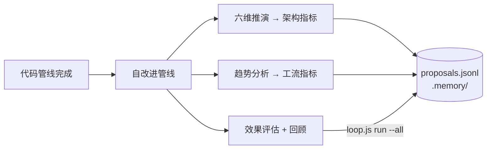

| 操作 | 脚本 | 产出 |
|------|------|------|
| 架构反思 | `self-improve.js` | 六维推演，架构指标 |
| 工流诊断 | `self-improve.js` | 趋势分析，工流指标 |
| 效果评估 + 回顾 | `loop.js run --all` | 08-自改进复盘.md |

数据存储: `docs/故事任务面板/<name>/.improvement/proposals.jsonl` + `docs/故事任务面板/<name>/.memory/`，append-only。

---

## /rui \<requirement\>（端到端）

从需求输入（文本 / @文件 / URL）拆分故事，逐故事串行走完文档管线（自适应规划→影响分析→架构设计→文档生成）和代码管线（预检→测试先行→实现→验证→自改进），中间不中断，完成或阻断后输出下一步提示。

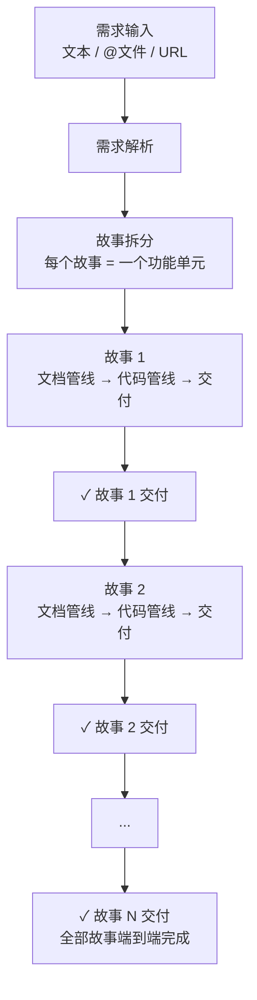

等同于 `/rui doc <requirement>` + 每个故事 `/rui code <name>` 的全自动串联。每个故事目录产出 8 份文档 + `.improvement/proposals.jsonl` + `.memory/`。

---

## /rui list

列出所有未完成的故事任务及其进度状态。不执行任何管线，纯查询操作。

扫描 `docs/故事任务面板/` 下所有故事目录，检查每个故事的产出文件完整性，输出进度表格。

| 故事 | 状态 | 缺失产出 |
|------|------|---------|
| user-login | 文档完成，待编码 | 后端实施报告、前端实施报告、测试用例报告 |
| oauth-bindding | 文档进行中 | 后端技术评审、前端技术评审、测试用例评审 |
| chat-export | 未开始 | 01-故事任务.md、全部技术评审 |

**状态判定规则**（按优先级，取最低阶段的未完成状态）：

| 状态 | 判定条件 |
|------|---------|
| 未开始 | `01-故事任务.md` 不存在 |
| 文档进行中 | `01-故事任务.md` 存在，但技术评审（后端/前端/测试用例）任一缺失 |
| 文档完成 | `01-故事任务.md` + 三份技术评审齐全，实施报告缺失 |
| 代码进行中 | 文档齐全，但三份实施报告任一缺失 |
| 代码完成 | 三份实施报告齐全 |
| 阻断 | `.memory/rui-state.json` 中 `blocked: true` |

仅当存在至少一个未完成故事时输出表格；若全部代码完成，输出简要完成提示。存在阻断状态的故事时，额外输出阻断原因。

实现：`node skills/rui/scripts/list.js`

---

## /rui（空输入）

当 `/rui` 无任何参数或输入为空时，不执行管线，而是扫描项目状态和已有故事进度，推荐 5~10 条可执行的任务提示。

### 推荐生成规则

pm 扫描以下信息源，综合生成推荐：

| 扫描源 | 提取信息 |
|--------|---------|
| `docs/故事任务面板/` | 已有故事及其进度状态（调用 list 判定逻辑） |
| `CLAUDE.md` + `README.md` | 项目技术栈、编码规范、禁止事项 |
| Git log（最近 10 条） | 近期活跃的故事和改动方向 |
| `.memory/` 下的 rui-state.json | 阻断状态、变更级别记录 |
| 各故事目录下的 `01-故事任务.md` §6 §7 §L | 改进清单、架构演进任务、自改进建议 |

### 推荐分类

每条推荐标注类型和理由来源：

| 类型 | 说明 | 示例 |
|------|------|------|
| 文档补充 | 技术评审缺失或章节不完整 | `rui update <name>` 补齐后端技术评审的 API 错误码表 |
| 代码实现 | 文档齐全待编码 | `rui code <name>` |
| 优化改进 | §6/§L 中积压的改进项 | `rui update <name> "优化登录表单验证逻辑"` |
| 端到端 | 全新需求可启动完整管线 | `rui <requirement>` |
| 架构演进 | §7 中规划的架构任务 | `rui update <name> "拆分 auth 模块为独立 service"` |

### 输出格式

```
🧭 rui 任务推荐（共 N 条）

1. [类型] /rui code user-login
   理由: 文档齐全（8/8），P0 审查待执行 | 来源: list 扫描

2. [类型] /rui update chat-export "补充导出进度回调接口"
   理由: §6 改进清单积压 | 来源: 01-故事任务.md §6

...
```

若项目尚无任何故事（`docs/故事任务面板/` 为空或不存在），则推荐从 `/rui init` 或 `/rui doc <requirement>` 开始，并根据 CLAUDE.md/README.md 推测 2~3 个可能的需求方向作为示例。

---

## 数据契约

三个数据文件支撑 rui 的记忆与改进引擎。每个故事独立存储，全局聚合用于跨故事分析。

### 存储路径

```
docs/故事任务面板/<name>/
├── .improvement/
│   └── proposals.jsonl         ← 改进提案（per-story + 全局同步）
└── .memory/
    ├── execution-memory.jsonl  ← 执行记忆（per-story + 全局同步）
    └── rui-state.json          ← 管线状态（per-story + 全局同步）

docs/                           ← 全局聚合（跨故事查询）
├── .improvement/
│   ├── proposals.jsonl
│   └── .last-health.json
└── .memory/
    ├── execution-memory.jsonl
    └── rui-state.json
```

写入规则：指定 `--name` 时双写（per-story + 全局）；未指定时仅写全局（向后兼容）。跨故事分析（`stats`/`trends`/`health`/`retro`）读取全局路径。

### execution-memory.jsonl

追加写入，每行一个 JSON 对象。记录每次 rui 执行的完整上下文。

| 字段 | 类型 | 描述 |
|------|------|------|
| session_id | string | 唯一会话标识 |
| timestamp | ISO 8601 | 记录时间 |
| story_name | string | 所属故事（`--name` 时写入） |
| feature | string | 故事/功能名称 |
| description | string | 执行描述 |
| planned_change_level | T1\|T2\|T3 | 计划变更级别 |
| actual_change_level | T1\|T2\|T3 | 实际变更级别 |
| phase_transitions | array | `[{from, to, timestamp, duration_ms}]` 阶段转换时间线 |
| update_context | string\|null | update 命令的补充上下文 |
| agents_called | string[] | 调用的 agent 列表 |
| quality_issues | object | `{P0:[{doc_type, section, issue}], P1, P2}` 质量问题 |
| bad_cases | array | `[{agent, lesson}]` 教训记录 |
| was_blocked | boolean | 是否触发阻断 |
| block_reason | string | 阻断原因 |

**消费方**：`/rui update` 查询历史相似案例指导增量更新；`/rui`（空输入）扫描近期 P0 问题生成改进建议；`self-improve.js trends` 分析退化趋势。

### rui-state.json

单对象 JSON 文件。记录当前管线状态和变更历史。

| 字段 | 类型 | 描述 |
|------|------|------|
| session_id | string | 当前会话标识 |
| command | string | 触发命令（init/doc/update/code/full） |
| name / story_name | string | 故事名称 |
| current_stage | string | 当前所处阶段 |
| blocked | boolean | 是否阻断 |
| block_reason | string\|null | 阻断原因 |
| timestamp | ISO 8601 | 最后更新时间 |
| storyboard | string | 故事任务文件路径 |
| pipeline_progress | object | `{"自适应规划":"completed", "影响分析":"completed", ...}` 每阶段状态：completed / in_progress / blocked / not_started |
| change_history | array | `[{timestamp, from_stage, to_stage, trigger}]` 阶段变更时间线 |
| related_proposals | string[] | 关联的 proposal ID 列表 |

**消费方**：`/rui list` 读取 pipeline_progress 判定故事进度；`/rui`（空输入）读取 blocked 阶段推荐恢复命令；`rui-state.js next-step` 基于完成阶段推荐下一步。

### all-modules.json

单对象 JSON 文件。记录 `--all` 模式的模块级进度。

| 字段 | 类型 | 描述 |
|------|------|------|
| session_id | string | 当前 `--all` 会话标识 |
| started_at | ISO 8601 | `--all` 启动时间 |
| updated_at | ISO 8601 | 最后更新时间 |
| status | string | 整体状态：`in_progress` / `completed` / `blocked` / `abandoned` |
| modules | array | 模块列表 |

**modules 数组元素**：

| 字段 | 类型 | 描述 |
|------|------|------|
| name | string | 模块英文名（如 `auth-system`） |
| description | string | 模块功能描述（2-5 句） |
| source_dirs | string[] | 模块涉及的源码目录/文件路径 |
| order | number | 模块处理顺序 |
| status | string | 模块状态：`pending` / `in_progress` / `completed` / `blocked` |
| block_reason | string\|null | 阻断原因（仅 blocked 状态） |
| stories_created | string[] | 该模块生成的故事目录名列表 |
| started_at | ISO 8601\|null | 模块开始处理时间 |
| completed_at | ISO 8601\|null | 模块完成时间 |

**消费方**：`rui init --all` 检查文件决定是否断点续传；`rui-state.js all-status` 输出进度表；`/rui`（空输入）读取模块进度生成推荐。

### proposals.jsonl

追加写入，每行一个 JSON 对象。记录自改进引擎生成的改进提案。

| 字段 | 类型 | 描述 |
|------|------|------|
| id | string | 唯一提案标识 |
| date | YYYY-MM-DD | 创建日期 |
| title | string | 提案标题 |
| type | string | 提案类型（refactor/perf/security/quality/process） |
| priority | P0\|P1\|P2\|P3 | 优先级 |
| status | open\|done\|superseded | 状态 |
| trigger_op | string | 触发操作 |
| story_name | string\|null | 所属故事 |
| source_phase | string\|null | 生成此提案的管线阶段 |
| actionable_command | string\|null | 可执行 rui 命令，如 `/rui update user-login "..."` |
| linked_memory_ids | string[] | 关联的 execution-memory session_id |
| problem_source | string | 问题来源 |
| evidence | string | 证据描述 |
| current_state | string | 当前状态描述 |
| target_state | string | 目标状态描述 |
| s1_metrics | object | 六维架构指标 |
| s2_metrics | object | 工流趋势指标 |
| feedback | array | `[{rating, note, date}]` 用户反馈 |
| eval_result | improved\|degraded\|neutral\|pending\|null | 效果评估结果 |

**消费方**：`/rui`（空输入）读取 open 状态提案生成「优化改进」「架构演进」类推荐；`/rui update` 查找关联提案辅助上下文解析；`loop.js run` 读取提案生成 §L 自改进循环章节。

### 数据流

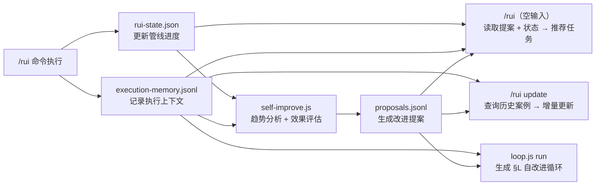

---

## 交付

所有命令的末端，rui **自动触发**以下技能，不等待用户指令：

| Step | 技能 | 触发方式 | 失败处理 |
|------|------|---------|---------|
| 1 | wework-bot | `Skill(wework-bot, --no-send --name <name>)` — 追加消息日志 | 不可跳过 |
| 2 | import-docs | `Skill(import-docs, --workspace)` — 同步全部文档到远端 | H9: API_X_TOKEN 缺失时跳过 |
| 3 | wework-bot | `Skill(wework-bot, --name <name>)` — 发送完成/阻断通知 | 不可跳过 |

> **自动触发**: rui 到达交付阶段时，不询问用户，直接调用 Skill 工具依次触发上述技能。import-docs 同步文档是管线强制步骤，H9 降级仅当 API_X_TOKEN 环境变量缺失时生效。

消息格式（纯文本，emoji 前缀，`———` 分隔）：

```
🎯 结论: 完成 user-login 文档管线
📝 描述: 为登录模块生成故事板，覆盖密码登录、短信验证码、OAuth 三种场景
📌 范围: auth/
👉 下一步: 运行 /rui code user-login 开始编码实现
🌐 影响: docs/故事任务面板/user-login/01-故事任务.md
📎 证据: git log --oneline -1
⏱️ 会话: 自适应规划→策展 全流程 3.2min | 3 agents 参与

———
变更文件: docs/故事任务面板/user-login/01-故事任务.md (新增, 285行)
```

完成或阻断后同时向用户输出下一步提示。字段要求见 wework-bot SKILL.md。

---

## 文档规范

```
<workspace-root>/
└── docs/
    └── 故事任务面板/
        └── <name>/              ← 故事目录（简写，便于分支管理）
            ├── 01-故事任务.md      ← 唯一真相源
            ├── 02-后端技术评审.md
            ├── 03-前端技术评审.md
            ├── 04-测试用例评审.md
            ├── 05-后端实施报告.md
            ├── 06-前端实施报告.md
            ├── 07-测试用例报告.md
            ├── 08-自改进复盘.md
            ├── 09-消息通知列表.md
            ├── .improvement/
            │   └── proposals.jsonl
            └── .memory/
                ├── execution-memory.jsonl
                └── rui-state.json
```


### 故事板章节

| 章节 | 负责人 | 内容 |
|------|--------|------|
| §1 Story | pm | 角色场景、价值、范围边界、依赖 |
| §1.1 User Operations | tester | 用户操作 + UI交互流程 |
| §2 Requirements | pm | 功能点、输入输出、错误行为、业务规则 |
| §3 Design | coder + security | 技术设计 + 安全约束 |
| §4 Tasks | pm + all | 任务拆解、依赖、交付物 |
| §5 Acceptance Criteria | tester | 验收标准、测试方法、预期结果 |
| §6 .claude 改进清单 | pm | skill/agent/rule/script/config 改进（文档生成/策展阶段静态分析） |
| §7 系统架构演进任务 | pm | 近期/中期/远期演进（架构设计/策展阶段结构规划） |
| §L 自我改进循环 | self-improve-loop | 数据驱动改进清单 + 架构演进（每次 rui 完成追加） |

> §6 §7 由 pm 在文档生成阶段写入（结构性）。§L 由 self-improve-loop 在每次 rui 完成时自动追加（数据驱动）。两者互补。

### 故事目录附属文件

| 文件 | 负责人 | 内容 | 产出阶段 |
|------|--------|------|---------|
| 02-后端技术评审.md | coder + security | 后端技术方案评审，覆盖 Service Worker、消息通道、API 接口、存储模型、安全约束 | 文档生成（架构设计后） |
| 03-前端技术评审.md | coder | 前端技术方案评审，覆盖组件树、Hooks 状态管理、交互细节、样式隔离、加载顺序 | 文档生成（架构设计后） |
| 04-测试用例评审.md | tester | 测试用例完整性评审，覆盖功能、边界、异常、回归用例 | 文档生成（架构设计后） |
| 05-后端实施报告.md | coder | 后端实现总结：交付文件清单 → 实际接口 vs 评审比对 → 消息通道比对 → 偏差记录（P0 含风险评估）→ 逐模块 P0 审查清零 → 安全缓解对照 → 存储变更与迁移验证 → 性能观察 → 7 项评审清单 | 验证 |
| 06-前端实施报告.md | coder | 前端实现总结：交付文件清单 → 实际组件 vs 评审比对 → 状态管理比对 → 偏差记录（P0 含风险评估）→ 逐模块 P0 审查清零 → 样式隔离验证 → manifest.json 变更 + 加载顺序验证 → 9 项评审清单 | 验证 |
| 07-测试用例报告.md | tester | 测试执行报告：环境快照（含 commit hash）→ 冒烟测试 + P0/P1 通过率 → 影响链回归 → Extension 专项验证 → 已知问题（P0 阻断，>2 轮 H7）→ Gate B 评估 → 6 项评审清单。引用后端/前端实施报告，交叉验证覆盖所有交付物 | 验证 |
| 08-自改进复盘.md | pm + reporter | 本次故事全过程复盘，覆盖执行记忆回望、基线配置复盘、改进项、经验沉淀 | 自改进 |

---

## 阻断

| # | 场景 | 降级 | 阶段 |
|---|------|------|------|
| H1 | 需求无法解析（空输入/文件不存在/URL不可达） | 否 | 需求解析 |
| H2 | P0 章节缺少上游来源 | 否 | 文档生成, 预检 |
| H3 | 影响链无法闭合 | 否 | 影响分析, 预检 |
| H4 | 文档 P0 不通过且无法自修复 | 否 | 文档生成 |
| H5 | 代码审查 P0 无法修复 | 否 | 实现 |
| H6 | Gate A 未完成但已编码 | 否 | 测试先行→实现 |
| H7 | Gate B >2 轮修复未通过 | 否 | 验证 |
| H8 | 所有模块被阻断 | 否 | 实现 |
| H9 | `API_X_TOKEN` 缺失 | 是 | 交付 |
| H10 | 功能分支未从 main 创建 | 否 | 预检 |
| H11 | self-improve-loop 数据采集失败 | 是 | 自改进 |
| H12 | 功能分支被自动合并到 main | 否 | 预检→交付 |

阻断后: `rui-state.js save --blocked` → `next-step` → 持久化 → 同步（H9/H11 跳过）→ 通知。

---

## 集成点

- **自改进**: `node skills/rui/scripts/self-improve.js <cmd>`
- **自改进循环**: `node skills/rui/scripts/loop.js run --all`
- **执行记忆**: `node skills/rui/scripts/execution-memory.js`
- **断点**: `node skills/rui/scripts/rui-state.js <save|load|clear>`
- **列表**: `node skills/rui/scripts/list.js`
- **--all 状态**: `node skills/rui/scripts/rui-state.js all-init|all-module-done|all-module-blocked|all-status`
- **文档同步**: `Skill(import-docs, --workspace)`（rui 自动触发）
- **通知**: `Skill(wework-bot, --name <story-name>)`（rui 自动触发）
- **.claude 管理**: `Skill(rui-claude, sync|diff)`（独立技能）
- **Agent**: [`agents/AGENT.md`](../../agents/AGENT.md)
- **模板**: [`templates/故事任务模板.md`](templates/故事任务模板.md) · [`templates/后端技术评审模板.md`](templates/后端技术评审模板.md) · [`templates/前端技术评审模板.md`](templates/前端技术评审模板.md) · [`templates/测试用例评审模板.md`](templates/测试用例评审模板.md) · [`templates/后端实施报告模板.md`](templates/后端实施报告模板.md) · [`templates/前端实施报告模板.md`](templates/前端实施报告模板.md) · [`templates/测试用例报告模板.md`](templates/测试用例报告模板.md) · [`templates/自改进复盘模板.md`](templates/自改进复盘模板.md)
- **规则**: [`rules/doc-generation.md`](rules/doc-generation.md) · [`rules/code-pipeline.md`](rules/code-pipeline.md) · [`rules/gate-rules.md`](rules/gate-rules.md) · [`rules/self-improve.md`](rules/self-improve.md)
