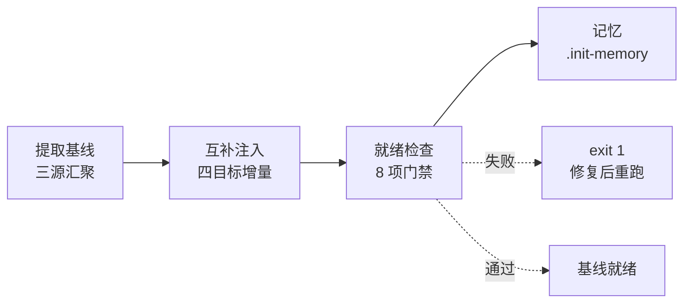

# rui

> 故事驱动 SDLC 编排器。每条命令最终落到「故事任务面板」目录，每个故事独立串行走完管线。

**口诀**：拆故事 → 文档基线 → 测试先行 → 实现 → 验证 → 复盘 → 交付。

哲学源自 [CLAUDE.md](../../CLAUDE.md)。本文件只定义命令面与编排骨架，细节分散在：[rules/](../../rules/) 跨场景约束 · [agents/](../../agents/) 角色契约 · [formulas.md](./formulas.md) 故事文档公式 · [coder.md](./coder.md) 目录与生命周期 + 参考文档公式 + 数据契约。

## 命令面

| 命令 | 用途 | 关键行为 |
|------|------|---------|
| `/rui init [--force\|--dry-run]` | 建立项目基线 | 提取 CLAUDE.md/README.md/package.json → 互补注入 `.claude/`，8/8 就绪检查 |
| `/rui doc <req>` | 拆需求为故事 + 生成文档基线（故事任务 → 评审三件） | 必须分支隔离；禁止改源码；多故事逐个串行 |
| `/rui code <name>` | 实现故事 + 生成验证报告（实施 / 测试 / 自改进复盘） | Gate A 测试先行；Gate B 验证闭合 |
| `/rui <req>` | 端到端 | doc + code 全自动串联 |
| `/rui update <name-or-path> [ctx] [--no-code]` | 增量更新 | T1/T2/T3 裁剪；`--no-code` 仅文档 |
| `/rui code --from-doc <name>` | 从文档反推 | 只读源码补全缺失文档；不覆盖已有 |
| `/rui doc --from-code [req]` | 从源码反推 | req 空时 pm 自主探索（前端/后端/全栈） |
| `/rui list` | 进度全景 | 按文件存在性判定状态 |
| `/rui` | 任务推荐 | 5 层链式管线评分排序 |

`<req>` 支持文本 / `@` 引用本地文件 / URL。CLI `--name` 用 `<Project>-<name>` 格式（如 `YiWeb-user-login`），脚本内分解为路径 `<Project>/<name>`。

## 管线一览

| 阶段细则 | 出处 |
|---------|------|
| 影响分析 / 证据等级 | [agents/AGENT.md](../../agents/AGENT.md) |
| 分支隔离 / P0 审查 | [rules/code-pipeline.md](../../rules/code-pipeline.md) |
| Gate A / Gate B | [rules/gate-rules.md](../../rules/gate-rules.md) |
| 三步交付管线 | [rules/delivery-gate.md](../../rules/delivery-gate.md) |
| 诊断 D0–D7 / 评估 E1–E4 | [rules/self-improve.md](../../rules/self-improve.md) |
| 文档生成强制约束 | [rules/doc-generation.md](../../rules/doc-generation.md) |
| Agent 交接契约 | [agents/](../../agents/) 各角色文件 |

## 阻断标识

| 标识 | 触发 | 阶段 | 降级 |
|------|------|------|------|
| `no-parse` | 需求无法解析 | 需求解析 | 否 |
| `no-source` | P0 章节缺上游来源 | 文档生成 / 预检 | 否 |
| `chain-broken` | 影响链未闭合 | 影响分析 / 预检 | 否 |
| `doc-p0` | 文档 P0 不通过且无法自修复 | 文档生成 | 否 |
| `code-p0` | 代码 P0 无法修复 | 实现 | 否 |
| `skip-gate-a` | Gate A 未通过即编码 | 测试先行→实现 | 否 |
| `gate-b-limit` | Gate B >2 轮 | 验证 | 否 |
| `bad-branch` | 分支未从 main 创建或混入非本故事代码 | 预检 | 否 |
| `no-checkout` | 未切换故事分支即改源码 | 预检→实现 | 否 |
| `auto-merge` | 功能分支被自动合并到 main | 预检→交付 | 否 |
| `no-token` | `API_X_TOKEN` 缺失 | 交付 | 是 |
| `no-metrics` | self-improve 数据采集失败 | 自改进 | 是 |

阻断后：`node ~/.claude/plugins/marketplaces/yry/skills/rui/scripts/rui-state.js save --blocked` → 持久化 → 通知（`no-token` / `no-metrics` 跳过）。重跑同命令从 `current_stage` 续。

## 核心约束

1. **逐故事串行** — 多故事按拆分顺序处理，互不交叉
2. **分支隔离** — `feat/<project>-<name>` 从 main/master 创建；不可派生、不可自动合并
3. **源码改动唯一入口** — 只能走 `/rui code` 管线（`no-checkout`）
4. **测试先行** — Gate A 阻断实现；Gate B >2 轮阻断交付
5. **逐模块审查** — 每模块后审查，P0 清零再前进
6. **只读反推** — `--from-code` / `--from-doc` 禁止改源码
7. **产出内聚** — 关键产出限定在故事目录或对应参考文档目录
8. **交付强制** — 三步管线按序标记（`delivery-gate.js mark`），Stop hook 检查未闭合即阻断
9. **公式驱动** — 文档由 [formulas.md](./formulas.md) 规约，不再依赖模板目录
10. **知识沉淀** — 写入 `.memory/execution-memory.jsonl` + `.memory/rui-state.json`；提案写入 `.improvement/proposals.jsonl`

## init 简述

> **口诀：提基线、互补注、查八项。** 提取项目特有信号，与插件公共内容做归一化去重，仅追加「基线补充」章节，不重复写公共概念。

### 1. 提取基线（三源汇聚）

| 源 | 抽取字段 | 用法 |
|----|---------|------|
| `CLAUDE.md` | 三公理 / 六原则 / 七准则 / 编码规范 / 禁止事项 / 关键文件 / 安全约束 | 哲学锚点 + 项目特有约束 |
| `README.md` | 项目描述 / 系统能力 / 项目结构 / 技术栈 / 核心模块 / 构建命令 / 测试命令 / 部署信息 | 系统视图 + 命令词典 |
| `package.json` | dependencies / devDependencies / scripts / 已识别框架版本 | 真实依赖 + 自动补充命令 |

类型识别由 `constants.detectProjectType` 复用源码扫描（扩展名权重 / 框架依赖 / API 模式签名 / 元项目信号）→ `frontend` / `backend` / `fullstack` / `meta` / `unknown`。结果写入 `.claude/project-profile.json`，含 `coder_formula` 与 `story_defaults`（决定每故事必选/可选文件骨架）。

### 2. 互补注入（四目标增量）

注入采用**归一化去重**：先把目标文件正文做大小写折叠 + 空白压缩 + Markdown 字符剥离，再按字符串包含 + 4 词关键短语命中判定 → 已覆盖项标注「无需补充」，**仅追加项目特有的「基线补充」章节**。

| 注入目标 | 标记锚点 | 注入小节（按需） |
|---------|---------|----------------|
| `.claude/agents/coder.md` | `<!-- project-type-injected -->` | 项目+类型+Coder 公式摘要 / 技术栈 / 编码规范 / 禁止事项 / 关键文件 / 核心模块 / 构建命令 |
| `.claude/agents/tester.md` | `<!-- project-baseline-injected -->` | 测试命令 / 构建命令 / 编码规范（测试需遵循） |
| `.claude/agents/security.md` | `<!-- project-baseline-injected -->` | 安全约束 / 技术栈（审查范围）/ 安全敏感依赖（jsonwebtoken / bcrypt / helmet / passport / oauth …）/ 部署环境（攻击面） |
| `.claude/rules/code-pipeline.md` | `<!-- project-baseline-injected -->` | 构建+测试命令（Gate B 验证用）/ 禁止事项 |

注入写入位置统一在 `## 触发` 之前（agents）或文末（rules），便于 `--force` 时定位旧内容并整段替换。

公共物料**整文件复制**而非注入（每次 init 同步最新）：
- `agents/AGENT.md` + 6 角色（pm / coder / tester / reporter / security / self-improve）
- `rules/` 全部规则（code-pipeline / doc-generation / gate-rules / delivery-gate / self-improve / import-docs / rui-claude / no-magic-number）
- `skills/rui/formulas.md` → `.claude/formulas.md`
- `skills/rui/coder.md` → `.claude/coder.md`
- `.mcp.json` / `settings.json` → `.claude/`
- `settings.local.json`（首次生成空模板）+ `.claude/.gitignore`（排除本地文件）

### 3. 就绪检查（8 项门禁）

每项做**结构 + 内容**双重校验，任一未通过 `exit 1`：

| # | 检查项 | 通过条件 |
|---|--------|--------|
| 1 | `CLAUDE.md` | 三公理 + 守底线原则 + 思在前准则 + 退化对策 全部命中 |
| 2 | `README.md` | 系统能力 + 项目结构 + 快速开始 + `/rui init` 命令存在 |
| 3 | `.claude/agents/` | `AGENT.md`（≥100 字）+ 6 角色 frontmatter 合法 |
| 4 | `.claude/rules/` | 6 个核心规则文件齐备 |
| 5 | `.claude/formulas.md` | F.meta + F.story.01–08 + F.supp.\* 全部模式命中 |
| 6 | `.claude/.mcp.json` | JSON 合法 + 含 `mcpServers` 字段 |
| 7 | `.claude/settings.json` | JSON 合法 + `permissions` 非空 |
| 8 | `.claude/` 目录 | `agents/` + `rules/` + `formulas.md` + `coder.md` + `settings.json` + `.mcp.json` + `settings.local.json` 全部存在 |

### 4. 选项

| 选项 | 行为 |
|------|------|
| `--dry-run` | 仅扫描+报告，不写文件；显示 `will-create` / `will-copy` 标识 |
| `--force` | 覆盖整文件，识别既有注入锚点并整段替换；适用于基线文件升级后刷新 |
| `--json` | 机器可读输出（基线快照 + 注入清单 + 检查结果 + 推荐下一步） |

### 5. 产物

| 路径 | 用途 |
|------|------|
| `.claude/project-profile.json` | 项目画像（类型/Coder 公式/故事骨架默认值），后续 `/rui doc` 据此选骨架 |
| `.claude/.gitignore` | 排除 `settings.local.json` + `.history/` |
| `docs/故事任务面板/.init-memory.json` | init 单次执行的记忆条目（与 execution-memory.jsonl 同 schema），便于复盘 |

## 集成

| 类别 | 内容 |
|------|------|
| 脚本 | `~/.claude/plugins/marketplaces/yry/skills/rui/scripts/`：init · list · recommend · rui-state · execution-memory · self-improve · delivery-gate · loop · natural-week · constants |
| Skills | `import-docs --workspace`（同步） · `wework-bot --name <name>`（通知） |
| 规则 | [code-pipeline](../../rules/code-pipeline.md) · [gate-rules](../../rules/gate-rules.md) · [doc-generation](../../rules/doc-generation.md) · [delivery-gate](../../rules/delivery-gate.md) · [self-improve](../../rules/self-improve.md) · [import-docs](../../rules/import-docs.md) · [rui-claude](../../rules/rui-claude.md) · [no-magic-number](../../rules/no-magic-number.md) |
| 角色 | [pm](../../agents/pm.md) · [coder](../../agents/coder.md) · [tester](../../agents/tester.md) · [reporter](../../agents/reporter.md) · [security](../../agents/security.md) · [self-improve](../../agents/self-improve.md) |
| 文档 | [formulas.md](./formulas.md) — 故事文档公式（F.story.\* + F.supp.\*） · [coder.md](./coder.md) — 目录生命周期 + 参考文档公式（F.ref.\*） + 数据契约（`.memory/` + `.improvement/`） |
