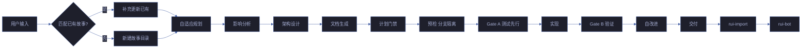
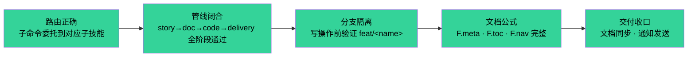

# rui

> 故事驱动 SDLC 编排器：接收用户需求，路由到对应子技能管线。自主识别故事任务 → 委托子技能执行。
>
> 哲学源自 [CLAUDE.md](../../CLAUDE.md)。命令路由表定义 `/rui` 与各子技能的关系。

[命令路由](#命令路由) · [推荐引擎](#推荐引擎) · [管线一览](#管线一览) · [核心规则](#核心规则) · [阻断标识](#阻断标识) · [子技能一览](#子技能一览) · [子技能契约](#子技能契约) · [支撑文件](#支撑文件) · [生效标志](#生效标志)

## 命令路由

| 用户输入 | 路由目标 | 说明 |
|---------|---------|------|
| `/rui init` | → [rui-init](../rui-init/) | 项目基线建立 |
| `/rui doc <需求>` | → [rui-doc](../rui-doc/) | 需求 → 文档基线 |
| `/rui doc --from-code [需求]` | → [rui-doc](../rui-doc/) | 源码反推文档 |
| `/rui doc --from-local <name>` | → [rui-doc](../rui-doc/) | 补全缺失文档 |
| `/rui plan <name>` | → [rui-plan](../rui-plan/) | 实施计划生成 |
| `/rui code <name>` | → [rui-code](../rui-code/) | 源码实现 |
| `/rui code --from-doc <name>` | → [rui-code](../rui-code/) | 文档反推补全 |
| `/rui update <name> [ctx]` | → [rui-update](../rui-update/) | 增量更新 |
| `/rui yry [--depth N]` | → [rui-yry](../rui-yry/) | 自改进闭环 |
| `/rui version --up` | → [rui-version](../rui-version/) | 版本升级 |
| `/rui version --rollback <name>` | → [rui-version](../rui-version/) | 版本回退 |
| `/rui <需求>` | → rui-doc → rui-code | 端到端 |
| `/rui` (无参数) | 推荐引擎 | 任务推荐 |

## 推荐引擎

> 无参数 `/rui` 触发推荐，不执行任何写入操作。

1. **§0 面板同步** — 同步远端 + 扫描本地故事面板，检测冲突
2. **L-1 基建优先** — 7 项基建（错误码/状态管理/日志规范/配置管理等）任一缺位时优先推荐
3. **5 层评分** — 数据采集（`node lib/recommend.mjs`）→ PM 按 [ranking.md](./ranking.md) 评估排序
4. **冲突避免** — FP# 重叠 ≥ 70% 跳过推荐，50–69% 标注警告

## 管线一览



## 核心规则

| # | 规则 |
|---|------|
| 1 | **逐故事串行** — 多故事按拆分顺序处理，互不交叉 |
| 2 | **分支隔离（强制）** — 任何 Edit/Write 前必须验证当前分支为 `feat/<name>` |
| 3 | **源码唯一入口** — 只能走 `/rui code` 改源码 |
| 4 | **测试先行** — Gate A 阻断实现；Gate B >2 轮阻断交付 |
| 5 | **逐模块 P0 清零** — 每模块审查后 P0 清零再前进 |
| 6 | **只读反推** — `--from-code` / `--from-doc` 禁止改源码 |
| 7 | **产出内聚** — 关键产出限定在 `docs/故事任务面板/<name>/` |
| 8 | **公式驱动** — 文档由 [formulas.md](./formulas.md) 规约 |
| 9 | **知识沉淀** — 提案写入 `.improvement/proposals.jsonl`；执行记忆写入 `.memory/execution-memory.jsonl` |
| 10 | **交付收口** — 手动按需触发 rui-import + rui-bot |
| 11 | **自主测试** — 每次故事任务变更后自动执行自检 |
| 12 | **表达优先** — 文档内容必须 图 → 结构化文本 → 表，架构/流程/关系优先 mermaid，不可降级 |

## 阻断标识

| 标识 | 含义 |
|------|------|
| `no-parse` | 需求无法解析 |
| `no-source` | P0 章节缺上游来源 |
| `chain-broken` | 影响链未闭合 |
| `doc-p0` | 文档 P0 不通过且无法自修复 |
| `no-doc-isolation` | doc/update 阶段在非 `feat/<name>` 分支写入 |
| `bad-branch` | 分支未从 main 创建或混入非本故事代码 |
| `no-checkout` | 未切换故事分支即写入/改码 |
| `no-branch-isolation` | `node lib/branch-check.mjs` 验证失败 |
| `skip-gate-a` | Gate A 未通过即编码 |
| `code-p0` | 代码 P0 无法修复 |
| `gate-b-limit` | Gate B >2 轮 |
| `auto-merge` | 功能分支被自动合并到 main |
| `no-token`（降级） | `API_X_TOKEN` 缺失 |
| `no-metrics`（降级） | self-improve 数据采集失败 |
| `no-plan` | 文档后无计划 |
| `plan-placeholder` | 计划中有 TODO/TBD |

## 子技能一览

| 技能 | 目录 | 职责 |
|------|------|------|
| rui-init | [../rui-init/](../rui-init/) | 项目初始化 |
| rui-doc | [../rui-doc/](../rui-doc/) | Markdown 文档基线生成 |
| rui-plan | [../rui-plan/](../rui-plan/) | 实施计划 |
| rui-code | [../rui-code/](../rui-code/) | 源码实现管线 |
| rui-update | [../rui-update/](../rui-update/) | 增量更新 |
| rui-yry | [../rui-yry/](../rui-yry/) | 自改进闭环 |
| rui-version | [../rui-version/](../rui-version/) | 版本管理 |
| rui-html | [../rui-html/](../rui-html/) | HTML 文档生成 |
| rui-analysis | [../rui-analysis/](../rui-analysis/) | 代码与架构静态分析 |
| rui-reporter | [../rui-reporter/](../rui-reporter/) | 过程报告与知识策展 |
| rui-story | [../rui-story/](../rui-story/) | 故事面板管理 |
| rui-claude | [../rui-claude/](../rui-claude/) | .claude/ 配置管理 |
| rui-import | [../rui-import/](../rui-import/) | 文档远端同步 |
| rui-bot | [../rui-bot/](../rui-bot/) | 企业微信通知 |
| rui-npm | [../rui-npm/](../rui-npm/) | npm 包管理 |
| rui-trends | [../rui-trends/](../rui-trends/) | 技术趋势发现 |
| rui-skills | [../rui-skills/](../rui-skills/) | Agent 技能生态发现与安装 |

## 子技能契约

> 每个子技能的输入/输出/交接信号。rui 编排器据此验证阶段完成状态。

| 阶段 | 技能 | 输入 | 输出 | 交接信号 |
|------|------|------|------|---------|
| 初始化 | rui-init | 项目根目录 | CLAUDE.md · README.md · docs/index.html | 三文件存在且非空 |
| 需求→文档 | rui-doc | 用户需求文本/URL/@文件 | 故事任务.md + 场景-N-<slug>.md (§0+§1) | §0 含效果示意 mermaid · F.meta 完整 |
| 计划 | rui-plan | 故事目录 | plan.html + 计划清单.html | plan.html 存在 · 六项自审查通过 |
| 实现 | rui-code | 故事目录 + 计划 | §2 实施报告 + 源码变更 | P0 全模块清零 · Gate B ≤2 轮 |
| 增量更新 | rui-update | 故事名 + 变更上下文 | 按 T 级刷新的文档/代码 | 版本号 + version_history 已更新 |
| 自改进 | rui-yry | 故事面板全量数据 | D0-D8 诊断 + proposals.jsonl | 提案已写入 · E1-E4 评估完成 |
| 版本管理 | rui-version | 版本号/回退目标 | plugin.json + CLAUDE.md + 文档版本行 | 版本号全局一致 |
| 面板管理 | rui-story | 故事名 (可选) | 状态概览/同步/删除 | 远端查询成功或同步完成 |
| HTML 生成 | rui-html | 故事目录 | 7 类 HTML 文件 | 每场景 HTML 自包含可渲染 |
| 文档同步 | rui-import | 项目根/目录 | 远端 session 更新 | created/overwritten/failed 计数 |
| 通知 | rui-bot | 消息文本 | 企业微信消息 + 通知日志 | HTTP 200 响应 |
| 趋势发现 | rui-trends | 技术栈关键词 | 趋势快照 + D5 诊断注入 | 多源采集 ≥2 可用 |
| 静态分析 | rui-analysis | 项目根/范围路径 | 五维分析报告 | 每条发现附文件路径证据 |
| 配置管理 | rui-claude | .claude/ 目录 | 健康报告/同步 | 版本一致 · 无漂移 |
| 生态发现 | rui-skills | 查询词/包名 | 技能候选列表/安装确认 | 元数据 · 依赖 · 兼容性验证通过 |

## 支撑文件

| 类别 | 内容 |
|------|------|
| 文档公式 | [formulas.md](./formulas.md) — F.meta · F.toc · F.nav · F.story.task · F.story.scene · F.story.knowledge-graph · F.supp.* |
| Coder 工作手册 | [coder.md](./coder.md) — 目录布局 · 生命周期 · 完整度判定 · 数据契约 |
| 推荐评分 | [ranking.md](./ranking.md) — 5 层链式管线评分框架 |
| 关注点 | [concerns/](./concerns/) — 集成 · 诊断 · 架构 · 交接 |
| 共享脚本 | [lib/audit.mjs](../../lib/audit.mjs) · [lib/branch-check.mjs](../../lib/branch-check.mjs) · [lib/recommend.mjs](../../lib/recommend.mjs) · [lib/proposals.mjs](../../lib/proposals.mjs) · [lib/record.mjs](../../lib/record.mjs) |
| 规则 | [code-pipeline](../rui-code/rules/code-pipeline.md) · [delivery-gate](./rules/delivery-gate.md) · [doc-generation](../rui-html/rules/doc-generation.md) · [self-improve](../rui-yry/rules/self-improve.md) · [rui-claude](../rui-claude/rules/rui-claude.md) · [agent-handoff](./rules/agent-handoff.md) · [architecture-principles](./rules/architecture-principles.md) · [design-principles](./rules/design-principles.md) · [mermaid-theme](./rules/mermaid-theme.md) · [security-guardrails](./rules/security-guardrails.md) |

## 测试

> 编排器路由、命令委托、阶段转换、Agent 契约和阻断标识的自动化验证。

### 运行测试

```bash
npx vitest run skills/rui/tests/          # 全量运行
npx vitest skills/rui/tests/              # 监听模式
npx vitest run --coverage skills/rui/tests/  # 覆盖率报告
```

### 测试文件

| 文件 | 测试范围 | 类型 |
|------|---------|:---:|
| `tests/rui.test.mjs` | 编排器路由、命令委托、阶段转换验证 | 单元 |
| `tests/agents.test.mjs` | Agent 角色定义、交接信号契约格式 | 契约 |
| `tests/rules.test.mjs` | 核心规则验证、铁律合规检查 | 单元 |
| `tests/cross-references.test.mjs` | 跨技能引用完整性、文件路径可达性 | 集成 |
| `tests/unit/engine.test.mjs` | 推荐引擎 5 层评分逻辑、排序算法 | 单元 |
| `tests/infrastructure/framework-presence.test.mjs` | 测试框架就绪、vitest 配置验证 | 基础设施 |
| `tests/infrastructure/third-party-reachability.test.mjs` | 外部资源可达性检查 | 基础设施 |

### 测试策略

| 层级 | 范围 | 要求 |
|------|------|------|
| **单元测试** | 路由表、阶段转换逻辑、推荐引擎评分 | 每个路由条目须有对应测试 |
| **集成测试** | 编排器 → 子技能委托、管线闭合验证 | 关键路径全覆盖 |
| **契约测试** | Agent 交接信号格式、子技能输入/输出边界 | 契约变更须同步更新测试 |
| **基础设施测试** | 框架就绪、外部资源可达性 | CI 环境自动跳过不可达检查 |

### 覆盖要求

| 维度 | 最低阈值 | 目标 |
|------|:---:|:---:|
| 命令路由覆盖 | 100% | 每条路由规则有对应测试用例 |
| 阻断标识覆盖 | 100% | 每个阻断标识有触发场景测试 |
| 阶段转换覆盖 | 100% | 每个转换验证点有通过/阻断双路径测试 |
| 降级策略覆盖 | ≥ 80% | 每种降级情况有对应测试 |

### 测试编写规范

- 测试文件命名：`tests/<feature>.test.mjs`
- 使用 `describe`/`it` 结构，测试描述使用中文
- 每个测试用例只验证一个行为
- 外部依赖（API/网络）使用 mock，本地逻辑使用真实数据

## 降级策略

| 情况 | 降级行为 | 恢复方式 | 影响范围 |
|------|---------|---------|---------|
| 子技能执行失败 | 记录阻断标识，退回失败阶段 | 修复失败原因后重试 | 当前故事 |
| 需求无法解析 | 输出 `no-parse` 阻断，提示重新描述 | 用户重新描述需求 | 当前故事 |
| 文档 P0 不通过且无法自修复 | 输出 `doc-p0` 阻断，人工介入 | 人工修复文档 P0 | 当前故事 |
| 分支隔离验证失败 | 输出 `no-branch-isolation` 阻断，引导切分支 | 切换到 feat/<name> 分支 | 当前故事 |
| Gate B > 2 轮 | 输出 `gate-b-limit` 阻断，质疑架构 | 架构评审后重新设计 | 当前故事 |
| self-improve 数据采集失败 | 输出 `no-metrics` 降级，不阻断交付 | 下次执行时重试采集 | 仅诊断 |
| rui-import 同步失败 | 记录告警，不影响交付状态 | 手动执行 sync | 仅同步 |
| rui-bot 通知失败 | 记录告警，不影响交付状态 | 入失败队列，flush 重试 | 仅通知 |

## 生效标志



| 标志 | 未达标的处置 |
|------|------------|
| 路由正确：所有 `/rui <sub>` 委托到正确子技能 | 检查命令路由表和子技能 SKILL.md |
| 管线闭合：story → doc → code → delivery 四阶段全部通过 | 退回失败阶段重新执行 |
| 分支隔离：写操作前 `git branch --show-current` 为 `feat/<name>` | 切到 feat 分支后重新执行 |
| 文档公式：所有产出文档符合 F.meta + F.toc + F.nav | 补全缺失的公式元素 |
| 交付收口：文档同步到远端 + 通知已发送 | 手动执行 sync + rui-bot |

## 决策流

> 编排器如何根据用户输入选择执行路径。

```
用户输入 /rui <sub> [args]
  │
  ├─ 无参数 → 推荐引擎 (5 层评分)
  │
  ├─ init → 直接委托 rui-init (六步管线)
  │
  ├─ doc <需求> → 委托 rui-doc
  │   ├─ 需求可拆分 → 多故事串行
  │   └─ 需求不可拆分 → 单故事
  │
  ├─ plan <name> → 委托 rui-plan
  │   ├─ plan.html 不存在 → 生成计划
  │   └─ plan.html 已存在 → 询问是否覆盖 (--force)
  │
  ├─ code <name> → 委托 rui-code
  │   ├─ Gate A 通过 → 逐模块实现
  │   ├─ Gate B 通过 → 交付
  │   └─ 任一 Gate 失败 → 阻断 + 诊断
  │
  ├─ update <name> → 委托 rui-update
  │   └─ 自动判定 T1/T2/T3 (可 --level 覆盖)
  │
  ├─ yry [--depth N] → 委托 rui-yry
  │   └─ 循环至无改进空间或达到 depth 上限
  │
  └─ version --up|--rollback → 委托 rui-version
```

## 阶段转换验证

> 编排器在每个阶段转换时验证子技能的输出。

| 转换 | 验证点 | 阻断条件 |
|------|--------|---------|
| init → doc | CLAUDE.md + README.md + docs/index.html 存在且非空 | 任一文件缺失 |
| doc → plan | 故事任务.md + 场景-N-<slug>.md 存在且 §0 含 mermaid | 文档基线不完整 |
| plan → code | plan.html + 计划清单.html 存在且无 TODO/TBD | 计划缺失或有占位符 |
| code → delivery | P0 全部清零 + Gate B ≤ 2 轮 | P0 未清零或 Gate B 超限 |
| delivery → 完成 | import 同步 + bot 通知 | 同步/通知失败 (非阻断) |

## 降级策略

| 情况 | 降级行为 | 恢复方式 | 影响范围 |
|------|---------|---------|---------|
| 子技能执行失败 | 记录阻断标识，退回失败阶段 | 修复失败原因后重试 | 当前故事 |
| 需求无法解析 | 输出 `no-parse` 阻断，提示重新描述 | 用户重新描述需求 | 当前故事 |
| 文档 P0 不通过且无法自修复 | 输出 `doc-p0` 阻断，人工介入 | 人工修复文档 P0 | 当前故事 |
| 分支隔离验证失败 | 输出 `no-branch-isolation` 阻断，引导切分支 | 切换到 feat/<name> 分支 | 当前故事 |
| Gate B > 2 轮 | 输出 `gate-b-limit` 阻断，质疑架构 | 架构评审后重新设计 | 当前故事 |
| self-improve 数据采集失败 | 输出 `no-metrics` 降级，不阻断交付 | 下次执行时重试采集 | 仅诊断 |
| rui-import 同步失败 | 记录告警，不影响交付状态 | 手动执行 sync | 仅同步 |
| rui-bot 通知失败 | 记录告警，不影响交付状态 | 入失败队列，flush 重试 | 仅通知 |
