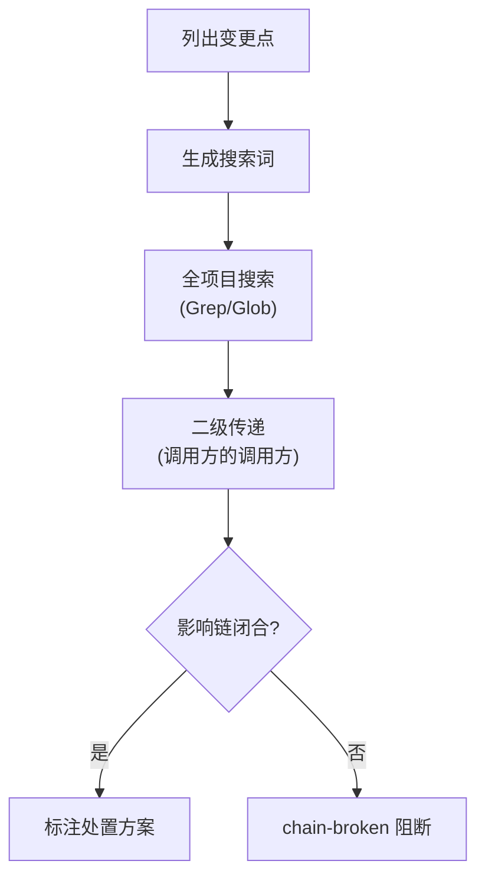
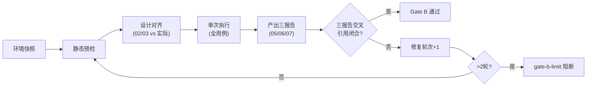
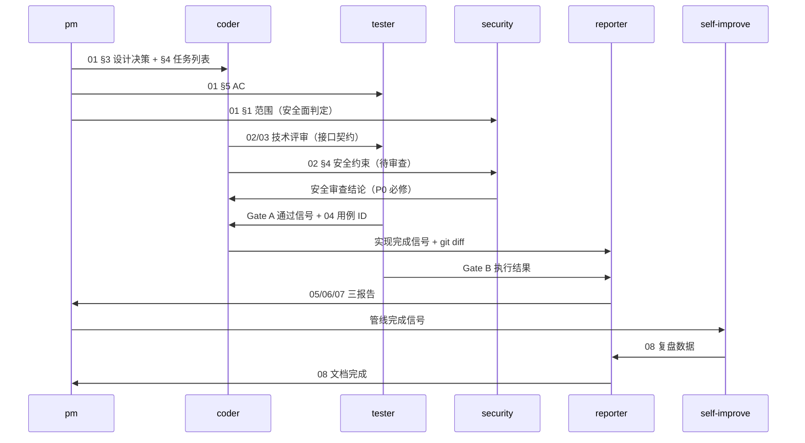

# rui

故事驱动 SDLC 编排器。需求拆分产生多个故事时逐故事串行处理，每个故事独立走完管线。

| 角色 | 公式 | 一句话 |
|------|------|--------|
| PM | 作为 [角色] 我想要 [动作] 以便 [价值] | 故事 = 场景 + 边界 |
| Tester | Given [前置] When [操作] Then [预期] | 验收标准可独立验证 |
| Coder | 模块 → 接口 → 数据流 | 先拆模块再定契约 |
| Security | 威胁 → 信任边界 → 缓解 | 每个威胁有明确对策 |
| Reporter | 事实 → 偏差 → 影响 | 做了什么、差了什么、意味着什么 |
| Self-Improve | 观察 → 诊断 → 改进 | 数据采集 → 根因分析 → 可执行行动 |

## 命令

| 命令 | 流程 | 行为细节 |
|------|------|---------|
| `/rui init` | 基线 → 基线注入 → 就绪检查(8项) → 交付 | `node ~/.claude/plugins/marketplaces/yry/skills/rui/scripts/init.js`; `--dry-run` 预览, `--json` 结构化输出, `--force` 强制覆盖并重新注入基线 |
| `/rui doc <req>` | 必须使用分支隔离；需求拆分 → 逐故事: 自适应规划→影响分析→架构设计→文档生成 | 文档生成后同步；故事目录 `<project>-<name>`（name 部分 kebab-case）；禁止改源码 |
| `/rui code <name>` | 必须使用分支隔离；预检→Gate A(测试先行)→逐模块实现→Gate B(验证)→自改进→交付 | 单行 CSS 可跳过 Gate A；>2轮修复 `gate-b-limit` 阻断；验证后同步 |
| `/rui <req>` | 必须使用分支隔离；doc + code 全自动串联，逐故事端到端 | — |
| `/rui update <name-or-path> [ctx] [--no-code]` | 必须使用分支隔离；存在性检查→结构检测(按文档类型自适应)→结构补齐→上下文解析→变更分级(T1/T2/T3)→增量更新→预检→code | 默认走 code 管线；`--no-code` 跳过代码阶段仅更新文档；补齐标注"由 rui update 结构补齐"；已有文档按级别裁剪；`<name-or-path>` 支持故事名 `{project}-{name}`（→故事任务面板）和目录路径 `组件文档/{project}/{name}` / `接口文档/{project}/{name}` / `页面文档/{project}/{name}` / `领域模型/{project}/{name}`；非故事参考文档自动跳过代码阶段 |
| `/rui code --from-doc <name>` | 必须使用分支隔离；读取故事任务文档+探索源码(只读)→生成缺失的技术评审与报告文档 | 已有文档不覆盖，全部存在则退出；禁止改源码 |
| `/rui doc --from-code [req]` | 从源码反推故事→生成全文档基线(只读)；req 为空时 pm 按项目类型探索：前端→组件发现→组件全文档，后端→接口发现→接口全文档，全栈→两端独立推荐 | 禁止改源码 |
| `/rui list` | 扫描故事面板 → 进度表; 调用 `node ~/.claude/plugins/marketplaces/yry/skills/rui/scripts/list.js` | 按文件完整性判定: 未开始/文档中/代码中/完成/阻断 |
| `/rui` | 调用 `node ~/.claude/plugins/marketplaces/yry/skills/rui/scripts/recommend.js --json` → 推荐 5~20 条任务 | 链式管线 L1→L5（Gates → StoryFlow → Coverage → HealthSignals → Hygiene），按 priority×urgency×impact×fit−cost 综合评分排序；故事级 headline 自动吸收同故事的角色级子信号，避免噪音 |

`<requirement>` 支持：文本 / `@` 引用本地文件 / URL。`--from-code` 时 req 可选，为空时 pm 自主扫描源码识别可文档化模块并输出推荐列表。故事目录格式 `<project>-<name>`（project 为项目标识，name 为 kebab-case，如 `YiWeb-user-login`）。

### init 管线

```
基线提取                        基线注入                      就绪检查(8项)
CLAUDE.md ──→ 哲学/原则/准则 ──→ .claude/agents/ ──→ 1. CLAUDE.md 哲学完整
README.md ──→ 能力/结构/命令 ──→ .claude/rules/  ──→ 2. README.md 系统文档
package.json → 技术栈/脚本    → .claude/templates/ ──→ 3. .claude/agents/ 7文件有效
              项目类型检测      → .claude/.mcp.json  ──→ 4. .claude/rules/ 6文件存在
              编码规范提取      → .claude/settings.* ──→ 5. .claude/templates/ 8模板存在
              禁止事项提取      → project-profile.json ──→ 6. .claude/.mcp.json 有效JSON
              安全约束提取                          ──→ 7. settings.json 权限配置
              关键文件提取                          ──→ 8. .claude/ 目录完整
```

**基线注入增强（互补模式）**：init 不仅复制模板文件，还从项目基线文件（CLAUDE.md、README.md、package.json）提取项目特有信息，**与插件已有内容做去重比对后**，仅注入互补信息到生成的 agents 和 rules 文件中。已在插件文件中覆盖的内容不会重复注入。

| 注入目标 | 注入内容（仅补充插件未覆盖部分） | 来源 |
|---------|---------|------|
| coder.md | 项目类型公式、技术栈、编码规范、禁止事项、关键文件、核心模块、构建命令 | CLAUDE.md + README.md + package.json |
| tester.md | 测试命令、构建命令、编码规范 | README.md + package.json |
| security.md | 安全约束、技术栈、生产依赖（安全敏感标注）、部署环境 | CLAUDE.md + README.md + package.json |
| code-pipeline.md | 构建/测试命令、禁止事项 | CLAUDE.md + README.md + package.json |
| project-profile.json | 项目类型、Coder公式、story_defaults | 自动检测 |

**去重策略**：注入前读取目标文件已有内容，通过归一化文本匹配（忽略 markdown 格式、大小写、空白差异）判定信息是否已存在。仅注入"基线补充"章节，标题明确标注为补充内容。若基线信息已被插件文件完整覆盖，则跳过注入并标注"无需补充"。

就绪检查 8/8 通过后项目可开始 `/rui doc` 或 `/rui code`。未通过项需修复后重新运行 init。

## 阻断规则

| 标识 | 场景 | 降级 | 阶段 |
|------|------|------|------|
| `no-parse` | 需求无法解析 | 否 | 需求解析 |
| `no-source` | P0 章节缺少上游来源 | 否 | 文档生成, 预检 |
| `chain-broken` | 影响链无法闭合 | 否 | 影响分析, 预检 |
| `doc-p0` | 文档 P0 不通过且无法自修复 | 否 | 文档生成 |
| `code-p0` | 代码审查 P0 无法修复 | 否 | 实现 |
| `skip-gate-a` | Gate A 未完成但已编码 | 否 | 测试先行→实现 |
| `gate-b-limit` | Gate B >2 轮修复未通过 | 否 | 验证 |
| `no-token` | `API_X_TOKEN` 缺失 | 是 | 交付 |
| `bad-branch` | 功能分支未从 main 创建或混入非本故事代码 | 否 | 预检 |
| `no-metrics` | self-improve 数据采集失败 | 是 | 自改进 |
| `auto-merge` | 功能分支被自动合并到 main | 否 | 预检→交付 |
| `no-checkout` | 未切换到故事分支即改动源码 | 否 | 预检→实现 |

阻断后: `node ~/.claude/plugins/marketplaces/yry/skills/rui/scripts/rui-state.js save --blocked` → `next-step` → 持久化 → 通知(`no-token`/`no-metrics` 跳过)。

详见 [rules/gate-rules.md](../../rules/gate-rules.md) · [rules/code-pipeline.md](../../rules/code-pipeline.md)。

## 核心规则

1. **逐故事串行** — 需求拆分可创建多个故事目录，每个独立走完管线后再处理下一个
2. **增量更新** — 已有文档按 T1(措辞/格式)/T2(增删故事/接口变更)/T3(边界变化/跨故事重构) 裁剪；`/rui update` 默认走 code 管线，`--no-code` 仅更新文档不触发代码阶段
3. **测试先行** — Gate A 阻断实现；Gate B >2 轮修复阻断交付(`gate-b-limit`)
4. **逐模块审查** — 每模块后审查，P0 清零前进
5. **分支隔离** — 预检阶段必须从 main 创建 `feat/<project>-<name>` 分支并 checkout；各分支独立禁止派生(`bad-branch` / `no-checkout`)
6. **禁止自动合并** — 任何阶段不得将功能分支合并到 main(`auto-merge`)
7. **源码修改唯一入口** — 对源代码的任何修改必须通过 `/rui code` 管线(`no-checkout`)
8. **只读代码** — `/rui doc --from-code` 和 `/rui code --from-doc` 仅生成文档，禁止改源码
9. **产出内聚** — 关键产出仅限于故事目录 `docs/故事任务面板/{project}/{name}/` 内
10. **交付管线强制** — 三步交付管线 (wework-bot 追加日志 → import-docs 同步 → wework-bot 发送) 每步必须执行并标记 (`node ~/.claude/plugins/marketplaces/yry/skills/rui/scripts/delivery-gate.js mark`)。Stop hook 自动检查未完成管线阻断停止。
11. **知识沉淀** — 执行记忆写 execution-memory.jsonl + rui-state.json

## 管线阶段详解

### 影响分析阶段

影响分析是文档管线和代码管线的关键前置步骤。目标：证明变更点的上下游已全部覆盖。



| 步骤 | 操作 | Agent | 产出 |
|------|------|-------|------|
| 1. 变更点枚举 | 从需求/设计推导所有变更文件和接口 | coder | 变更点清单 |
| 2. 搜索词生成 | 每个变更点生成 ≥2 个搜索词（函数名、类名、路径引用） | coder | 搜索词表 |
| 3. 全项目搜索 | 对每个搜索词执行 Grep，记录所有引用位置 | coder | 引用位置表 |
| 4. 二级传递 | 对引用位置的调用方再搜索一层 | coder | 传递影响表 |
| 5. 处置标注 | 每个影响点标注：无需改动 / 需同步修改 / 需通知下游 | coder + reporter | 处置方案 |
| 6. 闭合验证 | 所有"需同步修改"项已有对应任务 | pm | 闭合确认 |

**P0 门禁**：搜索完成前不生成设计结论；影响链未闭合不删/改公共接口。

### Gate A — 测试先行

Gate A 确保实现前有可验证的测试方案。

| 输入 | 操作 | 输出 | 通过标准 |
|------|------|------|---------|
| 01-故事任务.md §5 AC | tester 编写测试方案 + 原型 | 04-测试用例评审.md | P0 用例全覆盖 |
| 02/03 技术评审 | tester 推导边界/异常用例 | 04 §2.2/2.3 | 每 FP ≥3 类用例 |

**tester → coder 交接**：Gate A 通过后 tester 输出"可实现信号"，coder 方可开始编码。交接物：
- 04-测试用例评审.md（完整）
- Gate A 用例 ID 列表（coder 实现时逐个验证）

### Gate B — 验证闭合

Gate B 确保实现与设计对齐、测试通过、报告完整。



| 步骤 | Agent | 检查内容 | 失败处理 |
|------|-------|---------|---------|
| 环境快照 | tester | 运行环境版本、依赖状态 | — |
| 静态预检 | coder | lint/type-check/build 通过 | P0 阻断 |
| 设计对齐 | reporter | 02/03 每个接口 vs 实际实现 | 偏差记入 05/06 §2 |
| 单次执行 | tester | 04 全部用例执行一次 | 失败用例记入 07 |
| 三报告产出 | reporter | 05+06+07 交叉引用一致 | 不一致则修复 |

### 自改进阶段

代码管线完成后自动触发，不阻断交付（`no-metrics` 降级）。

| 步骤 | Agent | 操作 | 产出 |
|------|-------|------|------|
| 数据采集 | self-improve | 读取 execution-memory + rui-state + git diff | 观察数据 |
| 基线校准 | self-improve | 对照 CLAUDE.md/rules/agents 判定偏差 | 偏差清单 |
| 诊断 | self-improve | 按 D0-D7 规则逐项检查 | 诊断假设 |
| 提案生成 | self-improve | 每个诊断 → 一条 proposal | proposals.jsonl |
| 复盘文档 | reporter + pm | 填充 08-自改进复盘.md | 08 文档 |
| §L 追加 | self-improve | 追加改进循环到 01 | 01 §L 更新 |

## Agent 协作协议

Agent 间交接遵循"产出即契约"原则：上游 Agent 的产出文件是下游 Agent 的输入契约。



### 交接契约表

| 上游 | 下游 | 交接物 | 触发条件 | 阻断条件 |
|------|------|--------|---------|---------|
| pm | coder | 01 §3 设计决策 + §4 任务 | 文档生成完成 | 01 不存在 |
| pm | tester | 01 §5 AC | 文档生成完成 | AC 为空 |
| pm | security | 01 §1 范围 | 涉及安全面 | — |
| coder | tester | 02/03 技术评审 | 架构设计完成 | 02/03 不存在 |
| coder | security | 02 §4 安全约束 | 架构设计完成 | — |
| security | coder | 安全审查结论 | 审查完成 | P0 未缓解 |
| tester | coder | Gate A 通过 + 04 | 测试先行完成 | `skip-gate-a` |
| coder | reporter | 实现完成 + diff | 逐模块审查通过 | P0 未清零 |
| tester | reporter | Gate B 结果 | 验证完成 | `gate-b-limit` |
| reporter | pm | 05/06/07 | 三报告闭合 | 交叉引用不一致 |
| self-improve | reporter | 诊断数据 | 数据采集完成 | `no-metrics` 降级 |

### 冲突解决

当 Agent 间产出冲突时：

| 冲突类型 | 仲裁者 | 规则 |
|---------|--------|------|
| 设计 vs 安全 | pm | 安全 P0 优先，设计让步 |
| 设计 vs 测试 | pm | AC 不可删减，设计适配 |
| 实现 vs 评审 | reporter | 记录偏差，pm 判定是否回退 |
| 提案 vs 当前任务 | pm | 提案不阻断当前，排入下一故事 |

## 交付流程

每个 `/rui` 命令末端 **必须** 按序执行三步交付管线，不得跳过：

| Step | 操作 | 失败处理 | 验证 |
|------|------|---------|------|
| 1 | `Skill(wework-bot, --no-send --project <project> --name <name>)` 追加日志 | 不可跳过 | `node ~/.claude/plugins/marketplaces/yry/skills/rui/scripts/delivery-gate.js mark --step log_appended` |
| 2 | `Skill(import-docs, --workspace)` 交付时最终全量同步 | `no-token` 降级 | `node ~/.claude/plugins/marketplaces/yry/skills/rui/scripts/delivery-gate.js mark --step docs_synced` |
| 3 | `Skill(wework-bot, --project <project> --name <name>)` 发送通知 | 不可跳过 | `node ~/.claude/plugins/marketplaces/yry/skills/rui/scripts/delivery-gate.js mark --step notification_sent` |

每步完成后必须调用 `node ~/.claude/plugins/marketplaces/yry/skills/rui/scripts/delivery-gate.js mark --name <name> --step <step>` 记录状态。

**Stop hook 强制检查**: 会话结束时若检测到近期 rui 活动但交付管线未完成，hook 阻断停止并提示缺失步骤。

## 集成

- **脚本**: `~/.claude/plugins/marketplaces/yry/skills/rui/scripts/` — rui-state.js / execution-memory.js / self-improve.js / list.js / loop.js / natural-week.js / delivery-gate.js
- **Skill**: `import-docs --workspace` (三检查点同步) / `wework-bot --name <name>` (交付)
- **数据**: `docs/故事任务面板/{project}/{name}/.improvement/proposals.jsonl` + `.memory/`(execution-memory.jsonl + rui-state.json) — 详见 [data.md](data.md)
- **文档**: 全文档基线 + 补充文档 — 详见 [docs.md](docs.md)
- **规则**: [rules/](../../rules/) — code-pipeline / gate-rules / doc-generation / import-docs / delivery-gate / self-improve
- **Agent**: [agents/](../../agents/) — pm / coder / tester / reporter / security / self-improve
