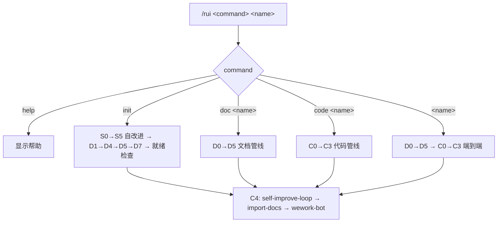
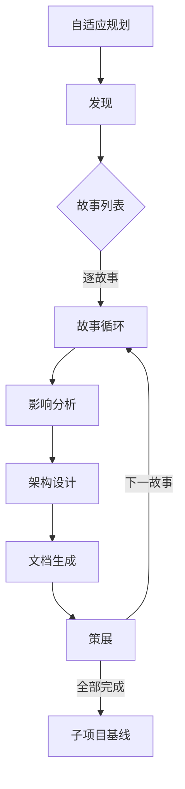
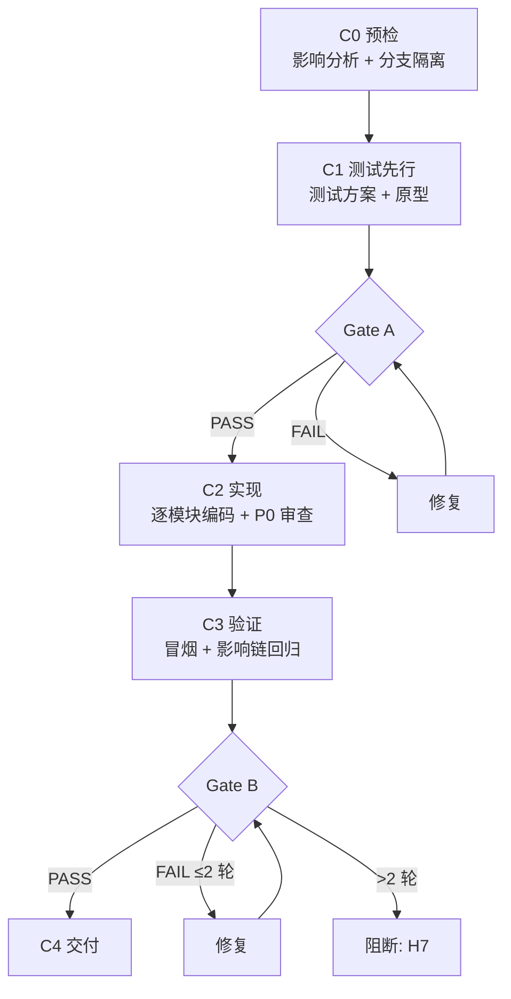

# rui

故事驱动 SDLC 编排器。每个需求提炼为故事，拆解为子项目任务调度执行。



---

## 命令

| 命令 | 流程 |
|------|------|
| `/rui init` | S0→S5 → D1→D4→D5→D7 → 就绪检查 → C4 |
| `/rui doc <name>` | D0→D5 → C4 |
| `/rui code <name>` | C0→C3 → C4（需已存在 `docs/storyboards/<name>.md`） |
| `/rui <name>` | D0→D5 → C0→C3 → C4 |

### 交互确认

- **需确认**: `init`、`/rui <name>`
- **直接执行**: `doc`、`code`

---

## 管线

### 文档管线 D0–D5

以故事为原子单位驱动，D1–D5 逐故事循环。



| 阶段 | 做什么 | 关键产出 |
|------|--------|---------|
| D0 自适应规划 | 读取执行记忆，判定 T1/T2/T3 变更级别 | 执行计划 |
| D1 发现 | 检索规范与已有文档，提炼故事列表 | 规范列表 + 故事列表 |
| D2 影响分析 | 逐故事全项目影响链分析，闭合所有依赖 | 闭合影响链 |
| D3 架构设计 | 逐故事模块划分、接口规范、数据流设计 | 架构设计 |
| D4 文档生成 | 逐故事 7 agent 协作编写 | 故事板文档 × N |
| D5 策展 | git commit + 执行记忆回写 + 后记（§6 §7） | 已保存文档 |
| D7 子项目基线 | 仅 init：生成 CLAUDE.md + README.md + design-system.md | 三文件 × N |

#### Agent 分工

| Agent | 负责章节 | 注入条件 |
|-------|---------|---------|
| pm | §1 Story + §4 Tasks | 始终 |
| docer | §2 Requirements | 始终 |
| coder | §3 Design + §4 实现任务 | 始终 |
| tester | §1.1 用户操作 + §5 AC | 始终 |
| reporter | §4 依赖映射 + 交付物细化 | 始终 |
| security | §3 安全约束 + §4 安全任务 | 涉及用户输入/外部API/认证/持久化 |

#### 增量裁剪

| 级别 | 触发条件 | D2 | D3 | D4 |
|------|---------|----|----|-----|
| T1 微观 | 措辞、格式修正 | 跳过 | 跳过 | 仅变更章节 |
| T2 局部 | 增删故事/接口变更 | 裁剪 | 裁剪 | 重写目标+下游 |
| T3 范围 | 范围边界变化、跨故事重构 | 完整重跑 | 完整重跑 | 全级联刷新 |

### 代码管线 C0–C3



| 阶段 | 做什么 | 规则 |
|------|--------|------|
| C0 预检 | 双边影响分析 + 分支隔离（从 main/master 拉取 `feat/<name>` / `docs/<name>`） | H10: 必须从主分支创建 |
| C1 测试先行 | Gate A：测试方案+原型，单行 CSS 可跳过 | H6: Gate A 未过不得编码 |
| C2 实现 | 逐模块编码，每模块后审查：P0 必须修 / P1 建议修 / P2 可选 | P0 未清零不进下一模块 |
| C3 验证 | Gate B：环境快照 → 静态预检 → 对齐 → 单次执行 | H7: >2 轮修复阻断 C4 |

### 自改进 S0–S5

静默运行，不阻断主流程。脚本位于 `skills/rui/scripts/`。

| rui 阶段 | 触发 | 操作 |
|---------|------|------|
| init | S0→S5 全量 | 健康评分 + 快照 + 趋势 + 提案 |
| D2 / C0 | S1 架构反思 | 六维推演，产出 s1_metrics |
| D5 / C3 | S2 工流诊断 | 趋势分析，产出 s2_metrics |
| C4 | self-improve-loop | evaluate + retro → `loop.js run --all` |

数据存储: `docs/.improvement/proposals.jsonl`（append-only）。

### C4 交付

| Step | 操作 | 失败处理 |
|------|------|---------|
| 1 | `self-improve.js evaluate` → `loop.js run --all` | 不阻断（H11 降级） |
| 2 | `import-docs.js --workspace` | H9: token 缺失时跳过 |
| 3 | wework-bot 通知 | 不可跳过 |

消息格式（纯文本，emoji 前缀，`———` 分隔）：

```
🎯 结论: 完成 user-login 文档管线 D0→D5
📝 描述: 为登录模块生成故事板，覆盖密码登录、短信验证码、OAuth 三种场景
📌 范围: auth/
👉 下一步: 运行 /rui code user-login 开始编码实现
🌐 影响: docs/storyboards/user-login.md
📎 证据: git log --oneline -1
⏱️ 会话: D0→D5 全流程 3.2min | 3 agents 参与

———
变更文件: docs/storyboards/user-login.md (新增, 285行)
```

完成或阻断后同时向用户输出下一步提示。字段要求见 wework-bot SKILL.md。

---

## 文档规范

```
<workspace-root>/
└── docs/
    ├── .improvement/proposals.jsonl
    ├── .memory/
    │   ├── execution-memory.jsonl
    │   └── rui-state.json
    ├── shared/
    │   ├── architecture.md
    │   └── contracts.md
    └── storyboards/
        └── <name>.md    ← 唯一真相源
```

### 故事板章节

| 章节 | 负责人 | 内容 |
|------|--------|------|
| §1 Story | pm | 角色场景、价值、范围边界、依赖 |
| §1.1 User Operations | tester | 用户操作 + UI交互流程 |
| §2 Requirements | docer | 功能点、输入输出、错误行为、业务规则 |
| §3 Design | coder + security | 技术设计 + 安全约束 |
| §4 Tasks | pm + all | 任务拆解、依赖、交付物 |
| §5 Acceptance Criteria | tester | 验收标准、测试方法、预期结果 |
| §6 .claude 改进清单 | pm | skill/agent/rule/script/config 改进（D4/D5 静态分析） |
| §7 系统架构演进任务 | pm | 近期/中期/远期演进（D3/D5 结构规划） |
| §L 自我改进循环 | self-improve-loop | 数据驱动改进清单 + 架构演进（每次 rui 完成追加） |

> §6 §7 由 pm 在文档生成阶段写入（结构性）。§L 由 self-improve-loop 在每次 rui 完成时自动追加（数据驱动）。两者互补。

≤10 故事/板，依赖用 `[story-name](./story-name.md)` 声明，超出拆分 `<name>-2.md`。

### init 就绪检查

| # | 检查项 | 验证 |
|---|-------|------|
| 1 | proposals.jsonl 存在 | `test -f` |
| 2 | docs/storyboards/ 目录存在 | `test -d` |
| 3 | 子项目 CLAUDE.md 存在且非空 | `wc -l` |
| 4 | 子项目 README.md 存在且非空 | `wc -l` |
| 5 | 前端子项目 design-system.md 存在且非空 | `wc -l` |
| 6 | proposals.jsonl 无已解决但仍 open 的提案 | grep |

---

## 核心规则

1. **增量更新**: 已有文档按 T1/T2/T3 裁剪
2. **测试先行**: Gate A 阻断 C2；Gate B >2 轮修复阻断 C4
3. **逐模块审查**: C2 每模块后审查，P0 清零前进
4. **双边影响**: C0 同时分析代码和文档影响
5. **分支隔离**: C0 从 main/master 拉取功能分支
6. **知识沉淀**: D5 写执行记忆 + rui-state.json
7. **C4 必触发**: self-improve-loop → import-docs → wework-bot

## 阻断

| # | 场景 | 降级 | 阶段 |
|---|------|------|------|
| H1 | 功能名称无法解析 | 否 | D0 |
| H2 | P0 章节缺少上游来源 | 否 | D4, C0 |
| H3 | 影响链无法闭合 | 否 | D2, C0 |
| H4 | 文档 P0 不通过且无法自修复 | 否 | D4 |
| H5 | 代码审查 P0 无法修复 | 否 | C2 |
| H6 | Gate A 未完成但已编码 | 否 | C1→C2 |
| H7 | Gate B >2 轮修复未通过 | 否 | C3→C4 |
| H8 | 所有模块被阻断 | 否 | C2 |
| H9 | `API_X_TOKEN` 缺失 | 是 | C4 |
| H10 | 功能分支未从 main/master 创建 | 否 | C0 |
| H11 | self-improve-loop 数据采集失败 | 是 | self-improve-loop |

阻断后: `rui-state.js save --blocked` → `next-step` → 持久化 → 同步（H9/H11 跳过）→ 通知。

---

## 集成点

- **自改进**: `node skills/rui/scripts/self-improve.js <cmd>`
- **自改进循环**: `node skills/rui/scripts/loop.js run --all`
- **执行记忆**: `node skills/rui/scripts/execution-memory.js`
- **断点**: `node skills/rui/scripts/rui-state.js <save|load|clear>`
- **文档同步**: `node skills/import-docs/scripts/import-docs.js --workspace`
- **通知**: `wework-bot`
- **Agent**: [`.claude/agents/AGENT.md`](../../agents/AGENT.md)
- **模板**: [`templates/故事任务模板.md`](templates/故事任务模板.md)
