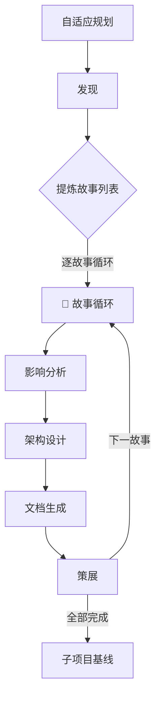

# rui

故事驱动 SDLC 编排器。每个用户需求先提炼为故事，再拆解为子项目任务调度执行。完成时必触发 `import-docs` → `wework-bot`，不可跳过。

## 快速开始

```
/rui init              # 首次使用：初始化项目
/rui doc <name>        # 写文档
/rui code <name>       # 写代码
/rui status            # 看项目状态
```

---

## 命令

| 命令 | 意图 | 流程 |
|------|------|------|
| `/rui init` | 初始化项目 | self-improve(S0→S5) → D1→D4→D5→D7→就绪检查→C4 |
| `/rui doc <name>` | 写文档 | D0→D1→D2→D3→D4→D5→C4 |
| `/rui code <name>` | 写代码 | C0→C1→C2→C3→C4 |
| `/rui <name>` | 端到端 | D0→D5→C0→C3→C4 |
| `/rui fix <name>` | 修 bug | C0(简化)→C1(简化)→C2→C3(简化)→C4 |
| `/rui check <name>` | 跑验证 | C3→C4 |
| `/rui update <name>` | 更新文档 | D4(增量)→D5→C4 |
| `/rui list` | 列故事板 | — |
| `/rui status` | 查状态 | — |
| `/rui board` | 看看板 | — |
| `/rui help` | 看帮助 | — |
| `/rui continue` | 断点续传 | 从上次断点恢复 |

**兼容别名**: `--document` = `doc`，`--code` = `code`，`--full` = 默认。

### 通用参数

| 参数 | 描述 | 示例 |
|------|------|------|
| `--from <source>` | 显式指定输入源（文件/URL/git ref） | `--from ./spec.md` |
| `--from <url>` | 从 URL 抓取 | `--from https://example.com/spec` |
| `--from <ref> --diff` | 从 git diff 读取 | `--from HEAD~1 --diff` |
| `--scope <level>` | 增量裁剪粒度 | `--scope minor`/`partial`/`full` |
| `--story <name>` | 故事级验证 | `--story user-login` |

**`--scope` 裁剪级别**:
- `minor` — T1: 仅措辞/格式修正
- `partial` — T2: 增删故事/接口变更（默认增量）
- `full` — T3: 范围边界变化，完整重跑
- 不指定时自动判定

**`--from` 源解析**: 无 `--from` 时自动从 `docs/storyboards/<name>.md` 读取。多源可叠加：`/rui doc auth --from ./spec.md --from https://api-docs.com`。

### init

初始化项目：自改进全量 → 发现 → 生成基线文档 → 子项目基线 → 就绪检查。

| 阶段 | 产出 | 验证 |
|------|------|------|
| S0→S5 self-improve | proposals.jsonl | proposals.jsonl 存在 |
| D1 发现 | 项目全景 + 故事清单 | board.md 闭合 |
| D4 生成 | 基线故事板 | storyboards/ 非空 |
| D5 策展 | git commit | git log 有 commit |
| D7 基线 | CLAUDE.md + README.md + design-system.md | 三文件存在 |
| 就绪检查 | 全部 ✅ | 9 项通过 |

已有文档时增量更新而非重建。

### doc

写文档：规划 → 发现 → 影响分析 → 架构 → 生成 → 策展。

等同于原 `--document`。故事板已有时自动增量更新（T1 裁剪）。

### code

写代码：预检 → 测试先行 → 实现 → 验证。

等同于原 `--code`。需有对应故事板（`docs/storyboards/<name>.md`），否则阻断。

### fix

快速修复专用，跳过整个文档管线，简化 Gate：

| 阶段 | 简化点 |
|------|--------|
| C0 预检 | 仅检查分支隔离 + 目标文件存在性 |
| C1 测试 | 仅对修改的函数/模块写测试 |
| C2 实现 | 正常编码 |
| C3 验证 | 仅验证修改点的冒烟测试 |

**适用**: bug fix、配置修改、typo、单文件补丁。不需要故事板。

**豁免**: 单文件修补可跳过分支隔离，直接在当前分支提交。

### check

只跑验证：基于故事板 §5 AC 执行 Gate B 验证。不写代码。

**适用**: 代码已写完想跑一遍验证；上次 C3 失败想重跑。

### update

增量更新文档：跳过 D0→D3，直接进入 D4 对指定故事做增量更新（T1/T2 级），然后 D5 策展。

**适用**: 文档局部修改、补充描述、更新任务状态。不需要重新分析影响和架构。

### continue

从上次断点恢复。读取 `docs/.memory/rui-state.json`，从 `current_stage` 继续执行。

若无断点状态，提示"无进行中的会话"。

### help

显示帮助信息。支持无参数概览和按子命令查阅详情。

**`/rui help`** — 概览模式，输出：

```
rui — 故事驱动 SDLC 编排器

用法: /rui <command> [name] [options]

命令:
  init              初始化项目（自改进 → 发现 → 基线 → 就绪检查）
  doc <name>        写文档（D0→D5）
  code <name>       写代码（C0→C3）
  <name>            端到端（D0→D5→C0→C3）
  fix <name>        快速修复（简化管线，无需故事板）
  check <name>      跑验证（仅 C3 Gate B）
  update <name>     增量更新文档（T1/T2 裁剪）
  list              列出可用故事板
  status            项目全局状态
  board             故事看板视图
  continue          从断点恢复
  help [command]    看帮助（本信息）

参数:
  --from <source>   输入源（文件/URL/git ref），可叠加
  --scope <level>   增量裁剪：minor / partial / full
  --story <name>    故事级验证

示例:
  /rui init                         # 首次初始化
  /rui doc user-login               # 写文档
  /rui code user-login              # 按故事板写代码
  /rui user-login                   # 端到端
  /rui fix login-timeout            # 快速修 bug
  /rui doc auth --from ./spec.md    # 从文件读取需求
  /rui help fix                     # 查看 fix 子命令详情
```

**`/rui help <command>`** — 详情模式，输出该命令的：阶段流程、适用场景、前置条件、参数、示例、阻断条件。章节固定：

```
/rui <command>

流程: <阶段链>
适用: <什么时候用>
前置: <必须满足什么>
参数: <该命令支持的参数>
阻断: <可能被阻断的条件>
示例: <1-2 个典型用法>
```

各子命令详情内容：

**help init**
- 流程: self-improve(S0→S5) → D1→D4→D5→D7→就绪检查→C4
- 适用: 新项目首次使用；已有文档时增量更新
- 前置: 无
- 参数: 无
- 阻断: H1(名称无法解析)
- 示例: `/rui init`

**help doc**
- 流程: D0→D1→D2→D3→D4→D5→C4
- 适用: 写新文档；故事板已有时增量更新（T1 裁剪）
- 前置: 无（无故事板时创建，有则增量）
- 参数: `--from`, `--scope`
- 阻断: H1, H2, H3, H4
- 示例: `/rui doc auth --from ./spec.md`

**help code**
- 流程: C0→C1→C2→C3→C4
- 适用: 按已有故事板编写代码
- 前置: `docs/storyboards/<name>.md` 存在
- 参数: `--story`
- 阻断: H2, H3, H5, H6, H7, H8, H10
- 示例: `/rui code user-login`

**help \<name\>**（端到端）
- 流程: D0→D5→C0→C3→C4
- 适用: 从零开始完成一个需求（文档+代码）
- 前置: 无（需交互确认）
- 参数: `--from`, `--scope`
- 阻断: D 段 + C 段全部
- 示例: `/rui user-login`

**help fix**
- 流程: C0(简化)→C1(简化)→C2→C3(简化)→C4
- 适用: bug fix、配置修改、typo、单文件补丁
- 前置: 无（不需要故事板）
- 参数: 无
- 阻断: H5, H7（简化 Gate）
- 阻断豁免: 单文件修补可跳过分支隔离
- 示例: `/rui fix login-timeout`

**help check**
- 流程: C3→C4
- 适用: 代码已写完跑验证；上次 C3 失败重跑
- 前置: 故事板存在（§5 AC）
- 参数: `--story`
- 阻断: H7
- 示例: `/rui check user-login`

**help update**
- 流程: D4(增量)→D5→C4
- 适用: 文档局部修改、补充描述、更新任务状态
- 前置: 故事板已存在
- 参数: `--scope`（默认 partial）
- 阻断: H4
- 示例: `/rui update auth --scope minor`

**help list**
- 流程: 无
- 适用: 查看 `docs/storyboards/` 下可用故事板
- 前置: 无
- 参数: 无
- 阻断: 无

**help status**
- 流程: 无
- 适用: 查看项目全局状态（健康、断点、看板、提案、git）
- 前置: 无
- 参数: 无
- 阻断: 无

**help board**
- 流程: 无
- 适用: 查看故事看板（进行中/待开始/已完成）
- 前置: `docs/.pm/board.md` 存在
- 参数: 无
- 阻断: 无

**help continue**
- 流程: 从 `current_stage` 继续
- 适用: 上次会话被中断或阻断后恢复
- 前置: `docs/.memory/rui-state.json` 存在
- 参数: 无
- 阻断: 无断点状态时提示"无进行中的会话"

**help help**
- 流程: 无
- 适用: 查看帮助
- 前置: 无
- 参数: `[command]` — 可选，指定子命令查看详情
- 阻断: 无

### status

项目全局状态视图。采集以下信息并格式化输出：

1. `self-improve health` — 健康评分
2. `docs/.memory/rui-state.json` — 是否有断点
3. `docs/.pm/board.md` — 故事状态
4. `docs/.improvement/proposals.jsonl` — open 提案
5. `docs/storyboards/` — 可用故事板
6. `git status` — 工作区状态

### board

故事看板视图。读取 `docs/.pm/board.md` 并按 进行中/待开始/已完成 分组显示。

### list

列出 `docs/storyboards/` 下可用故事板文档。

### 交互确认

大型操作启动前输出概要并确认：

- **需确认**: `init`、`/rui <name>`（全流程，无 `--from`）
- **直接执行**: `doc`、`code`、`fix`、`check`、`update`、`continue`
- 确认格式：
  ```
  即将执行: <操作概要>
  目标: <name>
  预计影响: <描述>
  确认？
  ```

---

## 管线参考

### 文档管线 (D0–D5)

**核心机制: 以故事为原子单位驱动。** D1–D5 对每个故事循环执行，7 agent 按故事内容注入专业视角。



| 阶段 | 做什么 | 关键产出 |
|------|--------|---------|
| D0 自适应规划 | 读取执行记忆，确定变更级别 T1/T2/T3 | 执行计划 |
| D1 发现 | 检索规范与已有文档；涉及技术选型时并行搜索；扫描 UI 设计资产；提炼故事列表 | 规范列表 + 证据矩阵 + 设计资产清单 + 故事列表 |
| D2 影响分析 | 逐故事全项目影响链分析，闭合所有依赖 | 每故事闭合影响链 |
| D3 架构设计 | 逐故事模块划分、接口规范、数据流设计 | 每故事架构设计 |
| D4 文档生成 | 逐故事 7 agent 协作编写（见下方详表） | 故事板文档 × N |
| D5 策展 | 逐故事 `git commit` + 执行记忆回写 | 已保存文档 |
| D7 子项目基线 | 仅 init：生成 CLAUDE.md + README.md + design-system.md | 三文件 × N |

#### D4 Agent 协作

| Agent | 负责章节 | 注入条件 |
|-------|---------|---------|
| **pm** | §1 Story + §4 Tasks | 始终 |
| **docer** | §2 Requirements + §3 概要 | 始终 |
| **coder** | §3 Design + §4 实现任务 | 始终 |
| **designer** | §1.1 UI交互流 + §3 UI设计规范 | 故事涉及 UI 改造 |
| **tester** | §1.1 用户操作 + §5 AC | 始终 |
| **security** | §3 安全约束 + §4 安全任务 | 故事涉及用户输入/外部API/认证/数据持久化 |
| **reporter** | §4 依赖映射 + 交付物细化 | 始终 |

**协作流程**: pm §1 骨架 → docer/coder/designer/tester/security 并行注入 → pm 汇总 §4 → reporter 补充 → tester 三层审查。

#### 增量更新裁剪

| 级别 | 触发条件 | D2 | D3 | D4 |
|------|---------|----|----|-----|
| T1 微观 | 措辞、格式修正 | 跳过 | 跳过 | 仅变更章节 |
| T2 局部 | 增删故事/FP、接口变更 | 裁剪 | 裁剪 | 重写目标章节+下游 |
| T3 范围 | 范围边界变化、跨故事重构 | 完整重跑 | 完整重跑 | 全级联刷新 |

#### D7 子项目基线（仅 init）

为每个子项目生成/更新：
- **CLAUDE.md** — AI 协作指令（定位、约束、架构、编码规范、关键文件、构建、API、上游依赖、Auth、环境切换、跨项目共享）
- **README.md** — 人类入口（简介、技术栈、快速开始、项目结构、开发指南、API）
- **design-system.md** — UI 设计系统基线（仅前端项目：设计语言、Token、组件、页面模板、交互、a11y、响应式、图标）

### 代码管线 (C0–C3)

| 阶段 | 做什么 | 关键产出 |
|------|--------|---------|
| C0 预检 | 双边影响分析 + 分支隔离检查 | 锚定报告 + 功能分支 |
| C1 测试先行 | Gate A：测试方案+原型 | 测试方案 + 原型 |
| C2 实现 | 逐模块编码，每模块后 P0 审查 | 实现代码 + 审查记录 |
| C3 验证 | Gate B：冒烟测试 + 影响链回归 | 冒烟证据 + AC 更新 |

**分支隔离**: C0 创建功能分支（`feat/<name>`/`fix/<name>`/`docs/<name>`），C2 全部在分支上，C4 合并回主干。单文件修补可豁免。

**C1/C3 验证**: 4 阶段（环境快照 → 静态预检 → 环境对齐 → 单次执行），失败不给重试，产出修复清单。

**C2 代码审查**: P0 必须修复 / P1 建议修复 / P2 可选优化。P0 未清零不进入下一模块。

### 自改进集成

rui 通过 [`self-improve`](../self-improve/SKILL.md) skill 在关键阶段嵌入反思钩子：

| 钩子位置 | 触发阶段 | 调用 |
|---------|---------|------|
| D2 影响分析后 | S1 架构反思 | `/self-improve reflect` |
| C0 预检时 | S1 架构反思 | `/self-improve reflect` |
| D5 策展时 | S2 工流诊断 | `/self-improve diagnose` |
| C3 验证时 | S2 工流诊断 | `/self-improve diagnose` |
| C4 交付时 | S3+S4 提案写入 + S5 效果回顾 | `/self-improve propose` + `/self-improve evaluate` |
| init | S0→S5 全量 | `/self-improve` |

**原则**: 反思不阻断主流程；每次最多 3 个发现；钩子必须回顾旧提案状态。

### C4 交付（必触发）

所有 rui 命令完成时**必须**执行，顺序固定：

```
1. import-docs  —  同步 docs/ 到远程文档 API
2. wework-bot   —  发送完成/阻塞/失败通知
```

| Step | Skill | 失败处理 |
|------|-------|---------|
| 1 | `import-docs` | H9: `API_X_TOKEN` 缺失时跳过，仍执行 step 2 |
| 2 | `wework-bot` | 不可跳过 |

---

## 文档规范

### 目录树

```
<workspace-root>/
└── docs/
    ├── .pm/
    │   ├── board.md              # PM 故事看板（唯一真相源）
    │   └── board-history.jsonl   # 故事状态变更日志
    ├── .improvement/
    │   └── proposals.jsonl       # 改进提案（append-only）
    ├── .memory/
    │   ├── execution-memory.jsonl # 执行记忆
    │   └── rui-state.json         # 断点续传状态
    ├── shared/
    │   ├── architecture.md       # 跨项目架构概览
    │   └── contracts.md          # 跨项目契约
    └── storyboards/
        └── <name>.md             # 故事板文档
```

### 故事板章节结构

| 章节 | 负责人 | 内容 |
|------|--------|------|
| §1 Story | pm | 角色场景、价值、范围边界、依赖 |
| §1.1 User Operations | tester + designer | 用户操作流程 + UI交互流程（UI 故事） |
| §2 Requirements | docer | 功能点、输入输出、错误行为、业务规则 |
| §3 Design | coder + designer + security | 技术设计 + UI设计规范 + 安全约束 |
| §4 Tasks | pm + coder + designer + security + reporter | 任务拆解、依赖、交付物 |
| §5 Acceptance Criteria | tester | 验收标准、测试方法、预期结果 |

**规则**: 每个故事板最多 10 个故事。故事间依赖用 `Depends: [story-name](./story-name.md)` 声明。超出时分拆为 `<name>-2.md`。

### init 就绪检查（P0 门禁）

| # | 检查项 | 验证方式 | 失败处置 |
|---|-------|---------|---------|
| 1 | board.md 存在 | `test -f` | 创建 |
| 2 | proposals.jsonl 存在 | `test -f` | 创建 |
| 3 | 子项目 storyboards/ 目录存在 | `test -d` | 创建 |
| 4 | 子项目 CLAUDE.md 存在且非空 | `wc -l` | 重新生成 |
| 5 | 子项目 README.md 存在且非空 | `wc -l` | 重新生成 |
| 6 | 前端子项目 design-system.md 存在且非空 | `wc -l` | 重新生成 |
| 7 | board.md 故事列表闭合 | Grep 验证 | 补齐 |
| 8 | proposals.jsonl 无已解决但仍 open 的提案 | grep | 标记 done/superseded |
| 9 | UI 故事有 designer 注入内容 | Grep | 补充 |

---

## 故事驱动规则

故事是跨子项目任务调度的原子单位：

1. **用户可感知**: 描述用户场景而非技术实现
2. **AC 可验证**: 每个故事至少一条验收标准
3. **跨项目可拆解**: 一个故事可拆为多个子项目任务

**故事 → 任务**: pm 从 AC 拆解 → 按子项目分配 → 标注依赖和 agent → 写入 `board.md`。

---

## 核心规则

1. **增量更新**: 已有文档按 T1/T2/T3 裁剪。修 typo 不触发全流程。
2. **测试先行**: Gate A 阻断 C2；Gate B >2 轮修复阻断 C4。单行 CSS 不需要 Gate A。**fix 模式简化 Gate。**
3. **逐模块审查**: C2 每模块后审查，P0 清零前进下一模块。
4. **双边影响分析**: C0 同时分析代码和文档影响；C3 基于实际 diff 回归验证。
5. **分支隔离**: C0 创建功能分支，C2 全部在分支上，C4 合并回主干。**fix 单文件修补可豁免。**
6. **知识沉淀**: D5 写执行记忆；每个阶段转换写 `rui-state.json`。
7. **C4 必触发**: 任何命令完成时必须执行 `import-docs` → `wework-bot`。阻断时同样触发。
8. **自改进驱动**: rui 通过 [`self-improve`](../self-improve/SKILL.md) 嵌入反思钩子。D2/C0→S1，D5/C3→S2，C4→S3+S4+S5。init 先执行 self-improve 全量。
9. **故事看板持久化**: 每次 rui 操作完成后，pm 必须将故事和任务状态写入 `board.md`。已有故事追加更新，不覆盖。
10. **故事驱动任务管理**: 所有任务由 pm 从故事 AC 拆解。故事全部 AC 通过才标记完成。
11. **断点续传**: 每个阶段转换时调用 `rui-state.js save` 记录进度。阻断时记录原因。C4 完成时 `rui-state.js clear`。`/rui continue` 从断点恢复。
12. **交互确认**: `init` 和全流程（无 `--from`）启动前确认。轻量操作直接执行。

## 阻断条件

| # | 场景 | 可降级 | 阶段 |
|---|------|--------|------|
| H1 | 功能名称无法解析 | 否 | D0 |
| H2 | P0 章节缺少上游来源 | 否 | D4, C0 |
| H3 | 影响链无法闭合 | 否 | D2, C0 |
| H4 | 文档 P0 不通过且无法自修复 | 否 | D4 |
| H5 | 代码审查 P0 无法修复 | 否 | C2 |
| H6 | Gate A 未完成但已编写代码 | 否 | C1→C2 |
| H7 | Gate B 未通过（>2 轮修复） | 否 | C3→C4 |
| H8 | 所有模块被阻断 | 否 | C2 |
| H9 | `API_X_TOKEN` 缺失 | 是 | C4 |
| H10 | 在 main/master 且需编码，未创建功能分支 | 否 | C0 |

阻断后: `rui-state.js save --blocked` → 持久化 → 同步（H9 跳过）→ 通知 → 回退。

## 集成点

- **文档同步**: [`import-docs`](../import-docs/SKILL.md)
- **通知**: [`wework-bot`](../wework-bot/SKILL.md)
- **自改进**: [`self-improve`](../self-improve/SKILL.md) — `node .claude/skills/self-improve/scripts/self-improve.js <command>`
- **执行记忆**: `node .claude/skills/self-improve/scripts/execution-memory.js`
- **断点状态**: `node .claude/skills/rui/scripts/rui-state.js <save|load|clear>`
- **Agent 定义**: [`.claude/agents/AGENT.md`](../../agents/AGENT.md)
- **文档模板**: [`templates/feature-document.md`](templates/feature-document.md)