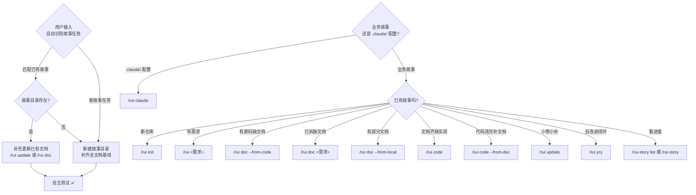
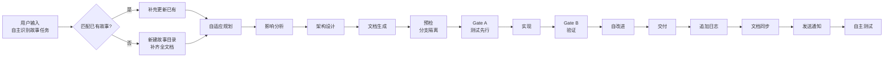
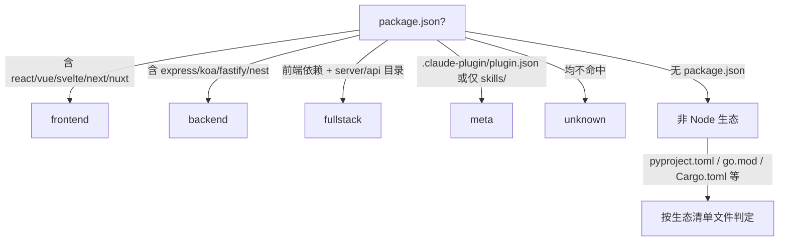
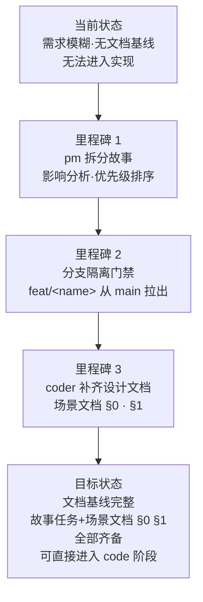
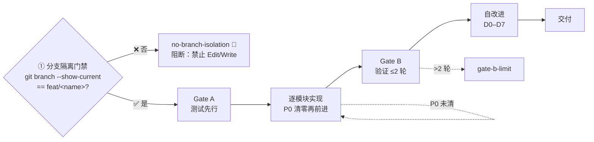
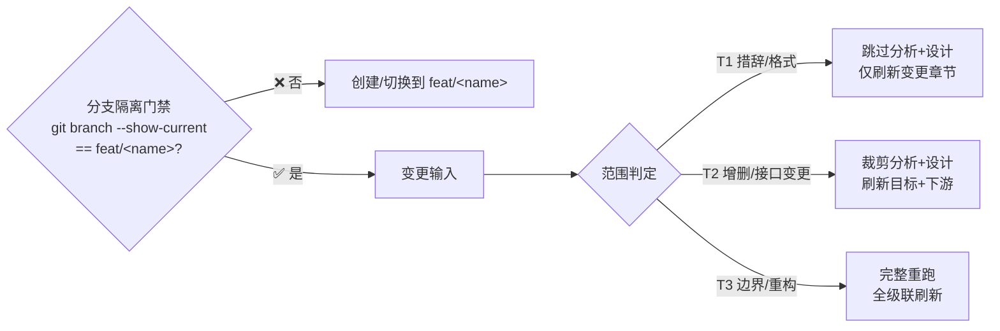
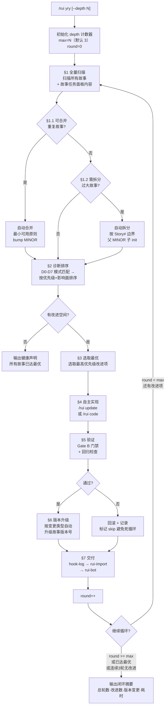
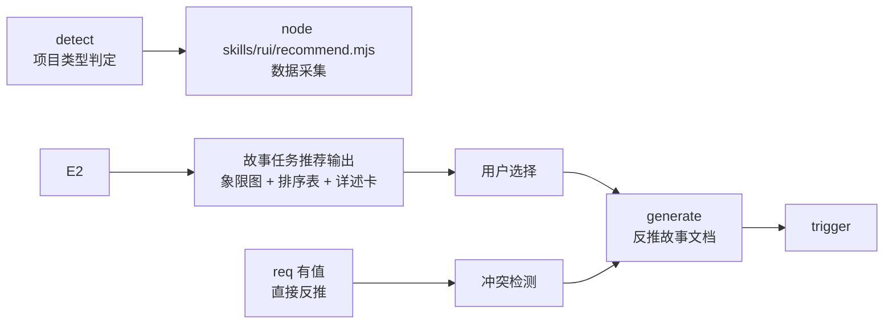
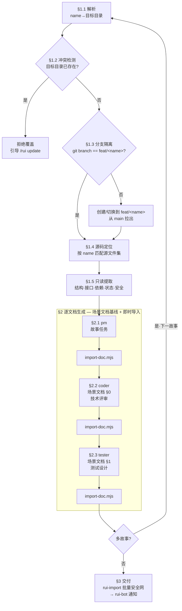

# rui

> 故事驱动 SDLC 编排器：自主识别故事 → 新建/补充 → 文档基线 → 测试先行 → 实现 → 验证 → 复盘 → 自主测试 → 交付。
>
> **--help / -h**：执行 `node skills/rui/help.mjs` 输出完整帮助（含命令族全景 + 管线一览）。用户输入 `/rui --help` 或 `/rui -h` 或 `/rui help` 时，跳过管线逻辑，直接运行脚本。
>
> 哲学源自 [CLAUDE.md](../../CLAUDE.md)。本文件定义命令面与编排骨架，细节分散在：[rules/](../../rules/) · [agents/](../../agents/) · [coder.md](./coder.md)。

[选哪条命令](#选哪条命令) · [管线一览](#管线一览) · [阻断标识](#阻断标识) · [核心约束](#核心约束) · [故事文档](#故事文档) · [init](#init) · [doc](#doc) · [code](#code) · [端到端](#端到端) · [update](#update) · [yry](#yry) · [version --up](#version---up) · [code --from-doc](#code---from-doc) · [doc --from-code](#doc---from-code)

## 选哪条命令

> **每次用户输入交互，rui 自主识别对应的故事任务**：已有故事 → 补充更新其文档内容；新需求 → 新建故事目录并补齐全文档。所有写入操作末端必须执行自主测试。



`需求` 支持文本 / `@` 引用本地文件 / URL。`--name` 用 kebab-case 的 `<name>` 格式（如 `user-login`）。

### 写入命令（末端自动交付三步）

- `/rui init` — 建立项目基线：detect → explore → generate → setup → verify → trigger
- `/rui <需求>` — 端到端：doc + code 自动串联，逐故事串行
- `/rui doc <需求>` — 拆需求为故事 + 生成文档基线（故事任务/使用场景/技术评审/测试设计），禁止改源码
- `/rui code <name>` — 实现故事：Gate A → 逐模块 → Gate B → 自改进 → 交付
- `/rui update <name> [ctx] [--no-code]` — 增量更新：T1/T2/T3 自动裁剪
- `/rui code --from-doc <name>` — 从文档反推：只读源码补全缺失文档（实施报告/测试报告/自改进复盘），不覆盖已有
- `/rui doc --from-code 需求` — 从源码反推：req 空时 pm 扫描推荐列表；req 有值时直接反推生成完整文档基线
- `/rui doc --from-local <name>` — 从已有本地文档补全缺失文档基线（只读已有，生成缺失，不覆盖）
- `/rui yry [--depth N]` — 自改进闭环：全自主扫描→诊断→实现→验证→版本升级，循环至无改进空间或达到深度上限（默认 3）
- `/rui version --up` — 版本升级：自主判定下一版本号 → 更新文件 → git commit → 合并到 main → 推送远端 + tag

### 只读命令（不触发 hook）

- `/rui` — 任务推荐：5 层链式管线评分排序

> 进度查询已迁移至 `/rui-story list` 和 `/rui-story`，详见 [rui-story SKILL.md](../rui-story/SKILL.md)。

## 管线一览



- 影响分析 / 证据等级 → [agents/AGENT.md](../../agents/AGENT.md)
- 分支隔离 / Gate A/B / P0 审查 → [rules/code-pipeline.md](../../rules/code-pipeline.md)
- 交付三步 / 文档同步 → [rules/delivery-gate.md](../../rules/delivery-gate.md)
- 诊断 D0–D7 / 评估 E1–E4 → [rules/self-improve.md](../../rules/self-improve.md)
- 文档生成约束 → [rules/doc-generation.md](../../rules/doc-generation.md)
- Agent 交接 → [agents/](../../agents/) 各角色

## 阻断标识

阻断后记录状态（`blocked=true` + `block_reason=<标识>`），重跑同命令从 `current_stage` 续。

**需求→文档阶段**
- `no-parse` — 需求无法解析
- `no-source` — P0 章节缺上游来源
- `chain-broken` — 影响链未闭合
- `doc-p0` — 文档 P0 不通过且无法自修复

**需求→文档阶段**
- `no-doc-isolation` — doc/update 阶段在非 `feat/<name>` 分支写入故事文档
- `bad-branch` — 分支未从 main 创建或混入非本故事代码
- `no-checkout` — 未切换故事分支即写入/改码

**预检→实现阶段**
- `no-branch-isolation` — `node skills/rui/branch-check.mjs` 验证失败（非 `feat/<name>` 时执行 Edit/Write）
- `skip-gate-a` — Gate A 未通过即编码

**实现→验证阶段**
- `code-p0` — 代码 P0 无法修复
- `gate-b-limit` — Gate B >2 轮

**交付阶段**
- `auto-merge` — 功能分支被自动合并到 main
- `no-token`（降级）— `API_X_TOKEN` 缺失
- `no-metrics`（降级）— self-improve 数据采集失败

## 核心约束

1. **逐故事串行** — 多故事按拆分顺序处理，互不交叉
2. **分支隔离（强制）** — 任何 Edit/Write 前必须验证当前分支为 `feat/<name>`：doc 写文档、code 改源码、update 增删文件，均需分支隔离。禁止在 main 上写文档或改码、禁止派生、禁止自动合并。唯一例外：`/rui init`（写 CLAUDE.md/README.md 等项目级基线，不走故事分支）
3. **源码唯一入口** — 只能走 `/rui code` 改源码
4. **测试先行** — Gate A 阻断实现；Gate B >2 轮阻断交付
5. **逐模块 P0 清零** — 每模块审查后 P0 清零再前进
6. **只读反推** — `--from-code` / `--from-doc` 禁止改源码
7. **产出内聚** — 关键产出限定在 `docs/故事任务面板/<name>/`
8. **场景导向** — 文档由 [rules/doc-generation.md](../../rules/doc-generation.md) 约束：故事任务为基线（场景功能点表），场景-N-<slug>.md §0–§4 为全阶段统一文档
10. **交付强制** — 三步按序触发（hook-log → rui-import → rui-bot → self-test），详见 [强制集成](#强制集成)
11. **自主测试** — 每次故事任务变更后自动执行自检：基线完整性 · 文档一致性 · 分支隔离 · 安全合规；缺 self-test 故事目录时跳过不阻断
12. **表达优先** — 文档内容必须 图 → 结构化文本 → 表，架构/流程/关系优先 mermaid，不可降级。铁律四：验先于称、溯先于修、清先于进、表达优先

## 故事文档

> 基线 + N 场景文档模型。故事任务为基线（场景功能点表 · 知识图谱 hub），场景-N-<slug>.md §0–§4 为全阶段统一文档。公式见 [rules/doc-generation.md](../../rules/doc-generation.md)。

| 文件 | 阶段 | 基线 | 必选 |
|------|------|:---:|:---:|
| 故事任务.md | 文档生成 | 基线 | ✓ |
| 场景-N-<slug>.md | 全阶段 | — | ✓ |
| knowledge-graph.json | 实现 | — | ✓ |

## init

> 六步：探 → 察 → 生 → 架 → 搭 → 验 → 触。可重复运行，每次全量重生。CLAUDE.md 的 `<!-- rui:project-start -->` / `<!-- rui:project-end -->` 标记段每次覆盖，段外保留。


### 1. detect — 探测信号

抽取 profile 为后续阶段提供事实基线：

- **项目身份** — 仓库目录名 → 分支前缀；故事目录名纯语义 kebab-case，文档名不加项目前缀
- **项目类型** — 关键目录与配置文件 → frontend / backend / fullstack / meta / unknown（判定见下图）
- **项目清单** — 按生态文件抽取依赖 + 构建/测试命令 + 框架版本
- **安全面** — 源码关键词扫描：用户输入 / API / 存储 / 认证 / 第三方
- **测试框架** — 依赖 + 配置文件 → vitest / jest / pytest / go-test / cargo-test
- **架构模式** — 项目结构 → single / monorepo / microservice / plugin



### 2. explore — 深度探索

阅读核心源码，理解架构模式、代码规范、安全面。验证并补充 profile 判断。**抽取模块地图**：识别项目内所有模块（skills/agents/rules 等），记录每个模块的入口文件、核心依赖、下游消费者，为后续架构故事生成提供事实基线。

### 3. generate — 生成内容

基于 profile + 探索发现直接编写文件：

- `CLAUDE.md` — 基础信念 + 铁律 + 退化对策 + 项目约束（含 `rui:project-start/end` 标记）+ 自约束
- `README.md` — 系统视图 + 命令流 + 快速开始 + 项目结构 + [领域语言段](../../README.md#领域语言)（术语定义 + 关系 + 示例对话 + 歧义标记）

### 4. arch — 补齐技术架构故事 + 自动化测试方案

> 自主生成两个故事目录：
> - `docs/故事任务面板/<project>-arch/` — 系统架构知识固化
> - `docs/故事任务面板/<project>-self-test/` — 项目自动化测试套件
>
> 基于 explore 阶段抽取的模块地图、项目拓扑事实和基线文档（CLAUDE.md / README.md）自主构建。

**4a. 技术架构故事** (`<project>-arch`)，按场景文档模型生成（委托 pm → coder → tester 逐文档生成，同 doc 管线约束）：

| # | 文档 | Agent | 内容 |
|---|------|-------|------|
| 1 | 故事任务.md | pm | 系统架构知识固化 + 模块地图 + ≥4 个架构参考场景（模块定位/数据流追踪/新人上手/依赖变更影响），含 FP/AC/SC/风险 |
| 2 | 场景-1-<slug>.md §0 | coder | 模块地图（入口文件+依赖+下游消费者）· 4 层拓扑模型 · 数据流图（命令/doc/交付/自改进）· 信任边界 · ADR · 依赖矩阵 |
| 3 | 场景-1-<slug>.md §1 | tester | 架构验证用例（模块存在性/依赖完整性/信任边界/文档覆盖），四类全覆盖 |

**4b. 自动化测试套件** (`<project>-self-test`)，对项目源码搭建可执行的自动化测试体系，走完整 doc + code 管线：

> init 阶段生成场景文档基线（故事任务/场景-1-<slug>.md §0 §1），随后自动进入 code 管线实现测试代码。产物包含可运行的测试文件，不只是文档。

| # | 文档 | Agent | 内容 |
|---|------|-------|------|
| 1 | 故事任务.md | pm | 项目自动化测试两大 Story + ≥4 个测试场景（核心业务逻辑/API 接口/数据持久化/异常路径），含 FP/AC/SC/风险 |
| 2 | 场景-1-<slug>.md §0 | coder | 测试架构：测试框架选型（按项目生态匹配）· 目录结构 · Mock 策略 · CI 集成点 · 覆盖率阈值 |
| 3 | 场景-1-<slug>.md §1 | tester | 可执行测试用例（含代码骨架）：按模块拆分，每模块 ≥3 条用例，标注覆盖率目标 |

**实现阶段**（code 管线）：
- 按技术评审选型安装测试依赖
- 逐模块编写测试文件，每模块完成即跑测试验证
- 最终输出：可运行的测试套件 + 覆盖率报告 + 实施报告 + 测试报告

**故事命名**：`<project>-arch`、`<project>-self-test`（如项目名 `YrY` → `yry-arch`、`yry-self-test`）。

### 5. setup — 机械搭建

- 创建 `docs/故事任务面板/`（如已由 arch 步骤创建则跳过）
- 生成 `.claude/skills/rui-bot/config.json`（schema 见 [rui-bot SKILL.md](../rui-bot/SKILL.md#内置配置)）
- 写入 `docs/故事任务面板/.init-memory.json`

### 6. verify — 7 项就绪检查

任一失败即终止：

- CLAUDE.md 含 `rui:project-start` 标记 + 项目名
- README.md 含项目名
- README.md 含 `## 领域语言` 标题 + ≥3 个术语定义
- `docs/故事任务面板/` 目录存在
- `docs/故事任务面板/<project>-arch/` 目录存在，含场景文档基线
- `docs/故事任务面板/<project>-self-test/` 目录存在，含场景文档基线（故事任务/场景-1-<slug>.md §0 §1）+ 可执行测试文件
- `.claude/skills/rui-bot/config.json` 存在

### 7. trigger

验证通过后触发 rui-import（workspace 全量）+ rui-bot 通知。缺 token 跳过，网络失败告警不阻断。

### 产物

- `CLAUDE.md` — `rui:project-*` 标记内全量重生，段外保留
- `README.md` — 全量重生，领域语言段重复运行时增量补充
- `docs/故事任务面板/<project>-arch/` — 项目技术架构故事（场景文档基线），每次全量重生
- `docs/故事任务面板/<project>-self-test/` — 项目自动化测试套件（场景文档基线 + 可执行测试文件），每次全量重生
- `.claude/skills/rui-bot/config.json` — 每次覆盖
- `docs/故事任务面板/.init-memory.json` — 每次覆盖

## doc

> 需求到文档基线的完整管线。pm 拆需求为故事 → coder 补齐设计文档。全程只读源码，多故事串行。pm 应用烧烤纪律：挑战模糊术语、走完决策树、用领域语言命名、不确定 > 2 项不推进。
>
> **写故事文档也走分支隔离。** doc 阶段写入 `docs/故事任务面板/<name>/` 下的文档，这些写入操作必须在 `feat/<name>` 分支上执行，与 code 阶段同门禁。

### 效果示意



### §1 Story

#### Story 1: 需求拆分为故事任务

| 字段 | 内容 |
|------|------|
| 作为 | 需求提出者 |
| 我想要 | 将自然语言需求拆分为结构化的故事任务文档 |
| 以便 | 每个故事有独立的文档目录、清晰的优先级和明确的验收标准 |
| 优先级 | P0 |
| 范围边界 | 只读源码，不修改任何文件 |
| 依赖 | 源码可访问，pm agent 可用 |

##### 范围外

- 不涉及源码修改或 git 分支操作（分支操作由后续步骤处理）
- 不生成技术设计文档（由 coder 在 Story 2 补齐）

##### §1.1 User Operations

| # | 操作 | 触发条件 | 操作步骤 | 预期结果 |
|---|------|---------|---------|---------|
| 1 | 从需求生成故事 | 用户执行 `/rui doc <需求>` | pm 解析需求 → 拆分为故事 → 影响分析 → 优先级排序 → 逐故事写入故事任务 | 每个故事目录下生成 故事任务.md |
| 2 | 引用本地文件 | 用户执行 `/rui doc @file` | pm 读取文件内容 → 解析为需求 → 拆分故事 | 同上，需求来源含文件路径引用 |
| 3 | 引用外部 URL | 用户执行 `/rui doc <URL>` | pm 抓取 URL 内容 → 解析为需求 → 拆分故事 | 同上，需求来源含 URL 引用 |

---

#### Story 2: 补齐设计文档

| 字段 | 内容 |
|------|------|
| 作为 | coder |
| 我想要 | 基于故事任务生成完整的技术设计文档基线 |
| 以便 | 实现阶段有完整的技术方案依循，安全面有独立审计 |
| 优先级 | P0 |
| 范围边界 | 只读源码 + 故事任务文档，写入场景-N-<slug>.md（§0 §1） |
| 依赖 | Story 1 完成，故事任务文档存在 |

##### 范围外

- 不涉及源码修改
- 不覆盖实施报告/测试报告/自改进复盘（由 code 阶段产出）

##### §1.1 User Operations

| # | 操作 | 触发条件 | 操作步骤 | 预期结果 |
|---|------|---------|---------|---------|
| 1 | 补齐场景文档 | pm 完成故事任务后自动触发 | coder/tester 读取故事任务 → 按 doc-generation.md 约束生成 | 生成 场景-N-<slug>.md（§0 技术评审 + §1 测试设计） |

---

#### Story 3: 分支隔离门禁

| 字段 | 内容 |
|------|------|
| 作为 | 管线 |
| 我想要 | 确保文档写入操作在隔离分支上进行 |
| 以便 | 防止未经验证的文档变更污染 main 分支 |
| 优先级 | P0 |
| 范围边界 | 仅检查分支状态，不自动创建或切换分支 |
| 依赖 | git 仓库可操作 |

##### §1.1 User Operations

| # | 操作 | 触发条件 | 操作步骤 | 预期结果 |
|---|------|---------|---------|---------|
| 1 | 分支检查通过 | `git branch --show-current` 为 `feat/<name>` | 直接继续文档写入 | 门禁通过 |
| 2 | 分支不匹配 | 当前分支非 `feat/<name>` | 提示用户创建或切换到 `feat/<name>`（从 main 拉出）→ 重新检查 | 门禁通过后继续 |

---

### §2 Requirements

#### 功能点

| FP# | 描述 | 输入 | 输出 | 错误行为 | 优先级 |
|-----|------|------|------|---------|--------|
| FP1 | 需求解析 — 将自然语言/文件/URL 需求拆分为故事列表 | 需求文本或引用 | 故事列表（含优先级、依赖、范围边界） | 需求无法解析时阻断 `no-parse` | P0 |
| FP2 | 影响分析 — 分析每个故事对现有系统的影响链 | 源码 + 故事需求 | 影响点列表 + 影响级别 | 影响链未闭合时阻断 `chain-broken` | P0 |
| FP3 | 故事任务生成 — 按 doc-generation.md 约束生成 | 解析结果 + 影响分析 | 故事任务.md | 占位符未替换或 P0 检查项缺失时阻断 | P0 |
| FP4 | 场景文档 §0 §1 生成 — 按 doc-generation.md 约束填充场景-N-<slug>.md 的 §0 技术评审 + §1 测试设计 | 故事任务+源码 | 场景-N-<slug>.md（§0 + §1） | P0 检查项未通过时阻断 | P0 |
| FP5 | 分支隔离验证 — 写入前检查 `feat/<name>` 分支 | 故事名称 | 通过/阻断 | 非 `feat/<name>` 分支上写入时阻断 `no-doc-isolation` | P0 |
| FP6 | 多故事串行 — 按拆分顺序逐故事处理 | 故事列表 | 每故事完整文档基线 | 前一故事未完成时不得进入下一故事 | P0 |
| FP7 | 项目类型裁剪 — 场景文档 §0 按项目类型跳过不适用章节 | 项目类型 | 裁剪后的场景文档（纯前端跳过 API/数据/后端性能章节，纯后端跳过组件/状态/交互/样式章节） | 类型判定失败时默认全量生成 | P1 |

#### 业务规则

| R# | 描述 | 校验方式 | 证据级别 |
|----|------|---------|---------|
| R1 | pm 拆分前必须建立事实基线（Read/Grep/Glob 研究源码） | 检查 agents/pm.md 执行步骤 | B |
| R2 | 故事任务文档禁止包含技术术语（代码路径/API 路由/组件名/技术栈名） | 扫描 `/api/`、`/src/`、`<.*>` 等模式 | B |
| R3 | 所有文档必须含 `### 主要价值` 节，≥ 4 条 emoji 前缀行 | grep 计数 | B |
| R4 | 每文档必须含回溯链（来源引用 + 变更记录） | grep 表头与链接格式 | B |
| R5 | 多故事时按优先级顺序串行处理，前一故事 doc 完成后再进下一故事 | 逐故事检查产出完整性 | B |
| R6 | 分支必须从 main 拉出，禁止在已有功能分支上创建新故事分支 | `git log main..HEAD` 检查提交历史 | B |
| R7 | 测试设计由 tester agent 独立执行 | 检查 agents/tester.md 执行记录 | B |
| R8 | 任何 rui 写操作前必须通过 branch-check.mjs 验证 | `node skills/rui/branch-check.mjs --story=<name> --mode=write`，exit code ≠ 0 阻断 | A |

#### 数据约束

| 约束 | 类型 | 范围/格式 | 来源 |
|------|------|----------|------|
| 故事名称 | string | `^[a-z0-9]+(-[a-z0-9]+)*$` (kebab-case) | 命名规范约定 |
| 项目类型 | enum | `frontend` / `backend` / `fullstack` / `meta` / `unknown` | init detect 阶段判定 |
| 故事优先级 | enum | P0 / P1 / P2 | pm 影响分析 |
| 文档模型 | 基线 + N 场景文档 | 见 [故事文档](#故事文档) | rules/doc-generation.md |
| 分支名 | string | `feat/<name>` | 分支隔离约束 |

---

### §3 成功标准

| SC# | 描述 | 度量方式 | 目标值 | 优先级 | 关联 FP# |
|-----|------|---------|--------|--------|---------|
| SC1 | 用户可用一行命令从需求生成完整文档基线 | `/rui doc <需求>` 执行到全部文档产出 | 基线 + 场景文档全部生成 | P0 | FP1–FP4 |
| SC2 | 文档基线通过全部 P0 检查 | [生效标志](../../rules/doc-generation.md#生效标志) | 全部通过 | P0 | FP3–FP4 |
| SC3 | 多故事按优先级串行且互不交叉 | 逐故事产出目录时间戳检查 | 顺序一致 | P0 | FP6 |
| SC4 | 文档写入仅在隔离分支进行 | `git branch --show-current` 验证 | 100% 匹配 `feat/<name>` | P0 | FP5 |
| SC5 | 故事任务通过语言边界扫描 | 技术术语正则扫描 | 0 命中 | P0 | R2 |
| SC6 | 场景文档 §0 按项目类型正确裁剪章节 | 按项目类型检查产出章节清单 | 与裁剪规则一致 | P1 | FP7 |

---

### §4 范围边界

#### 范围内

| # | 条目 | 关联 FP# | 边界说明 |
|---|------|---------|---------|
| 1 | 需求解析与故事拆分 | FP1, FP2 | pm 负责，含影响分析和优先级排序 |
| 2 | 基线文档生成（故事任务） | FP3 | 基线文档，所有下游溯源目标 |
| 3 | 技术设计文档生成（场景文档 §0） | FP5 | coder 负责，按项目类型裁剪章节 |
| 4 | 测试设计文档生成（场景文档 §1） | FP5 | tester 负责，Gate A 交接信令 |
| 5 | 分支隔离门禁 | FP5 | 与 code 阶段同门禁 |
| 6 | 末端交付三步 | — | hook-log → rui-import → rui-bot |

#### 范围外

| # | 条目 | 排除原因 | 替代方案 |
|---|------|---------|---------|
| 1 | 源码修改 | 源码变更是 code 阶段的职责 | 使用 `/rui code <name>` |
| 2 | 实施报告/测试报告/自改进复盘 | 属于 code 阶段产出 | 使用 `/rui code <name>` |
| 3 | git 分支创建与切换 | 由用户或管线在执行写入前操作 | `git checkout -b feat/<name>` |
| 4 | 文档同步到远端 | 属于交付三步中的 rui-import | 末端自动触发 |
| 5 | 已有文档的增量更新 | doc 是新建基线，增量用 update | 使用 `/rui update <name>` |
| 6 | 故事进度查询 | 属于 rui-story 面板管理 | 使用 `/rui-story` 或 `/rui-story list` |

---

### §5 AC

| AC# | Given | When | Then | 门禁 |
|-----|-------|------|------|------|
| AC1 | 用户提供清晰的自然语言需求 | 用户执行 `/rui doc <需求>` | pm 完成拆分，生成 ≥1 个故事的故事任务文档 | Gate A |
| AC2 | pm 完成故事任务文档 | coder 补齐场景文档 §0 | 生成场景文档 §0 技术评审，效果示意 + 全部必填章节完整，按项目类型正确裁剪 | Gate A |
| AC3 | §0 完成 | tester 生成场景文档 §1 | 生成场景文档 §1 测试设计，AC 覆盖全部故事任务 §5 的 AC#，Gate A 交接信号完整 | Gate A |
| AC4 | §1 完成 | 管线检查分支隔离 | 验证当前分支为 `feat/<name>` | Gate A |
| AC5 | 当前分支非 `feat/<name>` | 管线检查分支隔离 | 阻断写入，提示用户创建 `feat/<name>` 从 main 拉出 | Gate A |
| AC7 | 当前分支为 `feat/<name>` | 管线写入文档 | 直接写入全部文档到 `docs/故事任务面板/<name>/` | Gate A |
| AC8 | 文档基线全部生成完成 | 管线触发末端交付 | hook-log → rui-import → rui-bot 三步按序执行 | Gate B |
| AC9 | 需求包含多个故事（故事列表 ≥ 2） | pm 拆分后按优先级排序 | 逐故事串行：故事 1 全部文档完成 → 故事 2 全部文档完成 → ... | Gate A |
| AC10 | 需求无法解析（模糊、矛盾、信息不足） | pm 尝试解析 | 阻断 `no-parse`，提示用户补充信息，不生成空文档 | Gate A |

---

### §6 风险与假设

| # | 风险/假设 | 类型 | 可能性 | 影响 | 缓解/验证策略 | 关联 FP# |
|---|----------|------|--------|------|-------------|---------|
| 1 | 需求描述过于模糊导致 pm 无法拆分 | 风险 | H | H | pm 应用烧烤纪律，不确定 > 2 项不推进，阻断并提示补充 | FP1 |
| 2 | P0 检查项中缺来源导致文档基线不完整 | 风险 | M | H | 每个断言必须有来源引用或证据路径；不可达来源标 C 级 | FP3–FP4 |
| 3 | 分支名冲突（feat/<name> 已存在） | 风险 | M | M | 检测到冲突时提示用户处理已有分支 | FP5 |
| 4 | 多故事拆分时下游故事依赖上游但上游未完成 | 风险 | M | M | 串行约束强制前一故事完成再进入下一故事 | FP6 |
| 5 | 故事任务混入技术术语导致下游设计偏离基线 | 风险 | M | H | P0 检查清单正则扫描；下游文档审查时反向溯源 | FP3 |
| 6 | 项目类型误判导致场景文档章节裁剪错误 | 风险 | L | M | 类型判定失败时默认全量生成 | FP7 |
| 7 | 研究阶段源码不可读或关键路径缺失导致 pm 分析不完整 | 风险 | L | L | 源码不可读或结构混乱时阻断，要求用户先梳理源码 | FP1 |
| 9 | pm 能正确理解需求并拆分为合理粒度的故事 | 假设 | — | — | pm agent 规约约束拆分行为；拆分结果可通过故事任务文档验证 | FP1 |
| 10 | 源码结构反映了实际架构使得 coder 能准确提取技术方案 | 假设 | — | — | 源码不可读或结构混乱时阻断，要求用户先梳理源码 | FP4 |

**约束**：只读源码 · 分支隔离（强制，同 code 阶段门禁） · 逐故事串行 · 在 `feat/<name>` 分支上写入文档

**产出**：故事任务.md（基线）· 场景-N-<slug>.md（§0 技术评审 + §1 测试设计）

**逐文件自动导入**（强制）：每个文档生成后**必须**立即执行 `node skills/rui/import-doc.mjs <file-path>` 导入远端。此为硬性步骤，不可跳过或推迟到批量安全网。导入失败不阻断管线，记录告警后继续。


**末端触发** [强制集成](#强制集成)。

## code

> 源码改动唯一入口。分支隔离强制门禁 → Gate A 测试先行 → 逐模块 P0 清零 → Gate B ≤2 轮 → 自改进 D0–D7 → 交付。



**产出**：场景-N-<slug>.md（§2 实施报告 · §3 测试报告 · §4 自改进追加填充）

**逐文件自动导入**（强制）：每个报告文档生成后**必须**立即执行 `node skills/rui/import-doc.mjs <file-path>` 导入远端，规则同 doc 阶段。

**约束**：源码唯一入口 · Gate A `场景文档 §1` 不存在即阻断 · Gate B >2 轮阻断 · P0 不清零不进下一模块

**末端触发** [强制集成](#强制集成)。

## 端到端

> `/rui 需求` = `/rui doc 需求` → `/rui code <name>`，无中断一气呵成。


**末端触发** [强制集成](#强制集成)。

## update

> 增量更新，按变更范围 T1/T2/T3 自动裁剪管线。`--no-code` 仅文档不改源码。
>
> **写入前先验证分支隔离。** 无论 T1/T2/T3，只要涉及 Edit/Write 就必须先在 `feat/<name>` 分支上。



| 级别 | 范围 | 影响分析 | 架构设计 | 文档刷新 |
|------|------|---------|---------|---------|
| T1 | 措辞 / 格式 | 跳过 | 跳过 | 仅变更章节 |
| T2 | 增删故事 / 接口变更 | 裁剪 | 裁剪 | 目标 + 下游 |
| T3 | 边界变化 / 跨故事重构 | 完整重跑 | 完整重跑 | 全级联刷新 |

**末端触发** [强制集成](#强制集成)。

## yry

> 自改进闭环：全自主扫描所有故事，诊断→实现→验证→版本升级，循环至无改进空间或达到 `--depth` 上限。
>
> **每个闭环自动为涉及的故事升级版本号**（语义化版本：内容改进→补丁升级，新功能→次版本升级，架构变更→主版本升级）。
>
> **参数**：`/rui yry [--depth N]` — `--depth` 指定最大闭环次数，默认 3。



### §1.1–1.2 自动合并与拆分

> yry 在扫描阶段自动检测可合并的重复故事和需拆分的大故事，全自动执行，无需手动干预。

| 检测 | 条件 | 行为 |
|------|------|------|
| 自动合并 | 远端+本地存在内容重叠 ≥ 70% 的故事 | 按最小可用原则合并（保留信息量最大版本），bump MINOR |
| 自动拆分 | 故事含 ≥ 8 个 Story# 或 ≥ 15 个 FP# | 按 Story# 独立性拆分边界，父 bump MINOR，子 init 1.0.0 |

### 版本管理

> 每个故事维护语义化版本 `MAJOR.MINOR.PATCH`。每次闭环完成时自动升级。

| 变更类型 | 版本升级 | 示例 |
|---------|---------|------|
| 措辞修正 / 格式调整 | PATCH (`1.0.0` → `1.0.1`) | T1 update |
| 增删功能 / 接口变更 | MINOR (`1.0.1` → `1.1.0`) | T2 update |
| 边界变化 / 架构重构 | MAJOR (`1.1.0` → `2.0.0`) | T3 update |

**版本判定规则**：

| 规则 | 说明 |
|------|------|
| 初始版本 | 故事首次创建时 `version: "1.0.0"` |
| 自动升级 | yry 闭环完成后根据变更类型自动 bump |
| 手动升级 | `/rui update` 完成后由管线自动 bump |
| 版本记录 | 每次升级通过 git commit + tag 记录 |
| 版本展示 | 查看 git tag + commit 链中的版本记录 |

**版本记录格式**：

```json
{
  "version": "1.2.1",
  "version_history": [
    {"version": "1.0.0", "date": "2026-05-20", "trigger": "doc --from-code", "change": "初始生成"},
    {"version": "1.1.0", "date": "2026-05-21", "trigger": "/rui update", "change": "补充接口数据请求流"},
    {"version": "1.2.0", "date": "2026-05-22", "trigger": "/rui update", "change": "追加状态管理和指标采集"},
    {"version": "1.2.1", "date": "2026-05-22", "trigger": "/rui yry", "change": "自动修复 P1 格式问题"}
  ]
}
```

### 终止条件

| 条件 | 说明 |
|------|------|
| 达到深度上限 | `round >= --depth`（默认 3），强制终止循环 |
| 无改进空间 | 所有 D0-D7 诊断通过，无待处理提案 |
| 连续 3 轮无效 | 连续 3 轮无实质性变更（仅格式或空操作） |
| 用户中断 | Ctrl+C 或关闭会话 |
| 阻断不可自愈 | 遇到 `doc-p0` / `code-p0` 等需要人工决策的阻断 |

优先顺序：深度上限 > 无改进空间 > 连续无效 > 用户中断 > 阻断

### 约束

| 约束 | 规则 |
|------|------|
| 全自主 | 无用户交互，自动决策和实现 |
| 逐故事 | 每次闭环处理一个故事的一个改进项 |
| 分支隔离 | 每故事自动创建/切换到 `feat/<name>` |
| 版本强制 | 每次闭环完成必须 bump 版本号 |
| 防死循环 | 同一改进项失败 ≥ 2 次 → skip + 记录 |
| 深度约束 | `--depth` 指定最大闭环次数，默认 3，≤ 0 时仅扫描不执行 |
| 无改进不 bump | 若闭环未产生实质变更，不升级版本 |

**末端触发** [强制集成](#强制集成)。

## version --up

> 自主判定下一版本号，更新所有版本文件，git commit + auto-merge → main + push。
> **全自主操作，无需用户确认版本号。项目级和故事级统一入口。**
>
> 每次版本改动记录 git commit（含版本号 + 变更摘要）。

```mermaid
flowchart LR
    CMD["/rui version --up"]:::src --> CHECK{"当前分支?"}
    CHECK -->|"非 main"| STASH["git stash → checkout main<br/>→ stash pop → 在 main 上操作"]:::op
    CHECK -->|"main"| ANALYZE["分析当前变更<br/>git diff + 版本历史"]:::op
    STASH --> ANALYZE
    ANALYZE --> DECIDE{"变更类型?"}
    DECIDE -->|"PATCH<br/>措辞/格式/修复"| PATCH["bump PATCH<br/>1.7.0 → 1.7.1"]:::op
    DECIDE -->|"MINOR<br/>新功能/新命令"| MINOR["bump MINOR<br/>1.7.0 → 1.8.0"]:::op
    DECIDE -->|"MAJOR<br/>架构变更/破坏性"| MAJOR["bump MAJOR<br/>1.7.0 → 2.0.0"]:::op
    PATCH --> UPDATE["§4 更新版本文件<br/>plugin.json · CLAUDE.md<br/>README.md"]:::op
    MINOR --> UPDATE
    MAJOR --> UPDATE
    UPDATE --> HELP["§4a 更新 help<br/>扫描 skills/*/help.mjs<br/>修正过时引用"]:::op
    HELP --> README["§4b 更新 README<br/>校验技能表 · 目录树<br/>命令文档 · 领域语言<br/>重生故事任务列表"]:::op
    README --> DOCS["§4c 更新关联文档<br/>扫描 故事任务面板/<br/>修正过时引用"]:::op
    DOCS --> COMMIT["git add + git commit<br/>含版本号 + 变更摘要"]:::op
    COMMIT --> MERGE["合并到 main<br/>git checkout main && git merge"]:::op
    MERGE --> PUSH["git push origin main"]:::op
    PUSH --> TAG["git tag vX.Y.Z<br/>git push --tags"]:::op
    TAG --> STORY["逐故事版本同步<br/>通过 git tag 记录版本"]:::op
    STORY --> REPORT["输出升级摘要<br/>旧版本→新版本·变更类型<br/>·commit hash·tag"]:::out

```



### 版本判定规则

| 变更信号 | 版本升级 | 示例 |
|---------|---------|------|
| 仅文档措辞/格式调整 | PATCH | `1.7.0` → `1.7.1` |
| 新增 skill/agent/rule/命令 | MINOR | `1.7.0` → `1.8.0` |
| 删除/重命名命令或接口 | MINOR | `1.7.0` → `1.8.0` |
| 架构重构/破坏性变更 | MAJOR | `1.7.0` → `2.0.0` |

### 执行流程

| 步骤 | 操作 | 说明 |
|------|------|------|
| §1 分支准备 | 检查当前分支，非 main 时 stash → checkout main → stash pop | 确保在 main 上操作 |
| §2 分析变更 | `git diff origin/main..HEAD` + `git log` 检查变更范围 + 故事版本记录 | 判定变更类型 |
| §3 判定版本 | 按变更信号决定 PATCH / MINOR / MAJOR | 新版本号 > 旧版本号 |
| §4 更新版本文件 | `plugin.json` version + `CLAUDE.md` version + `README.md` version | 三者同步 |
| §4a 更新 help | 扫描 `skills/*/help.mjs`，修正过时技能名/路径/版本引用 | 确保 help 输出与项目现状一致 |
| §4b 更新 README | 校验技能表 · 目录树 · 命令文档 · 领域语言 · 重生 `<!-- rui:story-list-start -->` 标记段内故事任务列表 | 版本号之外的结构性更新，故事与 README 联动 |
| §4c 更新关联文档 | 扫描 `docs/故事任务面板/`，修正过时引用（技能名/路径/命令） | 故事文档与项目现状同步 |
| §5 git commit | `git add` + `git commit -m "chore: bump version to X.Y.Z"` | 含变更摘要 |
| §6 合并 main | `git checkout main && git merge --ff-only <source>` | fast-forward 合入 |
| §7 推送 | `git push origin main && git push --tags` | 含版本 tag |
| §8 故事版本同步 | 更新涉及的故事版本记录 | 记录此次项目版本变更 |
| §9 输出摘要 | 旧版本 → 新版本 / 变更类型 / commit hash / tag | 终端输出 |

### 文档自动更新 (§4a–§4c)

> 版本升级后，用户可见文档必须反映项目现状。以下三步在 §4 版本号同步后执行，确保 help 输出、README、故事文档无过时引用。

| 步骤 | 扫描范围 | 检查内容 | 修正示例 |
|------|---------|---------|---------|
| §4a 更新 help | `skills/*/help.mjs`（6 个） | 技能名、命令路径、版本引用是否过时 | `skills/wework-bot/` → `skills/rui-bot/` |
| §4b 更新 README | `README.md` | 技能表、目录树、命令文档、领域语言、管线图、`<!-- rui:story-list-start -->` 标记段内故事任务列表是否与项目现状一致 | 目录树新增/删除/重命名条目、故事列表重生 |
| §4c 更新关联文档 | `docs/故事任务面板/` | 故事文档中的技能名、命令路径、文件路径引用是否过时 | `node skills/import-docs/sync.mjs` → `node skills/rui-import/sync.mjs` |

**执行原则：**
- 不重写文档内容，仅修正过时引用（技能名、路径、命令）
- 优先使用 Grep 定位过时引用，再逐文件 Edit
- §4a–§4c 的变更纳入 §5 的 git commit，形成完整版本快照

### git 记录规范

> 每次版本变更必须产生 git commit + tag，形成可回溯的版本链。

| 规则 | 说明 |
|------|------|
| commit 格式 | `chore: bump version X.Y.Z → A.B.C`，body 列变更摘要 |
| tag 格式 | `vX.Y.Z`，annotated tag，message 同 commit subject |
| 故事版本记录 | 故事级版本变更通过 git commit + tag 记录 |

### 约束

| 约束 | 规则 |
|------|------|
| 不降级 | 新版本号必须 > 旧版本号 |
| 一致性 | plugin.json / CLAUDE.md / README.md 三者版本号同步更新 |
| 不跳号 | 版本号严格递增，不跳过中间版本 |
| git 强制 | 每次版本变更必须有 git commit + tag，无 commit 不升级 |
| 仅 main | 在 main 分支上操作，推送目标为 origin/main |


## code --from-doc

> 从已有文档反推，只读源码补全缺失文档，不覆盖已有。


**约束**：只读 · 不覆盖已有 · 分支隔离

**末端触发** [强制集成](#强制集成)。

## doc --from-code

> 存量代码库的文档生成入口。req 空时 pm 扫描推荐列表；req 有值时从源码反推完整故事文档。全程只读，证据 Level B + 源码路径。



### req 为空 — 推荐引路

5 步推荐管线，数据驱动 + 框架评分：

1. **detect** — 判定项目类型（frontend / backend / fullstack / unknown）
2. **scan** — `node skills/rui/recommend.mjs --root . --type <detected> --format json`
4. **present** — 输出故事任务推荐：象限图 → 排序表 → 每故事任务详述卡（覆盖范围·源码证据·预计产出·可执行命令）
5. **wait** — 等待用户选择后进入生成阶段


### req 有值 — 直接生成全文档基线

> 从源码反推场景文档基线到 `docs/故事任务面板/<name>/`。全程只读源码，证据 Level B + 源码路径，缺口标「待补充」。
> 多故事时按 `recommend.mjs` 输出的 storyName 顺序串行，互不交叉。

