# rui

> 故事驱动 SDLC 编排器：自主识别故事 → 新建/补充 → 文档基线 → 测试先行 → 实现 → 验证 → 复盘 → 自主测试 → 交付。
>
> **--help / -h**：执行 `node skills/rui/help.mjs` 输出完整帮助（含命令族全景 + 管线一览）。用户输入 `/rui --help` 或 `/rui -h` 或 `/rui help` 时，跳过管线逻辑，直接运行脚本。
>
> 哲学源自 [CLAUDE.md](../../CLAUDE.md)。本文件定义命令面与编排骨架，细节分散在：[rules/](../../rules/) · [agents/](../../agents/) · [formulas.md](./formulas.md) · [coder.md](./coder.md)。

[选哪条命令](#选哪条命令) · [管线一览](#管线一览) · [阻断标识](#阻断标识) · [核心约束](#核心约束) · [故事文档](#故事文档) · [init](#init) · [doc](#doc) · [code](#code) · [端到端](#端到端) · [update](#update) · [yry](#yry) · [version --up](#version---up) · [version --rollback](#version---rollback) · [code --from-doc](#code---from-doc) · [doc --from-code](#doc---from-code)

## 选哪条命令

> **每次用户输入交互，rui 自主识别对应的故事任务**：已有故事 → 补充更新其文档内容；新需求 → 新建故事目录并补齐全文档。所有写入操作末端必须执行自主测试。

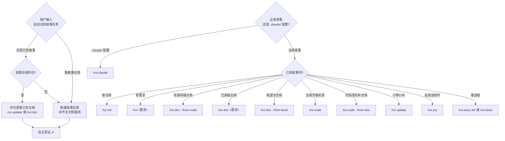

`需求` 支持文本 / `@` 引用本地文件 / URL。`--name` 用 kebab-case 的 `<name>` 格式（如 `user-login`）。

### 写入命令（末端自动交付三步）

- `/rui init` — 建立项目基线：detect → explore → generate → setup → verify → trigger
- `/rui <需求>` — 端到端：doc + code 自动串联，逐故事串行
- `/rui doc <需求>` — 拆需求为故事 + 生成文档基线（故事任务/使用场景/技术评审/测试设计/安全审计），禁止改源码
- `/rui code <name>` — 实现故事：Gate A → 逐模块 → Gate B → 自改进 → 交付
- `/rui update <name> [ctx] [--no-code]` — 增量更新：T1/T2/T3 自动裁剪
- `/rui code --from-doc <name>` — 从文档反推：只读源码补全缺失文档（实施报告/测试报告/自改进复盘），不覆盖已有
- `/rui doc --from-code 需求` — 从源码反推：req 空时 pm 扫描推荐列表；req 有值时直接反推生成完整文档基线
- `/rui doc --from-local <name>` — 从已有本地文档补全缺失文档基线（只读已有，生成缺失，不覆盖）
- `/rui yry [--depth N]` — 自改进闭环：全自主扫描→诊断→实现→验证→版本升级，循环至无改进空间或达到深度上限（默认 3）
- `/rui version --up` — 版本升级：自主判定下一版本号 → 更新文件 → git commit → 合并到 main → 推送远端 + tag
- `/rui version --rollback <name>` — 版本回退：基于 git 版本链回退故事文档到指定历史版本（需确认）

### 只读命令（不触发 hook）

- `/rui` — 任务推荐：5 层链式管线评分排序

> 进度查询已迁移至 `/rui-story list` 和 `/rui-story`，详见 [rui-story SKILL.md](../rui-story/SKILL.md)。

## 管线一览

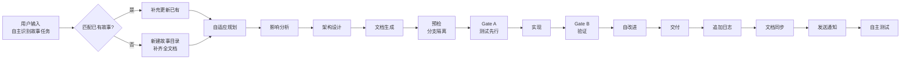

- 影响分析 / 证据等级 → [agents/AGENT.md](../../agents/AGENT.md)
- 分支隔离 / Gate A/B / P0 审查 → [rules/code-pipeline.md](../../rules/code-pipeline.md)
- 交付三步 / 文档同步 → [rules/delivery-gate.md](../../rules/delivery-gate.md)
- 诊断 D0–D7 / 评估 E1–E4 → [rules/self-improve.md](../../rules/self-improve.md)
- 文档生成约束 → [rules/doc-generation.md](../../rules/doc-generation.md)
- Agent 交接 → [agents/](../../agents/) 各角色

## 阻断标识

阻断后记录状态（`blocked=true` + `block_reason=<标识>`），重跑同命令从 `current_stage` 续。

**需求→文档阶段**
- `no-parse` — 需求无法解析
- `no-source` — P0 章节缺上游来源
- `chain-broken` — 影响链未闭合
- `doc-p0` — 文档 P0 不通过且无法自修复

**需求→文档阶段**
- `no-doc-isolation` — doc/update 阶段在非 `feat/<name>` 分支写入故事文档
- `bad-branch` — 分支未从 main 创建或混入非本故事代码
- `no-checkout` — 未切换故事分支即写入/改码

**预检→实现阶段**
- `no-branch-isolation` — `node skills/rui/branch-check.mjs` 验证失败（非 `feat/<name>` 时执行 Edit/Write）
- `skip-gate-a` — Gate A 未通过即编码

**实现→验证阶段**
- `code-p0` — 代码 P0 无法修复
- `gate-b-limit` — Gate B >2 轮

**交付阶段**
- `auto-merge` — 功能分支被自动合并到 main
- `no-token`（降级）— `API_X_TOKEN` 缺失
- `no-metrics`（降级）— self-improve 数据采集失败

## 核心约束

1. **逐故事串行** — 多故事按拆分顺序处理，互不交叉
2. **分支隔离（强制）** — 任何 Edit/Write 前必须验证当前分支为 `feat/<name>`：doc 写文档、code 改源码、update 增删文件，均需分支隔离。禁止在 main 上写文档或改码、禁止派生、禁止自动合并。唯一例外：`/rui init`（写 CLAUDE.md/README.md 等项目级基线，不走故事分支）
3. **源码唯一入口** — 只能走 `/rui code` 改源码
4. **测试先行** — Gate A 阻断实现；Gate B >2 轮阻断交付
5. **逐模块 P0 清零** — 每模块审查后 P0 清零再前进
6. **只读反推** — `--from-code` / `--from-doc` 禁止改源码
7. **产出内聚** — 关键产出限定在 `docs/故事任务面板/<name>/`
8. **公式驱动** — 文档由 [formulas.md](./formulas.md) 规约，故事任务+使用场景为问题/用户空间基线，技术评审/测试设计/安全审计为解决方案空间，实施报告/测试报告/自改进复盘为验证与改进空间
9. **知识沉淀** — 写入 `交互日志.md`；提案写入 `.improvement/proposals.jsonl`
10. **交付强制** — 三步按序触发（hook-log → rui-import → rui-bot → self-test），详见 [强制集成](#强制集成)
11. **自主测试** — 每次故事任务变更后自动执行自检：基线完整性 · 文档一致性 · 分支隔离 · 安全合规；缺 self-test 故事目录时跳过不阻断
12. **表达优先** — 文档内容必须 图 → 结构化文本 → 表，架构/流程/关系优先 mermaid，不可降级

## 故事文档

> 标准基线 10 文档，无编号前缀，无前后端拆分。文档按管线阶段生成，公式见 [formulas.md](./formulas.md)。

| 文件 | 阶段 | 基线 | 必选 |
|------|------|:---:|:---:|
| 消息通知列表.md | 交付 | — | 自动 |
| 故事任务.md | 文档生成 | 问题空间 | ✓ |
| 使用场景.md | 文档生成 | 用户空间 | ✓ |
| 技术评审.md | 文档生成 | — | ✓ |
| 测试设计.md | 文档生成 | — | ✓ |
| 安全审计.md | 文档生成 | — | ✓ |
| 实施报告.md | 验证 | — | ✓ |
| 测试报告.md | 验证 | — | ✓ |
| 自改进复盘.md | 自改进 | — | ✓ |
| 交互日志.md | 全阶段 | — | ✓ |

## init

> 六步：探 → 察 → 生 → 架 → 搭 → 验 → 触。可重复运行，每次全量重生。CLAUDE.md 的 `<!-- rui:project-start -->` / `<!-- rui:project-end -->` 标记段每次覆盖，段外保留。

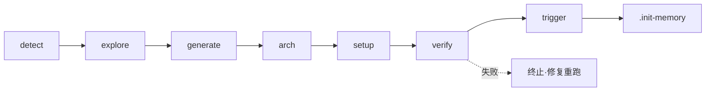

### 1. detect — 探测信号

抽取 profile 为后续阶段提供事实基线：

- **项目身份** — 仓库目录名 → 分支前缀；故事目录名纯语义 kebab-case，文档名不加项目前缀
- **项目类型** — 关键目录与配置文件 → frontend / backend / fullstack / meta / unknown（判定见下图）
- **项目清单** — 按生态文件抽取依赖 + 构建/测试命令 + 框架版本
- **安全面** — 源码关键词扫描：用户输入 / API / 存储 / 认证 / 第三方
- **测试框架** — 依赖 + 配置文件 → vitest / jest / pytest / go-test / cargo-test
- **架构模式** — 项目结构 → single / monorepo / microservice / plugin

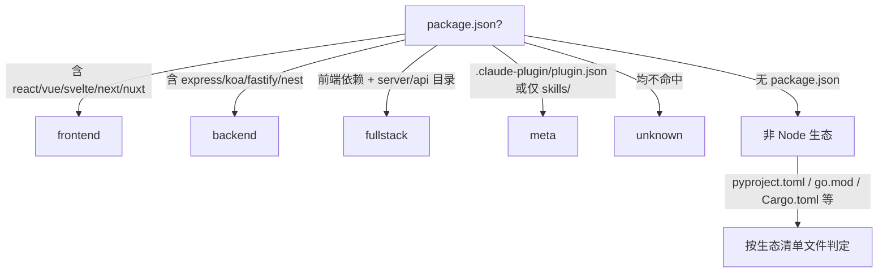

### 2. explore — 深度探索

阅读核心源码，理解架构模式、代码规范、安全面。验证并补充 profile 判断。**抽取模块地图**：识别项目内所有模块（skills/agents/rules 等），记录每个模块的入口文件、核心依赖、下游消费者，为后续架构故事生成提供事实基线。

### 3. generate — 生成内容

基于 profile + 探索发现直接编写文件：

- `CLAUDE.md` — 项目画像 + 执行准则 + 退化对策 + 项目约束（含 `rui:project-start/end` 标记）+ 自约束
- `README.md` — 系统视图 + 命令流 + 快速开始 + 项目结构 + [领域语言段](../../README.md#领域语言)（术语定义 + 关系 + 示例对话 + 歧义标记）

### 4. arch — 补齐技术架构故事 + 自主测试方案

> 自主生成两个故事目录：
> - `docs/故事任务面板/<project>-arch/` — 系统架构知识固化
> - `docs/故事任务面板/<project>-self-test/` — 项目自主测试方案
>
> 基于 explore 阶段抽取的模块地图、项目拓扑事实和基线文档（CLAUDE.md / README.md）自主构建。

**4a. 技术架构故事** (`<project>-arch`)，按 5 文档基线生成（委托 pm → coder → tester → security 逐文档生成，同 doc 管线约束）：

| # | 文档 | Agent | 内容 |
|---|------|-------|------|
| 1 | 故事任务.md | pm | 系统架构知识固化 + 模块地图两大 Story，含 FP/AC/SC/风险 |
| 2 | 使用场景.md | pm | ≥4 个架构参考场景（模块定位/数据流追踪/新人上手/依赖变更影响），每场景含 mermaid flowchart |
| 3 | 技术评审.md | coder | 模块地图（入口文件+依赖+下游消费者）· 4 层拓扑模型 · 数据流图（命令/doc/交付/自改进）· 信任边界 · ADR · 依赖矩阵 |
| 4 | 测试设计.md | tester | 架构验证用例（模块存在性/依赖完整性/信任边界/文档覆盖），四类全覆盖 |
| 5 | 安全审计.md | security | STRIDE 六类威胁建模 · 6 项合规检查 · 信任边界独立审计 |

**4b. 自主测试方案** (`<project>-self-test`)，基于基线文档自主构建项目自检策略，按 5 文档基线生成：

| # | 文档 | Agent | 内容 |
|---|------|-------|------|
| 1 | 故事任务.md | pm | 项目自检体系两大 Story：管线健康自检 + 文档基线完整性校验，含 FP/AC/SC/风险 |
| 2 | 使用场景.md | pm | ≥4 个自检场景（init 后全量自检/每次 commit 前增量自检/文档→代码一致性校验/安全面回归自检），每场景含 mermaid flowchart |
| 3 | 技术评审.md | coder | 自检架构：检查项注册表 · 执行引擎（按序/并行/降级）· 报告输出格式 · 与 Gate A/B 的集成点 |
| 4 | 测试设计.md | tester | 自检项用例（CLAUDE.md 完整性/README.md 领域语言/故事目录结构/分支隔离/版本一致性/安全合规），四类全覆盖 |
| 5 | 安全审计.md | security | 自检面安全审计：检查项本身不可被绕过 · 自检结果不可伪造 · 降级路径不可滥用 |

**故事命名**：`<project>-arch`、`<project>-self-test`（如项目名 `YrY` → `yry-arch`、`yry-self-test`）。

### 5. setup — 机械搭建

- 创建 `docs/故事任务面板/`（如已由 arch 步骤创建则跳过）
- 生成 `.claude/skills/rui-bot/config.json`（schema 见 [rui-bot SKILL.md](../rui-bot/SKILL.md#内置配置)）
- 写入 `docs/故事任务面板/.init-memory.json`

### 6. verify — 7 项就绪检查

任一失败即终止：

- CLAUDE.md 含 `rui:project-start` 标记 + 项目名
- README.md 含项目名
- README.md 含 `## 领域语言` 标题 + ≥3 个术语定义
- `docs/故事任务面板/` 目录存在
- `docs/故事任务面板/<project>-arch/` 目录存在，含 5 文档基线
- `docs/故事任务面板/<project>-self-test/` 目录存在，含 5 文档基线（故事任务/使用场景/技术评审/测试设计/安全审计）
- `.claude/skills/rui-bot/config.json` 存在

### 7. trigger

验证通过后触发 rui-import（workspace 全量）+ rui-bot 通知。缺 token 跳过，网络失败告警不阻断。

### 产物

- `CLAUDE.md` — `rui:project-*` 标记内全量重生，段外保留
- `README.md` — 全量重生，领域语言段重复运行时增量补充
- `docs/故事任务面板/<project>-arch/` — 项目技术架构故事（5 文档基线），每次全量重生
- `docs/故事任务面板/<project>-self-test/` — 项目自主测试方案（5 文档基线），每次全量重生
- `.claude/skills/rui-bot/config.json` — 每次覆盖
- `docs/故事任务面板/.init-memory.json` — 每次覆盖

## doc

> 需求到文档基线的完整管线。pm 拆需求为故事 → coder 补齐设计文档。全程只读源码，多故事串行。pm 应用烧烤纪律：挑战模糊术语、走完决策树、用领域语言命名、不确定 > 2 项不推进。
>
> **写故事文档也走分支隔离。** doc 阶段写入 `docs/故事任务面板/<name>/` 下的文档，这些写入操作必须在 `feat/<name>` 分支上执行，与 code 阶段同门禁。

### 效果示意

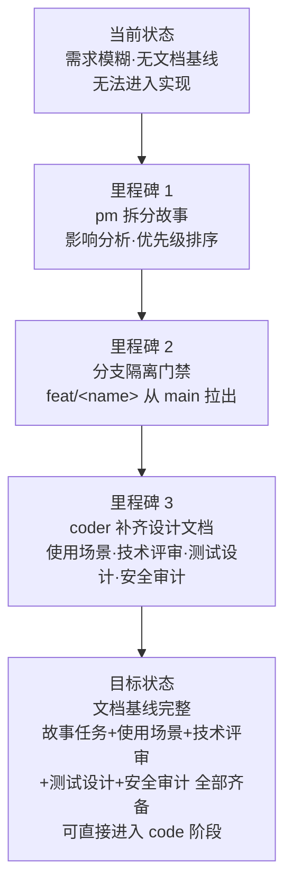

### §1 Story

#### Story 1: 需求拆分为故事任务

| 字段 | 内容 |
|------|------|
| 作为 | 需求提出者 |
| 我想要 | 将自然语言需求拆分为结构化的故事任务文档 |
| 以便 | 每个故事有独立的文档目录、清晰的优先级和明确的验收标准 |
| 优先级 | P0 |
| 范围边界 | 只读源码，不修改任何文件 |
| 依赖 | 源码可访问，pm agent 可用 |

##### 范围外

- 不涉及源码修改或 git 分支操作（分支操作由后续步骤处理）
- 不生成技术设计文档（由 coder 在 Story 2 补齐）

##### §1.1 User Operations

| # | 操作 | 触发条件 | 操作步骤 | 预期结果 |
|---|------|---------|---------|---------|
| 1 | 从需求生成故事 | 用户执行 `/rui doc <需求>` | pm 解析需求 → 拆分为故事 → 影响分析 → 优先级排序 → 逐故事写入故事任务 | 每个故事目录下生成 故事任务.md |
| 2 | 引用本地文件 | 用户执行 `/rui doc @file` | pm 读取文件内容 → 解析为需求 → 拆分故事 | 同上，需求来源含文件路径引用 |
| 3 | 引用外部 URL | 用户执行 `/rui doc <URL>` | pm 抓取 URL 内容 → 解析为需求 → 拆分故事 | 同上，需求来源含 URL 引用 |

---

#### Story 2: 补齐设计文档

| 字段 | 内容 |
|------|------|
| 作为 | coder |
| 我想要 | 基于故事任务生成完整的技术设计文档基线 |
| 以便 | 实现阶段有完整的技术方案依循，安全面有独立审计 |
| 优先级 | P0 |
| 范围边界 | 只读源码 + 故事任务文档，写入使用场景/技术评审/测试设计/安全审计 |
| 依赖 | Story 1 完成，故事任务文档存在 |

##### 范围外

- 不涉及源码修改
- 不覆盖实施报告/测试报告/自改进复盘（由 code 阶段产出）

##### §1.1 User Operations

| # | 操作 | 触发条件 | 操作步骤 | 预期结果 |
|---|------|---------|---------|---------|
| 1 | 补齐使用场景 | pm 完成故事任务后自动触发 | coder 读取故事任务 → 按 F.story.scenarios 公式生成 → 校验用户空间语言边界（禁止技术术语/组件名/API 端点） | 生成 使用场景.md |
| 2 | 补齐技术评审 | 使用场景完成后自动触发 | coder 只读源码 → 按 F.story.technical-review 公式生成（含架构/API/数据/组件/状态/交互，按项目类型裁剪章节） | 生成 技术评审.md |
| 3 | 补齐测试设计 | 技术评审完成后自动触发 | tester 基于故事任务+使用场景双基线 → 按 F.story.test-design 公式生成 | 生成 测试设计.md |
| 4 | 补齐安全审计 | 技术评审完成后自动触发 | security 基于技术评审 → 按 F.story.security-audit 公式独立审计 | 生成 安全审计.md |

---

#### Story 3: 分支隔离门禁

| 字段 | 内容 |
|------|------|
| 作为 | 管线 |
| 我想要 | 确保文档写入操作在隔离分支上进行 |
| 以便 | 防止未经验证的文档变更污染 main 分支 |
| 优先级 | P0 |
| 范围边界 | 仅检查分支状态，不自动创建或切换分支 |
| 依赖 | git 仓库可操作 |

##### §1.1 User Operations

| # | 操作 | 触发条件 | 操作步骤 | 预期结果 |
|---|------|---------|---------|---------|
| 1 | 分支检查通过 | `git branch --show-current` 为 `feat/<name>` | 直接继续文档写入 | 门禁通过 |
| 2 | 分支不匹配 | 当前分支非 `feat/<name>` | 提示用户创建或切换到 `feat/<name>`（从 main 拉出）→ 重新检查 | 门禁通过后继续 |

---

### §2 Requirements

#### 功能点

| FP# | 描述 | 输入 | 输出 | 错误行为 | 优先级 |
|-----|------|------|------|---------|--------|
| FP1 | 需求解析 — 将自然语言/文件/URL 需求拆分为故事列表 | 需求文本或引用 | 故事列表（含优先级、依赖、范围边界） | 需求无法解析时阻断 `no-parse` | P0 |
| FP2 | 影响分析 — 分析每个故事对现有系统的影响链 | 源码 + 故事需求 | 影响点列表 + 影响级别 | 影响链未闭合时阻断 `chain-broken` | P0 |
| FP3 | 故事任务生成 — 按 F.story.task 公式生成 | 解析结果 + 影响分析 | 故事任务.md | 占位符未替换或 P0 检查项缺失时阻断 | P0 |
| FP4 | 使用场景生成 — 按 F.story.scenarios 公式生成 | 故事任务文档 | 使用场景.md | 场景覆盖不全（<2 场景）或语言污染时阻断 | P0 |
| FP5 | 技术评审生成 — 按 F.story.technical-review 公式生成（含架构/API/数据/组件/状态/交互/性能，按项目类型裁剪章节） | 故事任务+使用场景 + 源码 | 技术评审.md | P0 检查项未通过时阻断 | P0 |
| FP6 | 测试设计生成 — 按 F.story.test-design 公式生成 | 故事任务+使用场景+技术评审 | 测试设计.md | AC 覆盖不全或 Gate A 交接信号缺失时阻断 | P0 |
| FP7 | 安全审计生成 — 按 F.story.security-audit 公式生成 | 技术评审文档 | 安全审计.md | 威胁未覆盖或缓解措施缺失时阻断 | P0 |
| FP8 | 分支隔离验证 — 写入前检查 `feat/<name>` 分支 | 故事名称 | 通过/阻断 | 非 `feat/<name>` 分支上写入时阻断 `no-doc-isolation` | P0 |
| FP9 | 多故事串行 — 按拆分顺序逐故事处理 | 故事列表 | 每故事完整文档基线 | 前一故事未完成时不得进入下一故事 | P0 |
| FP10 | 项目类型裁剪 — 技术评审按项目类型跳过不适用章节 | 项目类型 | 裁剪后的技术评审文档（纯前端跳过 API/数据/后端性能章节，纯后端跳过组件/状态/交互/样式章节） | 类型判定失败时默认全量生成 | P1 |

#### 业务规则

| R# | 描述 | 校验方式 | 证据级别 |
|----|------|---------|---------|
| R1 | pm 拆分前必须建立事实基线（Read/Grep/Glob 研究源码） | 检查 agents/pm.md 执行步骤 | B |
| R2 | 故事任务文档禁止包含技术术语（代码路径/API 路由/组件名/技术栈名） | 扫描 `/api/`、`/src/`、`<.*>` 等模式 | B |
| R3 | 使用场景文档禁止包含技术术语和组件名 | 扫描技术名词模式 | B |
| R4 | 所有文档必须含 `### 主要价值` 节，≥ 4 条 emoji 前缀行 | grep 计数 | B |
| R5 | 每文档必须含回溯链（来源引用 + 变更记录） | grep 表头与链接格式 | B |
| R6 | 多故事时按优先级顺序串行处理，前一故事 doc 完成后再进下一故事 | 逐故事检查产出完整性 | B |
| R7 | 分支必须从 main 拉出，禁止在已有功能分支上创建新故事分支 | `git log main..HEAD` 检查提交历史 | B |
| R8 | 安全审计由 security agent 独立执行，不依赖 coder 自评 | 检查 agents/security.md 执行记录 | B |
| R9 | 任何 rui 写操作前必须通过 branch-check.mjs 验证 | `node skills/rui/branch-check.mjs --story=<name> --mode=write`，exit code ≠ 0 阻断 | A |

#### 数据约束

| 约束 | 类型 | 范围/格式 | 来源 |
|------|------|----------|------|
| 故事名称 | string | `^[a-z0-9]+(-[a-z0-9]+)*$` (kebab-case) | 命名规范约定 |
| 项目类型 | enum | `frontend` / `backend` / `fullstack` / `meta` / `unknown` | init detect 阶段判定 |
| 故事优先级 | enum | P0 / P1 / P2 | pm 影响分析 |
| 文档集 | 10 文档固定集 | 见 [故事文档](#故事文档) | formulas.md |
| 分支名 | string | `feat/<name>` | 分支隔离约束 |

---

### §3 成功标准

| SC# | 描述 | 度量方式 | 目标值 | 优先级 | 关联 FP# |
|-----|------|---------|--------|--------|---------|
| SC1 | 用户可用一行命令从需求生成完整文档基线 | `/rui doc <需求>` 执行到全部文档产出 | 5 文档全部生成 | P0 | FP1–FP7 |
| SC2 | 文档基线通过全部 P0 检查 | [P0 检查清单](./formulas.md#p0-检查清单) | 全部通过 | P0 | FP3–FP7 |
| SC3 | 多故事按优先级串行且互不交叉 | 逐故事产出目录时间戳检查 | 顺序一致 | P0 | FP9 |
| SC4 | 文档写入仅在隔离分支进行 | `git branch --show-current` 验证 | 100% 匹配 `feat/<name>` | P0 | FP8 |
| SC5 | 故事任务和使用场景通过语言边界扫描 | 技术术语正则扫描 | 0 命中 | P0 | R2, R3 |
| SC6 | 技术评审按项目类型正确裁剪章节 | 按项目类型检查产出章节清单 | 与裁剪规则一致 | P1 | FP10 |

---

### §4 范围边界

#### 范围内

| # | 条目 | 关联 FP# | 边界说明 |
|---|------|---------|---------|
| 1 | 需求解析与故事拆分 | FP1, FP2 | pm 负责，含影响分析和优先级排序 |
| 2 | 双基线文档生成（故事任务 + 使用场景） | FP3, FP4 | 问题空间 + 用户空间基线，所有下游溯源目标 |
| 3 | 技术设计文档生成（技术评审） | FP5 | coder 负责，按项目类型裁剪章节 |
| 4 | 测试设计文档生成 | FP6 | tester 负责，Gate A 交接信令 |
| 5 | 安全审计文档生成 | FP7 | security 负责，独立审计 |
| 6 | 分支隔离门禁 | FP8 | 与 code 阶段同门禁 |
| 7 | 末端交付三步 | — | hook-log → rui-import → rui-bot |

#### 范围外

| # | 条目 | 排除原因 | 替代方案 |
|---|------|---------|---------|
| 1 | 源码修改 | 源码变更是 code 阶段的职责 | 使用 `/rui code <name>` |
| 2 | 实施报告/测试报告/自改进复盘 | 属于 code 阶段产出 | 使用 `/rui code <name>` |
| 3 | git 分支创建与切换 | 由用户或管线在执行写入前操作 | `git checkout -b feat/<name>` |
| 4 | 文档同步到远端 | 属于交付三步中的 rui-import | 末端自动触发 |
| 5 | 已有文档的增量更新 | doc 是新建基线，增量用 update | 使用 `/rui update <name>` |
| 6 | 故事进度查询 | 属于 rui-story 面板管理 | 使用 `/rui-story` 或 `/rui-story list` |

---

### §5 AC

| AC# | Given | When | Then | 门禁 |
|-----|-------|------|------|------|
| AC1 | 用户提供清晰的自然语言需求 | 用户执行 `/rui doc <需求>` | pm 完成拆分，生成 ≥1 个故事的故事任务文档 | Gate A |
| AC2 | pm 完成故事任务文档 | coder 补齐使用场景 | 生成使用场景文档，通过语言边界扫描（无技术术语污染） | Gate A |
| AC3 | 使用场景完成 | coder 补齐技术评审 | 生成技术评审文档，效果示意 + 全部必填章节完整，按项目类型正确裁剪 | Gate A |
| AC4 | 技术评审完成 | tester 生成测试设计 | 生成测试设计文档，AC 覆盖全部故事任务 §5 的 AC#，Gate A 交接信号完整 | Gate A |
| AC5 | 技术评审完成 | security 执行安全审计 | 生成安全审计文档，威胁建模覆盖全部信任边界 | Gate A |
| AC6 | 当前分支非 `feat/<name>` | 管线检查分支隔离 | 阻断写入，提示用户创建 `feat/<name>` 从 main 拉出 | Gate A |
| AC7 | 当前分支为 `feat/<name>` | 管线写入文档 | 直接写入全部文档到 `docs/故事任务面板/<name>/` | Gate A |
| AC8 | 文档基线全部生成完成 | 管线触发末端交付 | hook-log → rui-import → rui-bot 三步按序执行 | Gate B |
| AC9 | 需求包含多个故事（故事列表 ≥ 2） | pm 拆分后按优先级排序 | 逐故事串行：故事 1 全部文档完成 → 故事 2 全部文档完成 → ... | Gate A |
| AC10 | 需求无法解析（模糊、矛盾、信息不足） | pm 尝试解析 | 阻断 `no-parse`，提示用户补充信息，不生成空文档 | Gate A |

---

### §6 风险与假设

| # | 风险/假设 | 类型 | 可能性 | 影响 | 缓解/验证策略 | 关联 FP# |
|---|----------|------|--------|------|-------------|---------|
| 1 | 需求描述过于模糊导致 pm 无法拆分 | 风险 | H | H | pm 应用烧烤纪律，不确定 > 2 项不推进，阻断并提示补充 | FP1 |
| 2 | P0 检查项中缺来源导致文档基线不完整 | 风险 | M | H | 每个断言必须有来源引用或证据路径；不可达来源标 C 级 | FP3–FP7 |
| 3 | 分支名冲突（feat/<name> 已存在） | 风险 | M | M | 检测到冲突时提示用户处理已有分支 | FP8 |
| 4 | 多故事拆分时下游故事依赖上游但上游未完成 | 风险 | M | M | 串行约束强制前一故事完成再进入下一故事 | FP9 |
| 5 | 故事任务/使用场景混入技术术语导致下游设计偏离基线 | 风险 | M | H | P0 检查清单正则扫描；下游文档审查时反向溯源 | FP3, FP4 |
| 6 | 项目类型误判导致技术评审章节裁剪错误 | 风险 | L | M | 类型判定失败时默认全量生成 | FP10 |
| 7 | 研究阶段源码不可读或关键路径缺失导致 pm 分析不完整 | 风险 | L | L | 源码不可读或结构混乱时阻断，要求用户先梳理源码 | FP1 |
| 8 | security agent 与 coder 为同一实例导致审计不独立 | 风险 | M | H | 安全审计由独立 security agent 执行 | FP7 |
| 9 | pm 能正确理解需求并拆分为合理粒度的故事 | 假设 | — | — | pm agent 规约约束拆分行为；拆分结果可通过故事任务文档验证 | FP1 |
| 10 | 源码结构反映了实际架构使得 coder 能准确提取技术方案 | 假设 | — | — | 源码不可读或结构混乱时阻断，要求用户先梳理源码 | FP5 |

**约束**：只读源码 · 分支隔离（强制，同 code 阶段门禁） · 逐故事串行 · 在 `feat/<name>` 分支上写入文档

**产出**：故事任务.md（问题空间基线）· 使用场景.md（用户空间基线）· 技术评审.md（按项目类型裁剪章节）· 测试设计.md（Gate A 交接）· 安全审计.md（独立审计）

**逐文件自动导入**（强制）：每个文档生成后**必须**立即执行 `node skills/rui/import-doc.mjs <file-path>` 导入远端。此为硬性步骤，不可跳过或推迟到批量安全网。导入失败不阻断管线，记录告警后继续。


**末端触发** [强制集成](#强制集成)。

## code

> 源码改动唯一入口。分支隔离强制门禁 → Gate A 测试先行 → 逐模块 P0 清零 → Gate B ≤2 轮 → 自改进 D0–D7 → 交付。

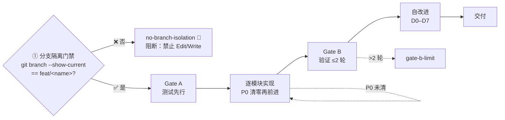

**产出**：实施报告.md · 测试报告.md · 自改进复盘.md

**逐文件自动导入**（强制）：每个报告文档生成后**必须**立即执行 `node skills/rui/import-doc.mjs <file-path>` 导入远端，规则同 doc 阶段。

**约束**：源码唯一入口 · Gate A `测试设计.md` 不存在即阻断 · Gate B >2 轮阻断 · P0 不清零不进下一模块

**末端触发** [强制集成](#强制集成)。

## 端到端

> `/rui 需求` = `/rui doc 需求` → `/rui code <name>`，无中断一气呵成。


**末端触发** [强制集成](#强制集成)。

## update

> 增量更新，按变更范围 T1/T2/T3 自动裁剪管线。`--no-code` 仅文档不改源码。
>
> **写入前先验证分支隔离。** 无论 T1/T2/T3，只要涉及 Edit/Write 就必须先在 `feat/<name>` 分支上。

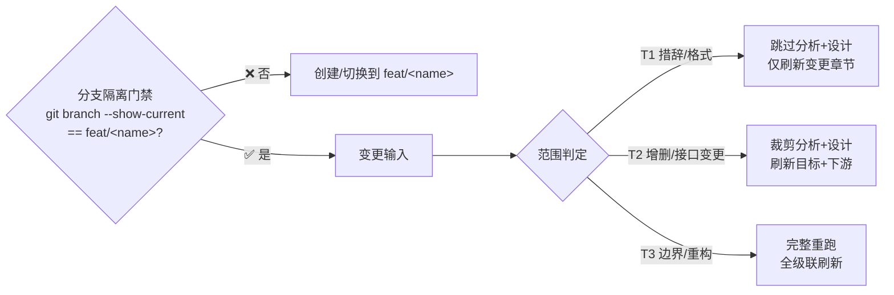

| 级别 | 范围 | 影响分析 | 架构设计 | 文档刷新 |
|------|------|---------|---------|---------|
| T1 | 措辞 / 格式 | 跳过 | 跳过 | 仅变更章节 |
| T2 | 增删故事 / 接口变更 | 裁剪 | 裁剪 | 目标 + 下游 |
| T3 | 边界变化 / 跨故事重构 | 完整重跑 | 完整重跑 | 全级联刷新 |

**末端触发** [强制集成](#强制集成)。

## yry

> 自改进闭环：全自主扫描所有故事，诊断→实现→验证→版本升级，循环至无改进空间或达到 `--depth` 上限。
>
> **每个闭环自动为涉及的故事升级版本号**（语义化版本：内容改进→补丁升级，新功能→次版本升级，架构变更→主版本升级）。
>
> **参数**：`/rui yry [--depth N]` — `--depth` 指定最大闭环次数，默认 3。

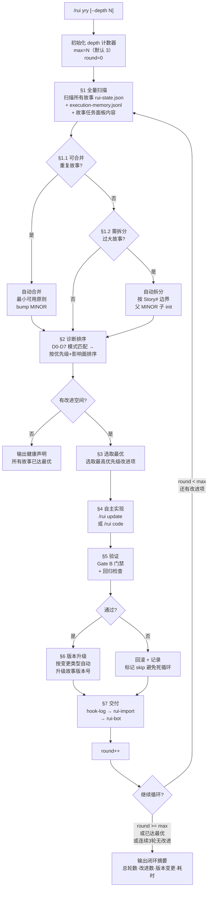

### §1.1–1.2 自动合并与拆分

> yry 在扫描阶段自动检测可合并的重复故事和需拆分的大故事，全自动执行，无需手动干预。

| 检测 | 条件 | 行为 |
|------|------|------|
| 自动合并 | 远端+本地存在内容重叠 ≥ 70% 的故事 | 按最小可用原则合并（保留信息量最大版本），bump MINOR |
| 自动拆分 | 故事含 ≥ 8 个 Story# 或 ≥ 15 个 FP# | 按 Story# 独立性拆分边界，父 bump MINOR，子 init 1.0.0 |

### 版本管理

> 每个故事在 `.memory/rui-state.json` 中维护 `version` 字段（语义化版本 `MAJOR.MINOR.PATCH`）。每次闭环完成时自动升级。

| 变更类型 | 版本升级 | 示例 |
|---------|---------|------|
| 措辞修正 / 格式调整 | PATCH (`1.0.0` → `1.0.1`) | T1 update |
| 增删功能 / 接口变更 | MINOR (`1.0.1` → `1.1.0`) | T2 update |
| 边界变化 / 架构重构 | MAJOR (`1.1.0` → `2.0.0`) | T3 update |

**版本判定规则**：

| 规则 | 说明 |
|------|------|
| 初始版本 | 故事首次创建时 `version: "1.0.0"` |
| 自动升级 | yry 闭环完成后根据变更类型自动 bump |
| 手动升级 | `/rui update` 完成后由管线自动 bump |
| 版本记录 | 每次升级追加到 `rui-state.json` 的 `version_history` 数组 |
| 版本展示 | 查看 `.memory/rui-state.json` 中的 `version` 和 `version_history` 字段 |

**rui-state.json 版本字段**：

```json
{
  "version": "1.2.1",
  "version_history": [
    {"version": "1.0.0", "date": "2026-05-20", "trigger": "doc --from-code", "change": "初始生成"},
    {"version": "1.1.0", "date": "2026-05-21", "trigger": "/rui update", "change": "补充接口数据请求流"},
    {"version": "1.2.0", "date": "2026-05-22", "trigger": "/rui update", "change": "追加状态管理和指标采集"},
    {"version": "1.2.1", "date": "2026-05-22", "trigger": "/rui yry", "change": "自动修复 P1 格式问题"}
  ]
}
```

### 终止条件

| 条件 | 说明 |
|------|------|
| 达到深度上限 | `round >= --depth`（默认 3），强制终止循环 |
| 无改进空间 | 所有 D0-D7 诊断通过，无待处理提案 |
| 连续 3 轮无效 | 连续 3 轮无实质性变更（仅格式或空操作） |
| 用户中断 | Ctrl+C 或关闭会话 |
| 阻断不可自愈 | 遇到 `doc-p0` / `code-p0` 等需要人工决策的阻断 |

优先顺序：深度上限 > 无改进空间 > 连续无效 > 用户中断 > 阻断

### 约束

| 约束 | 规则 |
|------|------|
| 全自主 | 无用户交互，自动决策和实现 |
| 逐故事 | 每次闭环处理一个故事的一个改进项 |
| 分支隔离 | 每故事自动创建/切换到 `feat/<name>` |
| 版本强制 | 每次闭环完成必须 bump 版本号 |
| 防死循环 | 同一改进项失败 ≥ 2 次 → skip + 记录 |
| 深度约束 | `--depth` 指定最大闭环次数，默认 3，≤ 0 时仅扫描不执行 |
| 无改进不 bump | 若闭环未产生实质变更，不升级版本 |

**末端触发** [强制集成](#强制集成)。

## version --up

> 自主判定下一版本号，更新所有版本文件，git commit + auto-merge → main + push。
> **全自主操作，无需用户确认版本号。项目级和故事级统一入口。**
>
> 每次版本改动记录 git commit（含版本号 + 变更摘要），支持 `version --rollback` 回退。

```mermaid
flowchart LR
    CMD["/rui version --up"]:::src --> CHECK{"当前分支?"}
    CHECK -->|"非 main"| STASH["git stash → checkout main<br/>→ stash pop → 在 main 上操作"]:::op
    CHECK -->|"main"| ANALYZE["分析当前变更<br/>git diff + 版本历史"]:::op
    STASH --> ANALYZE
    ANALYZE --> DECIDE{"变更类型?"}
    DECIDE -->|"PATCH<br/>措辞/格式/修复"| PATCH["bump PATCH<br/>1.7.0 → 1.7.1"]:::op
    DECIDE -->|"MINOR<br/>新功能/新命令"| MINOR["bump MINOR<br/>1.7.0 → 1.8.0"]:::op
    DECIDE -->|"MAJOR<br/>架构变更/破坏性"| MAJOR["bump MAJOR<br/>1.7.0 → 2.0.0"]:::op
    PATCH --> UPDATE["§4 更新版本文件<br/>plugin.json · CLAUDE.md<br/>README.md"]:::op
    MINOR --> UPDATE
    MAJOR --> UPDATE
    UPDATE --> HELP["§4a 更新 help<br/>扫描 skills/*/help.mjs<br/>修正过时引用"]:::op
    HELP --> README["§4b 更新 README<br/>校验技能表 · 目录树<br/>命令文档 · 领域语言"]:::op
    README --> DOCS["§4c 更新关联文档<br/>扫描 故事任务面板/<br/>修正过时引用"]:::op
    DOCS --> COMMIT["git add + git commit<br/>含版本号 + 变更摘要"]:::op
    COMMIT --> MERGE["合并到 main<br/>git checkout main && git merge"]:::op
    MERGE --> PUSH["git push origin main"]:::op
    PUSH --> TAG["git tag vX.Y.Z<br/>git push --tags"]:::op
    TAG --> STORY["逐故事版本同步<br/>更新各 story 的<br/>rui-state.json version_history"]:::op
    STORY --> REPORT["输出升级摘要<br/>旧版本→新版本·变更类型<br/>·commit hash·tag"]:::out

```

### 版本判定规则

| 变更信号 | 版本升级 | 示例 |
|---------|---------|------|
| 仅文档措辞/格式调整 | PATCH | `1.7.0` → `1.7.1` |
| 新增 skill/agent/rule/命令 | MINOR | `1.7.0` → `1.8.0` |
| 删除/重命名命令或接口 | MINOR | `1.7.0` → `1.8.0` |
| 架构重构/破坏性变更 | MAJOR | `1.7.0` → `2.0.0` |

### 执行流程

| 步骤 | 操作 | 说明 |
|------|------|------|
| §1 分支准备 | 检查当前分支，非 main 时 stash → checkout main → stash pop | 确保在 main 上操作 |
| §2 分析变更 | `git diff origin/main..HEAD` + `git log` 检查变更范围 + 故事版本记录 | 判定变更类型 |
| §3 判定版本 | 按变更信号决定 PATCH / MINOR / MAJOR | 新版本号 > 旧版本号 |
| §4 更新版本文件 | `plugin.json` version + `CLAUDE.md` version + `README.md` version | 三者同步 |
| §4a 更新 help | 扫描 `skills/*/help.mjs`，修正过时技能名/路径/版本引用 | 确保 help 输出与项目现状一致 |
| §4b 更新 README | 校验技能表 · 目录树 · 命令文档 · 领域语言是否与项目现状一致 | 版本号之外的结构性更新 |
| §4c 更新关联文档 | 扫描 `docs/故事任务面板/`，修正过时引用（技能名/路径/命令） | 故事文档与项目现状同步 |
| §5 git commit | `git add` + `git commit -m "chore: bump version to X.Y.Z"` | 含变更摘要 |
| §6 合并 main | `git checkout main && git merge --ff-only <source>` | fast-forward 合入 |
| §7 推送 | `git push origin main && git push --tags` | 含版本 tag |
| §8 故事版本同步 | 更新涉及的故事 rui-state.json version_history | 记录此次项目版本变更 |
| §9 输出摘要 | 旧版本 → 新版本 / 变更类型 / commit hash / tag | 终端输出 |

### 文档自动更新 (§4a–§4c)

> 版本升级后，用户可见文档必须反映项目现状。以下三步在 §4 版本号同步后执行，确保 help 输出、README、故事文档无过时引用。

| 步骤 | 扫描范围 | 检查内容 | 修正示例 |
|------|---------|---------|---------|
| §4a 更新 help | `skills/*/help.mjs`（6 个） | 技能名、命令路径、版本引用是否过时 | `skills/wework-bot/` → `skills/rui-bot/` |
| §4b 更新 README | `README.md` | 技能表、目录树、命令文档、领域语言、管线图是否与项目现状一致 | 目录树新增/删除/重命名条目 |
| §4c 更新关联文档 | `docs/故事任务面板/` | 故事文档中的技能名、命令路径、文件路径引用是否过时 | `node skills/import-docs/sync.mjs` → `node skills/rui-import/sync.mjs` |

**执行原则：**
- 不重写文档内容，仅修正过时引用（技能名、路径、命令）
- 优先使用 Grep 定位过时引用，再逐文件 Edit
- §4a–§4c 的变更纳入 §5 的 git commit，形成完整版本快照

### git 记录规范

> 每次版本变更必须产生 git commit + tag，形成可回溯的版本链。

| 规则 | 说明 |
|------|------|
| commit 格式 | `chore: bump version X.Y.Z → A.B.C`，body 列变更摘要 |
| tag 格式 | `vX.Y.Z`，annotated tag，message 同 commit subject |
| 故事版本记录 | 故事级版本变更同步写入 `rui-state.json` version_history，含 commit hash |
| 回退支撑 | git tag + commit 链构成完整版本时间线，供 `version --rollback` 使用 |

### 约束

| 约束 | 规则 |
|------|------|
| 不降级 | 新版本号必须 > 旧版本号 |
| 一致性 | plugin.json / CLAUDE.md / README.md 三者版本号同步更新 |
| 不跳号 | 版本号严格递增，不跳过中间版本 |
| git 强制 | 每次版本变更必须有 git commit + tag，无 commit 不升级 |
| 仅 main | 在 main 分支上操作，推送目标为 origin/main |

## version --rollback

> 基于 git 版本链回退故事文档到指定历史版本。利用每次版本变更的 git commit 实现精确回退。
>
> **回退操作产生新 commit（revert），不破坏历史。**

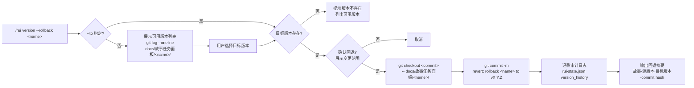

### 执行流程

| 步骤 | 操作 | 说明 |
|------|------|------|
| §1 版本列表 | `git log --oneline -- docs/故事任务面板/<name>/` | 展示该故事的所有 git 版本记录 |
| §2 目标确认 | 用户指定 `--to <version>` 或从列表选择 | version 可为 tag（v1.2.0）或 commit hash |
| §3 变更预览 | `git diff <target>..HEAD -- docs/故事任务面板/<name>/` | 预览回退将产生的变更 |
| §4 确认门禁 | 展示变更文件清单 + 版本跨度 | 用户确认后执行 |
| §5 执行回退 | `git checkout <target> -- docs/故事任务面板/<name>/` | 仅回退该故事目录 |
| §6 提交 | `git commit -m "revert: rollback <name> to <version>"` | 产生新 commit，不破坏历史 |
| §7 审计 | 追加 rui-state.json version_history 条目 | 记录回退操作 + commit hash |
| §8 输出 | 回退摘要：故事名、源版本、目标版本、commit hash | 终端输出 |

### 版本列表格式

```bash
$ /rui version --rollback rui-story

rui-story 可回退版本：
a1b2c3d v1.5.0 — chore: bump rui-story to v1.5.0 (2026-05-22)
e4f5g6h v1.4.0 — feat: 状态管理 + 自改进闭环 (2026-05-21)
i7j8k9l v1.3.0 — feat: 合并拆分功能 (2026-05-20)
```

### 约束

| 约束 | 规则 |
|------|------|
| 仅故事目录 | 回退范围仅限于 `docs/故事任务面板/<name>/`，不影响其他文件 |
| 必须确认 | 回退前展示变更预览，用户确认后执行 |
| 产生 commit | 回退操作产生新 git commit（revert），不破坏历史 |
| 审计记录 | 回退操作写入 rui-state.json version_history |
| 不可回退 merge/split | merge/split 产生的版本因涉及跨故事变更，不支持通过 --rollback 回退 |

**末端触发** [强制集成](#强制集成)。

## code --from-doc

> 从已有文档反推，只读源码补全缺失文档，不覆盖已有。


**约束**：只读 · 不覆盖已有 · 分支隔离

**末端触发** [强制集成](#强制集成)。

## doc --from-code

> 存量代码库的文档生成入口。req 空时 pm 扫描推荐列表；req 有值时从源码反推完整故事文档。全程只读，证据 Level B + 源码路径。

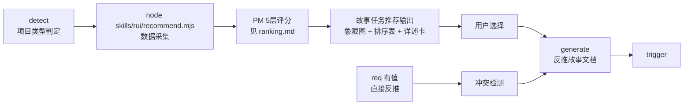

### req 为空 — 推荐引路

5 步推荐管线，数据驱动 + 框架评分：

1. **detect** — 判定项目类型（frontend / backend / fullstack / unknown）
2. **scan** — `node skills/rui/recommend.mjs --root . --type <detected> --format json`
3. **evaluate** — PM 按 [ranking.md](./ranking.md) 的 5 层框架评分排序，输出 P0→P3
4. **present** — 输出故事任务推荐：象限图 → 排序表 → 每故事任务详述卡（覆盖范围·源码证据·预计产出·可执行命令）
5. **wait** — 等待用户选择后进入生成阶段

> 不可跳过第 2 步凭感觉推荐。详细评分框架见 [ranking.md](./ranking.md)。

### req 有值 — 直接生成全文档基线

> 从源码反推完整 5 文档基线到 `docs/故事任务面板/<name>/`。全程只读源码，证据 Level B + 源码路径，缺口标「待补充」。
> 多故事时按 `recommend.mjs` 输出的 storyName 顺序串行，互不交叉。

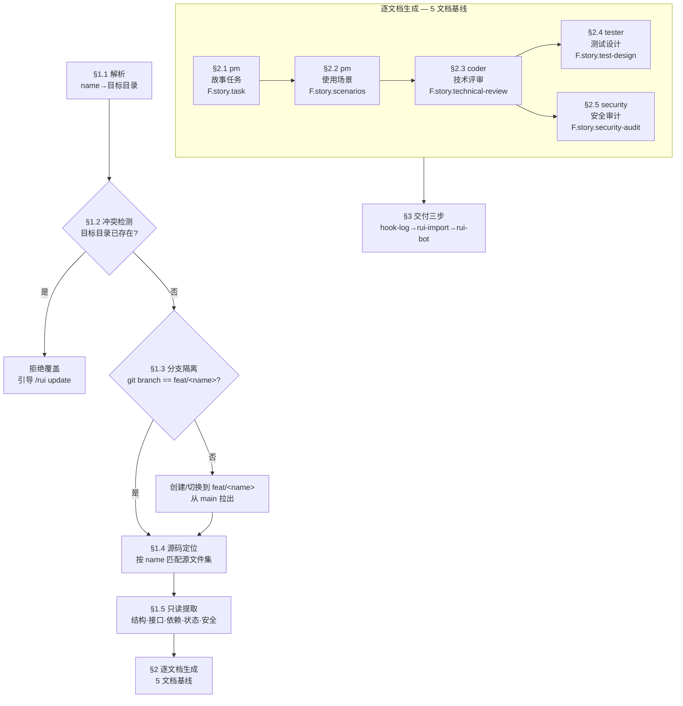

#### §1 前置步骤

| 步骤 | 操作 | 负责人 | 输入 | 输出 | 阻断 |
|------|------|--------|------|------|------|
| §1.1 解析 | 解析 `<name>` 为 kebab-case 故事名，目标目录 `docs/故事任务面板/<name>/` | — | 用户输入 | 故事名 + 目标路径 | `no-parse` |
| §1.2 冲突检测 | 检查目标目录是否已存在 | — | 目标路径 | 通过/拒绝 | 已存在则拒绝覆盖，引导 `/rui update` |
| §1.3 分支隔离 | 验证当前分支为 `feat/<name>`，否则从 main 创建 | — | 故事名 | 分支就绪 | `no-doc-isolation` |
| §1.4 源码定位 | 按 name 匹配源文件：`grep -r` 搜索关键字 + `recommend.mjs` 数据交叉验证 | — | 故事名 + 项目类型 | 源文件清单 + 依赖图 | `no-source` |
| §1.5 只读提取 | 读取全部匹配源文件，提取：结构概览 · 接口/组件签名 · 依赖链 · 状态管理 · 安全信号 | — | 源文件清单 | 结构化代码事实集（供下游 Agent 消费） | `chain-broken` |

**§1.4 源码定位策略**：

| 项目类型 | 搜索范围 | 匹配依据 |
|---------|---------|---------|
| 前端 | `.vue` `.jsx` `.tsx` `.svelte` | 组件名 → 路由注册 → 状态文件 → 样式文件 |
| 后端 | `.ts` `.js` `.py` `.go` 等 | 路由路径 → 控制器/服务 → 数据模型 → 中间件 |
| 全栈 | 两端各自搜索 | 前端组件 + 后端接口，交叉验证契约一致性 |

**§1.5 提取清单**（所有项目类型必提取）：

| 维度 | 提取内容 | 证据格式 |
|------|---------|---------|
| 结构概览 | 目录树 + 文件职责摘要 | `> 证据: <file>:<line>` |
| 接口/组件签名 | 函数签名 · Props/Events · API 路由+方法+请求/响应 | `> 证据: <file>:<line>` 代码片段 |
| 依赖链 | import 图（谁依赖谁） + 外部依赖清单 | `> 证据: import 语句位置` |
| 状态管理 | store/state/context 定义 + 流向 | `> 证据: <file>:<line>` |
| 安全考量 | 用户输入点 · 认证链路 · API 调用 · 敏感数据 | `> 证据: <file>:<line>` |

#### §2 逐文档生成

> 5 文档按序生成。前文档产出为后文档输入。每文档生成后立即通过 P0 检查清单校验。

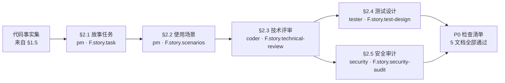

| # | 文档 | Agent | 公式 | 反推策略 | 关键约束 |
|---|------|-------|------|---------|---------|
| §2.1 | `故事任务.md` | pm | [F.story.task](./formulas.md#fstorytask--project-故事任务-meta--storyn) | 从代码事实集反推业务意图：接口/组件 → 用户能做什么；状态管理 → 数据流；依赖链 → 模块边界 | 语言边界：禁止代码路径/API路由/组件名/技术栈名。证据 Level B + 源码路径 |
| §2.2 | `使用场景.md` | pm | [F.story.scenarios](./formulas.md#fstoryscenarios--project-使用场景) | 从组件交互 + API 调用链反推用户旅程：正常路径 + ≥1 空状态 + ≥1 错误恢复。每场景必含 mermaid flowchart | 语言边界：禁止技术术语/组件名/API端点/文件路径。≥ 2 场景。场景覆盖矩阵对齐故事任务 FP# |
| §2.3 | `技术评审.md` | coder | [F.story.technical-review](./formulas.md#fstorytechnical-review--project-技术评审) | 源码直接映射到技术章节：接口签名→§2 API；数据模型→§3；组件定义→§4；状态管理→§4.2；安全信号→§7。**含效果示意 mermaid 图**（全链路请求流/组件交互） | 按项目类型裁剪章节（纯前端跳过 API/数据/后端性能，纯后端跳过组件/状态/交互/样式/DOM）。§0 基线溯源至少映射故事任务 FP# + 使用场景 |
| §2.4 | `测试设计.md` | tester | [F.story.test-design](./formulas.md#fstorytest-design--project-测试设计) | 基于故事任务 AC + 使用场景 + 技术评审接口/组件签名生成四类用例（正常/边界/异常/回归）。每用例 Given/When/Then 可执行 | §0 基线溯源覆盖全部 AC# 和场景。Gate A 交接信号完整（P0 用例 ID + 验证命令） |
| §2.5 | `安全审计.md` | security | [F.story.security-audit](./formulas.md#fstorysecurity-audit--project-安全审计) | 基于技术评审 §7 安全信号 + 源码安全扫描独立审计：资产识别 → STRIDE 威胁建模 → 信任边界 → 缓解措施 → 合规检查 | 独立执行，不依赖 coder 自评。STRIDE 六类全覆盖。合规 6 项全查 |

**反推证据等级**：

| 能确定的 | 不能确定的 |
|---------|-----------|
| 接口契约、组件签名、依赖关系、状态定义 → Level A（附源码路径） | 业务意图、设计决策理由、未来规划 → Level C（标注「待补充」） |
| 安全信号（用户输入点/认证链路） → Level B（附代码模式） | 性能目标、容量规划 → Level C |

**每文档生成后校验（P0 阻断）**：

| # | 检查项 | 适用文档 |
|---|--------|---------|
| 1 | `### 主要价值` 存在且 ≥ 4 条 emoji 前缀行 | 全部 5 文档 |
| 2 | F.meta 无 `{...}` 占位符 | 全部 5 文档 |
| 3 | 回溯链完整（来源引用 + 变更记录） | 全部 5 文档 |
| 4 | 故事任务 + 使用场景通过语言边界扫描（无技术术语污染） | §2.1, §2.2 |
| 5 | 技术评审含效果示意 mermaid 图 + 基线溯源表 | §2.3 |
| 6 | 测试设计 Gate A 交接信号完整 | §2.4 |
| 7 | 安全审计 STRIDE 六类全覆盖 + 独立审计标记 | §2.5 |

#### §3 项目类型裁剪

| 类型 | 故事任务 | 使用场景 | 技术评审章节 | 测试设计 | 安全审计 |
|------|---------|---------|-------------|---------|---------|
| 前端 | 全量 | 全量（侧重 UI 交互） | 跳过 §2 API / §3 数据 / §8 后端性能 | 侧重 UI 状态 + 交互用例 | 侧重输入校验 + XSS/CSRF |
| 后端 | 全量 | 全量（侧重 API 使用者旅程） | 跳过 §4 组件 / §5 交互 / §6 DOM·事件·依赖 | 侧重接口 + 数据 + 性能用例 | 侧重认证 + 注入 + 权限 |
| 全栈 | 全量 | 全量（覆盖两端用户） | 全章节，两端契约对齐 | 两端覆盖 + 集成用例 | 全威胁面 |

#### §4 约束

| 约束 | 规则 | 违反 |
|------|------|------|
| 只读 | 全程不修改源码，仅读取分析 | P0 |
| 分支隔离 | 文档写入必须在 `feat/<name>` 分支 | `no-doc-isolation` |
| 证据 Level B | 每个断言附源码路径或标注「待补充」。无来源 = C 级 | `doc-p0` |
| 冲突保护 | 目标目录已存在时拒绝覆盖 | 引导 `/rui update` |
| 反推诚实 | 能从代码确定的写 Level A/B，不能确定的标「待补充」，不编造 | `chain-broken` |
| 表达优先 | 每文档必须含 mermaid 图（效果示意/操作流/架构图至少其一），不可纯文本 | `doc-p0` |
| 逐故事串行 | 多故事时按 recommend.mjs 输出顺序串行，前故事 5 文档全部完成再进下一故事 | `chain-broken` |

**末端触发** [强制集成](#强制集成)。

## doc --from-local

> 从已有本地故事文档补全缺失文档基线。扫描 `docs/故事任务面板/<name>/` 下的已有文档，按依赖链生成缺失文档。全程只读已有，不覆盖，证据 Level A + 文档路径。
>
> **前置条件**：至少 1 份基线文档（故事任务/使用场景/技术评审之一）存在。零文档时引导 `/rui doc` 或 `--from-code`。

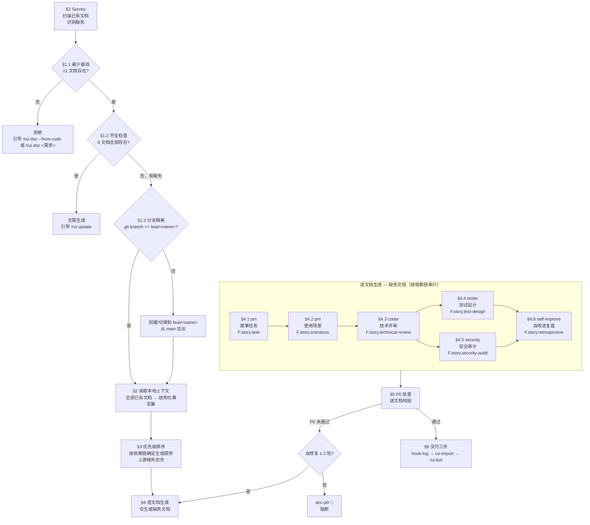

### §1 Survey — 扫描已有，识别缺失

| 步骤 | 操作 | 阻断标识 |
|------|------|---------|
| §1.0 解析 | 解析 `<name>` 为 kebab-case，目标路径 `docs/故事任务面板/<name>/` | `no-parse` |
| §1.1 存在检查 | 验证目标目录存在 | `no-story` |
| §1.2 扫描 | 列出已有 `*.md` 文件，构建已有集和缺失集 | — |
| §1.3 基线检查 | 至少 1 份基线文档（故事任务/使用场景/技术评审）存在 | `no-baseline` |
| §1.4 齐全检查 | 6 文档全在时无需生成 | `doc-full` |
| §1.5 分支隔离 | `git branch --show-current` == `feat/<name>` | `no-doc-isolation` |

| 场景 | 阻断 | 引导 |
|------|------|------|
| 目录不存在 | `no-story` | 使用 `/rui doc <需求>` 或 `/rui doc --from-code` |
| 目录空（0 文档）| `no-doc` | 同上 |
| 仅交互日志/消息通知列表 | `no-doc` | 同上 |
| 无基线文档（仅测试设计/安全审计/自改进复盘存在）| `no-baseline` | 使用 `/rui doc --from-code` — 这些文档不足以反推故事任务 |
| 6 文档全在 | `doc-full` | 使用 `/rui update <name>` |

### §2 Read — 读取本地上下文

读取目标目录全部已有文档，构建结构化事实集：

| 维度 | 来源文档 | 提取内容 |
|------|---------|---------|
| 业务基线 | 故事任务.md | Story#、FP#、AC#、SC#、风险 |
| 用户基线 | 使用场景.md | 场景、操作流、覆盖矩阵 |
| 技术设计 | 技术评审.md | 架构、API、数据模型、组件、状态 |
| 测试计划 | 测试设计.md | 测试范围、用例、Gate A 交接 |
| 安全审计 | 安全审计.md | 资产、威胁、信任边界、缓解措施 |
| 过程历史 | 交互日志.md | 执行决策、阶段耗时、阻断事件 |

### §3 Prioritize — 按依赖链排序

仅缺失文档进入生成管线，按依赖链排序：

1. **故事任务**（缺失时）— 所有文档的上游基线
2. **使用场景**（缺失时）— 依赖故事任务
3. **技术评审**（缺失时）— 依赖故事任务 + 使用场景
4. **测试设计**（缺失时）— 依赖故事任务 + 使用场景 + 技术评审（与安全审计并行）
5. **安全审计**（缺失时）— 依赖技术评审（与测试设计并行）
6. **自改进复盘**（缺失时）— 依赖全部以上文档

**上游缺失、下游存在的特殊策略**：

| 场景 | 策略 |
|------|------|
| 故事任务缺失，使用场景存在 | pm 从用户旅程反推 WHAT，可执行 |
| 故事任务+使用场景缺失，技术评审存在 | pm 从架构反推业务意图，不确定项标 Level C |
| 仅测试设计或安全审计存在 | 阻断 `no-baseline` — 业务上下文不足 |

### §4 Generate — 逐文档生成

| # | 文档 | Agent | 公式 | 反推策略 |
|---|------|-------|------|---------|
| §4.1 | 故事任务.md | pm | [F.story.task](./formulas.md#fstorytask--project-故事任务-meta--storyn) | 从下游文档反推业务意图。语言边界强制。证据 Level A + 文档路径。 |
| §4.2 | 使用场景.md | pm | [F.story.scenarios](./formulas.md#fstoryscenarios--project-使用场景) | 从 FP# 反推用户旅程。≥2 场景，每场景含 mermaid flowchart + 正常/空/错误路径。 |
| §4.3 | 技术评审.md | coder | [F.story.technical-review](./formulas.md#fstorytechnical-review--project-技术评审) | 从双基线反推架构。按项目类型裁剪章节。含基线溯源表 + 效果示意 mermaid。 |
| §4.4 | 测试设计.md | tester | [F.story.test-design](./formulas.md#fstorytest-design--project-测试设计) | 从 AC# + 场景反推用例。四类全覆盖。Gate A 交接信号完整。 |
| §4.5 | 安全审计.md | security | [F.story.security-audit](./formulas.md#fstorysecurity-audit--project-安全审计) | 从技术评审独立审计。STRIDE 六类全覆盖。不依赖 coder 自评。 |
| §4.6 | 自改进复盘.md | self-improve | [F.story.retrospective](./formulas.md#fstoryretrospective--project-自改进复盘) | 从全部已有+已生成文档 + 交互日志提取观察与诊断。执行层数据标 Level C。 |

### 范围边界

**范围内（6 文档，可从本地文档上下文生成）**：

| 文件 | 阶段 | Agent |
|------|------|-------|
| 故事任务.md | 文档生成 | pm |
| 使用场景.md | 文档生成 | pm |
| 技术评审.md | 文档生成 | coder |
| 测试设计.md | 文档生成 | tester |
| 安全审计.md | 文档生成 | security |
| 自改进复盘.md | 自改进 | self-improve |

**范围外（4 文档，需代码执行或自动生成）**：

| 文件 | 排除原因 | 替代方案 |
|------|---------|---------|
| 实施报告.md | 需代码执行（截图、curl 命令、模块 P0 审查数据）| `/rui code <name>` |
| 测试报告.md | 需测试执行（通过/失败计数、环境快照）| `/rui code <name>` |
| 消息通知列表.md | rui-bot 自动追加 | 自动 |
| 交互日志.md | rui 管线自动维护 | 自动 |

### §5 约束

| 约束 | 规则 | 违反 |
|------|------|------|
| 只读已有 | 已有文档不改一字，git diff 仅新文件 | P0 |
| 不覆盖 | 缺失文档才生成，已有跳过 | P0 |
| 分支隔离 | 文档写入必须在 `feat/<name>` 分支 | `no-doc-isolation` |
| 反推诚实 | 能从文档确定的写 Level A/B，不能确定的标「待补充」| `chain-broken` |
| 项目范围 | 仅生成本项目文档，禁止跨项目内容 | `doc-p0` |
| 表达优先 | 每文档含 mermaid 图，不可纯文本 | `doc-p0` |
| 逐文档串行 | 按依赖链顺序，前文档完成再进下一文档 | `chain-broken` |
| P0 自修复 | 每文档 ≤2 轮自修复，超时阻断 | `doc-p0` |

**末端触发** [强制集成](#强制集成)。

## 推荐

只读，不触发 rui-import / rui-bot。

- **§0 面板同步** — 推荐前先同步远端 + 扫描本地故事任务面板内容，检测冲突
- **L-1 基建优先** — 错误码、状态管理、日志规范、配置管理等 7 项基建任一缺位时，优先推荐基建补齐任务
- **6 层评分** — L-1 基建 / L0 时间 / L1 依赖 / L2 风险 / L3 覆盖 / L4 质量，加权排序
- **冲突避免** — 候选与已有故事 FP# 重叠 ≥ 70% 时跳过推荐；50–69% 标注警告

> 进度全景查询（list）已迁移至 `/rui-story list`，详见 [rui-story SKILL.md](../rui-story/SKILL.md)。
> 评分框架详见 [ranking.md](./ranking.md)。

## 强制集成

> rui-import + rui-bot 三步收口。每次写入命令末端必须按序触发。

### 触发时机

**触发**：`init` / `doc` / `code` / `需求` / `update` / `code --from-doc` / `doc --from-code` / `doc --from-local`  
**不触发**：`/rui`（推荐）

### 导入机制：逐文件即时导入 + 批量安全网

```
文档生成 → import-doc.mjs <file>（即时，不可跳过）
                  ↓
         下一文档生成 → import-doc.mjs <file>
                  ↓
               ...
                  ↓
管线完成/阻断 → 1. hook-log → 2. sync.mjs（批量安全网兜底）→ 3. rui-bot
```

> **逐文件导入**（主路径）：每个文档 Write 后**必须**执行 `node skills/rui/import-doc.mjs <file-path>`。这是硬性步骤，不可推迟。  
> **批量安全网**（兜底）：末端 `node skills/rui-import/sync.mjs` 扫描全项目，补漏任何遗漏文件。仅作兜底，不可替代逐文件导入。

### 执行顺序（不可跳序）

| # | 步骤 | 规约出处 | 标记字段 |
|---|------|---------|---------|
| 1 | hook-log | [rui-bot — hook-log](../rui-bot/SKILL.md#①-hook-log追加日志不发送) | `delivery_pipeline.log_appended` |
| 2 | `node skills/rui-import/sync.mjs`（批量安全网兜底） | [rui-import — hook 触发器](../rui-import/SKILL.md#hook-触发器) | `delivery_pipeline.docs_synced` |
| 3 | rui-bot | [rui-bot — hook-notify](../rui-bot/SKILL.md#③-hook-notify实际发送) | `delivery_pipeline.notification_sent` |

### 降级

- `no-token`：`API_X_TOKEN` 缺失时跳过推送，仍写 `delivery_pipeline` 标记
- 网络失败：告警不阻断，标记仍写

## 诊断纪律

> 结构化调试纪律。难 bug 不靠猜——靠反馈回路。

### Phase 1 — 构建反馈回路

**这就是方法本身。** 有快速、确定、可自运行的通过/失败信号，二分和假设测试才有效。

构建方式（按优先级）：
1. **失败测试** — 在触及 bug 的接缝写
2. **curl / HTTP 脚本** — 对运行中的 dev server 发请求
3. **CLI + fixture** — fixture 输入，diff stdout 与正确快照
4. **Headless 浏览器** — Playwright/Puppeteer 驱动 UI
5. **回放 trace** — 保存真实网络请求/payload 到磁盘
6. **One-off harness** — 启动系统最小子集，一个函数调用触发 bug
7. **Property / fuzz** — 1000 次随机输入找失败模式
8. **二分 harness** — 自动化「在状态 X 启动、检查」让 `git bisect run` 可用
9. **差分循环** — 同一输入 old vs new，diff 输出
10. **HITL bash 脚本** — 最后手段

**迭代回路**：更快？信号更清晰？更确定？2 秒确定回路是调试超能力。30 秒抖动回路等于没有。

**非确定 bug**：目标不是干净复现而是更高复现率。循环触发 100 次、并行化、加压力、注入 sleep。

**无回路不进入 Phase 2。**

### Phase 2–6

- **复现** — 确认失败模式是用户描述的，可多轮复现，精确症状已捕获
- **假设** — 生成 3–5 个排好序的可证伪假设。写不出预测 = 直觉——丢弃
- **Instrument** — 一次改一个变量。debugger/REPL > 目标日志 > 标签日志 > 性能分支
- **修复 + 回归** — 先写回归测试 → 看它失败 → 应用修复 → 看它通过 → 重跑 Phase 1 回路
- **清理 + 复盘** — 原始复现不再复现 · 回归测试通过 · `[DEBUG-...]` 已删除 · One-off 原型已移除

### Red Flags

以下任一出现 = 停止，回到 [铁律](../../CLAUDE.md#铁律)：
- "这个 bug 很简单，直接修就行"
- "修复超过 3 次了但这次肯定对"
- "多个修复一起上省时间"
- "不需要最小复现，我理解根源了"
- "先修 bug 再写测试"

## 架构深化

> 发现架构摩擦，把浅模块转为深模块。

- **模块** — 有接口与实现的任何东西（函数 / class / 包 / 切片）
- **接口** — 调用者需知的一切：类型、不变式、错误模式、顺序。不止类型签名
- **深度** — 接口后的行为量 / 接口复杂度。深 = 高杠杆。浅 = 接口≈实现
- **接缝** — 接口所在之处；不改原地就能改行为的地方
- **删除测试** — 想象删除它：复杂度消失 = 透传；回到 N 个调用方 = 它在赚位置

**流程**：探索（读 ADR，注意摩擦）→ 呈现候选（涉及文件 + 方案 + 收益）→ 用户选定后走设计树。

**Red Flags**："加个抽象层就行"（无第二调用方 = 浅模块）· "同时重构几个模块"（一次一个）

## 交接纪律

> 会话上下文压缩为交接文档，供 Agent 间继续。

```markdown
# Handoff: {简短描述}

## Goal
{≤ 3 句：做什么、为谁、为什么}

## Done
- [x] `path/file.ts:42` — {做了什么} ({验证结果})

## Now
{当前状态：进行中/卡住/等待}

## Key findings
- {非显而易见的约束/决定/冲突}

## Next
- [ ] {具体下一步}

## Context
- 分支: `{branch}`
- Commit: `{hash}`
- 相关文件: `path/a`, `path/b`
```

- **≤ 1 页**（约 60 行）
- **具体到文件/行号** — 不说 "改过 auth 模块"，说 "`src/auth/login.ts:42` 添加了 rate-limit 中间件"
- **不含 spec** — 描述实际状态，不是理想状态
- **可验证** — 每个声称附验证命令或文件路径

## 集成

| 类别 | 内容 |
|------|------|
| 数据契约 | `10-交互日志.md`（追加）· `.memory/rui-state.json`（覆盖写）· `.memory/execution-memory.jsonl`（追加）· `.improvement/proposals.jsonl`（追加）— 字段见 [coder.md §数据契约](./coder.md) |
| Hooks | Stop hooks 调用：hook-log → rui-import → hook-notify → delivery-gate |
| 规则 | [code-pipeline](../../rules/code-pipeline.md) · [delivery-gate](../../rules/delivery-gate.md) · [doc-generation](../../rules/doc-generation.md) · [self-improve](../../rules/self-improve.md) · [rui-claude](../../rules/rui-claude.md) |
| 角色 | [pm](../../agents/pm.md) · [coder](../../agents/coder.md) · [tester](../../agents/tester.md) · [reporter](../../agents/reporter.md) · [security](../../agents/security.md) · [self-improve](../../agents/self-improve.md) |
| 文档 | [formulas.md](./formulas.md) · [coder.md](./coder.md) · [rui-import SKILL](../rui-import/SKILL.md) · [rui-bot SKILL](../rui-bot/SKILL.md) |
| 推荐 | [ranking.md](./ranking.md) · [recommend.mjs](./recommend.mjs) |

## 集成参考

| 阶段 | 核心方法 | 谁查阅 |
|------|---------|--------|
| 需求→文档 | 故事拆分粒度 · AC 设计 · UI 交互状态覆盖（≥3 状态） | pm |
| 预检 | 工程纪律 · 测试先行门禁 · 上下文质量优先 | tester · coder |
| 实现 | 深模块设计 · 多 Agent 协作 · 研究优先开发 · 纵深防御 | coder · security |
| 验证 | 执行记忆沉淀 · 基准评估 · 验证门禁五步法 | tester · reporter |
| 自改进 | 记忆压缩注入 · 经验技能化 · 跨会话相似检索 | self-improve |
| 交付 | 技术趋势验证 · 架构健康度 · 新兴工具发现 | reporter |
