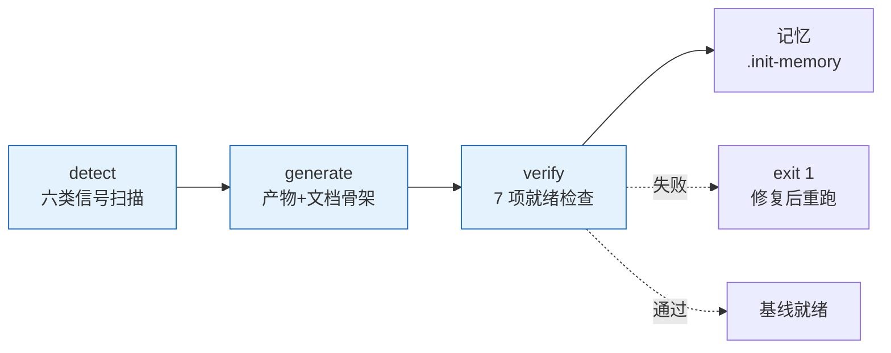

# rui

> 故事驱动 SDLC 编排器。每条命令最终落到「故事任务面板」目录，每个故事独立串行走完管线。

**口诀**：拆故事 → 文档基线 → 测试先行 → 实现 → 验证 → 复盘 → 交付。

哲学源自 [CLAUDE.md](../../CLAUDE.md)。本文件只定义命令面与编排骨架，细节分散在：[rules/](../../rules/) 跨场景约束 · [agents/](../../agents/) 角色契约 · [formulas.md](./formulas.md) 故事文档公式 · [coder.md](./coder.md) 目录与生命周期 + 参考文档公式 + 数据契约。

## 命令面

| 命令 | 用途 | 关键行为 |
|------|------|---------|
| `/rui init [--force\|--dry-run]` | 建立项目基线 | detect → materialize → verify；项目信息写入 `CLAUDE.md` 项目约束章节；就绪检查 |
| `/rui doc <req>` | 拆需求为故事 + 生成文档基线（故事任务 → 评审三件） | 必须分支隔离；禁止改源码；多故事逐个串行 |
| `/rui code <name>` | 实现故事 + 生成验证报告（实施 / 测试 / 自改进复盘） | Gate A 测试先行；Gate B 验证闭合 |
| `/rui <req>` | 端到端 | doc + code 全自动串联 |
| `/rui update <name-or-path> [ctx] [--no-code]` | 增量更新 | T1/T2/T3 裁剪；`--no-code` 仅文档 |
| `/rui code --from-doc <name>` | 从文档反推 | 只读源码补全缺失文档；不覆盖已有 |
| `/rui doc --from-code [req]` | 从源码反推 | req 空时 pm 自主探索（前端/后端/全栈） |
| `/rui list` | 进度全景 | 按文件存在性判定状态 |
| `/rui` | 任务推荐 | 5 层链式管线评分排序 |

`<req>` 支持文本 / `@` 引用本地文件 / URL。CLI `--name` 用 `<Project>-<name>` 格式（如 `YiWeb-user-login`），脚本内分解为路径 `<Project>/<name>`。

## 管线一览

| 阶段细则 | 出处 |
|---------|------|
| 影响分析 / 证据等级 | [agents/AGENT.md](../../agents/AGENT.md) |
| 分支隔离 / Gate A/B / P0 审查 | [rules/code-pipeline.md](../../rules/code-pipeline.md) |
| 三步交付管线 / 文档同步 | [rules/delivery-gate.md](../../rules/delivery-gate.md) |
| 诊断 D0–D7 / 评估 E1–E4 | [rules/self-improve.md](../../rules/self-improve.md) |
| 文档生成强制约束 | [rules/doc-generation.md](../../rules/doc-generation.md) |
| Agent 交接契约 | [agents/](../../agents/) 各角色文件 |

## 阻断标识

| 标识 | 触发 | 阶段 | 降级 |
|------|------|------|------|
| `no-parse` | 需求无法解析 | 需求解析 | 否 |
| `no-source` | P0 章节缺上游来源 | 文档生成 / 预检 | 否 |
| `chain-broken` | 影响链未闭合 | 影响分析 / 预检 | 否 |
| `doc-p0` | 文档 P0 不通过且无法自修复 | 文档生成 | 否 |
| `code-p0` | 代码 P0 无法修复 | 实现 | 否 |
| `skip-gate-a` | Gate A 未通过即编码 | 测试先行→实现 | 否 |
| `gate-b-limit` | Gate B >2 轮 | 验证 | 否 |
| `bad-branch` | 分支未从 main 创建或混入非本故事代码 | 预检 | 否 |
| `no-checkout` | 未切换故事分支即改源码 | 预检→实现 | 否 |
| `auto-merge` | 功能分支被自动合并到 main | 预检→交付 | 否 |
| `no-token` | `API_X_TOKEN` 缺失 | 交付 | 是 |
| `no-metrics` | self-improve 数据采集失败 | 自改进 | 是 |

阻断后：`node ~/.claude/plugins/marketplaces/yry/skills/rui/scripts/rui-state.js save --blocked` → 持久化 → 通知（`no-token` / `no-metrics` 跳过）。重跑同命令从 `current_stage` 续。

## 核心约束

1. **逐故事串行** — 多故事按拆分顺序处理，互不交叉
2. **分支隔离** — `feat/<project>-<name>` 从 main/master 创建；不可派生、不可自动合并
3. **源码改动唯一入口** — 只能走 `/rui code` 管线（`no-checkout`）
4. **测试先行** — Gate A 阻断实现；Gate B >2 轮阻断交付
5. **逐模块审查** — 每模块后审查，P0 清零再前进
6. **只读反推** — `--from-code` / `--from-doc` 禁止改源码
7. **产出内聚** — 关键产出限定在故事目录或对应参考文档目录
8. **交付强制** — 三步管线按序标记（`delivery-gate.js mark`），Stop hook 检查未闭合即阻断
9. **公式驱动** — 文档由 [formulas.md](./formulas.md) 规约，不再依赖模板目录
10. **知识沉淀** — 写入 `.memory/execution-memory.jsonl` + `.memory/rui-state.json`；提案写入 `.improvement/proposals.jsonl`

## init 简述

> **口诀：探—生—验。** 三步：探（扫描项目六类信号）→ 生（按项目情况生成/裁剪全部产物 + 核心文档骨架）→ 验（7 项就绪检查含耦合一致性 + 文档目录）。
>
> **核心设计**：所有产物（CLAUDE.md / README.md / agents / rules / formulas / coder 手册 / 文档目录骨架）均由 init 根据项目实际情况生成和裁剪。可重复运行，每次根据最新项目情况更新全部内容。

### 1. detect — 扫描项目（事实层）

六类信号汇聚为内存 profile 对象，驱动所有产物生成：

| 信号 | 来源 | 用途 |
|------|------|------|
| 项目身份 | 仓库目录名 | 分支前缀 / 文档路径锚点 |
| 项目类型 | `constants.detectProjectType` | frontend/backend/fullstack/meta/unknown → 决定裁剪策略 |
| 项目清单 | 按生态文件抽取 | 依赖 + 构建/测试命令 + 框架版本 |
| 安全面 | 源码关键词扫描 | 用户输入/API/存储/认证/第三方 → 裁剪 security agent |
| 测试框架 | 依赖 + 配置文件 | vitest/jest/pytest/go-test/cargo-test → 裁剪 tester |
| CI 配置 | 工作流文件 | github-actions/gitlab-ci/jenkins → 裁剪 delivery-gate |
| 架构模式 | 项目结构 | single/monorepo/microservice/plugin → 裁剪底线约束 |

### 2. generate — 按项目情况生成/裁剪（生成层）

**每次运行全量重生**（非复制，是按 profile 生成）。所有产物高度耦合项目实际情况。

| 产物 | 裁剪依据 | 项目耦合点 |
|------|---------|-----------|
| `CLAUDE.md` | 全部信号 | 项目约束表 + 不可妥协底线（按安全面/架构生成） |
| `README.md` | 全部信号 | 项目画像 + 能力描述 + 结构表 |
| `.claude/agents/*.md` | 项目类型 + 安全面 | 项目名/公式/命令/安全面写入每个 agent |
| `.claude/rules/*.md` | 项目类型 | Gate/管线/文档类型按项目裁剪 |
| `.claude/formulas.md` | 项目类型 | 跳过不适用的文件公式（前端跳 02/05，后端跳 03/06） |
| `.claude/coder.md` | 项目类型 | 目录结构/骨架/公式按项目裁剪 |
| `.claude/settings.json` | 生态 | 权限按生态配置 |
| `docs/` 文档目录 | 项目类型 + 源码扫描 | 按类型创建目录 + 扫描源码生成骨架索引 |

#### 文档目录生成规则

按项目类型自动创建对应的文档目录，并扫描源码发现核心模块生成初始骨架：

| 项目类型 | 文档目录 | 扫描目标 |
|---------|---------|---------|
| 前端 | 故事任务面板 + 组件文档 + 页面文档 | src/components · src/pages · src/views |
| 后端 | 故事任务面板 + 接口文档 + 领域模型 | 路由/控制器 · src/domain · src/models · src/services |
| 全栈 | 全部五类 | 前端 + 后端扫描目标 |
| 元项目 | 故事任务面板 + 接口文档 + 领域模型 | skills/ · agents/ · rules/ · scripts/ |

骨架生成原则：
- 只为有实际源码支撑的模块生成（Level A 证据）
- 每个发现的模块生成 `00-索引.md`（导航入口）
- 索引文件已存在不覆盖（保护手动编辑）
- 每类最多 10 个骨架（避免噪音）

### 3. verify — 7 项就绪检查（验证层）

任一失败 `exit 1`：

| # | 检查项 | 通过条件 |
|---|--------|--------|
| 1 | `CLAUDE.md` | 三公理 + 退化对策 + 项目约束（含项目名） |
| 2 | `README.md` | 系统能力 + 项目结构 + 快速开始 + 项目画像 |
| 3 | `.claude/agents/` | 7 个 Agent 文件合法 + 含项目上下文 |
| 4 | `.claude/rules/` | 5 个规则文件齐备 + 含项目名 |
| 5 | `.claude/` 配置层 | formulas + coder + settings |
| 6 | 项目耦合一致性 | 所有产物与 CLAUDE.md 项目约束一致 |
| 7 | `docs/` 文档目录 | 按项目类型应有的文档目录全部存在 |

### 4. 选项

| 选项 | 行为 |
|------|------|
| `--dry-run` | 仅扫描+报告，不写文件；动作以 `◇` 前缀标识 |
| `--force` | 保留兼容（默认已全量重生） |
| `--json` | 机器可读输出（`{ profile, generate, verify, dry_run }`） |

### 5. 产物

| 路径 | 用途 | 重复运行 |
|------|------|---------|
| `CLAUDE.md` | 哲学基础 + 项目约束 | 全量重生 |
| `README.md` | 系统视图 + 项目画像 | 全量重生 |
| `.claude/agents/*.md` | 7 个角色（按项目裁剪） | 全量重生 |
| `.claude/rules/*.md` | 5 个规则（按项目裁剪） | 全量重生 |
| `.claude/formulas.md` | 故事文档公式（按项目裁剪） | 全量重生 |
| `.claude/coder.md` | coder 工作手册（按项目裁剪） | 全量重生 |
| `.claude/settings.json` | 项目权限（按生态配置） | 全量重生 |
| `.claude/settings.local.json` | 本地覆盖（首次空模板） | 不覆盖 |
| `docs/故事任务面板/.init-memory.json` | 执行记录 | 每次覆盖 |
| `docs/{文档类}/{project}/{name}/00-索引.md` | 文档骨架索引 | 首次创建，不覆盖 |

## 集成

| 类别 | 内容 |
|------|------|
| 脚本 | `~/.claude/plugins/marketplaces/yry/skills/rui/scripts/`：init · list · recommend · rui-state · execution-memory · self-improve · delivery-gate · loop · natural-week · constants |
| Hooks | `settings.json` Stop hooks：hook-log（追加日志）→ hook-sync（文档同步）→ hook-notify（企微通知）→ delivery-gate check-all（闭合检查） |
| 规则 | [code-pipeline](../../rules/code-pipeline.md) · [delivery-gate](../../rules/delivery-gate.md) · [doc-generation](../../rules/doc-generation.md) · [self-improve](../../rules/self-improve.md) · [rui-claude](../../rules/rui-claude.md) |
| 角色 | [pm](../../agents/pm.md) · [coder](../../agents/coder.md) · [tester](../../agents/tester.md) · [reporter](../../agents/reporter.md) · [security](../../agents/security.md) · [self-improve](../../agents/self-improve.md) |
| 文档 | [formulas.md](./formulas.md) — 故事文档公式（F.story.\* + F.supp.\*） · [coder.md](./coder.md) — 目录生命周期 + 参考文档公式（F.ref.\*） + 数据契约（`.memory/` + `.improvement/`） |
