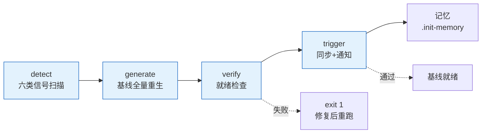

# rui

> 故事驱动 SDLC 编排器。每条命令最终落到「故事任务面板」目录，每个故事独立串行走完管线。

**口诀**：拆故事 → 文档基线 → 测试先行 → 实现 → 验证 → 复盘 → 交付。

哲学源自 [CLAUDE.md](../../CLAUDE.md)。本文件只定义命令面与编排骨架，细节分散在：[rules/](../../rules/) 跨场景约束 · [agents/](../../agents/) 角色契约 · [formulas.md](./formulas.md) 故事文档公式 · [coder.md](./coder.md) 目录与生命周期 + 参考文档公式 + 数据契约。

## 命令面

| 命令 | 用途 | 关键行为 |
|------|------|---------|
| `/rui init [--dry-run]` | 建立项目基线 | detect → generate → verify；项目信息写入 `CLAUDE.md` 项目约束章节；就绪检查 |
| `/rui doc <req>` | 拆需求为故事 + 生成文档基线（01-故事任务 → 02/03/04-评审） | 必须分支隔离；禁止改源码；多故事逐个串行 |
| `/rui code <name>` | 实现故事 + 生成验证报告（05/06-实施 / 07-测试 / 08-自改进复盘） | Gate A 测试先行；Gate B 验证闭合 |
| `/rui <req>` | 端到端 | doc + code 全自动串联 |
| `/rui update <name-or-path> [ctx] [--no-code]` | 增量更新 | T1/T2/T3 裁剪；`--no-code` 仅文档 |
| `/rui code --from-doc <name>` | 从文档反推 | 只读源码补全缺失文档；不覆盖已有 |
| `/rui doc --from-code [req]` | 从源码反推 | req 空时 pm 自主探索（前端/后端/全栈） |
| `/rui list` | 进度全景 | 按文件存在性判定状态 |
| `/rui` | 任务推荐 | 5 层链式管线评分排序 |

`<req>` 支持文本 / `@` 引用本地文件 / URL。CLI `--name` 用 `<Project>-<name>` 格式（如 `YiWeb-user-login`），脚本内分解为路径 `<Project>/<name>`。

## 管线一览


| 阶段细则 | 出处 |
|---------|------|
| 影响分析 / 证据等级 | [agents/AGENT.md](../../agents/AGENT.md) |
| 分支隔离 / Gate A/B / P0 审查 | [rules/code-pipeline.md](../../rules/code-pipeline.md) |
| 三步交付管线 / 文档同步 | [rules/delivery-gate.md](../../rules/delivery-gate.md) |
| 诊断 D0–D7 / 评估 E1–E4 | [rules/self-improve.md](../../rules/self-improve.md) |
| 文档生成强制约束 | [rules/doc-generation.md](../../rules/doc-generation.md) |
| Agent 交接契约 | [agents/](../../agents/) 各角色文件 |

## 阻断标识

| 标识 | 触发 | 阶段 | 降级 |
|------|------|------|------|
| `no-parse` | 需求无法解析 | 需求解析 | 否 |
| `no-source` | P0 章节缺上游来源 | 文档生成 / 预检 | 否 |
| `chain-broken` | 影响链未闭合 | 影响分析 / 预检 | 否 |
| `doc-p0` | 文档 P0 不通过且无法自修复 | 文档生成 | 否 |
| `code-p0` | 代码 P0 无法修复 | 实现 | 否 |
| `skip-gate-a` | Gate A 未通过即编码 | 测试先行→实现 | 否 |
| `gate-b-limit` | Gate B >2 轮 | 验证 | 否 |
| `bad-branch` | 分支未从 main 创建或混入非本故事代码 | 预检 | 否 |
| `no-checkout` | 未切换故事分支即改源码 | 预检→实现 | 否 |
| `auto-merge` | 功能分支被自动合并到 main | 预检→交付 | 否 |
| `no-token` | `API_X_TOKEN` 缺失 | 交付 | 是 |
| `no-metrics` | self-improve 数据采集失败 | 自改进 | 是 |

阻断后：`node skills/rui/scripts/rui-state.js save --blocked` → 持久化 → 通知（`no-token` / `no-metrics` 跳过）。重跑同命令从 `current_stage` 续。

## 核心约束

1. **逐故事串行** — 多故事按拆分顺序处理，互不交叉
2. **分支隔离** — `feat/<project>-<name>` 从 main 创建；不可派生、不可自动合并
3. **源码改动唯一入口** — 只能走 `/rui code` 管线（`no-checkout`）
4. **测试先行** — Gate A 阻断实现；Gate B >2 轮阻断交付
5. **逐模块审查** — 每模块后审查，P0 清零再前进
6. **只读反推** — `--from-code` / `--from-doc` 禁止改源码
7. **产出内聚** — 关键产出限定在故事目录 `docs/故事任务面板/<Project>/<name>/`
8. **交付强制** — 三步管线按序标记（`delivery-gate.js mark`），Stop hook 检查未闭合即阻断
9. **公式驱动** — 文档由 [formulas.md](./formulas.md) 规约，文件名带编号前缀（00–08）
10. **知识沉淀** — 写入 `.memory/execution-memory.jsonl` + `.memory/rui-state.json`；提案写入 `.improvement/proposals.jsonl`
11. **同步通知必触发** — 每次 rui 命令（除 list/推荐）末端必须触发 import-docs 文档同步 + wework-bot 通知，未触发 = 管线未闭合

### 故事目录文件编号速查

| 编号 | 文件 | 阶段 | 必选 |
|------|------|------|:---:|
| 00 | 消息通知列表.md | 交付 | 自动 |
| 01 | 故事任务.md | 文档生成 | ✓ |
| 02 | 后端技术评审.md | 文档生成 | 后端/全栈 |
| 03 | 前端技术评审.md | 文档生成 | 前端/全栈 |
| 04 | 测试用例评审.md | 文档生成 | ✓ |
| 05 | 后端实施报告.md | 验证 | 后端/全栈 |
| 06 | 前端实施报告.md | 验证 | 前端/全栈 |
| 07 | 测试用例报告.md | 验证 | ✓ |
| 08 | 自改进复盘.md | 自改进 | ✓ |

## init 简述

> **口诀：探—生—验—触。** 四步：探（扫描项目六类信号）→ 生（按 profile 生成 CLAUDE.md / README.md / 故事骨架文档）→ 验（就绪检查）→ 触（import-docs 同步 + wework-bot 通知）。
>
> **核心设计**：init 负责项目基线（CLAUDE.md 项目约束 · README.md · docs/故事任务面板/ 目录 + 骨架文档），可重复运行，每次全量重生。完成后主动触发文档同步和通知。



### 1. detect — 扫描项目（事实层）

六类信号汇聚为内存 profile 对象，驱动产物生成：

| 信号 | 来源 | 用途 |
|------|------|------|
| 项目身份 | 仓库目录名 | 分支前缀 / 文档路径锚点 |
| 项目类型 | `constants.detectProjectType` | frontend/backend/fullstack/meta/unknown → 决定故事骨架裁剪 |
| 项目清单 | 按生态文件抽取 | 依赖 + 构建/测试命令 + 框架版本 |
| 安全面 | 源码关键词扫描 | 用户输入/API/存储/认证/第三方 |
| 测试框架 | 依赖 + 配置文件 | vitest/jest/pytest/go-test/cargo-test |
| CI 配置 | 工作流文件 | github-actions/gitlab-ci/jenkins |
| 架构模式 | 项目结构 | single/monorepo/microservice/plugin |

### 2. generate — 全量重生（生成层）

**每次运行全量重生**（非复制，是按 profile 生成）。产物高度耦合项目实际情况。

| 产物 | 裁剪依据 | 项目耦合点 |
|------|---------|-----------|
| `CLAUDE.md` | 安全面 + 类型 | 项目约束段（`rui:project-start/end` 标记内替换） |
| `README.md` | 全部信号 | 项目画像 + 故事目录骨架（按项目类型裁剪） + 结构表 |
| `docs/故事任务面板/<project>/.skeleton/` | 项目类型 | 按类型裁剪的全套骨架文档（01-08 + 00） |

### 3. verify — 4 项就绪检查（验证层）

任一失败 `exit 1`：

| # | 检查项 | 通过条件 |
|---|--------|--------|
| 1 | `CLAUDE.md` | 含 `rui:project-start` 标记 + 项目名 |
| 2 | `README.md` | 含项目名 |
| 3 | 故事面板 | `docs/故事任务面板/` 目录存在 |
| 4 | 骨架文档 | `.skeleton/` 下文件数 ≥ 必选文件数 |

### 4. trigger — 主动触发（集成层）

验证通过后主动触发：

| 触发 | 条件 | 降级 |
|------|------|------|
| `import-docs --workspace` | `API_X_TOKEN` 存在 | 缺 token 跳过，网络失败告警不阻断 |
| `wework-bot --agent rui` | `API_X_TOKEN` + `WEWORK_BOT_WEBHOOK_URL` 存在 | 缺凭据跳过 |

### 5. 选项

| 选项 | 行为 |
|------|------|
| `--dry-run` | 仅扫描+报告，不写文件，不触发同步/通知；动作以 `◇` 前缀标识 |
| `--json` | 机器可读输出（`{ profile, generate, verify, dry_run }`） |

### 6. 产物

| 路径 | 用途 | 重复运行 |
|------|------|---------|
| `CLAUDE.md` | 项目约束（`rui:project-start/end` 段） | 段内全量替换 |
| `README.md` | 系统视图 + 项目画像 | 全量重生 |
| `docs/故事任务面板/<project>/.skeleton/*.md` | 故事骨架模板 | 全量重生 |
| `docs/故事任务面板/.init-memory.json` | 执行记录 | 每次覆盖 |

## 强制集成：import-docs + wework-bot

> **口诀：用 rui 必触发，无例外。**

**每次** `/rui` 命令执行（含 `doc` / `code` / `update` / `init` / 端到端），管线末端 **必须** 触发 import-docs 和 wework-bot。这不是可选步骤，是管线完整性的一部分。

### 触发时机

| rui 命令 | import-docs | wework-bot | 备注 |
|----------|:-----------:|:----------:|------|
| `/rui init` | ✓ | ✓ | verify 通过后立即触发 |
| `/rui doc <req>` | ✓ | ✓ | 文档生成完成后 |
| `/rui code <name>` | ✓ | ✓ | Gate B 通过后 |
| `/rui <req>` | ✓ | ✓ | 端到端末端 |
| `/rui update` | ✓ | ✓ | 更新完成后 |
| `/rui code --from-doc` | ✓ | ✓ | 反推完成后 |
| `/rui doc --from-code` | ✓ | ✓ | 反推完成后 |
| `/rui list` | ✗ | ✗ | 只读，不触发 |
| `/rui`（推荐） | ✗ | ✗ | 只读，不触发 |

### 触发顺序（不可跳序）

```
管线完成 → 1. hook-log（追加日志）→ 2. import-docs（文档同步）→ 3. wework-bot（发送通知）→ delivery-gate mark
```

### 阻断条件

- 未触发 import-docs 或 wework-bot → 管线视为 **未闭合**，delivery-gate 阻断
- `no-token` 降级：仅 `API_X_TOKEN` 缺失时跳过实际推送，但仍需调用脚本并标记
- 网络失败：记录告警不阻断，标记仍写

### 执行方式

```bash
# 1. 追加日志
node skills/wework-bot/scripts/hook-log.js

# 2. 文档同步（必须）
node skills/import-docs/scripts/hook-sync.js

# 3. 发送通知（必须）
node skills/wework-bot/scripts/hook-notify.js

# 4. 闭合检查
node skills/rui/scripts/delivery-gate.js check-all --json --recent-hours 1
```

**违反此规则等同于管线未完成。**

## 集成

| 类别 | 内容 |
|------|------|
| 脚本 | `skills/rui/scripts/`：init · list · recommend · rui-state · execution-memory · self-improve · delivery-gate · loop · natural-week · constants |
| Hooks | `settings.json` Stop hooks：hook-log（追加日志）→ hook-sync（文档同步）→ hook-notify（企微通知）→ delivery-gate check-all（闭合检查） |
| 规则 | [code-pipeline](../../rules/code-pipeline.md) · [delivery-gate](../../rules/delivery-gate.md) · [doc-generation](../../rules/doc-generation.md) · [self-improve](../../rules/self-improve.md) · [rui-claude](../../rules/rui-claude.md) |
| 角色 | [pm](../../agents/pm.md) · [coder](../../agents/coder.md) · [tester](../../agents/tester.md) · [reporter](../../agents/reporter.md) · [security](../../agents/security.md) · [self-improve](../../agents/self-improve.md) |
| 文档 | [formulas.md](./formulas.md) — 故事文档公式（F.story.\* + F.supp.\*） · [coder.md](./coder.md) — 目录生命周期 + 参考文档公式（F.ref.\*） + 数据契约（`.memory/` + `.improvement/`） |
