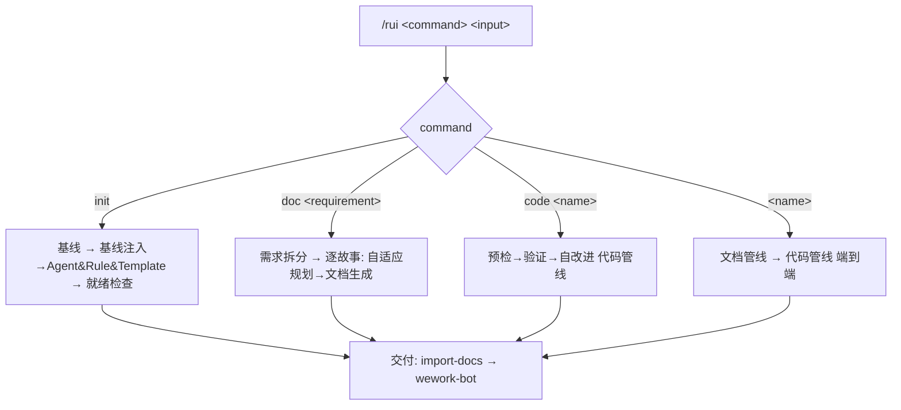
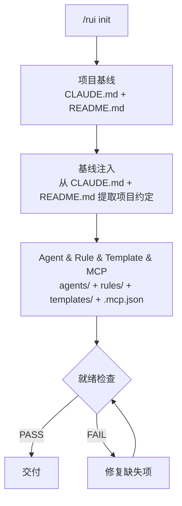
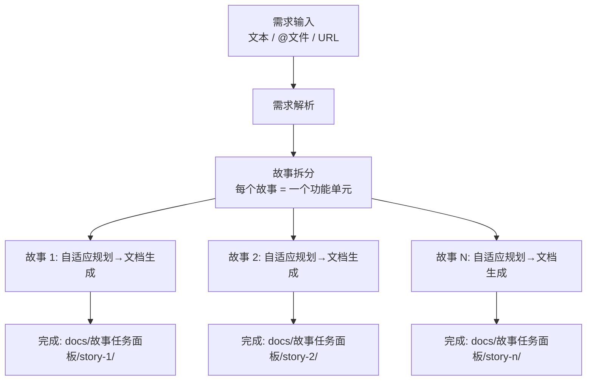
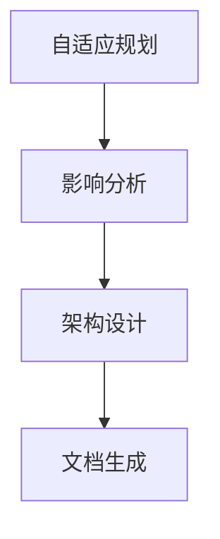
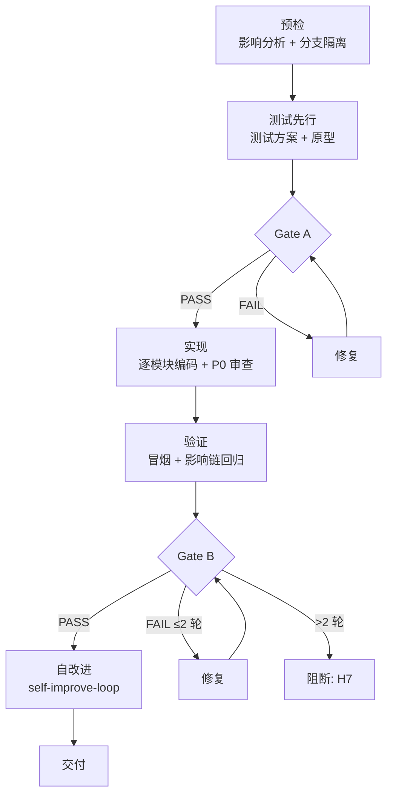
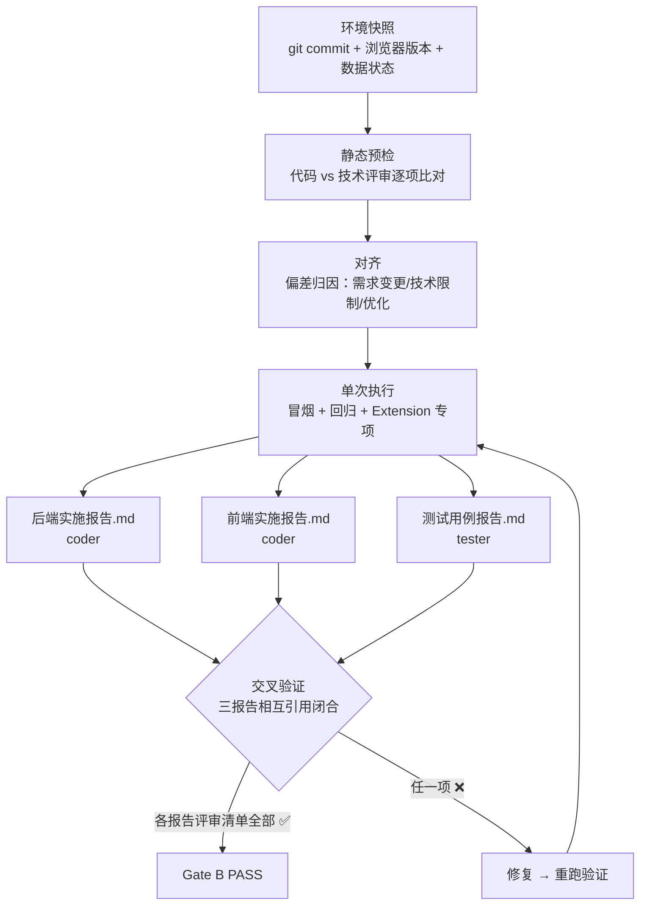
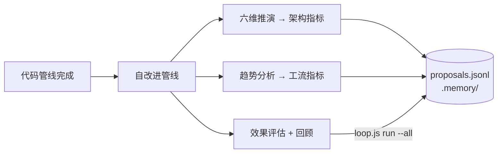

# rui

故事驱动 SDLC 编排器。每次调用仅操作一个故事，禁止批量操作多个故事，确保生成的故事最小可用。



---

## 命令概览

| 命令 | 流程 |
|------|------|
| `/rui init` | 基线 → 基线注入→Agent&Rule&Template → 就绪检查 → 交付（不生成故事，仅建立项目骨架） |
| `/rui doc <requirement>` | 需求拆分 → 逐故事: 自适应规划→影响分析→架构设计→文档生成 → 交付 |
| `/rui code <name>` | 预检→验证 → 自改进 → 交付（需已存在 `docs/故事任务面板/<name>/故事任务.md`） |
| `/rui <name>` | 自适应规划→策展 → 预检→验证 → 自改进 → 交付 |

`<requirement>` 可以是：
- 需求描述文本（如 `用户登录功能，支持密码和OAuth`）
- `@` 引用的本地文件路径（如 `@docs/req/login.md`）
- 需求文档 URL（如 `https://example.com/req.md`）

rui 自动将需求拆分为多个故事，每个故事独立创建目录。故事目录名使用**方便建立 git 分支命名的英文简洁描述**（如 `user-login`、`oauth-bindding`、`sms-verify`）。

---

## 核心规则

0. **逐故事操作**: 需求拆分可创建多个故事目录，但每个故事独立走完文档管线后再处理下一个，确保每个故事独立、最小可用、可测试、可交付
1. **增量更新**: 已有文档按 T1/T2/T3 裁剪
2. **测试先行**: Gate A 阻断实现；Gate B >2 轮修复阻断交付
3. **逐模块审查**: 实现阶段每模块后审查，P0 清零前进
4. **双边影响**: 预检阶段同时分析代码和文档影响
5. **分支隔离**: 预检阶段从 main 拉取 feat/<name> 分支
6. **知识沉淀**: 策展阶段写执行记忆 + rui-state.json
7. **交付必触发**: import-docs → wework-bot
8. **产出内聚**: 关键产出只允许是对应故事目录（`docs/故事任务面板/<name>/`）下的文件内容，不得在故事目录外生成文档、报告或其他产出物

---

**项目基线：** 生成 `CLAUDE.md` + `README.md`（双文件 × N 子项目）。

---

## /rui init

建立项目基线，不逐故事生成。每个故事通过 `/rui <name>` 单独操作。



| 阶段 | 做什么 | 关键产出 |
|------|--------|---------|
| 项目基线 | 生成 CLAUDE.md + README.md<br>pm, coder | CLAUDE.md、README.md |
| 基线注入 | 从 CLAUDE.md + README.md 提取项目约定，注入下游生成<br>pm | 项目约定摘要（技术栈、编码规范、禁止事项、目录结构、关键文件） |
| Agent & Rule & Template & MCP | 基于项目约定生成/更新 agents/、rules/、templates/、.mcp.json<br>pm | AGENT.md、pm.md/coder.md/tester.md/security.md/reporter.md（含项目特定规则）、rules/（code-pipeline.md、doc-generation.md、gate-rules.md、self-improve.md）、templates/（故事任务模板.md、后端技术评审模板.md、前端技术评审模板.md、测试用例评审模板.md、后端实施报告模板.md、前端实施报告模板.md、测试用例报告模板.md、自改进复盘模板.md）、.mcp.json |
| 就绪检查 | 8 项检查，失败则修复重检<br>tester, reporter, security | 8 项检查全部通过 |
| 交付 | import-docs → wework-bot | — |

### 基线注入

从项目基线 CLAUDE.md + README.md 提取以下项目约定，作为 Agent、Rule、Template、MCP 生成的输入：

| 提取项 | 来源 | 注入目标 |
|--------|------|---------|
| 技术栈与版本 | README.md 技术栈表 | coder.md（技术约束）、security.md（第三方审查范围） |
| 编码规范 | CLAUDE.md 编码规范 | coder.md（实现规则）、tester.md（测试规范） |
| 禁止事项 | CLAUDE.md 禁止事项 | rules/code-pipeline.md（硬性约束）、coder.md（审查标准） |
| 目录结构 | CLAUDE.md + README.md | rules/ 的 paths 声明、AGENT.md 影响分析范围 |
| 关键文件 | CLAUDE.md 关键文件 | coder.md（入口文件感知）、security.md（安全边界） |
| 构建与运行 | README.md 快速开始 | coder.md（开发流程）、tester.md（测试环境） |
| 核心架构 | README.md 核心架构 | coder.md（架构模式约束）、tester.md（测试隔离策略） |

**注入原则**：项目约定只在对应 agent/rule 中出现一次，不重复 CLAUDE.md 原文，而是转化为可执行规则。例如 CLAUDE.md 说"禁止在 content script 中使用 ES modules"，coder.md 写为"所有 content script 必须使用 IIFE + script 标签加载，禁止 import/export 语法"。

### 就绪检查

| # | 检查项 | 验证 |
|---|-------|------|
| 1 | docs/故事任务面板/ 目录存在 | `test -d` |
| 2 | 项目 CLAUDE.md 存在且非空 | `wc -l` |
| 3 | 项目 README.md 存在且非空 | `wc -l` |
| 4 | .claude/agents/AGENT.md 存在且非空 | `wc -l` |
| 5 | 基线 agent（pm/coder/tester/security/reporter）.md 全部存在 | `test -f` |
| 6 | .mcp.json 存在且为有效 JSON | `node -e` |
| 7 | .claude/rules/ 目录存在且含至少一条规则 | `ls` |
| 8 | .claude/skills/rui/templates/ 目录存在且含至少一个模板 | `ls` |

完成 init 后，使用 `/rui doc <requirement>` 拆分需求为故事，再逐个故事执行 `/rui code <name>` 或 `/rui <name>`。

---

## /rui doc \<requirement\>

从需求描述/文档拆分故事，逐故事执行自适应规划→影响分析→架构设计→文档生成 → 交付。不执行策展和项目基线。

### 需求输入

`<requirement>` 支持三种格式：
- **文本描述**: 直接输入需求文字，rui 分析并拆分为故事
- **@文件引用**: 使用 `@path/to/file.md` 引用本地需求文档
- **URL**: 提供需求文档的在线地址，rui 抓取后分析

### 故事拆分规则

1. 分析需求，识别独立功能单元
2. 每个功能单元对应一个故事目录
3. 故事目录名使用**英文简洁描述**，便于 git 分支命名（如 `user-login`、`chat-export`、`screenshot-capture`）
4. 拆分后逐故事走完文档管线，不并行



每个故事内部流程：



| 阶段 | 做什么 | 关键产出 |
|------|--------|---------|
| 需求解析 | 读取需求输入（文本/@文件/URL），提取功能需求<br>pm | 需求摘要 |
| 故事拆分 | 将需求拆分为独立功能单元，每个单元创建故事目录（英文简洁命名）<br>pm | 故事目录列表 `docs/故事任务面板/<story-name>/` |
| 自适应规划 | 读取执行记忆，判定 T1/T2/T3 变更级别<br>pm | rui-state.json |
| 影响分析 | 单个故事全项目影响链分析，闭合所有依赖<br>coder, reporter | 故事任务.md（§3 影响链） |
| 架构设计 | 单个故事模块划分、接口规范、数据流设计、测试用例规划<br>coder, security, tester | 后端技术评审.md、前端技术评审.md、测试用例评审.md |
| 文档生成 | agent 协作<br>pm (§1,§2,§4), coder (§3), tester (§1.1,§5), reporter (§4 依赖), security (§3 安全) | 故事任务.md（完整） |

### 增量裁剪

| 级别 | 触发条件 | 影响分析 | 架构设计 | 文档生成 |
|------|---------|---------|---------|---------|
| T1 微观 | 措辞、格式修正 | 跳过 | 跳过 | 仅变更章节 |
| T2 局部 | 增删故事/接口变更 | 裁剪 | 裁剪 | 重写目标+下游 |
| T3 范围 | 范围边界变化、跨故事重构 | 完整重跑 | 完整重跑 | 全级联刷新 |

---

## /rui code \<name\>

预检→验证 → 自改进 → 交付（需已存在 `docs/故事任务面板/<name>/故事任务.md`）



| 阶段 | 做什么 | 关键产出 |
|------|--------|---------|
| 预检 | 双边影响分析 + 分支隔离（从 main 拉取 `feat/<name>`）<br>必须从 main 分支创建<br>coder, reporter | 功能分支 + 双边影响链闭合 |
| 测试先行 | Gate A：测试方案+原型，单行 CSS 可跳过<br>Gate A 未过不得编码<br>tester | 测试用例评审.md |
| 实现 | 逐模块编码，每模块后审查：P0 必须修 / P1 建议修 / P2 可选<br>P0 未清零不进下一模块<br>coder, security, tester | 源代码（按 §4 任务列表）+ P0 清零 |
| 验证 | Gate B：环境快照 → 静态预检 → 对齐 → 单次执行 → 三报告产出<br>三报告相互引用闭合，各报告评审清单全部 ✅ 方可通过 Gate B<br>超过 2 轮修复阻断（H7）<br>coder（后端/前端实施报告）, tester（测试用例报告）, reporter（审阅） | 后端实施报告.md、前端实施报告.md、测试用例报告.md |
| 自改进 | self-improve-loop：效果评估 + 基线配置复盘 + 回顾 → `loop.js run --all`<br>产出自改进复盘.md<br>pm, reporter, self-improve | 自改进复盘.md |

### 验证与报告产出

验证阶段产出三份报告，作为 Gate B 通过证据。三报告共享故事上下文，相互引用、交叉验证。



#### 后端实施报告.md

| 维度 | 要求 |
|------|------|
| 负责人 | coder |
| 输入 | 后端技术评审.md（接口清单、消息通道、数据模型、安全约束）、实际代码、P0 审查记录 |
| 核心章节 | §1 实施总结（交付文件 + 实际接口 + 消息通道比对）、§2 偏差记录（评审 vs 实际，P0 偏差须含风险评估）、§3 P0 审查结果（逐模块清零表 + 安全缓解对照）、§4 存储变更（迁移验证）、§5 性能观察、§6 评审清单（7 项全 ✅） |
| 完成标准 | 评审清单 7 项全部 ✅；所有交付文件与 §4 任务列表一一对应；P0 偏差均已说明原因和风险；无硬编码密钥或敏感信息 |

#### 前端实施报告.md

| 维度 | 要求 |
|------|------|
| 负责人 | coder |
| 输入 | 前端技术评审.md（组件表、Hooks 模式、样式隔离、加载顺序）、实际代码、P0 审查记录 |
| 核心章节 | §1 实施总结（交付文件 + 实际组件 + 状态管理比对）、§2 偏差记录（评审 vs 实际，P0 偏差须含风险评估）、§3 P0 审查结果（逐模块清零表）、§4 样式与隔离（作用域前缀验证）、§5 依赖与加载（manifest.json 变更 + 加载顺序验证）、§6 评审清单（9 项全 ✅） |
| 完成标准 | 评审清单 9 项全部 ✅；组件 IIFE 封装、命名空间正确；样式使用作用域前缀无宿主污染；manifest.json 按依赖顺序排列；无 ES module 语法 |

#### 测试用例报告.md

| 维度 | 要求 |
|------|------|
| 负责人 | tester |
| 输入 | 测试用例评审.md（用例清单）、故事任务.md §3（影响链回归范围）、后端实施报告.md、前端实施报告.md |
| 核心章节 | §1 测试环境（含 git commit hash）、§2 冒烟测试（P0 正常 + 关键边界，含通过率汇总）、§3 回归测试（范围与 §3 影响链一致）、§4 Extension 专项（SW 休眠/消息通道/存储迁移）、§5 已知问题（P0 阻断交付，>2 轮修复触发 H7）、§6 Gate B 评估、§7 评审清单（6 项全 ✅） |
| 完成标准 | 评审清单 6 项全部 ✅；P0 用例通过率 100%；P1 用例通过率 ≥80%；P0 已知问题为 0；修复轮次 ≤2；回归范围与影响链闭合 |

> **三报告交叉验证**：测试用例报告 §2 引用后端/前端实施报告的交付文件列表，确认测试覆盖所有交付物；后端/前端实施报告的偏差记录若涉及接口契约变更，测试用例报告须有对应边界用例覆盖。

### 自改进管线

代码管线完成后单次执行，不阻断主流程。脚本位于 `skills/rui/scripts/`。



| 操作 | 脚本 | 产出 |
|------|------|------|
| 架构反思 | `self-improve.js` | 六维推演，架构指标 |
| 工流诊断 | `self-improve.js` | 趋势分析，工流指标 |
| 效果评估 + 回顾 | `loop.js run --all` | 自改进复盘.md |

数据存储: `docs/故事任务面板/<name>/.improvement/proposals.jsonl` + `docs/故事任务面板/<name>/.memory/`，append-only。

---

## /rui \<name\>（端到端）

对已存在的故事目录，执行自适应规划→影响分析→架构设计→文档生成→策展 → 预检→验证 → 自改进 → 交付。

组合执行文档管线（含策展，见 [/rui doc](#rui-doc-requirement)）和代码管线（见 [/rui code](#rui-code-name)），中间不中断，完成或阻断后输出下一步提示。

新需求先用 `/rui doc <requirement>` 拆分为故事目录，再对每个故事执行 `/rui <name>`。

---

## 交付

所有命令的末端，按序执行：

| Step | 操作 | 失败处理 |
|------|------|---------|
| 1 | `import-docs.js --workspace` | H9: token 缺失时跳过 |
| 2 | wework-bot 通知 | 不可跳过 |

消息格式（纯文本，emoji 前缀，`———` 分隔）：

```
🎯 结论: 完成 user-login 文档管线
📝 描述: 为登录模块生成故事板，覆盖密码登录、短信验证码、OAuth 三种场景
📌 范围: auth/
👉 下一步: 运行 /rui code user-login 开始编码实现
🌐 影响: docs/故事任务面板/user-login/故事任务.md
📎 证据: git log --oneline -1
⏱️ 会话: 自适应规划→策展 全流程 3.2min | 3 agents 参与

———
变更文件: docs/故事任务面板/user-login/故事任务.md (新增, 285行)
```

完成或阻断后同时向用户输出下一步提示。字段要求见 wework-bot SKILL.md。

---

## 文档规范

```
<workspace-root>/
└── docs/
    └── 故事任务面板/
        └── <name>/              ← 故事目录（简写，便于分支管理）
            ├── 故事任务.md      ← 唯一真相源
            ├── 后端技术评审.md
            ├── 前端技术评审.md
            ├── 测试用例评审.md
            ├── 后端实施报告.md
            ├── 前端实施报告.md
            ├── 测试用例报告.md
            ├── 自改进复盘.md
            ├── .improvement/
            │   └── proposals.jsonl
            └── .memory/
                ├── execution-memory.jsonl
                └── rui-state.json
```


### 故事板章节

| 章节 | 负责人 | 内容 |
|------|--------|------|
| §1 Story | pm | 角色场景、价值、范围边界、依赖 |
| §1.1 User Operations | tester | 用户操作 + UI交互流程 |
| §2 Requirements | pm | 功能点、输入输出、错误行为、业务规则 |
| §3 Design | coder + security | 技术设计 + 安全约束 |
| §4 Tasks | pm + all | 任务拆解、依赖、交付物 |
| §5 Acceptance Criteria | tester | 验收标准、测试方法、预期结果 |
| §6 .claude 改进清单 | pm | skill/agent/rule/script/config 改进（文档生成/策展阶段静态分析） |
| §7 系统架构演进任务 | pm | 近期/中期/远期演进（架构设计/策展阶段结构规划） |
| §L 自我改进循环 | self-improve-loop | 数据驱动改进清单 + 架构演进（每次 rui 完成追加） |

> §6 §7 由 pm 在文档生成阶段写入（结构性）。§L 由 self-improve-loop 在每次 rui 完成时自动追加（数据驱动）。两者互补。

### 故事目录附属文件

| 文件 | 负责人 | 内容 | 产出阶段 |
|------|--------|------|---------|
| 后端技术评审.md | coder + security | 后端技术方案评审，覆盖 Service Worker、消息通道、API 接口、存储模型、安全约束 | 文档生成（架构设计后） |
| 前端技术评审.md | coder | 前端技术方案评审，覆盖组件树、Hooks 状态管理、交互细节、样式隔离、加载顺序 | 文档生成（架构设计后） |
| 测试用例评审.md | tester | 测试用例完整性评审，覆盖功能、边界、异常、回归用例 | 文档生成（架构设计后） |
| 后端实施报告.md | coder | 后端实现总结：交付文件清单 → 实际接口 vs 评审比对 → 消息通道比对 → 偏差记录（P0 含风险评估）→ 逐模块 P0 审查清零 → 安全缓解对照 → 存储变更与迁移验证 → 性能观察 → 7 项评审清单 | 验证 |
| 前端实施报告.md | coder | 前端实现总结：交付文件清单 → 实际组件 vs 评审比对 → 状态管理比对 → 偏差记录（P0 含风险评估）→ 逐模块 P0 审查清零 → 样式隔离验证 → manifest.json 变更 + 加载顺序验证 → 9 项评审清单 | 验证 |
| 测试用例报告.md | tester | 测试执行报告：环境快照（含 commit hash）→ 冒烟测试 + P0/P1 通过率 → 影响链回归 → Extension 专项验证 → 已知问题（P0 阻断，>2 轮 H7）→ Gate B 评估 → 6 项评审清单。引用后端/前端实施报告，交叉验证覆盖所有交付物 | 验证 |
| 自改进复盘.md | pm + reporter | 本次故事全过程复盘，覆盖执行记忆回望、基线配置复盘、改进项、经验沉淀 | 自改进 |

---

## 阻断

| # | 场景 | 降级 | 阶段 |
|---|------|------|------|
| H1 | 需求无法解析（空输入/文件不存在/URL不可达） | 否 | 需求解析 |
| H2 | P0 章节缺少上游来源 | 否 | 文档生成, 预检 |
| H3 | 影响链无法闭合 | 否 | 影响分析, 预检 |
| H4 | 文档 P0 不通过且无法自修复 | 否 | 文档生成 |
| H5 | 代码审查 P0 无法修复 | 否 | 实现 |
| H6 | Gate A 未完成但已编码 | 否 | 测试先行→实现 |
| H7 | Gate B >2 轮修复未通过 | 否 | 验证 |
| H8 | 所有模块被阻断 | 否 | 实现 |
| H9 | `API_X_TOKEN` 缺失 | 是 | 交付 |
| H10 | 功能分支未从 main 创建 | 否 | 预检 |
| H11 | self-improve-loop 数据采集失败 | 是 | 自改进 |

阻断后: `rui-state.js save --blocked` → `next-step` → 持久化 → 同步（H9/H11 跳过）→ 通知。

---

## 集成点

- **自改进**: `node skills/rui/scripts/self-improve.js <cmd>`
- **自改进循环**: `node skills/rui/scripts/loop.js run --all`
- **执行记忆**: `node skills/rui/scripts/execution-memory.js`
- **断点**: `node skills/rui/scripts/rui-state.js <save|load|clear>`
- **文档同步**: `node skills/import-docs/scripts/import-docs.js --workspace`
- **通知**: `wework-bot`
- **Agent**: [`.claude/agents/AGENT.md`](../../agents/AGENT.md)
- **模板**: [`templates/故事任务模板.md`](templates/故事任务模板.md) · [`templates/后端技术评审模板.md`](templates/后端技术评审模板.md) · [`templates/前端技术评审模板.md`](templates/前端技术评审模板.md) · [`templates/测试用例评审模板.md`](templates/测试用例评审模板.md) · [`templates/后端实施报告模板.md`](templates/后端实施报告模板.md) · [`templates/前端实施报告模板.md`](templates/前端实施报告模板.md) · [`templates/测试用例报告模板.md`](templates/测试用例报告模板.md) · [`templates/自改进复盘模板.md`](templates/自改进复盘模板.md)
- **规则**: [`rules/doc-generation.md`](rules/doc-generation.md) · [`rules/code-pipeline.md`](rules/code-pipeline.md) · [`rules/gate-rules.md`](rules/gate-rules.md) · [`rules/self-improve.md`](rules/self-improve.md)
