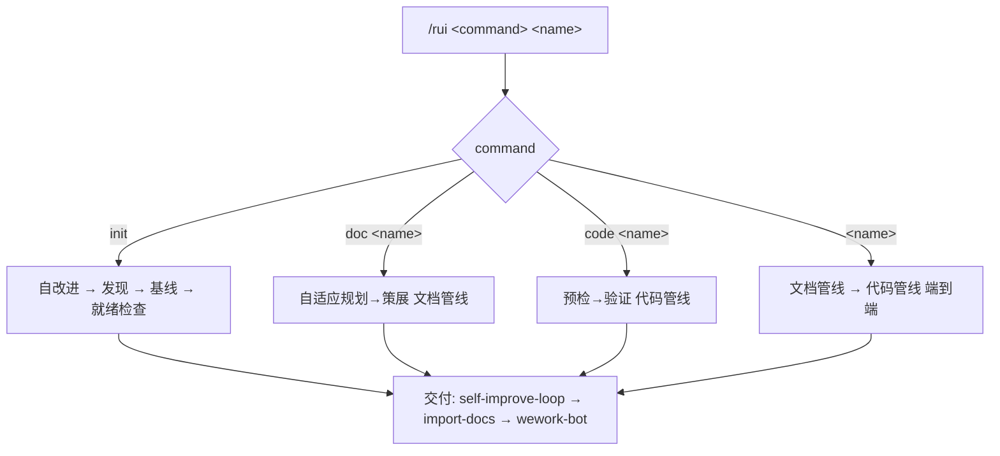
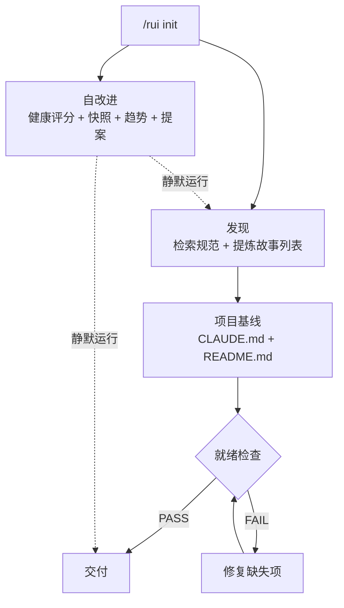
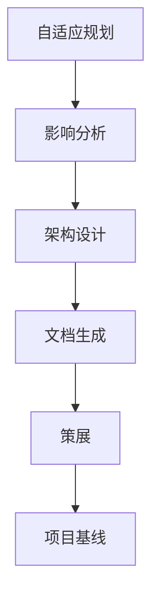
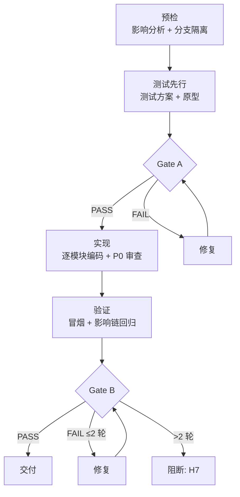

# rui

故事驱动 SDLC 编排器。每次调用仅操作一个故事，禁止批量操作多个故事，确保生成的故事最小可用。



---

## 命令概览

| 命令 | 流程 |
|------|------|
| `/rui init` | 自改进 → 发现 → 基线 → 就绪检查 → 交付（不生成故事，仅建立项目骨架） |
| `/rui doc <name>` | 自适应规划→策展 → 交付 |
| `/rui code <name>` | 预检→验证 → 交付（需已存在 `docs/故事任务面板/<name>/故事任务.md`） |
| `/rui <name>` | 自适应规划→策展 → 预检→验证 → 交付 |

---

## /rui init

发现故事列表 + 建立项目基线，不逐故事生成。每个故事通过 `/rui <name>` 单独操作。



| 阶段 | 做什么 | 关键产出 |
|------|--------|---------|
| 自改进 | 健康评分 + 快照 + 趋势 + 提案<br>self-improve | 改进提案（proposals.jsonl） |
| 发现 | 检索规范 + 提炼故事列表<br>pm | 故事目录 |
| 项目基线 | 生成 CLAUDE.md + README.md + 样例故事目录<br>pm, coder | CLAUDE.md、README.md、user-login/ |
| 就绪检查 | 5 项检查，失败则修复重检<br>tester, reporter, security | 5 项检查全部通过 |
| 交付 | self-improve-loop → import-docs → wework-bot<br>self-improve | 自改进复盘.md |

完成 init 后，逐个故事执行 `/rui <name>`（或 `/rui doc <name>` → `/rui code <name>`）。

### 增量裁剪

init 重入时按变更级别裁剪，避免不必要的全量重建。

| 级别 | 触发条件 | 发现 | 基线 |
|------|---------|------|------|
| T1 微观 | 故事板微调、措辞修正、就绪检查单项修复 | 跳过 | 跳过 |
| T2 局部 | 增删故事、故事目录结构变更 | 重跑 | 更新 |
| T3 范围 | 项目范围变更、跨故事重构、首次运行 | 完整重跑 | 完整重生成 |

> 自改进与就绪检查始终运行，不受裁剪级别影响。
>
> **样例生成**: T3 首次运行时，项目基线阶段生成 `docs/故事任务面板/user-login/` 完整样例目录。该目录含完整故事板（故事任务.md）、改进提案（proposals.jsonl）和执行记忆（execution-memory.jsonl + rui-state.json），作为新故事的参考模板。T1/T2 重入时样例目录保持不变。

### 自改进管线

静默运行，不阻断主流程。脚本位于 `skills/rui/scripts/`。

| rui 阶段 | 触发 | 操作 |
|---------|------|------|
| init | 全量运行 | 健康评分 + 快照 + 趋势 + 提案 |
| 影响分析 / 预检 | 架构反思 | 六维推演，产出架构指标 |
| 策展 / 验证 | 工流诊断 | 趋势分析，产出工流指标 |
| 交付 | self-improve-loop | 效果评估 + 回顾 → `loop.js run --all` |

数据存储: `docs/故事任务面板/<name>/.improvement/proposals.jsonl` + `docs/故事任务面板/<name>/.memory/`，append-only。

**项目基线：** 生成 `CLAUDE.md` + `README.md`（双文件 × N 子项目）。

### 就绪检查

| # | 检查项 | 验证 |
|---|-------|------|
| 1 | 至少一个故事目录含 .improvement/proposals.jsonl | `test -f` |
| 2 | docs/故事任务面板/ 目录存在 | `test -d` |
| 3 | 项目 CLAUDE.md 存在且非空 | `wc -l` |
| 4 | 项目 README.md 存在且非空 | `wc -l` |
| 5 | proposals.jsonl 无已解决但仍 open 的提案 | grep |

---

## /rui doc \<name\>

自适应规划→策展 → 交付。仅操作单个故事 `<name>`。



| 阶段 | 做什么 | 关键产出 |
|------|--------|---------|
| 自适应规划 | 读取执行记忆，判定 T1/T2/T3 变更级别<br>pm | rui-state.json |
| 影响分析 | 单个故事全项目影响链分析，闭合所有依赖<br>coder, reporter | 故事任务.md（§3 影响链） |
| 架构设计 | 单个故事模块划分、接口规范、数据流设计<br>coder, security | 后端技术评审.md、前端技术评审.md |
| 文档生成 | agent 协作<br>pm (§1,§2,§4), coder (§3), tester (§1.1,§5), reporter (§4 依赖), security (§3 安全) | 故事任务.md（完整） |
| 策展 | git commit + 执行记忆回写 + 后记（§6 §7）<br>pm, reporter | execution-memory.jsonl |
| 项目基线 | 仅 init：生成 CLAUDE.md + README.md<br>pm, coder | CLAUDE.md、README.md |

### 增量裁剪

| 级别 | 触发条件 | 影响分析 | 架构设计 | 文档生成 |
|------|---------|---------|---------|---------|
| T1 微观 | 措辞、格式修正 | 跳过 | 跳过 | 仅变更章节 |
| T2 局部 | 增删故事/接口变更 | 裁剪 | 裁剪 | 重写目标+下游 |
| T3 范围 | 范围边界变化、跨故事重构 | 完整重跑 | 完整重跑 | 全级联刷新 |

---

## /rui code \<name\>

预检→验证 → 交付（需已存在 `docs/故事任务面板/<name>/故事任务.md`）



| 阶段 | 做什么 | 关键产出 |
|------|--------|---------|
| 预检 | 双边影响分析 + 分支隔离（从 main/master 拉取 `feat/<name>` / `docs/<name>`）<br>必须从主分支创建<br>coder, reporter | 功能分支 + 双边影响链闭合 |
| 测试先行 | Gate A：测试方案+原型，单行 CSS 可跳过<br>Gate A 未过不得编码<br>tester | 测试用例评审.md |
| 实现 | 逐模块编码，每模块后审查：P0 必须修 / P1 建议修 / P2 可选<br>P0 未清零不进下一模块<br>coder, security, tester | 源代码（按 §4 任务列表）+ P0 清零 |
| 验证 | Gate B：环境快照 → 静态预检 → 对齐 → 单次执行<br>超过 2 轮修复阻断交付<br>tester, reporter | 后端实施报告.md、前端实施报告.md、测试用例报告.md |

---

## /rui \<name\>（端到端）

自适应规划→策展 → 预检→验证 → 交付

组合执行文档管线（见 [/rui doc](#rui-doc-name)）和代码管线（见 [/rui code](#rui-code-name)），中间不中断，完成或阻断后输出下一步提示。

---

## 交付

所有命令的末端，按序执行：

| Step | 操作 | 失败处理 |
|------|------|---------|
| 1 | `self-improve.js evaluate` → `loop.js run --all` | 不阻断（H11 降级） |
| 2 | `import-docs.js --workspace` | H9: token 缺失时跳过 |
| 3 | wework-bot 通知 | 不可跳过 |

消息格式（纯文本，emoji 前缀，`———` 分隔）：

```
🎯 结论: 完成 user-login 文档管线
📝 描述: 为登录模块生成故事板，覆盖密码登录、短信验证码、OAuth 三种场景
📌 范围: auth/
👉 下一步: 运行 /rui code user-login 开始编码实现
🌐 影响: docs/故事任务面板/user-login/故事任务.md
📎 证据: git log --oneline -1
⏱️ 会话: 自适应规划→策展 全流程 3.2min | 3 agents 参与

———
变更文件: docs/故事任务面板/user-login/故事任务.md (新增, 285行)
```

完成或阻断后同时向用户输出下一步提示。字段要求见 wework-bot SKILL.md。

---

## 文档规范

```
<workspace-root>/
└── docs/
    ├── shared/
    │   ├── architecture.md
    │   └── contracts.md
    └── 故事任务面板/
        └── <name>/              ← 故事目录（简写，便于分支管理）
            ├── 故事任务.md      ← 唯一真相源
            ├── 后端技术评审.md
            ├── 前端技术评审.md
            ├── 测试用例评审.md
            ├── 后端实施报告.md
            ├── 前端实施报告.md
            ├── 测试用例报告.md
            ├── 自改进复盘.md
            ├── .improvement/
            │   └── proposals.jsonl
            └── .memory/
                ├── execution-memory.jsonl
                └── rui-state.json
```

> **样例参考**: `docs/故事任务面板/user-login/` 为最佳实践样例，含 2 个完整 Story（P0 + P1），覆盖所有章节和边界情况。

### 故事板章节

| 章节 | 负责人 | 内容 |
|------|--------|------|
| §1 Story | pm | 角色场景、价值、范围边界、依赖 |
| §1.1 User Operations | tester | 用户操作 + UI交互流程 |
| §2 Requirements | pm | 功能点、输入输出、错误行为、业务规则 |
| §3 Design | coder + security | 技术设计 + 安全约束 |
| §4 Tasks | pm + all | 任务拆解、依赖、交付物 |
| §5 Acceptance Criteria | tester | 验收标准、测试方法、预期结果 |
| §6 .claude 改进清单 | pm | skill/agent/rule/script/config 改进（文档生成/策展阶段静态分析） |
| §7 系统架构演进任务 | pm | 近期/中期/远期演进（架构设计/策展阶段结构规划） |
| §L 自我改进循环 | self-improve-loop | 数据驱动改进清单 + 架构演进（每次 rui 完成追加） |

> §6 §7 由 pm 在文档生成阶段写入（结构性）。§L 由 self-improve-loop 在每次 rui 完成时自动追加（数据驱动）。两者互补。

### 故事目录附属文件

| 文件 | 负责人 | 内容 | 产出阶段 |
|------|--------|------|---------|
| 后端技术评审.md | coder + security | 后端技术方案评审，覆盖架构、接口、数据模型、安全约束 | 文档生成（架构设计后） |
| 前端技术评审.md | coder | 前端技术方案评审，覆盖组件树、状态管理、路由、交互细节 | 文档生成（架构设计后） |
| 测试用例评审.md | tester | 测试用例完整性评审，覆盖功能、边界、异常、回归用例 | 测试先行 |
| 后端实施报告.md | coder | 后端实现总结，覆盖实际接口、偏差记录、P0 审查结果 | 验证 |
| 前端实施报告.md | coder | 前端实现总结，覆盖实际组件、偏差记录、P0 审查结果 | 验证 |
| 测试用例报告.md | tester | 测试执行报告，覆盖冒烟结果、回归结果、已知问题 | 验证 |
| 自改进复盘.md | pm + reporter | 本次故事全过程复盘，覆盖执行记忆回望、改进项、经验沉淀 | 交付 |

---

## 核心规则

0. **单故事操作**: 每次调用仅操作一个故事，禁止批量操作多个故事，确保每个故事独立、最小可用、可测试、可交付
1. **增量更新**: 已有文档按 T1/T2/T3 裁剪
2. **测试先行**: Gate A 阻断实现；Gate B >2 轮修复阻断交付
3. **逐模块审查**: 实现阶段每模块后审查，P0 清零前进
4. **双边影响**: 预检阶段同时分析代码和文档影响
5. **分支隔离**: 预检阶段从 main/master 拉取功能分支
6. **知识沉淀**: 策展阶段写执行记忆 + rui-state.json
7. **交付必触发**: self-improve-loop → import-docs → wework-bot

---

## 阻断

| # | 场景 | 降级 | 阶段 |
|---|------|------|------|
| H1 | 功能名称无法解析 | 否 | 自适应规划 |
| H2 | P0 章节缺少上游来源 | 否 | 文档生成, 预检 |
| H3 | 影响链无法闭合 | 否 | 影响分析, 预检 |
| H4 | 文档 P0 不通过且无法自修复 | 否 | 文档生成 |
| H5 | 代码审查 P0 无法修复 | 否 | 实现 |
| H6 | Gate A 未完成但已编码 | 否 | 测试先行→实现 |
| H7 | Gate B >2 轮修复未通过 | 否 | 验证→交付 |
| H8 | 所有模块被阻断 | 否 | 实现 |
| H9 | `API_X_TOKEN` 缺失 | 是 | 交付 |
| H10 | 功能分支未从 main/master 创建 | 否 | 预检 |
| H11 | self-improve-loop 数据采集失败 | 是 | self-improve-loop |

阻断后: `rui-state.js save --blocked` → `next-step` → 持久化 → 同步（H9/H11 跳过）→ 通知。

---

## 集成点

- **自改进**: `node skills/rui/scripts/self-improve.js <cmd>`
- **自改进循环**: `node skills/rui/scripts/loop.js run --all`
- **执行记忆**: `node skills/rui/scripts/execution-memory.js`
- **断点**: `node skills/rui/scripts/rui-state.js <save|load|clear>`
- **文档同步**: `node skills/import-docs/scripts/import-docs.js --workspace`
- **通知**: `wework-bot`
- **Agent**: [`.claude/agents/AGENT.md`](../../agents/AGENT.md)
- **模板**: [`templates/故事任务模板.md`](templates/故事任务模板.md)
