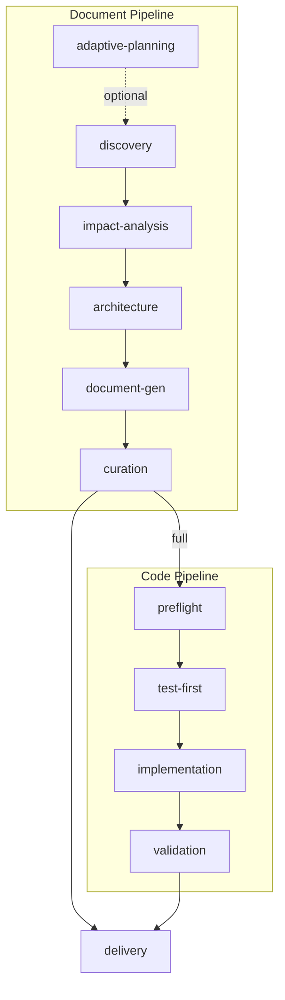

# rui

> D0 为可选自适应规划。C4 delivery = `import-docs` → `wework-bot`。

## 定位

全 SDLC 编排器。以 `import-docs` → `wework-bot` 收尾。

**何时使用**: 功能文档、代码实现、端到端交付、周报、项目初始化、周报拆解。
**何时不用**: 需求未澄清、简单补丁、单文件小修。

## 命令

| 命令 | 操作类型 | 阶段序列 |
|------|---------|---------|
| `/rui init` | init | D1→D4→D5→C4 |
| `/rui weekly [date]` | weekly | D1→D2→D3→D4→D5→C4 |
| `/rui from-weekly <path>` | from-weekly | D1→D2→D4→D5→C4 |
| `/rui <name> --document` | document | D0→D1→D2→D3→D4→D5→C4 |
| `/rui <name> --code` | code | C0→C1→C2→C3→C4 |
| `/rui <name>` (默认) | full | D0→D1→D2→D3→D4→D5→C0→C1→C2→C3→C4 |
| `/rui list` | — | 列出 `docs/` 下可用功能文档 |

**自动识别**: `init`/`weekly`/`from-weekly` 按命令名识别；`<name>` 默认 `--full`；已有 `docs/<name>.md` 默认增量更新（T1 级裁剪）。

### 特殊操作

**init** — 空仓库或脚手架项目，生成基线文档（§1 Feature Overview + §2 User Stories 骨架）。跳过 D0（无历史）、D2/D3（无已有文档）。

**weekly** — KPI 采集 + 执行记忆分析，生成周报（§4+附录结构）。脚本: `collect-weekly-kpi.js`, `draft-weekly-report.js`, `execution-memory.js query`。

**from-weekly** — 从周报拆解为 `docs/<name>.md` × N。保留 D2 影响分析，裁剪 D3（架构从周报继承）。

---

## 文档管线 (D0–D5)

| 阶段 | 做什么 | 关键产出 |
|------|--------|---------|
| D0 Adaptive Planning | 读取执行记忆，确定变更级别 T1/T2/T3 | 执行计划 |
| D1 Discovery | 检索规范与已有文档；涉及外部依赖/技术选型时并行搜索 npm/PyPI/GitHub/Web | 规范列表 + 证据矩阵 |
| D2 Impact Analysis | 全项目影响链分析（代码/测试/构建/类型），闭合所有依赖 | 闭合影响链 |
| D3 Architecture | 模块划分、接口规范、数据流设计 | 架构设计 |
| D4 Document Generation | 按模板生成 §1–§4+后记，三层审查 | 完整功能文档 |
| D5 Curation | `git commit` 持久化 + 执行记忆回写 | 已保存文档 |

### D1 技术选型规则

涉及外部库/方案时：并行搜索 → 评估矩阵（功能覆盖/维护活跃度/社区规模/许可证） → 推荐+证据+来源。所有推荐需可验证 URL 或包名@版本。不可搜索时声明"基于训练数据（可能过时）"。找不到满足约束的方案时明确报告，不猜测。

### 增量更新裁剪

| 级别 | 触发条件 | D2 | D3 | D4 |
|------|---------|----|----|-----|
| T1 微观 | 措辞、格式修正 | 跳过 | 跳过 | 仅变更章节 |
| T2 局部 | 增删故事/FP、接口变更 | 裁剪 | 裁剪 | 重写目标章节+下游 |
| T3 范围 | 范围边界变化、跨故事重构 | 完整重跑 | 完整重跑 | 全级联刷新 |

---

## 代码管线 (C0–C3)

| 阶段 | 做什么 | 关键产出 |
|------|--------|---------|
| C0 Preflight | 双边影响分析 + 分支隔离检查，验证 P0 完整 | 锚定报告 + 功能分支 |
| C1 Test-First | Gate A：测试方案+原型，编码前就绪 | 测试方案 + 原型 |
| C2 Implementation | 逐模块编码（功能分支上），每模块后审查 → 修 P0 → 自检 | 实现代码 + 审查记录 |
| C3 Validation | Gate B：冒烟测试 + 影响链回归 → 回写 §4 | 冒烟证据 + AC 更新 |

### C0 分支隔离

编码前强制创建功能分支，禁止在主干直接提交：

1. **状态检查**: 确认当前分支为 `main`/`master`，工作区干净（`git status` 无未提交变更）。
2. **分支命名**: `feat/<name>`（新功能）、`fix/<name>`（修复）、`docs/<name>`（文档）。
3. **切换执行**: `git checkout -b <branch-name>`，后续 C1–C3 全部在此分支进行。
4. **交付合并**: C4 阶段 commit → push → 合并回主干（优先 PR/MR，单分支仓库可本地 `git merge --no-ff`）。

> 单文件修补（typo、配置值修改）可豁免，但仍建议独立分支。

### C1 测试方案 (Gate A)

基于 §2 场景产出测试方案。每个场景: 测试类型（UI 交互/数据流/权限/边界）→ 验证清单（前置→步骤→断言）→ 选择器策略（优先 `data-testid`，次选语义标签）→ mock 依赖 → 测试数据。只基于已有场景生成，不添加场景。场景不足以推断断言时输出"前置信息不足"。

### C1/C3 验证方法

4 阶段执行，依赖准备而非重试:

1. **环境快照**: 静态读取 `package.json`/构建配置/`.nvmrc`/设计文档约束。`package.json` 不存在或目标脚本缺失 → 阻断。
2. **静态预检**: 依赖完整性、TypeScript 类型、import 路径、环境变量、lint 规则。阻断项未清不进入阶段 3。
3. **环境对齐**: Node 版本满足 `engines.node`/`.nvmrc`，包管理器一致。
4. **单次执行**: 退出码 0 + 输出验证。失败不给重试，产出"一次性修复清单"（根因+操作+重新进入点）。

故事级验证 (`--story <name>`): 从 §2 定位故事 → 逐 AC 执行 → 输出 `AC# / Criterion / Expected / Actual / Status` 报告。

### C2 代码审查

每个模块编码后审查，输出 P0/P1/P2 分级:

- **P0 必须修复**: 功能缺陷、安全漏洞、破坏性变更
- **P1 建议修复**: 可读性、边界处理、性能隐患
- **P2 可选优化**: 代码风格、微优化

审查维度：项目专项（入口初始化、状态管理、组件注册）+ 通用质量（可读性、边界处理、安全性、性能）。仅审查实际读取的代码，不推断未读文件。P0 未清零不进入下一模块。

---

## 文档结构

| 章节 | 内容 |
|------|------|
| §1 Feature Overview | 问题、范围边界、成功指标、Story Map |
| §2 User Stories | 每故事四子节: Requirements → Design → Tasks → AC |
| §3 Usage | 跨故事操作指南、FAQ（多故事共用时填写） |
| §4 Project Report | 交付汇总、AC 通过率、Gate A/B 证据 |
| 后记 | 工作流审查、架构演进、后续故事 |

---

## 核心规则

1. **增量更新**: 已有文档按 T1/T2/T3 裁剪。修 typo 不触发全流程。
2. **测试先行**: Gate A 阻断 C2；Gate B >2 轮修复阻断 C4。单行 CSS 不需要 Gate A。
3. **逐模块审查**: C2 每模块后审查，P0 清零前进下一模块。
4. **双边影响分析**: C0 同时分析代码和文档影响；C3 基于实际 diff 回归验证。
5. **分支隔离**: C0 创建功能分支，C2 全部编码在分支上完成，C4 合并回主干。
6. **知识沉淀**: D5 写执行记忆: `node skills/rui/scripts/execution-memory.js write`。

## 阻断条件

| # | 场景 | 可降级 | 阶段 |
|---|------|--------|------|
| H1 | 功能名称无法解析 | 否 | D0 |
| H2 | P0 章节缺少上游来源 | 否 | D4, C0 |
| H3 | 影响链无法闭合 | 否 | D2, C0 |
| H4 | 文档 P0 不通过且无法自修复 | 否 | D4 |
| H5 | 代码审查 P0 无法修复 | 否 | C2 |
| H6 | Gate A 未完成但已编写代码 | 否 | C1→C2 |
| H7 | Gate B 未通过（>2 轮修复） | 否 | C3→C4 |
| H8 | 所有模块被阻断 | 否 | C2 |
| H9 | `API_X_TOKEN` 缺失 | 是（跳过同步，仍发通知） | C4 |
| H10 | 当前在 main/master 且需编码，未创建功能分支 | 否 | C0 |

阻断后: 持久化 → 同步（H9 跳过）→ 通知 → 回退。

## 集成点

- **文档同步**: [`import-docs`](../import-docs/SKILL.md) — `node skills/import-docs/scripts/import-docs.js --dir docs --exts md`
- **通知**: [`wework-bot`](../wework-bot/SKILL.md) — `node skills/wework-bot/scripts/send-message.js`
- **Agent 定义**: [`agents/AGENT.md`](../../agents/AGENT.md)
- **文档模板**: [`templates/feature-document.md`](templates/feature-document.md)
