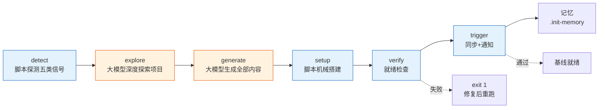
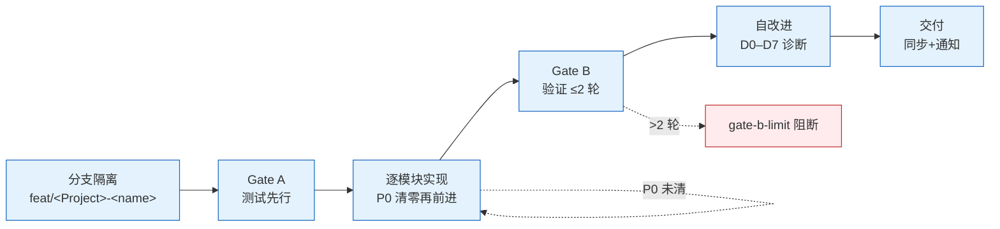
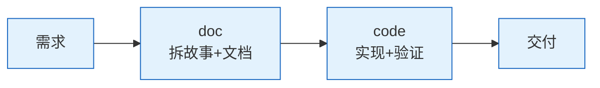
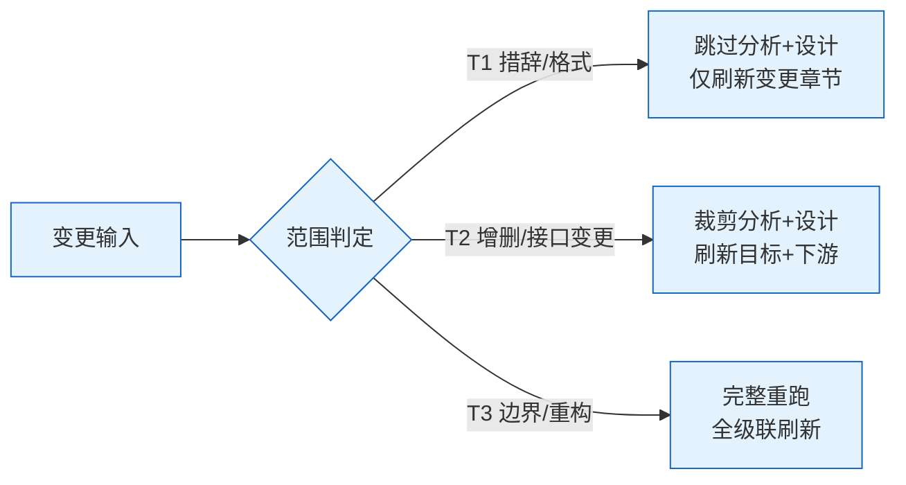
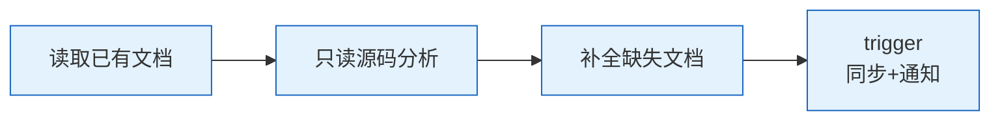
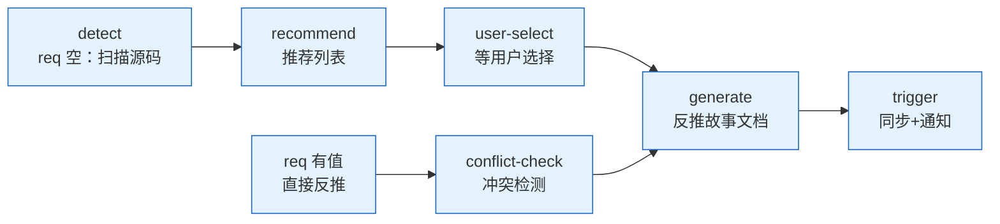

# rui

> 故事驱动 SDLC 编排器：拆故事 → 文档基线 → 测试先行 → 实现 → 验证 → 复盘 → 交付。每条命令最终落到「故事任务面板」目录，每个故事独立串行走完管线。
>
> 哲学源自 [CLAUDE.md](../../CLAUDE.md)。本文件只定义命令面与编排骨架，细节分散在：[rules/](../../rules/) 跨场景约束 · [agents/](../../agents/) 角色契约 · [formulas.md](./formulas.md) 故事文档公式 · [coder.md](./coder.md) 目录与生命周期 + 参考文档公式 + 数据契约。

## 命令面

| 命令 | 用途 | 关键行为 |
|------|------|---------|
| `/rui init` | 建立项目基线 | detect → generate → verify；生成 CLAUDE.md · README.md · `.claude/` · 故事面板目录 |
| `/rui doc <req>` | 拆需求为故事 + 生成文档基线 | pm 拆故事 → coder 按项目类型补齐设计文档；分支隔离；禁止改源码；多故事逐个串行 |
| `/rui code <name>` | 实现故事 + 生成验证报告（05/06-实施 / 07-测试 / 08-自改进复盘） | Gate A 测试先行；Gate B 验证闭合 |
| `/rui <req>` | 端到端 | doc + code 全自动串联 |
| `/rui update <name-or-path> [ctx] [--no-code]` | 增量更新 | T1/T2/T3 裁剪；`--no-code` 仅文档 |
| `/rui code --from-doc <name>` | 从文档反推 | 只读源码补全缺失文档；不覆盖已有 |
| `/rui doc --from-code [req]` | 从源码反推（推荐） | req 空：pm 探索推荐列表；req 有值：直接反推故事文档 |
| `/rui list` | 进度全景 | 按文件存在性判定状态 |
| `/rui` | 任务推荐 | 5 层链式管线评分排序 |

`<req>` 支持文本 / `@` 引用本地文件 / URL。CLI `--name` 用 `<Project>-<name>` 格式（如 `YiWeb-user-login`），脚本内分解为路径 `<Project>/<name>`。

## 管线一览


| 阶段细则 | 出处 |
|---------|------|
| 影响分析 / 证据等级 | [agents/AGENT.md](../../agents/AGENT.md) |
| 分支隔离 / Gate A/B / P0 审查 | [rules/code-pipeline.md](../../rules/code-pipeline.md) |
| 三步交付管线 / 文档同步 | [rules/delivery-gate.md](../../rules/delivery-gate.md) |
| 诊断 D0–D7 / 评估 E1–E4 | [rules/self-improve.md](../../rules/self-improve.md) |
| 文档生成强制约束 | [rules/doc-generation.md](../../rules/doc-generation.md) |
| Agent 交接契约 | [agents/](../../agents/) 各角色文件 |

## 阻断标识

| 标识 | 触发 | 阶段 | 降级 |
|------|------|------|------|
| `no-parse` | 需求无法解析 | 需求解析 | 否 |
| `no-source` | P0 章节缺上游来源 | 文档生成 / 预检 | 否 |
| `chain-broken` | 影响链未闭合 | 影响分析 / 预检 | 否 |
| `doc-p0` | 文档 P0 不通过且无法自修复 | 文档生成 | 否 |
| `code-p0` | 代码 P0 无法修复 | 实现 | 否 |
| `skip-gate-a` | Gate A 未通过即编码 | 测试先行→实现 | 否 |
| `gate-b-limit` | Gate B >2 轮 | 验证 | 否 |
| `bad-branch` | 分支未从 main 创建或混入非本故事代码 | 预检 | 否 |
| `no-checkout` | 未切换故事分支即改源码 | 预检→实现 | 否 |
| `auto-merge` | 功能分支被自动合并到 main | 预检→交付 | 否 |
| `no-token` | `API_X_TOKEN` 缺失 | 交付 | 是 |
| `no-metrics` | self-improve 数据采集失败 | 自改进 | 是 |

阻断后：`node skills/rui/scripts/rui-state.js save --blocked` → 持久化 → 通知（`no-token` / `no-metrics` 跳过）。重跑同命令从 `current_stage` 续。

## 核心约束

1. **逐故事串行** — 多故事按拆分顺序处理，互不交叉
2. **分支隔离** — `feat/<project>-<name>` 从 main 创建；不可派生、不可自动合并
3. **源码改动唯一入口** — 只能走 `/rui code` 管线（`no-checkout`）
4. **测试先行** — Gate A 阻断实现；Gate B >2 轮阻断交付
5. **逐模块审查** — 每模块后审查，P0 清零再前进
6. **只读反推** — `--from-code` / `--from-doc` 禁止改源码
7. **产出内聚** — 关键产出限定在故事目录 `docs/故事任务面板/<Project>/<name>/`
8. **交付强制** — 三步管线按序标记（`delivery-gate.js mark`），Stop hook 检查未闭合即阻断
9. **公式驱动** — 文档由 [formulas.md](./formulas.md) 规约，文件名带编号前缀（00–08）
10. **知识沉淀** — 写入 `.memory/execution-memory.jsonl` + `.memory/rui-state.json`；提案写入 `.improvement/proposals.jsonl`
11. **同步通知必触发** — 每次 rui 命令（除 list/推荐）末端必须触发 import-docs 文档同步 + wework-bot 通知，未触发 = 管线未闭合

### 故事目录文件编号速查

| 编号 | 文件 | 阶段 | 必选 |
|------|------|------|:---:|
| 00 | 消息通知列表.md | 交付 | 自动 |
| 01 | 故事任务.md | 文档生成 | ✓ |
| 02 | 后端技术评审.md | 文档生成 | 后端/全栈 |
| 03 | 前端技术评审.md | 文档生成 | 前端/全栈 |
| 04 | 测试用例评审.md | 文档生成 | ✓ |
| 05 | 后端实施报告.md | 验证 | 后端/全栈 |
| 06 | 前端实施报告.md | 验证 | 前端/全栈 |
| 07 | 测试用例报告.md | 验证 | ✓ |
| 08 | 自改进复盘.md | 自改进 | ✓ |

## init 简述

> 五步：探（脚本探测五类信号）→ 察（大模型深度探索项目）→ 生（大模型生成 CLAUDE.md / README.md）→ 搭（脚本机械性搭建 wework-bot 配置）→ 验（4 项就绪检查）→ 触（import-docs 同步 + wework-bot 通知）。
>
> **核心设计**：init 负责项目基线。**所有内容文件（CLAUDE.md、README.md）全部由大模型通过深度项目探索生成**，JS 脚本默认不做任何内容生成，只负责探测信号和机械性搭建（目录创建、skills 配置、验证、触发）。`--template` 标志可启用 JS 模板回退。可重复运行，每次全量重生。



### 执行流程

```
1. node init.js --profile-only  → 获取 profile JSON（项目类型/技术栈/安全面/测试框架/架构）
2. 大模型深度探索项目           → 阅读关键源码、理解架构模式、识别代码规范、发现安全面
3. 大模型生成全部内容文件       → CLAUDE.md · README.md
4. node init.js                 → 默认行为：机械性搭建（目录 · wework-bot 配置 · 验证 · 触发同步+通知）
```

`node init.js` 默认只做机械性搭建，跳过所有内容生成。如需 JS 模板回退：`node init.js --template`。

### 重复运行：增量改进

`rui init` 可重复运行。再次运行时，大模型必须：

1. **读取已有文件** — 检查 CLAUDE.md、README.md 是否已存在
2. **保留人工定制** — 用户手动修改的内容不覆盖（特别是项目约束段外的自定义内容）
3. **增量更新** — 只改变了的部分：profile 信号变了 → 更新项目画像表；安全面变了 → 更新约束段；新依赖 → 更新技术栈
4. **优化改进** — 已有内容可读性差 → 优化表达；格式不统一 → 统一格式；过时信息 → 刷新
5. **CLA.md 标记内替换** — CLAUDE.md 的 `<!-- rui:project-start -->` / `<!-- rui:project-end -->` 段每次全量替换，段外内容保留

**判断是否首次运行**：如果 CLAUDE.md 不含 `rui:project-start` 标记 → 首次，全量生成；含标记 → 重复，增量改进。

### 1. detect — 脚本探测（事实层）

运行 `node skills/rui/scripts/init.js --profile-only` 获取 profile JSON。五类信号：

| 信号 | 来源 | 用途 |
|------|------|------|
| 项目身份 | 仓库目录名 | 分支前缀 / 文档路径锚点 |
| 项目类型 | `constants.detectProjectType` | frontend/backend/fullstack/meta/unknown |
| 项目清单 | 按生态文件抽取 | 依赖 + 构建/测试命令 + 框架版本 |
| 安全面 | 源码关键词扫描 | 用户输入/API/存储/认证/第三方 |
| 测试框架 | 依赖 + 配置文件 | vitest/jest/pytest/go-test/cargo-test |
| 架构模式 | 项目结构 | single/monorepo/microservice/plugin |

### 2. explore — 大模型深度探索（理解层）

拿到 profile 后，**大模型必须深度探索项目**，不能仅凭 profile 字段生成内容。探索要点：

- **目录结构**：理解项目组织方式、模块划分、关键目录职责
- **核心源码**：阅读代表性文件（入口、核心业务、路由、数据模型），理解代码风格和模式
- **架构模式**：验证 profile 的架构判断，补充具体细节（如 monorepo 的子包职责）
- **技术栈细节**：确认框架版本、关键依赖、状态管理方案、路由方案
- **代码规范**：从现有代码推断命名规范、文件组织约定、注释风格
- **安全面**：验证 profile 的安全面探测，补充遗漏的风险面

### 3. generate — 大模型生成内容（生成层）

基于 profile + 深度探索发现，**大模型直接编写文件**（非模板替换）：

| 产物 | 生成要求 | 关键约束 |
|------|---------|---------|
| `CLAUDE.md` | 以插件 CLAUDE.md 为哲学框架，针对项目实际情况重写。含基础信念（通用）、工作原则（通用）、项目画像（项目特定）、执行准则（引用实际技术栈/命令）、退化对策（按项目类型）、项目约束（安全底线，含 `rui:project-start/end` 标记）、自约束 | 必须含 `<!-- rui:project-start -->` 和 `<!-- rui:project-end -->` 标记；项目画像表含技术栈/构建命令/测试命令/安全面/Coder公式 |
| `README.md` | 项目画像 + 命令流 mermaid + 快速开始 + 项目结构 + 管线一览。根据项目类型定制化编写 | 含项目名、技术栈、快速开始命令 |

**生成原则**：
- CLAUDE.md 以插件 CLAUDE.md 为指导框架（公理/原则保留），但执行准则、退化对策、自约束全部根据项目实际重写
- README.md 用 mermaid 图 → 结构化表格 → 命令示例表达
### 4. setup — 脚本机械搭建（搭建层）

大模型生成内容文件后，运行 `node skills/rui/scripts/init.js`（默认行为，无需额外标志）完成：

| 操作 | 说明 |
|------|------|
| 目录创建 | `docs/故事任务面板/` |
| wework-bot 配置 | 生成 `wework-bot/config.json` |
| 验证 | 4 项就绪检查 |
| 触发 | import-docs 文档同步 + wework-bot 通知 |
| 记忆 | 写入 `.init-memory.json` |

### 5. verify — 4 项就绪检查（验证层）

任一失败 `exit 1`：

| # | 检查项 | 通过条件 |
|---|--------|--------|
| 1 | `CLAUDE.md` | 含 `rui:project-start` 标记 + 项目名 |
| 2 | `README.md` | 含项目名 |
| 3 | 故事面板 | `docs/故事任务面板/` 目录存在 |
| 4 | wework-bot 配置 | `wework-bot/config.json` 存在 |

### 6. trigger — 主动触发（集成层）

验证通过后主动触发：

| 触发 | 条件 | 降级 |
|------|------|------|
| `import-docs --workspace` | `API_X_TOKEN` 存在 | 缺 token 跳过，网络失败告警不阻断 |
| `wework-bot --agent rui` | `API_X_TOKEN` + `WEWORK_BOT_WEBHOOK_URL` 存在 | 缺凭据跳过 |

### 7. 产物

| 路径 | 用途 | 生成方式 | 重复运行 |
|------|------|---------|---------|
| `CLAUDE.md` | 项目约束 + 执行准则 + 退化对策 | 大模型 | 全量重生 |
| `README.md` | 系统视图 + 命令流 + 项目画像 | 大模型 | 全量重生 |
| `.claude/skills/wework-bot/config.json` | 企微通知配置 | 脚本生成 | 每次覆盖 |
| `docs/故事任务面板/.init-memory.json` | 执行记录 | 脚本 | 每次覆盖 |

## doc 简述

> 三步：拆（pm 解析需求拆为故事）→ 补（coder 按项目类型补齐设计文档）→ 触（import-docs 同步 + wework-bot 通知）。
>
> **核心设计**：pm 将需求文本 / `@` 文件 / URL 解析为结构化故事，影响分析后拆分任务并排优先级。随后指派 coder 按项目类型补齐设计文档：前端补 03-前端技术评审，后端补 02-后端技术评审，全栈两者均补。全程禁止改源码，多故事逐个串行处理。

```mermaid
flowchart LR
    A[需求输入<br/>文本/@文件/URL]:::s --> B[pm 拆故事<br/>影响分析+优先级]:::s
    B --> C[coder 补齐文档<br/>02/03 按项目类型]:::s
    C --> D[branch<br/>feat/&lt;Project&gt;-&lt;name&gt;]:::s
    D --> E[trigger<br/>同步+通知]:::s
    classDef s fill:#e3f2fd,stroke:#1565c0;
```

### 产出

| 文件 | 条件 |
|------|------|
| 01-故事任务.md | 必创建 |
| 02-后端技术评审.md | 后端 / 全栈 |
| 03-前端技术评审.md | 前端 / 全栈 |
| 04-测试用例评审.md | 必创建 |

### 约束

- **只读** — 文档生成阶段禁止改源码
- **分支隔离** — 自动创建 `feat/<Project>-<name>` 分支
- **逐故事串行** — 多故事按拆分顺序处理，互不交叉

## code 简述

> 四步：Gate A（测试先行）→ 实现（逐模块 P0 清零）→ Gate B（验证闭合）→ 自改进（D0–D7 诊断 + 交付）。
>
> **核心设计**：源码改动唯一入口。测试方案未就绪不得编码；逐模块审查 P0 清零再前进；修复 ≤ 2 轮；三步交付管线收口（import-docs + wework-bot）。



### 产出

| 文件 | 条件 | 阶段 |
|------|------|------|
| 05-后端实施报告.md | 后端 / 全栈 | 验证 |
| 06-前端实施报告.md | 前端 / 全栈 | 验证 |
| 07-测试用例报告.md | 必创建 | 验证 |
| 08-自改进复盘.md | 必创建 | 自改进 |

### 约束

- **源码唯一入口** — 只能走 `/rui code` 改源码
- **Gate A 阻断** — `04-测试用例评审.md` 不存在即阻断编码
- **Gate B 限轮** — 修复 > 2 轮阻断交付
- **逐模块 P0** — P0 不清零不进下一模块

## 端到端简述

> doc + code 全自动串联。`/rui <req>` 等价于 `/rui doc <req>` → `/rui code <name>`，无中断一气呵成，末端触发 import-docs + wework-bot。



## update 简述

> 增量更新，按变更范围 T1/T2/T3 自动裁剪管线。`--no-code` 仅文档不改源码。



| 级别 | 范围 | 影响分析 | 架构设计 | 文档刷新 |
|------|------|---------|---------|---------|
| T1 | 措辞 / 格式 | 跳过 | 跳过 | 仅变更章节 |
| T2 | 增删故事 / 接口变更 | 裁剪 | 裁剪 | 目标 + 下游 |
| T3 | 边界变化 / 跨故事重构 | 完整重跑 | 完整重跑 | 全级联刷新 |

## code --from-doc 简述

> 从已有文档反推，只读源码补全缺失文档，不覆盖已有。



- **只读** — 禁止改源码
- **不覆盖** — 已有文档不覆盖，仅补缺失
- **分支隔离** — 自动创建 `feat/<Project>-<name>` 分支

## doc --from-code 简述

> 三步：探（req 空时扫描项目源码输出推荐列表）/ 生（反推源码生成故事文档基线）/ 触（import-docs 同步 + wework-bot 通知）。
>
> **核心设计**：面向存量代码库的文档生成入口。req 空时 pm 自主探索，靠推荐引路；req 有值时 pm 直接从源码反推完整故事文档。全程只读，输出内聚于 `docs/故事任务面板/<Project>/<name>/`。**已有代码库优先使用此模式补全文档**。



### 1. 探索模式（req 为空）— 推荐引路

pm 按项目类型差异化扫描源码，输出推荐列表：

| 项目类型 | 扫描目标 | 排序 | 命名 |
|---------|---------|------|------|
| 前端 | `.vue`/`.jsx`/`.tsx`/`.svelte` 的 Props/Events/Expose | 核心业务无文档 > 普通无文档 > 过时文档 | `<project>-<component>-doc` |
| 后端 | 路由/控制器 → HTTP 方法/路径/schema | 核心 API 无文档 > 普通无文档 > 过时文档 | `<project>-<resource>-api` |
| 全栈 | 两端独立扫描 | 分别输出 | — |

每候选含：覆盖范围 · 源码证据 · 优先级。用户选择后进入生成阶段。

### 2. 反推模式（req 有值）— 直接生成

1. **解析** — `<Project>-<name>` → `docs/故事任务面板/<Project>/<name>/`
2. **冲突检测** — 目标目录已存在时提醒走 `/rui update`，不覆盖已有文档
3. **源码定位** — 按 req 匹配源文件；前端匹配组件名 → `.vue`/`.jsx`/`.tsx`；后端匹配路由/控制器名
4. **只读提取** — 结构概览（mermaid）→ 接口契约 → 依赖链 → 状态管理 → 安全考量
5. **文档生成** — 按项目类型生成故事文档基线，所有内容证据 Level B + 源码路径；缺口标 `> 待补充`

| 项目类型 | 反推来源 | 重点关注 | 输出 |
|---------|---------|---------|------|
| 前端 | `.vue`/`.jsx`/`.tsx` 源码 + 路由 + 状态管理 | 组件树 → Props/Events → 数据流 | 01 + 03 + 04 |
| 后端 | 路由/控制器/服务/数据模型源码 | API 契约 → 数据模型 → 中间件链 | 01 + 02 + 04 |
| 全栈 | 两端分别 | 前后端契约对齐 | 01 + 02 + 03 + 04 |

### 3. trigger — 主动触发

生成完成后主动触发：

| 触发 | 条件 | 降级 |
|------|------|------|
| `import-docs --workspace` | `API_X_TOKEN` 存在 | 缺 token 跳过，网络失败告警不阻断 |
| `wework-bot --agent rui` | `API_X_TOKEN` + `WEWORK_BOT_WEBHOOK_URL` 存在 | 缺凭据跳过 |

### 4. 约束

- **只读** — 禁止改源码（`--from-code` 违反即 `bad-branch`）
- **分支隔离** — 自动创建 `feat/<Project>-<name>` 分支
- **证据 Level B** — 全部内容源自源码分析，标注源文件路径
- **P0 标记** — 反推文档的 P0 章节标「待确认」，需开发 review
- **冲突保护** — 目标目录已存在时拒绝覆盖，引导 `/rui update`

## list 简述

> 只读。扫描 `docs/故事任务面板/` 按文件存在性判定每个故事的状态（文档就绪 / 实现中 / 验证 / 交付 / 阻断），输出进度全景表。不触发 import-docs / wework-bot。

## 推荐简述

> 只读。5 层链式管线评分（L0 时间 / L1 依赖 / L2 风险 / L3 覆盖 / L4 质量），加权排序后推荐下一步最优任务。不触发 import-docs / wework-bot。

## 强制集成：import-docs + wework-bot

**每次** `/rui` 命令执行（含 `doc` / `code` / `update` / `init` / 端到端），管线末端 **必须** 触发 import-docs 和 wework-bot。这不是可选步骤，是管线完整性的一部分。

### 触发时机

| rui 命令 | import-docs | wework-bot | 备注 |
|----------|:-----------:|:----------:|------|
| `/rui init` | ✓ | ✓ | verify 通过后立即触发 |
| `/rui doc <req>` | ✓ | ✓ | 文档生成完成后 |
| `/rui code <name>` | ✓ | ✓ | Gate B 通过后 |
| `/rui <req>` | ✓ | ✓ | 端到端末端 |
| `/rui update` | ✓ | ✓ | 更新完成后 |
| `/rui code --from-doc` | ✓ | ✓ | 反推完成后 |
| `/rui doc --from-code` | ✓ | ✓ | 反推完成后 |
| `/rui list` | ✗ | ✗ | 只读，不触发 |
| `/rui`（推荐） | ✗ | ✗ | 只读，不触发 |

### 触发顺序（不可跳序）

```
管线完成 → 1. hook-log（追加日志）→ 2. import-docs（文档同步）→ 3. wework-bot（发送通知）→ delivery-gate mark
```

### 阻断条件

- 未触发 import-docs 或 wework-bot → 管线视为 **未闭合**，delivery-gate 阻断
- `no-token` 降级：仅 `API_X_TOKEN` 缺失时跳过实际推送，但仍需调用脚本并标记
- 网络失败：记录告警不阻断，标记仍写

### 执行方式

```bash
# 1. 追加日志
node skills/wework-bot/scripts/hook-log.js

# 2. 文档同步（必须）
node skills/import-docs/scripts/hook-sync.js

# 3. 发送通知（必须）
node skills/wework-bot/scripts/hook-notify.js

# 4. 闭合检查
node skills/rui/scripts/delivery-gate.js check-all --json --recent-hours 1
```

**违反此规则等同于管线未完成。**

## 集成

| 类别 | 内容 |
|------|------|
| 脚本 | `skills/rui/scripts/`：init · list · recommend · rui-state · execution-memory · self-improve · delivery-gate · loop · natural-week · constants |
| Hooks | Stop hooks（用户级 `~/.claude/settings.json` 或本机覆盖配置）：hook-log（追加日志）→ hook-sync（文档同步）→ hook-notify（企微通知）→ delivery-gate check-all（闭合检查） |
| 规则 | [code-pipeline](../../rules/code-pipeline.md) · [delivery-gate](../../rules/delivery-gate.md) · [doc-generation](../../rules/doc-generation.md) · [self-improve](../../rules/self-improve.md) · [rui-claude](../../rules/rui-claude.md) |
| 角色 | [pm](../../agents/pm.md) · [coder](../../agents/coder.md) · [tester](../../agents/tester.md) · [reporter](../../agents/reporter.md) · [security](../../agents/security.md) · [self-improve](../../agents/self-improve.md) |
| 文档 | [formulas.md](./formulas.md) — 故事文档公式（F.story.\* + F.supp.\*） · [coder.md](./coder.md) — 目录生命周期 + 参考文档公式（F.ref.\*） + 数据契约（`.memory/` + `.improvement/`） |
