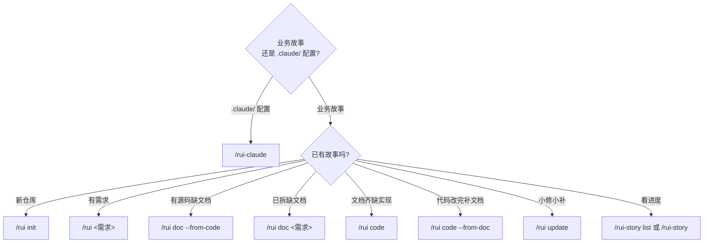
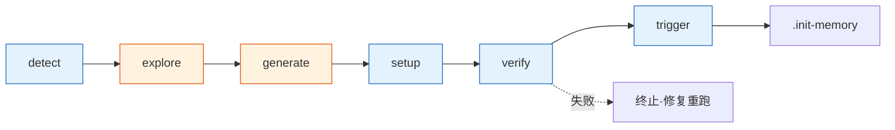
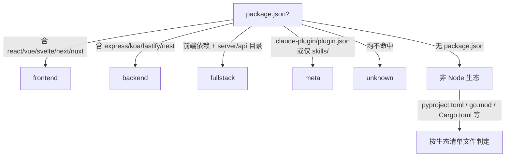
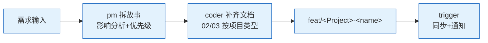
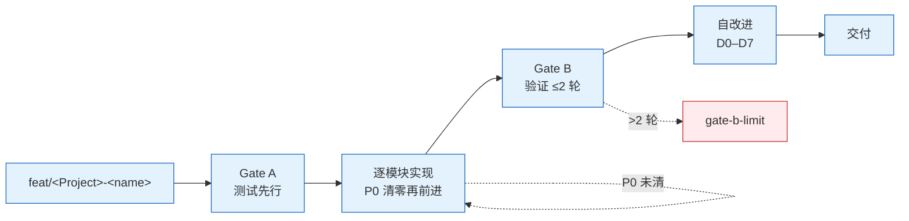
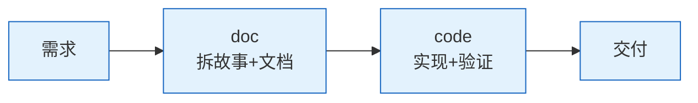
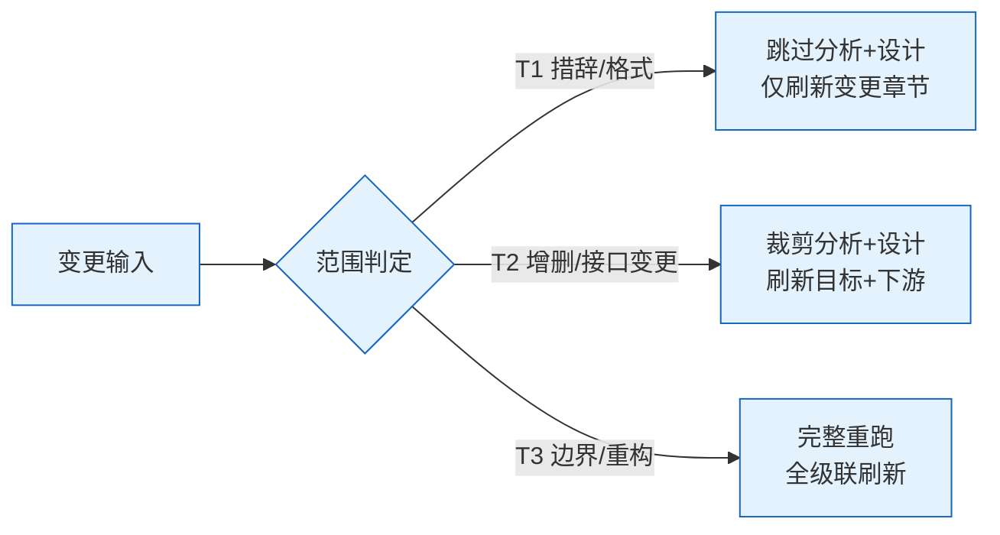
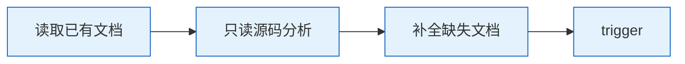
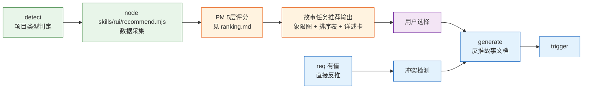
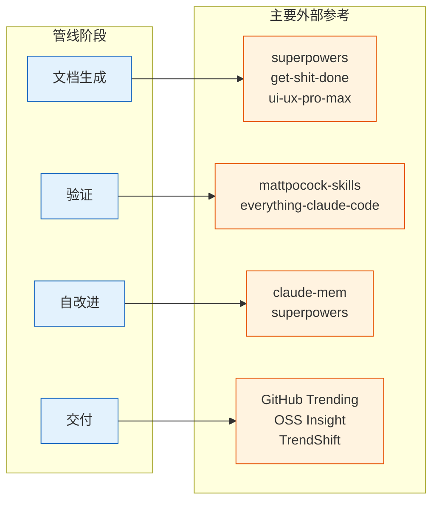

# rui

> 故事驱动 SDLC 编排器：拆故事 → 文档基线 → 测试先行 → 实现 → 验证 → 复盘 → 交付。
>
> **--help / -h**：执行 `node skills/rui/help.mjs` 输出完整帮助（含场景示例）。用户输入 `/rui --help` 或 `/rui -h` 或 `/rui help` 时，跳过管线逻辑，直接运行脚本并将输出展示给用户。
>
> 哲学源自 [CLAUDE.md](../../CLAUDE.md)。本文件定义命令面与编排骨架，细节分散在：[rules/](../../rules/) · [agents/](../../agents/) · [formulas.md](./formulas.md) · [coder.md](./coder.md)。

## 选哪条命令



`需求` 支持文本 / `@` 引用本地文件 / URL。`--name` 用 `<Project>-<name>` 格式（如 `YiWeb-user-login`）。

### 写入命令（末端自动交付三步）

- `/rui init` — 建立项目基线：detect → explore → generate → setup → verify → trigger
- `/rui <需求>` — 端到端：doc + code 自动串联，逐故事串行
- `/rui doc <需求>` — 拆需求为故事 + 生成文档基线（01/02/03/04），禁止改源码
- `/rui code <name>` — 实现故事：Gate A → 逐模块 → Gate B → 自改进 → 交付
- `/rui update <name> [ctx] [--no-code]` — 增量更新：T1/T2/T3 自动裁剪
- `/rui code --from-doc <name>` — 从文档反推：只读源码补全缺失文档，不覆盖已有
- `/rui doc --from-code 需求` — 从源码反推：req 空时 pm 扫描推荐列表；req 有值时直接反推

### 只读命令（不触发 hook）

- `/rui` — 任务推荐：5 层链式管线评分排序

> 进度查询已迁移至 `/rui-story list` 和 `/rui-story`，详见 [rui-story SKILL.md](../rui-story/SKILL.md)。

## 管线一览


- 影响分析 / 证据等级 → [agents/AGENT.md](../../agents/AGENT.md)
- 分支隔离 / Gate A/B / P0 审查 → [rules/code-pipeline.md](../../rules/code-pipeline.md)
- 交付三步 / 文档同步 → [rules/delivery-gate.md](../../rules/delivery-gate.md)
- 诊断 D0–D7 / 评估 E1–E4 → [rules/self-improve.md](../../rules/self-improve.md)
- 文档生成约束 → [rules/doc-generation.md](../../rules/doc-generation.md)
- Agent 交接 → [agents/](../../agents/) 各角色

## 阻断标识

阻断后写 `.memory/rui-state.json`（`blocked=true` + `block_reason=<标识>`），重跑同命令从 `current_stage` 续。

**需求→文档阶段**
- `no-parse` — 需求无法解析
- `no-source` — P0 章节缺上游来源
- `chain-broken` — 影响链未闭合
- `doc-p0` — 文档 P0 不通过且无法自修复

**预检→实现阶段**
- `bad-branch` — 分支未从 main 创建或混入非本故事代码
- `no-checkout` — 未切换故事分支即改源码
- `skip-gate-a` — Gate A 未通过即编码

**实现→验证阶段**
- `code-p0` — 代码 P0 无法修复
- `gate-b-limit` — Gate B >2 轮

**交付阶段**
- `auto-merge` — 功能分支被自动合并到 main
- `no-token`（降级）— `API_X_TOKEN` 缺失
- `no-metrics`（降级）— self-improve 数据采集失败

## 核心约束

1. **逐故事串行** — 多故事按拆分顺序处理，互不交叉
2. **分支隔离** — `feat/<project>-<name>` 从 main 创建；禁止派生、自动合并
3. **源码唯一入口** — 只能走 `/rui code` 改源码
4. **测试先行** — Gate A 阻断实现；Gate B >2 轮阻断交付
5. **逐模块 P0 清零** — 每模块审查后 P0 清零再前进
6. **只读反推** — `--from-code` / `--from-doc` 禁止改源码
7. **产出内聚** — 关键产出限定在 `docs/故事任务面板/<name>/`
8. **公式驱动** — 文档由 [formulas.md](./formulas.md) 规约，文件名带编号前缀（00–08）
9. **知识沉淀** — 写入 `10-交互日志.md` + `.memory/execution-memory.jsonl` + `.memory/rui-state.json`；提案写入 `.improvement/proposals.jsonl`
10. **交付强制** — 三步按序触发（hook-log → import-docs → wework-bot），详见 [强制集成](#强制集成)
11. **表达优先** — 文档内容必须 图 → 结构化文本 → 表，架构/流程/关系优先 mermaid，不可降级

## 故事文档编号

| 编号 | 文件 | 阶段 | 必选 |
|------|------|------|:---:|
| 00 | 消息通知列表.md | 交付 | 自动 |
| 01 | 故事任务.md | 文档生成 | ✓ |
| 02 | 用户使用场景.md | 文档生成 | ✓ |
| 03 | &lt;Project&gt;-后端技术评审.md | 文档生成 | 后端/全栈 |
| 04 | &lt;Project&gt;-前端技术评审.md | 文档生成 | 前端/全栈 |
| 05 | 测试用例评审.md | 文档生成 | ✓ |
| 06 | &lt;Project&gt;-后端实施报告.md | 验证 | 后端/全栈 |
| 07 | &lt;Project&gt;-前端实施报告.md | 验证 | 前端/全栈 |
| 08 | 测试用例报告.md | 验证 | ✓ |
| 09 | 自改进复盘.md | 自改进 | ✓ |
| 10 | 交互日志.md | 全阶段 | ✓ |

## init

> 五步：探 → 察 → 生 → 搭 → 验 → 触。可重复运行，每次全量重生。CLAUDE.md 的 `<!-- rui:project-start -->` / `<!-- rui:project-end -->` 标记段每次覆盖，段外保留。



### 1. detect — 探测信号

抽取 profile 为后续阶段提供事实基线：

- **项目身份** — 仓库目录名 → 分支前缀 / 文档路径锚点
- **项目类型** — 关键目录与配置文件 → frontend / backend / fullstack / meta / unknown（判定见下图）
- **项目清单** — 按生态文件抽取依赖 + 构建/测试命令 + 框架版本
- **安全面** — 源码关键词扫描：用户输入 / API / 存储 / 认证 / 第三方
- **测试框架** — 依赖 + 配置文件 → vitest / jest / pytest / go-test / cargo-test
- **架构模式** — 项目结构 → single / monorepo / microservice / plugin



### 2. explore — 深度探索

阅读核心源码，理解架构模式、代码规范、安全面。验证并补充 profile 判断。

### 3. generate — 生成内容

基于 profile + 探索发现直接编写文件：

- `CLAUDE.md` — 项目画像 + 执行准则 + 退化对策 + 项目约束（含 `rui:project-start/end` 标记）+ 自约束
- `README.md` — 系统视图 + 命令流 + 快速开始 + 项目结构 + [领域语言段](../../README.md#领域语言)（术语定义 + 关系 + 示例对话 + 歧义标记，格式参照 [CONTEXT-FORMAT](https://github.com/mattpocock/skills/blob/main/skills/engineering/grill-with-docs/CONTEXT-FORMAT.md)）

### 4. setup — 机械搭建

- 创建 `docs/故事任务面板/`
- 生成 `.claude/skills/wework-bot/config.json`（schema 见 [wework-bot SKILL.md](../wework-bot/SKILL.md#内置配置)）
- 写入 `docs/故事任务面板/.init-memory.json`

### 5. verify — 5 项就绪检查

任一失败即终止：

- CLAUDE.md 含 `rui:project-start` 标记 + 项目名
- README.md 含项目名
- README.md 含 `## 领域语言` 标题 + ≥3 个术语定义
- `docs/故事任务面板/` 目录存在
- `.claude/skills/wework-bot/config.json` 存在

### 6. trigger

验证通过后触发 import-docs（workspace 全量）+ wework-bot 通知。缺 token 跳过，网络失败告警不阻断。

### 产物

- `CLAUDE.md` — `rui:project-*` 标记内全量重生，段外保留
- `README.md` — 全量重生，领域语言段重复运行时增量补充
- `.claude/skills/wework-bot/config.json` — 每次覆盖
- `docs/故事任务面板/.init-memory.json` — 每次覆盖

## doc

> pm 拆需求为故事 → coder 按项目类型补齐设计文档。全程只读源码，多故事串行。pm 应用烧烤纪律：挑战模糊术语、走完决策树、用领域语言命名、不确定 > 2 项不推进。



**产出**：01-故事任务.md（必创建）· 02-用户使用场景.md（必创建）· 03-&lt;Project&gt;-后端技术评审.md（后端/全栈）· 04-&lt;Project&gt;-前端技术评审.md（前端/全栈）· 05-测试用例评审.md（必创建）

**约束**：只读 · 分支隔离 · 逐故事串行

**末端触发** [强制集成](#强制集成)。

## code

> 源码改动唯一入口。Gate A 测试先行 → 逐模块 P0 清零 → Gate B ≤2 轮 → 自改进 D0–D7 → 交付。



**产出**：06-&lt;Project&gt;-后端实施报告.md（后端/全栈）· 07-&lt;Project&gt;-前端实施报告.md（前端/全栈）· 08-测试用例报告.md（必创建）· 09-自改进复盘.md（必创建）

**约束**：源码唯一入口 · Gate A `05-测试用例评审.md` 不存在即阻断 · Gate B >2 轮阻断 · P0 不清零不进下一模块

**末端触发** [强制集成](#强制集成)。

## 端到端

> `/rui 需求` = `/rui doc 需求` → `/rui code <name>`，无中断一气呵成。



**末端触发** [强制集成](#强制集成)。

## update

> 增量更新，按变更范围 T1/T2/T3 自动裁剪管线。`--no-code` 仅文档不改源码。



| 级别 | 范围 | 影响分析 | 架构设计 | 文档刷新 |
|------|------|---------|---------|---------|
| T1 | 措辞 / 格式 | 跳过 | 跳过 | 仅变更章节 |
| T2 | 增删故事 / 接口变更 | 裁剪 | 裁剪 | 目标 + 下游 |
| T3 | 边界变化 / 跨故事重构 | 完整重跑 | 完整重跑 | 全级联刷新 |

**末端触发** [强制集成](#强制集成)。

## code --from-doc

> 从已有文档反推，只读源码补全缺失文档，不覆盖已有。



**约束**：只读 · 不覆盖已有 · 分支隔离

**末端触发** [强制集成](#强制集成)。

## doc --from-code

> 存量代码库的文档生成入口。req 空时 pm 扫描推荐列表；req 有值时从源码反推完整故事文档。全程只读，证据 Level B + 源码路径。



### req 为空 — 推荐引路

5 步推荐管线，数据驱动 + 框架评分：

1. **detect** — 判定项目类型（frontend / backend / fullstack / unknown）
2. **scan** — `node skills/rui/recommend.mjs --root . --type <detected> --format json`
3. **evaluate** — PM 按 [ranking.md](./ranking.md) 的 5 层框架评分排序，输出 P0→P3
4. **present** — 输出故事任务推荐：象限图 → 排序表 → 每故事任务详述卡（覆盖范围·源码证据·预计产出·可执行命令）
5. **wait** — 等待用户选择后进入生成阶段

> 不可跳过第 2 步凭感觉推荐。详细评分框架见 [ranking.md](./ranking.md)。

### req 有值 — 直接生成

1. 解析 `<Project>-<name>` → 目标目录
2. 冲突检测：目标目录已存在时拒绝覆盖，引导 `/rui update`
3. 源码定位：按 req 匹配源文件
4. 只读提取：结构概览 → 接口契约 → 依赖链 → 状态管理 → 安全考量
5. 文档生成：按项目类型生成基线，Level B + 源码路径，缺口标「待补充」

| 项目类型 | 反推来源 | 输出 |
|---------|---------|------|
| 前端 | `.vue`/`.jsx`/`.tsx` + 路由 + 状态管理 | 01 + 02 + 04 + 05 |
| 后端 | 路由/控制器/服务/数据模型 | 01 + 02 + 03 + 05 |
| 全栈 | 两端分别，契约对齐 | 01 + 02 + 03 + 04 + 05 |

### 约束

- 只读 · 分支隔离 · 证据 Level B · 冲突保护

**末端触发** [强制集成](#强制集成)。

## 推荐

只读，不触发 import-docs / wework-bot。

- **推荐** — 5 层链式管线评分（L0 时间 / L1 依赖 / L2 风险 / L3 覆盖 / L4 质量），加权排序推荐下一步任务

> 进度全景查询（list）已迁移至 `/rui-story list`，详见 [rui-story SKILL.md](../rui-story/SKILL.md)。

## 强制集成

> import-docs + wework-bot 三步收口。每次写入命令末端必须按序触发。

### 触发时机

**触发**：`init` / `doc` / `code` / `需求` / `update` / `code --from-doc` / `doc --from-code`  
**不触发**：`/rui`（推荐）

### 执行顺序（不可跳序）

```
管线完成/阻断 → 1. hook-log（追加日志）→ 2. `node skills/import-docs/sync.mjs`（文档同步）→ 3. wework-bot（发送通知）
```

| # | 步骤 | 规约出处 | 标记字段 |
|---|------|---------|---------|
| 1 | hook-log | [wework-bot — hook-log](../wework-bot/SKILL.md#①-hook-log追加日志不发送) | `delivery_pipeline.log_appended` |
| 2 | `node skills/import-docs/sync.mjs` | [import-docs — hook 触发器](../import-docs/SKILL.md#hook-触发器) | `delivery_pipeline.docs_synced` |
| 3 | wework-bot | [wework-bot — hook-notify](../wework-bot/SKILL.md#③-hook-notify实际发送) | `delivery_pipeline.notification_sent` |

### 降级

- `no-token`：`API_X_TOKEN` 缺失时跳过推送，仍写 `delivery_pipeline` 标记
- 网络失败：告警不阻断，标记仍写

## 诊断纪律

> 结构化调试纪律。难 bug 不靠猜——靠反馈回路。

### Phase 1 — 构建反馈回路

**这就是方法本身。** 有快速、确定、可自运行的通过/失败信号，二分和假设测试才有效。

构建方式（按优先级）：
1. **失败测试** — 在触及 bug 的接缝写
2. **curl / HTTP 脚本** — 对运行中的 dev server 发请求
3. **CLI + fixture** — fixture 输入，diff stdout 与正确快照
4. **Headless 浏览器** — Playwright/Puppeteer 驱动 UI
5. **回放 trace** — 保存真实网络请求/payload 到磁盘
6. **One-off harness** — 启动系统最小子集，一个函数调用触发 bug
7. **Property / fuzz** — 1000 次随机输入找失败模式
8. **二分 harness** — 自动化「在状态 X 启动、检查」让 `git bisect run` 可用
9. **差分循环** — 同一输入 old vs new，diff 输出
10. **HITL bash 脚本** — 最后手段

**迭代回路**：更快？信号更清晰？更确定？2 秒确定回路是调试超能力。30 秒抖动回路等于没有。

**非确定 bug**：目标不是干净复现而是更高复现率。循环触发 100 次、并行化、加压力、注入 sleep。

**无回路不进入 Phase 2。**

### Phase 2–6

- **复现** — 确认失败模式是用户描述的，可多轮复现，精确症状已捕获
- **假设** — 生成 3–5 个排好序的可证伪假设。写不出预测 = 直觉——丢弃
- **Instrument** — 一次改一个变量。debugger/REPL > 目标日志 > 标签日志 > 性能分支
- **修复 + 回归** — 先写回归测试 → 看它失败 → 应用修复 → 看它通过 → 重跑 Phase 1 回路
- **清理 + 复盘** — 原始复现不再复现 · 回归测试通过 · `[DEBUG-...]` 已删除 · One-off 原型已移除

### Red Flags

以下任一出现 = 停止，回到 [铁律](../../CLAUDE.md#铁律)：
- "这个 bug 很简单，直接修就行"
- "修复超过 3 次了但这次肯定对"
- "多个修复一起上省时间"
- "不需要最小复现，我理解根源了"
- "先修 bug 再写测试"

## 架构深化

> 发现架构摩擦，把浅模块转为深模块。

- **模块** — 有接口与实现的任何东西（函数 / class / 包 / 切片）
- **接口** — 调用者需知的一切：类型、不变式、错误模式、顺序。不止类型签名
- **深度** — 接口后的行为量 / 接口复杂度。深 = 高杠杆。浅 = 接口≈实现
- **接缝** — 接口所在之处；不改原地就能改行为的地方
- **删除测试** — 想象删除它：复杂度消失 = 透传；回到 N 个调用方 = 它在赚位置

**流程**：探索（读 ADR，注意摩擦）→ 呈现候选（涉及文件 + 方案 + 收益）→ 用户选定后走设计树。

**Red Flags**："加个抽象层就行"（无第二调用方 = 浅模块）· "同时重构几个模块"（一次一个）

## 交接纪律

> 会话上下文压缩为交接文档，供 Agent 间继续。

```markdown
# Handoff: {简短描述}

## Goal
{≤ 3 句：做什么、为谁、为什么}

## Done
- [x] `path/file.ts:42` — {做了什么} ({验证结果})

## Now
{当前状态：进行中/卡住/等待}

## Key findings
- {非显而易见的约束/决定/冲突}

## Next
- [ ] {具体下一步}

## Context
- 分支: `{branch}`
- Commit: `{hash}`
- 相关文件: `path/a`, `path/b`
```

- **≤ 1 页**（约 60 行）
- **具体到文件/行号** — 不说 "改过 auth 模块"，说 "`src/auth/login.ts:42` 添加了 rate-limit 中间件"
- **不含 spec** — 描述实际状态，不是理想状态
- **可验证** — 每个声称附验证命令或文件路径

## 集成

| 类别 | 内容 |
|------|------|
| 数据契约 | `10-交互日志.md`（追加）· `.memory/rui-state.json`（覆盖写）· `.memory/execution-memory.jsonl`（追加）· `.improvement/proposals.jsonl`（追加）— 字段见 [coder.md §数据契约](./coder.md) |
| Hooks | Stop hooks 调用：hook-log → import-docs → hook-notify → delivery-gate |
| 规则 | [code-pipeline](../../rules/code-pipeline.md) · [delivery-gate](../../rules/delivery-gate.md) · [doc-generation](../../rules/doc-generation.md) · [self-improve](../../rules/self-improve.md) · [rui-claude](../../rules/rui-claude.md) |
| 角色 | [pm](../../agents/pm.md) · [coder](../../agents/coder.md) · [tester](../../agents/tester.md) · [reporter](../../agents/reporter.md) · [security](../../agents/security.md) · [self-improve](../../agents/self-improve.md) |
| 文档 | [formulas.md](./formulas.md) · [coder.md](./coder.md) · [import-docs SKILL](../import-docs/SKILL.md) · [wework-bot SKILL](../wework-bot/SKILL.md) |
| 推荐 | [ranking.md](./ranking.md) · [recommend.mjs](./recommend.mjs) |

## 外部参考融合

> 管线的每个阶段均有对应的外部参考资源（详见 [README.md §外部参考](../../README.md#外部参考) 与 [formulas.md §外部参考应用指南](./formulas.md#外部参考应用指南)）。各 Agent 在执行前必须查阅对应参考，不可凭感觉执行。



| 阶段 | 核心参考 | 应用场景 |
|------|---------|---------|
| 文档生成 | superpowers · get-shit-done · ui-ux-pro-max | 故事拆分粒度 · AC 设计 · UI 场景描述 |
| 验证 | mattpocock-skills · everything-claude-code | 工程纪律 · 测试门禁 · 代码审查 |
| 自改进 | claude-mem · superpowers | 执行记忆沉淀 · 改进提案 · 偏差分析 |
| 交付 | GitHub Trending · OSS Insight · TrendShift | 技术趋势验证 · 架构健康度评估 · 技术债发现 |
