# rui

> 故事驱动 SDLC 编排器：自主识别故事 → 新建/补充 → 文档基线 → 测试先行 → 实现 → 验证 → 复盘 → 自主测试 → 交付。
>
> **--help / -h**：执行 `node skills/rui/help.mjs` 输出完整帮助（含命令族全景 + 管线一览）。用户输入 `/rui --help` 或 `/rui -h` 或 `/rui help` 时，跳过管线逻辑，直接运行脚本。
>
> 哲学源自 [CLAUDE.md](../../CLAUDE.md)。本文件定义命令面与编排骨架，细节分散在：[rules/](../../rules/) · [agents/](../../agents/)。

[选哪条命令](#选哪条命令) · [管线一览](#管线一览) · [阻断标识](#阻断标识) · [核心约束](#核心约束) · [故事文档](#故事文档) · [init](#init) · [/rui <需求> 统一入口](#rui-需求-统一入口)

## 选哪条命令

> **`/rui <需求>` 是唯一写入入口**：模型自主判定全部模式（新建/增量/反推/补齐/实现/自改进/端到端）。所有写入操作末端必须执行自主测试。

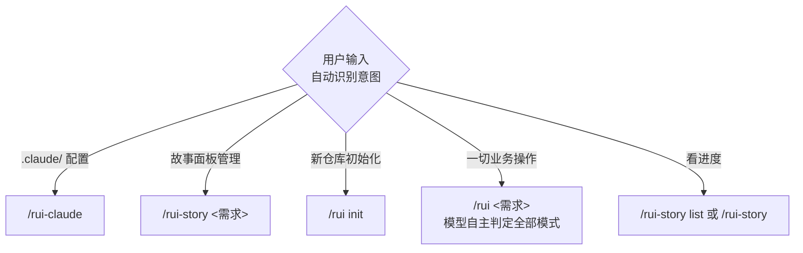

> `/rui <需求>` 内部自主判定逻辑见下节。`需求` 支持文本 / `@` 引用本地文件 / URL。`--name` 用 kebab-case 的 `<name>` 格式（如 `user-login`）。

### 写入命令（末端自动交付三步）

- `/rui init` — 建立项目基线：detect → explore → generate → setup → verify → trigger
- `/rui <需求> [--name <n>]` — 唯一写入入口：模型自主判定 新建基线 / 增量刷新 / 从源码反推 / 从本地补齐 / 实现 / 自改进 / 端到端
- `/rui-story <需求>` — 故事面板管理需求：解析 → 确定面板操作 → 执行 → 交付，仅限面板管理（sync/remove/health/merge/split）
- `/rui-claude <需求>` — .claude/ 配置需求：解析 → 故事拆分 → 逐故事 doc+code → 交付，仅限 .claude/ 内

### 只读命令（不触发 hook）

- `/rui` — 任务推荐：5 层链式管线评分排序

> 进度查询已迁移至 `/rui-story list` 和 `/rui-story`，详见 [rui-story SKILL.md](../rui-story/SKILL.md)。

## 管线一览

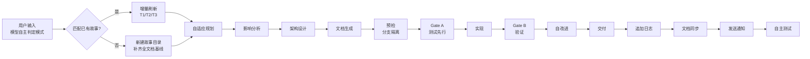

- 影响分析 / 证据等级 → [agents/AGENT.md](../../agents/AGENT.md)
- 分支隔离 / Gate A/B / P0 审查 → [rules/code-pipeline.md](../../rules/code-pipeline.md)
- 交付三步 / 文档同步 → [rules/delivery-gate.md](../../rules/delivery-gate.md)
- 诊断 D0–D7 / 评估 E1–E4 → [rules/self-improve.md](../../rules/self-improve.md)
- 文档生成约束 → [rules/doc-generation.md](../../rules/doc-generation.md)
- Agent 交接 → [agents/](../../agents/) 各角色

## 阻断标识

阻断后记录状态（`blocked=true` + `block_reason=<标识>`），重跑同命令从 `current_stage` 续。

**需求→文档阶段**
- `no-parse` — 需求无法解析
- `no-source` — P0 章节缺上游来源
- `chain-broken` — 影响链未闭合
- `doc-p0` — 文档 P0 不通过且无法自修复
- `no-doc-isolation` — 在非 `feat/<name>` 分支写入故事文档
- `bad-branch` — 分支未从 main 创建或混入非本故事代码
- `no-checkout` — 未切换故事分支即写入/改码

**预检→实现阶段**
- `no-branch-isolation` — `node skills/rui/branch-check.mjs` 验证失败（非 `feat/<name>` 时执行 Edit/Write）
- `skip-gate-a` — Gate A 未通过即编码

**实现→验证阶段**
- `code-p0` — 代码 P0 无法修复
- `gate-b-limit` — Gate B >2 轮

**交付阶段**
- `auto-merge` — 功能分支被自动合并到 main
- `no-token`（降级）— `API_X_TOKEN` 缺失
- `no-metrics`（降级）— self-improve 数据采集失败

## 核心约束

1. **逐故事串行** — 多故事按拆分顺序处理，互不交叉
2. **分支隔离（强制）** — 任何 Edit/Write 前必须验证当前分支为 `feat/<name>`：文档写入、code 改源码，均需分支隔离。禁止在 main 上写文档或改码、禁止派生、禁止自动合并。唯一例外：`/rui init`（写 CLAUDE.md/README.md 等项目级基线，不走故事分支）
3. **源码唯一入口** — 只能走 `/rui <需求>` 的实现模式改源码
4. **测试先行** — Gate A 阻断实现；Gate B >2 轮阻断交付
5. **逐模块 P0 清零** — 每模块审查后 P0 清零再前进
6. **只读反推** — `--from-code` / `--from-doc` 禁止改源码
7. **产出内聚** — 关键产出限定在 `docs/故事任务面板/<name>/`
8. **场景导向** — 文档由 [rules/doc-generation.md](../../rules/doc-generation.md) 约束：故事任务为基线（场景功能点表），场景-N-<slug>.md §0–§4 为全阶段统一文档
10. **交付强制** — 三步按序触发（hook-log → rui-import → rui-bot → self-test），详见 [强制集成](#强制集成)
11. **自主测试** — 每次故事任务变更后自动执行自检：基线完整性 · 文档一致性 · 分支隔离 · 安全合规；缺 self-test 故事目录时跳过不阻断
12. **表达优先** — 文档内容必须 图 → 结构化文本 → 表，架构/流程/关系优先 mermaid，不可降级。铁律四：验先于称、溯先于修、清先于进、表达优先

## 故事文档

> 基线 + N 场景文档模型。故事任务为基线（场景功能点表 · 知识图谱 hub），场景-N-<slug>.md §0–§4 为全阶段统一文档。公式见 [rules/doc-generation.md](../../rules/doc-generation.md)。

| 文件 | 阶段 | 基线 | 必选 |
|------|------|:---:|:---:|
| 故事任务.md | 文档生成 | 基线 | ✓ |
| 场景-N-<slug>.md | 全阶段 | — | ✓ |
| knowledge-graph.json | 实现 | — | ✓ |

## init

> 六步：探 → 察 → 生 → 架 → 搭 → 验 → 触。可重复运行，每次全量重生。CLAUDE.md 的 `<!-- rui:project-start -->` / `<!-- rui:project-end -->` 标记段每次覆盖，段外保留。

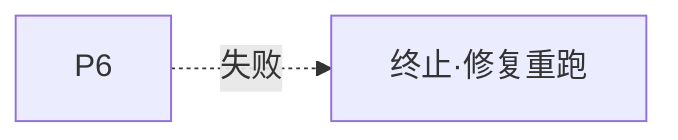

### 1. detect — 探测信号

抽取 profile 为后续阶段提供事实基线：

- **项目身份** — 仓库目录名 → 分支前缀；故事目录名纯语义 kebab-case，文档名不加项目前缀
- **项目类型** — 关键目录与配置文件 → frontend / backend / fullstack / meta / unknown（判定见下图）
- **项目清单** — 按生态文件抽取依赖 + 构建/测试命令 + 框架版本
- **安全面** — 源码关键词扫描：用户输入 / API / 存储 / 认证 / 第三方
- **测试框架** — 依赖 + 配置文件 → vitest / jest / pytest / go-test / cargo-test
- **架构模式** — 项目结构 → single / monorepo / microservice / plugin

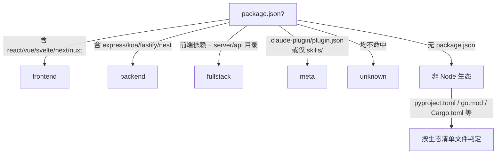

### 2. explore — 深度探索

阅读核心源码，理解架构模式、代码规范、安全面。验证并补充 profile 判断。**抽取模块地图**：识别项目内所有模块（skills/agents/rules 等），记录每个模块的入口文件、核心依赖、下游消费者，为后续架构故事生成提供事实基线。

### 3. generate — 生成内容

基于 profile + 探索发现直接编写文件：

- `CLAUDE.md` — 基础信念 + 铁律 + 退化对策 + 项目约束（含 `rui:project-start/end` 标记）+ 自约束
- `README.md` — 系统视图 + 命令流 + 快速开始 + 项目结构 + [领域语言段](../../README.md#领域语言)（术语定义 + 关系 + 示例对话 + 歧义标记）

### 4. arch — 补齐技术架构故事 + 自动化测试方案

> 自主生成两个故事目录：
> - `docs/故事任务面板/<project>-arch/` — 系统架构知识固化
> - `docs/故事任务面板/<project>-self-test/` — 项目自动化测试套件
>
> 基于 explore 阶段抽取的模块地图、项目拓扑事实和基线文档（CLAUDE.md / README.md）自主构建。

**4a. 技术架构故事** (`<project>-arch`)，按场景文档模型生成（委托 pm → coder → tester 逐文档生成），**≥5 场景**：

| # | 文档 | Agent | 内容 |
|---|------|-------|------|
| 1 | 故事任务.md | pm | 系统架构知识固化 + 模块地图 + ≥5 个场景（模块拓扑/数据流追踪/信任边界/依赖变更/新人上手），含 FP/AC/SC/风险 |
| 2–6 | 场景-1~5-<slug>.md §0 | coder | 逐场景技术评审：场景-1 模块地图与拓扑 · 场景-2 数据流与命令追踪 · 场景-3 信任边界与安全面 · 场景-4 依赖关系与变更影响 · 场景-5 新人上手与开发指南 |
| 7 | 场景-1~5-<slug>.md §1 | tester | 逐场景测试设计：架构验证用例（模块存在性/依赖完整性/信任边界/文档覆盖），五类全覆盖 |

**4b. 自动化测试套件** (`<project>-self-test`)，对项目源码搭建可执行的自动化测试体系，走完整文档 + code 管线，**≥5 场景**：

> init 阶段生成场景文档基线（故事任务 + 场景-1~5-<slug>.md §0 §1），随后自动进入 code 管线实现测试代码。产物包含可运行的测试文件，不只是文档。

| # | 文档 | Agent | 内容 |
|---|------|-------|------|
| 1 | 故事任务.md | pm | 项目自动化测试 Story + ≥5 个测试场景（核心业务逻辑/API 接口/数据持久化/异常路径/集成回归），含 FP/AC/SC/风险 |
| 2–6 | 场景-1~5-<slug>.md §0 | coder | 逐场景测试架构：场景-1 核心逻辑测试 · 场景-2 API 接口测试 · 场景-3 数据持久化测试 · 场景-4 异常路径与边界 · 场景-5 集成与回归 |
| 7 | 场景-1~5-<slug>.md §1 | tester | 逐场景可执行测试用例（含代码骨架）：按模块拆分，每模块 ≥3 条用例，标注覆盖率目标 |

**实现阶段**（code 管线）：
- 按技术评审选型安装测试依赖
- 逐模块编写测试文件，每模块完成即跑测试验证
- 最终输出：可运行的测试套件 + 覆盖率报告 + 实施报告 + 测试报告

**故事命名**：`<project>-arch`、`<project>-self-test`（如项目名 `YrY` → `yry-arch`、`yry-self-test`）。

### 5. setup — 机械搭建

- 创建 `docs/故事任务面板/`（如已由 arch 步骤创建则跳过）
- 生成 `.claude/skills/rui-bot/config.json`（schema 见 [rui-bot SKILL.md](../rui-bot/SKILL.md#内置配置)）

### 6. verify — 7 项就绪检查

任一失败即终止：

- CLAUDE.md 含 `rui:project-start` 标记 + 项目名
- README.md 含项目名
- README.md 含 `## 领域语言` 标题 + ≥3 个术语定义
- `docs/故事任务面板/` 目录存在
- `docs/故事任务面板/<project>-arch/` 目录存在，含 ≥5 场景文档基线
- `docs/故事任务面板/<project>-self-test/` 目录存在，含 ≥5 场景文档基线（故事任务 + 场景-1~5-<slug>.md §0 §1）+ 可执行测试文件
- `.claude/skills/rui-bot/config.json` 存在

### 7. trigger

验证通过后触发 rui-import（workspace 全量）+ rui-bot 通知。缺 token 跳过，网络失败告警不阻断。

### 产物

- `CLAUDE.md` — `rui:project-*` 标记内全量重生，段外保留
- `README.md` — 全量重生，领域语言段重复运行时增量补充
- `docs/故事任务面板/<project>-arch/` — 项目技术架构故事（场景文档基线），每次全量重生
- `docs/故事任务面板/<project>-self-test/` — 项目自动化测试套件（场景文档基线 + 可执行测试文件），每次全量重生
- `.claude/skills/rui-bot/config.json` — 每次覆盖

## /rui <需求> 统一入口

> `/rui <需求>` 是文档与实现的统一入口。模型根据上下文自主判定执行模式，无需用户选择子命令。
> `需求` 支持文本 / `@` 引用本地文件 / URL。`--name` 用 kebab-case。模型自主决定是否进入 code 阶段。

### 自主判定框架

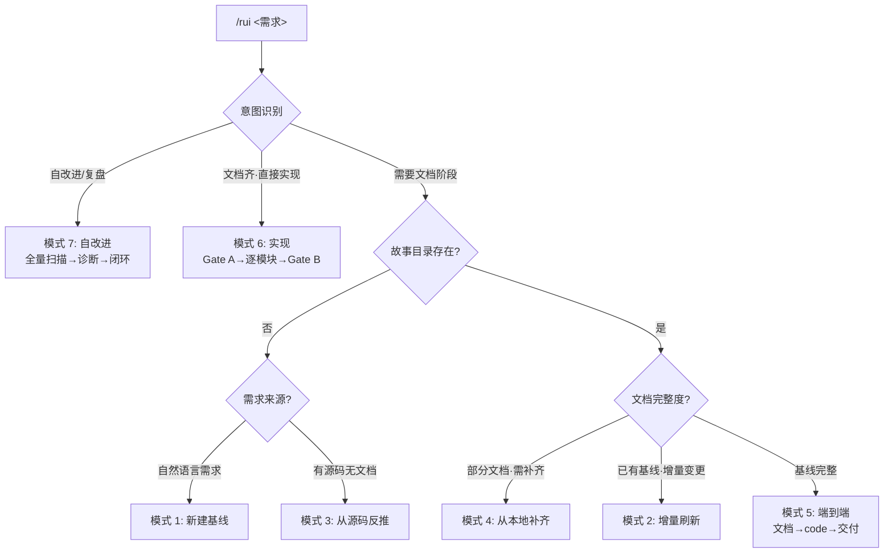

| 判定条件 | 模式 | 说明 |
|---------|------|------|
| 用户明确表达自改进/复盘意图 | 自改进 | 全量扫描所有故事→诊断→自主闭环 |
| 故事目录存在 + 基线完整 + 直接实现 | 实现 | 跳过文档阶段，Gate A → 逐模块 → Gate B |
| 故事目录不存在 + 自然语言需求 | 新建故事基线 | pm 拆分需求 → 生成完整文档基线 |
| 故事目录不存在 + 有源码无文档 | 从源码反推 | 只读源码提取结构/接口/依赖 → 生成文档基线 |
| 故事目录存在 + 部分文档 | 从本地补齐 | 扫描已有文档 → 仅生成缺失章节，不覆盖已有 |
| 故事目录存在 + 增量变更上下文 | 增量刷新 | T1/T2/T3 按变更范围自动裁剪管线 |
| 故事目录存在 + 基线完整 | 端到端 | 文档基线 → 自动衔接 code → 交付 |

> 模型自主决定何时进入 code 阶段。不确定时默认保守：优先补齐文档。

### 通用约束（所有模式）

- **只读源码** — 文档阶段不修改任何源码文件
- **分支隔离** — 所有写入操作必须在 `feat/<name>` 分支上执行
- **逐故事串行** — 多故事按拆分顺序处理，互不交叉
- **表达优先** — 文档必须 图 → 结构化文本 → 表，不可降级
- **烧烤纪律** — pm 挑战模糊术语、走完决策树、用领域语言命名、不确定 > 2 项不推进
- **技术术语隔离** — 故事任务文档禁止包含技术术语（代码路径/API 路由/组件名/技术栈名）
- **主要价值节** — 每文档必须含 `### 主要价值` 节，≥ 4 条 emoji 前缀行
- **回溯链** — 每文档必须含来源引用 + 变更记录
- **逐文件自动导入** — 每个文档 Write 后立即执行 `node skills/rui/import-doc.mjs <file-path>`
- **项目类型裁剪** — 场景文档 §0 按项目类型跳过不适用章节

---

### 模式 1: 新建故事基线

> 需求到文档基线的完整管线。pm 拆需求为故事 → coder/tester 补齐设计文档。全程只读源码，多故事串行。
> 文档结构与约束见 **[rules/doc-generation.md](../../rules/doc-generation.md)**。

#### 效果示意

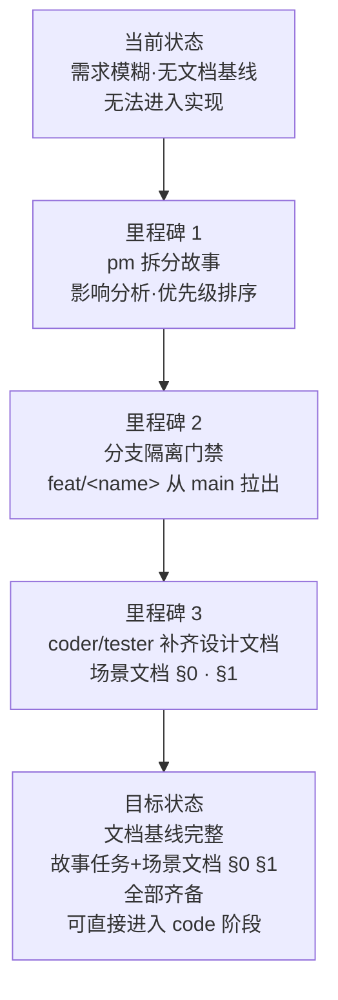

#### 三步管线

| 步 | Agent | 动作 | 约束 |
|----|-------|------|------|
| 1 | pm | 解析需求 → 影响分析 → 拆分故事 → 写入故事任务.md | 研究优先：Read/Grep/Glob 建立事实基线再拆分；不确定 > 2 项不推进，阻断 `no-parse` |
| 2 | 管线 | 分支隔离门禁：验证 `feat/<name>` | 非 feat 分支阻断 `no-doc-isolation`；分支必须从 main 拉出；`node skills/rui/branch-check.mjs --story=<name> --mode=write` |
| 3 | coder → tester | 生成场景文档 §0（技术评审）+ §1（测试设计） | 按 doc-generation.md 约束；coder 独立 §0，tester 独立 §1；Gate A 交接信号完整 |

约束遵循 [通用约束](#通用约束所有模式) + `node skills/rui/branch-check.mjs --story=<name> --mode=write`。

**产出**：故事任务.md（基线）· 场景-N-<slug>.md（§0 技术评审 + §1 测试设计）

**逐文件自动导入**（强制）：每个文档生成后**必须**立即执行 `node skills/rui/import-doc.mjs <file-path>` 导入远端。此为硬性步骤，不可跳过或推迟到批量安全网。导入失败不阻断管线，记录告警后继续。


**末端触发** [强制集成](#强制集成)。

---

### 模式 2: 增量刷新

> 增量更新，模型自主判定变更范围 T1/T2/T3，按级别自动裁剪管线。模型自主决定是否进入 code 阶段。
>
> **写入前先验证分支隔离。** 无论 T1/T2/T3，只要涉及 Edit/Write 就必须先在 `feat/<name>` 分支上。

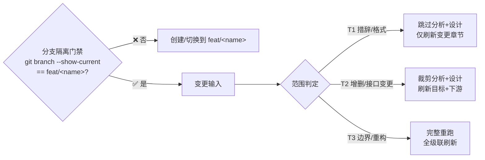

| 级别 | 范围 | 影响分析 | 架构设计 | 文档刷新 |
|------|------|---------|---------|---------|
| T1 | 措辞 / 格式 | 跳过 | 跳过 | 仅变更章节 |
| T2 | 增删故事 / 接口变更 | 裁剪 | 裁剪 | 目标 + 下游 |
| T3 | 边界变化 / 跨故事重构 | 完整重跑 | 完整重跑 | 全级联刷新 |

**末端触发** [强制集成](#强制集成)。

---

### 模式 3: 从源码反推

> 存量代码库的文档生成入口。需求为空时 pm 扫描推荐列表；需求有值时从源码反推完整故事文档。全程只读，证据 Level B + 源码路径。

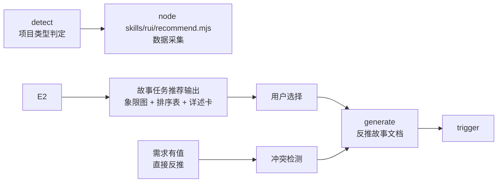

#### 需求为空 — 推荐引路

5 步推荐管线，数据驱动 + 框架评分：

1. **detect** — 判定项目类型（frontend / backend / fullstack / unknown）
2. **scan** — `node skills/rui/recommend.mjs --root . --type <detected> --format json`
3. **present** — 输出故事任务推荐：象限图 → 排序表 → 每故事任务详述卡（覆盖范围·源码证据·预计产出·可执行命令）
4. **wait** — 等待用户选择后进入生成阶段

#### 需求有值 — 直接生成全文档基线

> 从源码反推场景文档基线到 `docs/故事任务面板/<name>/`。全程只读源码，证据 Level B + 源码路径，缺口标「待补充」。
> 多故事时按 `recommend.mjs` 输出的 storyName 顺序串行，互不交叉。

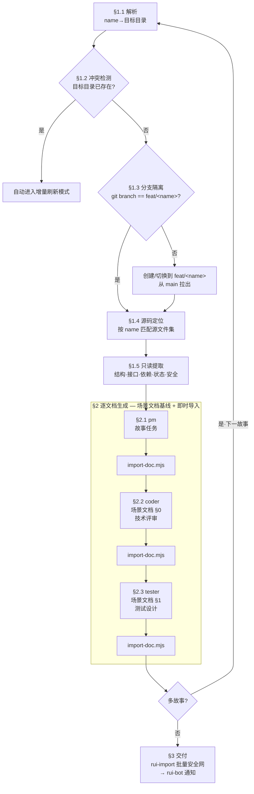

**末端触发** [强制集成](#强制集成)。

---

### 模式 4: 从本地补齐

> 故事目录已存在但文档不完整时，扫描已有文档，识别缺失章节，仅生成缺失部分，不覆盖已有内容。

1. **扫描已有** — 读取 `docs/故事任务面板/<name>/` 下所有文件
2. **识别缺口** — 按 doc-generation.md 场景文档模型对照，标记缺失的 §0/§1/§2/§3/§4 节
3. **补全缺失** — 仅生成缺失章节，已有内容原封不动
4. **不覆盖** — 已存在的文件/章节跳过，冲突时报错提示手动处理

**末端触发** [强制集成](#强制集成)。

---

### 模式 5: 端到端

> 默认行为：文档基线完成后，模型自主决定衔接 code 阶段，文档 → 实现 → 验证 → 交付一气呵成。

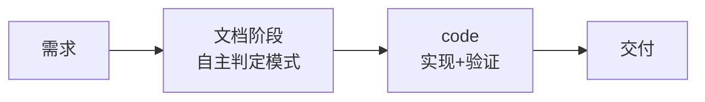

**末端触发** [强制集成](#强制集成)。

---

### 模式 6: 实现

> 源码改动唯一入口。分支隔离强制门禁 → Gate A 测试先行 → 逐模块 P0 清零 → Gate B ≤2 轮 → 自改进 D0–D7 → 交付。

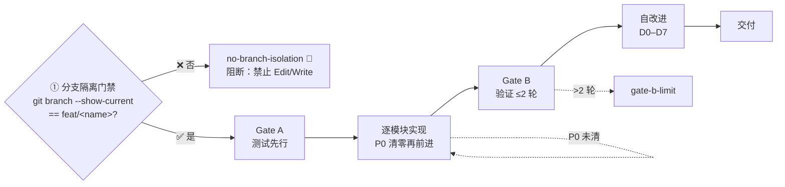

**产出**：场景-N-<slug>.md（§2 实施报告 · §3 测试报告 · §4 自改进追加填充）

**逐文件自动导入**（强制）：每个报告文档生成后**必须**立即执行 `node skills/rui/import-doc.mjs <file-path>` 导入远端，规则同文档阶段。

**约束**：源码唯一入口 · Gate A `场景文档 §1` 不存在即阻断 · Gate B >2 轮阻断 · P0 不清零不进下一模块

**末端触发** [强制集成](#强制集成)。

---

### 模式 7: 自改进

> 自改进闭环：全自主扫描所有故事，诊断→实现→验证→版本升级，循环至无改进空间或达到上限。
>
> **每个闭环自动为涉及的故事升级版本号**（语义化版本：内容改进→补丁升级，新功能→次版本升级，架构变更→主版本升级）。
>
> **参数**：`/rui <需求> --depth N` — `--depth` 指定最大闭环次数，默认 3。模型自主识别自改进意图时自动进入此模式。

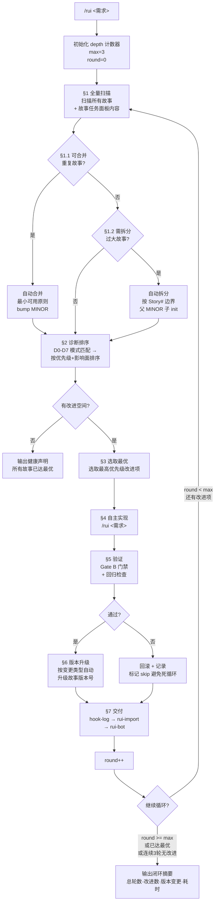

### §1.1–1.2 自动合并与拆分

> yry 在扫描阶段自动检测可合并的重复故事和需拆分的大故事，全自动执行，无需手动干预。

| 检测 | 条件 | 行为 |
|------|------|------|
| 自动合并 | 远端+本地存在内容重叠 ≥ 70% 的故事 | 按最小可用原则合并（保留信息量最大版本），bump MINOR |
| 自动拆分 | 故事含 ≥ 8 个 Story# 或 ≥ 15 个 FP# | 按 Story# 独立性拆分边界，父 bump MINOR，子 init 1.0.0 |

### 版本管理

> 每个故事维护语义化版本 `MAJOR.MINOR.PATCH`。每次闭环完成时自动升级。

| 变更类型 | 版本升级 | 示例 |
|---------|---------|------|
| 措辞修正 / 格式调整 | PATCH (`1.0.0` → `1.0.1`) | T1 增量刷新 |
| 增删功能 / 接口变更 | MINOR (`1.0.1` → `1.1.0`) | T2 增量刷新 |
| 边界变化 / 架构重构 | MAJOR (`1.1.0` → `2.0.0`) | T3 增量刷新 |

**版本判定规则**：

| 规则 | 说明 |
|------|------|
| 初始版本 | 故事首次创建时 `version: "1.0.0"` |
| 自动升级 | yry 闭环完成后根据变更类型自动 bump |
| 手动升级 | `/rui <需求>` 完成后由管线自动 bump |
| 版本记录 | 每次升级通过 git commit + tag 记录 |
| 版本展示 | 查看 git tag + commit 链中的版本记录 |

**版本记录格式**：

```json
{
  "version": "1.2.1",
  "version_history": [
    {"version": "1.0.0", "date": "2026-05-20", "trigger": "/rui <需求> (from-code)", "change": "初始生成"},
    {"version": "1.1.0", "date": "2026-05-21", "trigger": "/rui <需求>", "change": "补充接口数据请求流"},
    {"version": "1.2.0", "date": "2026-05-22", "trigger": "/rui <需求>", "change": "追加状态管理和指标采集"},
    {"version": "1.2.1", "date": "2026-05-22", "trigger": "/rui yry", "change": "自动修复 P1 格式问题"}
  ]
}
```

### 终止条件

| 条件 | 说明 |
|------|------|
| 达到深度上限 | `round >= --depth`（默认 3），强制终止循环 |
| 无改进空间 | 所有 D0-D7 诊断通过，无待处理提案 |
| 连续 3 轮无效 | 连续 3 轮无实质性变更（仅格式或空操作） |
| 用户中断 | Ctrl+C 或关闭会话 |
| 阻断不可自愈 | 遇到 `doc-p0` / `code-p0` 等需要人工决策的阻断 |

优先顺序：深度上限 > 无改进空间 > 连续无效 > 用户中断 > 阻断

### 约束

| 约束 | 规则 |
|------|------|
| 全自主 | 无用户交互，自动决策和实现 |
| 逐故事 | 每次闭环处理一个故事的一个改进项 |
| 分支隔离 | 每故事自动创建/切换到 `feat/<name>` |
| 版本强制 | 每次闭环完成必须 bump 版本号 |
| 防死循环 | 同一改进项失败 ≥ 2 次 → skip + 记录 |
| 深度约束 | `--depth` 指定最大闭环次数，默认 3，≤ 0 时仅扫描不执行 |
| 无改进不 bump | 若闭环未产生实质变更，不升级版本 |

**末端触发** [强制集成](#强制集成)。

---

### 模式 8: 从文档反推补全

> 从已有文档反推，只读源码补全缺失文档（实施报告/测试报告/自改进复盘），不覆盖已有。

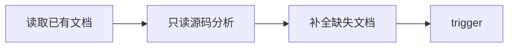

**约束**：只读 · 不覆盖已有 · 分支隔离

**末端触发** [强制集成](#强制集成)。
