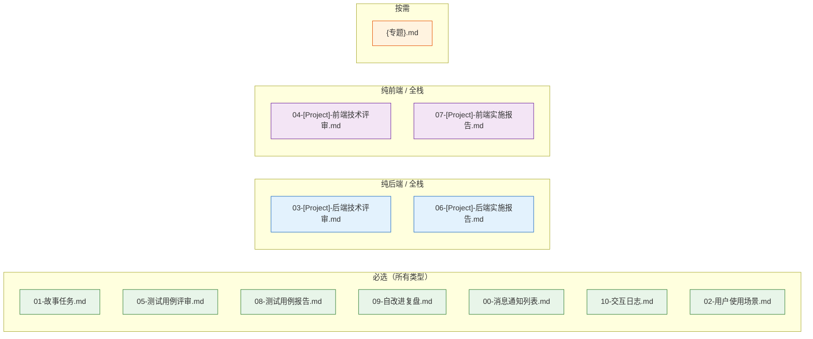
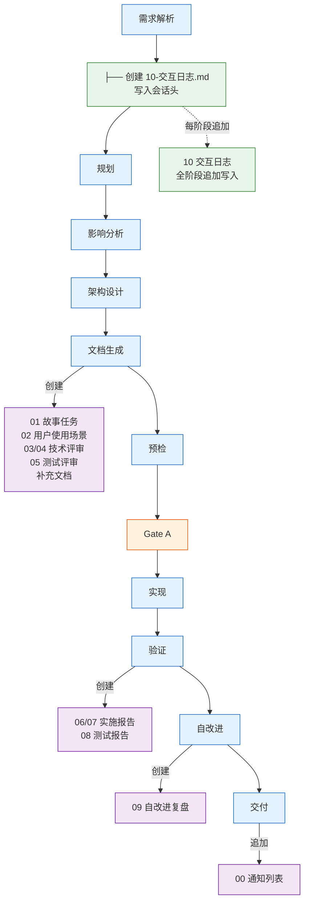
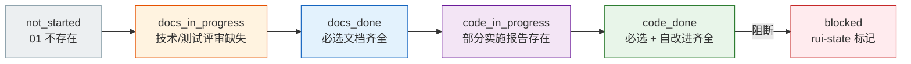
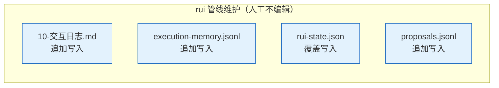

# coder 工作手册

> 三件事：**写到哪个目录**、**文档按什么生命周期创建**、**附属数据怎么落**。

故事文档公式（F.story.\* / F.supp.\*）见 [formulas.md](./formulas.md)；强制约束见 [rules/doc-generation.md](../../rules/doc-generation.md)；coder 角色契约见 [agents/coder.md](../../agents/coder.md)。故事拆分决策树见 [agents/pm.md](../../agents/pm.md)。

## 目录布局

```
docs/
└── 故事任务面板/<name>/   ← 执行：主线 + 通知 + 交互日志 + 补充
```

**命名规则**：`<Project>` 大驼峰（`YiWeb`），`<name>` kebab-case（`user-login`）。CLI 输入 `<Project>-<name>`，rui 管线内分解为路径 `<name>`。详见 [rules/doc-generation.md](../../rules/doc-generation.md)。

## 故事目录骨架



| 文件 | 必选 | 纯前端 | 纯后端 | 全栈 | 负责人 | 阶段 |
|------|:---:|:---:|:---:|:---:|--------|------|
| 01-故事任务.md | ✓ | ✓ | ✓ | ✓ | pm | 文档生成 |
| 03-&lt;Project&gt;-后端技术评审.md | | — | ✓ | ✓ | coder + security | 文档生成 |
| 04-&lt;Project&gt;-前端技术评审.md | | ✓ | — | ✓ | coder | 文档生成 |
| 05-测试用例评审.md | ✓ | ✓ | ✓ | ✓ | tester | 文档生成 |
| 06-&lt;Project&gt;-后端实施报告.md | | — | ✓ | ✓ | coder | 验证 |
| 07-&lt;Project&gt;-前端实施报告.md | | ✓ | — | ✓ | coder | 验证 |
| 08-测试用例报告.md | ✓ | ✓ | ✓ | ✓ | tester | 验证 |
| 09-自改进复盘.md | ✓ | ✓ | ✓ | ✓ | pm + reporter | 自改进 |
| 00-消息通知列表.md | 自动 | ✓ | ✓ | ✓ | wework-bot hook | 交付 |
| 10-交互日志.md | ✓ | ✓ | ✓ | ✓ | rui 管线 | 全阶段 |
| 02-用户使用场景.md | ✓ | ✓ | ✓ | ✓ | pm | 文档生成 |
| {专题}.md | 按需 | — | — | — | pm 决策 | 文档生成 |

补充文档按需触发，决策树见 [rules/doc-generation.md](../../rules/doc-generation.md#补充文档)，公式见 [formulas.md](./formulas.md#补充文档公式)。

附属（rui 管线维护，不入库审查）：

```
.improvement/proposals.jsonl       ← 自改进提案（追加）
.memory/execution-memory.jsonl     ← 执行记忆（追加）
.memory/rui-state.json             ← 管线状态（覆盖）
```

> **编号即顺序**：文件名编号前缀对应管线阶段顺序。01 是唯一真相源，技术评审（03/04/05）在文档生成阶段创建，实施与测试报告（06/07/08）在验证阶段创建——不可提前。

## 文件创建生命周期



每次阶段变更：`rui-state.json` 覆盖写；过程追加到 `execution-memory.jsonl`；自改进提案追加到 `proposals.jsonl`；每次人机交互追加到 `10-交互日志.md`。

## 完整度判定



| 状态 | 条件 |
|------|------|
| `not_started` | 故事任务文档不存在 |
| `docs_in_progress` | 故事任务文档存在，技术评审或测试评审有缺失 |
| `docs_done` | 所有必选文档文件存在（含 10-交互日志.md 已创建） |
| `code_in_progress` | 文档齐全，部分实施报告存在 |
| `code_done` | 所有必选文件及自改进复盘存在（含 10-交互日志.md 持续追加） |
| `blocked` | `rui-state.json` 中 `blocked=true` |

完整度按文件存在性判定；任务推荐按链式管线分层评分排序：阻断 → 故事推进 → 覆盖 → 健康 → 同步。

---

## 数据契约

> 每个故事目录的 `.memory/` 与 `.improvement/` 由 rui 管线维护，字段由本节唯一定义。人工不编辑、不入库审查。



```
docs/故事任务面板/<name>/
├── 10-交互日志.md                   ← rui 管线追加写入
├── .improvement/
│   └── proposals.jsonl              ← self-improve 追加
└── .memory/
    ├── execution-memory.jsonl       ← 每次阶段变更追加
    └── rui-state.json               ← 当前状态覆盖写
```

### 数据流


### 写入规则

| 规则 | 说明 |
|------|------|
| append-only | `10-交互日志.md` · `execution-memory.jsonl` · `proposals.jsonl` 仅追加，不重写 |
| 覆盖写 | `rui-state.json` 每次阶段变更覆盖整个文件 |
| 不手编 | 四个文件均由 rui 管线维护，人工编辑会破坏字段一致性 |
| 不入库审查 | 附属目录是元数据，不进入文档审查清单 |

### 10-交互日志.md

追加写入，markdown 格式。`需求解析` 阶段创建文件并写入会话头，此后每次人机交互轮次追加一条记录。

```markdown
> 交互日志 · 追加写入 · rui 管线自动维护

## 会话 <session_id> — {YYYY-MM-DD}

### {HH:mm:ss} | turn-{N} | {agent}

**👤 用户**:
{用户输入全文}

**🤖 助手**:
{助手响应/执行动作摘要}

**📋 关键决策**:
- {本轮决策、产出文件、阻断等}

---
```

| 约束 | 规则 |
|------|------|
| 写入模式 | append-only，不重写 |
| 目录不存在 | 递归创建 |
| 维护者 | rui 管线自动维护，人工不编辑 |
| 入审查 | 否（附属元数据，不入库审查） |
| 内容完整性 | 每次人机交互轮次均追加，含用户输入和助手响应的全文 |
| session_id | 与 `rui-state.json` 的 `session_id` 一致 |

### execution-memory.jsonl

追加写入，每行一个 JSON 对象。

| 字段 | 类型 | 含义 |
|------|------|------|
| `session_id` | string | 当次 rui 会话 |
| `timestamp` | ISO-8601 | 写入时刻 |
| `story_name` | string | `<Project>-<name>` |
| `feature` / `description` | string | 变更主题 |
| `planned_change_level` | T1\|T2\|T3 | 规划裁剪等级 |
| `actual_change_level` | T1\|T2\|T3 | 实际裁剪等级 |
| `phase_transitions` | `[{from,to,timestamp,duration_ms}]` | 阶段切换轨迹 |
| `update_context` | string | `/rui update` 上下文 |
| `agents_called` | string[] | 触达的 Agent |
| `quality_issues` | `{P0,P1,P2}` | 各级别问题列表 |
| `bad_cases` | `[{agent,lesson}]` | 失败教训 |
| `was_blocked` | bool | 是否被阻断 |
| `block_reason` | string | 阻断标识 |

### rui-state.json

单对象 JSON，每次阶段变更覆盖写。

| 字段 | 类型 | 含义 |
|------|------|------|
| `session_id` | string | 当次会话 |
| `command` | string | rui 子命令 |
| `name` | string | `<Project>-<name>` |
| `current_stage` | string | 当前阶段 |
| `blocked` | bool | 是否阻断 |
| `block_reason` | string | 阻断标识 |
| `timestamp` | ISO-8601 | 最近写入 |
| `storyboard` | object | 故事板快照 |
| `pipeline_progress` | `{阶段: completed\|in_progress\|blocked\|not_started\|skipped}` | 各阶段进度 |
| `delivery_pipeline` | `{log_appended, docs_synced, notification_sent, last_step_at, last_step}` | 三步交付状态 |
| `change_history` | `[{timestamp,from_stage,to_stage,trigger}]` | 阶段变更历史 |
| `related_proposals` | string[] | 关联提案 ID |
| `no_code` | bool | `--no-code` 模式标记 |

**恢复策略**：重跑同 `/rui` 命令从 `current_stage` 续。`--no-code` 模式下代码阶段全部标记 `skipped`，直接进入交付。

### proposals.jsonl

self-improve 引擎追加写入。

| 字段 | 类型 | 含义 |
|------|------|------|
| `id` | string | 提案 ID |
| `date` | ISO-8601 | 创建日期 |
| `title` | string | 标题 |
| `type` | refactor\|perf\|security\|quality\|process | 类别 |
| `priority` | P0\|P1\|P2\|P3 | 优先级 |
| `status` | open\|done\|superseded | 状态 |
| `story_name` | string | 来源故事 |
| `source_phase` | string | 触发阶段 |
| `actionable_command` | string | 可执行动作 |
| `linked_memory_ids` | string[] | 关联的记忆条目 |
| `problem_source` / `evidence` | string | 数据证据 |
| `current_state` / `target_state` | string | 当前 → 目标 |
| `s1_metrics` | object | 耦合/内聚/边界 |
| `s2_metrics` | object | 阻断率/问题轮次 |
| `feedback` | `[{rating,note,date}]` | 反馈记录 |
| `eval_result` | improved\|degraded\|neutral\|pending | 效果评估 |

效果评估需前后各足够条数的执行记忆才有中等置信度，规则见 [rules/self-improve.md](../../rules/self-improve.md)。

## 生效标志

| 标志 | 未达标的处置 |
|------|------------|
| 目录 `<name>/` 命名合规 | 移动文件到正确目录 |
| 按项目类型必选文档齐全 | 补创建缺失文档 |
| 首尾导航块 + 跨文档引用完整 | 补 F.nav 导航块（见 [formulas.md](./formulas.md)） |
| 数据契约四文件由 rui 管线维护 | 撤销人工编辑，以管线写入为准 |
| 完整度状态机判定精确 | 核对 rui-state.json，修正状态 |
