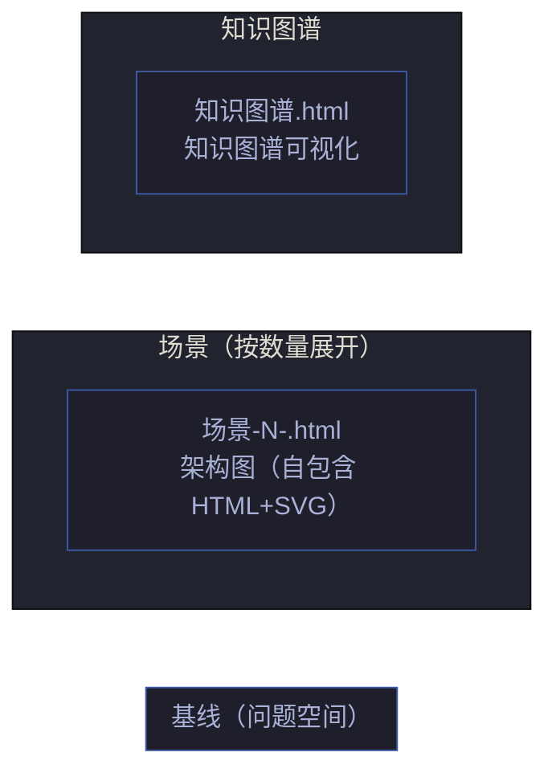
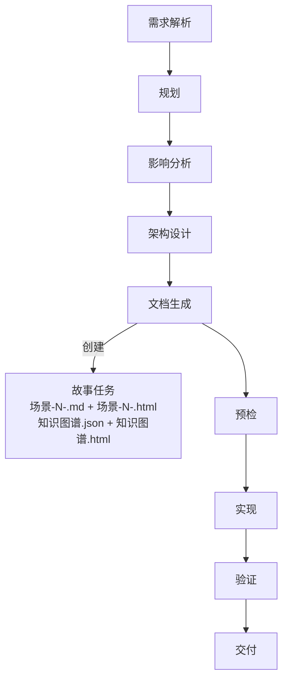
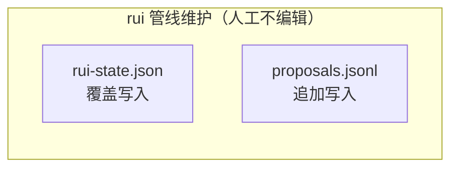
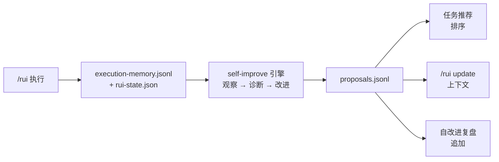

# coder 工作手册

> 三件事：**写到哪个目录**、**文档按什么生命周期创建**、**附属数据怎么落**。

故事文档公式（F.story.\* / F.supp.\*）见 [formulas.md](./formulas.md)；强制约束见 [rules/doc-generation.md](../rui-html/rules/doc-generation.md)；coder 角色契约见 [agents/coder.md](./coder.md)。故事拆分决策树见 [agents/pm.md](./pm.md)。

[目录布局](#目录布局) · [故事目录骨架](#故事目录骨架) · [文件创建生命周期](#文件创建生命周期) · [完整度判定](#完整度判定) · [数据契约](#数据契约) · [生效标志](#生效标志)

## 目录布局

```
docs/
└── 故事任务面板/<name>/   ← 执行：主线 + 补充
```

**命名规则**：`<name>` 纯语义 kebab-case（如 `user-login`、`claude-config`），不加项目名前缀。CLI 输入 `<name>`，对应路径 `docs/故事任务面板/<name>/`。详见 [rules/doc-generation.md](../rui-html/rules/doc-generation.md)。

## 故事目录骨架



| 文件 | 必选 | 负责人 | 阶段 |
|------|:---:|--------|------|
| 故事任务.md | ✓ | pm | 文档生成 |
| 场景-N-.md | ✓（≥1） | pm | 文档生成 |
| 场景-N-.html | ✓（每个场景 1 个） | coder | 文档生成（伴随场景.md） |
| 知识图谱.json | ✓ | pm → coder 更新 | 文档生成 + 实现 |
| 知识图谱.html | ✓ | coder | 文档生成（基于知识图谱.json 渲染） |

补充文档按需触发，决策树见 [rules/doc-generation.md](../rui-html/rules/doc-generation.md#补充文档)，公式见 [formulas/supplement.md](./formulas/supplement.md)。

附属（rui 管线维护，不入库审查）：

```
.improvement/proposals.jsonl       ← 自改进提案（追加）
.memory/execution-memory.jsonl     ← 执行记忆（追加）
.memory/rui-state.json             ← 管线状态（覆盖）
```

### Init 项目级 Index.html 骨架

> `/rui init` 时生成三张项目级概览页（深色主题，使用 `skills/rui/resources/overview-template.html` 模板）：

```
docs/index.html      ← 项目概览（六维统计：依赖/框架 · 故事 · 场景 · 模块 · 测试 · 交互示例）
tests/index.html     ← 测试概览（测试用例列表 + 通过率 + 覆盖矩阵）
docs/故事任务面板/yry-arch/演示/index.html     ← 交互示例概览（demo 组件列表 + 截图 + 操作路径）
```

| 页面 | 统计维度 | 初始值 | 更新时机 |
|------|---------|--------|---------|
| `docs/index.html` | 六维：依赖/框架数、故事数、场景数、模块数、测试用例数、交互示例数 | 按 init 检测结果填充 | 每次 `/rui` 管线完成时刷新 |
| `tests/index.html` | 测试用例列表 + 分类（正常/边界/异常/回归） | 按 test 目录检测结果 | Gate B 通过后更新 |
| `demos/index.html` | 交互示例列表 + 分类 | 按场景-1-模块定位目录检测结果 | 文档生成阶段更新 |

**模板**：`skills/rui/resources/overview-template.html` — 深色主题 + 六维统计卡片 + 能力面板 + 导出工具栏。
`docs/index.html` 的 6 个 stats 指标固定为：**第三方依赖/框架、故事、场景、业务模块/视图模块、测试用例、交互示例**。

> **文档按管线阶段顺序创建**：故事任务是基线（问题空间），场景文档+架构图+知识图谱+补充文档是解决方案层——不可提前创建。场景 §2-§4 由 code 阶段填充。

## 文件创建生命周期



每次阶段变更：`rui-state.json` 覆盖写；过程追加到 `execution-memory.jsonl`；自改进提案追加到 `proposals.jsonl`。

## 完整度判定


| 状态 | 条件 |
|------|------|
| `任务` | 故事任务.md 不存在 |
| `设计` | 故事任务存在，场景-N-.md / 知识图谱.json 有缺失 |
| `实施` | 故事任务 + ≥1 场景(.md+.html) + 知识图谱(.json+.html) 齐全 |
| `完成` | 全部制品齐全，通知已触发 |

完整度按文件存在性判定；任务推荐按链式管线分层评分排序：阻断 → 故事推进 → 覆盖 → 健康 → 同步。

---

## 数据契约

> 每个故事目录的 `.memory/` 与 `.improvement/` 由 rui 管线维护，字段由本节唯一定义。人工不编辑、不入库审查。



```
docs/故事任务面板/<name>/
├── .improvement/
│   └── proposals.jsonl              ← self-improve 追加
└── .memory/
    ├── execution-memory.jsonl       ← 每次阶段变更追加
    └── rui-state.json               ← 当前状态覆盖写
```

### 数据流



### 写入规则

| 规则 | 说明 |
|------|------|
| append-only | `execution-memory.jsonl` · `proposals.jsonl` 仅追加，不重写 |
| 覆盖写 | `rui-state.json` 每次阶段变更覆盖整个文件 |
| 不手编 | 三个文件均由 rui 管线维护，人工编辑会破坏字段一致性 |
| 不入库审查 | 附属目录是元数据，不进入文档审查清单 |

### execution-memory.jsonl

追加写入，每行一个 JSON 对象。

| 字段 | 类型 | 含义 |
|------|------|------|
| `session_id` | string | 当次 rui 会话 |
| `timestamp` | ISO-8601 | 写入时刻 |
| `story_name` | string | `<name>` |
| `feature` / `description` | string | 变更主题 |
| `planned_change_level` | T1\|T2\|T3 | 规划裁剪等级 |
| `actual_change_level` | T1\|T2\|T3 | 实际裁剪等级 |
| `phase_transitions` | `[{from,to,timestamp,duration_ms}]` | 阶段切换轨迹 |
| `update_context` | string | `/rui update` 上下文 |
| `agents_called` | string[] | 触达的 Agent |
| `quality_issues` | `{P0,P1,P2}` | 各级别问题列表 |
| `bad_cases` | `[{agent,lesson}]` | 失败教训 |
| `was_blocked` | bool | 是否被阻断 |
| `block_reason` | string | 阻断标识 |

### rui-state.json

单对象 JSON，每次阶段变更覆盖写。

| 字段 | 类型 | 含义 |
|------|------|------|
| `session_id` | string | 当次会话 |
| `command` | string | rui 子命令 |
| `name` | string | `<name>` |
| `current_stage` | string | 当前阶段 |
| `blocked` | bool | 是否阻断 |
| `block_reason` | string | 阻断标识 |
| `timestamp` | ISO-8601 | 最近写入 |
| `storyboard` | object | 故事板快照 |
| `pipeline_progress` | `{阶段: completed\|in_progress\|blocked\|not_started\|skipped}` | 各阶段进度 |
| `delivery_pipeline` | `{log_appended, docs_synced, notification_sent, last_step_at, last_step}` | 三步交付状态 |
| `change_history` | `[{timestamp,from_stage,to_stage,trigger}]` | 阶段变更历史 |
| `related_proposals` | string[] | 关联提案 ID |
| `no_code` | bool | `--no-code` 模式标记 |

**恢复策略**：重跑同 `/rui` 命令从 `current_stage` 续。`--no-code` 模式下代码阶段全部标记 `skipped`，直接进入交付。

### proposals.jsonl

self-improve 引擎追加写入。

| 字段 | 类型 | 含义 |
|------|------|------|
| `id` | string | 提案 ID |
| `date` | ISO-8601 | 创建日期 |
| `title` | string | 标题 |
| `type` | refactor\|perf\|security\|quality\|process | 类别 |
| `priority` | P0\|P1\|P2\|P3 | 优先级 |
| `status` | open\|done\|superseded | 状态 |
| `story_name` | string | 来源故事 |
| `source_phase` | string | 触发阶段 |
| `actionable_command` | string | 可执行动作 |
| `linked_memory_ids` | string[] | 关联的记忆条目 |
| `problem_source` / `evidence` | string | 数据证据 |
| `current_state` / `target_state` | string | 当前 → 目标 |
| `s1_metrics` | object | 耦合/内聚/边界 |
| `s2_metrics` | object | 阻断率/问题轮次 |
| `feedback` | `[{rating,note,date}]` | 反馈记录 |
| `eval_result` | improved\|degraded\|neutral\|pending | 效果评估 |

效果评估需前后各足够条数的执行记忆才有中等置信度，规则见 [rules/self-improve.md](../rui-yry/rules/self-improve.md)。

## 生效标志

| 标志 | 未达标的处置 |
|------|------------|
| 目录 `<name>/` 命名合规 | 移动文件到正确目录 |
| 按项目类型必选文档齐全 | 补创建缺失文档 |
| 首尾导航块 + 跨文档引用完整 | 补 F.nav 导航块（见 [formulas.md](./formulas.md)） |
| 数据契约四文件由 rui 管线维护 | 撤销人工编辑，以管线写入为准 |
| 完整度状态机判定精确 | 核对 rui-state.json，修正状态 |
