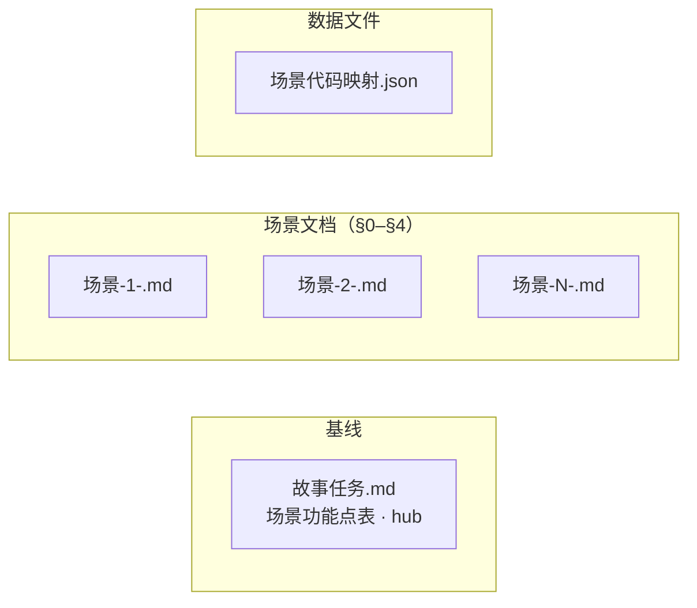
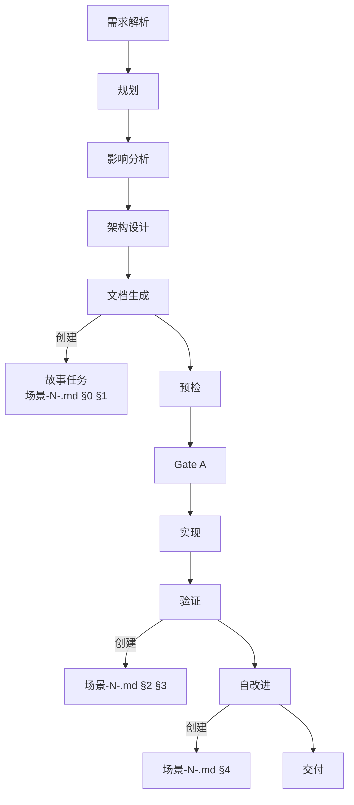

# coder 工作手册

> 三件事：**写到哪个目录**、**文档按什么生命周期创建**、**附属数据怎么落**。

文档生成约束见 [rules/doc-generation.md](../../rules/doc-generation.md)，含全部公式与模板引用；coder 角色契约见 [agents/coder.md](../../agents/coder.md)。故事拆分决策树见 [agents/pm.md](../../agents/pm.md)。

[目录布局](#目录布局) · [故事目录骨架](#故事目录骨架) · [文件创建生命周期](#文件创建生命周期) · [完整度判定](#完整度判定) · [数据契约](#数据契约) · [生效标志](#生效标志)

## 目录布局

```
docs/
└── 故事任务面板/<name>/   ← 执行：主线 + 补充
```

**命名规则**：`<name>` 纯语义 kebab-case（如 `user-login`、`claude-config`），不加项目名前缀。CLI 输入 `<name>`，对应路径 `docs/故事任务面板/<name>/`。详见 [rules/doc-generation.md](../../rules/doc-generation.md)。

## 故事目录骨架



| 文件 | 必选 | 负责人 | 阶段 |
|------|:---:|--------|------|
| 故事任务.md | ✓ | pm | 文档生成 |
| 场景-N-<slug>.md | ✓ | coder/tester/si | 全阶段（§0–§4 逐节填充） |
| 场景代码映射.json | ✓ | coder | 实现 |
| {专题}.md | 按需 | pm 决策 | 文档生成 |

补充文档按需触发，约束见 [rules/doc-generation.md](../../rules/doc-generation.md#补充文档)。

> **文档按管线阶段顺序创建**：故事任务是基线，场景-N-<slug>.md §0–§4 按阶段逐节填充——不可提前创建。

## 文件创建生命周期




## 完整度判定


| 状态 | 条件 |
|------|------|
| `任务` | 故事任务文档不存在 |
| `设计` | 故事任务存在，场景文档缺失或 §0 §1 不完整 |
| `实施` | 场景文档 §0 §1 完整，§2 不存在 |
| `测试` | 场景文档 §2 存在，§3 不存在 |
| `报告` | 场景文档 §3 存在，§4 不存在 |
| `改进` | 场景文档 §4 存在 |

完整度按文件存在性判定；任务推荐按链式管线分层评分排序：阻断 → 故事推进 → 覆盖 → 健康 → 同步。

## 生效标志

| 标志 | 未达标的处置 |
|------|------------|
| 目录 `<name>/` 命名合规 | 移动文件到正确目录 |
| 按项目类型必选文档齐全 | 补创建缺失文档 |
| 首尾导航块 + 跨文档引用完整 | 补 F.nav 导航块（见 [rules/doc-generation.md](../../rules/doc-generation.md#①-版头齐)） |
| 完整度状态机判定精确 | 核对文档存在性，修正状态 |
