# coder 工作手册

> 三件事：**写到哪个目录**、**按哪份公式**、**附属数据怎么落**。

故事文档公式（F.story.\* / F.supp.\*）见 [formulas.md](./formulas.md)；强制约束见 [rules/doc-generation.md](../../rules/doc-generation.md)；coder 角色契约见 [agents/coder.md](../../agents/coder.md)。

## 文档分层

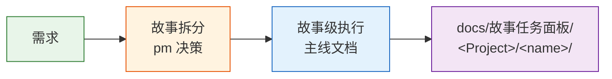

| 类别 | 用途 | 描述对象 | 触发 |
|------|------|---------|------|
| **故事级执行** | 做什么 / 怎么做 / 做了什么 | 单个故事的端到端 | `/rui doc` `/rui code` `/rui <req>` `/rui update` |

```
docs/
└── 故事任务面板/<Project>/<name>/   ← 执行：主线 + 通知 + 补充
```

**命名规则**：`<Project>` 大驼峰（`YiWeb`），`<name>` kebab-case（`user-login`）。CLI 输入 `<Project>-<name>`（如 `YiWeb-user-login`），rui 管线内分解为路径 `<Project>/<name>`。

## 故事拆分

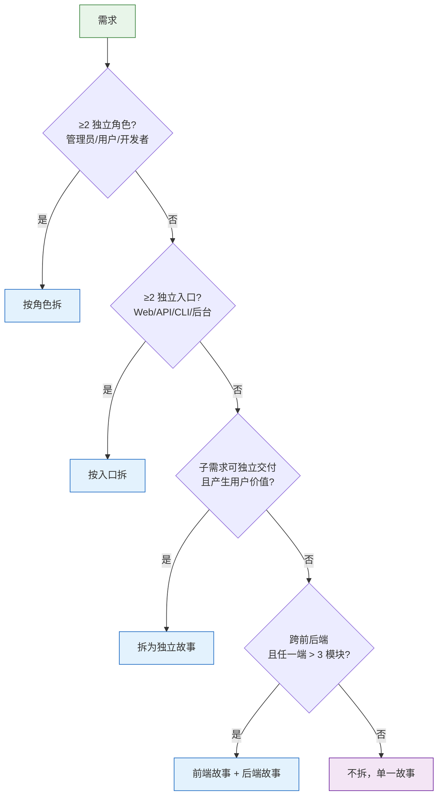

| 拆分信号 | 处理 | 示例 |
|---------|------|------|
| ≥2 独立角色（管理员/用户/开发者） | 按角色拆 | 管理员管理用户 + 用户自助注册 → 2 个故事 |
| ≥2 独立入口（Web/API/CLI/后台） | 按入口拆 | Web 端登录 + API 登录 + CLI 登录 → 3 个故事 |
| 子需求可独立交付且产生用户价值 | 拆为独立故事 | 手机号登录 + 验证码登录（可独立上线） |
| 跨前后端且任一端 > 3 模块 | 前端故事 + 后端故事 | 订单列表（前端 5 组件 + 后端 4 接口）→ 各 1 故事 |
| 单一场景不可再分 | 不拆 | 修改一处文案 → 1 个故事 |

| 约束 | 规则 |
|------|------|
| 独立性 | 每故事独立 AC，可单独交付 |
| 依赖显式 | 故事间依赖标注于 §1 |
| 串行执行 | 逐故事串行，不并行 |
| 粒度底线 | 一个函数 / 一个 API 不构成独立故事 |

## 故事目录骨架

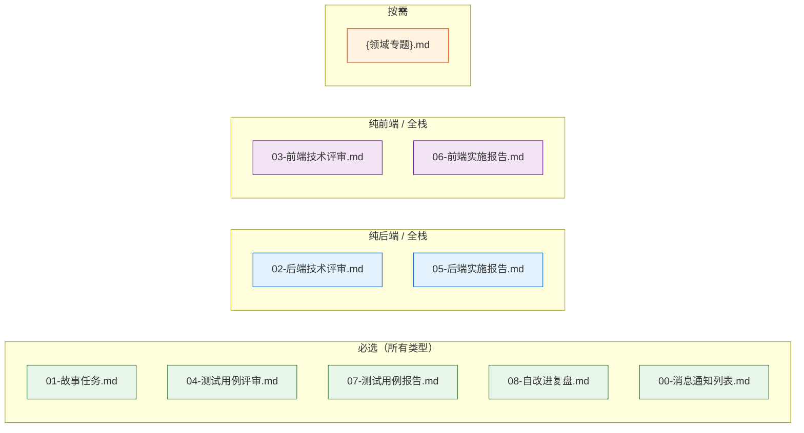

| 文件 | 必选 | 纯前端 | 纯后端 | 全栈 | 负责人 | 阶段 |
|------|:---:|:---:|:---:|:---:|--------|------|
| 01-故事任务.md | ✓ | ✓ | ✓ | ✓ | pm | 文档生成 |
| 02-后端技术评审.md | | — | ✓ | ✓ | coder + security | 文档生成 |
| 03-前端技术评审.md | | ✓ | — | ✓ | coder | 文档生成 |
| 04-测试用例评审.md | ✓ | ✓ | ✓ | ✓ | tester | 文档生成 |
| 05-后端实施报告.md | | — | ✓ | ✓ | coder | 验证 |
| 06-前端实施报告.md | | ✓ | — | ✓ | coder | 验证 |
| 07-测试用例报告.md | ✓ | ✓ | ✓ | ✓ | tester | 验证 |
| 08-自改进复盘.md | ✓ | ✓ | ✓ | ✓ | pm + reporter | 自改进 |
| 00-消息通知列表.md | 自动 | ✓ | ✓ | ✓ | wework-notify hook | 交付 |
| {领域专题}.md | 按需 | — | — | — | pm 决策 | 文档生成 |

附属（rui 管线维护，不入库审查）：

```
.improvement/proposals.jsonl       ← 自改进提案（追加）
.memory/execution-memory.jsonl     ← 执行记忆（追加）
.memory/rui-state.json             ← 管线状态（覆盖）
```

> **编号即顺序**：文件名编号前缀对应管线阶段顺序。01 是唯一真相源，技术评审（02/03/04）在文档生成阶段创建，实施与测试报告（05/06/07）在验证阶段创建——不可提前。附属目录由 rui 管线维护，人工不编辑。

## 补充文档决策

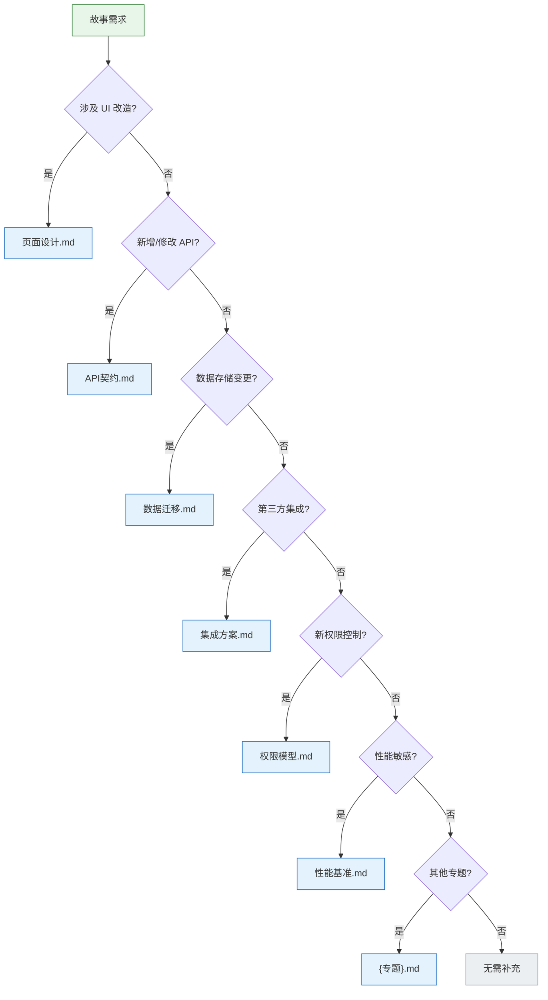

| 触发条件 | 文档 | 编号 | 负责人 | 公式 |
|---------|------|------|--------|------|
| §1.1 涉及 UI 改造 | 页面设计 | `页面设计.md` | coder | F.supp.page-design |
| §2 新增/修改 API | API 契约 | `API契约.md` | coder | F.supp.api-contract |
| §2 数据存储变更 | 数据迁移方案 | `数据迁移.md` | coder | F.supp.data-migration |
| 第三方集成 | 集成方案 | `集成方案.md` | coder + security | F.supp.integration |
| 新权限控制 | 权限模型 | `权限模型.md` | security | F.supp.permission-model |
| 性能敏感路径 | 性能基准 | `性能基准.md` | coder | F.supp.performance-baseline |
| 新增/变更消息队列 | 消息通道 | `消息通道.md` | coder | F.supp.message-channel |
| 跨故事共享模块 | 模块接口 | `模块接口.md` | coder | F.supp.module-interface |
| 其他专题 | ad-hoc | `{专题}.md` | pm 决策 | F.supp 自定义 |

## 文档导航

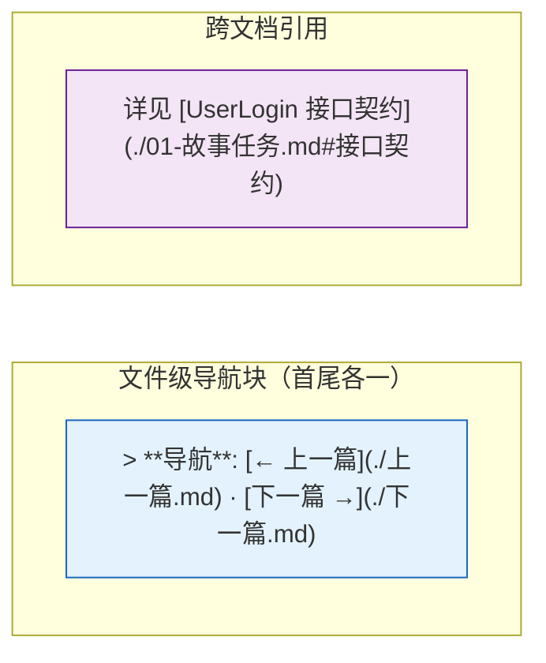

故事文档主体章节首尾包含标准导航块。填充规则见 [formulas.md §F.nav](./formulas.md)。

## 文件创建生命周期

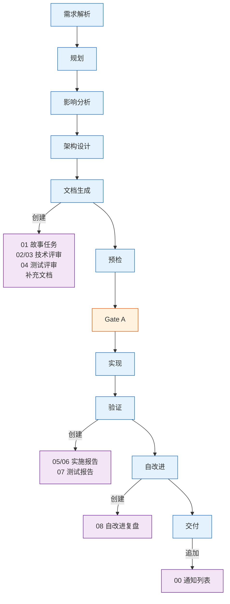

每次阶段变更：`rui-state.json` 覆盖写；过程追加到 `execution-memory.jsonl`；自改进提案追加到 `proposals.jsonl`。

## 完整度判定

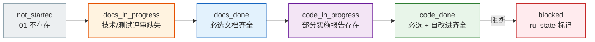

| 状态 | 条件 |
|------|------|
| `not_started` | 故事任务文档不存在 |
| `docs_in_progress` | 故事任务文档存在，技术评审或测试评审有缺失 |
| `docs_done` | 所有必选文档文件存在 |
| `code_in_progress` | 文档齐全，部分实施报告存在 |
| `code_done` | 所有必选文件及自改进复盘存在 |
| `blocked` | `rui-state.json` 中 `blocked=true` |

完整度判定按文件存在性进行；任务推荐按链式管线分层评分排序：阻断 → 故事推进 → 覆盖 → 健康 → 同步。

## 写作原则

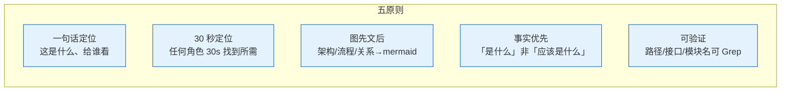

| 原则 | 含义 | 反例 |
|------|------|------|
| 一句话定位 | 每份文件开头说明「这是什么、给谁看」 | 开头直接进入技术细节 |
| 30 秒定位 | 任何角色 30 秒内找到所需 | 关键信息埋在长段落中 |
| 图先文后 | 架构/流程/关系先用 mermaid，文字补细节 | 大段文字描述架构，无图 |
| 事实优先 | 描述「是什么」而非「应该是什么」 | "建议使用 Redis 缓存" |
| 可验证 | 路径/接口/模块名可通过 Read/Grep 验证（Level A/B） | "应该有个 UserService" |

证据等级见 [agents/AGENT.md](../../agents/AGENT.md) 「证据标准」。

## 文档退化信号

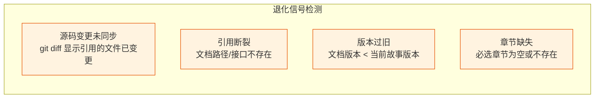

| 信号 | 判定 | 推荐动作 |
|------|------|---------|
| 源码变更未同步 | git diff 显示文档引用的文件已变更 | `/rui update` |
| 引用断裂 | 文档引用的路径/接口不存在 | 修复或标注 `> 待补充` |
| 版本过旧 | 文档版本 < 当前故事版本 | 增量更新 |
| 章节缺失 | 必选章节为空或不存在 | 补齐 |

---

## 数据契约

> 每个故事目录的 `.memory/` 与 `.improvement/` 由 rui 管线维护，字段由本节唯一定义。

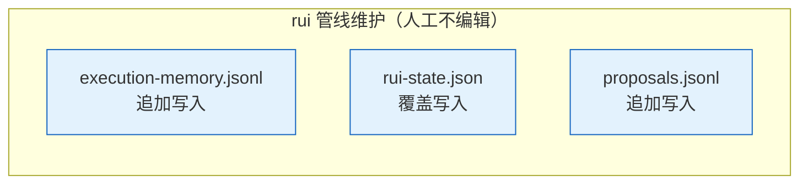

```
docs/故事任务面板/<Project>/<name>/
├── .improvement/
│   └── proposals.jsonl              ← self-improve 追加
└── .memory/
    ├── execution-memory.jsonl       ← 每次阶段变更追加
    └── rui-state.json               ← 当前状态覆盖写
```

### 数据流

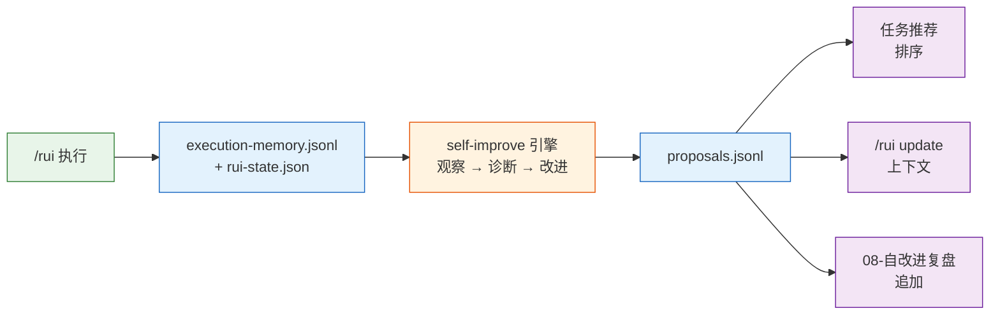

### 写入规则

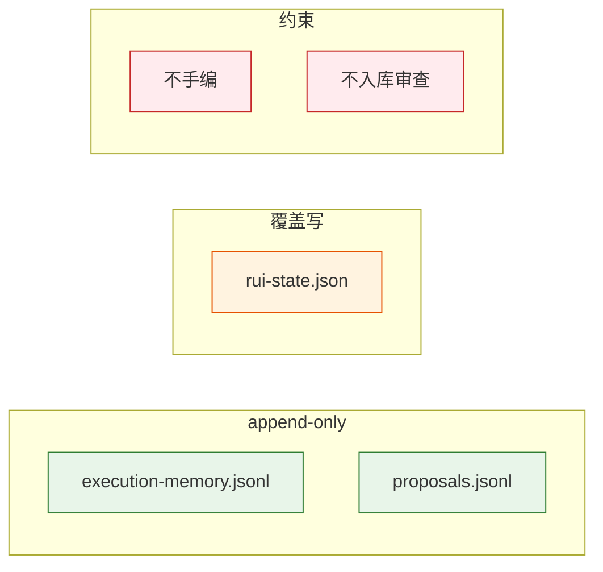

| 规则 | 说明 |
|------|------|
| append-only | `execution-memory.jsonl` 与 `proposals.jsonl` 仅追加，不重写 |
| 覆盖写 | `rui-state.json` 每次阶段变更覆盖整个文件 |
| 不手编 | 三个文件均由 rui 管线维护，人工编辑会破坏字段一致性 |
| 不入库审查 | 附属目录是元数据，不进入文档审查清单 |

### execution-memory.jsonl

追加写入，每行一个 JSON 对象。

| 字段 | 类型 | 含义 |
|------|------|------|
| `session_id` | string | 当次 rui 会话 |
| `timestamp` | ISO-8601 | 写入时刻 |
| `story_name` | string | `<Project>-<name>` |
| `feature` / `description` | string | 变更主题 |
| `planned_change_level` | T1\|T2\|T3 | 规划裁剪等级 |
| `actual_change_level` | T1\|T2\|T3 | 实际裁剪等级 |
| `phase_transitions` | `[{from,to,timestamp,duration_ms}]` | 阶段切换轨迹 |
| `update_context` | string | `/rui update` 上下文 |
| `agents_called` | string[] | 触达的 Agent |
| `quality_issues` | `{P0,P1,P2}` | 各级别问题列表 |
| `bad_cases` | `[{agent,lesson}]` | 失败教训 |
| `was_blocked` | bool | 是否被阻断 |
| `block_reason` | string | 阻断标识 |

### rui-state.json

单对象 JSON，每次阶段变更覆盖写。

| 字段 | 类型 | 含义 |
|------|------|------|
| `session_id` | string | 当次会话 |
| `command` | string | rui 子命令 |
| `name` | string | `<Project>-<name>` |
| `current_stage` | string | 当前阶段 |
| `blocked` | bool | 是否阻断 |
| `block_reason` | string | 阻断标识 |
| `timestamp` | ISO-8601 | 最近写入 |
| `storyboard` | object | 故事板快照 |
| `pipeline_progress` | `{阶段: completed\|in_progress\|blocked\|not_started\|skipped}` | 各阶段进度 |
| `delivery_pipeline` | `{log_appended, docs_synced, notification_sent, last_step_at, last_step}` | 三步交付状态 |
| `change_history` | `[{timestamp,from_stage,to_stage,trigger}]` | 阶段变更历史 |
| `related_proposals` | string[] | 关联提案 ID |
| `no_code` | bool | `--no-code` 模式标记 |

**恢复策略**：重跑同 `/rui` 命令从 `current_stage` 续。`--no-code` 模式下代码阶段全部标记 `skipped`，直接进入交付。

### proposals.jsonl

self-improve 引擎追加写入。

| 字段 | 类型 | 含义 |
|------|------|------|
| `id` | string | 提案 ID |
| `date` | ISO-8601 | 创建日期 |
| `title` | string | 标题 |
| `type` | refactor\|perf\|security\|quality\|process | 类别 |
| `priority` | P0\|P1\|P2\|P3 | 优先级 |
| `status` | open\|done\|superseded | 状态 |
| `story_name` | string | 来源故事 |
| `source_phase` | string | 触发阶段 |
| `actionable_command` | string | 可执行动作 |
| `linked_memory_ids` | string[] | 关联的记忆条目 |
| `problem_source` / `evidence` | string | 数据证据 |
| `current_state` / `target_state` | string | 当前 → 目标 |
| `s1_metrics` | object | 耦合/内聚/边界 |
| `s2_metrics` | object | 阻断率/问题轮次 |
| `feedback` | `[{rating,note,date}]` | 反馈记录 |
| `eval_result` | improved\|degraded\|neutral\|pending | 效果评估 |

效果评估需前后各足够条数的执行记忆才有中等置信度，规则见 [rules/self-improve.md](../../rules/self-improve.md)。

## 生效标志

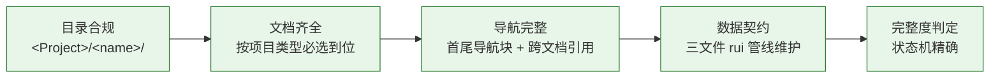

| 标志 | 未达标的处置 |
|------|------------|
| 目录 `<Project>/<name>/` 命名合规 | 移动文件到正确目录 |
| 按项目类型必选文档齐全 | 补创建缺失文档 |
| 首尾导航块 + 跨文档引用完整 | 补 F.nav 导航块 |
| 数据契约三文件由 rui 管线维护 | 撤销人工编辑，以管线写入为准 |
| 完整度状态机判定精确 | 核对 rui-state.json，修正状态 |
