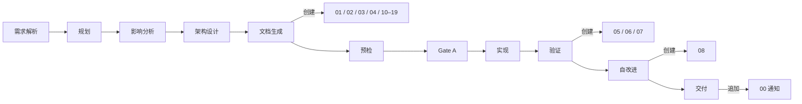

# coder 工作手册

> **口诀：知目录、循公式、明数据。** coder 在 rui 管线里要回答三件事——**写到哪个目录**、**按哪份公式**、**附属数据怎么落**。本文件把目录与生命周期、参考文档公式、数据契约合在一处，避免 coder 在多份文档间跳转。
>
> **配套**：故事文档公式（F.story.\* / F.supp.\*）见 [formulas.md](./formulas.md)；强制约束见 [rules/doc-generation.md](../../rules/doc-generation.md)；coder 角色契约见 [agents/coder.md](../../agents/coder.md)。

## 目录

- [文档分层](#文档分层) · 故事级 vs 项目级
- [故事拆分](#故事拆分) · pm 决策树（写参考文档时同步对齐）
- [故事目录骨架](#故事目录骨架) · 01–08 + 10–19 + 附属
- [补充文档决策](#补充文档决策) · 何时写 10–19
- [参考文档骨架](#参考文档骨架) · 00–04 五份的统一结构
- [文档级导航与跨引用](#文档级导航与跨引用)
- [阅读路径](#阅读路径)
- [文件创建生命周期](#文件创建生命周期)
- [完整度判定](#完整度判定)
- [from-code 自主探索](#from-code-自主探索)
- [写作原则](#写作原则)
- [文档退化信号](#文档退化信号)
- [参考文档公式](#参考文档公式) · F.ref.\* 完整章节字段
- [数据契约](#数据契约) · `.memory/` + `.improvement/` 字段

---

## 文档分层


| 类别 | 用途 | 描述对象 | 触发 |
|------|------|---------|------|
| **故事级执行** | 做什么 / 怎么做 / 做了什么 | 单个故事的端到端 | `/rui doc` `/rui code` `/rui <req>` `/rui update` |
| **项目级参考** | 当前是什么 | 单个组件 / 接口 / 页面 / 领域 | `/rui doc --from-code` |

```
docs/
├── 故事任务面板/<Project>/<name>/   ← 执行：01–08 + 00 通知 + 补充 10–19
├── 组件文档/<Project>/<component>/  ← 参考：00 索引 + 01–04 分层
├── 接口文档/<Project>/<resource>/   ← 参考：00 索引 + 01–04 分层
├── 页面文档/<Project>/<page>/       ← 参考：00 索引 + 01–04 分层
└── 领域模型/<Project>/<domain>/     ← 参考：00 索引 + 01–04 分层
```

`<Project>` 大驼峰（`YiWeb`），`<name>` kebab-case（`user-login`），总路径 ≤ 96 字符。

## 故事拆分

pm 收到需求后按决策树判断；coder 在写技术评审 / 实施报告时按相同口径理解范围：

```
需求 → 单一场景且单一角色? ─是→ 一个故事
                          └否→ 子需求可独立验证? ─是→ 拆为多个独立故事
                                                └否→ 一个故事 + 明确范围边界
```

| 拆分信号 | 处理 |
|---------|------|
| ≥2 独立角色（管理员/用户/开发者） | 按角色拆 |
| ≥2 独立入口（Web/API/CLI/后台） | 按入口拆 |
| 子需求可独立交付并产生用户价值 | 拆为独立故事 |
| 跨前后端且任一端 > 3 模块 | 前端故事 + 后端故事 |
| 单一场景不可再分 | 不拆 |

约束：每故事独立 AC；故事间依赖显式标注于 §1；逐故事串行；一个函数 / 一个 API 不构成独立故事。

## 故事目录骨架

按项目类型自动选择，pm 在文档生成阶段决定：

| 文件 | 必选 | 纯前端 | 纯后端 | 全栈 | 负责人 | 阶段 |
|------|:---:|:---:|:---:|:---:|--------|------|
| 01-故事任务.md | ✓ | ✓ | ✓ | ✓ | pm | 文档生成 |
| 02-后端技术评审.md | | — | ✓ | ✓ | coder + security | 文档生成（架构设计后） |
| 03-前端技术评审.md | | ✓ | — | ✓ | coder | 文档生成（架构设计后） |
| 04-测试用例评审.md | ✓ | ✓ | ✓ | ✓ | tester | 文档生成（架构设计后） |
| 05-后端实施报告.md | | — | ✓ | ✓ | coder | 验证 |
| 06-前端实施报告.md | | ✓ | — | ✓ | coder | 验证 |
| 07-测试用例报告.md | ✓ | ✓ | ✓ | ✓ | tester | 验证 |
| 08-自改进复盘.md | ✓ | ✓ | ✓ | ✓ | pm + reporter | 自改进 |
| 00-消息通知列表.md | 自动 | ✓ | ✓ | ✓ | wework-bot | 交付 |
| 10-{领域}.md / 1x-{专题}.md | 按需 | — | — | — | pm 决策 | 文档生成 |

附属（脚本管理，不入库审查）：

```
.improvement/proposals.jsonl     ← 自改进提案（追加）
.memory/execution-memory.jsonl   ← 执行记忆（追加）
.memory/rui-state.json           ← 管线状态（覆盖）
```

字段契约见本文 [§数据契约](#数据契约)。

> **关键约束**：01 是唯一真相源，所有引用最终追溯到 01；02/03/04 在文档生成阶段创建，05/06/07 在验证阶段创建——不可提前；附属目录由脚本管理，人工不编辑。

## 补充文档决策

pm 在文档生成阶段按下表判断。无匹配条件不生成。每一项的完整章节骨架见 [formulas.md §「补充文档公式」](./formulas.md#补充文档公式按需编号-1019)。

| 触发条件 | 文档 | 编号 | 负责人 | 公式 |
|---------|------|------|--------|------|
| §1.1 涉及 UI 改造 | 页面设计 | `10-页面设计.md` | coder | F.supp.10.page-design |
| §2 新增/修改 API | API 契约 | `10-API契约.md` | coder | F.supp.10.api-contract |
| §2 数据存储变更 | 数据迁移方案 | `11-数据迁移.md` | coder | F.supp.11.data-migration |
| 第三方集成 | 集成方案 | `12-集成方案.md` | coder + security | F.supp.12.integration |
| 新权限控制 | 权限模型 | `13-权限模型.md` | security | F.supp.13.permission-model |
| 性能敏感路径 | 性能基准 | `14-性能基准.md` | coder | F.supp.14.performance-baseline |
| 新增/变更消息队列 | 消息通道 | `15-消息通道.md` | coder | F.supp.15.message-channel |
| 跨故事共享模块 | 模块接口 | `16-模块接口.md` | coder | F.supp.16.module-interface |
| 其他专题 | ad-hoc | `17–19-{专题}.md` | pm 决策 | F.supp 自定义 |

## 参考文档骨架

四类参考文档统一结构：00 索引 + 01–04 分层。每份文件的「一句话定位」按递进：

| # | 定位 | 各文档类对应章节标题 |
|---|------|------------------|
| 00 | 阅读入口（导航） | 索引 |
| 01 | API 参考手册（查阅型） | 组件概述 / 接口概述 / 页面概述 / 领域概述 |
| 02 | 架构蓝图 / 数据字典（理解型） | 状态与依赖 / 数据模型 / 组件编排 / 实体模型 |
| 03 | 视觉规范 / 安全白皮书（审查型） | 样式与交互 / 中间件与安全 / 交互流程 / 领域服务 |
| 04 | 用户手册 / 集成手册 / 操作手册（验证型） | 操作场景 |

完整章节字段见本文 [§参考文档公式](#参考文档公式) 的 `F.ref.component` / `F.ref.api` / `F.ref.page` / `F.ref.domain` 块。

## 文档级导航与跨引用

### 文件级导航

01–04 文件首尾包含标准导航块；00 是入口，不含导航：

```markdown
> **导航**: [← 00-索引](./00-索引.md) · [↑ 组件文档](../) · [02-状态与依赖 →](./02-状态与依赖.md)
```

填充规则见 [formulas.md §F.nav](./formulas.md#fnav--导航块0104-文件首尾)。

### 跨文档引用格式

故事文档引用参考文档时，优先指向 00-索引，按需深入具体章节：

```markdown
全套文档见 [UserTable 组件](../../../组件文档/YiWeb/user-table/00-索引.md)。
接口契约详见 [UserTable §2](../../../组件文档/YiWeb/user-table/01-组件概述.md#2-接口契约)。
API 调用场景参见 [用户 API §4](../../../接口文档/YiWeb/user-api/04-操作场景.md#4-创建用户)。
```

## 阅读路径

每个 00-索引 提供按角色和场景的推荐路径。常见路径示例：

| 类型 | 角色 | 路径 | 时间 |
|------|------|------|-----|
| 组件 | 调用方 | 00 → 01 §2 接口契约 → 04 正常场景 | 5 min |
| 组件 | 维护者 | 00 → 01 → 02 → 03 | 15 min |
| 组件 | 测试者 | 00 → 04 全场景 → 01 §2 必填可选 | 8 min |
| 接口 | 前端 | 00 → 01 §2 端点清单 → 04 调用场景 | 5 min |
| 接口 | SRE | 00 → 03 §6 错误码 → 04 §5 性能约束 | 5 min |
| 页面 | 前端 | 00 → 01 §1 → 02 §1 组件树 → 02 §3 通信 | 10 min |
| 领域 | 后端 | 00 → 01 §2 限界上下文 → 03 §2 领域事件 | 10 min |

## 文件创建生命周期



每次阶段变更：`rui-state.json` 覆盖写；过程追加到 `execution-memory.jsonl`；自改进提案追加到 `proposals.jsonl`。

## 完整度判定

`list.js` 按文件存在性判定故事状态。判定以项目类型为基准：纯前端不要求后端文件，反之亦然。

| 状态 | 条件 |
|------|------|
| `not_started` | 01 不存在 |
| `docs_in_progress` | 01 存在，必选文档有缺失 |
| `docs_done` | 所有必选文档文件存在 |
| `code_in_progress` | 文档齐全 + 部分实施报告 |
| `code_done` | 所有必选文件 + 08 存在 |
| `blocked` | rui-state.json 中 `blocked=true` |

参考文档完整度（同样由 `list.js` 判定）。判定基于文件**职责**而非裸编号——见 [rules/no-magic-number.md](../../rules/no-magic-number.md)：

| 状态 | 条件 |
|------|------|
| `complete` | 索引 + 全部主体章节（01–04）存在 |
| `partial` | 索引存在，主体章节有缺失 |
| `stale` | 索引（入口）不存在（旧格式，需迁移） |
| `empty` | 项目目录存在但无子目录 |

`recommend.js` 通过 5 层链式管线评分排序：L1 阻断 → L2 故事 SDLC 推进 → L3 源码 / 文档覆盖 → L4 健康 / 提案 / 退化 → L5 同步与分支卫生。同故事多角色缺口由 headline 吸收为子信号。

## --from-code 自主探索

`/rui doc --from-code` 不传 req 时，pm 按项目类型差异化探索（详见 [agents/pm.md](../../agents/pm.md)）：

| 项目类型 | 扫描目标 | 推荐排序 | 产出目录 |
|---------|---------|---------|---------|
| 前端 | `.vue`/`.jsx`/`.tsx`/`.svelte` Props/Events/Expose | 核心业务无文档 > 普通无文档 > 过时 | `docs/组件文档/<Project>/<name>/` 与 `docs/页面文档/<Project>/<name>/` |
| 后端 | 路由 / 控制器 / DTO / ORM | 核心 API 无文档 > 普通无文档 > 过时 | `docs/接口文档/<Project>/<name>/` 与 `docs/领域模型/<Project>/<name>/` |
| 全栈 | 两端独立 | 分别输出推荐 | 同上两类 |

每候选输出：推荐名称（kebab-case）、覆盖范围、源码证据（Level A 路径列表）、优先级。用户选定后生成 00 索引 + 01–04 五份文件，并自动推荐基于参考文档的故事。

`/rui doc --from-code <req>` 跳过探索，按 req 限定范围反推故事，不输出推荐列表。

## 写作原则

| 原则 | 含义 |
|------|------|
| 一句话定位 | 每份文件开头说明「这是什么、给谁看」 |
| 30 秒定位 | 任何角色 30 秒内找到所需 |
| 图先文后 | 架构 / 流程 / 关系先用 mermaid，文字补细节 |
| 事实优先 | 描述「是什么」而非「应该是什么」（参考文档不写设计意图） |
| 可验证 | 路径 / 接口 / 模块名可通过 Read/Grep 验证（Level A/B） |

证据等级见 [agents/AGENT.md](../../agents/AGENT.md) 「证据标准」。

## 文档退化信号

`recommend.js` 在 L3 检测以下信号，推荐对应动作：

| 信号 | 判定 | 推荐 |
|------|------|------|
| 源码变更未同步 | git diff 显示文档引用的文件已变更 | `/rui update` |
| 引用断裂 | 文档引用的路径 / 接口不存在 | 修复或标注 `> 待补充` |
| 版本过旧 | 文档版本 < 当前故事版本 | 增量更新 |
| 章节缺失 | 必选章节为空或不存在 | 补齐 |

---

## 参考文档公式

四类参考文档统一结构：00-索引（导航入口）+ 01~04 分层（查阅→理解→审查→验证）。通用元素 F.meta / F.nav / F.evidence 见 [formulas.md §通用元素](./formulas.md#通用元素所有故事参考文档共用)。

### F.ref.00 — 00-索引（通用骨架）

**公式**: `meta + 身份卡片 + 角色阅读路径 + 场景阅读路径 + 文件清单 + 关联资源`

| 章节 | 内容 |
|------|------|
| 身份卡片 | `字段 \| 值`：资源名/路径/一句话职责/项目/技术栈或协议（按文档类） |
| 角色阅读路径 | `角色 \| 路径 \| 预计时间`，每条路径 ≤3 步 |
| 场景阅读路径 | `场景 \| 路径`：「调用/修改/排查」三类 |
| 文件清单 | `文件 \| 定位 \| 预计阅读`：01~04 各一行 |
| 关联资源 | 跨文档类引用：组件↔接口↔页面↔领域↔故事 |

**00 不含导航块、不含技术细节**。

### F.ref.section — 01~04 通用结构

每份 01~04 文件 = `meta + nav-头 + 一句话定位 + §1~§N 章节 + nav-尾`

「一句话定位」按递进:
- 01 = API 参考手册（查阅型）
- 02 = 架构蓝图/数据字典（理解型）
- 03 = 视觉规范/安全白皮书（审查型）
- 04 = 用户手册/集成手册/操作手册（验证型）

### F.ref.component — 组件文档（5 文件）

| 文件 | 章节骨架 |
|------|---------|
| 00-索引 | 身份卡片字段：组件名/文件路径/一句话职责/项目/技术栈/组件类型 |
| 01-组件概述 | §1 组件身份(`字段\|值`)、§2 接口契约(Props/Events/Expose 三表)、§3 使用示例(最小+典型代码块)、§4 版本兼容、§5 关联索引 |
| 02-状态与依赖 | §1 状态全景(`字段\|类型\|初始值\|来源\|分类\|持久化`)、§2 状态流图 mermaid flowchart、§3 子组件依赖 mermaid graph + 透传表、§4 外部引用(Composables/Store/3rd-party 三表)、§5 生命周期(`阶段\|操作\|说明`) |
| 03-样式与交互 | §1 样式策略(`场景\|方案\|说明`)、§2 视觉状态矩阵(`区域\|正常\|加载\|空\|错误\|禁用`)、§3 动画过渡、§4 DOM 与事件(挂载+事件清理)、§5 命名空间 |
| 04-操作场景 | §1 总览(`#\|场景\|触发角色\|前置条件\|覆盖 Props/Events`) + 状态过渡 mermaid、§2 正常场景(每场景 Given/When/Then 表)、§3 边界、§4 异常 |

### F.ref.api — 接口文档（5 文件）

| 文件 | 章节骨架 |
|------|---------|
| 00-索引 | 身份卡片字段：资源名/Base URL/职责/项目/协议(REST/GraphQL/gRPC/WebSocket) |
| 01-接口概述 | §1 服务身份、§2 端点清单(`#\|方法\|路径\|功能\|认证\|限流`)、§3 契约详情(每端点请求/响应/错误码 三块)、§4 序列图 sequenceDiagram、§5 版本兼容、§6 关联索引 |
| 02-数据模型 | §1 DTO(`字段\|类型\|必填\|校验\|示例`)、§2 ORM(`字段\|DB类型\|约束\|索引\|说明`) + erDiagram、§3 存储结构、§4 数据迁移、§5 容量策略 |
| 03-中间件与安全 | §1 中间件链路 flowchart + 表、§2 认证策略、§3 授权策略 + 端点权限矩阵、§4 输入校验、§5 威胁模型(套 Security 公式)、§6 错误码映射、§7 限流与防护 |
| 04-操作场景 | §1 总览、§2 正常调用(每场景 sequenceDiagram + 后置效果)、§3 集成场景(跨服务 sequenceDiagram + 超时/重试/补偿)、§4 异常场景、§5 性能约束 |

### F.ref.page — 页面文档（5 文件）

| 文件 | 章节骨架 |
|------|---------|
| 00-索引 | 身份卡片字段：页面名/路由/职责/项目/布局/页面类型 |
| 01-页面概述 | §1 页面身份(路由/路由名/布局/类型/路径/权限)、§2 数据注入(`数据源\|注入方式\|字段\|时机`)、§3 路由参数、§4 版本兼容、§5 关联索引 |
| 02-组件编排 | §1 组件树 mermaid、§2 组件清单(`组件\|路径\|Props透传\|职责`)、§3 组件间通信(Props/Event/Store/EventBus)、§4 懒加载、§5 命名空间 |
| 03-交互流程 | §1 页面状态流 stateDiagram-v2 + 状态说明表、§2 路由跳转(页内+跨页)、§3 模态/抽屉/通知、§4 表单交互、§5 错误与空态 |
| 04-操作场景 | §1 总览、§2 正常操作(Given/When/Then)、§3 边界(权限/网络/并发/大数据)、§4 异常(API 超时/校验失败/会话过期) |

### F.ref.domain — 领域模型（5 文件）

| 文件 | 章节骨架 |
|------|---------|
| 00-索引 | 身份卡片字段：领域名/限界上下文/职责/项目/核心实体 |
| 01-领域概述 | §1 领域边界(核心概念表 + 范围内/外列表)、§2 限界上下文(`字段\|值`)、§3 上下文映射 mermaid + 关系表、§4 上下游依赖(双表)、§5 关联索引 |
| 02-实体模型 | §1 实体清单(`实体\|类型\|标识符\|生命周期\|路径`)、§2 值对象、§3 聚合根(边界+一致性规则+不变式)、§4 关联关系 erDiagram + 表、§5 持久化映射 |
| 03-领域服务 | §1 服务清单(`服务\|职责\|依赖\|副作用\|路径`)、§2 领域事件(`事件\|触发\|payload\|消费者`) + flowchart、§3 仓储接口、§4 工厂、§5 领域规则 |
| 04-操作场景 | §1 总览、§2 领域内操作(Given/When/Then + sequenceDiagram)、§3 跨领域协作 sequenceDiagram + 协作表、§4 异常(规则违反/并发冲突/补偿/最终一致延迟) |

---

## 数据契约

> **口诀：脚本写、字段定、不手编。** 每个文档目录的 `.memory/` 与 `.improvement/` 由脚本管理，字段由本节唯一定义。

脚本位于 `~/.claude/plugins/marketplaces/yry/skills/rui/scripts/`，人工不编辑这些文件。哲学源自 [CLAUDE.md](../../CLAUDE.md)「先可见，后规则」——执行记忆与状态本身就是事实，规则在它们之上。

### 存储路径

五类文档（故事任务面板 / 组件文档 / 接口文档 / 页面文档 / 领域模型）均按 `docs/<文档类>/<Project>/<name>/` 组织，附属目录结构相同：

```
docs/<文档类>/<Project>/<name>/
├── .improvement/
│   └── proposals.jsonl              ← self-improve 追加
└── .memory/
    ├── execution-memory.jsonl       ← 每次阶段变更追加
    └── rui-state.json               ← 当前状态覆盖写
```

`/rui update` 接受两种输入：故事名 `<Project>-<name>`（→ `docs/故事任务面板/<Project>/<name>/`），或目录路径 `<文档类>/<Project>/<name>`。

### execution-memory.jsonl

追加写入，每行一个 JSON 对象。

| 字段 | 类型 | 含义 |
|------|------|------|
| `session_id` | string | 当次 rui 会话 |
| `timestamp` | ISO-8601 | 写入时刻 |
| `story_name` | string | `<Project>-<name>` |
| `feature` / `description` | string | 变更主题 |
| `planned_change_level` | T1\|T2\|T3 | 规划裁剪等级 |
| `actual_change_level` | T1\|T2\|T3 | 实际裁剪等级 |
| `phase_transitions` | `[{from,to,timestamp,duration_ms}]` | 阶段切换轨迹 |
| `update_context` | string | `/rui update` 上下文 |
| `agents_called` | string[] | 触达的 Agent |
| `quality_issues` | `{P0,P1,P2}` | 各级别问题列表 |
| `bad_cases` | `[{agent,lesson}]` | 失败教训 |
| `was_blocked` | bool | 是否被阻断 |
| `block_reason` | string | 阻断标识 |

### rui-state.json

单对象 JSON，每次阶段变更覆盖写。

| 字段 | 类型 | 含义 |
|------|------|------|
| `session_id` | string | 当次会话 |
| `command` | string | rui 子命令 |
| `name` | string | `<Project>-<name>` |
| `current_stage` | string | 当前阶段 |
| `blocked` | bool | 是否阻断 |
| `block_reason` | string | 阻断标识 |
| `timestamp` | ISO-8601 | 最近写入 |
| `storyboard` | object | 故事板快照 |
| `pipeline_progress` | `{阶段: completed\|in_progress\|blocked\|not_started\|skipped}` | 各阶段进度 |
| `delivery_pipeline` | `{log_appended, docs_synced, notification_sent, last_step_at, last_step}` | 三步交付状态 |
| `change_history` | `[{timestamp,from_stage,to_stage,trigger}]` | 阶段变更历史 |
| `related_proposals` | string[] | 关联提案 ID |
| `no_code` | bool | `--no-code` 模式标记 |

**恢复策略**：重跑同 `/rui` 命令从 `current_stage` 续。`--no-code` 模式下代码阶段（预检 → 测试先行 → 实现 → 验证）全部标记 `skipped`，直接进入交付。

### proposals.jsonl

self-improve 引擎追加写入。

| 字段 | 类型 | 含义 |
|------|------|------|
| `id` | string | 提案 ID |
| `date` | ISO-8601 | 创建日期 |
| `title` | string | 标题 |
| `type` | refactor\|perf\|security\|quality\|process | 类别 |
| `priority` | P0\|P1\|P2\|P3 | 优先级 |
| `status` | open\|done\|superseded | 状态 |
| `story_name` | string | 来源故事 |
| `source_phase` | string | 触发阶段 |
| `actionable_command` | string | 可执行动作 |
| `linked_memory_ids` | string[] | 关联的记忆条目 |
| `problem_source` / `evidence` | string | 数据证据 |
| `current_state` / `target_state` | string | 当前 → 目标 |
| `s1_metrics` | object | 耦合 / 内聚 / 边界 |
| `s2_metrics` | object | 阻断率 / P0 轮次 |
| `feedback` | `[{rating,note,date}]` | 反馈记录 |
| `eval_result` | improved\|degraded\|neutral\|pending | 效果评估 |

效果评估需前后各 ≥3 条执行记忆才有中等置信度，规则见 [rules/self-improve.md](../../rules/self-improve.md) E1–E4。

### 数据流

```mermaid
flowchart LR
    A[/rui 执行/] --> B[execution-memory.jsonl<br/>+ rui-state.json]
    B --> C[self-improve.js<br/>观察→诊断→改进]
    C --> D[proposals.jsonl]
    D --> E1[recommend.js<br/>推荐排序]
    D --> E2[/rui update<br/>上下文]
    D --> E3[loop.js §L<br/>追加]
```

### 写入规则

| 规则 | 说明 |
|------|------|
| append-only | `execution-memory.jsonl` 与 `proposals.jsonl` 仅追加，不重写 |
| 覆盖写 | `rui-state.json` 每次阶段变更覆盖整个文件 |
| 不手编 | 三个文件均由脚本管理，人工编辑会破坏字段一致性 |
| 不入库审查 | 附属目录是元数据，不进入文档审查清单 |
