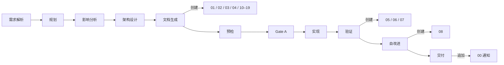

# 文档目录与生命周期

> **定位**：回答「哪个文件 / 谁产 / 何时产 / 谁读」。文档结构（章节、表头、字段）在 [formulas.md](./formulas.md)；生成时强制约束在 [rules/doc-generation.md](../../rules/doc-generation.md)。

## 文档分层

两类文档，各按 `docs/<文档类>/<Project>/<name>/` 二级组织：

| 类别 | 用途 | 描述对象 | 触发 |
|------|------|---------|------|
| **故事级执行文档** | 做什么 / 怎么做 / 做了什么 | 单个故事的端到端 | `/rui doc`、`/rui code`、`/rui <req>`、`/rui update` |
| **项目级参考文档** | 当前是什么 | 单个组件 / 接口 / 页面 / 领域 | `/rui doc --from-code` |

```
docs/
├── 故事任务面板/<Project>/<name>/   ← 执行文档：01–08 + 00 通知 + 补充 10–19
├── 组件文档/<Project>/<component>/  ← 参考：00 索引 + 01–04 分层
├── 接口文档/<Project>/<resource>/   ← 参考：00 索引 + 01–04 分层
├── 页面文档/<Project>/<page>/       ← 参考：00 索引 + 01–04 分层
└── 领域模型/<Project>/<domain>/     ← 参考：00 索引 + 01–04 分层
```

`<Project>` 大驼峰（`YiWeb`），`<name>` kebab-case（`user-login`），总路径 ≤ 96 字符。

## 故事拆分

pm 收到需求后按决策树判断：

```
需求 → 单一场景且单一角色? ─是→ 一个故事
                          └否→ 子需求可独立验证? ─是→ 拆为多个独立故事
                                                └否→ 一个故事 + 明确范围边界
```

| 拆分信号 | 处理 |
|---------|------|
| ≥2 独立角色（管理员/用户/开发者） | 按角色拆 |
| ≥2 独立入口（Web/API/CLI/后台） | 按入口拆 |
| 子需求可独立交付并产生用户价值 | 拆为独立故事 |
| 跨前后端且任一端 > 3 模块 | 前端故事 + 后端故事 |
| 单一场景不可再分 | 不拆 |

约束：每个故事必须独立 AC；故事间依赖显式标注于 §1；逐故事串行；禁止过度拆分（一个函数 / 一个 API 不构成独立故事）。

## 故事目录骨架

按项目类型自动选择，pm 在文档生成阶段决定：

| 文件 | 必选 | 纯前端 | 纯后端 | 全栈 | 负责人 | 阶段 |
|------|:---:|:---:|:---:|:---:|--------|------|
| 01-故事任务.md | ✓ | ✓ | ✓ | ✓ | pm | 文档生成 |
| 02-后端技术评审.md | | — | ✓ | ✓ | coder + security | 文档生成（架构设计后） |
| 03-前端技术评审.md | | ✓ | — | ✓ | coder | 文档生成（架构设计后） |
| 04-测试用例评审.md | ✓ | ✓ | ✓ | ✓ | tester | 文档生成（架构设计后） |
| 05-后端实施报告.md | | — | ✓ | ✓ | coder | 验证 |
| 06-前端实施报告.md | | ✓ | — | ✓ | coder | 验证 |
| 07-测试用例报告.md | ✓ | ✓ | ✓ | ✓ | tester | 验证 |
| 08-自改进复盘.md | ✓ | ✓ | ✓ | ✓ | pm + reporter | 自改进 |
| 00-消息通知列表.md | 自动 | ✓ | ✓ | ✓ | wework-bot | 交付 |
| 10-{领域}.md / 1x-{专题}.md | 按需 | — | — | — | pm 决策 | 文档生成 |

附属（脚本管理，不入库审查）：

```
.improvement/proposals.jsonl     ← 自改进提案（追加）
.memory/execution-memory.jsonl   ← 执行记忆（追加）
.memory/rui-state.json           ← 管线状态（覆盖）
```

字段契约见 [data.md](./data.md)。

> **关键约束**：01 是唯一真相源，所有引用最终追溯到 01；02/03/04 在文档生成阶段创建，05/06/07 在验证阶段创建——不可提前；`.memory/` 与 `.improvement/` 由脚本管理，人工不编辑。

## 补充文档决策

pm 在文档生成阶段按下表判断。无匹配条件不生成。

| 触发条件 | 文档 | 编号 | 负责人 |
|---------|------|------|--------|
| §1.1 涉及 UI 改造 | 页面设计 | `10-页面设计.md` | coder |
| §2 新增/修改 API | API 契约 | `10-API契约.md` | coder |
| §2 数据存储变更 | 数据迁移方案 | `11-数据迁移.md` | coder |
| 第三方集成 | 集成方案 | `12-集成方案.md` | coder + security |
| 新权限控制 | 权限模型 | `13-权限模型.md` | security |
| 性能敏感路径 | 性能基准 | `14-性能基准.md` | coder |
| 新增/变更消息队列 | 消息通道 | `15-消息通道.md` | coder |
| 跨故事共享模块 | 模块接口 | `16-模块接口.md` | coder |

补充文档无固定模板，按对应主线文档章节风格 ad-hoc 生成。结构片段见 [formulas.md](./formulas.md)「补充文档公式」节。

## 参考文档骨架

四类参考文档统一结构：00 索引 + 01–04 分层。每份文件的「一句话定位」按递进：

| # | 定位 | 文档类对应章节标题 |
|---|------|------------------|
| 00 | 阅读入口（导航） | 索引 |
| 01 | API 参考手册（查阅型） | 组件概述 / 接口概述 / 页面概述 / 领域概述 |
| 02 | 架构蓝图 / 数据字典（理解型） | 状态与依赖 / 数据模型 / 组件编排 / 实体模型 |
| 03 | 视觉规范 / 安全白皮书（审查型） | 样式与交互 / 中间件与安全 / 交互流程 / 领域服务 |
| 04 | 用户手册 / 集成手册 / 操作手册（验证型） | 操作场景 |

完整章节字段见 [formulas.md](./formulas.md) 的 `F.ref.component` / `F.ref.api` / `F.ref.page` / `F.ref.domain` 块。

### 文件级导航

01–04 文件首尾包含标准导航块；00 是入口，不含导航：

```markdown
> **导航**: [← 00-索引](./00-索引.md) · [↑ 组件文档](../) · [02-状态与依赖 →](./02-状态与依赖.md)
```

填充规则见 `F.nav` 公式。

### 跨文档引用格式

故事文档引用参考文档时，优先指向 00-索引，按需深入具体章节：

```markdown
全套文档见 [UserTable 组件](../../../组件文档/YiWeb/user-table/00-索引.md)。
接口契约详见 [UserTable §2](../../../组件文档/YiWeb/user-table/01-组件概述.md#2-接口契约)。
API 调用场景参见 [用户 API §4](../../../接口文档/YiWeb/user-api/04-操作场景.md#4-创建用户)。
```

## 阅读路径

每个 00-索引 提供按角色和场景的推荐路径。常见路径示例：

| 类型 | 角色 | 路径 | 时间 |
|------|------|------|-----|
| 组件 | 调用方 | 00 → 01 §2 接口契约 → 04 正常场景 | 5 min |
| 组件 | 维护者 | 00 → 01 → 02 → 03 | 15 min |
| 组件 | 测试者 | 00 → 04 全场景 → 01 §2 必填可选 | 8 min |
| 接口 | 前端 | 00 → 01 §2 端点清单 → 04 调用场景 | 5 min |
| 接口 | SRE | 00 → 03 §6 错误码 → 04 §5 性能约束 | 5 min |
| 页面 | 前端 | 00 → 01 §1 → 02 §1 组件树 → 02 §3 通信 | 10 min |
| 领域 | 后端 | 00 → 01 §2 限界上下文 → 03 §2 领域事件 | 10 min |

## 文件创建生命周期



每次阶段变更，`rui-state.json` 覆盖写；过程记录追加到 `execution-memory.jsonl`；自改进提案追加到 `proposals.jsonl`。

## 完整度判定

`list.js` 按文件存在性判定故事状态。判定以项目类型为基准：纯前端不要求后端文件，反之亦然。

| 状态 | 条件 |
|------|------|
| `not_started` | 01 不存在 |
| `docs_in_progress` | 01 存在，必选文档有缺失 |
| `docs_done` | 所有必选文档文件存在 |
| `code_in_progress` | 文档齐全 + 部分实施报告 |
| `code_done` | 所有必选文件 + 08 存在 |
| `blocked` | rui-state.json 中 `blocked=true` |

参考文档完整度（同样由 `list.js` 判定）：

| 状态 | 条件 |
|------|------|
| `complete` | 00–04 全部存在 |
| `partial` | 00 存在，01–04 有缺失 |
| `stale` | 00 不存在（旧格式，需迁移） |
| `empty` | 项目目录存在但无子目录 |

`recommend.js` 通过 5 层链式管线评分排序：L1 阻断 → L2 故事 SDLC 推进 → L3 源码/文档覆盖 → L4 健康/提案/退化 → L5 同步与分支卫生。同故事多角色缺口由 headline 吸收为子信号。

## --from-code 自主探索

`/rui doc --from-code` 不传 req 时，pm 按项目类型差异化探索（详见 [agents/pm.md](../../agents/pm.md)「探索策略」）：

| 项目类型 | 扫描目标 | 推荐排序 | 产出目录 |
|---------|---------|---------|---------|
| 前端 | `.vue`/`.jsx`/`.tsx`/`.svelte` Props/Events/Expose | 核心业务无文档 > 普通无文档 > 过时 | `docs/组件文档/<Project>/<name>/` 与 `docs/页面文档/<Project>/<name>/` |
| 后端 | 路由 / 控制器 / DTO / ORM | 核心 API 无文档 > 普通无文档 > 过时 | `docs/接口文档/<Project>/<name>/` 与 `docs/领域模型/<Project>/<name>/` |
| 全栈 | 两端独立 | 分别输出推荐 | 同上两类 |

每候选输出：推荐名称（kebab-case）、覆盖范围、源码证据（Level A 路径列表）、优先级。用户选定后生成 00 索引 + 01–04 五份文件，并自动推荐基于参考文档的故事。

`/rui doc --from-code <req>` 跳过探索，按 req 限定范围反推故事，不输出推荐列表。

## 写作原则

| 原则 | 含义 |
|------|------|
| 一句话定位 | 每份文件开头说明「这是什么、给谁看」 |
| 30 秒定位 | 任何角色 30 秒内找到所需 |
| 图先文后 | 架构 / 流程 / 关系先用 mermaid，文字补细节 |
| 事实优先 | 描述「是什么」而非「应该是什么」（参考文档不写设计意图） |
| 可验证 | 路径 / 接口 / 模块名可通过 Read/Grep 验证（Level A/B） |

证据等级见 [agents/AGENT.md](../../agents/AGENT.md) 「证据标准」。

## 文档退化信号

`recommend.js` 在 L3 检测以下信号，推荐对应动作：

| 信号 | 判定 | 推荐 |
|------|------|------|
| 源码变更未同步 | git diff 显示文档引用的文件已变更 | `/rui update` |
| 引用断裂 | 文档引用的路径 / 接口不存在 | 修复或标注 `> 待补充` |
| 版本过旧 | 文档版本 < 当前故事版本 | 增量更新 |
| 章节缺失 | 必选章节为空或不存在 | 补齐 |
