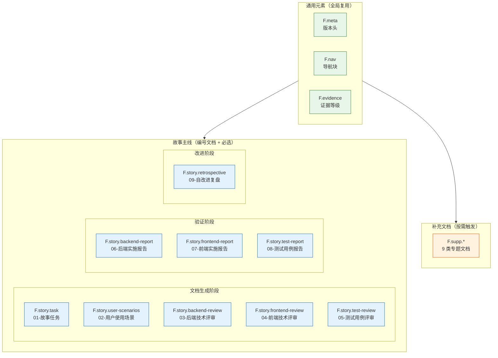
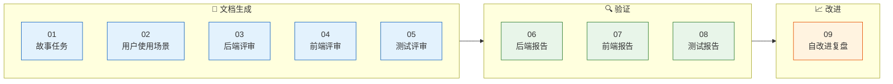
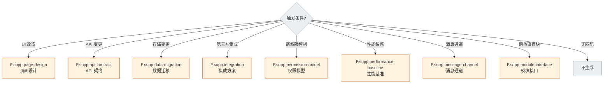

# 故事文档公式

> 故事文档的结构单一真相源。章节、表头、字段规约——按此直接产出文档。



## 通用元素

> 所有故事文档共用，缺一不可。目录与生命周期见 [coder.md](./coder.md)，生成约束见 [rules/doc-generation.md](../../rules/doc-generation.md)。

### F.meta — 版本头

```
> | v{version} | {YYYY-MM-DD} | {model} | {tool?} | 🌿 {branch} | ⏱️ {HH:mm}–{HH:mm} | 📎 [CLAUDE.md](../../../CLAUDE.md) |
```

| 约束 | 规则 |
|------|------|
| 占位符 | 任何 `{...}` 留到产出视为偏差 |
| 可选字段 | `tool`、`time-range`、`philosophy` 链接（仅 01-故事任务） |

### F.nav — 导航块


**标记格式**：`> **导航**: [← {标题}](./{文件}.md) · [{标题} →](./{文件}.md)`

**前驱/后继规则**：

| 场景 | 前驱 `←` | 后继 `→` |
|------|----------|---------|
| 链首（01） | 省略 | 02-用户使用场景 |
| 02-用户使用场景 | 01-故事任务 | 下一编号文件 |
| 链中 | 上一编号文件 | 下一编号文件 |
| 链尾（00） | 上一编号文件 | 省略 |
| 邻接文件不适用当前类型 | 跳过，取再上一 | 跳过，取再下一 |

**项目类型裁剪**：

| 类型 | 跳过文件 | 链路变化 |
|------|---------|---------|
| 纯前端 | 03、06 | 用户场景后继 04；04 前驱变用户场景；05 后继从 06 变 07 |
| 纯后端 | 04、07 | 03 后继变 05；06 后继从 07 变 08 |
| 全栈 | — | 完整 01→用户场景→00 链路 |

### F.evidence — 证据等级

| 等级 | 含义 | 写入规则 |
|------|------|---------|
| A | 已验证（附路径） | 直接写入 |
| B | 可推导（附规则） | 直接写入 |
| C | 未验证 | 标注 `> 待补充` |
| D | 禁止 | 视为幻觉，不得出现 |

---

## 故事主线公式



### 01 — F.story.task `meta + 角色公式速查 + Story×N`

> **外部参考** — 描述故事前浏览 [外部参考](../../../README.md#外部参考)，汲取故事拆分模式、AC 设计方法、场景描述技巧。粒度不确定或场景覆盖不全时，回查模式参照。

**角色公式速查**（固定文案，置顶）：

| 角色 | 公式 |
|------|------|
| PM | `作为 [角色] 我想要 [动作] 以便 [价值]` |
| Tester | `Given [前置] When [操作] Then [预期]` |
| Coder | `模块 → 接口 → 数据流` |
| Security | `威胁 → 信任边界 → 缓解` |

**每个 Story 章节**：

| 章节 | 负责人 | 表头/字段 | 约束 |
|------|--------|----------|------|
| §1 Story | pm | `作为/我想要/以便/优先级(P0/P1/P2)/范围边界/依赖/子项目` + `范围外` | 必填 |
| §1.1 User Operations | tester | `# \| 操作 \| 触发条件 \| 操作步骤 \| 预期结果`；UI 故事附 mermaid flowchart | 必填 |
| §2 Requirements | pm | 功能点 `FP# \| 描述 \| 输入 \| 输出 \| 错误行为 \| 优先级`；业务规则 `R# \| 描述 \| 校验方式 \| 证据级别`；数据约束 `约束 \| 类型 \| 范围/格式 \| 来源` | 必填 |
| §3 Design | coder + security | 决策表 `决策领域 \| 选定方案 \| 选择理由 \| 详见` | 必填 |
| §4 Tasks | pm + 全员 | `ID \| 描述 \| 工作量(S/M/L) \| 依赖 \| 交付物 \| Agent \| 门禁 \| 交接下游` + 任务依赖 mermaid | 必填 |
| §5 AC | tester | `AC# \| Given \| When \| Then \| 门禁(Gate A/B)` | 必填 |
| §6 改进清单 | pm | skill/agent/rule/script/config 改进项 | 可选 |
| §7 架构演进 | pm | 近期/中期/远期 | 可选 |
| §L 自改进循环 | self-improve | 每次完成追加 | 可选 |

### 02 — F.story.user-scenarios `meta + nav + 全景 + 详述×N + 覆盖矩阵 + 清单`

> **外部参考** — §2 场景详述涉及 UI 交互时，参考 [nextlevelbuilder/ui-ux-pro-max-skill](https://github.com/nextlevelbuilder/ui-ux-pro-max-skill) 的推理规则与交互模式。场景粒度与覆盖度可参考 [obra/superpowers](https://github.com/obra/superpowers) 的 spec-driven 模式。


| 章节 | 负责人 | 表头/字段 | 约束 |
|------|--------|----------|------|
| §1 场景全景 | pm | mermaid flowchart 展示所有用户场景与模块关系 | 必填，每个故事 ≥ 2 个场景 |
| §2 场景详述 | pm | 每场景：场景名 + `角色 \| 触发条件 \| 核心目标`；mermaid flowchart 操作流 + `# \| 步骤 \| 输入 \| 系统响应 \| 异常分支` | 每场景必含流程图 |
| §3 场景覆盖矩阵 | pm | `场景 \| FP# \| 覆盖 \| 备注`，与 01-故事任务 §2 对齐 | 必填 |
| §4 评审清单 | pm | 场景 ≥ 2 / 每场景有图 / FP 全覆盖 / 异常分支明确 | 必填 |

### 03 — F.story.backend-review `meta + nav + 架构 + API + 数据 + 安全 + 性能 + 清单`


| 章节 | 表头/内容 |
|------|----------|
| §1 服务架构 | 1.1 服务/进程 `变更类型 \| 模块/文件 \| 职责`；1.2 通信通道 mermaid sequenceDiagram + `通道 \| 方向 \| 协议 \| Payload \| 错误处理` |
| §2 API 接口 | 2.1 接口清单 `接口 \| 方法 \| 路径 \| 请求体 \| 响应体 \| 错误码`；2.2 请求流程 sequenceDiagram；2.3 服务实现 `服务/模块 \| 依赖 \| 文件路径 \| 核心方法` |
| §3 数据模型 | 3.1 存储结构 `Key/表/集合 \| 类型 \| 默认值 \| 读频率 \| 写频率 \| 说明`；3.2 数据迁移 `版本 \| 变更 \| 迁移策略` |
| §4 安全约束 | `# \| 威胁 \| 信任边界 \| 缓解措施 \| 优先级`（套用 Security 公式） |
| §5 性能与限制 | `维度 \| 约束 \| 应对` |
| §6 评审清单 | 权限最小化 / 通信对齐 / 存储兼容 / API 鉴权 / 无硬编码密钥 / 无误用长连接 / 输入校验完整 |

### 04 — F.story.frontend-review `meta + nav + 组件 + 状态 + 交互 + 样式 + DOM + 依赖 + 清单`


| 章节 | 表头/内容 |
|------|----------|
| §1 组件架构 | 1.1 组件树 mermaid；1.2 新增/变更 `组件 \| 类型 \| 文件 \| 注册路径 \| 变更`；1.3 接口 `组件 \| Props \| Events \| Expose` |
| §2 状态管理 | 2.1 状态定义 `Store/State \| 文件 \| 状态字段 \| 使用组件` + 状态层 mermaid；2.2 状态流向 mermaid + `数据流 \| 触发源 \| 状态变更 \| 消费方` |
| §3 交互设计 | 3.1 用户操作流 mermaid；3.2 视图状态矩阵 `视图 \| 正常 \| 加载 \| 空 \| 错误 \| 禁用`；3.3 动画 `元素 \| 类型 \| 时长 \| 触发条件` |
| §4 样式方案 | 4.1 策略 `场景 \| 方案 \| 说明`；4.2 新增样式文件 `文件 \| 用途 \| 加载方式` |
| §5 DOM 与事件 | 5.1 挂载点 `组件 \| 容器 \| 创建方式 \| 生命周期`；5.2 事件 `事件 \| 监听方式 \| 处理逻辑 \| 清理时机` |
| §6 依赖与加载 | 6.1 加载顺序 fenced 块 + `新增文件 \| 插入位置 \| 依赖上游`；6.2 命名空间 `文件 \| 注册到 \| 类型` |
| §7 评审清单 | 组件命名空间 / 资源注册 / 状态约定 / 样式隔离 / 事件清理 / 加载顺序 / 模块语法 / 样式文件注册 |

### 05 — F.story.test-review `meta + nav + Tester公式 + 范围 + 用例×4 + 环境 + 清单 + Gate A`


| 章节 | 表头/内容 |
|------|----------|
| §1 测试范围 | 1.1 覆盖矩阵 `FP# \| 功能点 \| 正常 \| 边界 \| 异常 \| 回归 \| 覆盖率`；1.2 Gate 映射 `Gate \| 用例范围 \| 通过标准 \| 交接下游`；1.3 影响链覆盖 `影响点 \| 来源 \| 回归用例 \| 覆盖状态` |
| §2 测试用例 | 2.1 正常 `TC-N*` / 2.2 边界 `TC-B*` / 2.3 异常 `TC-E*` / 2.4 回归 `TC-R*` 四张同构表 `ID \| Given \| When \| Then \| 关联 FP \| 优先级` |
| §3 环境专项 | 生命周期/通信通道/存储 `TC-X* \| ID \| Given \| When \| Then \| 优先级` |
| §4 测试环境 | `维度 \| 配置`：运行环境/部署方式/测试目标/数据准备 |
| §5 评审清单 | 每功能点多类覆盖 / Gate A 覆盖 / 回归与影响链一致 / 异常含恢复行为 / 环境专项覆盖 / 无外部依赖占比合理 / 影响链每点有回归 |
| §6 Gate A 交接 | `信号 \| 内容`：通过状态 / P0 用例 ID / 实现约束 / 验证命令 |

### 06 — F.story.backend-report `meta + nav + Reporter公式 + 总结 + 偏差 + P0 + 存储 + 性能 + 清单`


| 章节 | 表头/内容 |
|------|----------|
| §1 实施总结 | 1.1 交付文件 `文件 \| 变更类型 \| 行数 \| 对应任务`；1.2 实际接口 `接口 \| 方法 \| 路径 \| 与评审偏差 \| 说明`；1.3 通信通道 `通道 \| 与评审偏差 \| 说明` |
| §2 偏差记录 | `# \| 评审设计 \| 实际实现 \| 偏差原因 \| 影响 \| 优先级`；无偏差注明 |
| §3 P0 审查 | 3.1 模块审查 `模块 \| 文件 \| P0 数量 \| 清零 \| 审查时间`；3.2 安全 `# \| 威胁 \| 缓解措施 \| 状态` |
| §4 存储变更 | `Key/表 \| 变更类型 \| 与评审偏差 \| 迁移验证` |
| §5 性能观察 | `维度 \| 观察 \| 与评审预期` |
| §6 评审清单 | 文件与任务对应 / 接口与评审一致 / 偏差有因有据 / P0 清零 / 存储已验证 / 性能可观察 |

### 07 — F.story.frontend-report `meta + nav + Reporter公式 + 总结 + 偏差 + P0 + 样式 + 依赖 + 清单`

| 章节 | 表头/内容 |
|------|----------|
| §1 实施总结 | 1.1 交付文件；1.2 实际组件 `组件 \| 注册路径 \| 与评审偏差 \| 说明`；1.3 状态管理 `Store/State \| 与评审偏差 \| 说明` |
| §2 偏差记录 | 同 06-后端实施报告 §2 |
| §3 P0 审查 | `模块 \| 文件 \| P0 数量 \| 清零 \| 审查时间` |
| §4 样式与隔离 | `文件 \| 隔离方式 \| 与评审偏差` |
| §5 依赖与加载 | 5.1 注册表变更 `变更类型 \| 具体变更`；5.2 加载顺序验证 fenced 块 |
| §6 评审清单 | 组件注册正确 / 状态与评审一致 / 样式隔离生效 / 加载顺序合规 / P0 清零 |

### 08 — F.story.test-report `meta + nav + Reporter公式 + 环境 + 冒烟 + 回归 + 专项 + 已知 + Gate B + 清单`


| 章节 | 表头/内容 |
|------|----------|
| §1 测试环境 | `维度 \| 配置`：运行环境 / 部署方式 / 测试目标 / 数据状态 / 分支 / 环境快照(commit hash) |
| §2 冒烟 | 2.1 执行结果 `ID \| Given \| When \| Then \| 结果 \| 备注`；2.2 汇总 `总用例/通过/失败/P0通过率/P1通过率` |
| §3 回归 | `ID \| Given \| When \| Then \| 结果 \| 关联模块` |
| §4 环境专项 | `ID \| 场景 \| Given \| When \| Then \| 结果 \| 备注` |
| §5 已知问题 | `# \| 用例 ID \| Given \| When \| Then(实际) \| 优先级 \| 修复轮次 \| 状态` |
| §6 Gate B 评估 | `指标 \| 要求 \| 实际 \| 结果`：P0 全部通过 / P1 高通过率 / P0 已知清零 / 修复轮次可控 |
| §7 评审清单 | Gate B 指标全部达标 / 冒烟+回归+专项闭合 / 已知问题有跟踪 / 环境快照可复现 |

### 09 — F.story.retrospective `meta + nav + Self-Improve公式 + 基线 + 观察 + 诊断 + 改进 + 经验 + 清单`


| 章节 | 表头/内容 |
|------|----------|
| §0 基线校准 | `基线文件 \| 关键条款 \| 本次执行适用性 \| 偏差` 覆盖 CLAUDE.md / 5 rules / 3 agents |
| §1 观察 | 1.1 时间线 `阶段 \| 开始 \| 结束 \| 耗时 \| Agent`；1.2 质量快照 `指标 \| 本故事 \| 项目均值 \| 偏差`；1.3 关键事件 `# \| 事件 \| 阶段 \| 影响 \| 经验` |
| §2 诊断 | 2.1 诊断决策表 `规则 \| 触发条件 \| 本故事值 \| 触发? \| 根因假设`；2.2 六维评估 `维度 \| 评级 \| 证据 \| 说明`（耦合/稳定性/扩展性/可测试性/安全边界/依赖方向）；2.3 工流趋势 `指标 \| 本 \| 上 \| 趋势 \| 说明` |
| §3 改进 | 3.1 改进清单 `# \| 类别 \| 优先级 \| 改进动作 \| 诊断来源 \| 预期效果 \| 状态`；3.2 架构演进 `# \| 优先级 \| 变更 \| 六维来源 \| 时段 \| 状态`；3.3 提案同步 `提案ID \| 标题 \| 优先级 \| 状态 \| 效果评估` |
| §4 经验沉淀 | `# \| 经验 \| 类别 \| 来源阶段 \| 适用范围` |
| §5 评审清单 | §0→§L 全部闭合 |

---

## 补充文档公式



> **共同骨架**：`meta + nav + 触发与范围 + 主体章节 + 与主线对齐 + 评审清单`。存放于故事目录 `{专题}.md`。

### 补充文档速览

| 公式 | 触发条件 | 负责人 |
|------|---------|--------|
| `F.supp.page-design` | §1.1 涉及 UI 改造 | coder |
| `F.supp.api-contract` | §2 新增/修改 API | coder |
| `F.supp.data-migration` | §2 数据存储变更 | coder |
| `F.supp.integration` | 第三方集成 | coder + security |
| `F.supp.permission-model` | 新权限控制 | security |
| `F.supp.performance-baseline` | 性能敏感路径 | coder |
| `F.supp.message-channel` | 新增/变更消息队列/事件总线 | coder |
| `F.supp.module-interface` | 跨故事共享模块 | coder |

### F.supp.page-design — 页面设计

| 章节 | 表头/内容 |
|------|----------|
| §1 触发与范围 | 触发条件 / 涉及页面或组件 / 是否新建路由 / 与前端技术评审的引用 |
| §2 视觉规格 | 2.1 线框图（mermaid 或图片） + `元素 \| 位置 \| 尺寸 \| 颜色 \| 字号`；2.2 设计令牌 `令牌 \| 取值 \| 用途 \| 来源(主题/约定)` |
| §3 交互细节 | 3.1 用户操作流 mermaid；3.2 微交互 `元素 \| 触发 \| 反馈 \| 时长`；3.3 视图状态矩阵 |
| §4 响应式与可访问性 | 4.1 断点 `断点 \| 宽度 \| 布局变化`；4.2 a11y `维度 \| 要求 \| 实现` |
| §5 与主线对齐 | `前端技术评审章节 \| 本文位置 \| 关系(覆盖/补充/差异)` |
| §6 评审清单 | 与前端技术评审一致 / 令牌全部命中 / 状态矩阵齐 / a11y AA / 响应式覆盖 |

### F.supp.api-contract — API 契约

| 章节 | 表头/内容 |
|------|----------|
| §1 触发与范围 | 新增/变更/废弃接口数量 + 兼容策略 |
| §2 端点契约 | 每端点：方法 + 路径 + 请求 schema + 响应 schema + 错误码（fenced JSON 块） |
| §3 字段字典 | `字段 \| 类型 \| 必填 \| 校验 \| 默认 \| 示例 \| 说明`，跨端点复用标 ↗ |
| §4 错误码映射 | `错误码 \| HTTP \| 业务含义 \| 触发条件 \| 客户端建议处理` |
| §5 兼容性 | 5.1 版本策略；5.2 弃用计划 `字段/端点 \| 弃用版本 \| 移除版本 \| 替代` |
| §6 与主线对齐 | `后端技术评审章节 \| 本文位置 \| 关系` |
| §7 评审清单 | schema 完备 / 错误码闭合 / 与后端技术评审一致 / 版本策略明确 / 字段命名规范 |

### F.supp.data-migration — 数据迁移

| 章节 | 表头/内容 |
|------|----------|
| §1 触发与范围 | 涉及表/集合/Key + 数据量级 + 是否需要停机 |
| §2 结构对比 | 旧/新并排表 `字段 \| 旧类型 \| 新类型 \| 变化 \| 默认值 \| 兼容性` + 索引变更表 |
| §3 迁移脚本 | 3.1 步骤 `序 \| 操作 \| 命令/SQL \| 预计耗时 \| 可幂等`；3.2 转换规则 `字段 \| 旧值规则 \| 新值规则 \| 异常处理` |
| §4 回滚方案 | `场景 \| 回滚步骤 \| 数据损失风险 \| RTO`（强制每步骤可回滚） |
| §5 验证 | 5.1 数据完整性 `校验项 \| SQL/命令 \| 期望结果`；5.2 业务验证 `用例 \| 输入 \| 期望` |
| §6 灰度计划 | `阶段 \| 范围 \| 监控指标 \| 退出标准` |
| §7 评审清单 | 脚本可幂等 / 回滚可执行 / 校验覆盖 / 灰度可控 / 数据备份 / 性能影响评估 |

### F.supp.integration — 集成方案

| 章节 | 表头/内容 |
|------|----------|
| §1 触发与范围 | 集成对象 / 协议 / 数据流向 / SLA |
| §2 集成点 | `集成点 \| 方向 \| 协议 \| 频率 \| Payload \| 鉴权方式 \| 端点` |
| §3 契约 | 3.1 调用契约 schema；3.2 回调/Webhook schema；3.3 数据映射 `本系统字段 \| 第三方字段 \| 转换规则` |
| §4 错误处理与重试 | `错误类型 \| HTTP/Code \| 重试策略 \| 退避 \| 最大次数 \| 死信队列` |
| §5 安全考量 | 套用 Security 公式 `# \| 威胁 \| 信任边界 \| 缓解 \| 优先级` |
| §6 监控与告警 | `指标 \| 阈值 \| 告警通道 \| 处置 SOP` |
| §7 评审清单 | 契约完备 / 重试与退避 / 密钥不硬编码 / 告警可达 / 降级策略 / 合规检查 |

### F.supp.permission-model — 权限模型

| 章节 | 表头/内容 |
|------|----------|
| §1 触发与范围 | 引入原因 / 模型选择(RBAC/ABAC/混合) / 影响接口或页面 |
| §2 角色矩阵 | `角色 \| 描述 \| 默认权限 \| 可分配人 \| 互斥角色` |
| §3 资源与动作 | `资源 \| 动作(CRUD...) \| 角色矩阵` 交叉表 |
| §4 资源归属与可见域 | `资源 \| 归属维度(租户/团队/用户) \| 可见域规则 \| 越权检查点` |
| §5 接口权限映射 | `接口/页面 \| 必需权限 \| 检查位置(中间件/控制器/前端守卫) \| 失败码` |
| §6 审计 | `审计事件 \| 触发 \| 字段 \| 留存周期 \| 查询入口` |
| §7 评审清单 | 默认拒绝 / 最小权限 / 审计闭合 / 越权用例覆盖 / 角色互斥校验 / 可降级路径 |

### F.supp.performance-baseline — 性能基准

| 章节 | 表头/内容 |
|------|----------|
| §1 触发与范围 | 路径标识 / SLA 目标 / 测试模型(并发/数据规模) |
| §2 指标定义 | `指标 \| 定义 \| 采集方式 \| 单位 \| 目标(P50/P95/P99)` |
| §3 基线测量 | `场景 \| 数据量 \| 并发 \| P50 \| P95 \| P99 \| 错误率 \| 备注` |
| §4 瓶颈分析 | 4.1 Profile 摘要；4.2 瓶颈 `位置 \| 类型(CPU/IO/锁/网络) \| 占比 \| 优化方向` |
| §5 优化方案 | `# \| 措施 \| 预期收益 \| 风险 \| 验证方式 \| 状态` |
| §6 回归门禁 | `场景 \| 阈值 \| 验证命令 \| 回归触发` |
| §7 评审清单 | 指标可采集 / 基线复现 / 优化可量化 / 回归门禁 / 容量预估 |

### F.supp.message-channel — 消息通道

| 章节 | 表头/内容 |
|------|----------|
| §1 触发与范围 | 通道类型(MQ/EventBus/WebSocket) / 引入原因 / 流量规模 |
| §2 通道清单 | `通道 \| 中间件 \| 主题/Queue \| 生产者 \| 消费者 \| 消息模型(P2P/Pub-Sub) \| 顺序性` |
| §3 消息契约 | 3.1 Schema（fenced JSON）+ 字段字典；3.2 路由键/分区键策略 |
| §4 投递语义 | `通道 \| 语义(at-least-once/exactly-once) \| 幂等键 \| 死信策略 \| 重试上限 \| 积压告警` |
| §5 消费者实现 | `消费者 \| 文件路径 \| 并发度 \| ack 时机 \| 失败处理` |
| §6 监控 | 积压量/消费延迟/失败率/重试次数 阈值表 |
| §7 评审清单 | 契约稳定 / 幂等键覆盖 / 死信路径 / 监控可告警 / 版本兼容 / 反压策略 |

### F.supp.module-interface — 模块接口

| 章节 | 表头/内容 |
|------|----------|
| §1 触发与范围 | 共享模块名 / 引用故事列表 / 演进策略 |
| §2 公开 API | `符号 \| 类型(函数/类/常量/类型) \| 签名 \| 入参 \| 返回 \| 副作用 \| 文件路径` |
| §3 内部边界 | 禁止外部引用的内部符号 + 原因 |
| §4 版本兼容 | `版本 \| 变更摘要 \| 破坏性 \| 迁移指南` |
| §5 使用示例 | 最小用例 + 典型用例（fenced 代码块） |
| §6 关联故事 | `故事 \| 使用方式 \| 引入版本 \| 升级状态` |
| §7 评审清单 | API 稳定 / 破坏性变更标注 / 示例可运行 / 版本号语义化 / 废弃路径明确 |

### 自定义补充

无固定公式时，沿用共同骨架 ad-hoc 生成：

| 约束 | 规则 |
|------|------|
| 文件名 | `{专题}.md`，kebab-case |
| 必含 | `meta + nav + 触发与范围 + 主体 + 评审清单` |
| 主体 | 用表格，避免段落叙述 |
| 映射 | 与主线技术评审文档建立章节级映射 |

---

## 通知/记忆文档

| 文件 | 生成方 | 方式 |
|------|--------|------|
| `00-消息通知列表.md` | wework-bot hook | 列表追加，含时间戳+类型+payload |
| `10-交互日志.md` | rui 管线 | 追加写入 · 按会话+时间戳分段 · 含全部人机交互内容 |
| `.memory/execution-memory.jsonl` | rui 管线 | 追加 JSONL，字段见 [coder.md](./coder.md) |
| `.memory/rui-state.json` | rui 管线 | 单对象覆盖写 |
| `.improvement/proposals.jsonl` | self-improve 引擎 | 追加 JSONL |

### F.story.interaction-log — 交互日志

> `需求解析` 阶段创建，此后每次人机交互轮次追加一条记录。append-only。

```markdown
> 交互日志 · 追加写入 · rui 管线自动维护

## 会话 <session_id> — {YYYY-MM-DD}

### {HH:mm:ss} | turn-{N} | {agent}

**👤 用户**:
{用户输入全文}

**🤖 助手**:
{助手响应/执行动作摘要}

**📋 关键决策**:
- {本轮决策、产出文件、阻断等}

---
```

| 约束 | 规则 |
|------|------|
| 会话头 | 每 session 开始时写入 `## 会话 <id> — <date>` |
| turn 编号 | 从 1 开始递增，单会话内连续 |
| 全阶段覆盖 | 需求解析 · 规划 · 影响分析 · 架构设计 · 文档生成 · 预检 · Gate A · 实现 · 验证 · Gate B · 自改进 · 交付 |
| 追加触发 | 每次人机交互轮次结束后立即追加 |
| 目录不存在 | 递归创建 |

---

## 使用约定


| 操作 | 规则 |
|------|------|
| 生成 | 按公式逐章节产出，不依赖模板文件 |
| 裁剪 | 措辞修正→仅变更章节；接口变更→同步影响章节；边界重构→全文重生 |
| 校验 | F.meta/F.nav 占位符必须替换；表列齐备；mermaid 可渲染 |
| 扩展 | 新文档类型在本文件追加公式块，保持表头规约风格一致 |
