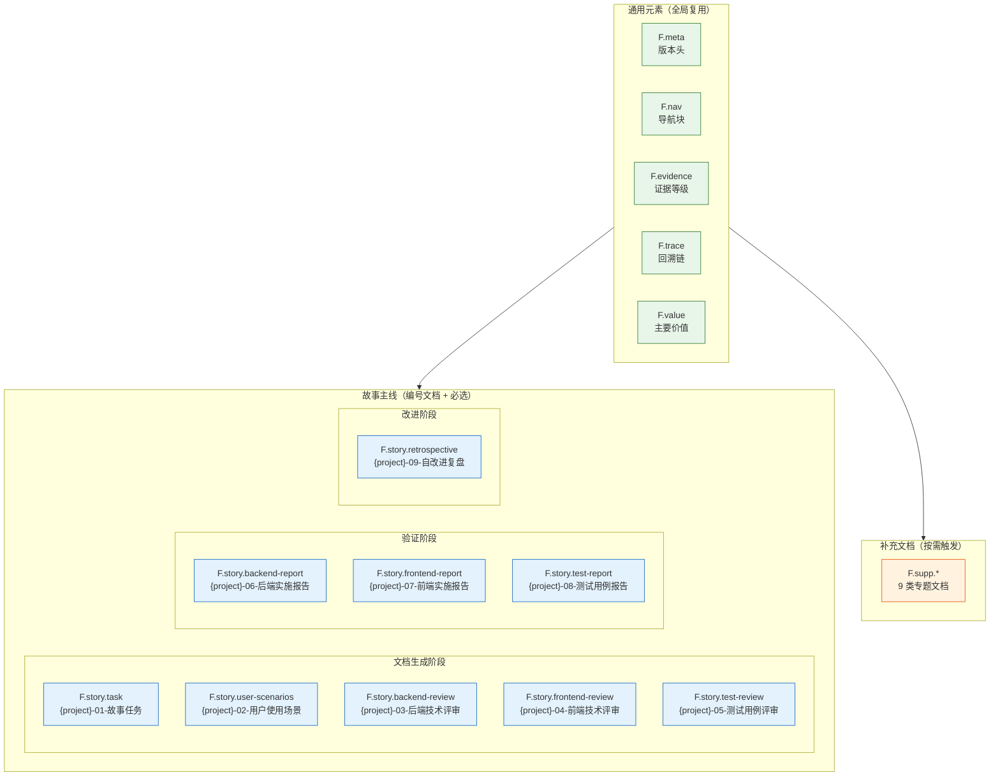
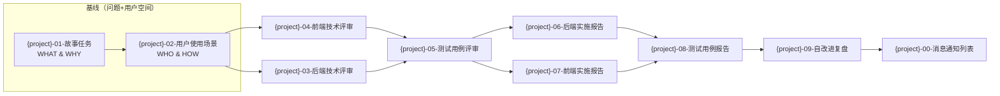
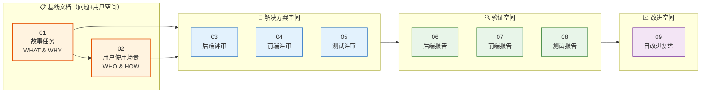
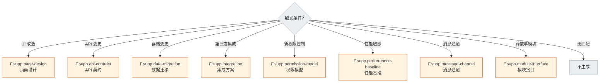
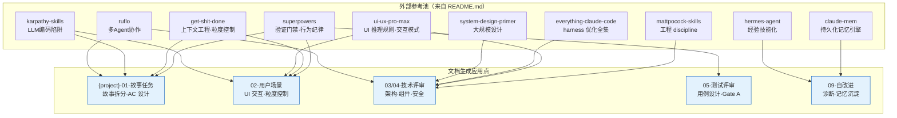

# 故事文档公式

> 故事文档的结构单一真相源。章节、表头、字段规约——按此直接产出文档。



## 通用元素

> 所有故事文档共用，缺一不可。目录与生命周期见 [coder.md](./coder.md)，生成约束见 [rules/doc-generation.md](../../rules/doc-generation.md)。

### F.meta — 版本头

```
> | v{version} | {YYYY-MM-DD} | {model} | {tool?} | 🌿 {branch} | ⏱️ {HH:mm}–{HH:mm} | 📎 [CLAUDE.md](../../CLAUDE.md) |
```

| 约束 | 规则 |
|------|------|
| 占位符 | 任何 `{...}` 留到产出视为偏差 |
| 可选字段 | `tool`、`time-range`、`philosophy` 链接（仅 {project}-01-故事任务） |

### F.nav — 导航块



**标记格式**：`> **导航**: [← {标题}](./{文件}.md) · [{标题} →](./{文件}.md)`

**前驱/后继规则**：

| 场景 | 前驱 `←` | 后继 `→` |
|------|----------|---------|
| 基线 {project}-01-故事任务 | 省略 | {project}-02-用户使用场景 |
| 基线 {project}-02-用户使用场景 | {project}-01-故事任务 | 03(后端) 或 04(前端)，按项目类型 |
| 链中 | 上一编号文件 | 下一编号文件 |
| 链尾（00） | 上一编号文件 | 省略 |
| 邻接文件不适用当前类型 | 跳过，取再上一 | 跳过，取再下一 |

**项目类型裁剪**：

| 类型 | 跳过文件 | 链路变化 |
|------|---------|---------|
| 纯前端 | 03、06 | 基线 02 后继 04；05 后继从 06 变 07 |
| 纯后端 | 04、07 | 基线 02 后继 03；03 后继变 05；06 后继从 07 变 08 |
| 全栈 | — | 基线 02 后继 03 和 04；完整链路 01→02→03/04→05→06/07→08→09→00 |

### F.evidence — 证据等级

| 等级 | 含义 | 写入规则 |
|------|------|---------|
| A | 已验证（附路径） | 直接写入 |
| B | 可推导（附规则） | 直接写入 |
| C | 未验证 | 标注 `> 待补充` |
| D | 禁止 | 视为幻觉，不得出现 |

### F.trace — 回溯链

> 每个文档必须包含回溯链，确保任意断言可追溯到来源需求或决策。


| 元素 | 位置 | 约束 |
|------|------|------|
| **来源引用** | 文档头部，紧随 meta | 标注本文档由哪个需求/故事/决策触发，附文件路径或 commit |
| **证据附路径** | 每个断言/结论旁 | 验证通过的附可执行命令；未验证的标 `> 待补充` |
| **交叉引用** | 提及外部文档/模块处 | 使用相对路径 `[文件名](./文件.md)` 链接，禁止裸文件名 |
| **变更记录** | 文档末尾 | `\| 日期 \| 变更 \| 触发 \| 证据 \|`，每次修改追加一行 |

| 约束 | 规则 |
|------|------|
| 无来源不断言 | 每个结论必须有来源引用或证据路径，无来源的断言标为 C 级 |
| 交叉引用可点击 | 所有文档间引用使用 markdown 相对链接 |
| 变更可追溯 | 每次文档修改追加变更记录行，含触发原因 |

### F.value — 主要价值

> 每个故事文档（01–09 及补充文档）必须包含 `### 主要价值` 节，位于文档元信息之后、主体内容之前。

```
### 主要价值

- 🎯 {价值主张 1}
- 🔒 {价值主张 2}
- ⚡ {价值主张 3}
- 📊 {价值主张 4}
```

| 约束 | 规则 |
|------|------|
| 数量 | ≥ 4 条，分行显示 |
| 前缀 | 每条以 emoji + 空格开头，emoji 与价值主张内容相关 |
| 位置 | meta + nav + 来源引用之后，§1 之前 |
| 内容 | 每条 ≤ 一行，描述本故事/文档的核心价值主张 |
| 校验 | 文档审查时检查 `### 主要价值` 节存在且 ≥ 4 条，缺失或不足 = P0 |

---

## 双基线模型

> {project}-01-故事任务 与 {project}-02-用户使用场景 是整个故事目录的**双基线文档**——问题空间与用户空间的定义。所有下游文档（03-09 及补充文档）均为解决方案/验证/改进空间，必须显式溯源至基线。



| 空间 | 文档 | 核心问题 | 语言约束 | 溯源要求 |
|------|------|---------|---------|---------|
| **问题空间** | {project}-01-故事任务 | WHAT（做什么）WHY（为什么做） | 禁止代码路径、API 路由、组件名、数据库表名、技术栈名 | 基线，不溯源 |
| **用户空间** | {project}-02-用户使用场景 | WHO（谁使用）HOW（如何体验） | 禁止技术术语、组件名、API 端点、文件路径、数据库概念、框架名 | 溯源至 01 |
| **解决方案空间** | 03-04-05 | HOW（技术方案） | 无限制 | 每章节必须溯源至 01+02 |
| **验证空间** | 06-07-08 | DID（是否达成） | 无限制 | 每章节必须溯源至 01+02+对应方案文档 |
| **改进空间** | 09 | LEARN（学到什么） | 无限制 | 溯源至 01+02+全链路 |

## 故事主线公式

### 01 — F.story.task `meta + Story×N`

> **外部参考** — 描述故事前必须浏览 [外部参考](../../README.md#外部参考)，汲取故事拆分模式、AC 设计方法、场景描述技巧、上下文边界控制。粒度不确定或场景覆盖不全时，回查相应模式参照。
>
> | 章节 | 参考资源 | 汲取要点 |
> |------|---------|---------|
> | §1 Story | [superpowers](https://github.com/obra/superpowers) | 故事拆分模式、spec-driven 开发、验证门禁设计 |
> | §1 Story — 粒度控制 | [get-shit-done](https://github.com/gsd-build/get-shit-done/tree/main) | 上下文边界设计、故事描述粒度控制 |
> | §2 Requirements | [mattpocock/skills](https://github.com/mattpocock/skills) | 工程 discipline、需求结构化表达 |
> | §3 成功标准 | [superpowers](https://github.com/obra/superpowers) | spec-driven 验证门禁、用户可感知的 success metrics 设计 |
> | §4 范围边界 | [get-shit-done](https://github.com/gsd-build/get-shit-done/tree/main) | 上下文边界设计、范围控制 |
> | §5 AC | [superpowers](https://github.com/obra/superpowers) | 验证门禁、AC 可测试性、Gate 映射 |
> | §6 风险与假设 | [mattpocock/skills](https://github.com/mattpocock/skills) | 工程 discipline、风险管理结构化 |
> | §L 自改进 | [claude-mem](https://github.com/thedotmack/claude-mem) | 跨会话知识沉淀、执行记忆体系设计 |

#### §0 基线声明

> **问题空间基线 (Problem Space Baseline)**: 本文档定义"做什么(WHAT)"和"为什么(WHY)"。所有后续文档(03-09)的设计、实现、验证、改进决策均必须可追溯至本文档的具体章节。

| 约束 | 规则 |
|------|------|
| 语言边界 | 仅使用业务语言与用户语言。**禁止**包含：代码文件路径（如 `src/auth/login.ts`）、API 路由（如 `/api/v1/users`）、组件名称（如 `<UserLogin>`）、数据库表名（如 `users` 表）、技术栈选型（如 "使用 Redis 缓存"）、框架名称（如 "Express 中间件"） |
| 下游可追溯 | 03-09 的每个设计决策/实现/测试必须引用本文档的 §1 Story# 或 §2 FP# 或 §3 SC# 或 §5 AC# |
| 版本优先 | 需求变更时本文档先于所有其他文档更新；下游文档偏差必须同步回本文档 |
| 评审门禁 | 文档审查时检查禁止内容：含代码路径/API路由/组件名/技术栈名 = P0 阻断 |

#### F.story.task 强制元素

| # | 元素 | 位置 | 约束 |
|---|------|------|------|
| 1 | **需求概述** | 项目信息表之后 | 2–5 句概括故事目标与范围，必填 |
| 2 | **效果示意** | 需求概述正下方 | mermaid flowchart，展示当前痛点→目标状态→关键里程碑，必填 |
| 3 | **主要价值** | 效果示意之后 | emoji 前缀列表，每行一条价值主张，≥ 4 条，必填 |

**效果示意约束**：

| # | 规则 |
|---|------|
| 1 | 至少包含 3 层节点：当前痛点（红色节点）→ 目标状态（绿色节点）→ 中间关键里程碑 |
| 2 | 节点数 ≥ 5，用 `classDef` 区分当前/目标/里程碑 |
| 3 | 必须覆盖故事范围内的核心流程，不可简化为单箭头 |
| 4 | 放在 `### 需求概述` 之后、`### 主要价值` 之前 |


**每个 Story 章节**：

| 章节 | 负责人 | 表头/字段 | 约束 |
|------|--------|----------|------|
| §1 Story | pm | `作为/我想要/以便/优先级(P0/P1/P2)/范围边界/依赖/子项目` + `范围外` | 必填 |
| §1.1 User Operations | tester | `# \| 操作 \| 触发条件 \| 操作步骤 \| 预期结果`；UI 故事附 mermaid flowchart | 必填 |
| §2 Requirements | pm | 功能点 `FP# \| 描述 \| 输入 \| 输出 \| 错误行为 \| 优先级`；业务规则 `R# \| 描述 \| 校验方式 \| 证据级别`；数据约束 `约束 \| 类型 \| 范围/格式 \| 来源` | 必填 |
| §3 成功标准 | pm | `SC# \| 描述 \| 度量方式 \| 目标值 \| 优先级 \| 关联 FP#`。仅使用用户可感知的度量，禁止技术指标（如 API 延迟、CPU 使用率） | 必填，≥ 3 条 |
| §4 范围边界 | pm | 范围内 `# \| 条目 \| 关联 FP# \| 边界说明`；范围外 `# \| 条目 \| 排除原因 \| 替代方案`；灰色区域 `# \| 条目 \| 触发条件 \| 决策人` | 必填 |
| §5 AC | tester | `AC# \| Given \| When \| Then \| 门禁(Gate A/B)` | 必填 |
| §6 风险与假设 | pm | `# \| 风险/假设 \| 类型(风险\|假设) \| 可能性(H/M/L) \| 影响(H/M/L) \| 缓解/验证策略 \| 关联 FP#` | 必填 |
| §7 跨文档索引 | pm | `本文档章节 \| 基线内容 \| 下游文档编号 \| 预期覆盖 \| 状态(待生成\|已对齐\|偏差)` | 必填 |
| §L 自改进循环 | self-improve | 每次完成追加 | 可选 |

**§3 成功标准约束**：

| # | 规则 |
|---|------|
| 1 | 每条 SC 使用目标用户能理解的描述。正例："用户可在30秒内完成注册流程"。反例："注册API P95延迟 < 200ms" |
| 2 | 每条 SC 必须有客观度量方式，不接受主观描述（"用户觉得好用"） |
| 3 | 每条 SC 必须关联至 §2 的至少 1 个 FP# |
| 4 | 禁止出现技术指标：API 延迟、CPU 使用率、内存占用、QPS、数据库连接数 |

**§4 范围边界约束**：

| # | 规则 |
|---|------|
| 1 | 每个明确不做的事项必须写进范围外并注明原因 |
| 2 | 边界模糊的待定事项标注决策人与触发条件 |
| 3 | 范围外条目若有关联替代方案，必须写出 |

**§6 风险与假设约束**：

| # | 规则 |
|---|------|
| 1 | 每个风险必须关联至至少 1 个 FP# 或成功标准 SC# |
| 2 | 可能性 H/M/L 必须基于可说明的来源（历史数据/类似项目/专家判断），不可凭空标注 |
| 3 | 假设如有验证策略则标注验证方式与时间窗口 |

**§7 跨文档索引约束**：

| # | 规则 |
|---|------|
| 1 | 必须覆盖所有预期下游文档（按项目类型裁剪后的 03-09 全集） |
| 2 | 每个下游文档至少映射 1 条基线内容 |
| 3 | 生成阶段初始状态为"待生成"，文档产出后更新为"已对齐"或"偏差" |
| 4 | 偏差项必须链接到对应下游文档的具体章节说明原因 |

### 02 — F.story.user-scenarios `meta + nav + 全景 + 详述×N + 覆盖矩阵 + 清单`

> **外部参考** — §2 场景详述涉及 UI 交互时，参考 [nextlevelbuilder/ui-ux-pro-max-skill](https://github.com/nextlevelbuilder/ui-ux-pro-max-skill) 的 161 条推理规则与 67 种 UI 风格交互模式。场景粒度与覆盖度可参考 [obra/superpowers](https://github.com/obra/superpowers) 的 spec-driven 模式。上下文边界可参考 [get-shit-done](https://github.com/gsd-build/get-shit-done/tree/main) 的上下文退化对策。
>
> | 章节 | 参考资源 | 汲取要点 |
> |------|---------|---------|
> | §0 基线声明 | [get-shit-done](https://github.com/gsd-build/get-shit-done/tree/main) | 上下文边界设计、基线文档定位 |
> | §1 场景全景 | [get-shit-done](https://github.com/gsd-build/get-shit-done/tree/main) | 场景边界划定、上下文范围控制 |
> | §2 场景详述（UI） | [ui-ux-pro-max](https://github.com/nextlevelbuilder/ui-ux-pro-max-skill) | 交互推理规则、视图状态矩阵、微交互规范 |
> | §2 场景详述（粒度） | [superpowers](https://github.com/obra/superpowers) | spec-driven 场景覆盖、缺失路径识别 |
> | §3 覆盖矩阵 | [superpowers](https://github.com/obra/superpowers) | FP 全覆盖验证、验收标准对齐 |
> | §5 体验基线 | [ui-ux-pro-max](https://github.com/nextlevelbuilder/ui-ux-pro-max-skill) | 用户情感目标、体验度量 |

#### §0 基线声明

> **用户空间基线 (User Space Baseline)**: 本文档定义"谁使用(WHO)"和"如何体验(HOW EXPERIENCE)"。所有交互设计(04)、测试用例(05)、验收标准(01 §5)均必须覆盖本文档定义的每个场景。

| 约束 | 规则 |
|------|------|
| 语言边界 | 仅使用目标用户能理解的语言。**禁止**包含：技术术语（如 "emit 事件"、"更新 store"）、组件名称（如 `<UserCard>`）、API 端点（如 `/api/v1/login`）、文件路径（如 `src/pages/login.tsx`）、数据库概念（如 "users 表"）、框架名称（如 "React Router"） |
| 完整遍历 | 每个用户旅程必须覆盖：触发器 → 正常路径 → 空状态 → 错误恢复 → 目标达成 |
| 可追溯 | {project}-05-测试用例评审必须覆盖本文档 §2 的每个场景及其异常分支 |
| 评审门禁 | 文档审查时检查禁止内容：含技术术语/组件名/API端点/文件路径 = P0 阻断 |


| 章节 | 负责人 | 表头/字段 | 约束 |
|------|--------|----------|------|
| §1 场景全景 | pm | mermaid flowchart 展示所有用户场景与模块关系 | 必填，每个故事 ≥ 2 个场景 |
| §2 场景详述 | pm | 每场景：场景名 + `角色 \| 触发条件 \| 核心目标`；mermaid flowchart 操作流 + `# \| 步骤 \| 输入 \| 系统响应 \| 异常分支` | 每场景必含流程图 |
| §3 场景覆盖矩阵 | pm | `场景 \| FP# \| AC# \| 实现文档(03/04) \| 测试文档(05) \| 覆盖状态 \| 备注`，与 {project}-01-故事任务 §2 FP# 及 §5 AC# 对齐 | 必填 |
| §4 评审清单 | pm | 场景 ≥ 2 / 每场景有图 / FP 全覆盖 / 异常分支明确 / 无技术术语 / 每场景含空状态与错误恢复 / 覆盖矩阵下游文档齐全 | 必填 |
| §5 体验基线 | pm | `角色 \| 核心旅程 \| 情感目标 \| 痛点解决 \| 成功感知 \| 关联场景` | 必填 |

**§2 场景详述约束**：

| # | 规则 |
|---|------|
| 1 | 步骤描述使用用户可见的界面元素语言。禁止："调用API"、"更新store"、"触发emit"。允许："显示确认提示"、"点击提交按钮"、"看到成功页面" |
| 2 | 每场景必须包含：正常路径 + ≥1 空状态 + ≥1 错误恢复路径 |

**§5 体验基线约束**：

| # | 规则 |
|---|------|
| 1 | 情感目标描述用户在完成场景后的心理状态。正例："用户感到安全可控"。反例："用户点击确认按钮" |
| 2 | 每条体验基线必须关联至 §2 的 ≥1 个场景 |
| 3 | 成功感知描述用户如何知道目标已达成。正例："看到订单确认页面和预计送达时间"。反例："API 返回 200" |

### 03 — F.story.backend-review `meta + nav + 基准 + 架构 + API + 数据 + 安全 + 性能 + 清单`

#### F.story.backend-review 强制元素

| # | 元素 | 位置 | 约束 |
|---|------|------|------|
| 1 | **效果示意** | §1 服务架构之前 | mermaid flowchart，展示实现后预期系统行为：请求全链路经过的服务/模块、关键决策点、数据流向。必填 |

**效果示意约束**：

| # | 规则 |
|---|------|
| 1 | 至少覆盖 1 条核心业务流的完整链路（从入口到响应） |
| 2 | 节点用不同形状区分：外部入口(圆角)、内部服务(矩形)、存储(圆柱)、决策点(菱形) |
| 3 | 放在 `### §1 服务架构` 标题之后、1.1 表之前 |

#### §0 设计决策与任务规划

> 以下两节原属 {project}-01-故事任务 §3 和 §4，移至此处以保持 01 为纯问题空间基线。

| 子章节 | 负责人 | 表头/字段 | 约束 |
|--------|--------|----------|------|
| §0.1 设计决策 | coder + security | `决策领域 \| 选定方案 \| 选择理由 \| 详见 \| 实现 01 FP#`。每个决策必须标注其满足的 01 功能需求 | 必填 |
| §0.2 任务规划 | coder | `ID \| 描述 \| 工作量(S/M/L) \| 依赖 \| 交付物 \| Agent \| 门禁 \| 交接下游 \| 实现 01 FP#` + 任务依赖 mermaid。每个任务必须标注其实现的功能点 | 必填 |


| 章节 | 表头/内容 |
|------|----------|
| §0 设计决策与任务规划 | 见上方子章节表 |
| §1 服务架构 | **效果示意** mermaid flowchart（实现后预期系统行为全景）→ 1.1 服务/进程 `变更类型 \| 模块/文件 \| 职责`；1.2 通信通道 mermaid sequenceDiagram + `通道 \| 方向 \| 协议 \| Payload \| 错误处理` |
| §2 API 接口 | 2.1 接口清单 `接口 \| 方法 \| 路径 \| 请求体 \| 响应体 \| 错误码`；2.2 请求流程 sequenceDiagram；2.3 服务实现 `服务/模块 \| 依赖 \| 文件路径 \| 核心方法` |
| §3 数据模型 | 3.1 存储结构 `Key/表/集合 \| 类型 \| 默认值 \| 读频率 \| 写频率 \| 说明`；3.2 数据迁移 `版本 \| 变更 \| 迁移策略` |
| §4 安全约束 | `# \| 威胁 \| 信任边界 \| 缓解措施 \| 优先级`（套用 Security 公式） |
| §5 性能与限制 | `维度 \| 约束 \| 应对` |
| §6 评审清单 | 权限最小化 / 通信对齐 / 存储兼容 / API 鉴权 / 无硬编码密钥 / 无误用长连接 / 输入校验完整 / 基线溯源完备 / 效果示意完整 |

### 04 — F.story.frontend-review `meta + nav + 基准 + 组件 + 状态 + 交互 + 样式 + DOM + 依赖 + 清单`

#### F.story.frontend-review 强制元素

| # | 元素 | 位置 | 约束 |
|---|------|------|------|
| 1 | **效果示意** | §1 组件架构之前 | mermaid 组件交互全景图或 UI 线框图，展示实现后预期界面形态与组件协作关系。必填 |

**效果示意约束**：

| # | 规则 |
|---|------|
| 1 | 至少覆盖 1 个核心用户场景对应的完整组件渲染路径 |
| 2 | 标注关键状态变化（正常/加载/空/错误）的过渡 |
| 3 | 放在 `### §1 组件架构` 标题之后、1.1 组件树之前 |

> **外部参考** — 前端组件设计、交互模式、样式方案应参考 [nextlevelbuilder/ui-ux-pro-max-skill](https://github.com/nextlevelbuilder/ui-ux-pro-max-skill) 的推理规则（视图状态矩阵、微交互规范、a11y 约束）。工程纪律参考 [mattpocock/skills](https://github.com/mattpocock/skills)（"不是 vibe coding"）。样式 Token 体系参考本项目 [superpowers](https://github.com/obra/superpowers) 的 spec-driven 验证门禁。
>
> | 章节 | 参考资源 | 汲取要点 |
> |------|---------|---------|
> | §0 设计决策与任务规划 | [mattpocock/skills](https://github.com/mattpocock/skills) | 工程 discipline、任务内聚性 |
> | §1 组件架构 | [mattpocock/skills](https://github.com/mattpocock/skills) | 组件接口设计、Props 规约、工程 discipline |
> | §3 交互设计 | [ui-ux-pro-max](https://github.com/nextlevelbuilder/ui-ux-pro-max-skill) | 视图状态矩阵、微交互时长规范、操作流设计 |
> | §4 样式方案 | [ui-ux-pro-max](https://github.com/nextlevelbuilder/ui-ux-pro-max-skill) | Design Token 组织、响应式断点、暗色模式策略 |
> | §6 依赖与加载 | [everything-claude-code](https://github.com/affaan-m/everything-claude-code) | 技能组织方式、模块注册与生命周期 |

#### §0 设计决策与任务规划

> 以下两节原属 {project}-01-故事任务 §3 和 §4，移至此处以保持 01 为纯问题空间基线。

| 子章节 | 负责人 | 表头/字段 | 约束 |
|--------|--------|----------|------|
| §0.0 基线溯源 | coder | `本设计章节 \| 实现 {project}-01-故事任务 \| 服务 {project}-02-用户使用场景 \| 覆盖状态`。每个技术章节必须声明其满足的 01 需求(FP#/SC#/Story#)与服务 02 场景 | 必填，≤ 1 个未覆盖项且标注原因 |
| §0.1 设计决策 | coder + security | `决策领域 \| 选定方案 \| 选择理由 \| 详见 \| 实现 01 FP#`。每个决策必须标注其满足的 01 功能需求 | 必填 |
| §0.2 任务规划 | coder | `ID \| 描述 \| 工作量(S/M/L) \| 依赖 \| 交付物 \| Agent \| 门禁 \| 交接下游 \| 实现 01 FP#` + 任务依赖 mermaid。每个任务必须标注其实现的功能点 | 必填 |


| 章节 | 表头/内容 |
|------|----------|
| §0 设计决策与任务规划 | 见上方子章节表 |
| §1 组件架构 | **效果示意** mermaid 组件交互全景或 UI 线框图（实现后预期界面）→ 1.1 组件树 mermaid；1.2 新增/变更 `组件 \| 类型 \| 文件 \| 注册路径 \| 变更`；1.3 接口 `组件 \| Props \| Events \| Expose` |
| §2 状态管理 | 2.1 状态定义 `Store/State \| 文件 \| 状态字段 \| 使用组件` + 状态层 mermaid；2.2 状态流向 mermaid + `数据流 \| 触发源 \| 状态变更 \| 消费方` |
| §3 交互设计 | 3.1 用户操作流 mermaid；3.2 视图状态矩阵 `视图 \| 正常 \| 加载 \| 空 \| 错误 \| 禁用`；3.3 动画 `元素 \| 类型 \| 时长 \| 触发条件` |
| §4 样式方案 | 4.1 策略 `场景 \| 方案 \| 说明`；4.2 新增样式文件 `文件 \| 用途 \| 加载方式` |
| §5 DOM 与事件 | 5.1 挂载点 `组件 \| 容器 \| 创建方式 \| 生命周期`；5.2 事件 `事件 \| 监听方式 \| 处理逻辑 \| 清理时机` |
| §6 依赖与加载 | 6.1 加载顺序 fenced 块 + `新增文件 \| 插入位置 \| 依赖上游`；6.2 命名空间 `文件 \| 注册到 \| 类型` |
| §7 评审清单 | 组件命名空间 / 资源注册 / 状态约定 / 样式隔离 / 事件清理 / 加载顺序 / 模块语法 / 样式文件注册 / 基线溯源完备 / 效果示意完整 |

### 05 — F.story.test-review `meta + nav + Tester公式 + 范围 + 用例×4 + 环境 + 清单 + Gate A`


| 章节 | 表头/内容 |
|------|----------|
| §0 基线溯源 | `TC# \| 覆盖 AC#(01 §5) \| 覆盖场景(02 §2) \| 覆盖类型(正常/边界/异常/回归) \| 状态`。测试用例必须覆盖 01 §5 全部 AC# 及 02 §2 全部场景 | 必填 |
| §1 测试范围 | 1.1 覆盖矩阵 `FP# \| 功能点 \| 正常 \| 边界 \| 异常 \| 回归 \| 覆盖率`；1.2 Gate 映射 `Gate \| 用例范围 \| 通过标准 \| 交接下游`；1.3 影响链覆盖 `影响点 \| 来源 \| 回归用例 \| 覆盖状态` |
| §2 测试用例 | 2.1 正常 `TC-N*` / 2.2 边界 `TC-B*` / 2.3 异常 `TC-E*` / 2.4 回归 `TC-R*` 四张同构表 `ID \| Given \| When \| Then \| 关联 FP \| 优先级` |
| §3 环境专项 | 生命周期/通信通道/存储 `TC-X* \| ID \| Given \| When \| Then \| 优先级` |
| §4 测试环境 | `维度 \| 配置`：运行环境/部署方式/测试目标/数据准备 |
| §5 评审清单 | 每功能点多类覆盖 / Gate A 覆盖 / 回归与影响链一致 / 异常含恢复行为 / 环境专项覆盖 / 无外部依赖占比合理 / 影响链每点有回归 / 基线溯源闭合 |
| §6 Gate A 交接 | `信号 \| 内容`：通过状态 / P0 用例 ID / 实现约束 / 验证命令 |

### 06 — F.story.backend-report `meta + nav + Reporter公式 + 总结 + 偏差 + P0 + 存储 + 性能 + 效果 + 验证 + 清单`

#### F.story.backend-report 强制元素

| # | 元素 | 位置 | 约束 |
|---|------|------|------|
| 1 | **效果截图** | §6 效果验证 | 每个接口 ≥ 1 张终端截图（含 curl 请求与服务器响应），必填 |
| 2 | **可操作验证** | §7 可操作验证 | 每个接口提供完整 curl 命令（fenced `bash` 块），含预期响应摘要，必填 |


| 章节 | 表头/内容 |
|------|----------|
| §0 基线溯源 | `01 成功标准 SC# \| 目标值 \| 实测值 \| 达成? \| 偏差说明`。验证 01 §3 成功标准的达成度及 03 §0 设计决策的执行偏差 | 必填 |
| §1 实施总结 | 1.1 交付文件 `文件 \| 变更类型 \| 行数 \| 对应任务`；1.2 实际接口 `接口 \| 方法 \| 路径 \| 与评审偏差 \| 说明`；1.3 通信通道 `通道 \| 与评审偏差 \| 说明` |
| §2 偏差记录 | `# \| 评审设计 \| 实际实现 \| 偏差原因 \| 影响 \| 优先级`；无偏差注明 |
| §3 P0 审查 | 3.1 模块审查 `模块 \| 文件 \| P0 数量 \| 清零 \| 审查时间`；3.2 安全 `# \| 威胁 \| 缓解措施 \| 状态` |
| §4 存储变更 | `Key/表 \| 变更类型 \| 与评审偏差 \| 迁移验证` |
| §5 性能观察 | `维度 \| 观察 \| 与评审预期` |
| §6 效果验证 | 6.1 效果截图 `接口 \| 截图 \| 说明`（每接口 ≥ 1 张终端截图，含完整请求与服务器响应）；6.2 效果总览：关键接口的截图对比 |
| §7 可操作验证 | `接口 \| curl 命令(fenced bash 块) \| 预期响应摘要`。每个接口独立一块，使用 `${BASE_URL}` 占位符代替 `localhost`。命令可直接复制执行 |
| §8 评审清单 | 文件与任务对应 / 接口与评审一致 / 偏差有因有据 / P0 清零 / 存储已验证 / 性能可观察 / 基线溯源闭合 / 效果截图完整 / curl 命令可执行 |

### 07 — F.story.frontend-report `meta + nav + Reporter公式 + 总结 + 偏差 + P0 + 样式 + 依赖 + 效果 + 验证 + 清单`

#### F.story.frontend-report 强制元素

| # | 元素 | 位置 | 约束 |
|---|------|------|------|
| 1 | **效果截图** | §6 效果验证 | 每个场景 ≥ 1 张 UI 截图，覆盖正常态 + 关键状态（空/错误/加载），必填 |
| 2 | **可操作验证** | §7 可操作验证 | 从入口到目标页面的编号操作步骤列表，可独立复现，必填 |


| 章节 | 表头/内容 |
|------|----------|
| §0 基线溯源 | `01 成功标准 SC# \| 目标值 \| 实测值 \| 达成? \| 偏差说明` + `02 体验基线 \| 用户感知验证 \| 达成? \| 偏差说明`。验证 01 §3 成功标准与 02 §5 体验基线的达成度 | 必填 |
| §1 实施总结 | 1.1 交付文件；1.2 实际组件 `组件 \| 注册路径 \| 与评审偏差 \| 说明`；1.3 状态管理 `Store/State \| 与评审偏差 \| 说明` |
| §2 偏差记录 | 同 {project}-06-后端实施报告 §2 |
| §3 P0 审查 | `模块 \| 文件 \| P0 数量 \| 清零 \| 审查时间` |
| §4 样式与隔离 | `文件 \| 隔离方式 \| 与评审偏差` |
| §5 依赖与加载 | 5.1 注册表变更 `变更类型 \| 具体变更`；5.2 加载顺序验证 fenced 块 |
| §6 效果验证 | 6.1 效果截图 `场景 \| 截图 \| 状态(正常/空/错误/加载) \| 说明`（每场景 ≥ 1 张 UI 截图）；6.2 效果总览：关键场景截图对比 |
| §7 可操作验证 | `# \| 场景 \| 起始页面 \| 操作步骤 \| 预期显示`。步骤可独立复现，不依赖上下文记忆 |
| §8 评审清单 | 组件注册正确 / 状态与评审一致 / 样式隔离生效 / 加载顺序合规 / P0 清零 / 基线溯源闭合 / 效果截图完整 / 操作步骤可复现 |

### 08 — F.story.test-report `meta + nav + Reporter公式 + 环境 + 冒烟 + 回归 + 专项 + 已知 + Gate B + 清单`


| 章节 | 表头/内容 |
|------|----------|
| §0 基线溯源 | `01 AC# \| 02 场景 \| 05 用例# \| 执行结果 \| 覆盖闭合?`。验证 05 §0 的覆盖率是否完整，回溯至 01 §5 AC# 与 02 §2 场景 | 必填 |
| §1 测试环境 | `维度 \| 配置`：运行环境 / 部署方式 / 测试目标 / 数据状态 / 分支 / 环境快照(commit hash) |
| §2 冒烟 | 2.1 执行结果 `ID \| Given \| When \| Then \| 结果 \| 备注`；2.2 汇总 `总用例/通过/失败/P0通过率/P1通过率` |
| §3 回归 | `ID \| Given \| When \| Then \| 结果 \| 关联模块` |
| §4 环境专项 | `ID \| 场景 \| Given \| When \| Then \| 结果 \| 备注` |
| §5 已知问题 | `# \| 用例 ID \| Given \| When \| Then(实际) \| 优先级 \| 修复轮次 \| 状态` |
| §6 Gate B 评估 | `指标 \| 要求 \| 实际 \| 结果`：P0 全部通过 / P1 高通过率 / P0 已知清零 / 修复轮次可控 |
| §7 评审清单 | Gate B 指标全部达标 / 冒烟+回归+专项闭合 / 已知问题有跟踪 / 环境快照可复现 / 基线溯源闭合 |

### 09 — F.story.retrospective `meta + nav + Self-Improve公式 + 基线 + 观察 + 诊断 + 改进 + 经验 + 清单`


| 章节 | 表头/内容 |
|------|----------|
| §0 基线溯源与校准 | `基线文件 \| 关键条款 \| 本次执行适用性 \| 偏差` 覆盖：{project}-01-故事任务(问题空间) / {project}-02-用户使用场景(用户空间) / CLAUDE.md / 5 rules / 3 agents。追加表：`01 成功标准 SC# \| 目标值 \| 最终达成 \| 未达原因 \| 后续动作` | 必填 |
| §1 观察 | 1.1 时间线 `阶段 \| 开始 \| 结束 \| 耗时 \| Agent`；1.2 质量快照 `指标 \| 本故事 \| 项目均值 \| 偏差`；1.3 关键事件 `# \| 事件 \| 阶段 \| 影响 \| 经验` |
| §2 诊断 | 2.1 诊断决策表 `规则 \| 触发条件 \| 本故事值 \| 触发? \| 根因假设`；2.2 六维评估 `维度 \| 评级 \| 证据 \| 说明`（耦合/稳定性/扩展性/可测试性/安全边界/依赖方向）；2.3 工流趋势 `指标 \| 本 \| 上 \| 趋势 \| 说明` |
| §3 改进 | 3.1 改进清单 `# \| 类别 \| 优先级 \| 改进动作 \| 诊断来源 \| 预期效果 \| 状态`（合并原 01 §6 改进清单：skill/agent/rule/script/config 改进项同步至此）；3.2 架构演进 `# \| 优先级 \| 变更 \| 六维来源 \| 时段 \| 状态 \| 源自 01 §4 范围边界 \| 受 01 §6 风险约束`（合并原 01 §7 架构演进）；3.3 提案同步 `提案ID \| 标题 \| 优先级 \| 状态 \| 效果评估` |
| §4 经验沉淀 | `# \| 经验 \| 类别 \| 来源阶段 \| 适用范围` |
| §5 评审清单 | §0→§L 全部闭合 |

---

## 补充文档公式



> **共同骨架**：`meta + nav + 触发与范围 + 主体章节 + 与主线对齐 + 评审清单`。存放于故事目录 `{专题}.md`。

### 补充文档速览

| 公式 | 触发条件 | 负责人 |
|------|---------|--------|
| `F.supp.page-design` | §1.1 涉及 UI 改造 | coder |
| `F.supp.api-contract` | §2 新增/修改 API | coder |
| `F.supp.data-migration` | §2 数据存储变更 | coder |
| `F.supp.integration` | 第三方集成 | coder + security |
| `F.supp.permission-model` | 新权限控制 | security |
| `F.supp.performance-baseline` | 性能敏感路径 | coder |
| `F.supp.message-channel` | 新增/变更消息队列/事件总线 | coder |
| `F.supp.module-interface` | 跨故事共享模块 | coder |

### F.supp.page-design — 页面设计

| 章节 | 表头/内容 |
|------|----------|
| §1 触发与范围 | 触发条件 / 涉及页面或组件 / 是否新建路由 / 与前端技术评审的引用 |
| §2 视觉规格 | 2.1 线框图（mermaid 或图片） + `元素 \| 位置 \| 尺寸 \| 颜色 \| 字号`；2.2 设计令牌 `令牌 \| 取值 \| 用途 \| 来源(主题/约定)` |
| §3 交互细节 | 3.1 用户操作流 mermaid；3.2 微交互 `元素 \| 触发 \| 反馈 \| 时长`；3.3 视图状态矩阵 |
| §4 响应式与可访问性 | 4.1 断点 `断点 \| 宽度 \| 布局变化`；4.2 a11y `维度 \| 要求 \| 实现` |
| §5 与主线对齐 | `前端技术评审章节 \| 本文位置 \| 关系(覆盖/补充/差异)` |
| §6 评审清单 | 与前端技术评审一致 / 令牌全部命中 / 状态矩阵齐 / a11y AA / 响应式覆盖 |

### F.supp.api-contract — API 契约

| 章节 | 表头/内容 |
|------|----------|
| §1 触发与范围 | 新增/变更/废弃接口数量 + 兼容策略 |
| §2 端点契约 | 每端点：方法 + 路径 + 请求 schema + 响应 schema + 错误码（fenced JSON 块） |
| §3 字段字典 | `字段 \| 类型 \| 必填 \| 校验 \| 默认 \| 示例 \| 说明`，跨端点复用标 ↗ |
| §4 错误码映射 | `错误码 \| HTTP \| 业务含义 \| 触发条件 \| 客户端建议处理` |
| §5 兼容性 | 5.1 版本策略；5.2 弃用计划 `字段/端点 \| 弃用版本 \| 移除版本 \| 替代` |
| §6 与主线对齐 | `后端技术评审章节 \| 本文位置 \| 关系` |
| §7 评审清单 | schema 完备 / 错误码闭合 / 与后端技术评审一致 / 版本策略明确 / 字段命名规范 |

### F.supp.data-migration — 数据迁移

| 章节 | 表头/内容 |
|------|----------|
| §1 触发与范围 | 涉及表/集合/Key + 数据量级 + 是否需要停机 |
| §2 结构对比 | 旧/新并排表 `字段 \| 旧类型 \| 新类型 \| 变化 \| 默认值 \| 兼容性` + 索引变更表 |
| §3 迁移脚本 | 3.1 步骤 `序 \| 操作 \| 命令/SQL \| 预计耗时 \| 可幂等`；3.2 转换规则 `字段 \| 旧值规则 \| 新值规则 \| 异常处理` |
| §4 回滚方案 | `场景 \| 回滚步骤 \| 数据损失风险 \| RTO`（强制每步骤可回滚） |
| §5 验证 | 5.1 数据完整性 `校验项 \| SQL/命令 \| 期望结果`；5.2 业务验证 `用例 \| 输入 \| 期望` |
| §6 灰度计划 | `阶段 \| 范围 \| 监控指标 \| 退出标准` |
| §7 评审清单 | 脚本可幂等 / 回滚可执行 / 校验覆盖 / 灰度可控 / 数据备份 / 性能影响评估 |

### F.supp.integration — 集成方案

| 章节 | 表头/内容 |
|------|----------|
| §1 触发与范围 | 集成对象 / 协议 / 数据流向 / SLA |
| §2 集成点 | `集成点 \| 方向 \| 协议 \| 频率 \| Payload \| 鉴权方式 \| 端点` |
| §3 契约 | 3.1 调用契约 schema；3.2 回调/Webhook schema；3.3 数据映射 `本系统字段 \| 第三方字段 \| 转换规则` |
| §4 错误处理与重试 | `错误类型 \| HTTP/Code \| 重试策略 \| 退避 \| 最大次数 \| 死信队列` |
| §5 安全考量 | 套用 Security 公式 `# \| 威胁 \| 信任边界 \| 缓解 \| 优先级` |
| §6 监控与告警 | `指标 \| 阈值 \| 告警通道 \| 处置 SOP` |
| §7 评审清单 | 契约完备 / 重试与退避 / 密钥不硬编码 / 告警可达 / 降级策略 / 合规检查 |

### F.supp.permission-model — 权限模型

| 章节 | 表头/内容 |
|------|----------|
| §1 触发与范围 | 引入原因 / 模型选择(RBAC/ABAC/混合) / 影响接口或页面 |
| §2 角色矩阵 | `角色 \| 描述 \| 默认权限 \| 可分配人 \| 互斥角色` |
| §3 资源与动作 | `资源 \| 动作(CRUD...) \| 角色矩阵` 交叉表 |
| §4 资源归属与可见域 | `资源 \| 归属维度(租户/团队/用户) \| 可见域规则 \| 越权检查点` |
| §5 接口权限映射 | `接口/页面 \| 必需权限 \| 检查位置(中间件/控制器/前端守卫) \| 失败码` |
| §6 审计 | `审计事件 \| 触发 \| 字段 \| 留存周期 \| 查询入口` |
| §7 评审清单 | 默认拒绝 / 最小权限 / 审计闭合 / 越权用例覆盖 / 角色互斥校验 / 可降级路径 |

### F.supp.performance-baseline — 性能基准

| 章节 | 表头/内容 |
|------|----------|
| §1 触发与范围 | 路径标识 / SLA 目标 / 测试模型(并发/数据规模) |
| §2 指标定义 | `指标 \| 定义 \| 采集方式 \| 单位 \| 目标(P50/P95/P99)` |
| §3 基线测量 | `场景 \| 数据量 \| 并发 \| P50 \| P95 \| P99 \| 错误率 \| 备注` |
| §4 瓶颈分析 | 4.1 Profile 摘要；4.2 瓶颈 `位置 \| 类型(CPU/IO/锁/网络) \| 占比 \| 优化方向` |
| §5 优化方案 | `# \| 措施 \| 预期收益 \| 风险 \| 验证方式 \| 状态` |
| §6 回归门禁 | `场景 \| 阈值 \| 验证命令 \| 回归触发` |
| §7 评审清单 | 指标可采集 / 基线复现 / 优化可量化 / 回归门禁 / 容量预估 |

### F.supp.message-channel — 消息通道

| 章节 | 表头/内容 |
|------|----------|
| §1 触发与范围 | 通道类型(MQ/EventBus/WebSocket) / 引入原因 / 流量规模 |
| §2 通道清单 | `通道 \| 中间件 \| 主题/Queue \| 生产者 \| 消费者 \| 消息模型(P2P/Pub-Sub) \| 顺序性` |
| §3 消息契约 | 3.1 Schema（fenced JSON）+ 字段字典；3.2 路由键/分区键策略 |
| §4 投递语义 | `通道 \| 语义(at-least-once/exactly-once) \| 幂等键 \| 死信策略 \| 重试上限 \| 积压告警` |
| §5 消费者实现 | `消费者 \| 文件路径 \| 并发度 \| ack 时机 \| 失败处理` |
| §6 监控 | 积压量/消费延迟/失败率/重试次数 阈值表 |
| §7 评审清单 | 契约稳定 / 幂等键覆盖 / 死信路径 / 监控可告警 / 版本兼容 / 反压策略 |

### F.supp.module-interface — 模块接口

| 章节 | 表头/内容 |
|------|----------|
| §1 触发与范围 | 共享模块名 / 引用故事列表 / 演进策略 |
| §2 公开 API | `符号 \| 类型(函数/类/常量/类型) \| 签名 \| 入参 \| 返回 \| 副作用 \| 文件路径` |
| §3 内部边界 | 禁止外部引用的内部符号 + 原因 |
| §4 版本兼容 | `版本 \| 变更摘要 \| 破坏性 \| 迁移指南` |
| §5 使用示例 | 最小用例 + 典型用例（fenced 代码块） |
| §6 关联故事 | `故事 \| 使用方式 \| 引入版本 \| 升级状态` |
| §7 评审清单 | API 稳定 / 破坏性变更标注 / 示例可运行 / 版本号语义化 / 废弃路径明确 |

### 自定义补充

无固定公式时，沿用共同骨架 ad-hoc 生成：

| 约束 | 规则 |
|------|------|
| 文件名 | `{专题}.md`，kebab-case |
| 必含 | `meta + nav + 触发与范围 + 主体 + 评审清单` |
| 主体 | 用表格，避免段落叙述 |
| 映射 | 与主线技术评审文档建立章节级映射 |

---

## 通知/记忆文档

| 文件 | 生成方 | 方式 |
|------|--------|------|
| `{project}-00-消息通知列表.md` | wework-bot hook | 列表追加，含时间戳+类型+payload |
| `{project}-10-交互日志.md` | rui 管线 | 追加写入 · 按会话+时间戳分段 · 含全部人机交互内容 |
| `.memory/execution-memory.jsonl` | rui 管线 | 追加 JSONL，字段见 [coder.md](./coder.md) |
| `.memory/rui-state.json` | rui 管线 | 单对象覆盖写 |
| `.improvement/proposals.jsonl` | self-improve 引擎 | 追加 JSONL |

### F.story.interaction-log — 交互日志

> `需求解析` 阶段创建，此后每次人机交互轮次追加一条记录。append-only。

```markdown
> 交互日志 · 追加写入 · rui 管线自动维护

## 会话 <session_id> — {YYYY-MM-DD}

### {HH:mm:ss} | turn-{N} | {agent}

**👤 用户**:
{用户输入全文}

**🤖 助手**:
{助手响应/执行动作摘要}

**📋 关键决策**:
- {本轮决策、产出文件、阻断等}

---
```

| 约束 | 规则 |
|------|------|
| 会话头 | 每 session 开始时写入 `## 会话 <id> — <date>` |
| turn 编号 | 从 1 开始递增，单会话内连续 |
| 全阶段覆盖 | 需求解析 · 规划 · 影响分析 · 架构设计 · 文档生成 · 预检 · Gate A · 实现 · 验证 · Gate B · 自改进 · 交付 |
| 追加触发 | 每次人机交互轮次结束后立即追加 |
| 目录不存在 | 递归创建 |

### F.supp.notification-log — 消息通知列表

> wework-bot hook 追加写入。每次管线通知（完成/阻断/门禁失败）追加一条记录。

```markdown
> 消息通知列表 · 追加写入 · wework-bot 自动维护

【YYYY-MM-DD HH:mm:ss】

【项目名】
🎯 结论: {完成 <story> <stage> 阶段 / 阻断 <story> / 门禁失败 <story>}
📝 描述: {管线执行摘要}
📌 范围: docs/故事任务面板/<story>/
🌐 影响: {变更文件列表}
📎 证据: .memory/rui-state.json
⏱️ 会话: {阶段耗时} | {agent 数量} agents 参与
```

| 约束 | 规则 |
|------|------|
| 追加模式 | 每次通知追加一条，不覆盖历史 |
| 时间戳 | `【YYYY-MM-DD HH:mm:ss】` 单独一行作为条目分隔 |
| 条目格式 | 时间戳行 + 空行 + 完整正文（含 `【项目名】` 首行）+ 末尾换行 |
| 场景字段 | 完成含 👉下一步；阻断含 ❌原因 🧭恢复点；门禁失败含 🔍门禁 📊结果 |
| 目录 | 不存在时递归创建 `docs/故事任务面板/<story>/` |
| 安全 | token / webhook URL 禁止写入；日志内容必须脱敏 |

---

## 使用约定


| 操作 | 规则 | P0? |
|------|------|:---:|
| 生成 | 按公式逐章节产出，不依赖模板文件 | — |
| 主要价值 | **每个故事文档（01–09 及补充文档）必须含 `### 主要价值` 节**：emoji 前缀列表，≥ 4 条价值主张，分行显示。位于文档标题/元信息之后、主体内容之前 | ✅ |
| 效果示意 | **{project}-01-故事任务必须含 `### 效果示意` 节**：mermaid flowchart 展示当前痛点→目标状态→关键里程碑。节点 ≥ 5，classDef 区分状态。位于需求概述之后、主要价值之前。03/04 技术评审必须含效果示意 mermaid 图 | ✅ |
| 效果验证 | **06/07 实施报告必须含效果截图**：06 后端每接口 ≥ 1 张终端截图，07 前端每场景 ≥ 1 张 UI 截图，覆盖正常态+关键状态 | ✅ |
| 可操作验证 | **06/07 实施报告必须含可操作验证步骤**：06 每接口提供 curl 命令（`bash` fenced 块，使用 `${BASE_URL}`），07 每场景提供编号操作步骤 | ✅ |
| 回溯链 | **每个文档必须含来源引用 + 变更记录**：来源引用紧随 meta；变更记录位于文档末尾 `\| 日期 \| 变更 \| 触发 \| 证据 \|`。无来源不断言 | ✅ |
| 交叉引用 | 文档间引用必须使用 markdown 相对链接，禁止裸文件名。每个断言附证据路径或标注 `> 待补充` | — |
| 裁剪 | 措辞修正→仅变更章节；接口变更→同步影响章节；边界重构→全文重生 | — |
| 校验 | F.meta/F.nav 占位符必须替换；表列齐备；mermaid 可渲染；主要价值 ≥ 4 条；效果示意完整(01/03/04)；效果截图完整(06/07)；可操作验证完整(06/07)；回溯链闭合；基线声明(01/02)；基线溯源(03-09)；禁止内容扫描(01/02) | ✅ |
| 扩展 | 新文档类型在本文件追加公式块，保持表头规约风格一致 | — |

### P0 检查清单

| # | 检查项 | 验证方式 |
|---|--------|---------|
| 1 | `### 主要价值` 存在且 ≥ 4 条 emoji 前缀行 | grep 计数 |
| 2 | `### 效果示意` 存在（{project}-01-故事任务必含） | grep + mermaid 渲染 |
| 3 | 来源引用存在且为相对链接 | grep 链接格式 |
| 4 | 变更记录表存在且 ≥ 1 行 | grep 表头 |
| 5 | F.meta 无 `{...}` 占位符 | grep 残留 |
| 6 | 所有交叉引用可点击（相对路径有效） | 逐个 verify |
| 7 | {project}-01-故事任务 §0 基线声明存在 | grep "问题空间基线" |
| 8 | {project}-02-用户使用场景 §0 基线声明存在 | grep "用户空间基线" |
| 9 | 01 不含禁止内容（文件路径/API路由/组件名/技术栈名） | 扫描 `/api/`、`/src/`、`<.*>` 组件标签、`Redis\|PostgreSQL\|Express` 等技术栈名 |
| 10 | 02 不含禁止内容（技术术语/组件名/API端点） | 扫描技术名词（emit、store、API等）、组件标签、URL 路径 |
| 11 | 03-09 的 §0 基线溯源存在，表头完整，≥ 3 行映射 | grep "基线溯源"；检查行数 ≥ 表头+3 |
| 12 | 03 后端技术评审含效果示意 mermaid 图（§1 服务架构内） | grep "效果示意" + mermaid 渲染 |
| 13 | 04 前端技术评审含效果示意（§1 组件架构内） | grep "效果示意" + mermaid 渲染 |
| 14 | 06 后端实施报告含效果截图（§6 效果验证）且每接口 ≥ 1 张 | grep "效果验证"；检查截图引用 |
| 15 | 07 前端实施报告含效果截图（§6 效果验证）且每场景 ≥ 1 张 | grep "效果验证"；检查截图引用 |
| 16 | 06 后端实施报告含可操作验证（§7）且每接口有 curl 命令 | grep "curl"；检查 bash fenced 块 |
| 17 | 07 前端实施报告含可操作验证（§7）且每场景有编号操作步骤 | grep "可操作验证"；检查编号步骤列表 |

---

## 外部参考应用指南

> 生成每份故事文档前，PM / Coder / Tester 应按以下矩阵查阅对应外部参考，不可凭感觉写文档。



### 按文档类型的参考矩阵

| 公式 | 阶段 | 首要参考 | 其次参考 | 查阅时机 |
|------|------|---------|---------|---------|
| `F.story.task` | §1 Story | superpowers — 故事拆分模式 | karpathy-skills — LLM 编码陷阱规避 | 开始撰写前 |
| `F.story.task` | §1 Story（粒度） | get-shit-done — 上下文边界 | ruflo — 多 Agent 任务拆分 | 控制粒度时 |
| `F.story.task` | §3 成功标准 | superpowers — 验证门禁 | — | 定义成功标准时 |
| `F.story.task` | §4 范围边界 | get-shit-done — 上下文边界 | — | 划定范围时 |
| `F.story.task` | §5 AC | superpowers — 验证门禁 | — | 编写 AC 时 |
| `F.story.task` | §6 风险与假设 | mattpocock-skills — 工程 discipline | — | 风险评估时 |
| `F.story.user-scenarios` | §0 基线声明 | get-shit-done — 上下文边界 | — | 生成 02 前 |
| `F.story.user-scenarios` | §2 场景详述（UI） | ui-ux-pro-max — 161 推理规则 | superpowers — spec-driven | 描述场景前 |
| `F.story.user-scenarios` | §2 场景详述（粒度） | get-shit-done — 上下文退化 | karpathy-skills — 过度具体化陷阱 | 控制粒度时 |
| `F.story.user-scenarios` | §5 体验基线 | ui-ux-pro-max — UI 推理规则 | — | 定义体验基线时 |
| `F.story.backend-review` | §0 设计决策与任务规划 | mattpocock-skills — 工程 discipline | superpowers — 行为纪律 | 拆分任务+做设计决策时 |
| `F.story.backend-review` | §1 架构设计 | system-design-primer — 大规模设计模式 | everything-claude-code — 研究优先 | 架构设计时 |
| `F.story.backend-review` | §4 安全约束 | superpowers — 安全纪律 | everything-claude-code — 安全思路 | 安全分析时 |
| `F.story.frontend-review` | §1 组件架构 | mattpocock-skills — 工程 discipline | ui-ux-pro-max — 组件模式 | 设计组件时 |
| `F.story.frontend-review` | §3 交互设计 | ui-ux-pro-max — 161 推理规则 | — | 交互设计时 |
| `F.story.test-review` | §2 测试用例 | superpowers — 验证门禁 | — | 设计用例时 |
| `F.story.retrospective` | §2 诊断 | claude-mem — 记忆引擎 | agentmemory — 基准评估 | 自改进时 |
| `F.story.retrospective` | §3 提案 | hermes-agent — 经验技能化 | — | 写提案时 |
| `F.supp.page-design` | §2 视觉规格 | ui-ux-pro-max — UI 规则 | — | 页面设计时 |
| `F.supp.integration-plan` | §2 集成方案 | ruflo — MCP 集成模式 | system-design-primer — 系统集成 | 集成设计时 |

### 应用铁律

| # | 规则 | 反例 |
|---|------|------|
| 1 | 必须至少查阅 1 个相关外部参考再动笔 | "凭经验直接写故事，不需要看参考" |
| 2 | 粒度不确定时回查 get-shit-done 的上下文边界设计 | 需求概述堆砌 500 字无重点 |
| 3 | UI 交互场景必须参考 ui-ux-pro-max 的推理规则，覆盖 ≥3 种交互状态 | 登录表单的 loading / empty / error 态未定义 |
| 4 | AC 设计必须体现 superpowers 的验证门禁模式 | AC 无 Gate A/B 映射且用例不可执行 |
| 5 | 技术趋势类参考（GitHub Trending / OSS Insight / TrendShift）用于技术选型验证，不替代具体技术评审 | "GitHub 上这个库很火所以我们用" — 无评审直接引入 |
| 6 | pm 拆故事前须查阅 karpathy-skills 的 LLM 编码陷阱，避免故事粒度陷阱 | 单个故事覆盖 5+ 模块，无法独立交付 |
| 7 | 架构设计涉及大规模系统时须查阅 system-design-primer 的设计模式 | 忽略伸缩性、容错、一致性等非功能需求 |
| 8 | 自改进提案连续触发时须查阅 hermes-agent 的经验技能化模式 | 同一提案反复追加但从不升级为规则 |
