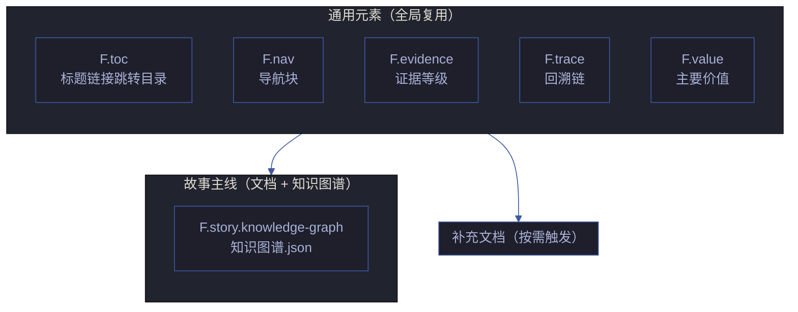
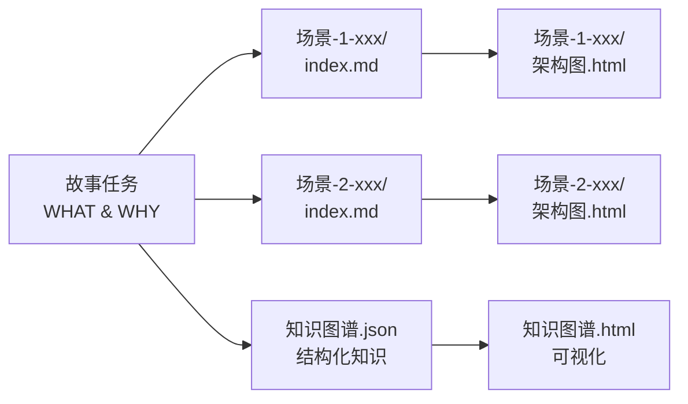
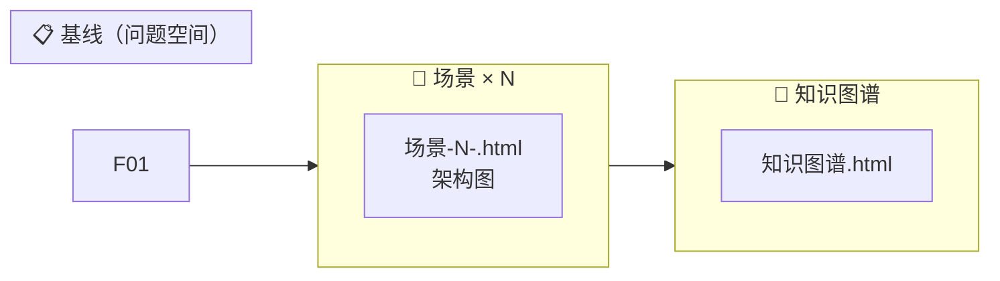
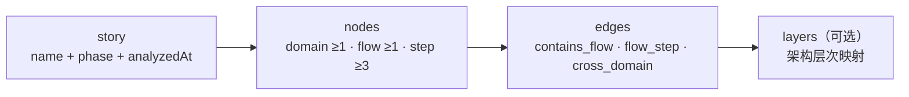

# 故事文档公式

> 故事文档的结构单一真相源。章节、表头、字段规约——按此直接产出文档。

[通用元素](#通用元素) · [单基线模型](#单基线模型) · [故事主线公式](#故事主线公式) · [补充文档公式](#补充文档公式)



## 通用元素

> 所有故事文档共用，缺一不可。目录与生命周期见 [coder.md](./coder.md)，生成约束见 [rules/doc-generation.md](../rui-html/rules/doc-generation.md)。

### F.meta — 版本头

```
> | v{version} | {YYYY-MM-DD} | {model} | {tool?} | 🌿 {branch} | ⏱️ {HH:mm}–{HH:mm} | 📎 [CLAUDE.md](../../CLAUDE.md) |
```

| 约束 | 规则 |
|------|------|
| 占位符 | 任何 `{...}` 留到产出视为偏差 |
| 可选字段 | `tool`、`time-range`、`philosophy` 链接（仅 故事任务） |

### F.toc — 标题链接跳转目录

置于 F.meta 之后、正文第一个 `##` 之前。列出文档内所有 `##` 级标题链接，以 `·` 分隔单行排布，无前缀无标签。

```
[§1 概述](#sec1) · [§2 设计](#sec2) · [§3 测试](#sec3) · [§4 附录](#sec4)
```

| 规则 | 说明 |
|------|------|
| 定位 | F.meta 之后，正文首个 `##` 之前，独占一行 |
| 覆盖 | 文档内全部 `##` 级标题，不遗漏 |
| 锚点 | 统一使用 `<a id="..."></a>` 显式锚点（纯 ASCII kebab-case），置于目标 `##` 标题上方 |
| 格式 | 单行，纯 `[标题](#id)` · `[标题](#id)` ...，无前缀无标签 |
| 排列 | 按标题在文档中的出现顺序 |
| 豁免 | `README.md` / `CLAUDE.md` 等索引文件不要求 F.toc |

### F.nav — 导航块



**标记格式**：`> **导航**: [← {标题}](./{文件}.md) · [{标题} →](./{文件}.md)`

**前驱/后继规则**：

| 文档 | 前驱 `←` | 后继 `→` |
|------|----------|---------|
| 故事任务 | 省略 | 场景-1-<slug>/index.md |
| 场景-N-<slug>/index.md | 故事任务（N=1）或 场景-{N-1}/index.md | 场景-{N+1}/index.md（如有）或 知识图谱.json |
| 场景-N-<slug>.html | 场景-N-<slug>.md | —（链尾） |
| 知识图谱.json | 最后一个场景 | 知识图谱.html |
| 知识图谱.html | 知识图谱.json | —（链尾） |

**导航仅在最邻近制品间**：故事任务 ↔ 场景 1 · 场景间 N→N+1 · 最终场景 → 知识图谱。

### F.evidence — 证据等级

| 等级 | 含义 | 写入规则 |
|------|------|---------|
| A | 已验证（附路径） | 直接写入 |
| B | 可推导（附规则） | 直接写入 |
| C | 未验证 | 标注 `> 待补充` |
| D | 禁止 | 视为幻觉，不得出现 |

### F.trace — 回溯链

> 每个文档必须包含回溯链，确保任意断言可追溯到来源需求或决策。


| 元素 | 位置 | 约束 |
|------|------|------|
| **来源引用** | 文档头部，紧随 meta | 标注本文档由哪个需求/故事/决策触发，附文件路径或 commit |
| **证据附路径** | 每个断言/结论旁 | 验证通过的附可执行命令；未验证的标 `> 待补充` |
| **交叉引用** | 提及外部文档/模块处 | 使用相对路径 `[文件名](./文件.md)` 链接，禁止裸文件名 |
| **变更记录** | 文档末尾 | `\| 日期 \| 变更 \| 触发 \| 证据 \|`，每次修改追加一行 |

| 约束 | 规则 |
|------|------|
| 无来源不断言 | 每个结论必须有来源引用或证据路径，无来源的断言标为 C 级 |
| 交叉引用可点击 | 所有文档间引用使用 markdown 相对链接 |
| 变更可追溯 | 每次文档修改追加变更记录行，含触发原因 |

### F.value — 主要价值

> 每个故事文档必须包含 `### 主要价值` 节，位于文档元信息之后、主体内容之前。

```
### 主要价值

- 🎯 {价值主张 1}
- 🔒 {价值主张 2}
- ⚡ {价值主张 3}
- 📊 {价值主张 4}
```

| 约束 | 规则 |
|------|------|
| 数量 | ≥ 4 条，分行显示 |
| 前缀 | 每条以 emoji + 空格开头，emoji 与价值主张内容相关 |
| 位置 | meta + nav + 来源引用之后，§1 之前 |
| 内容 | 每条 ≤ 一行，描述本故事/文档的核心价值主张 |
| 校验 | 文档审查时检查 `### 主要价值` 节存在且 ≥ 4 条，缺失或不足 = P0 |

---

## 单基线模型

> **故事任务** 是唯一基线文档——定义 WHAT & WHY。**场景-N-<slug>.md** 是场景文档——每个场景自包含技术评审+测试设计+实施报告+测试报告+自改进。**知识图谱** 是结构化知识表示。



| 层 | 制品 | 核心问题 | 说明 |
|------|------|---------|------|
| **问题空间** | 故事任务 | WHAT / WHY | 基线，不溯源。禁止代码路径/API/组件名 |
| **场景层** | 场景-N-<slug>.md + .html | WHO / HOW / DID / LEARN | 每场景自包含全生命周期文档。溯源至故事任务 |
| **知识层** | 知识图谱.json + .html | 结构化知识 | 节点+边+层次。溯源至场景和故事任务 |

## 故事主线公式

### F.story.task — 故事任务 `meta + Story×N`

> 模板参考：[templates/docs/故事任务面板/故事任务.md](../../templates/docs/故事任务面板/故事任务.md)

#### F.story.task 强制元素

| # | 元素 | 位置 | 约束 |
|---|------|------|------|
| 1 | **需求概述** | 项目信息表之后 | 2–5 句概括故事目标与范围，必填 |
| 2 | **效果示意** | 需求概述正下方 | mermaid flowchart，展示当前痛点→目标状态→关键里程碑，必填 |
| 3 | **主要价值** | 效果示意之后 | emoji 前缀列表，每行一条价值主张，≥ 4 条，必填 |

**效果示意约束**：

| # | 规则 |
|---|------|
| 1 | 至少包含 3 层节点：当前痛点 → 目标状态 → 中间关键里程碑 |
| 3 | 必须覆盖故事范围内的核心流程，不可简化为单箭头 |
| 4 | 放在 `### 需求概述` 之后、`### 主要价值` 之前 |


**每个 Story 章节**：

| 章节 | 负责人 | 表头/字段 | 约束 |
|------|--------|----------|------|
| §1 Story | pm | 一段话表述，格式："作为 {角色}，我想要 {功能}，以便 {价值}。优先级 {P0/P1/P2}。范围边界：{边界说明}。依赖：{依赖项}。" + `范围外` 列表 | 必填 |
| §1.1 User Operations | tester | `# \| 操作 \| 触发条件 \| 操作步骤 \| 预期结果`；UI 故事附 mermaid flowchart | 必填 |
| §2 Requirements | pm | 功能点 `FP# \| 描述 \| 输入 \| 输出 \| 错误行为 \| 优先级`；业务规则 `R# \| 描述 \| 校验方式 \| 证据级别`；数据约束 `约束 \| 类型 \| 范围/格式 \| 来源` | 必填 |
| §3 成功标准 | pm | `SC# \| 描述 \| 度量方式 \| 目标值 \| 优先级 \| 关联 FP#`。仅使用用户可感知的度量，禁止技术指标（如 API 延迟、CPU 使用率） | 必填，≥ 3 条 |
| §4 范围边界 | pm | 范围内 `# \| 条目 \| 关联 FP# \| 边界说明`；范围外 `# \| 条目 \| 排除原因 \| 替代方案`；灰色区域 `# \| 条目 \| 触发条件 \| 决策人` | 必填 |
| §5 AC | tester | `AC# \| Given \| When \| Then \| 门禁(Gate A/B)` | 必填 |
| §6 风险与假设 | pm | `# \| 风险/假设 \| 类型(风险\|假设) \| 可能性(H/M/L) \| 影响(H/M/L) \| 缓解/验证策略 \| 关联 FP#` | 必填 |
| §7 跨文档索引 | pm | `本文档章节 \| 基线内容 \| 下游文档编号 \| 预期覆盖 \| 状态(待生成\|已对齐\|偏差)` | 必填 |
| §L 自改进循环 | self-improve | 每次完成追加 | 可选 |
| §R 关联故事 | pm | mermaid flowchart + 表格（`关联故事 \| 关系类型 \| 说明`）。展示本故事与其他故事的 pipeline 链/委托/父子/数据供给等关系 | 有跨故事关系时必填 |

**§3 成功标准约束**：

| # | 规则 |
|---|------|
| 1 | 每条 SC 使用目标用户能理解的描述。正例："用户可在30秒内完成注册流程"。反例："注册API P95延迟 < 200ms" |
| 2 | 每条 SC 必须有客观度量方式，不接受主观描述（"用户觉得好用"） |
| 3 | 每条 SC 必须关联至 §2 的至少 1 个 FP# |
| 4 | 禁止出现技术指标：API 延迟、CPU 使用率、内存占用、QPS、数据库连接数 |

**§4 范围边界约束**：

| # | 规则 |
|---|------|
| 1 | 每个明确不做的事项必须写进范围外并注明原因 |
| 2 | 边界模糊的待定事项标注决策人与触发条件 |
| 3 | 范围外条目若有关联替代方案，必须写出 |

**§6 风险与假设约束**：

| # | 规则 |
|---|------|
| 1 | 每个风险必须关联至至少 1 个 FP# 或成功标准 SC# |
| 2 | 可能性 H/M/L 必须基于可说明的来源（历史数据/类似项目/专家判断），不可凭空标注 |
| 3 | 假设如有验证策略则标注验证方式与时间窗口 |

**§7 跨文档索引约束**：

| # | 规则 |
|---|------|
| 1 | 必须覆盖所有场景文档（场景-N-<slug>.md）和知识图谱 |
| 2 | 每个下游文档至少映射 1 条基线内容 |
| 3 | 生成阶段初始状态为"待生成"，文档产出后更新为"已对齐"或"偏差" |
| 4 | 偏差项必须链接到对应下游文档的具体章节说明原因 |

### F.story.scene — 场景-N-<slug>.md `meta + nav + §0 技术评审 + §1 测试设计 + §2 实施报告 + §3 测试报告 + §4 自改进`

> 模板参考：[templates/docs/故事任务面板/场景-<N>-<slug>.md](../../templates/docs/故事任务面板/场景-<N>-<slug>.md)。每个场景自包含全生命周期文档。


| 章节 | 内容 | 负责人 |
|------|------|--------|
| 概述 | 角色 + 目标 + 优先级 + 图谱定位（领域层/结构层/内容层） | pm |
| §0 技术评审 | 效果示意（mermaid/ASCII 布局线框）+ 数据流序列图 + 涉及模块 + API 端点(curl) + 设计评审清单 | pm + coder |
| §1 测试设计 | 正常路径用例(TC-N) + 边界/异常用例(TC-B) + Gate A 交接 | tester |
| §2 实施报告 | 操作步骤记录 + 开发源码清单 + 测试源码清单 + 依赖图 + P0 审查表 + 效果验证(后端curl截图/前端UI截图编号步骤) | coder |
| §3 测试报告 | 操作步骤记录 + 执行摘要 + 用例详情 + 失败分析与修复 | tester |
| §4 自改进 | D0-D7 诊断 + 改进清单 + 评审清单 | self-improve |

> 场景文档内 §0-§4 按管线阶段顺序填充：文档生成→实现→验证→自改进。不可提前创建后续章节。

### F.story.scene 约束

| # | 规则 |
|---|------|
| 1 | 场景按 N 从 1 开始递增，命名 `场景-N-<slug>.md` |
| 2 | 每个场景自包含 §0-§4 全生命周期章节 |
| 3 | 架构图命名 `场景-N-<slug>.html`，与场景.md 同名不同扩展名 |
| 4 | 场景间通过 F.nav 前驱/后继链接 |

**§0 技术评审约束**：

| # | 规则 |
|---|------|
| 1 | 情感目标描述用户在完成场景后的心理状态。正例："用户感到安全可控"。反例："用户点击确认按钮" |
| 2 | 每条体验基线必须关联至 §2 的 ≥1 个场景 |
| 3 | 成功感知描述用户如何知道目标已达成。正例："看到订单确认页面和预计送达时间"。反例："API 返回 200" |

---


### F.story.knowledge-graph — 知识图谱 `meta + story → nodes(domain+flow+step) → edges → layers`

> 必选文档。pm 在文档生成阶段创建骨架，coder 在实现阶段补充实现节点。每个故事目录一个 `知识图谱.json`。



| 章节 | 内容 | 必填 |
|------|------|------|
| story | `name \| phase \| analyzedAt` — 故事元信息 | ✓ |
| nodes | domain: `id=domain:<kebab> \| type=domain \| name \| summary \| tags \| complexity \| domainMeta{entities,businessRules,crossDomainInteractions}` | ✓ |
| nodes | flow: `id=flow:<kebab> \| type=flow \| name \| summary \| tags \| complexity \| domainMeta{entryPoint,entryType}` | ✓ |
| nodes | step: `id=step:<flow>:<step> \| type=step \| name \| summary \| tags \| complexity` | ✓ |
| edges | `source \| target \| type \| weight` — contains_flow / flow_step / cross_domain | ✓ |
| layers | `id=layer:<kebab> \| name \| description \| nodeIds[]` — 架构层次映射 | 按需 |

**验证规则**：≥ 1 domain + ≥ 1 flow + ≥ 3 steps / 每条边的 source/target 指向已存在的 node ID / step weight 连续递增 0.1, 0.2, ...

### F.supp.architecture-diagram — 架构图 `模板渲染 → 自包含 HTML`

> 每个使用场景生成一个架构图。深色主题 HTML+SVG，自包含（无外部依赖，仅 Google Fonts + CDN jsPDF/html2canvas + SRI）。

| 字段 | 内容 | 必填 |
|------|------|------|
| 触发条件 | 使用场景含交互/数据流/组件关系 | — |
| 文件命名 | `架构图/<场景-slug>.html`，总览为 `架构图/index.html` | ✓ |
| 标题 | 故事名 + "架构" + pulsing dot 指示器 | ✓ |
| 副标题 | 场景一句话描述 | ✓ |
| SVG | 深色背景 `#020617` + 网格 + 组件盒（按色板）+ 连接线（箭头 z-order 先于组件）+ 边界区域 + 图例 | ✓ |
| 信息卡片 ×3 | 关键要点 / 数据流 / 技术选型（每卡含 dot + 标题 + 列表） | ✓ |
| 导出工具栏 | `⋯` 按钮 → 📋 Copy (PNG) / 🖼️ PNG / 📄 PDF（html2canvas + jsPDF，CDN + SRI 不动） | ✓ |
| 页脚 | 项目名 + 生成日期 + 分支 | ✓ |

色板语义：前端/UI→cyan · 后端/服务→emerald · 数据库/存储→violet · 云/基础设施→amber · 安全→rose · 消息总线→orange · 外部→slate。

详见 [rules/architecture-diagram.md](../rui-html/rules/architecture-diagram.md)。

---

> **补充文档公式**（8 种按需触发文档 + 自定义回退）→ 详见 **[formulas/supplement.md](formulas/supplement.md)**。

---
## 使用约定

| 操作 | 规则 | P0? |
|------|------|:---:|
| 生成 | 按公式逐章节产出，不依赖模板文件 | — |
| 主要价值 | **每个故事文档必须含 `### 主要价值` 节**：emoji 前缀列表，≥ 4 条价值主张，分行显示。位于文档标题/元信息之后、主体内容之前 | ✅ |
| 效果示意 | **故事任务必须含 `### 效果示意` 节**：mermaid flowchart 展示当前痛点→目标状态→关键里程碑。节点 ≥ 5，默认配色。位于需求概述之后、主要价值之前。场景 §0 必须含效果示意 mermaid 图 | ✅ |
| 效果验证 | **场景 §2 实施报告必须含效果截图**：后端每接口 ≥ 1 张终端截图，前端每场景 ≥ 1 张 UI 截图，覆盖正常态+关键状态 | ✅ |
| 可操作验证 | **场景 §2 实施报告必须含可操作验证步骤**：每接口提供 curl 命令（`bash` fenced 块，使用 `${BASE_URL}`），每场景提供编号操作步骤 | ✅ |
| 回溯链 | **每个文档必须含来源引用 + 变更记录**：来源引用紧随 meta；变更记录位于文档末尾 `\| 日期 \| 变更 \| 触发 \| 证据 \|`。无来源不断言 | ✅ |
| 交叉引用 | 文档间引用必须使用 markdown 相对链接，禁止裸文件名。每个断言附证据路径或标注 `> 待补充` | — |
| 裁剪 | 措辞修正→仅变更章节；接口变更→同步影响章节；边界重构→全文重生 | — |
| 校验 | F.meta/F.nav 占位符必须替换；表列齐备；mermaid 可渲染（默认配色）；主要价值 ≥ 4 条；效果示意完整（故事任务 + 场景 §0）；效果截图完整（场景 §2）；可操作验证完整（场景 §2）；回溯链闭合；基线溯源（场景 §0）；禁止内容扫描（故事任务 + 场景文档） | ✅ |
| 扩展 | 新文档类型在本文件追加公式块，保持表头规约风格一致 | — |

### P0 检查清单

| # | 检查项 | 验证方式 |
|---|--------|---------|
| 1 | `### 主要价值` 存在且 ≥ 4 条 emoji 前缀行 | grep 计数 |
| 2 | `### 效果示意` 存在（故事任务必含） | grep + mermaid 渲染 |
| 3 | 来源引用存在且为相对链接 | grep 链接格式 |
| 4 | 变更记录表存在且 ≥ 1 行 | grep 表头 |
| 5 | F.meta 无 `{...}` 占位符 | grep 残留 |
| 6 | 所有交叉引用可点击（相对路径有效） | 逐个 verify |
| 7 | 故事任务不含禁止内容（文件路径/API路由/组件名/技术栈名） | 扫描 `/api/`、`/src/`、`<.*>` 组件标签、`Redis\|PostgreSQL\|Express` 等技术栈名 |
| 8 | 场景文档不含禁止内容（技术术语/组件名/API端点） | 扫描技术名词（emit、store、API等）、组件标签、URL 路径 |
| 8b | 故事任务和场景文档**禁止**含 §0 基线声明/基线溯源节（故事任务自身即基线） | grep "基线声明\|基线溯源"；命中 = P0 |
| 9 | 场景 §0-§4 的 §0 基线溯源存在，表头完整，≥ 3 行映射（故事任务自身不要求） | grep "基线溯源"；检查行数 ≥ 表头+3 |
| 10 | 场景 §0 含效果示意 mermaid 图 | grep "效果示意" + mermaid 渲染 |
| 11 | 安全审计含威胁建模且 STRIDE 六类全覆盖 | grep "STRIDE"；检查覆盖 |
| 12 | 场景 §2 实施报告含效果截图，按项目类型检查截图覆盖 | grep "效果验证"；检查截图引用 |
| 13 | 场景 §2 实施报告含可操作验证，按项目类型检查 curl 命令和操作步骤 | grep "curl" 或 "可操作验证"；检查 fenced 块和编号步骤 |

