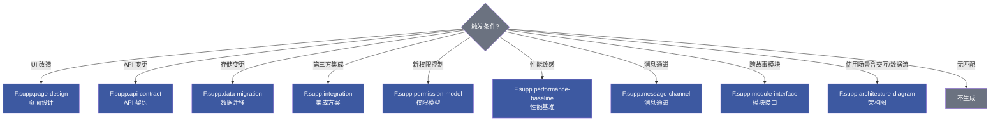

# 补充文档公式

> 按需触发的辅助文档生成公式。主文档：[formulas.md](../formulas.md)

> **共同骨架**：`meta + nav + 触发与范围 + 主体章节 + 与主线对齐 + 评审清单`。存放于故事目录 `{专题}.md`。

## 补充文档速览

| 公式 | 触发条件 | 负责人 |
|------|---------|--------|
| `F.supp.page-design` | §1.1 涉及 UI 改造 | coder |
| `F.supp.api-contract` | §2 新增/修改 API | coder |
| `F.supp.data-migration` | §2 数据存储变更 | coder |
| `F.supp.integration` | 第三方集成 | coder + security |
| `F.supp.permission-model` | 新权限控制 | security |
| `F.supp.performance-baseline` | 性能敏感路径 | coder |
| `F.supp.message-channel` | 新增/变更消息队列/事件总线 | coder |
| `F.supp.module-interface` | 跨故事共享模块 | coder |

## F.supp.page-design — 页面设计

| 章节 | 表头/内容 |
|------|----------|
| §1 触发与范围 | 触发条件 / 涉及页面或组件 / 是否新建路由 / 与前端技术评审的引用 |
| §2 视觉规格 | 2.1 线框图（mermaid 或图片） + `元素 \| 位置 \| 尺寸 \| 颜色 \| 字号`；2.2 设计令牌 `令牌 \| 取值 \| 用途 \| 来源(主题/约定)` |
| §3 交互细节 | 3.1 用户操作流 mermaid；3.2 微交互 `元素 \| 触发 \| 反馈 \| 时长`；3.3 视图状态矩阵 |
| §4 响应式与可访问性 | 4.1 断点 `断点 \| 宽度 \| 布局变化`；4.2 a11y `维度 \| 要求 \| 实现` |
| §5 与主线对齐 | `前端技术评审章节 \| 本文位置 \| 关系(覆盖/补充/差异)` |
| §6 评审清单 | 与前端技术评审一致 / 令牌全部命中 / 状态矩阵齐 / a11y AA / 响应式覆盖 |

## F.supp.api-contract — API 契约

| 章节 | 表头/内容 |
|------|----------|
| §1 触发与范围 | 新增/变更/废弃接口数量 + 兼容策略 |
| §2 端点契约 | 每端点：方法 + 路径 + 请求 schema + 响应 schema + 错误码（fenced JSON 块） |
| §3 字段字典 | `字段 \| 类型 \| 必填 \| 校验 \| 默认 \| 示例 \| 说明`，跨端点复用标 ↗ |
| §4 错误码映射 | `错误码 \| HTTP \| 业务含义 \| 触发条件 \| 客户端建议处理` |
| §5 兼容性 | 5.1 版本策略；5.2 弃用计划 `字段/端点 \| 弃用版本 \| 移除版本 \| 替代` |
| §6 与主线对齐 | `后端技术评审章节 \| 本文位置 \| 关系` |
| §7 评审清单 | schema 完备 / 错误码闭合 / 与后端技术评审一致 / 版本策略明确 / 字段命名规范 |

## F.supp.data-migration — 数据迁移

| 章节 | 表头/内容 |
|------|----------|
| §1 触发与范围 | 涉及表/集合/Key + 数据量级 + 是否需要停机 |
| §2 结构对比 | 旧/新并排表 `字段 \| 旧类型 \| 新类型 \| 变化 \| 默认值 \| 兼容性` + 索引变更表 |
| §3 迁移脚本 | 3.1 步骤 `序 \| 操作 \| 命令/SQL \| 预计耗时 \| 可幂等`；3.2 转换规则 `字段 \| 旧值规则 \| 新值规则 \| 异常处理` |
| §4 回滚方案 | `场景 \| 回滚步骤 \| 数据损失风险 \| RTO`（强制每步骤可回滚） |
| §5 验证 | 5.1 数据完整性 `校验项 \| SQL/命令 \| 期望结果`；5.2 业务验证 `用例 \| 输入 \| 期望` |
| §6 灰度计划 | `阶段 \| 范围 \| 监控指标 \| 退出标准` |
| §7 评审清单 | 脚本可幂等 / 回滚可执行 / 校验覆盖 / 灰度可控 / 数据备份 / 性能影响评估 |

## F.supp.integration — 集成方案

| 章节 | 表头/内容 |
|------|----------|
| §1 触发与范围 | 集成对象 / 协议 / 数据流向 / SLA |
| §2 集成点 | `集成点 \| 方向 \| 协议 \| 频率 \| Payload \| 鉴权方式 \| 端点` |
| §3 契约 | 3.1 调用契约 schema；3.2 回调/Webhook schema；3.3 数据映射 `本系统字段 \| 第三方字段 \| 转换规则` |
| §4 错误处理与重试 | `错误类型 \| HTTP/Code \| 重试策略 \| 退避 \| 最大次数 \| 死信队列` |
| §5 安全考量 | 套用 Security 公式 `# \| 威胁 \| 信任边界 \| 缓解 \| 优先级` |
| §6 监控与告警 | `指标 \| 阈值 \| 告警通道 \| 处置 SOP` |
| §7 评审清单 | 契约完备 / 重试与退避 / 密钥不硬编码 / 告警可达 / 降级策略 / 合规检查 |

## F.supp.permission-model — 权限模型

| 章节 | 表头/内容 |
|------|----------|
| §1 触发与范围 | 引入原因 / 模型选择(RBAC/ABAC/混合) / 影响接口或页面 |
| §2 角色矩阵 | `角色 \| 描述 \| 默认权限 \| 可分配人 \| 互斥角色` |
| §3 资源与动作 | `资源 \| 动作(CRUD...) \| 角色矩阵` 交叉表 |
| §4 资源归属与可见域 | `资源 \| 归属维度(租户/团队/用户) \| 可见域规则 \| 越权检查点` |
| §5 接口权限映射 | `接口/页面 \| 必需权限 \| 检查位置(中间件/控制器/前端守卫) \| 失败码` |
| §6 审计 | `审计事件 \| 触发 \| 字段 \| 留存周期 \| 查询入口` |
| §7 评审清单 | 默认拒绝 / 最小权限 / 审计闭合 / 越权用例覆盖 / 角色互斥校验 / 可降级路径 |

## F.supp.performance-baseline — 性能基准

| 章节 | 表头/内容 |
|------|----------|
| §1 触发与范围 | 路径标识 / SLA 目标 / 测试模型(并发/数据规模) |
| §2 指标定义 | `指标 \| 定义 \| 采集方式 \| 单位 \| 目标(P50/P95/P99)` |
| §3 基线测量 | `场景 \| 数据量 \| 并发 \| P50 \| P95 \| P99 \| 错误率 \| 备注` |
| §4 瓶颈分析 | 4.1 Profile 摘要；4.2 瓶颈 `位置 \| 类型(CPU/IO/锁/网络) \| 占比 \| 优化方向` |
| §5 优化方案 | `# \| 措施 \| 预期收益 \| 风险 \| 验证方式 \| 状态` |
| §6 回归门禁 | `场景 \| 阈值 \| 验证命令 \| 回归触发` |
| §7 评审清单 | 指标可采集 / 基线复现 / 优化可量化 / 回归门禁 / 容量预估 |

## F.supp.message-channel — 消息通道

| 章节 | 表头/内容 |
|------|----------|
| §1 触发与范围 | 通道类型(MQ/EventBus/WebSocket) / 引入原因 / 流量规模 |
| §2 通道清单 | `通道 \| 中间件 \| 主题/Queue \| 生产者 \| 消费者 \| 消息模型(P2P/Pub-Sub) \| 顺序性` |
| §3 消息契约 | 3.1 Schema（fenced JSON）+ 字段字典；3.2 路由键/分区键策略 |
| §4 投递语义 | `通道 \| 语义(at-least-once/exactly-once) \| 幂等键 \| 死信策略 \| 重试上限 \| 积压告警` |
| §5 消费者实现 | `消费者 \| 文件路径 \| 并发度 \| ack 时机 \| 失败处理` |
| §6 监控 | 积压量/消费延迟/失败率/重试次数 阈值表 |
| §7 评审清单 | 契约稳定 / 幂等键覆盖 / 死信路径 / 监控可告警 / 版本兼容 / 反压策略 |

## F.supp.module-interface — 模块接口

| 章节 | 表头/内容 |
|------|----------|
| §1 触发与范围 | 共享模块名 / 引用故事列表 / 演进策略 |
| §2 公开 API | `符号 \| 类型(函数/类/常量/类型) \| 签名 \| 入参 \| 返回 \| 副作用 \| 文件路径` |
| §3 内部边界 | 禁止外部引用的内部符号 + 原因 |
| §4 版本兼容 | `版本 \| 变更摘要 \| 破坏性 \| 迁移指南` |
| §5 使用示例 | 最小用例 + 典型用例（fenced 代码块） |
| §6 关联故事 | `故事 \| 使用方式 \| 引入版本 \| 升级状态` |
| §7 评审清单 | API 稳定 / 破坏性变更标注 / 示例可运行 / 版本号语义化 / 废弃路径明确 |

## 自定义补充

无固定公式时，沿用共同骨架 ad-hoc 生成：

| 约束 | 规则 |
|------|------|
| 文件名 | `{专题}.md`，kebab-case |
| 必含 | `meta + nav + 触发与范围 + 主体 + 评审清单` |
| 主体 | 用表格，避免段落叙述 |
| 映射 | 与主线技术评审文档建立章节级映射 |
