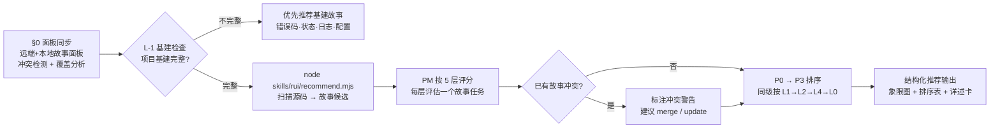
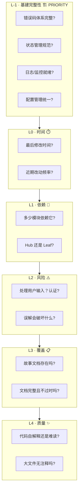
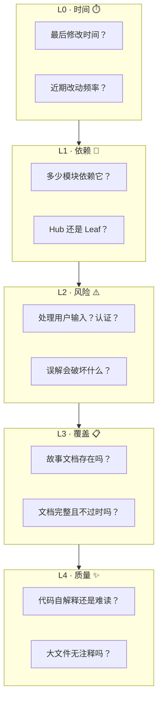
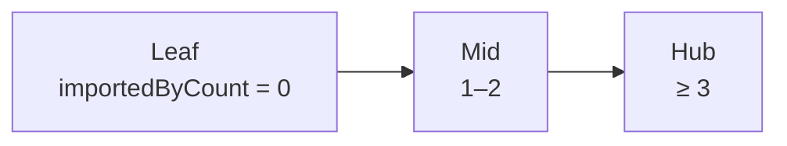
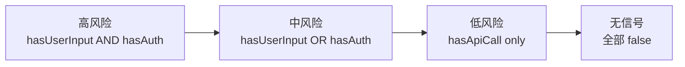
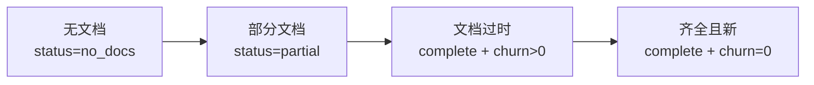
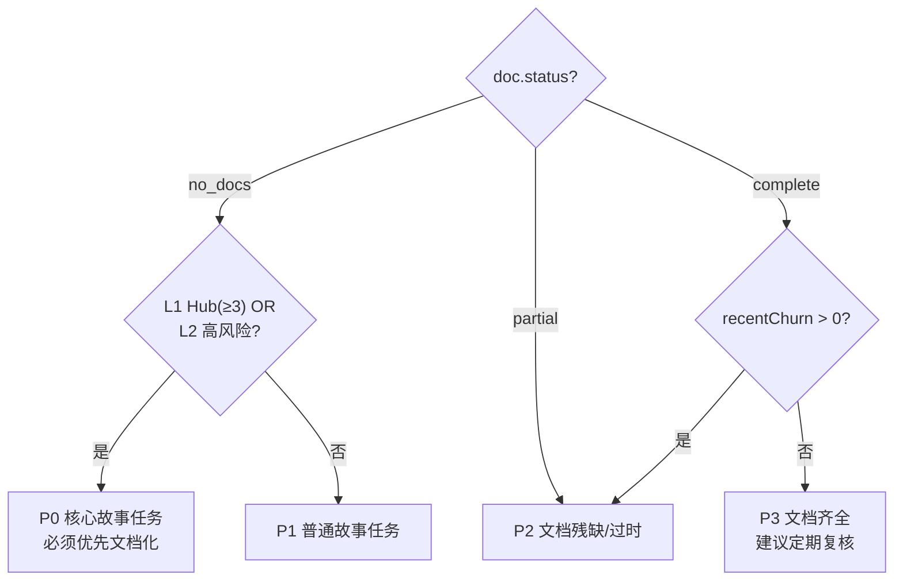
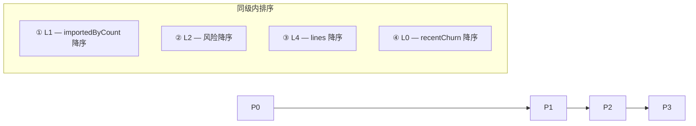
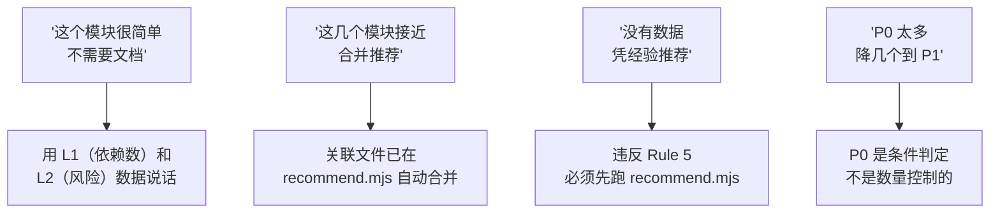

# ranking — 故事任务推荐评分框架

> PM agent 在 `doc --from-code` 探索模式中，按此框架评估推荐故事任务。
> 数据由 `recommend.mjs` 采集为故事候选，评判和排序由 agent 执行。
>
> 哲学：[信模型](../../CLAUDE.md) — agent 是决策者，数据和框架提供支撑。

[推荐管线](#推荐管线) · [6 层链式管线评分](#6-层链式管线评分) · [优先级分类](#优先级分类) · [推荐输出格式](#推荐输出格式) · [Red Flags](#red-flags)

## 推荐管线



> **§0 面板同步**先于所有评分执行。推荐前必须了解当前故事面板全貌，避免重复推荐和冲突。
>
> **L-1 基建检查**先于 L0–L4 执行。基建不完整时优先推荐基建补齐任务，不进入后续评分。

### §0 面板同步 — 推荐前置步骤

> 推荐前必须同步远端 + 扫描本地的故事任务面板内容，确保推荐避免覆盖和冲突。

| 步骤 | 操作 | 说明 |
|------|------|------|
| §0.1 远端同步 | `node skills/rui-import/sync.mjs dir=docs/故事任务面板/ mode=pull` | 拉取远端最新故事面板内容 |
| §0.2 本地扫描 | 遍历 `docs/故事任务面板/` 下所有故事目录 | 读取每个故事的 rui-state.json + 故事任务文档 |
| §0.3 覆盖分析 | 对比推荐候选 vs 已有故事 | 识别内容重叠（≥50% FP# 重叠即冲突） |
| §0.4 冲突标注 | 对冲突候选标注 `⚠ 已有相似故事` | 冲突故事优先建议 `/rui update` 或 yry auto-merge |

**冲突判定规则**：

| 场景 | 判定 | 推荐行为 |
|------|------|---------|
| 候选与已有故事 FP# 重叠 ≥ 70% | 严重冲突 | **跳过推荐**，建议 `/rui update <已有故事>` |
| 候选与已有故事 FP# 重叠 50–69% | 部分冲突 | 推荐但标注 `⚠ 已有相似故事: <name>` |
| 候选与已有故事 FP# 重叠 < 50% | 无冲突 | 正常推荐 |
| 候选的故事目录已存在 | 重复创建 | **跳过推荐**，引导 `/rui doc --from-local` |

每个故事候选来自 `recommend.mjs` 输出的一条记录：

| 字段 | 含义 |
|------|------|
| `storyName` | 故事标识（如 `login-panel-doc`） |
| `command` | 可执行命令（如 `/rui doc --from-code login-panel-doc`） |
| `sourceFiles` | 覆盖的源码文件列表 |
| `coverage.expectedDocs` | 预计产出的文档编号 |
| `doc.status` | 当前文档状态（`no_docs` / `partial` / `complete`） |

## 6 层链式管线评分



### L-1 · 基建完整性

> **最高优先级**。基建不完整时优先推荐基建补齐任务，不进入 L0–L4 评分。
> 设计哲学：标准化基础设施比文档先行更重要——没有统一的错误码/状态/日志规范，后续文档和代码都会产生更大的债务。

**检查清单**（逐项 grep/Read 验证，不确定 = 缺）：

| # | 检查项 | 探测方式 | 缺位影响 |
|---|--------|---------|---------|
| I1 | 错误码体系 | 搜索 `errorCode` / `ErrorCode` / `ERR_` 等统一错误码定义 | 各模块自造错误格式，排查困难 |
| I2 | 状态管理 | 搜索 store / state / context 统一管理方案 | 状态散落各处，数据流不可追溯 |
| I3 | 日志规范 | 搜索 logger / `log.` / `console.` 等统一日志调用 | 日志格式不一，生产排障盲 |
| I4 | 配置管理 | 搜索 config / env / `.env` 等统一配置入口 | 硬编码散落，环境切换出错 |
| I5 | API 契约 | 搜索 API route / endpoint 类型定义或 OpenAPI/Swagger | 前后端契约不一致，联调成本高 |
| I6 | 认证授权 | 搜索 auth / middleware / guard / token 统一方案 | 各路由自造认证，安全审计困难 |
| I7 | 测试框架 | 检查 test/ 目录、测试配置文件、测试命令 | 无测试框架，代码变更无安全网 |

**判定规则**：

| 结果 | 条件 | 行为 |
|------|------|------|
| 基建完整 | 7 项全部有明确证据 | 进入 L0–L4 正常评分 |
| 基建缺位 | 任一项缺位 | 生成「基建补齐」P0 故事推荐，优先于所有 L0–L4 推荐 |
| 基建不确定 | 任一项无法判定 | 标注「待确认」，同时生成基建推荐 + 正常推荐 |

**基建推荐输出格式**：

```markdown
## 🔧 基建补齐推荐（L-1 · 最高优先级）

以下基础设施项在项目中未检测到统一方案，建议优先建立：

| # | 基建项 | 缺位证据 | 建议故事 |
|---|--------|---------|---------|
| 1 | 错误码体系 | 未发现 `ERR_` / `errorCode` 统一定义 | `error-code-system` |
| 2 | 日志规范 | 使用 `console.log` 散落，无 logger 封装 | `logging-standard` |
```

> 基建故事推荐通过 `/rui <需求>` 或 `/rui doc <需求>` 执行，与其他故事走相同管线。

## 5 层链式管线评分



### 各层评分细则

#### L0 · 时间

| 数据源 | 字段 |
|--------|------|
| `git.lastModified` | 最后修改日期 |
| `git.recentChurn` | 近 90 天提交次数 |

| 评价 | 条件 |
|------|------|
| 近期活跃 | 近 30 天有提交 — 代码仍在演进，文档需同步 |
| 中期稳定 | 30–180 天 — 代码稳定，文档可能过时 |
| 长期不动 | > 180 天或无 git 数据 — 低优先级，除非被 L1/L2 拉高 |

**权重**：低。主要在 L3 同级时作平局裁决。

#### L1 · 依赖

| 数据源 | 字段 |
|--------|------|
| `metrics.importedByCount` | 被多少模块引用 |
| `metrics.importedBy` | 引用者列表 |



| 角色 | 条件 | 影响 |
|------|------|------|
| Hub（枢纽） | `importedByCount ≥ 3` | 无文档影响面大 |
| Mid（中间） | `importedByCount = 1–2` | 中度影响 |
| Leaf（叶子） | `importedByCount = 0` | 孤立模块，影响面小 |

**权重**：高。枢纽模块无文档影响面大。

#### L2 · 风险

| 数据源 | 字段 |
|--------|------|
| `security.hasUserInput` | 处理用户输入 |
| `security.hasAuth` | 涉及认证/授权 |
| `security.hasApiCall` | 调用外部 API |



**权重**：高。安全敏感模块误解的破坏面大。

#### L3 · 覆盖

| 数据源 | 字段 |
|--------|------|
| `doc.status` | no_docs / partial / complete |
| `doc.exists` | `故事任务.md` 是否存在 |
| `doc.existingFiles` | 已有文档文件列表 |



**权重**：首要。这是推荐要解决的核心问题。

#### L4 · 质量

| 数据源 | 字段 |
|--------|------|
| `metrics.lines` | 总行数（含关联文件） |
| `metrics.fileCount` | 覆盖文件数 |
| `metrics.signatures` | 提取的接口签名 |

| 评价 | 条件 |
|------|------|
| 大型无文档 | `lines > 200 AND status === "no_docs"` |
| 中型无文档 | `lines 50–200 AND status === "no_docs"` |
| 小型/有文档 | 其他 |

**权重**：低。主要用于工作量校准。

## 优先级分类



| 优先级 | 条件 | 含义 |
|--------|------|------|
| **P0** | `no_docs` AND (`importedByCount >= 3` OR `hasUserInput` OR `hasAuth`) | 核心故事任务，必须优先 |
| **P1** | `no_docs` AND NOT P0 | 普通故事任务 |
| **P2** | `partial` OR (`complete` AND `recentChurn > 0`) | 文档残缺或可能过时 |
| **P3** | `complete` AND `recentChurn === 0` | 文档齐全，定期复核即可 |

### 排序规则



## 推荐输出格式

> PM agent 必须按以下三段式输出，不可降级。

### 1. 全景概览

一句话摘要（故事候选数、无文档率）+ mermaid quadrantChart。

### 2. 故事任务排序表

| # | 故事任务 | 类型 | 覆盖文件 | 优先级 | L1 | L2 | L3 | 理由 |
|---|---------|------|---------|--------|----|----|----|------|
| 1 | `login-panel-doc` | frontend | `LoginPanel.vue` + 2 关联 | P0 | Hub(4) | Auth+I | No docs | 认证组件，4 模块依赖 |
| 2 | `api-auth-doc` | backend | `api/auth.ts` | P0 | Hub(3) | Auth | No docs | 认证 API，3 控制器依赖 |
| 3 | `dashboard-doc` | frontend | `Dashboard.vue` | P1 | Mid(1) | — | No docs | 仪表盘页面无文档 |

| 列 | 说明 |
|----|------|
| 故事任务 | `<name>-doc` |
| 覆盖文件 | 主要源码 + 关联文件数 |
| L1 | Hub(N) / Mid(N) / Leaf |
| L2 | Auth+I / Auth / Input / API / — |
| L3 | No docs / Partial / Stale / Complete |
| 理由 | ≤ 20 字，说清为什么是这个优先级 |

### 3. 每故事详述卡

```markdown
### {#}. {storyName}

**故事标识**：`{storyName}`
**覆盖范围**：{sourceFiles + 关联说明}
**源码证据**：[A] `{primaryFile}` — {signatures 摘要}
**文档现状**：{status} — {expectedDir 是否存在}
**预计产出**：{expectedDocs 列表}
**执行命令**：`{command}`
```

## Red Flags



| Red Flag | 处置 |
|---------|------|
| "这个模块很简单，不需要文档" | 简单是主观判断，用 L1（依赖数）和 L2（风险）说话 |
| "这几个模块功能接近，合并推荐" | 关联文件已在 recommend.mjs 中自动合并，PM 看到的是合并后的故事候选 |
| "没有 recommend.mjs 数据，凭经验推荐" | 违反 Rule 5，必须先跑脚本 |
| "P0 太多了，降几个到 P1" | P0 不是数量控制的，是条件判定的 |
