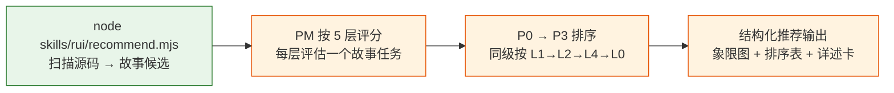
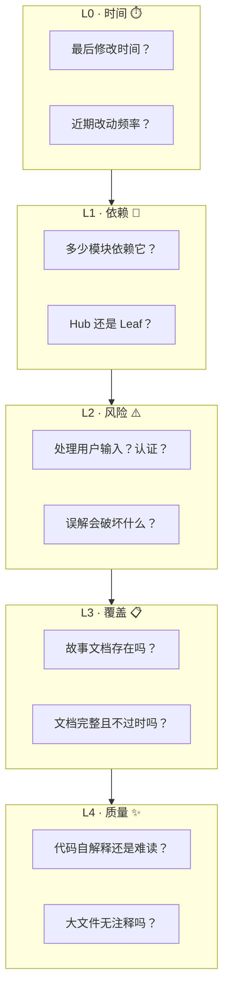
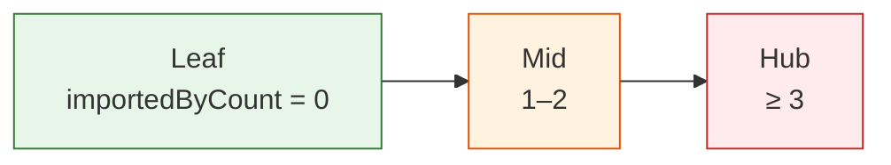
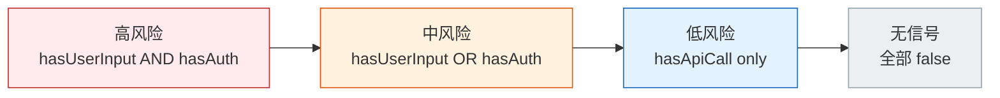
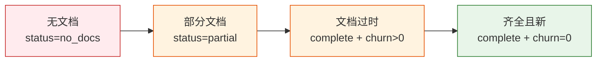
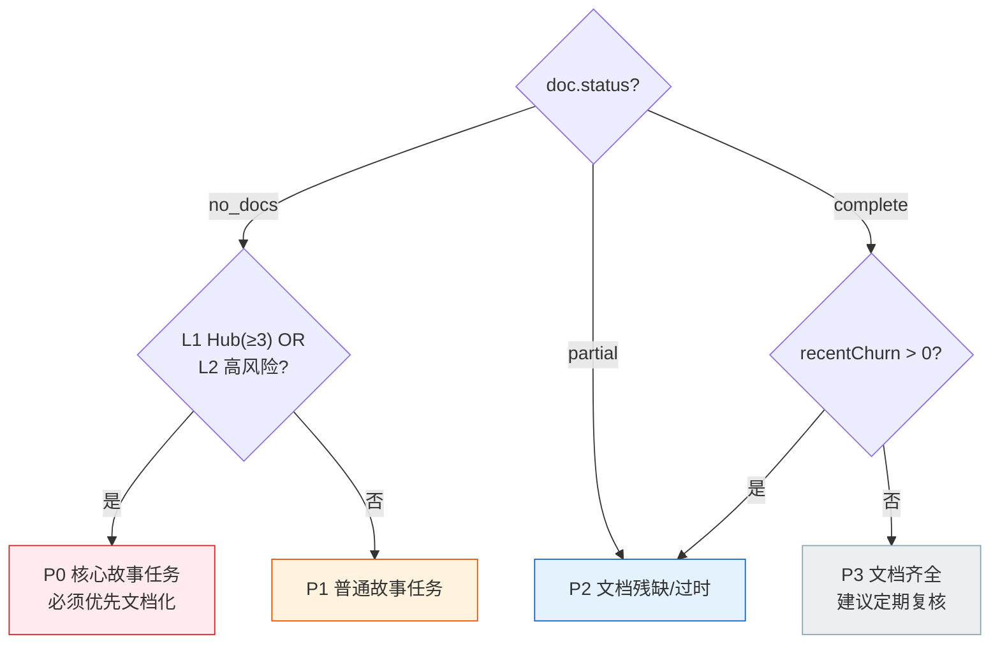
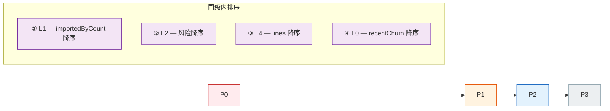
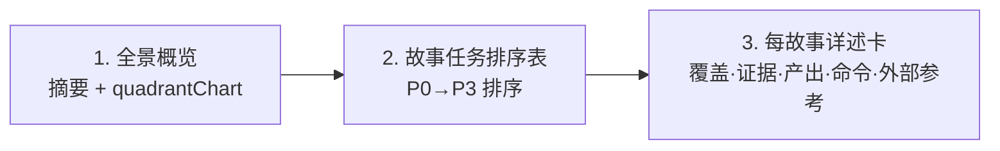
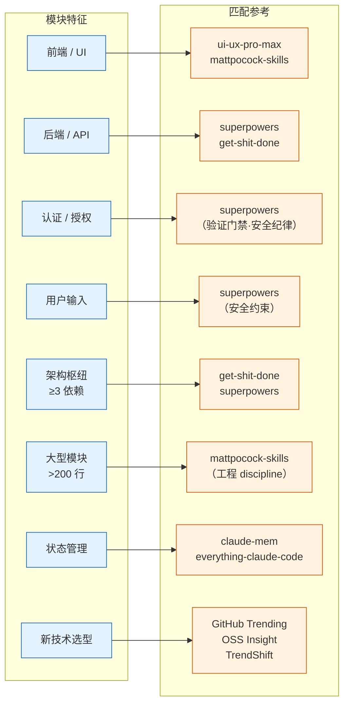
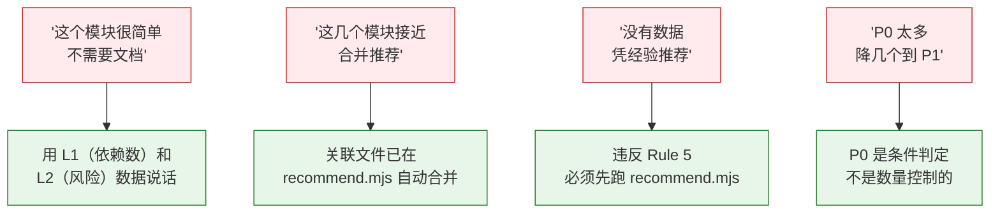

# ranking — 故事任务推荐评分框架

> PM agent 在 `doc --from-code` 探索模式中，按此框架评估推荐故事任务。
> 数据由 `recommend.mjs` 采集为故事候选，评判和排序由 agent 执行。
>
> 哲学：[信模型](../../CLAUDE.md) — agent 是决策者，数据和框架提供支撑。

## 推荐管线



每个故事候选来自 `recommend.mjs` 输出的一条记录：

| 字段 | 含义 |
|------|------|
| `storyName` | 故事标识（如 `login-panel-doc`） |
| `command` | 可执行命令（如 `/rui doc --from-code YiWeb-login-panel-doc`） |
| `sourceFiles` | 覆盖的源码文件列表 |
| `coverage.expectedDocs` | 预计产出的文档编号 |
| `doc.status` | 当前文档状态（`no_docs` / `partial` / `complete`） |

## 5 层链式管线评分



### 各层评分细则

#### L0 · 时间

| 数据源 | 字段 |
|--------|------|
| `git.lastModified` | 最后修改日期 |
| `git.recentChurn` | 近 90 天提交次数 |

| 评价 | 条件 |
|------|------|
| 近期活跃 | 近 30 天有提交 — 代码仍在演进，文档需同步 |
| 中期稳定 | 30–180 天 — 代码稳定，文档可能过时 |
| 长期不动 | > 180 天或无 git 数据 — 低优先级，除非被 L1/L2 拉高 |

**权重**：低。主要在 L3 同级时作平局裁决。

#### L1 · 依赖

| 数据源 | 字段 |
|--------|------|
| `metrics.importedByCount` | 被多少模块引用 |
| `metrics.importedBy` | 引用者列表 |



| 角色 | 条件 | 影响 |
|------|------|------|
| Hub（枢纽） | `importedByCount ≥ 3` | 无文档影响面大 |
| Mid（中间） | `importedByCount = 1–2` | 中度影响 |
| Leaf（叶子） | `importedByCount = 0` | 孤立模块，影响面小 |

**权重**：高。枢纽模块无文档影响面大。

#### L2 · 风险

| 数据源 | 字段 |
|--------|------|
| `security.hasUserInput` | 处理用户输入 |
| `security.hasAuth` | 涉及认证/授权 |
| `security.hasApiCall` | 调用外部 API |



**权重**：高。安全敏感模块误解的破坏面大。

#### L3 · 覆盖

| 数据源 | 字段 |
|--------|------|
| `doc.status` | no_docs / partial / complete |
| `doc.exists` | `01-故事任务.md` 是否存在 |
| `doc.existingFiles` | 已有文档文件列表 |



**权重**：首要。这是推荐要解决的核心问题。

#### L4 · 质量

| 数据源 | 字段 |
|--------|------|
| `metrics.lines` | 总行数（含关联文件） |
| `metrics.fileCount` | 覆盖文件数 |
| `metrics.signatures` | 提取的接口签名 |

| 评价 | 条件 |
|------|------|
| 大型无文档 | `lines > 200 AND status === "no_docs"` |
| 中型无文档 | `lines 50–200 AND status === "no_docs"` |
| 小型/有文档 | 其他 |

**权重**：低。主要用于工作量校准。

## 优先级分类



| 优先级 | 条件 | 含义 |
|--------|------|------|
| **P0** | `no_docs` AND (`importedByCount >= 3` OR `hasUserInput` OR `hasAuth`) | 核心故事任务，必须优先 |
| **P1** | `no_docs` AND NOT P0 | 普通故事任务 |
| **P2** | `partial` OR (`complete` AND `recentChurn > 0`) | 文档残缺或可能过时 |
| **P3** | `complete` AND `recentChurn === 0` | 文档齐全，定期复核即可 |

### 排序规则



## 推荐输出格式

> PM agent 必须按以下三段式输出，不可降级。



### 1. 全景概览

一句话摘要（故事候选数、无文档率）+ mermaid quadrantChart。

### 2. 故事任务排序表

| # | 故事任务 | 类型 | 覆盖文件 | 优先级 | L1 | L2 | L3 | 理由 |
|---|---------|------|---------|--------|----|----|----|------|
| 1 | `YiWeb-login-panel-doc` | frontend | `LoginPanel.vue` + 2 关联 | P0 | Hub(4) | Auth+I | No docs | 认证组件，4 模块依赖 |
| 2 | `YiWeb-api-auth-doc` | backend | `api/auth.ts` | P0 | Hub(3) | Auth | No docs | 认证 API，3 控制器依赖 |
| 3 | `YiWeb-dashboard-doc` | frontend | `Dashboard.vue` | P1 | Mid(1) | — | No docs | 仪表盘页面无文档 |

| 列 | 说明 |
|----|------|
| 故事任务 | `<Project>-<name>-doc` |
| 覆盖文件 | 主要源码 + 关联文件数 |
| L1 | Hub(N) / Mid(N) / Leaf |
| L2 | Auth+I / Auth / Input / API / — |
| L3 | No docs / Partial / Stale / Complete |
| 理由 | ≤ 20 字，说清为什么是这个优先级 |

### 3. 每故事详述卡

```markdown
### {#}. {Project}-{storyName}

**故事标识**：`{storyName}`
**覆盖范围**：{sourceFiles + 关联说明}
**源码证据**：[A] `{primaryFile}` — {signatures 摘要}
**文档现状**：{status} — {expectedDir 是否存在}
**预计产出**：{expectedDocs 列表}
**外部参考**：{externalRefs 列表，按 relevance 排序}
**执行命令**：`{command}`
```

## 外部参考映射

> `recommend.mjs` 已根据模块特征自动匹配生态资源，写入 `externalRefs` 字段。
> PM agent 在推荐时应引用相关的外部参考，帮助用户文档化时参考正确的方法论。
>
> 外部参考来自 [README.md §外部参考](../../README.md#外部参考)。



| 模块特征 | 触发条件 | 匹配的外部参考 |
|---------|---------|--------------|
| 前端 / UI | type === "frontend" | ui-ux-pro-max, mattpocock-skills |
| 后端 / API | type === "backend" | superpowers, get-shit-done |
| 认证/授权 | hasAuth | superpowers（验证门禁·安全纪律） |
| 用户输入 | hasUserInput | superpowers（安全约束） |
| 架构枢纽 | importedByCount ≥ 3 | get-shit-done（上下文工程）, superpowers |
| 大型模块 | lines > 200 | mattpocock-skills（工程 discipline） |
| 状态管理 | 文件名含 store/state/model | claude-mem（记忆模式）, everything-claude-code |
| 全栈 | type === "fullstack" | 全部方法论资源 |
| 新技术选型 | 涉及未使用过的库/框架 | GitHub Trending, OSS Insight, TrendShift（趋势验证） |
| 架构演进 | 涉及跨故事重构 | TrendShift（技术采用信号）, OSS Insight（生态健康度） |

### 引用要求

| 优先级 | 最低引用数 | 要求 |
|--------|:---------:|------|
| P0 / P1 | ≥ 1 个相关外部参考 | 必须在详述卡中列出，说明具体可借鉴的设计理念 |
| relevance = "high" | — | 必须在详述卡中提及，说明可参考的点 |
| relevance = "normal" | — | 可选列出，供用户延伸阅读 |
| PM 补充 | 允许 | 可根据对模块的实际理解，补充 `recommend.mjs` 未覆盖的参考 |

## Red Flags



| Red Flag | 处置 |
|---------|------|
| "这个模块很简单，不需要文档" | 简单是主观判断，用 L1（依赖数）和 L2（风险）说话 |
| "这几个模块功能接近，合并推荐" | 关联文件已在 recommend.mjs 中自动合并，PM 看到的是合并后的故事候选 |
| "没有 recommend.mjs 数据，凭经验推荐" | 违反 Rule 5，必须先跑脚本 |
| "P0 太多了，降几个到 P1" | P0 不是数量控制的，是条件判定的 |
