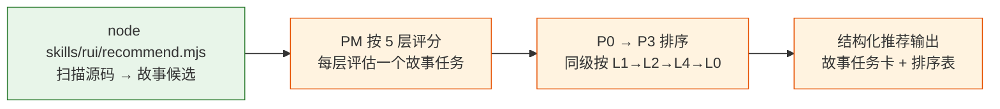
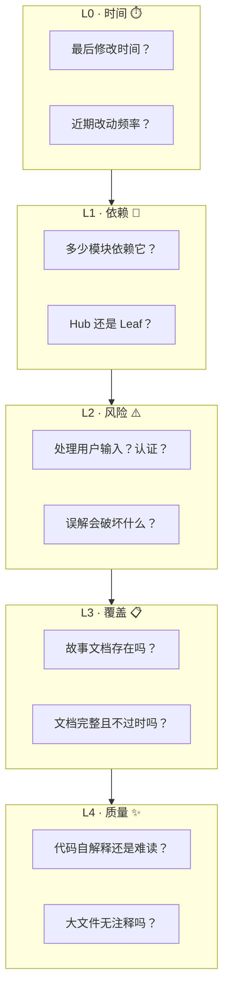
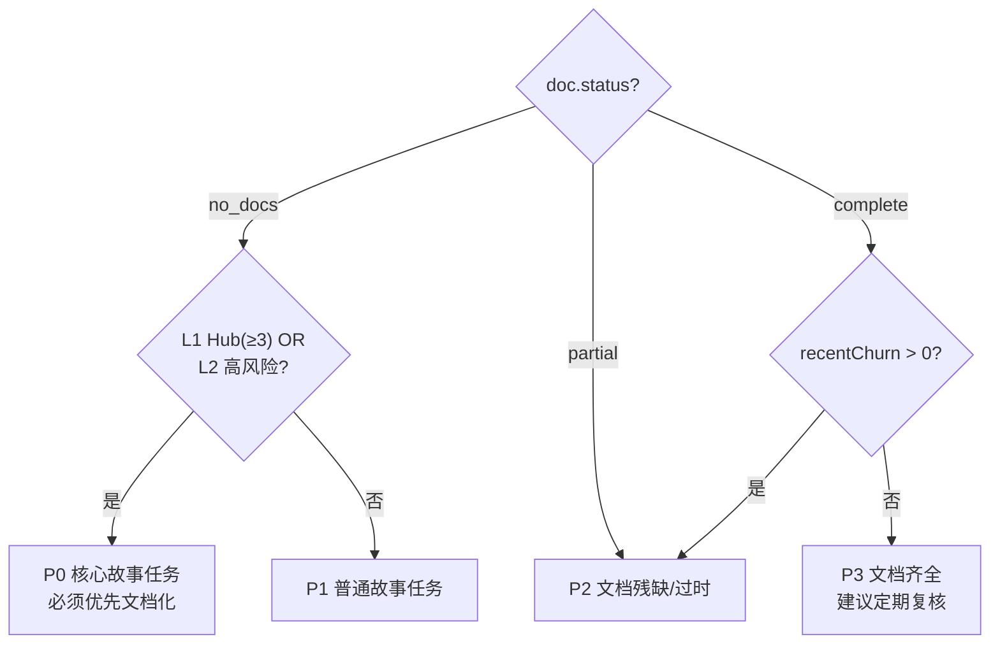
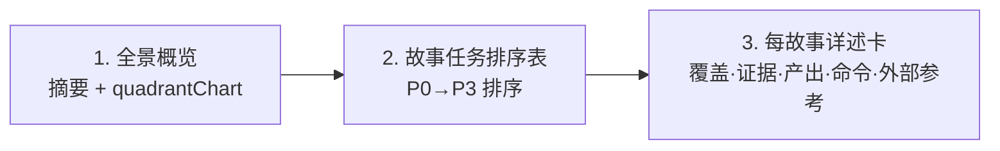

# recommend-criteria — 故事任务推荐评分框架

> PM agent 在 `doc --from-code` 探索模式中，按此框架评估推荐哪些**故事任务**。
> 数据由 `recommend.mjs` 采集为故事候选，评判和排序由 agent 执行。
>
> 哲学：[信模型](../../CLAUDE.md) — agent 是决策者，数据和框架提供支撑。

## 故事任务推荐管线



每个故事任务候选来自 `recommend.mjs` 输出的一条记录，含：
- `storyName` — 故事标识（如 `login-panel-doc`）
- `command` — 可执行命令（如 `/rui doc --from-code YiWeb-login-panel-doc`）
- `sourceFiles` — 覆盖的源码文件列表
- `coverage.expectedDocs` — 预计产出的文档编号
- `doc.status` — 当前文档状态

## 5 层链式管线评分



### 各层评分细则

#### L0 · 时间

| 数据源 | 字段 |
|--------|------|
| `git.lastModified` | 最后修改日期 |
| `git.recentChurn` | 近 90 天提交次数 |

| 评价指引 | 说明 |
|---------|------|
| 近期活跃（近 30 天有提交） | 代码仍在演进，文档需同步 |
| 中期稳定（30–180 天） | 代码稳定，文档可能过时 |
| 长期不动（> 180 天或无 git 数据） | 低优先级，除非被 L1/L2 拉高 |

**权重**：低。主要在 L3 同级时作平局裁决。

#### L1 · 依赖

| 数据源 | 字段 |
|--------|------|
| `metrics.importedByCount` | 被多少模块引用 |
| `metrics.importedBy` | 引用者列表 |

| 评价指引 | 条件 |
|---------|------|
| Hub（枢纽） | importedByCount ≥ 3 |
| Mid（中间） | importedByCount = 1–2 |
| Leaf（叶子） | importedByCount = 0 |

**权重**：高。枢纽模块无文档影响面大。

#### L2 · 风险

| 数据源 | 字段 |
|--------|------|
| `security.hasUserInput` | 处理用户输入 |
| `security.hasAuth` | 涉及认证/授权 |
| `security.hasApiCall` | 调用外部 API |

| 评价指引 | 条件 |
|---------|------|
| 高风险 | hasUserInput AND hasAuth |
| 中风险 | hasUserInput OR hasAuth |
| 低风险 | hasApiCall only |
| 无信号 | 全部 false |

**权重**：高。安全敏感模块误解的破坏面大。

#### L3 · 覆盖

| 数据源 | 字段 |
|--------|------|
| `doc.status` | no_docs / partial / complete |
| `doc.exists` | `01-故事任务.md` 是否存在 |
| `doc.existingFiles` | 已有文档文件列表 |

| 评价指引 | 条件 |
|---------|------|
| 无文档 | status === "no_docs" |
| 部分文档 | status === "partial" |
| 文档过时 | status === "complete" AND git.recentChurn > 0 |
| 文档齐全且新 | status === "complete" AND git.recentChurn === 0 |

**权重**：首要。这是推荐要解决的核心问题。

#### L4 · 质量

| 数据源 | 字段 |
|--------|------|
| `metrics.lines` | 总行数（含关联文件） |
| `metrics.fileCount` | 覆盖文件数 |
| `metrics.signatures` | 提取的接口签名 |

| 评价指引 | 条件 |
|---------|------|
| 大型无文档 | lines > 200 AND doc.status === "no_docs" |
| 中型无文档 | lines 50–200 AND doc.status === "no_docs" |
| 小型/有文档 | 其他 |

**权重**：低。主要用于工作量校准。

## 优先级分类

将五层信号组合为 P0–P3：



| 优先级 | 条件 | 含义 |
|--------|------|------|
| **P0** | `no_docs` AND (`importedByCount >= 3` OR `hasUserInput` OR `hasAuth`) | 核心故事任务，必须优先 |
| **P1** | `no_docs` AND NOT P0 | 普通故事任务 |
| **P2** | `partial` OR (`complete` AND `recentChurn > 0`) | 文档残缺或可能过时 |
| **P3** | `complete` AND `recentChurn === 0` | 文档齐全，定期复核即可 |

**排序规则**：
1. 按优先级 P0 → P1 → P2 → P3
2. 同级内按 L1（importedByCount 降序）→ L2（风险降序）→ L4（lines 降序）→ L0（recentChurn 降序）

## 推荐输出格式

> PM agent 必须按以下三段式输出，不可降级。



### 1. 全景概览

一句话摘要（故事候选数、无文档率）+ mermaid quadrantChart：

```
扫描 {N} 个源代码模块，生成 {M} 个故事任务候选，无文档率 {X}%

```mermaid
quadrantChart
    title 故事任务文档覆盖与风险矩阵
    x-axis "有文档" --> "无文档"
    y-axis "低风险" --> "高风险"
    quadrant-1 "优先文档化"
    quadrant-2 "核心系统（已有文档）"
    quadrant-3 "低优先级"
    quadrant-4 "风险监控"
    ...
\```
```

### 2. 故事任务排序表

| # | 故事任务 | 类型 | 覆盖文件 | 优先级 | L1 | L2 | L3 | 理由 |
|---|---------|------|---------|--------|----|----|----|------|
| 1 | `YiWeb-login-panel-doc` | frontend | `LoginPanel.vue` + 2 关联 | P0 | Hub(4) | Auth+I | No docs | 认证组件，4 模块依赖 |
| 2 | `YiWeb-api-auth-doc` | backend | `api/auth.ts` | P0 | Hub(3) | Auth | No docs | 认证 API，3 控制器依赖 |
| 3 | `YiWeb-dashboard-doc` | frontend | `Dashboard.vue` | P1 | Mid(1) | — | No docs | 仪表盘页面无文档 |

列说明：
- **故事任务**：`<Project>-<name>-doc`
- **覆盖文件**：主要源码 + 关联文件数
- **L1**：Hub(N) / Mid(N) / Leaf
- **L2**：Auth+I / Auth / Input / API / —
- **L3**：No docs / Partial / Stale / Complete
- **理由**：≤ 20 字，说清为什么是这个优先级

### 3. 每故事详述卡

```markdown
### {#}. {Project}-{storyName}

**故事标识**：`{storyName}`
**覆盖范围**：{sourceFiles + 关联说明}
**源码证据**：[A] `{primaryFile}` — {signatures 摘要}
**文档现状**：{status} — {expectedDir 是否存在}
**预计产出**：{expectedDocs 列表}
**外部参考**：{externalRefs 列表，按 relevance 排序}
**执行命令**：`{command}`
```

示例：

```
### 1. YiWeb-login-panel-doc

**故事标识**：`login-panel-doc`
**覆盖范围**：`src/components/LoginPanel.vue` + `src/stores/auth.ts`（状态管理）+ `src/api/auth.ts`（API 调用）
**源码证据**：[A] `src/components/LoginPanel.vue:1-342` — Props: modelValue, disabled, size, mode; Events: submit, cancel, forgot-password
**文档现状**：无文档 — `docs/故事任务面板/YiWeb/login-panel-doc/` 不存在
**预计产出**：01-故事任务 · 03-前端技术评审 · 04-测试用例评审
**外部参考**：
  - [superpowers](https://github.com/obra/superpowers) — 安全模块参考其验证门禁与行为纪律
  - [ui-ux-pro-max](https://github.com/nextlevelbuilder/ui-ux-pro-max-skill) — 登录表单 UI 设计参考其推理规则
  - [mattpocock-skills](https://github.com/mattpocock/skills) — 组件设计参考其工程 discipline
**执行命令**：`/rui doc --from-code YiWeb-login-panel-doc`
```

## 外部参考

> `recommend.mjs` 已根据模块特征（类型、安全信号、依赖规模、文件命名）自动匹配生态资源，写入 `externalRefs` 字段。
> PM agent 在推荐时应引用相关的外部参考，帮助用户文档化时参考正确的方法论。
>
> 外部参考来自 [README.md §外部参考](../../README.md#外部参考)。

### 映射规则

| 模块特征 | 触发条件 | 匹配的外部参考 |
|---------|---------|--------------|
| 前端 / UI | type === "frontend" | ui-ux-pro-max, mattpocock-skills |
| 后端 / API | type === "backend" | superpowers, get-shit-done |
| 认证/授权 | hasAuth | superpowers（验证门禁·安全纪律） |
| 用户输入 | hasUserInput | superpowers（安全约束） |
| 架构枢纽 | importedByCount ≥ 3 | get-shit-done（上下文工程）, superpowers |
| 大型模块 | lines > 200 | mattpocock-skills（工程 discipline） |
| 状态管理 | 文件名含 store/state/model | claude-mem（记忆模式）, everything-claude-code |
| 全栈 | type === "fullstack" | 全部方法论资源 |

### 使用方式

- **P0/P1 故事任务**：至少列出 1 个相关外部参考，说明可借鉴的设计理念
- **relevance = "high"** 的参考：必须在详述卡中提及，说明具体可参考的点
- **relevance = "normal"** 的参考：可选列出，供用户延伸阅读
- PM 可根据对模块的实际理解，补充 `recommend.mjs` 未覆盖的参考

## Red Flags

以下任一出现 = 回到数据重新判断：

- "这个模块看起来很简单，不需要文档" — 简单是主观判断，用 L1（依赖数）和 L2（风险）说话
- "这几个模块功能接近，合并推荐" — 关联文件已在 recommend.mjs 中自动合并，PM 看到的是合并后的故事候选
- "没有 recommend.mjs 数据，我凭经验推荐" — 违反 Rule 5，必须先跑脚本
- "P0 太多了，降几个到 P1" — P0 不是数量控制的，是条件判定的
