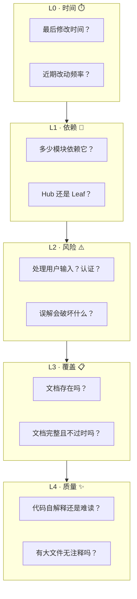
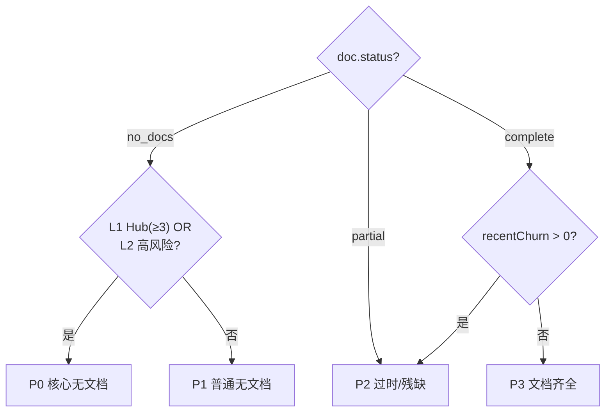
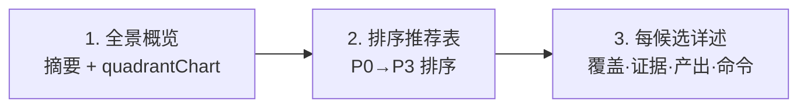

# recommend-criteria — 推荐评分框架

> PM agent 在 `doc --from-code` 探索模式中的评分依据。数据由 `recommend.mjs` 采集，评判由 agent 执行。
>
> 哲学：[信模型](../../CLAUDE.md) — agent 是决策者，数据和框架提供支撑。

## 5层链式管线评分



## 各层评分细则

### L0 · 时间

| 数据源 | 来自 recommend.mjs |
|--------|-------------------|
| `git.lastModified` | 最后修改日期 |
| `git.recentChurn` | 近90天提交次数 |

| 评价指引 | 说明 |
|---------|------|
| 近期活跃（近30天有提交） | 代码仍在演进，文档需同步 |
| 中期稳定（30-180天） | 代码稳定，文档可能过时 |
| 长期不动（>180天或无git数据） | 低优先级，除非被L1/L2拉高 |

**权重**：低。主要在L3同级时作平局裁决。

### L1 · 依赖

| 数据源 | 来自 recommend.mjs |
|--------|-------------------|
| `metrics.importedByCount` | 被多少模块引用 |
| `metrics.importedBy` | 引用者列表 |

| 评价指引 | 条件 |
|---------|------|
| Hub（枢纽） | importedByCount ≥ 3 |
| Mid（中间） | importedByCount = 1-2 |
| Leaf（叶子） | importedByCount = 0 |

**权重**：高。枢纽模块无文档影响面大，应优先文档化。

### L2 · 风险

| 数据源 | 来自 recommend.mjs |
|--------|-------------------|
| `security.hasUserInput` | 处理用户输入 |
| `security.hasAuth` | 涉及认证/授权 |
| `security.hasApiCall` | 调用外部API |

| 评价指引 | 条件 |
|---------|------|
| 高风险 | hasUserInput AND hasAuth |
| 中风险 | hasUserInput OR hasAuth |
| 低风险 | hasApiCall only |
| 无信号 | 全部 false |

**权重**：高。安全敏感模块误解的破坏面大。

### L3 · 覆盖

| 数据源 | 来自 recommend.mjs |
|--------|-------------------|
| `doc.status` | no_docs / partial / complete |
| `doc.exists` | `01-故事任务.md` 是否存在 |
| `doc.existingFiles` | 已有文档列表 |

| 评价指引 | 条件 |
|---------|------|
| 无文档 | status === "no_docs" |
| 部分文档 | status === "partial" |
| 文档过时 | status === "complete" AND git.recentChurn > 0 |
| 文档齐全且新 | status === "complete" AND git.recentChurn === 0 |

**权重**：首要。这是推荐要解决的问题本身——缺文档的模块优先。

### L4 · 质量

| 数据源 | 来自 recommend.mjs |
|--------|-------------------|
| `metrics.lines` | 文件行数 |
| `metrics.signatures` | 提取的接口签名 |

| 评价指引 | 条件 |
|---------|------|
| 大型无文档 | lines > 200 AND doc.status === "no_docs" |
| 中型无文档 | lines 50-200 AND doc.status === "no_docs" |
| 小型/有文档 | 其他 |

**权重**：低。主要用于工作量校准——大文件优先级略高（同样的无文档状态，大文件更急需）。

## 优先级分类

将五层信号组合为 P0-P3：



| 优先级 | 条件 | 含义 |
|--------|------|------|
| **P0** | `no_docs` AND (`importedByCount >= 3` OR `hasUserInput` OR `hasAuth`) | 核心业务模块无文档，必须优先 |
| **P1** | `no_docs` AND NOT P0 | 普通模块无文档 |
| **P2** | `partial` OR (`complete` AND `recentChurn > 0`) | 文档残缺或可能过时 |
| **P3** | `complete` AND `recentChurn === 0` | 文档齐全，建议定期复核 |

**排序规则**：
1. 按优先级 P0 → P1 → P2 → P3
2. 同级内按 L1（importedByCount 降序）→ L2（风险降序）→ L4（lines 降序）→ L0（recentChurn 降序）

## 推荐输出格式

> PM agent 必须按以下三段式输出，不可降级。



### 1. 全景概览

一句话摘要（扫描文件数、无文档率、上次文档更新）+ mermaid quadrantChart：

```
扫描 {N} 个模块，无文档率 {X}%

```mermaid
quadrantChart
    title 模块文档覆盖与风险矩阵
    x-axis "有文档" --> "无文档"
    y-axis "低风险" --> "高风险"
    quadrant-1 "优先文档化"
    quadrant-2 "核心系统（已有文档）"
    quadrant-3 "低优先级"
    quadrant-4 "风险监控"
    ...
\```
```

### 2. 排序推荐表

| # | 项目 | 模块 | 类型 | 源码 | 优先级 | L1 | L2 | L3 | 理由 |
|---|------|------|------|------|--------|----|----|----|------|
| 1 | YiWeb | login-panel | frontend | `src/components/LoginPanel.vue` | P0 | Hub(4) | Auth+I | No docs | 认证组件，4模块依赖 |

列说明：
- **L1**：Hub(N) / Mid(N) / Leaf
- **L2**：Auth+I / Auth / Input / API / —
- **L3**：No docs / Partial / Stale / Complete
- **理由**：≤20字，说清为什么这个优先级

### 3. 每候选详述

```
### {#}. {Project}-{name}-doc

**覆盖范围**：{源文件 + 依赖的关键文件}
**源码证据**：[A] `{file}:{line}` — {签名摘要}
**文档现状**：{status 描述 + 已有文件列表}
**预计产出**：{按项目类型列出文档编号}
**操作**：`/rui doc --from-code {Project}-{name}-doc`
```

## Red Flags

以下任一出现 = 回到数据重新判断：

- "这个模块看起来很简单，不需要文档" — 简单是主观判断，用 L1（依赖数）和 L2（风险）说话
- "这几个模块功能接近，合并推荐" — 每个候选必须独立可验证，宁可多列不可合并
- "没有 recommend.mjs 数据，我凭经验推荐" — 违反 Rule 5，必须先跑脚本
- "P0 太多了，降几个到 P1" — P0 不是数量控制的，是条件判定的
