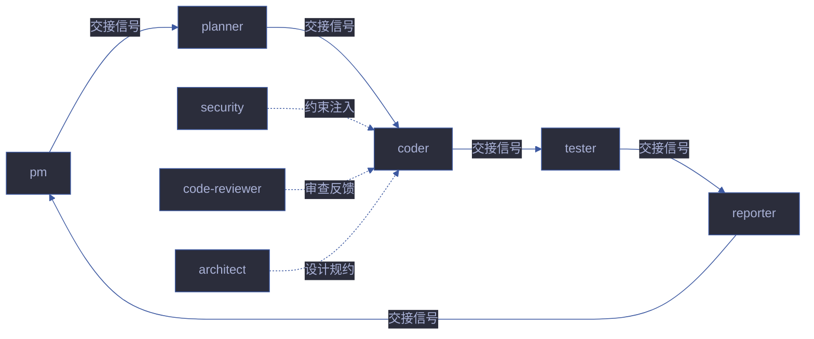

# agent-handoff — Agent 交接规范

> 每个 Agent 的输出必须是下游 Agent 可直接验证的输入。模糊交接 = 管线断裂。

[交接信号格式](#交接信号格式) · [Agent 间契约](#agent-间契约) · [验证标准](#验证标准) · [阻断条件](#阻断条件) · [交接时序](#交接时序) · [常见反模式](#常见反模式)

---

## 交接信号格式

每对 Agent 交接时，产出方必须提供以下结构化信号：

| 字段 | 必选 | 说明 | 示例 |
|------|:---:|------|------|
| `from` | ✓ | 产出 Agent 名 | `pm` |
| `to` | ✓ | 消费 Agent 名 | `coder` |
| `stage` | ✓ | 当前管线阶段 | `doc → code` |
| `deliverable` | ✓ | 交付物路径 | `docs/故事任务面板/user-login/故事任务.md` |
| `acceptance` | ✓ | 下游验证方式 | `grep "FP#" 故事任务.md \| wc -l ≥ 3` |
| `p0_count` | ✓ | 已知 P0 数量 | `0`（必须为 0 方可交接） |
| `evidence_level` | ✓ | 结论证据等级 | `A` / `B` / `C` |
| `blockers` | — | 阻断项（如有） | `no-parse` / `doc-p0` |
| `warnings` | — | 非阻断但需注意的事项 | `§3 安全审计仅覆盖 80% 端点` |
| `timestamp` | ✓ | 交接时间戳 | `2026-06-22T14:30:00Z` |
| `retry_count` | — | 本次交接的重试次数 | `0`（首次）/ `1`（首次重试） |

### 交接信号示例

```json
{
  "from": "pm",
  "to": "coder",
  "stage": "doc → code",
  "deliverable": "docs/故事任务面板/user-login/故事任务.md",
  "acceptance": "grep 'FP#' 故事任务.md | wc -l ≥ 3 && grep 'AC-' 场景-*.md | wc -l ≥ 6",
  "p0_count": 0,
  "evidence_level": "A",
  "blockers": [],
  "warnings": ["§2 技术方案中 OAuth 流程待产品确认"],
  "timestamp": "2026-06-22T14:30:00Z",
  "retry_count": 0
}
```

---

## Agent 间契约

### pm → planner

| 产出 | 验证 | 阻断条件 |
|------|------|---------|
| 故事任务.md（含 FP# / AC / SC / 风险） | 每个 FP# 对应至少 1 条 AC | `no-ac`：FP# 无 AC |
| 场景拆分清单（≥1 场景） | 场景-1~N-\<slug\>.md 均存在 §0 + §1 | `no-scene`：场景数 = 0 |
| 知识图谱基线（story + scene 节点） | `nodes[type=story]` ≥ 1 | `no-kg`：知识图谱为空 |
| 项目类型判定 | 类型为 frontend/backend/fullstack/meta/unknown 之一 | `no-type`：类型未判定 |

**交接前置条件**：
- 故事任务.md §0 含 mermaid 效果示意
- 故事任务.md §3 风险登记 ≥ 3 项
- 所有 FP# 有证据等级标注（A/B/C）

### planner → coder

| 产出 | 验证 | 阻断条件 |
|------|------|---------|
| plan.html + 计划清单.html | 计划清单每项含具体文件路径 | `no-file-map`：计划项无文件路径 |
| 逐模块任务分解（每项 2-5 分钟） | 无 placeholder / TBD | `plan-placeholder`：计划含 TBD |
| P0 预估清单 | P0 项 ≤ 模块数 × 2 | `p0-overflow`：P0 预估过多 |
| 任务依赖图 | 拓扑排序无环 | `circular-plan`：计划存在循环依赖 |

**交接前置条件**：
- 六项自审查全部通过
- 每个 FP# 有对应任务
- 可并行任务已标注

### coder → tester

| 产出 | 验证 | 阻断条件 |
|------|------|---------|
| 实现代码 + git diff | `git diff --stat` 可读 | `no-diff`：无变更 |
| 场景-N-\<slug\>.md §2 实施报告 | 报告含实际文件路径 + 行号 | `no-impl-report`：实施报告缺失 |
| P0 清零证明 | `grep "P0" §2 \| grep -c "✅"` = 报告 P0 数 | `code-p0`：P0 未清零 |
| 影响链追踪 | 二级传递可复核 | `chain-broken`：影响链未闭合 |
| 知识图谱更新 | 新增节点和边已写入 | `no-kg-update`：知识图谱未更新 |

**交接前置条件**：
- 所有模块 P0 清零
- 影响链完整闭合
- 知识图谱 reflects 实际代码结构

### tester → reporter

| 产出 | 验证 | 阻断条件 |
|------|------|---------|
| 场景-N-\<slug\>.md §1 测试设计 + §3 测试报告 | §1 覆盖矩阵每 FP ≥3 类 | `no-coverage`：覆盖不足 |
| Gate B 评估（P0 100% / P1 ≥80% / 修复 ≤2 轮） | Gate B 三项全达标 | `gate-b-limit`：Gate B 未通过 |
| 测试执行输出（原始日志或摘要） | 输出含通过/失败计数 | `no-test-output`：无测试输出 |
| 环境快照 | 含 git hash + node version + 依赖版本 | `no-env-snapshot`：无环境记录 |

**交接前置条件**：
- Gate B 五步验证全部通过
- 测试覆盖率 ≥ 目标阈值
- 无未处理的测试失败

### reporter → pm

| 产出 | 验证 | 阻断条件 |
|------|------|---------|
| 场景文档各 § 交叉引用闭合 | §1/§2/§3 无矛盾 | `xref-broken`：交叉引用有矛盾 |
| 知识图谱一致性报告 | FP ↔ 节点 ↔ 实现 全对应 | `kg-inconsistent`：知识图谱不一致 |
| git commit（策展） | `git log --oneline -1` 含故事名 | `no-curation`：未 commit |
| 交付摘要 | 含变更统计 + 测试结果 + P0 状态 | `no-delivery-summary`：无交付摘要 |

**交接前置条件**：
- 所有报告交叉引用闭合
- 知识图谱一致性检查通过
- 策展结果已 git commit

---

## 验证标准

### 五维验证模型

| 维度 | 达标条件 | 验证命令/方法 | 失败处置 |
|------|---------|-------------|---------|
| **可达性** | 交付物路径存在且可读 | `test -f <path>` | 退回产出 Agent 补文件 |
| **完整性** | 必选字段全部非空 | 逐字段检查 | 退回补全缺失字段 |
| **一致性** | 下游 Agent 解析无误 | 下游 Agent 启动时自检 | 退回修正格式 |
| **可追溯** | 每条结论指向具体文件+行号 | `grep` 追溯 | 退回补证据引用 |
| **无阻断** | `blockers` 为空且 `p0_count` = 0 | 交接前自检 | 阻断，清零后方可交接 |

### 验证流程

```
下游 Agent 收到交接信号后:
  1. 可达性检查 — 交付物路径是否存在
  2. 完整性检查 — 必选字段是否全部非空
  3. 一致性检查 — 解析交接信号是否成功
  4. 可追溯检查 — 抽样验证证据引用
  5. 无阻断检查 — p0_count == 0 && blockers == []

全部通过 → 开始执行
任一失败 → 退回上游，附失败原因和修复建议
```

---

## 阻断条件

| 阻断标识 | 触发条件 | 严重度 | 处置 |
|---------|---------|--------|------|
| `no-handoff` | 产出 Agent 未提供交接信号 | Critical | 退回产出 Agent 补信号 |
| `handoff-incomplete` | 必选字段缺失 | Critical | 退回补全 |
| `handoff-unverifiable` | 下游无法验证（路径不存在 / 命令失败） | Critical | 退回修正路径 |
| `p0-in-handoff` | 交接信号中 `p0_count` > 0 | Critical | 阻断，P0 清零后方可交接 |
| `evidence-downgrade` | 声称 A 但实际为 C | Warning | 降级证据等级并标注 |
| `handoff-stale` | 交接信号 timestamp > 24h 且无新变更 | Warning | 重新生成交接信号 |
| `handoff-retry-exhausted` | 同一交接重试 ≥ 3 次 | Critical | 升级为人工介入 |

### 阻断升级流程

```
1. 首次阻断 → 退回上游，附修复建议
2. 二次阻断 → 退回上游，标注 retry_count=2
3. 三次阻断 → handoff-retry-exhausted，升级为人工介入
```

---

## 交接时序



| 交接 | 触发时机 | 交接方向 | 关键验证 |
|------|---------|---------|---------|
| pm → planner | doc 阶段完成后 | 需求理解 → 实施计划 | FP# 覆盖完整性 |
| planner → coder | 计划审查通过后 | 实施计划 → 代码实现 | 任务粒度 + 无占位符 |
| coder → tester | 逐模块 P0 清零后 | 代码实现 → 质量验证 | P0 清零证明 |
| tester → reporter | Gate B 通过后 | 质量验证 → 过程报告 | Gate B 裁决 |
| reporter → pm | 策展完成后 | 过程报告 → 决策中枢 | 交叉引用闭合 |

---

## 常见反模式

| 反模式 | 表现 | 后果 | 纠正 |
|--------|------|------|------|
| **跳过交接** | Agent 直接开始工作，不等待上游交接信号 | 基于过期/不完整信息工作 | 强制等待交接信号 |
| **模糊交接** | "代码已写好，可以测试了" | 下游不知道测什么 | 使用结构化交接信号格式 |
| **过度交接** | 每个小变更都触发完整交接流程 | 流程开销过大 | 批量交接（T1 更新可合并） |
| **证据降级** | 声称 A 级证据但实际只有 C 级 | 下游基于虚假信心决策 | 交接前证据等级自检 |
| **P0 未清零交接** | 明知有 P0 仍交接给下游 | 下游基于有缺陷的产出工作 | 阻断，P0 清零后方可交接 |
| **交接信号过期** | 交接后上游又做了修改，但未更新信号 | 下游基于过期信息工作 | 交接信号含 timestamp，24h 过期 |