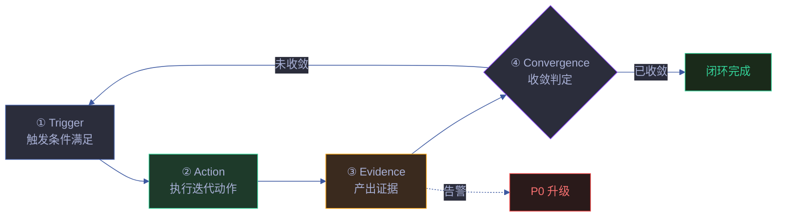
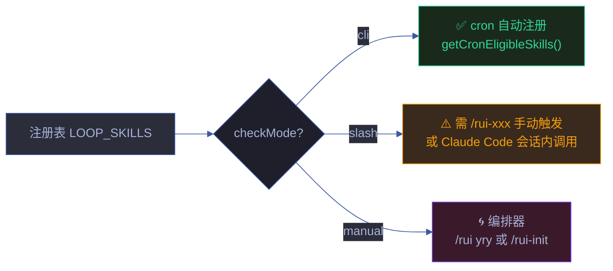
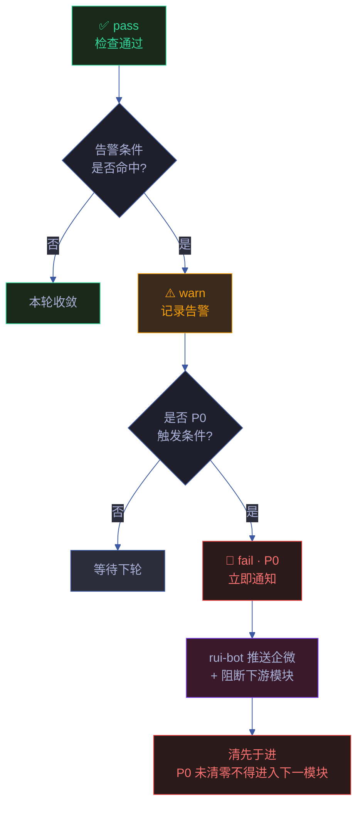
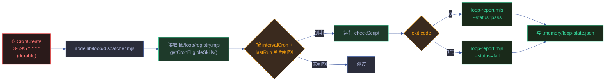

# loop-engineering

> YrY 项目自循环工程规约。定义"什么是合格的自循环"——技能按固定间隔自驱动执行检查 → 产出证据 → 触发告警 → 收敛的闭环机制。本文件是自循环规约唯一真相源，所有技能的 `## 自循环` 段必须遵循此契约。

[四阶段闭环](#四阶段闭环) · [间隔分类法](#间隔分类法) · [6 字段契约](#6-字段契约) · [checkMode 三种模式](#checkmode-三种模式) · [Dispatcher 调度机制](#dispatcher-调度机制) · [P0 升级路径](#p0-升级路径) · [新技能注册流程](#新技能注册流程) · [退化对策](#退化对策) · [与现有规约的关系](#与现有规约的关系)

## 四阶段闭环

| 阶段 | 必填 | 含义 | 示例（rui-npm） |
|------|:---:|------|-----------------|
| ① Trigger | ✅ | 触发条件——何时启动本轮巡检 | `当前目录存在 package.json` |
| ② Action | ✅ | 迭代动作——按步骤执行的检查序列 | `① npm audit → ② 对比上次结果 → ③ 有新增漏洞时告警 → ④ 生成修复建议` |
| ③ Evidence | ✅ | 证据——运行产出，可被验证 | `docs/自循环报告/rui-npm-<date>.html` + `reports.json` 索引 |
| ④ Convergence | ✅ | 收敛判定——何时停止本轮 | `连续 2 次 audit 无新增漏洞` |

**铁律**：没有 ③ Evidence 的自循环等于没做（违反"验先于称"）。证据必须落盘到 `docs/自循环报告/` 目录，由 `loop-report.mjs` 统一索引。

## 间隔分类法

5 类标准间隔，按技能性质选择。新增技能必须从下表选取，不可自定义。

| 分类 | cron 表达式 | 适用场景 | 典型技能 |
|------|-----------|---------|---------|
| **实时** | `*/5 * * * *` | 高频状态轮询，远端可变 | rui-story · rui-bot |
| **半小时** | `*/30 * * * *` | 本地文件变更检测，中等时效 | rui-import · rui-html · rui-health |
| **小时** | `0 * * * *` | 队列/积压类巡检，无需高频 | （预留） |
| **日** | `0 H * * *` | 配置/构建类，日内只跑一次 | rui-claude · rui-config |
| **工作日** | `0 8 * * 1-5` | 开发期检查，周末跳过 | rui-code · rui-doc · rui-plan |
| **周** | `0 H * * 1` 或 `0 H * * 1,4` | 低频审计类，周内一次或两次 | rui-trends · rui-npm · rui-version · rui-analysis · rui-bundle-analyze · rui-skills · rui-reporter · rui-update · rui-yry · self-improve |

**选择原则**：

- 远端可变状态 → 实时或半小时
- 本地文件 mtime 检测 → 半小时
- 远端不可变数据源（如 GitHub Trending）→ 周
- 编排器/手动触发类（rui-init · rui-yry · self-improve）→ 周或 `checkScript: null`（不注册 cron，仅注册到调度器）

## 6 字段契约

每个技能的 `## 自循环` 段必须包含以下 6 个字段，缺一不可：

| 字段 | 含义 | 必填 | 示例 |
|------|------|:---:|------|
| **推荐间隔** | 人类可读的 cron 描述 + cron 表达式 | ✅ | `工作日早 8 点` + `0 8 * * 1-5` |
| **触发条件** | 本轮启动的条件（不是注册 cron 的条件） | ✅ | `有活跃 feat/* 分支且有未提交变更` |
| **终止条件** | 永久停止自循环的条件（不是单轮结束） | ✅ | `所有 feat 分支已合并或关闭` |
| **迭代动作** | 单轮内按序执行的步骤（用 ①②③ 编号） | ✅ | `① 扫描活跃 feat 分支 → ② 检查 P0 清零状态 → ...` |
| **告警条件** | 触发告警的阈值（含 P0/P1/P2 分级） | ✅ | `P0 未清零 > 24h / Gate B 卡在第 2 轮 / 影响链未闭合` |
| **收敛判定** | 单轮结束的判定（与终止条件不同） | ✅ | `所有活跃 feat 分支 P0 清零且 Gate B 通过` |

**字段间的区分**：

- `触发条件` vs `收敛判定`：前者是"何时开始一轮"，后者是"一轮何时结束"
- `终止条件` vs `收敛判定`：前者是"永久停止"（如 token 失效），后者是"本轮完成"（如同步成功）
- `告警条件` vs `收敛判定`：前者是"需要告警"，后者是"不需要再做"

## checkMode 三种模式

技能的 `checkMode` 决定其自循环如何被触发。三种模式互斥，新增技能必须明确选择。

| 模式 | 含义 | checkScript | cron 注册 | 当前技能 |
|------|------|:---:|:---:|---------|
| **cli** | 有独立可执行 node/npx 入口，可无人值守运行 | ✅ 真实路径 | ✅ 自动 | rui-trends · rui-import · rui-story · rui-bot · rui-npm · rui-html · rui-bundle-analyze · rui-health · rui-skills（9 个） |
| **slash** | 纯规约技能，无 CLI；通过 `/rui-xxx` 在 Claude Code 会话内触发 | `null` | ❌ 不注册 | rui-analysis · rui-claude · rui-doc · rui-version · rui-plan · rui-code · rui-update · rui-reporter（8 个） |
| **manual** | 编排器/按需触发，不可无人值守 | `null` | ❌ 不注册 | self-improve · rui-init · rui-yry（3 个） |

**模式选择原则**：

- 技能有 `.mjs` 入口且可无人值守 → `cli`
- 技能仅是规约集合（SKILL.md + rules + tests），需 LLM 解读执行 → `slash`
- 技能是编排器，驱动其他技能 → `manual`

**关键约束**：

- `checkMode: "cli"` 的 `checkScript` 必须指向真实存在的文件——rui-init step 8a 会验证文件存在性，缺失则跳过并告警
- `checkMode: "slash"` 的技能不进入 cron，但仍注册到 `LOOP_SKILLS` 以便 `loop-report.mjs` 能为其生成 HTML 报告（可被手动触发后产出证据）
- `checkMode: "manual"` 的技能不进入 cron，不期望产出定期报告，仅在编排时被调用

## P0 升级路径

| 升级触发条件 | 升级动作 | 涉及技能 |
|-------------|---------|---------|
| `连续 3 次 fail` | 强制 P0，阻断下游模块 | 所有 |
| `综合分 < 60` | P0，立即企微通知 | rui-health |
| `认证/安全类告警`（分支隔离违规·CVE 高危·Token 泄露） | P0，立即阻断 | rui-story · rui-npm · rui-claude |
| `连续 2 周无新信号` | P0（外部退化） | rui-trends |
| `版本号不一致 2 次` | P0（自托管一致性） | rui-version |
| `闭环中断` | P0（自改进失效） | self-improve · rui-yry |

**P0 阻断语义**：违反"清先于进"铁律——P0 未清零不得进入下一模块。rui-bot 收到 P0 信号后立即推送企微通知（Verbose 格式 + High 优先级），并在 `消息通知列表` 中标记阻断。

**Dispatcher 连续 fail 实现**：

Dispatcher 在 `.memory/loop-state.json` 为每个技能维护 `consecutiveFails` 计数器：

| 事件 | 计数器动作 | P0 触发 |
|------|-----------|---------|
| checkScript exit 0 (pass) | 重置为 0 | — |
| checkScript exit ≠ 0 (fail) | 递增 +1 | 当 `consecutiveFails >= 3` 时 `p0Escalated: true` |

P0 升级时：
- 报告 summary 标注 `🚫 P0 升级：<skill> 连续 N 次 fail`
- dispatcher 输出末尾显示 `🚫P0` 标签
- state 文件记录 `p0Escalated: true`
- **仅在新升级时**（`justEscalated`）调用 `loop-report.mjs` 的 `notifyReport()` 发送企微通知，避免每次 fail 重复推送
- 通知失败自动入 rui-bot 失败队列，由 `send.mjs flush` 重试
- 下次 pass 时自动解除 P0 状态（计数器重置）

## 新技能注册流程

新增技能的自循环注册 5 步，缺一步即不生效：

| 步骤 | 动作 | 文件 | 必填字段 |
|------|------|------|---------|
| ① | SKILL.md 写 `## 自循环` 段 | `skills/<name>/SKILL.md` | 6 字段全部填写 |
| ② | `LOOP_SKILLS` 加记录 | `lib/loop/registry.mjs` | skill · icon · label · category · interval · intervalCron · checkMode · checkScript · trigger · termination · iteration · alertConditions · convergence · desc |
| ③ | `LOOP_CHECK_ITEMS` 加清单 | `lib/loop/registry.mjs` | 每项 `{ label, keyword, target }` |
| ④ | `LOOP_CROSS_REFS` 加交叉引用 | `lib/loop/registry.mjs` | `{ dim, desc, impact }` |
| ⑤ | rui-init step 8a 自动注册 cron | `.claude/scheduled_tasks.json` | 仅 checkMode="cli" 技能，由 `getCronEligibleSkills()` 自动派生 |

**字段约束**：

- `checkMode: "cli"` 时 `checkScript` 必须指向真实存在的文件，否则 rui-init step 8a 跳过并告警
- `checkMode: "slash"` 或 `"manual"` 时 `checkScript` 必须为 `null`
- `checkMode: "manual"` 的编排器（rui-init · rui-yry · self-improve）不注册 cron，但仍注册到调度器
- `virtual: true` 标注非真实技能（如 rui-config 是配置文件别名），不进入 cron 注册
- `fastIntervalCron`（可选）——活跃开发期的高频模式，如 rui-analysis 的 `0 */12 * * *`

## 退化对策

| 退化因 | 对策 | 具体战术 |
|--------|------|---------|
| 注册表导入失败 | `loop-report.mjs` 保留 default checklist fallback | `DEFAULT_CHECK_ITEMS` 4 项通用检查 |
| 技能无独立入口 | 标注 `checkScript: null`，rui-init 跳过 cron 但保留调度器注册 | 可被手动 `node skills/rui-bot/lib/loop-report.mjs --skill=<name>` 触发 |
| cron 任务未注册 | rui-init step 8a 输出手动创建命令，不阻断 | 下次 init 时按注册表重建 |
| 报告生成失败 | `loop-report.mjs` 写入 `reports.json` 失败时保留旧索引 | 不覆盖已有 `index.html` |
| 告警通知失败 | 入失败队列，由 `rui-bot flush` 重试 | 3 次后标记 dead，人工介入 |

## Dispatcher 调度机制

所有 `checkMode: "cli"` 技能的 cron 任务**不单独注册**——改由单一 dispatcher 统一调度，减少 Claude Code 会话内 cron 任务数量。

| 组件 | 位置 | 职责 |
|------|------|------|
| Dispatcher | `lib/loop/dispatcher.mjs` | 读注册表、判断到期、运行 checkScript、生成报告、持久化状态 |
| 状态文件 | `.memory/loop-state.json` | 每个技能的 `lastRun` / `lastStatus` / `lastExitCode` / `lastOutput` |
| 注册表 | `lib/loop/registry.mjs` | `getCronEligibleSkills()` 提供 9 个 cli 技能的元数据 |
| 报告生成 | `skills/rui-bot/lib/loop-report.mjs` | 由 dispatcher 调用，生成 HTML 报告 + 更新索引 |
| Cron 任务 | `.claude/scheduled_tasks.json` | 单一 durable 任务 `3-59/5 * * * *`，每 5 分钟触发 dispatcher |

**Dispatcher 命令**：

| 命令 | 作用 |
|------|------|
| `node lib/loop/dispatcher.mjs` | 运行所有到期技能（默认） |
| `node lib/loop/dispatcher.mjs --status` | 查询当前状态（不运行任何 checkScript），输出 9 个 cli 技能的 lastRun/status/cf/p0/overdue 表 |
| `node lib/loop/dispatcher.mjs --skill=<name>` | 强制运行单个技能（忽略到期判断） |
| `node lib/loop/dispatcher.mjs --bootstrap` | 强制运行所有 cli 技能一次（首次部署或覆盖率修复时用） |
| `node lib/loop/dispatcher.mjs --dry-run` | 预览将运行什么，不实际执行 |
| `node lib/loop/dispatcher.mjs --clean-stale` | 删除 >7 天的过期 HTML 报告（每技能保留最近一份） |
| `node lib/loop/dispatcher.mjs --clean-stale --stale-days=14` | 自定义清理阈值 |

**Dispatcher 退出码**（供 cron prompt 判断是否需干预）：

| exit code | 含义 | cron prompt 行为 |
|:---:|------|------|
| 0 | 全部通过或无到期技能 | 静默，无需告知用户 |
| 1 | 有 fail 但未达 P0 | 告知用户哪些技能失败 |
| 2 | 有 P0 升级 | 立即告知用户 + 强调需介入 |

**Overdue 检测**：

dispatcher 每轮检查所有 cli 技能的 `lastRun`，若 `age > 2 × interval` 则标记 ⚠️ OVERDUE（静默停滞——可能是 cron 未触发或 checkScript 挂起）。overdue 不影响 exit code，但在汇总行显示 `⚠️N overdue`。

**单行汇总**：每轮 dispatch 末尾打印单行状态，格式 `N ran, N pass, N fail, 🚫N P0, ⚠️N overdue, N notified`，让 cron prompt 能一眼判断健康度。

**到期判断算法**：

1. 从 `.memory/loop-state.json` 读取每个技能的 `lastRun`
2. 计算 cron 的有效间隔（`*/5` → 5min，`*/30` → 30min，`0 9 * * 1` → 10080min）
3. 如果从未运行：仅当当前时间匹配 cron 窗口时才到期（避免 boot 时全量触发）
4. 如果运行过：`elapsed >= interval + 1min` 则到期（1min 宽限期防重复）

**过期报告清理**：

| 命令 | 作用 |
|------|------|
| `node lib/loop/dispatcher.mjs --clean-stale` | 删除 >7 天的 HTML 报告 + 从 `reports.json` 移除对应条目 |
| `node lib/loop/dispatcher.mjs --clean-stale --stale-days=14` | 自定义阈值（默认 7 天） |

**清理规则**：每个技能至少保留最近一份报告（即使 >7 天），防止历史完全消失。被清理的 HTML 文件从磁盘删除，`reports.json` 同步更新。

**新鲜度跟踪**：`docs/自循环报告/index.html` 的报告列表新增「新鲜度」列，根据技能 `intervalCron` 派生的期望间隔与报告日期对比：

| 状态 | 条件 | 含义 |
|------|------|------|
| `pass` 新鲜 | `age ≤ interval` | 报告在期望间隔内 |
| `warn` 过期 | `interval < age ≤ 2×interval` | 超期但未翻倍 |
| `fail` 陈旧 | `age > 2×interval` | 严重过期，需检查 dispatcher 是否正常运行 |

## 与现有规约的关系

| 规约 | 关系 |
|------|------|
| [rules/code-pipeline.md](../../rui-code/rules/code-pipeline.md) | 自循环产出的 P0 信号阻断 Gate A/B，遵循分支隔离 |
| [rules/delivery-gate.md](./delivery-gate.md) | 自循环报告是交付收口三步 hook 的输入之一 |
| [rules/agent-handoff.md](./agent-handoff.md) | 自循环报告作为 Agent 交接信号，下游可验证 |
| [rules/architecture-principles.md](./architecture-principles.md) | `lib/loop/registry.mjs` 遵循内核轻量原则，是共享库的一部分 |
| [rules/self-improve.md](../../rui-yry/rules/self-improve.md) | D0-D8 诊断引擎消费自循环报告的告警信号 |
| [rules/mermaid-theme.md](./mermaid-theme.md) | 本文件所有 mermaid 图遵循 Tokyo Night Dark 配色 |

## 真相源指针

| 真相源 | 位置 | 消费者 |
|--------|------|--------|
| 技能 loop 元数据 | `lib/loop/registry.mjs` 的 `LOOP_SKILLS` | `loop-report.mjs` · rui-init step 8a |
| 检查项清单 | `lib/loop/registry.mjs` 的 `LOOP_CHECK_ITEMS` | `loop-report.mjs` |
| 交叉引用 | `lib/loop/registry.mjs` 的 `LOOP_CROSS_REFS` | `loop-report.mjs` |
| cron 注册派生 | `lib/loop/registry.mjs` 的 `getCronEligibleSkills()` | rui-init step 8a |
| HTML 报告生成 | `skills/rui-bot/lib/loop-report.mjs` | 所有技能的自循环报告 |
| 报告索引 | `docs/自循环报告/index.html` + `reports.json` | rui-bot 通知 |
