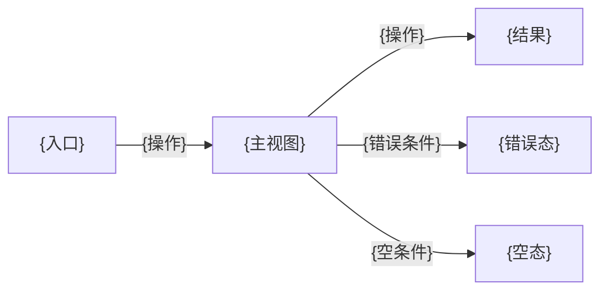
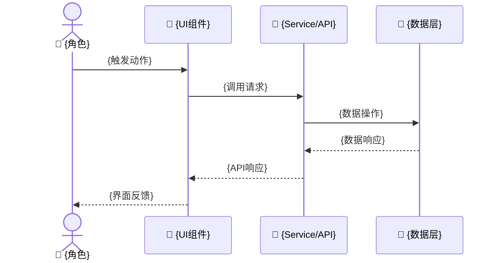
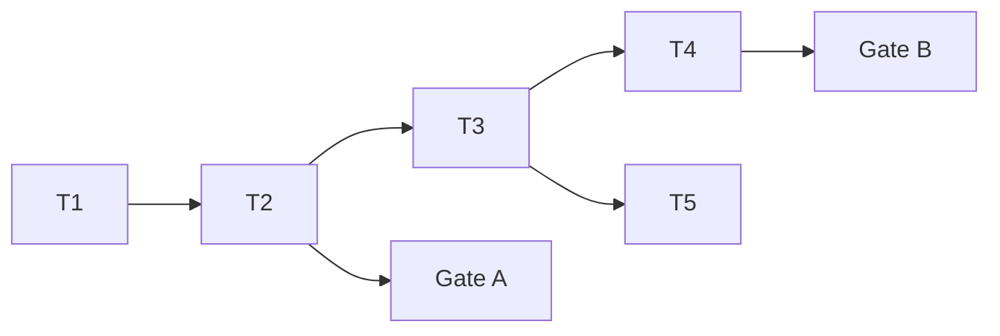

# {故事板标题}

> **第一原则**: 内容能被人类理解和记忆，每个故事板最多 10 个故事，文档内说明依赖。

> | v{version} | {YYYY-MM-DD} | {模型} | {工具} | 🌿 {branch} | ⏱️ {HH:mm}–{HH:mm} | 📎 [CLAUDE.md](../CLAUDE.md) · [design-system.md](../design-system.md) |

> **证据标准**: A=已验证(附路径) · B=可推导(附规则) · C=未验证(标注 `> 待补充`) · D=禁止(视为幻觉)

---

## Story 1: {故事标题}

### §1 Story（pm 定义）

| Field | Detail |
|-------|--------|
| As a | {角色：终端用户/管理员/开发者/...} |
| I want | {动作/功能：用户视角的行为描述} |
| So that | {价值/目的：此行为带来的可感知收益} |
| Priority | 🔴 P0 / 🟡 P1 / 🔵 P2 |
| Scope | {此故事的范围边界：包含什么、明确不包含什么} |
| Depends | [{依赖的故事}](./{story-name}.md#story-N) / — |
| Subproject | {所属子项目，从路径推断} |

**Out-of-Scope**: {明确不做的内容，防止范围蔓延}

---

### §1.1 User Operations（tester 描述）

| # | Operation | Trigger | Step-by-step | Expected Outcome |
|---|-----------|---------|-------------|-----------------|
| U1 | {操作名称} | {触发条件/入口} | 1. {步骤1} → 2. {步骤2} → ... | {操作完成后的预期结果} |
| U2 | {操作名称} | {触发条件/入口} | 1. {步骤1} → ... | {预期结果} |

> tester 从 AC 推导用户可见的操作路径，每个故事至少描述一条主操作流。

#### UI Interaction Flow（designer 注入，涉及 UI 改造时填写）

**视图状态**:

| 视图 | 正常 | 加载 | 空 | 错误 | 禁用 |
|------|------|------|----|------|------|
| {视图A} | {正常态描述} | {骨架屏/spinner/...} | {空文案+引导} | {错误提示+恢复} | — |
| {视图B} | {正常态描述} | {加载方式} | {空态文案} | {错误消息} | {禁用条件} |

**交互追踪**（关联 §1.1 User Operations）:

| U# | 入口 | 动作 | 系统响应 | 出口 |
|----|------|------|---------|------|
| U1 | {入口视图} | {点击/输入/手势} | {跳转/弹窗/toast/状态变更} | {出口视图} |
| U2 | {入口视图} | {操作} | {响应} | {出口视图} |

> designer 为涉及 UI 的故事补充交互流程、视图状态和交互追踪。非 UI 故事省略此节，标注"非 UI 故事，§1.1 仅含 User Operations"。

---

### §2 Requirements（docer 描述）

#### 功能点

| FP# | Description | Input | Output | Error Behavior | Priority |
|-----|-------------|-------|--------|---------------|----------|
| FP1 | {功能点描述} | {输入及约束} | {预期输出} | {错误时行为及用户提示} | 🔴/🟡/🔵 |
| FP2 | {功能点描述} | {输入及约束} | {预期输出} | {错误时行为} | 🔴/🟡/🔵 |

#### 业务规则

| Rule# | Description | Enforcement | Evidence |
|-------|-------------|-------------|----------|
| R1 | {业务规则描述} | {前端校验 / 后端校验 / 两端校验} | A/B/C |
| R2 | {业务规则描述} | {校验方式} | A/B/C |

#### 数据约束

| Constraint | Type | Range/Format | Source |
|------------|------|-------------|--------|
| {字段/参数} | {string/int/date/...} | {长度/范围/格式约束} | {AC / 业务规则 / API 契约} |

> 每条业务规则和数据约束标注证据级别（A/B/C）。C 级约束标注 `> 待补充`。

---

### §3 Design（coder + designer + security 描述）

#### 技术设计（coder 描述）

| Module | File | Responsibility | Change Type |
|--------|------|---------------|-------------|
| {模块} | {路径} | {职责} | 新增 / 修改 / 复用 |
| {模块} | {路径} | {职责} | 新增 / 修改 / 复用 |

**Data Flow**:

| Flow | From | To | Data | Transform |
|------|------|----|------|-----------|
| F1 | {来源} | {目标} | {数据描述} | {转换逻辑} |

#### UI Design Specifications（designer 注入，涉及 UI 改造时填写）

> 参照 [design-system.md](../design-system.md) 中已有 Design Token 和组件规范，确保新增 UI 与项目设计系统对齐。

| # | Specification | Detail | Reference |
|---|--------------|--------|-----------|
| D1 | 页面结构 | {信息架构：导航层级/内容分区/页面布局} | design-system.md §页面模板 |
| D2 | 交互状态 | {每个组件的状态矩阵：正常/悬停/激活/禁用/错误/加载/空} | design-system.md §交互模式 |
| D3 | 视觉规范 | {配色/排版/间距/组件样式} | design-system.md §Design Token |
| D4 | 响应式策略 | {断点 / 布局适配 / 设备优先级} | design-system.md §响应式策略 |
| D5 | 动效与过渡 | {过渡类型 / 持续时间 / 触发条件} | — |
| D6 | 可访问性 | {键盘导航 / 焦点管理 / 对比度 ≥4.5:1 / ARIA 标注} | WCAG 2.1 AA |

> designer 仅在故事涉及 UI 改造时注入。不涉及 UI 改造时删除此节。遗漏错误态或空态 = P0。所有视觉属性必须引用已有 Design Token，不硬编码色值/字号/间距。

#### Security Constraints（security 注入，涉及安全面时填写）

| # | Threat | Trust Boundary | Mitigation | Priority |
|---|--------|---------------|-----------|----------|
| S1 | {威胁描述} | {信任边界：用户输入/外部API/内部服务} | {缓解措施} | P0/P1/P2 |
| S2 | {威胁描述} | {信任边界} | {缓解措施} | P0/P1/P2 |

> security 仅在故事涉及用户输入、外部 API、认证/授权、数据持久化、第三方集成时注入。不涉及安全面时删除此节。

---

### §4 Tasks（pm + coder + designer + security + reporter 拆解）

| ID | Description | Effort | Depends | Deliverable | Agent | Gate |
|----|-------------|--------|---------|-------------|-------|------|
| T1 | {pm: 故事拆解/协调/验收} | S/M/L | — | {产出文件} | pm | — |
| T2 | {designer: UI原型/交互规范/设计走查} | S/M/L | T1 | {设计规范/原型文件} | designer | — |
| T3 | {coder: 实现模块A} | S/M/L | T2 | {源代码} | coder | — |
| T4 | {coder: 实现模块B} | S/M/L | T3 | {源代码} | coder | — |
| T5 | {security: 安全审查/输入消毒} | S/M/L | T3 | {审查报告} | security | — |
| T6 | {tester: 测试方案+原型(Gate A)} | S/M/L | T2 | {测试方案+原型} | tester | Gate A |
| T7 | {tester: 冒烟验证(Gate B)} | S/M/L | T3,T4 | {验证报告} | tester | Gate B |
| T8 | {reporter: 过程记录/依赖映射} | S/M/L | — | {文档/日志} | reporter | — |

**任务依赖图**:

> pm 为主体拆解，各 agent 注入专业任务。非 UI 故事省略 T2（designer 任务）；非安全面故事省略 T5（security 任务）。Gate A 阻断 C2，Gate B >2 轮修复阻断 C4。

---

### §5 Acceptance Criteria（tester 定义）

| AC# | Criterion (Measurable) | Test Method | Expected Result | Gate |
|-----|------------------------|-------------|-----------------|------|
| AC1 | {可度量的验收条件} | `{命令/操作}` | {可验证的预期结果} | Gate A |
| AC2 | {可度量的验收条件} | `{命令/操作}` | {可验证的预期结果} | Gate A |
| AC3 | {可度量的验收条件} | `{命令/操作}` | {可验证的预期结果} | Gate B |
| AC4 | {可度量的验收条件} | `{命令/操作}` | {可验证的预期结果} | Gate B |

> 每个 AC 必须可度量、可验证。Gate A 在 C1 验证（测试方案阶段），Gate B 在 C3 验证（冒烟测试阶段）。

---

## Story 2: {故事标题}

*(重复 §1–§5 结构，最多 10 个 Story)*

---

## 后记

### 报告统计

| Metric | Value |
|--------|-------|
| Stories | {N} |
| UI Stories | {N}（designer 注入）|
| Security Stories | {N}（security 注入）|
| Gate A Items | {N} |
| Gate B Items | {N} |
| Evidence Level | A:{N} · B:{N} · C:{N} |

### 工作流审查

| # | Question | Answer | Evidence |
|---|----------|--------|----------|
| 1 | 重复劳动？ | Yes / No | {具体操作} |
| 2 | 设计规范是否对齐 design-system.md？ | Yes / No / N/A | {对照结果} |
| 3 | 业务规则是否可追溯到 AC？ | Yes / No | {R# → AC#} |

### 技术债识别

| # | Type | Location | Evidence | Priority |
|---|------|----------|----------|----------|
| 1 | 大文件(>300行) | {路径} | A | P1/P2 |
| 2 | 硬编码模式 | {路径:行号} | A | P0/P1 |
| 3 | 重复代码(≥3处) | {路径列表} | A | P1/P2 |
| 4 | 硬编码样式(非Token) | {路径:行号} | A | P1/P2 |

### 改进提案

| Priority | Type | Title | Current → Target | Time Horizon |
|----------|------|-------|------------------|--------------|
| P0/P1/P2 | 架构/工流/规则/技术债/UI一致性 | {标题} | {现状} → {目标} | {下次init/下周/下月} |

### 后续故事

- 作为{角色}，我想要{功能}，以便{价值}。→ [{story-name}](./{story-name}.md#story-N)

### 子项目演进路线

| Phase | Story | Subproject | Depends | Priority |
|-------|-------|-----------|---------|----------|
| 近期 | {后续故事描述} | {子项目} | {依赖} | P1 |
| 中期 | {后续故事描述} | {子项目} | {依赖} | P2 |
| 远期 | {后续故事描述} | {子项目} | {依赖} | P2 |

### .claude 改进清单

> 本故事执行过程中发现的 `.claude` 目录改进点，用于驱动自改进（S0→S5）。每次 rui 完成后 pm 汇总，写入 `docs/.improvement/proposals.jsonl`。

| # | 类别 | 目标 | 问题 | 改进 | 优先级 | 触发条件 |
|---|------|------|------|------|--------|----------|
| 1 | skill | {具体 skill 名} | {当前问题描述} | {改进方向} | P0/P1/P2 | {下次 init / 触发条件} |
| 2 | agent | {具体 agent 名} | {当前问题描述} | {改进方向} | P0/P1/P2 | {触发条件} |
| 3 | rule | {CLAUDE.md / 契约文件} | {当前问题描述} | {改进方向} | P0/P1/P2 | {触发条件} |
| 4 | script | {脚本路径} | {当前问题描述} | {改进方向} | P0/P1/P2 | {触发条件} |
| 5 | config | {配置文件} | {当前问题描述} | {改进方向} | P0/P1/P2 | {触发条件} |

**类别说明**: `skill`=技能定义与流程 / `agent`=Agent 角色与能力 / `rule`=CLAUDE.md/契约/规则 / `script`=脚本与工具 / `config`=settings.json/环境变量/API key 管理

### 系统架构演进任务

> 跨子项目架构变更登记，确保全局一致性。由 pm 在 D3 架构设计阶段识别，D5 策展时确认。

| # | 阶段 | 领域 | 现状 → 目标 | 影响子项目 | 前置条件 | 优先级 |
|---|------|------|-------------|-----------|----------|--------|
| 1 | 近期 | {共享契约 / 数据模型 / 基础设施 / 技术栈} | {当前状态} → {目标状态} | {子项目列表} | {依赖条件} | P0/P1/P2 |
| 2 | 中期 | {领域} | {现状} → {目标} | {子项目列表} | {前置条件} | P1/P2 |
| 3 | 远期 | {领域} | {现状} → {目标} | {子项目列表} | {前置条件} | P2 |

**领域说明**: `共享契约`=跨项目 API/数据契约 / `数据模型`=数据库 schema/存储结构 / `基础设施`=CI/CD/部署/监控 / `技术栈`=框架/库版本升级