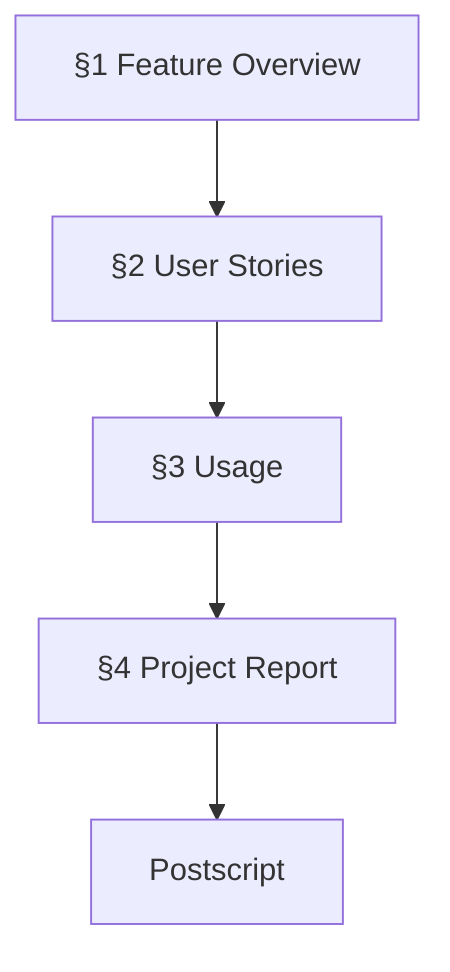
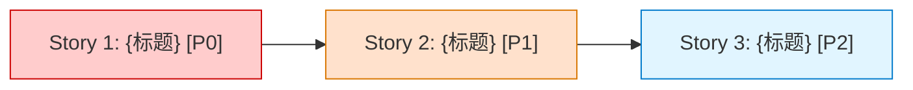
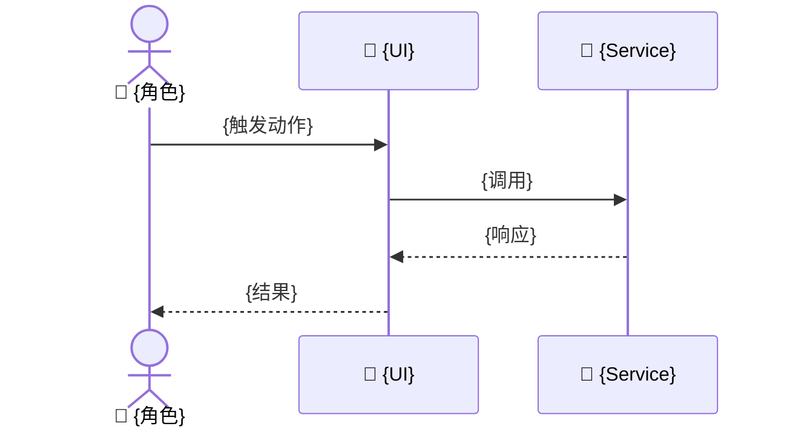

# 📋 {特性名称}

> | v{version} | {YYYY-MM-DD} | {模型} | {工具} | 🌿 {branch}（功能分支） | ⏱️ {HH:mm}–{HH:mm} | 📎 [CLAUDE.md](../CLAUDE.md) |

[📖 §1](#1-feature-overview) | [📋 §2](#2-user-stories) | [📚 §3](#3-usage) | [📈 §4](#4-project-report) | [🔄 后记](#post-mortem)

---

## 📖 1. Feature Overview

| Aspect | Detail |
|--------|--------|
| Problem | {一句话：解决什么问题} |
| Who | {目标用户角色} |
| Scope | {包含范围} |
| Out-of-Scope | {明确排除} |
| Success Metric | {可度量的成功指标} |

### Story Map

{1-2 行说明故事之间的依赖关系和交付顺序。}

---

## 📋 2. User Stories

### 🎯 Story 1: {故事标题}

| Field | Detail |
|-------|--------|
| As a | {角色} |
| I want | {动作/功能} |
| So that | {价值/目的} |
| Priority | 🔴 P0 |
| Scope | {此故事的范围边界} |

#### 2.1.1 Requirements

| FP# | Description | Input | Output | Error Behavior |
|-----|-------------|-------|--------|---------------|
| FP1 | {功能点描述} | {输入} | {预期输出} | {错误时行为} |

#### 2.1.2 Design

{1-2 行说明此故事涉及的关键模块和数据流。}

| Module | File | Responsibility | Change Type |
|--------|------|---------------|-------------|
| {模块} | {路径} | {职责} | 新增 / 修改 / 复用 |

#### 2.1.3 Tasks

| ID | Description | Effort | Depends | Deliverable |
|----|-------------|--------|---------|-------------|
| S1-T1 | {任务描述} | S/M/L | — | {产出文件} |
| S1-T2 | {任务描述} | S/M/L | S1-T1 | {产出文件} |

#### 2.1.4 Acceptance Criteria

| AC# | Criterion (Measurable) | Test Method | Expected Result | Gate |
|-----|------------------------|-------------|-----------------|------|
| AC1 | {可度量的验收条件} | `{命令/操作}` | {可验证的预期} | Gate A / Gate B |
| AC2 | {可度量的验收条件} | `{命令/操作}` | {可验证的预期} | Gate B |

---

### 🎯 Story 2: {故事标题}

| Field | Detail |
|-------|--------|
| As a | {角色} |
| I want | {动作/功能} |
| So that | {价值/目的} |
| Priority | 🟡 P1 |
| Scope | {此故事的范围边界} |

#### 2.2.1 Requirements

| FP# | Description | Input | Output | Error Behavior |
|-----|-------------|-------|--------|---------------|
| FP1 | {功能点描述} | {输入} | {预期输出} | {错误时行为} |

#### 2.2.2 Design

{同 Story 1 结构，按需裁剪}

#### 2.2.3 Tasks

| ID | Description | Effort | Depends | Deliverable |
|----|-------------|--------|---------|-------------|
| S2-T1 | {任务描述} | S/M/L | S1-T2 | {产出文件} |

#### 2.2.4 Acceptance Criteria

| AC# | Criterion (Measurable) | Test Method | Expected Result |
|-----|------------------------|-------------|-----------------|
| AC1 | {可度量的验收条件} | `{命令/操作}` | {可验证的预期} |

---

## 📚 3. Usage

> 跨故事的操作指南，仅当多故事共用时填写。

### ⚡ Quick Start

| Step | Action | Command / Path | Expected Result |
|------|--------|---------------|-----------------|
| 1 | 创建功能分支 | `git checkout -b feat/{特性名称}` | 已切换到新分支 |
| 2 | {操作} | `{命令}` | {预期结果} |
| 3 | {操作} | `{命令}` | {预期结果} |

### 分支策略

此功能在独立分支上开发，编码全部在功能分支完成，验证通过后合并回主干。

| 阶段 | 分支状态 | 操作 |
|------|---------|------|
| 文档阶段 | `feat/{特性名称}` | 文档生成与审查 |
| 编码阶段 | `feat/{特性名称}` | 逐模块实现与审查 |
| 交付阶段 | 合并回 `main` | `git merge --no-ff` 或 PR/MR |

### ❓ FAQ

| # | Question | Answer |
|---|----------|--------|
| 1 | {常见问题} | {简短回答} |

---

## 📈 4. Project Report

### Verification Summary

| Story | P0 AC | P0 Passed | P1 AC | P1 Passed | Gate A | Gate B | Status |
|-------|-------|-----------|-------|-----------|--------|--------|--------|
| Story 1 | {N} | {N} | {N} | {N} | ✅/❌ | ✅/❌ | ✅ / ❌ / 🔄 |
| Story 2 | {N} | {N} | {N} | {N} | ✅/❌ | ✅/❌ | ✅ / ❌ / 🔄 |

### Delivery Summary

| Aspect | Value | Evidence |
|--------|-------|----------|
| Files Changed | {N} | `git diff --stat` |
| Lines Added/Removed | +{N} -{N} | `git diff --shortstat` |
| Stories Delivered | {N}/{N} | §2 Verification Summary |
| Gate A (Test-First) | ✅/❌ | {证据路径} |
| Gate B (Smoke Test) | ✅/❌ | {证据路径} |
| Feature Branch | `feat/{特性名称}` | `git branch --show-current` |
| Merged to Main | ✅/❌ | `git log --oneline main` |

---

## 后期规划与改进

### 🔍 工作流标准化审查

| # | Question | Answer | Evidence |
|---|----------|--------|----------|
| 1 | 重复劳动？ | Yes / No | {具体操作} |
| 2 | 决策标准缺失？ | Yes / No | {模糊决策点} |
| 3 | 信息孤岛？ | Yes / No | {信息缺口} |
| 4 | 反馈闭环？ | Yes / No | {负责人 + 验收节点} |

### 🏗️ 系统架构演进思考

| # | Question | Answer | Evidence |
|---|----------|--------|----------|
| A1 | 当前瓶颈？ | {性能/可维护性/安全/无} | {具体指标} |
| A2 | 下一个演进节点？ | {具体下一步} | {会变化的模块} |
| A3 | 风险与回滚方案？ | {风险 + 回滚策略} | {回滚手段} |

### 📋 后续用户故事

- 作为{角色}，我想要{功能}，以便{价值}。
- 作为{角色}，我想要{功能}，以便{价值}。
