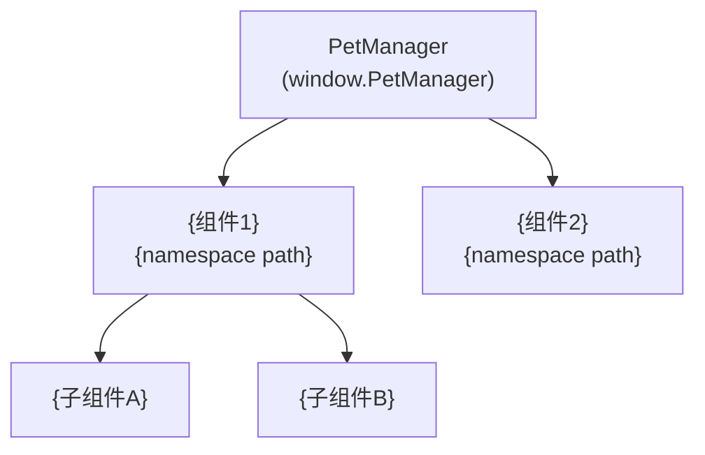
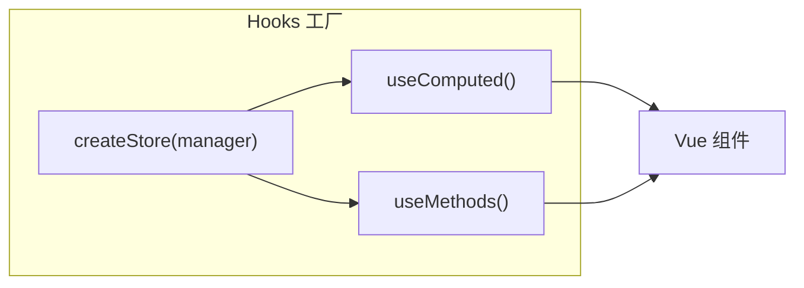
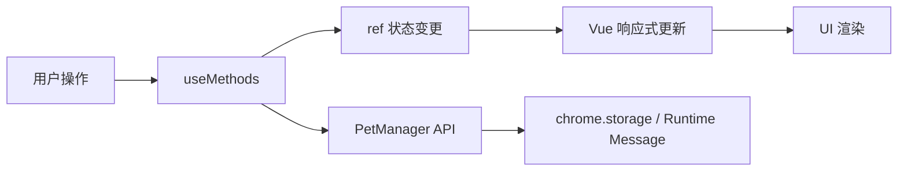
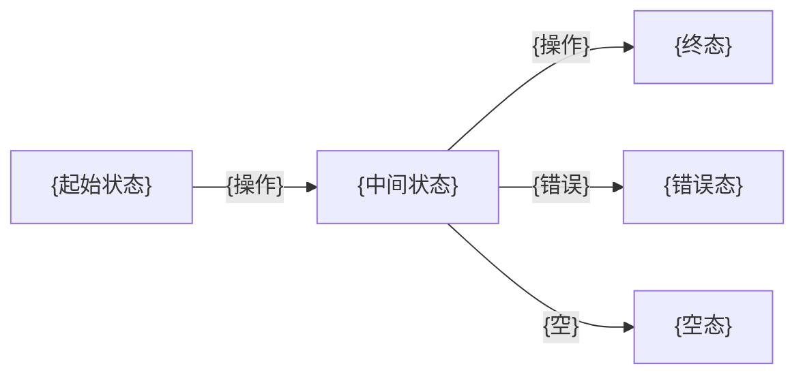

# 前端技术评审: {故事名称}

> | v{version} | {YYYY-MM-DD} | {模型} | 🌿 {branch} |
> 关联: [01-故事任务.md](./01-故事任务.md) · [02-后端技术评审.md](./02-后端技术评审.md)

---

## 1. 组件架构

### 1.1 组件树



> 组件注册路径遵循 `window.PetManager.Components.{ComponentName}` 命名空间约定。

### 1.2 新增/变更组件

| 组件 | 类型 | 文件 | 命名空间路径 | 变更 |
|------|------|------|-------------|------|
| `{ComponentName}` | Vue 组件 / 模块 | `{path}/index.js` | `PetManager.Components.{Name}` | 新增 / 修改 / 复用 |
| `{ComponentName}` | Vue 组件 | `{path}/index.html` | — | 新增 / 修改 |
| `{ComponentName}` | 样式 | `{path}/index.css` | — | 新增 / 修改 |

> 每个组件由 `index.js` + `index.html` + `index.css`（可选）三文件组成。IIFE 封装，挂载到 `window.PetManager.Components` 命名空间。HTML 模板需加入 `web_accessible_resources`。

### 1.3 组件接口

| 组件 | Props | Events | Expose |
|------|-------|--------|--------|
| `{ComponentName}` | `{prop definitions}` | `{event definitions}` | `{exposed methods}` |

---

## 2. 状态管理

### 2.1 Hooks 模式

| Store | 文件 | 状态 | 使用组件 |
|-------|------|------|---------|
| `{storeName}` | `{path}/hooks/store.js` | `{ref definitions}` | `{components}` |



> 遵循 Hooks 工厂模式：`createStore` 创建响应式状态，`useComputed` 提供计算属性，`useMethods` 提供操作方法。Store 通过 `manager` 参数与 PetManager 核心实例交互。

### 2.2 状态流向



| 数据流 | 触发 | 状态变更 | 消费方 |
|--------|------|---------|--------|
| {流名称} | {用户操作/事件} | {ref 变更} | {组件/模块} |

---

## 3. 交互设计

### 3.1 用户操作流



### 3.2 视图状态矩阵

| 视图 | 正常 | 加载 | 空 | 错误 | 禁用 |
|------|------|------|----|------|------|
| {视图A} | {正常态} | {loading 方式} | {空态文案+引导} | {错误提示+恢复} | — |
| {视图B} | {正常态} | {loading 方式} | {空态文案} | {错误消息} | {禁用条件} |

### 3.3 动画与过渡

| 元素 | 动画类型 | 时长 | 触发条件 |
|------|---------|------|---------|
| {元素} | CSS transition / JS animation | {ms} | {条件} |

---

## 4. 样式方案

### 4.1 Tailwind 使用

| 场景 | 方案 | 说明 |
|------|------|------|
| 布局 | Tailwind 类 | flex / grid / spacing |
| 主题色 | Tailwind 类 + CSS 变量 | 遵循 `assets/styles/tailwind.css` 定义 |
| 动画 | Tailwind 类 / CSS @keyframes | 优先 Tailwind 内置 |
| 内容脚本隔离 | `content.css` 作用域前缀 | 防止宿主页面样式污染 |

> Content Script 运行在宿主页面中，所有样式必须通过作用域前缀（如 `.pet-manager-`）隔离。禁止使用全局 reset 或裸标签选择器。

### 4.2 新增样式文件

| 文件 | 用途 | 加载方式 |
|------|------|---------|
| `{path}.css` | {用途} | manifest.json content_scripts.css / 动态注入 |

---

## 5. DOM 与事件

### 5.1 DOM 挂载点

| 组件 | 挂载容器 | 创建方式 | 生命周期 |
|------|---------|---------|---------|
| `{ComponentName}` | `{selector}` | `document.createElement` + `shadowRoot` | {挂载/卸载时机} |

> 推荐使用 Shadow DOM 隔离样式。若组件需与宿主页面交互，使用事件代理模式。

### 5.2 事件处理

| 事件 | 监听方式 | 处理逻辑 | 清理时机 |
|------|---------|---------|---------|
| `{eventType}` | `{addEventListener target}` | {处理逻辑} | {组件卸载时} |

> Content Script 中的事件监听器必须在组件卸载时移除，避免内存泄漏和重复绑定。

---

## 6. Content Script 依赖

### 6.1 加载顺序

manifest.json `content_scripts.js` 中新增脚本的位置：

```
... (现有依赖)
core/utils/dom/domHelper.js          ← 依赖：error, logger
{新增工具文件}                        ← 依赖：{上游依赖}
core/bootstrap/bootstrap.js          ← 初始化入口
... (现有模块)
{新增模块文件}                        ← 依赖：{上游依赖}
core/bootstrap/index.js              ← 启动入口
```

| 新增文件 | 插入位置 | 依赖上游 |
|----------|---------|---------|
| `{path}` | `{after which file}` | `{dependencies}` |

> 加载顺序 = 依赖顺序。新增脚本必须插入到其所有依赖之后、消费方之前。

### 6.2 命名空间注册

| 文件 | 注册到 | 类型 |
|------|--------|------|
| `{path}` | `window.PetManager.{namespace}` | 组件 / 工具 / 模块 |

---

## 7. 评审清单

| # | 检查项 | 结果 |
|---|--------|------|
| 1 | 组件 IIFE 封装，挂载到正确命名空间 | ✅ / ❌ |
| 2 | HTML 模板已加入 web_accessible_resources | ✅ / ❌ |
| 3 | Store 遵循 Hooks 工厂模式（createStore + useComputed + useMethods） | ✅ / ❌ |
| 4 | 样式使用作用域前缀，防止宿主页面污染 | ✅ / ❌ |
| 5 | 事件监听器在组件卸载时清理 | ✅ / ❌ |
| 6 | manifest.json content_scripts 按依赖顺序排列 | ✅ / ❌ |
| 7 | 无 ES module 语法（import/export） | ✅ / ❌ |
| 8 | 新增 CSS 文件已加入 manifest.json 或动态注入 | ✅ / ❌ |
