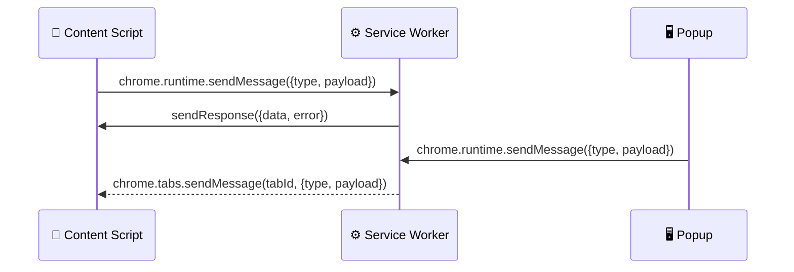
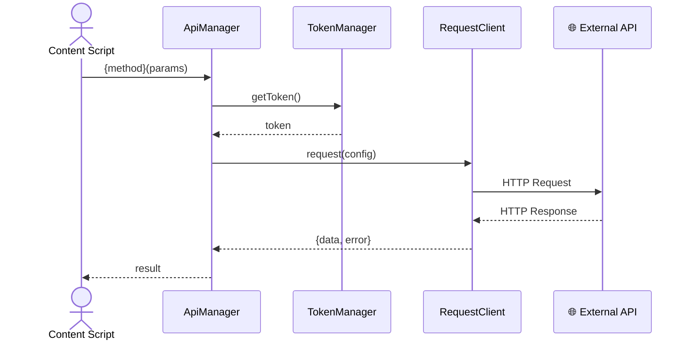

# 后端技术评审: {故事名称}

> | v{version} | {YYYY-MM-DD} | {模型} | 🌿 {branch} |
> 关联: [01-故事任务.md](./01-故事任务.md) · [03-前端技术评审.md](./03-前端技术评审.md)

---

## 1. 背景服务架构

### 1.1 Service Worker 变更

| 变更类型 | 文件 | 说明 |
|----------|------|------|
| 新增 / 修改 / 复用 | `{path}` | {职责} |

> Background Service Worker 无持久状态，唤醒周期短。避免在 SW 中维持长连接或定时器。

### 1.2 消息通道设计

| 消息类型 | 发送方 | 接收方 | Payload 结构 | 响应 |
|----------|--------|--------|-------------|------|
| `{MSG_TYPE}` | {发送方} | {接收方} | `{payload schema}` | `{response schema}` |

> 新增消息类型必须在发送方和接收方同时注册。消息类型使用 `UPPER_SNAKE_CASE` 命名，建议集中在 `core/constants/` 下定义。

---

## 2. API 接口设计

### 2.1 接口清单

| 接口 | 方法 | 路径 | 请求体 | 响应体 | 错误码 |
|------|------|------|--------|--------|--------|
| {接口名} | POST / GET | `/api/...` | `{schema}` | `{schema}` | {codes} |

### 2.2 请求流程

> 统一通过 `ApiManager` 发起请求，使用 `TokenManager` 管理认证。新增 API 服务继承 `ApiManager` 基类，放置于 `core/api/services/`。

### 2.3 新增 Service 类

| 类名 | 继承 | 文件路径 | 核心方法 |
|------|------|---------|---------|
| `{ServiceName}` | `ApiManager` | `core/api/services/{name}.js` | `{methods}` |

---

## 3. 数据模型

### 3.1 存储结构

| Key | 类型 | 默认值 | 读频率 | 写频率 | 说明 |
|-----|------|--------|--------|--------|------|
| `{storageKey}` | object / array / string | `{default}` | {高/中/低} | {高/中/低} | {用途} |

> `chrome.storage.local` 单项上限 10MB，总量无硬上限。频繁写入的 key 独立存储，避免大面积序列化。

### 3.2 数据迁移

| 版本 | 变更 | 迁移策略 |
|------|------|---------|
| v{N} → v{N+1} | {变更描述} | {迁移逻辑：新增字段默认值、重命名映射、废弃字段清理} |

> 迁移在 Background Service Worker 初始化时执行。向后兼容：新版本首次读取旧格式时自动升级，不丢失数据。

---

## 4. 安全约束

| # | 威胁 | 信任边界 | 缓解措施 | 优先级 |
|---|------|---------|---------|--------|
| 1 | {威胁描述} | {用户输入 / 外部 API / 消息通道 / 存储} | {缓解措施} | P0/P1/P2 |

> 安全审查范围：消息伪造（跨上下文通信未校验来源）、存储泄露（敏感数据明文存储）、权限膨胀（manifest 不必要权限）。

---

## 5. 性能与限制

| 维度 | 约束 | 应对 |
|------|------|------|
| Service Worker 生命周期 | 30s 无活动后休眠 | 长任务分片，避免阻塞唤醒 |
| 消息大小 | `sendMessage` 单次 ~64MB | 大数据走 `chrome.storage` 传递 |
| 存储配额 | 单项 10MB | 频繁变更的 key 独立存储 |
| API 请求 | 外部 API 限流 | `ApiManager` 内置重试 + 退避 |

---

## 6. 评审清单

| # | 检查项 | 结果 |
|---|--------|------|
| 1 | 新增权限已最小化，manifest.json 无多余权限 | ✅ / ❌ |
| 2 | 消息类型集中定义，发送/接收方已对齐 | ✅ / ❌ |
| 3 | 存储结构向后兼容，迁移策略已覆盖 | ✅ / ❌ |
| 4 | API 请求通过 ApiManager 统一管理 | ✅ / ❌ |
| 5 | 无硬编码密钥，敏感数据走 TokenManager | ✅ / ❌ |
| 6 | Service Worker 无长连接/定时器依赖 | ✅ / ❌ |
| 7 | 消息来源校验，防止跨上下文伪造 | ✅ / ❌ |
