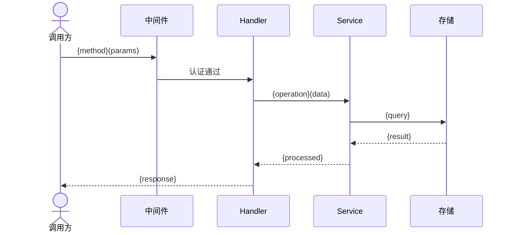

# 接口概述: {ResourceName}

> **导航**: [← 00-索引](./00-索引.md) · [↑ 接口文档](../) · [02-数据模型 →](./02-数据模型.md)
> | v{version} | {YYYY-MM-DD} | {模型} | 🌿 {branch} |

> **定位**: API 参考手册 — 查阅型。前端开发者想查某个端点参数，30 秒内定位。

---

## §1 服务身份

| 字段 | 值 |
|------|---|
| Base URL | `{/api/v1/resource}` |
| 协议 | {REST / GraphQL / gRPC} |
| 服务名称 | `{ServiceName}` |
| 所属模块 | `{module/path}` |
| 通信模式 | {同步请求-响应 / 异步消息 / 流式} |

---

## §2 端点清单

| # | 方法 | 路径 | 功能 | 认证 | 限流 |
|---|------|------|------|------|------|
| 1 | GET | `/api/v1/{resource}` | {列表查询} | {Bearer / API Key / 无} | {高/中/低} |
| 2 | POST | `/api/v1/{resource}` | {创建} | {Bearer} | {中} |
| 3 | GET | `/api/v1/{resource}/:id` | {详情} | {Bearer} | {高} |
| 4 | PUT | `/api/v1/{resource}/:id` | {更新} | {Bearer} | {中} |
| 5 | DELETE | `/api/v1/{resource}/:id` | {删除} | {Bearer} | {低} |

---

## §3 契约详情

### {端点名称} — `{METHOD} {path}`

**请求**:

| 参数位置 | 名称 | 类型 | 必填 | 说明 |
|---------|------|------|------|------|
| path | `id` | `string` | ✓ | {资源 ID} |
| query | `{param}` | `{Type}` | — | {说明} |
| body | `{field}` | `{Type}` | ✓ | {说明} |

**响应** (`200`):

```json
{
  "{field}": "{Type — 说明}"
}
```

**错误码**:

| 状态码 | 错误码 | 说明 |
|--------|--------|------|
| 400 | `{ERROR_CODE}` | {参数校验失败} |
| 401 | `UNAUTHORIZED` | {未认证} |
| 404 | `NOT_FOUND` | {资源不存在} |

> 每个端点重复此结构。

---

## §4 序列图



---

## §5 版本兼容

| 版本 | 废弃端点/字段 | Sunset 日期 | 迁移指引 |
|------|-------------|------------|---------|
| v{N} | {废弃内容} | {YYYY-MM-DD} | {迁移步骤} |

> 无废弃时注明"无"。

---

## §6 关联索引

- 数据模型: [02-数据模型.md](./02-数据模型.md)
- 中间件与安全: [03-中间件与安全.md](./03-中间件与安全.md)
- 操作场景: [04-操作场景.md](./04-操作场景.md)

> **导航**: [← 00-索引](./00-索引.md) · [02-数据模型 →](./02-数据模型.md)
