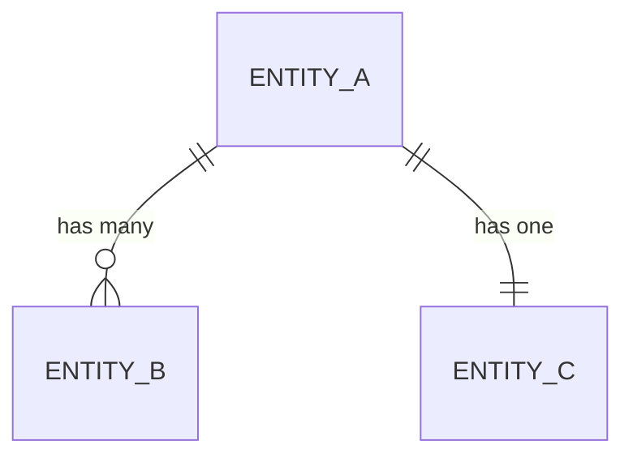

# 数据模型: {ResourceName}

> **导航**: [← 01-接口概述](./01-接口概述.md) · [↑ 00-索引](./00-索引.md) · [03-中间件与安全 →](./03-中间件与安全.md)
> | v{version} | {YYYY-MM-DD} | {模型} | 🌿 {branch} |

> **定位**: 数据字典 — 建模型文档。修改字段前先查此文档确认影响范围。

---

## §1 请求/响应 DTO

### {DtoName}

| 字段 | 类型 | 必填 | 校验规则 | 示例值 |
|------|------|------|---------|--------|
| `{field}` | `{Type}` | ✓/— | {min/max/pattern/enum} | `{example}` |

> DTO 间继承/组合关系用 mermaid classDiagram 表达。

---

## §2 ORM/持久化模型

### {EntityName}

| 字段 | 数据库类型 | 约束 | 索引 | 说明 |
|------|-----------|------|------|------|
| `{column}` | `{VARCHAR(255)}` | {NOT NULL / UNIQUE / FK} | {PRIMARY / INDEX / —} | {说明} |

### 关联关系

> 无持久化时注明"无持久化模型"。

---

## §3 存储结构

| 存储 | Key/表/集合 | 结构 | 说明 |
|------|------------|------|------|
| {DB / Redis / File} | `{key_pattern}` | `{schema}` | {用途} |

---

## §4 数据迁移

| 版本 | 变更 | 迁移策略 | 回滚方案 |
|------|------|---------|---------|
| v{N} → v{N+1} | {变更描述} | {迁移逻辑} | {回滚步骤} |

> 无迁移时注明"无迁移"。

---

## §5 容量策略

| 维度 | 约束 | 策略 |
|------|------|------|
| 单条上限 | {size limit} | {校验/截断} |
| 分页规则 | {page_size max} | {默认值/上限} |
| 清理策略 | {TTL / 定期清理} | {触发条件} |
| 归档方案 | {归档条件} | {归档目标} |

> **导航**: [← 01-接口概述](./01-接口概述.md) · [03-中间件与安全 →](./03-中间件与安全.md)
