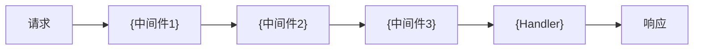

# 中间件与安全: {ResourceName}

> **导航**: [← 02-数据模型](./02-数据模型.md) · [↑ 00-索引](./00-索引.md) · [04-操作场景 →](./04-操作场景.md)
> | v{version} | {YYYY-MM-DD} | {模型} | 🌿 {branch} |

> **定位**: 安全白皮书 — 审查型。Security agent 逐项核对威胁缓解，运维核对限流配置。

---

## §1 中间件链路

| 中间件 | 职责 | 失败行为 |
|--------|------|---------|
| `{name}` | {认证/限流/日志/...} | {返回 4xx / 降级 / 记录} |

---

## §2 认证策略

| 字段 | 值 |
|------|---|
| 认证方式 | {JWT / OAuth2 / API Key / Session} |
| Token 位置 | {Authorization Header / Cookie / Query} |
| 刷新机制 | {Refresh Token / 滑动窗口 / 无} |
| 过期策略 | {TTL / 绝对过期 / 活动续期} |

---

## §3 授权策略

| 字段 | 值 |
|------|---|
| 权限模型 | {RBAC / ABAC / ACL} |
| 资源归属 | {用户级 / 组织级 / 全局} |

### 端点权限矩阵

| 端点 | 匿名 | 普通用户 | 管理员 |
|------|------|---------|--------|
| `GET /resource` | — | ✓(自己) | ✓(全部) |
| `POST /resource` | — | ✓ | ✓ |
| `DELETE /resource/:id` | — | ✓(自己) | ✓ |

---

## §4 输入校验

| 端点 | 参数 | 校验规则 | 失败响应 |
|------|------|---------|---------|
| `{METHOD path}` | `{param}` | {类型/范围/格式/白名单} | `{error_code}` |

---

## §5 威胁模型

| # | 威胁 | 信任边界 | 缓解措施 | 优先级 |
|---|------|---------|---------|--------|
| 1 | {注入/XSS/越权/重放/泄露} | {用户输入 / 外部API / 存储} | {具体缓解} | P0/P1/P2 |

---

## §6 错误码映射

| HTTP | 错误码 | 客户端消息 | 内部描述 |
|------|--------|-----------|---------|
| 400 | `{CODE}` | {用户可见消息} | {内部调试信息} |
| 401 | `UNAUTHORIZED` | 请先登录 | Token 无效或过期 |
| 403 | `FORBIDDEN` | 无权限 | 角色权限不足 |
| 404 | `NOT_FOUND` | 资源不存在 | {具体说明} |
| 429 | `RATE_LIMITED` | 请求过于频繁 | 超过限流阈值 |

---

## §7 限流与防护

| 维度 | 策略 | 阈值 | 超限响应 |
|------|------|------|---------|
| IP 级 | {令牌桶 / 固定窗口} | {N req/min} | 429 + Retry-After |
| 用户级 | {漏桶} | {N req/min} | 429 |
| 端点级 | {固定窗口} | {N req/min} | 429 |

> **导航**: [← 02-数据模型](./02-数据模型.md) · [04-操作场景 →](./04-操作场景.md)
