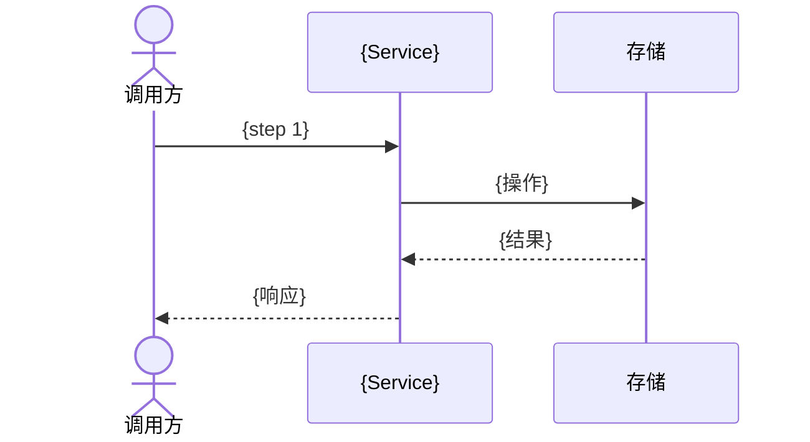
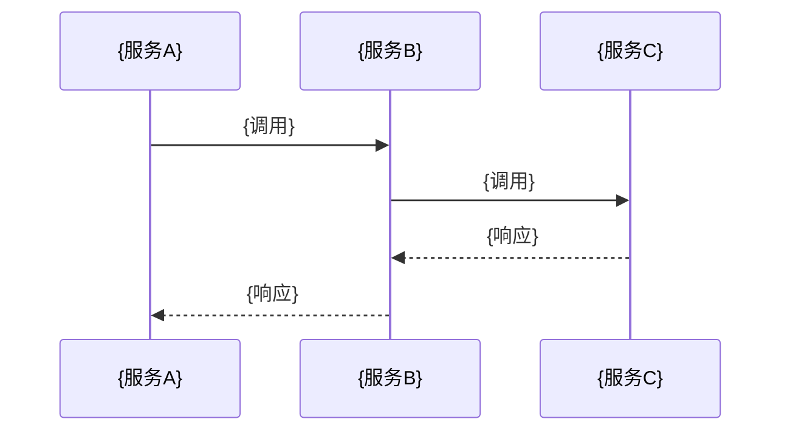

# 操作场景: {ResourceName}

> **导航**: [← 03-中间件与安全](./03-中间件与安全.md) · [↑ 00-索引](./00-索引.md)
> | v{version} | {YYYY-MM-DD} | {模型} | 🌿 {branch} |

> **定位**: 集成手册 — 联调型。前端/第三方按场景逐步对接，运维按性能约束配置告警。

---

## §1 场景总览

| # | 场景名称 | 触发方 | 前置条件 | 涉及端点 |
|---|---------|--------|---------|---------|
| S1 | {场景名} | {前端/定时任务/外部系统} | {前置条件} | `{endpoints}` |
| S2 | {场景名} | {触发方} | {前置条件} | `{endpoints}` |

---

## §2 正常调用场景

### S1: {场景名称}

**前置状态**: {系统状态描述}

**请求链**:

**后置效果**: {数据变更/事件触发/通知发送}

---

## §3 集成场景

| 服务 | 超时 | 重试 | 补偿 |
|------|------|------|------|
| `{ServiceB}` | {ms} | {次数 + 退避策略} | {补偿操作} |

> 无跨服务调用时注明"无集成场景"。

---

## §4 异常场景

| # | 场景 | 触发条件 | 响应行为 | 客户端恢复 |
|---|------|---------|---------|-----------|
| E1 | 超时 | {响应 > Nms} | {504 / 降级响应} | {重试 / 展示缓存} |
| E2 | 熔断 | {错误率 > N%} | {503 + 降级} | {等待恢复 / 备用入口} |
| E3 | 限流 | {超过阈值} | {429 + Retry-After} | {退避重试} |
| E4 | 数据不一致 | {并发写入} | {409 Conflict} | {刷新后重试} |

---

## §5 性能约束

| 维度 | 约束 | 超限降级 |
|------|------|---------|
| QPS 上限 | {N req/s} | {排队 / 拒绝} |
| 响应时间 P99 | {N ms} | {超时告警} |
| 连接池 | {max N} | {排队等待} |
| 并发上限 | {N} | {429} |
| 单次响应体 | {N MB} | {分页 / 流式} |

> **导航**: [← 03-中间件与安全](./03-中间件与安全.md) · [↑ 00-索引](./00-索引.md)
