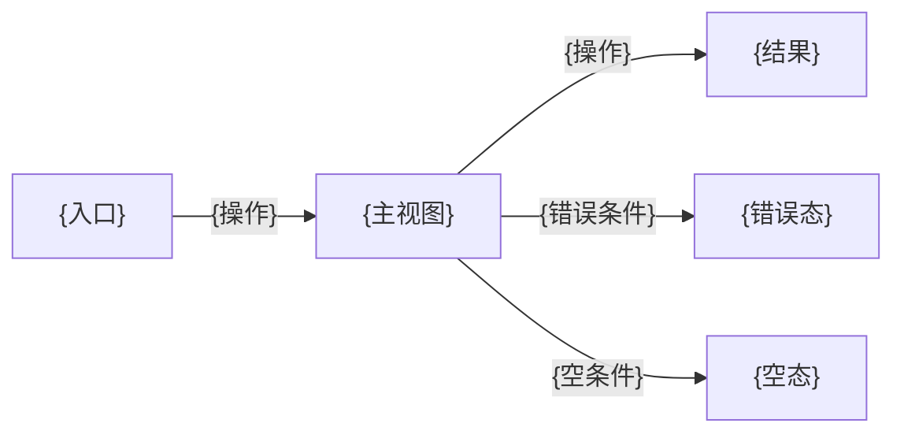
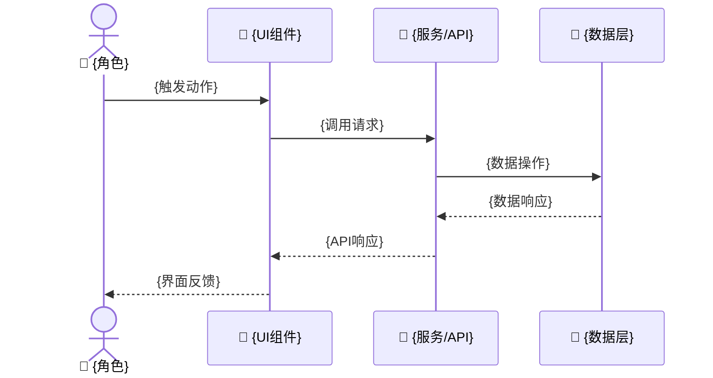
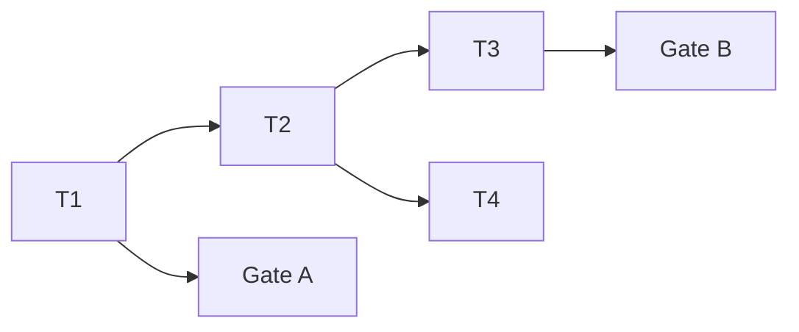

# {故事任务标题}

> **第一原则**: 内容能被人类理解和记忆，文档内说明依赖。

> | v{version} | {YYYY-MM-DD} | {模型} | {工具} | 🌿 {branch} | ⏱️ {HH:mm}–{HH:mm} | 📎 [CLAUDE.md](../CLAUDE.md) · [design-system.md](../design-system.md) |

> **证据标准**: A=已验证(附路径) · B=可推导(附规则) · C=未验证(标注 `> 待补充`) · D=禁止(视为幻觉)

> **技术评审**: 详见 [02-后端技术评审.md](./02-后端技术评审.md) 和 [03-前端技术评审.md](./03-前端技术评审.md) 和 [04-测试用例评审.md](./04-测试用例评审.md)

---

## Story 1: {故事标题}

### §1 Story（pm 定义）

| 字段 | 详情 |
|-------|--------|
| 作为 | {角色：终端用户/管理员/开发者/...} |
| 我想要 | {动作/功能：用户视角的行为描述} |
| 以便 | {价值/目的：此行为带来的可感知收益} |
| 优先级 | 🔴 P0 / 🟡 P1 / 🔵 P2 |
| 范围边界 | {此故事的范围边界：包含什么、明确不包含什么} |
| 依赖 | [{依赖的故事}](./{story-name}.md#story-N) / — |
| 子项目 | {所属子项目，从路径推断} |

**范围外**: {明确不做的内容，防止范围蔓延}

---

### §1.1 User Operations（tester 描述）

| # | 操作 | 触发条件 | 操作步骤 | 预期结果 |
|---|-----------|---------|-------------|-----------------|
| U1 | {操作名称} | {触发条件/入口} | 1. {步骤1} → 2. {步骤2} → ... | {操作完成后的预期结果} |
| U2 | {操作名称} | {触发条件/入口} | 1. {步骤1} → ... | {预期结果} |

> tester 从 AC 推导用户可见的操作路径，每个故事至少描述一条主操作流。

#### UI 交互流程（涉及 UI 改造时填写）

**视图状态**:

| 视图 | 正常 | 加载 | 空 | 错误 | 禁用 |
|------|------|------|----|------|------|
| {视图A} | {正常态描述} | {骨架屏/spinner/...} | {空文案+引导} | {错误提示+恢复} | — |
| {视图B} | {正常态描述} | {加载方式} | {空态文案} | {错误消息} | {禁用条件} |

**交互追踪**（关联 §1.1 User Operations）:

| U# | 入口 | 动作 | 系统响应 | 出口 |
|----|------|------|---------|------|
| U1 | {入口视图} | {点击/输入/手势} | {跳转/弹窗/toast/状态变更} | {出口视图} |
| U2 | {入口视图} | {操作} | {响应} | {出口视图} |

> 涉及 UI 的故事补充交互流程、视图状态和交互追踪。非 UI 故事省略此节，标注"非 UI 故事，§1.1 仅含 User Operations"。

---

### §2 Requirements（pm 描述）

#### 功能点

| FP# | 描述 | 输入 | 输出 | 错误行为 | 优先级 |
|-----|-------------|-------|--------|---------------|----------|
| FP1 | {功能点描述} | {输入及约束} | {预期输出} | {错误时行为及用户提示} | 🔴/🟡/🔵 |
| FP2 | {功能点描述} | {输入及约束} | {预期输出} | {错误时行为} | 🔴/🟡/🔵 |

#### 业务规则

| 规则# | 描述 | 校验方式 | 证据级别 |
|-------|-------------|-------------|----------|
| R1 | {业务规则描述} | {前端校验 / 后端校验 / 两端校验} | A/B/C |
| R2 | {业务规则描述} | {校验方式} | A/B/C |

#### 数据约束

| 约束 | 类型 | 范围/格式 | 来源 |
|------------|------|-------------|--------|
| {字段/参数} | {string/int/date/...} | {长度/范围/格式约束} | {AC / 业务规则 / API 契约} |

> 每条业务规则和数据约束标注证据级别（A/B/C）。C 级约束标注 `> 待补充`。

---

### §3 Design（coder + security 描述）

#### 扩展影响分析

| 影响面 | 变更 | 说明 |
|--------|------|------|
| manifest.json | 新增权限 / 新增 content_scripts / 新增 web_accessible_resources / 无 | {具体变更} |
| Background Service Worker | 新增消息监听 / 修改现有监听 / 无 | {具体变更} |
| Content Script 加载顺序 | 需调整 / 无 | {新增脚本需插入的位置及依赖理由} |
| 存储结构 (chrome.storage.local) | 新增 key / 修改现有 key / 无 | {key 名、默认值、迁移策略} |
| 跨上下文通信 | 新增 message 类型 / 修改现有 / 无 | {消息格式、发送方、接收方} |

> Content Script 禁止 ES modules，所有新增文件必须以 IIFE 封装挂载到 `window.PetManager` 命名空间。manifest.json 的 content_scripts.js 数组按依赖顺序排列。

#### 技术设计（coder 描述）

| 模块 | 文件 | 职责 | 变更类型 |
|--------|------|---------------|-------------|
| {模块} | {路径} | {职责} | 新增 / 修改 / 复用 |
| {模块} | {路径} | {职责} | 新增 / 修改 / 复用 |

**数据流**:

| 流程 | 来源 | 目标 | 数据 | 转换 |
|------|------|----|------|-----------|
| F1 | {来源} | {目标} | {数据描述} | {转换逻辑} |

#### 安全约束（security 注入，涉及安全面时填写）

| # | 威胁 | 信任边界 | 缓解措施 | 优先级 |
|---|--------|---------------|-----------|----------|
| 1 | {威胁描述} | {信任边界：用户输入/外部API/内部服务} | {缓解措施} | P0/P1/P2 |

> security 仅在故事涉及用户输入、外部 API、认证/授权、数据持久化、第三方集成时注入。不涉及安全面时删除此节。

---

### §4 Tasks（pm + coder + security + reporter 拆解）

| ID | 描述 | 工作量 | 依赖 | 交付物 | Agent | 门禁 |
|----|-------------|--------|---------|-------------|-------|------|
| T1 | {pm: 故事拆解/协调/验收} | S/M/L | — | {产出文件} | pm | — |
| T2 | {coder: 实现模块A} | S/M/L | T1 | {源代码} | coder | — |
| T3 | {coder: 实现模块B} | S/M/L | T2 | {源代码} | coder | — |
| T4 | {security: 安全审查/输入消毒} | S/M/L | T2 | {审查报告} | security | — |
| T5 | {tester: 测试方案+原型(Gate A)} | S/M/L | T1 | {测试方案+原型} | tester | Gate A |
| T6 | {tester: 冒烟验证(Gate B)} | S/M/L | T2,T3 | {验证报告} | tester | Gate B |
| T7 | {reporter: 过程记录/依赖映射} | S/M/L | — | {文档/日志} | reporter | — |

**任务依赖图**:

> pm 为主体拆解，各 agent 注入专业任务。非安全面故事省略 T4。Gate A 阻断实现阶段，Gate B >2 轮修复阻断交付。

---

### §5 Acceptance Criteria（tester 定义）

| AC# | 验收条件（可度量） | 测试方法 | 预期结果 | 门禁 |
|-----|------------------------|-------------|-----------------|------|
| AC1 | {可度量的验收条件} | `{命令/操作}` | {可验证的预期结果} | Gate A |
| AC2 | {可度量的验收条件} | `{命令/操作}` | {可验证的预期结果} | Gate A |
| AC3 | {可度量的验收条件} | `{命令/操作}` | {可验证的预期结果} | Gate B |
| AC4 | {可度量的验收条件} | `{命令/操作}` | {可验证的预期结果} | Gate B |

> 每个 AC 必须可度量、可验证。Gate A 在测试先行阶段验证，Gate B 在验证阶段验证。

---

