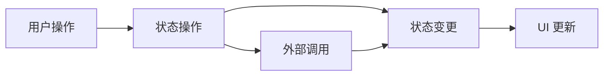
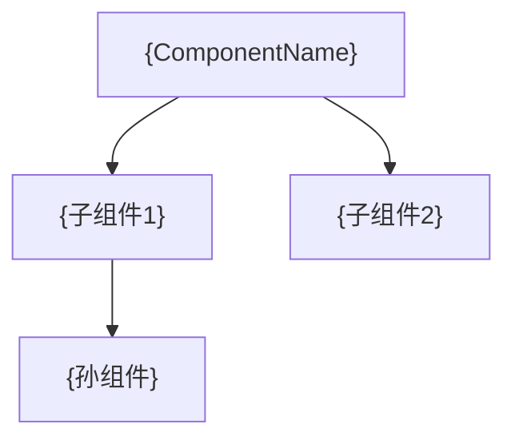

# 状态与依赖: {ComponentName}

> **导航**: [← 01-组件概述](./01-组件概述.md) · [↑ 00-索引](./00-索引.md) · [03-样式与交互 →](./03-样式与交互.md)
> | v{version} | {YYYY-MM-DD} | {模型} | 🌿 {branch} |

> **定位**: 架构蓝图 — 理解型。改一个状态字段前，先看这张图知道会波及谁。

---

## §1 状态全景

| 字段 | 类型 | 初始值 | 来源 | 分类 | 持久化 |
|------|------|--------|------|------|--------|
| `{field}` | `{Type}` | `{default}` | {Props / 内部 / Store / API} | {响应式 / 派生 / 方法} | {是/否} |

---

## §2 状态流图

> 标注每条路径的触发条件和副作用。

---

## §3 子组件依赖

| 子组件 | Props 透传 | 事件冒泡 |
|--------|-----------|---------|
| `{ChildName}` | `{透传的 Props}` | `{冒泡的 Events}` |

> 无子组件时注明"无子组件"。

---

## §4 外部引用

### Composables / Hooks

| 路径 | 函数 | 用途 |
|------|------|------|
| `{path}` | `{useSomething()}` | {用途} |

### Store 引用

| Store | 字段 | 操作 |
|-------|------|------|
| `{storeName}` | `{field}` | {读取 / 写入 / 订阅} |

### 第三方库

| 库 | 版本 | 用途 |
|----|------|------|
| `{lib}` | `{version}` | {用途} |

---

## §5 生命周期

| 阶段 | 操作 | 说明 |
|------|------|------|
| 挂载 | {初始化逻辑} | {订阅/请求/DOM 操作} |
| 更新 | {响应变更} | {条件/防抖/节流} |
| 卸载 | {清理逻辑} | {取消订阅/移除监听/清除定时器} |

> **导航**: [← 01-组件概述](./01-组件概述.md) · [03-样式与交互 →](./03-样式与交互.md)
