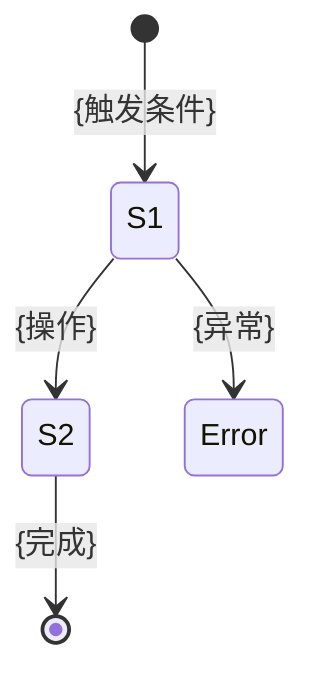

# 操作场景: {ComponentName}

> **导航**: [← 03-样式与交互](./03-样式与交互.md) · [↑ 00-索引](./00-索引.md)
> | v{version} | {YYYY-MM-DD} | {模型} | 🌿 {branch} |

> **定位**: 用户手册 — 验证型。测试者按场景逐条验证，产品核对交互是否符合预期。

---

## §1 场景总览

| # | 场景名称 | 触发角色 | 前置条件 | 覆盖 Props/Events |
|---|---------|---------|---------|-----------------|
| S1 | {场景名} | {用户/系统/外部} | {前置条件} | `{prop}` / `{event}` |
| S2 | {场景名} | {角色} | {前置条件} | `{prop}` / `{event}` |

---

## §2 正常场景

### S1: {场景名称}

| Given | When | Then |
|-------|------|------|
| {前置状态：组件已挂载，Props 为 X} | {用户操作：点击/输入/...} | {UI 结果 + Event 输出} |

### S2: {场景名称}

| Given | When | Then |
|-------|------|------|
| {前置状态} | {用户操作} | {预期结果} |

---

## §3 边界场景

| # | 场景 | Given | When | Then |
|---|------|-------|------|------|
| B1 | 空数据 | {Props 为空/undefined} | {渲染组件} | {空态展示，无报错} |
| B2 | 极限值 | {Props 超长/超大} | {渲染组件} | {截断/滚动/提示} |
| B3 | 并发操作 | {快速连续触发} | {多次操作} | {防抖/节流/幂等} |
| B4 | 权限不足 | {无权限状态} | {尝试操作} | {禁用态/提示} |

---

## §4 异常场景

| # | 场景 | Given | When | Then |
|---|------|-------|------|------|
| E1 | 加载失败 | {依赖资源不可达} | {组件初始化} | {错误态展示 + 重试入口} |
| E2 | 超时 | {外部调用超时} | {等待响应} | {超时提示 + 恢复操作} |
| E3 | 数据校验失败 | {Props 类型不匹配} | {传入非法值} | {降级展示 / console.warn} |

> **导航**: [← 03-样式与交互](./03-样式与交互.md) · [↑ 00-索引](./00-索引.md)
