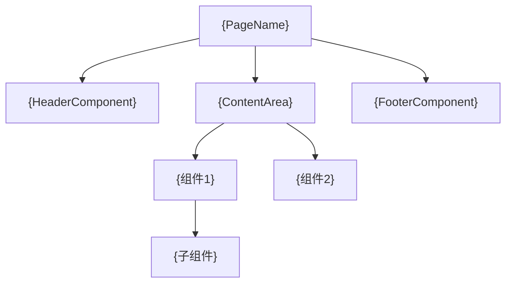

# 组件编排: {PageName}

> **导航**: [← 01-页面概述](./01-页面概述.md) · [↑ 00-索引](./00-索引.md) · [03-交互流程 →](./03-交互流程.md)
> | v{version} | {YYYY-MM-DD} | {模型} | 🌿 {branch} |

---

## §1 组件树

---

## §2 组件清单

| 组件 | 文件路径 | Props 透传 | 职责 |
|------|---------|-----------|------|
| `{ComponentName}` | `{path}` | `{props from page}` | {在页面中的职责} |

---

## §3 组件间通信

| 通信方式 | 发送方 | 接收方 | 数据 |
|---------|--------|--------|------|
| Props | {Page} | {Child} | `{data}` |
| Event | {Child} | {Page} | `{eventData}` |
| Store | {ComponentA} | {ComponentB} | `{storeField}` |
| EventBus | {ComponentA} | {ComponentB} | `{eventName}` |

---

## §4 懒加载策略

| 组件 | 加载方式 | 触发条件 | 占位 |
|------|---------|---------|------|
| `{HeavyComponent}` | {动态 import / 条件渲染} | {可见时 / 交互时} | {Skeleton / Spinner} |

> 无懒加载时注明"全部同步加载"。

---

## §5 命名空间

| 组件 | 注册路径 | 作用域 |
|------|---------|--------|
| `{Name}` | `{Namespace}.{Module}` | {页面级 / 全局} |

> **导航**: [← 01-页面概述](./01-页面概述.md) · [03-交互流程 →](./03-交互流程.md)
